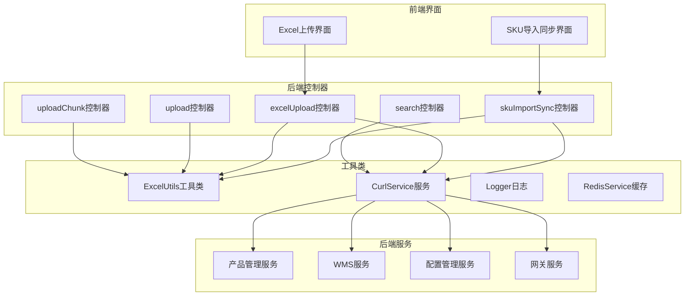
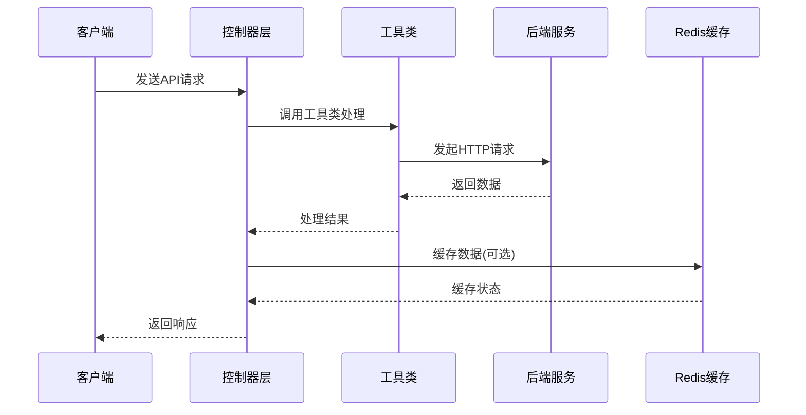
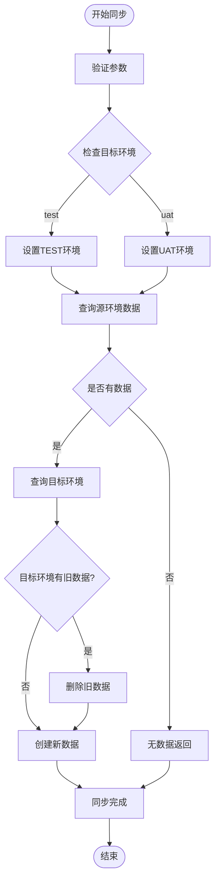
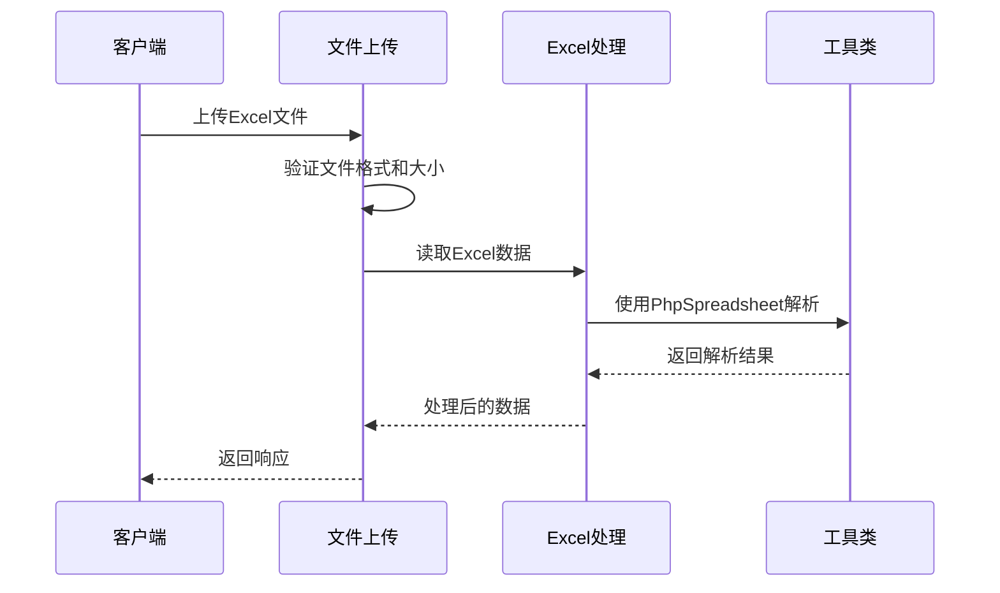
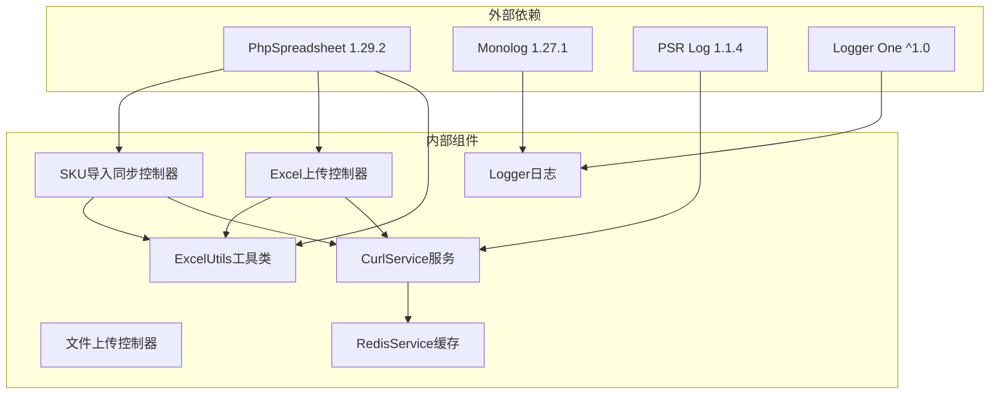

# API接口文档

<cite>
**本文档引用的文件**
- [skuImportSync.php](file://php/controller/skuImportSync.php)
- [excelUpload.php](file://php/controller/excelUpload.php)
- [upload.php](file://php/controller/upload.php)
- [uploadChunk.php](file://php/controller/uploadChunk.php)
- [search.php](file://php/controller/search.php)
- [ExcelUtils.php](file://php/utils/ExcelUtils.php)
- [CurlService.php](file://php/curl/CurlService.php)
- [Logger.php](file://php/class/Logger.php)
- [RedisService.php](file://php/redis/RedisService.php)
- [skuImportSync.html](file://template/fix/skuImportSync.html)
- [excelUpload.html](file://template/excelUpload.html)
- [composer.json](file://composer.json)
- [config.json](file://php/json/config.json)
</cite>

## 目录
1. [简介](#简介)
2. [项目结构](#项目结构)
3. [核心组件](#核心组件)
4. [架构概览](#架构概览)
5. [详细组件分析](#详细组件分析)
6. [依赖关系分析](#依赖关系分析)
7. [性能考虑](#性能考虑)
8. [故障排除指南](#故障排除指南)
9. [结论](#结论)
10. [附录](#附录)

## 简介

PaSystem是一个基于PHP的Web应用系统，主要提供SKU数据导入与同步、Excel文件处理、文件上传等功能。该系统采用RESTful API设计，通过多个控制器模块提供不同的业务功能。

系统的核心特点：
- **多环境支持**：支持test、uat、pro等多种运行环境
- **Excel处理能力**：基于PhpSpreadsheet库提供强大的Excel文件读写功能
- **分布式架构**：通过CurlService统一管理后端服务调用
- **日志监控**：集成MyLogger提供详细的操作日志记录
- **Redis集成**：使用Redis进行缓存和会话管理

## 项目结构



**图表来源**
- [skuImportSync.php](file://php/controller/skuImportSync.php#L1-L512)
- [excelUpload.php](file://php/controller/excelUpload.php#L1-L372)
- [CurlService.php](file://php/curl/CurlService.php#L1-L996)

**章节来源**
- [skuImportSync.php](file://php/controller/skuImportSync.php#L1-L50)
- [excelUpload.php](file://php/controller/excelUpload.php#L1-L50)
- [composer.json](file://composer.json#L1-L11)

## 核心组件

### SKU导入同步控制器
负责处理SKU数据的导入、解析和同步到不同环境的功能。支持多种SKU字段类型和目标模块的同步。

### Excel文件上传控制器
提供Excel文件的上传、解析和数据预览功能，支持单文件和多文件上传。

### 文件上传控制器
基础文件上传功能，支持标准文件上传和分片上传两种方式。

### 搜索控制器
提供多种业务查询功能，包括翻译管理、CE资料、产品线修复等。

**章节来源**
- [skuImportSync.php](file://php/controller/skuImportSync.php#L12-L77)
- [excelUpload.php](file://php/controller/excelUpload.php#L11-L95)
- [upload.php](file://php/controller/upload.php#L4-L61)
- [search.php](file://php/controller/search.php#L12-L24)

## 架构概览



**图表来源**
- [CurlService.php](file://php/curl/CurlService.php#L664-L740)
- [RedisService.php](file://php/redis/RedisService.php#L15-L19)

系统采用分层架构设计：
- **表现层**：HTML界面和API接口
- **控制层**：PHP控制器处理业务逻辑
- **服务层**：CurlService统一管理后端服务调用
- **数据层**：Redis缓存和文件存储

## 详细组件分析

### SKU同步API

#### 接口定义
- **HTTP方法**：POST
- **URL模式**：`/php/controller/skuImportSync.php`
- **请求参数**：

| 参数名 | 类型 | 必填 | 描述 | 示例 |
|--------|------|------|------|------|
| action | string | 是 | 操作类型 | parse/sync/downloadTemplate |
| excelFile | file | 否 | Excel文件 | - |
| skuId | string | 否 | SKU标识符 | a25010100ux0001 |
| module | string | 否 | 目标模块 | amazon_asins |
| port | string | 否 | 服务端口 | s3015 |
| field | string | 否 | 查询字段 | skuId/productId |
| targetEnv | string | 否 | 目标环境 | test/uat |

#### 响应格式
```json
{
  "success": true,
  "message": "操作成功描述",
  "data": {
    "skuList": ["SKU1", "SKU2"],
    "count": 2,
    "fileName": "文件名",
    "uniqueName": "唯一文件名"
  }
}
```

#### 同步流程图


**图表来源**
- [skuImportSync.php](file://php/controller/skuImportSync.php#L278-L426)

**章节来源**
- [skuImportSync.php](file://php/controller/skuImportSync.php#L40-L77)
- [skuImportSync.php](file://php/controller/skuImportSync.php#L278-L426)

### Excel处理API

#### 接口定义
- **HTTP方法**：POST
- **URL模式**：`/php/controller/excelUpload.php`
- **请求参数**：

| 参数名 | 类型 | 必填 | 描述 | 示例 |
|--------|------|------|------|------|
| excelFile | file | 否 | Excel文件 | - |
| hasHeader | boolean | 否 | 是否有表头 | true |
| previewRows | integer | 否 | 预览行数 | 10 |

#### 响应格式
```json
{
  "success": true,
  "message": "文件上传并处理成功",
  "data": {
    "fileName": "原始文件名",
    "uniqueName": "唯一文件名",
    "filePath": "文件路径",
    "rowCount": 100,
    "columnCount": 10,
    "headers": ["列1", "列2"],
    "rows": [...],
    "preview": [...]
  }
}
```

#### 处理流程


**图表来源**
- [excelUpload.php](file://php/controller/excelUpload.php#L35-L95)
- [ExcelUtils.php](file://php/utils/ExcelUtils.php#L147-L181)

**章节来源**
- [excelUpload.php](file://php/controller/excelUpload.php#L35-L95)
- [ExcelUtils.php](file://php/utils/ExcelUtils.php#L147-L181)

### 文件上传API

#### 基础上传接口
- **HTTP方法**：POST
- **URL模式**：`/php/controller/upload.php`
- **支持的文件类型**：xlsx, xls

#### 分片上传接口
- **HTTP方法**：POST
- **URL模式**：`/php/controller/uploadChunk.php`

#### 上传参数
| 参数名 | 类型 | 必填 | 描述 |
|--------|------|------|------|
| fileToUpload | file | 否 | 单文件上传 |
| fileToUploadOss | file | 否 | OSS文件上传 |
| file | file | 否 | 分片文件 |
| filename | string | 否 | 文件名 |
| chunkIndex | integer | 否 | 分片索引 |
| totalChunks | integer | 否 | 总分片数 |

**章节来源**
- [upload.php](file://php/controller/upload.php#L15-L60)
- [uploadChunk.php](file://php/controller/uploadChunk.php#L15-L78)

### 搜索查询API

#### 接口定义
- **HTTP方法**：POST
- **URL模式**：`/php/controller/search.php`
- **请求参数**：

| 参数名 | 类型 | 必填 | 描述 |
|--------|------|------|------|
| action | string | 是 | 查询类型 | fixTranslationManagements/fixCeMaterials |
| params | object | 否 | 查询参数 | - |

#### 支持的查询类型

| 功能类型 | 描述 | 关键参数 |
|----------|------|----------|
| fixTranslationManagements | 翻译管理查询 | title: 标题关键字 |
| fixCeMaterials | CE资料查询 | title: CE单号 |
| paFbaChannelSellerConfig | FBA渠道配置 | action: searchAllConfig/searchChannelStock |
| paSampleSku | 样品SKU查询 | skuIdList: SKU列表 |
| paFixProductLine | 产品线修复 | skuIdList: SKU列表 |
| uploadOss | OSS文件扫描 | searchData: 搜索数据, isExport: 是否导出 |
| registerIp | IP登记 | getUserInfo: 获取用户信息, recordVisit: 记录访问 |
| getClientIp | 获取客户端IP | - |
| fixFcuProductLine | FCU产品线修复 | fcuIdList: FCU列表 |
| consignmentQD | 寄卖QD单 | - |
| skuPhotoFix | 拍摄工单修复 | skuList: SKU列表 |
| fixCurrency | 币种修复 | skuIdList: SKU列表, channels: 渠道列表 |

**章节来源**
- [search.php](file://php/controller/search.php#L32-L717)

## 依赖关系分析



**图表来源**
- [composer.json](file://composer.json#L2-L9)
- [skuImportSync.php](file://php/controller/skuImportSync.php#L2-L6)

**章节来源**
- [composer.json](file://composer.json#L1-L11)

## 性能考虑

### 文件处理优化
- **内存管理**：使用PhpSpreadsheet的内存管理机制，避免大文件导致内存溢出
- **分片上传**：支持大文件分片上传，减少单次传输压力
- **缓存策略**：Redis缓存常用查询结果，减少重复计算

### 并发处理
- **异步处理**：大量SKU同步时采用队列处理机制
- **连接池**：CurlService复用HTTP连接，减少连接建立开销
- **超时控制**：设置合理的请求超时时间，避免长时间阻塞

### 监控指标
- **响应时间**：记录每个API的处理时间和错误率
- **资源使用**：监控CPU、内存、磁盘空间使用情况
- **并发数**：跟踪同时处理的请求数量

## 故障排除指南

### 常见错误及解决方案

#### 文件上传错误
| 错误代码 | 错误描述 | 解决方案 |
|----------|----------|----------|
| UPLOAD_ERR_INI_SIZE | 文件大小超过服务器限制 | 减小文件大小或调整PHP配置 |
| UPLOAD_ERR_PARTIAL | 文件只有部分被上传 | 检查网络连接稳定性 |
| UPLOAD_ERR_NO_FILE | 没有文件被上传 | 确认表单包含正确的文件输入字段 |
| 400 | 文件保存失败 | 检查上传目录权限和磁盘空间 |

#### Excel处理错误
| 错误类型 | 可能原因 | 解决方案 |
|----------|----------|----------|
| 无法读取Excel文件 | 文件格式不支持或损坏 | 确认文件格式为xlsx或xls |
| 内存不足 | 文件过大导致内存溢出 | 使用分片上传或增加服务器内存 |
| 解析失败 | Excel文件结构异常 | 检查Excel文件的表头和数据格式 |

#### 网络请求错误
| HTTP状态码 | 错误原因 | 解决方案 |
|------------|----------|----------|
| 401 | 未授权访问 | 检查Authorization头部和令牌有效性 |
| 404 | 服务端点不存在 | 确认目标服务地址和端口配置 |
| 429 | 请求过于频繁 | 实现重试机制和退避算法 |
| 500 | 服务器内部错误 | 检查后端服务状态和日志 |

**章节来源**
- [skuImportSync.php](file://php/controller/skuImportSync.php#L433-L471)
- [excelUpload.php](file://php/controller/excelUpload.php#L102-L140)

## 结论

PaSystem提供了完整的SKU数据管理和Excel文件处理解决方案。系统具有以下优势：

1. **功能完整性**：涵盖从文件上传到数据同步的全流程
2. **架构清晰**：分层设计便于维护和扩展
3. **性能优化**：支持大文件处理和并发请求
4. **监控完善**：详细的日志记录和错误处理机制

建议在生产环境中：
- 配置适当的文件大小限制和超时设置
- 实施用户身份验证和访问控制
- 建立完善的监控和告警机制
- 定期备份重要数据和配置文件

## 附录

### 版本管理
系统使用Git进行版本控制，推荐采用语义化版本管理：
- 主版本号：重大架构变更
- 次版本号：新增功能但向后兼容
- 修订号：bug修复和小改进

### 安全最佳实践
- 实施HTTPS加密传输
- 验证和清理用户输入
- 限制文件上传类型和大小
- 实施访问频率限制
- 定期更新依赖包

### 开发环境配置
- PHP版本：推荐7.4+
- 扩展：ext-redis, ext-json
- 依赖管理：Composer
- 开发工具：IDE + Git