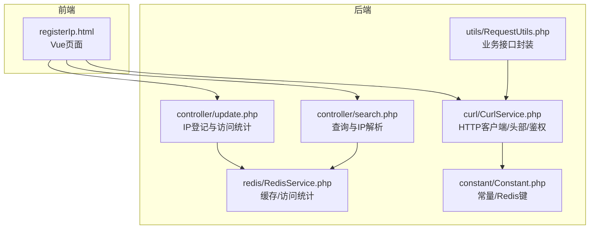
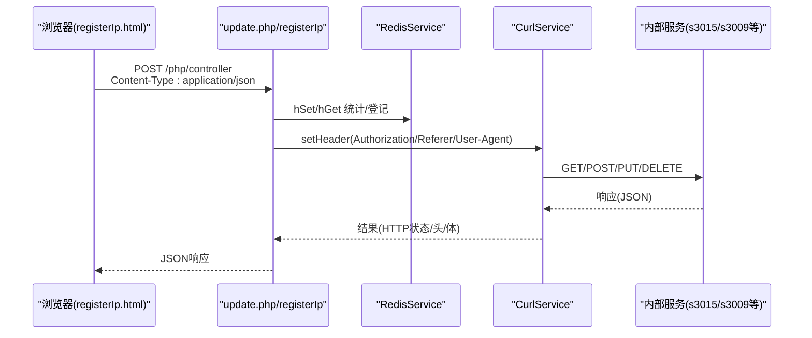
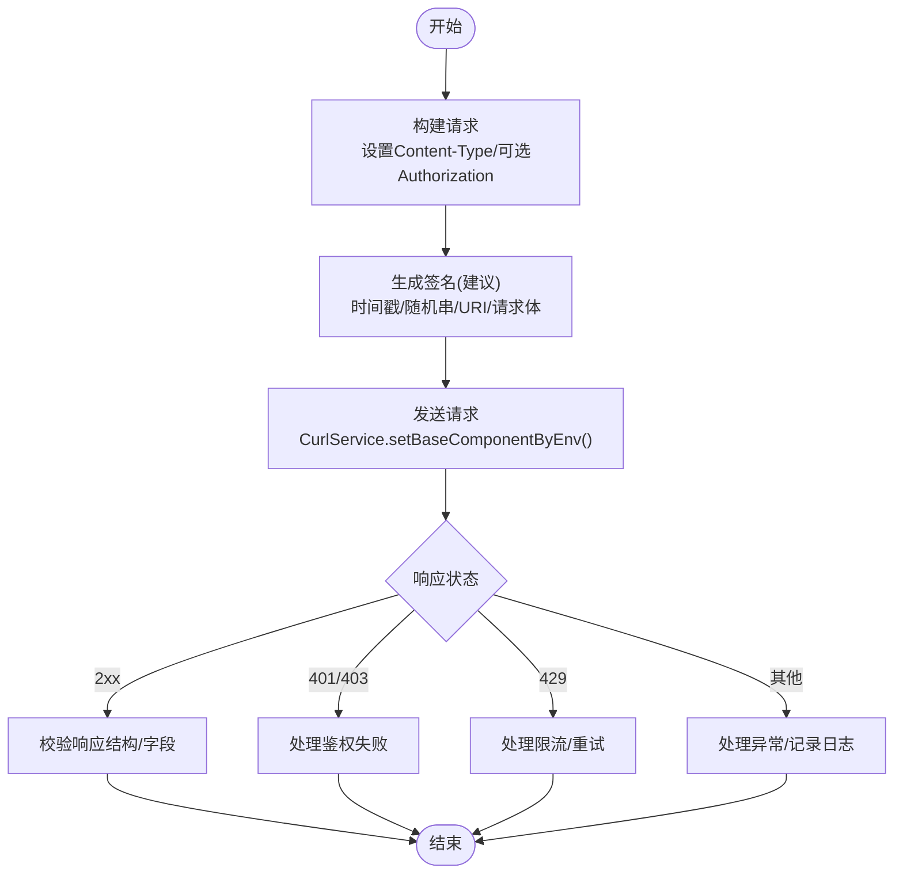
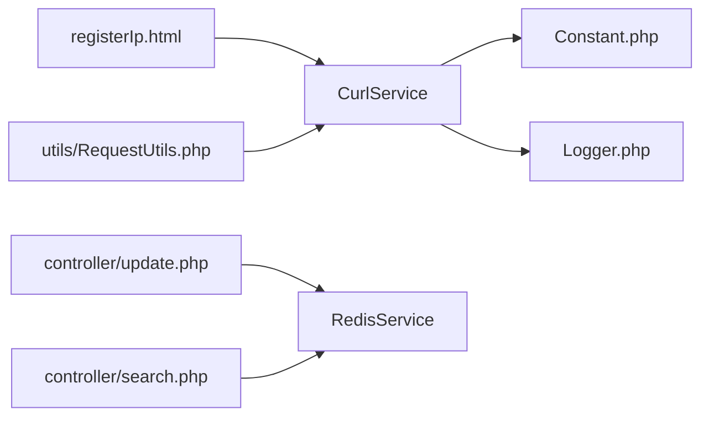

# API认证与安全

<cite>
**本文引用的文件**
- [php/common.php](file://php/common.php)
- [php/constant/Constant.php](file://php/constant/Constant.php)
- [php/curl/CurlService.php](file://php/curl/CurlService.php)
- [php/redis/RedisService.php](file://php/redis/RedisService.php)
- [php/utils/RequestUtils.php](file://php/utils/RequestUtils.php)
- [php/controller/search.php](file://php/controller/search.php)
- [php/controller/update.php](file://php/controller/update.php)
- [template/fix/registerIp.html](file://template/fix/registerIp.html)
- [composer.json](file://composer.json)
</cite>

## 目录
1. [简介](#简介)
2. [项目结构](#项目结构)
3. [核心组件](#核心组件)
4. [架构总览](#架构总览)
5. [详细组件分析](#详细组件分析)
6. [依赖关系分析](#依赖关系分析)
7. [性能考量](#性能考量)
8. [故障排查指南](#故障排查指南)
9. [结论](#结论)
10. [附录](#附录)

## 简介
本文件面向PaSystem系统，聚焦API认证与安全，涵盖以下主题：
- 认证机制：API密钥、请求签名、IP白名单现状与建议
- HTTP头部参数要求：Authorization、Content-Type、User-Agent、Referer
- 完整认证流程示例：请求构建、签名生成、响应校验
- 安全防护：CSRF、XSS、SQL注入防护现状与建议
- 访问频率限制与防滥用：现状与建议
- 安全最佳实践与常见问题解决方案

说明：当前仓库未发现显式的API密钥管理、请求签名验证与IP白名单实现；本文在“现状”基础上提供“建议”以指导后续增强。

## 项目结构
PaSystem后端采用PHP控制器与工具层协作，前端通过Vue页面发起请求，后端通过CurlService统一访问内部服务。Redis用于缓存与访问统计。

图表来源
- [template/fix/registerIp.html](file://template/fix/registerIp.html#L312-L321)
- [php/controller/update.php](file://php/controller/update.php#L573-L635)
- [php/controller/search.php](file://php/controller/search.php#L388-L400)
- [php/utils/RequestUtils.php](file://php/utils/RequestUtils.php#L1-L672)
- [php/curl/CurlService.php](file://php/curl/CurlService.php#L74-L92)
- [php/redis/RedisService.php](file://php/redis/RedisService.php#L1-L77)
- [php/constant/Constant.php](file://php/constant/Constant.php#L1-L26)

章节来源
- [php/common.php](file://php/common.php#L1-L9)
- [php/constant/Constant.php](file://php/constant/Constant.php#L1-L26)
- [php/curl/CurlService.php](file://php/curl/CurlService.php#L74-L92)
- [php/redis/RedisService.php](file://php/redis/RedisService.php#L1-L77)
- [php/utils/RequestUtils.php](file://php/utils/RequestUtils.php#L1-L672)
- [php/controller/search.php](file://php/controller/search.php#L388-L400)
- [php/controller/update.php](file://php/controller/update.php#L573-L635)
- [template/fix/registerIp.html](file://template/fix/registerIp.html#L312-L321)

## 核心组件
- HTTP客户端与鉴权
  - CurlService负责统一设置请求头、模块路由、鉴权头、User-Agent、Referer、超时与SSL策略，并封装REST方法。
- 缓存与访问统计
  - RedisService提供哈希读写、过期控制、计数等能力；常量文件定义Redis键空间。
- 控制器
  - search.php提供IP解析与最近访问统计；update.php提供IP登记与访问统计。
- 工具层
  - RequestUtils封装对多业务模块的REST调用，便于上层复用。
- 前端页面
  - registerIp.html通过Axios向后端发起请求，设置Content-Type为application/json。

章节来源
- [php/curl/CurlService.php](file://php/curl/CurlService.php#L74-L92)
- [php/redis/RedisService.php](file://php/redis/RedisService.php#L1-L77)
- [php/constant/Constant.php](file://php/constant/Constant.php#L1-L26)
- [php/controller/search.php](file://php/controller/search.php#L388-L400)
- [php/controller/update.php](file://php/controller/update.php#L573-L635)
- [php/utils/RequestUtils.php](file://php/utils/RequestUtils.php#L1-L672)
- [template/fix/registerIp.html](file://template/fix/registerIp.html#L312-L321)

## 架构总览
下图展示从浏览器到后端控制器、再到内部服务的典型调用链路，以及鉴权头与头部配置的来源。

图表来源
- [template/fix/registerIp.html](file://template/fix/registerIp.html#L312-L321)
- [php/controller/update.php](file://php/controller/update.php#L573-L635)
- [php/redis/RedisService.php](file://php/redis/RedisService.php#L29-L51)
- [php/curl/CurlService.php](file://php/curl/CurlService.php#L664-L740)

## 详细组件分析

### HTTP头部参数与鉴权现状
- Content-Type
  - 前端默认设置为application/json；CurlService默认头也包含application/json；建议保持一致。
- Authorization
  - CurlService支持通过gateway()动态设置Authorization头（Bearer Token），并按环境切换；当前前端未设置Authorization。
- User-Agent
  - CurlService设置了固定User-Agent；前端未覆盖。
- Referer
  - CurlService设置了固定Referer；前端未覆盖。
- CORS
  - php/common.php设置了跨域头，允许任意源与部分头，建议在生产收紧。

章节来源
- [template/fix/registerIp.html](file://template/fix/registerIp.html#L312-L321)
- [php/curl/CurlService.php](file://php/curl/CurlService.php#L74-L92)
- [php/curl/CurlService.php](file://php/curl/CurlService.php#L688-L690)
- [php/curl/CurlService.php](file://php/curl/CurlService.php#L688-L690)
- [php/common.php](file://php/common.php#L4-L8)

### API密钥管理与请求签名
- 现状
  - 未发现显式API密钥存储、发放、轮换与签名校验逻辑。
- 建议
  - 密钥管理：使用受控密钥库或配置中心，密钥分环境、分应用管理，支持轮换与撤销。
  - 请求签名：对请求体与元数据（时间戳、随机串、URI）进行签名，服务端校验签名与有效期。
  - 传输安全：强制HTTPS，拒绝明文传输。

章节来源
- [php/curl/CurlService.php](file://php/curl/CurlService.php#L270-L290)

### IP白名单
- 现状
  - 未发现IP白名单实现。
- 建议
  - 在入口处根据客户端真实IP进行白名单校验；支持网段与精确IP；记录审计日志。

章节来源
- [php/controller/search.php](file://php/controller/search.php#L388-L400)

### CSRF防护
- 现状
  - 未发现CSRF令牌机制或同站请求校验。
- 建议
  - 对有状态写操作使用CSRF令牌；校验Origin/Referer；对跨站请求严格限制。

章节来源
- [php/curl/CurlService.php](file://php/curl/CurlService.php#L688-L690)

### XSS防护
- 现状
  - 未发现前端XSS过滤；前端使用Bootstrap JS，具备默认HTML白名单清理函数（sanitizeHtml）。
- 建议
  - 输入输出均进行严格的HTML转义与上下文适配；对富文本输入采用白名单策略；避免内联事件与动态eval。

章节来源
- [template/css_js/bootstrap-5.3.0/js/bootstrap.js](file://template/css_js/bootstrap-5.3.0/js/bootstrap.js#L2952-L2999)
- [template/css_js/bootstrap-5.3.0/js/bootstrap.bundle.js](file://template/css_js/bootstrap-5.3.0/js/bootstrap.bundle.js#L4779-L4826)
- [template/css_js/bootstrap-5.3.0/js/bootstrap.esm.js](file://template/css_js/bootstrap-5.3.0/js/bootstrap.esm.js#L2929-L2980)

### SQL注入防护
- 现状
  - 未发现直接数据库访问代码；业务通过内部服务REST调用，间接降低风险。
- 建议
  - 若引入直接数据库访问，必须使用参数化查询或ORM；对所有外部输入进行严格校验与转义。

章节来源
- [php/utils/RequestUtils.php](file://php/utils/RequestUtils.php#L1-L672)

### 访问频率限制与防滥用
- 现状
  - 未发现速率限制与防滥用机制。
- 建议
  - 基于IP/用户/密钥维度实施限流（令牌桶/漏桶）；对异常行为触发熔断与告警；记录访问日志。

章节来源
- [php/redis/RedisService.php](file://php/redis/RedisService.php#L68-L71)

### 认证流程示例（建议）
- 请求构建
  - 前端设置Content-Type为application/json；如需鉴权，设置Authorization头（Bearer Token）。
- 签名生成（建议）
  - 对请求体与元数据（时间戳、随机串、URI）进行签名；服务端校验签名与有效期。
- 发送请求
  - 通过CurlService统一发送，确保User-Agent与Referer符合预期。
- 响应验证
  - 校验HTTP状态码与JSON结构；对敏感字段进行脱敏输出。

图表来源
- [template/fix/registerIp.html](file://template/fix/registerIp.html#L312-L321)
- [php/curl/CurlService.php](file://php/curl/CurlService.php#L664-L740)
- [php/curl/CurlService.php](file://php/curl/CurlService.php#L270-L290)

## 依赖关系分析
- 组件耦合
  - 前端registerIp.html依赖CurlService与控制器；控制器依赖RedisService；工具层RequestUtils依赖CurlService。
- 外部依赖
  - composer.json声明了日志与Redis扩展，以及PHPExcel库；与认证安全无直接关联。

图表来源
- [template/fix/registerIp.html](file://template/fix/registerIp.html#L312-L321)
- [php/curl/CurlService.php](file://php/curl/CurlService.php#L1-L80)
- [php/constant/Constant.php](file://php/constant/Constant.php#L1-L26)
- [php/redis/RedisService.php](file://php/redis/RedisService.php#L1-L77)
- [php/controller/update.php](file://php/controller/update.php#L573-L635)
- [php/controller/search.php](file://php/controller/search.php#L388-L400)
- [php/utils/RequestUtils.php](file://php/utils/RequestUtils.php#L1-L672)

章节来源
- [composer.json](file://composer.json#L1-L11)

## 性能考量
- 连接与超时
  - CurlService设置超时与重试，建议结合限流与熔断，避免雪崩。
- 缓存命中
  - RedisService提供hGet/hSet与过期控制，建议合理设置TTL与键命名空间。
- 日志与监控
  - Logger记录请求与响应摘要，建议接入集中式日志与指标采集。

章节来源
- [php/curl/CurlService.php](file://php/curl/CurlService.php#L664-L740)
- [php/redis/RedisService.php](file://php/redis/RedisService.php#L29-L51)
- [php/class/Logger.php](file://php/class/Logger.php#L22-L25)

## 故障排查指南
- 鉴权失败（401/403）
  - 检查Authorization头是否正确设置；确认环境与Token有效性；核对CurlService.gateway()逻辑。
- 跨域问题
  - 检查php/common.php中的CORS头；生产环境建议限定Origin与Headers。
- 请求被拒（429）
  - 触发限流策略；检查Redis计数与限流阈值；优化重试策略。
- IP登记异常
  - 检查Redis连接与键空间；确认update.php中IP登记逻辑与键命名。

章节来源
- [php/curl/CurlService.php](file://php/curl/CurlService.php#L270-L290)
- [php/common.php](file://php/common.php#L4-L8)
- [php/redis/RedisService.php](file://php/redis/RedisService.php#L15-L19)
- [php/controller/update.php](file://php/controller/update.php#L573-L635)

## 结论
- 当前系统未实现API密钥管理、请求签名与IP白名单；CORS较为宽松；缺少CSRF/XSS/SQL注入专项防护。
- 建议优先补齐鉴权与签名机制，收紧CORS，完善CSRF/XSS防护，并引入限流与审计日志体系。

## 附录

### HTTP头部参数要求（建议）
- Content-Type
  - application/json；UTF-8字符集
- Authorization
  - Bearer <token>；仅在需要鉴权时设置
- User-Agent
  - 固定或可控值；避免暴露后端细节
- Referer
  - 固定可信来源；避免跨站请求滥用

章节来源
- [template/fix/registerIp.html](file://template/fix/registerIp.html#L312-L321)
- [php/curl/CurlService.php](file://php/curl/CurlService.php#L74-L92)
- [php/curl/CurlService.php](file://php/curl/CurlService.php#L688-L690)