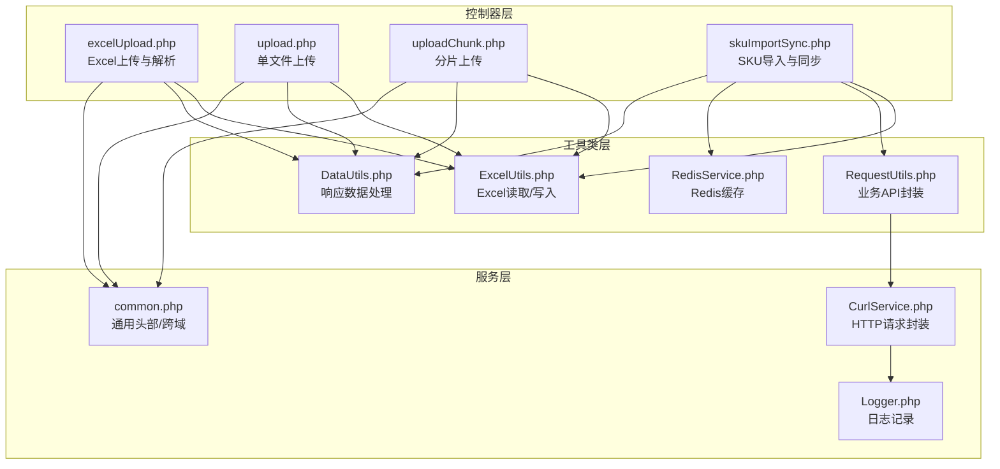
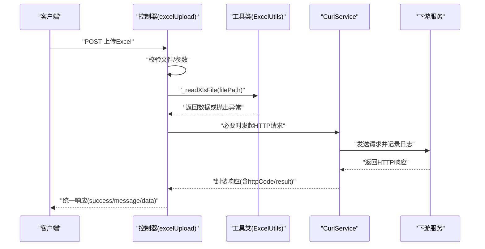
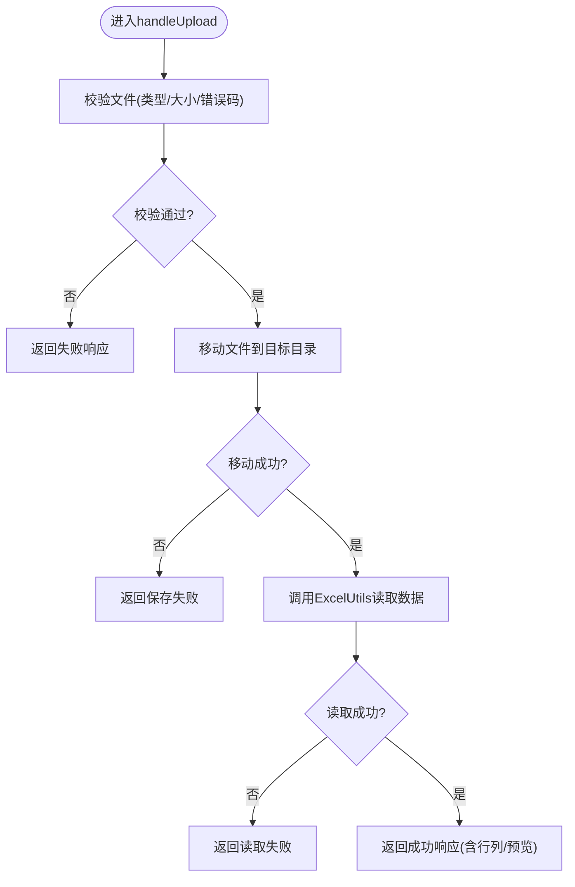
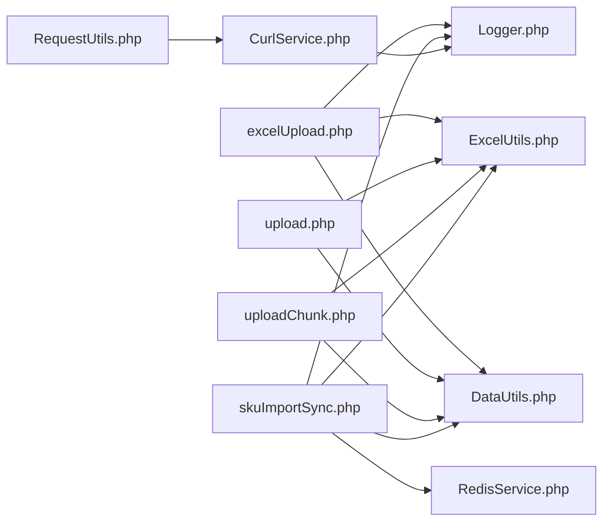

# API错误处理与状态码

<cite>
**本文档引用的文件**
- [excelUpload.php](file://php/controller/excelUpload.php)
- [upload.php](file://php/controller/upload.php)
- [uploadChunk.php](file://php/controller/uploadChunk.php)
- [skuImportSync.php](file://php/controller/skuImportSync.php)
- [ExcelUtils.php](file://php/utils/ExcelUtils.php)
- [RequestUtils.php](file://php/utils/RequestUtils.php)
- [CurlService.php](file://php/curl/CurlService.php)
- [DataUtils.php](file://php/utils/DataUtils.php)
- [RedisService.php](file://php/redis/RedisService.php)
- [Logger.php](file://php/class/Logger.php)
- [common.php](file://php/common.php)
</cite>

## 目录
1. [简介](#简介)
2. [项目结构](#项目结构)
3. [核心组件](#核心组件)
4. [架构总览](#架构总览)
5. [详细组件分析](#详细组件分析)
6. [依赖关系分析](#依赖关系分析)
7. [性能考虑](#性能考虑)
8. [故障排查指南](#故障排查指南)
9. [结论](#结论)
10. [附录](#附录)

## 简介
本文件系统性梳理PaSystem项目中API错误处理与状态码的设计与实现，覆盖以下方面：
- 统一的错误响应格式：success标志、message错误信息、data附加数据
- 客户端错误（4xx）与服务器错误（5xx）的识别与映射
- 常见错误场景的诊断与解决方法：文件上传失败、数据解析错误、网络超时、权限不足等
- 日志记录规范与错误追踪机制
- API调用最佳实践与错误恢复策略
- 错误监控与告警机制的配置思路

## 项目结构
本项目围绕“控制器-工具类-服务层”的分层设计组织，错误处理主要分布在：
- 控制器层：负责接收请求、校验参数、组装统一响应
- 工具类层：封装Excel读取、HTTP请求、数据转换、Redis缓存等通用能力
- 服务层：通过CurlService发起跨服务调用，统一记录日志与错误

图表来源
- [excelUpload.php](file://php/controller/excelUpload.php#L1-L372)
- [upload.php](file://php/controller/upload.php#L1-L138)
- [uploadChunk.php](file://php/controller/uploadChunk.php#L1-L86)
- [skuImportSync.php](file://php/controller/skuImportSync.php#L1-L512)
- [ExcelUtils.php](file://php/utils/ExcelUtils.php#L1-L398)
- [RequestUtils.php](file://php/utils/RequestUtils.php#L1-L672)
- [CurlService.php](file://php/curl/CurlService.php#L1-L996)
- [DataUtils.php](file://php/utils/DataUtils.php#L1-L802)
- [RedisService.php](file://php/redis/RedisService.php#L1-L77)
- [Logger.php](file://php/class/Logger.php#L1-L55)
- [common.php](file://php/common.php#L1-L9)

章节来源
- [excelUpload.php](file://php/controller/excelUpload.php#L1-L372)
- [upload.php](file://php/controller/upload.php#L1-L138)
- [uploadChunk.php](file://php/controller/uploadChunk.php#L1-L86)
- [skuImportSync.php](file://php/controller/skuImportSync.php#L1-L512)
- [ExcelUtils.php](file://php/utils/ExcelUtils.php#L1-L398)
- [RequestUtils.php](file://php/utils/RequestUtils.php#L1-L672)
- [CurlService.php](file://php/curl/CurlService.php#L1-L996)
- [DataUtils.php](file://php/utils/DataUtils.php#L1-L802)
- [RedisService.php](file://php/redis/RedisService.php#L1-L77)
- [Logger.php](file://php/class/Logger.php#L1-L55)
- [common.php](file://php/common.php#L1-L9)

## 核心组件
- 统一响应格式
  - 成功：success=true，message为操作结果描述，data为返回数据
  - 失败：success=false，message为错误信息，data为空或补充上下文
- 错误响应来源
  - 控制器层：文件上传、Excel解析、分片上传、SKU导入同步
  - 工具类层：Excel读取异常、数据转换异常
  - 服务层：HTTP请求异常、权限/鉴权失败、超时重试
- 日志与追踪
  - CurlService统一记录请求URL、参数、HTTP状态码与响应体
  - MyLogger按日期切分文件，记录请求与异常堆栈

章节来源
- [excelUpload.php](file://php/controller/excelUpload.php#L35-L95)
- [upload.php](file://php/controller/upload.php#L15-L60)
- [uploadChunk.php](file://php/controller/uploadChunk.php#L15-L78)
- [skuImportSync.php](file://php/controller/skuImportSync.php#L40-L77)
- [CurlService.php](file://php/curl/CurlService.php#L664-L740)
- [Logger.php](file://php/class/Logger.php#L14-L55)

## 架构总览
下图展示一次典型API调用的错误处理流程：控制器接收请求，调用工具类进行数据处理，必要时通过CurlService访问下游服务，最终统一返回标准响应。

图表来源
- [excelUpload.php](file://php/controller/excelUpload.php#L35-L95)
- [ExcelUtils.php](file://php/utils/ExcelUtils.php#L147-L181)
- [CurlService.php](file://php/curl/CurlService.php#L664-L740)

## 详细组件分析

### Excel上传与解析（excelUpload.php）
- 功能要点
  - 校验上传文件类型、大小、错误码
  - 移动文件至目标目录
  - 使用ExcelUtils读取数据，支持多工作表、表头与预览
  - 统一返回标准格式
- 错误处理
  - 上传错误码映射为明确提示
  - 文件保存失败、Excel读取失败、空数据等场景均返回失败响应
  - 异常捕获兜底，返回服务器内部错误
- 并发与批量
  - 支持单文件与多文件批量处理，汇总统计成功/失败数量

图表来源
- [excelUpload.php](file://php/controller/excelUpload.php#L35-L95)
- [excelUpload.php](file://php/controller/excelUpload.php#L102-L140)
- [excelUpload.php](file://php/controller/excelUpload.php#L148-L238)

章节来源
- [excelUpload.php](file://php/controller/excelUpload.php#L1-L372)
- [ExcelUtils.php](file://php/utils/ExcelUtils.php#L147-L181)

### 单文件上传（upload.php）
- 功能要点
  - 校验上传错误码，限定xlsx/xls类型
  - 生成唯一文件名并移动到目标目录
  - 读取Excel内容并返回列表
- 错误处理
  - 上传错误码映射为明确提示
  - 类型不符、保存失败、读取失败均返回失败响应

章节来源
- [upload.php](file://php/controller/upload.php#L1-L138)

### 分片上传（uploadChunk.php）
- 功能要点
  - 接收分片文件，按索引拼接
  - 全部分片完成后合并生成最终文件
  - 返回成功响应与文件路径
- 错误处理
  - 分片缺失或拼接失败时返回失败响应
  - 仅在最后分片触发合并逻辑

章节来源
- [uploadChunk.php](file://php/controller/uploadChunk.php#L1-L86)

### SKU导入与同步（skuImportSync.php）
- 功能要点
  - 下载模板、解析Excel、同步SKU数据到目标环境
  - 统一日志记录，包含查询条件、源/目标环境数据量
- 错误处理
  - 参数校验失败、环境不合法、读取/创建失败均返回失败响应
  - 删除旧数据失败不影响整体流程，继续执行
  - 异常捕获并记录堆栈，返回统一错误响应

章节来源
- [skuImportSync.php](file://php/controller/skuImportSync.php#L1-L512)

### Excel工具类（ExcelUtils.php）
- 功能要点
  - 读取Excel（xlsx/xls/csv），支持多工作表
  - 读取CSV时处理长数字不转科学计数法
  - 导出xlsx文件
- 错误处理
  - 读取异常时抛出异常，由调用方捕获并返回失败响应

章节来源
- [ExcelUtils.php](file://php/utils/ExcelUtils.php#L147-L181)
- [ExcelUtils.php](file://php/utils/ExcelUtils.php#L246-L311)

### HTTP请求封装（CurlService.php）
- 功能要点
  - 统一设置请求头、环境切换（test/uat/pro/local）
  - 发起GET/POST/PUT/DELETE/UPLOAD请求
  - 记录请求日志（URL、参数、响应体）
  - 校验HTTP状态码，非2xx且非特定白名单时抛出异常
- 错误处理
  - 非2xx状态码抛出异常，由调用方捕获
  - 支持超时与重试配置

章节来源
- [CurlService.php](file://php/curl/CurlService.php#L664-L740)
- [CurlService.php](file://php/curl/CurlService.php#L751-L800)

### 响应数据处理（DataUtils.php）
- 功能要点
  - 从HTTP响应中提取result或data
  - 提供分页列表、首条数据、创建ID等便捷方法
- 错误处理
  - 当httpCode非200或result为空时返回空数组/空字符串

章节来源
- [DataUtils.php](file://php/utils/DataUtils.php#L18-L47)
- [DataUtils.php](file://php/utils/DataUtils.php#L54-L65)

### Redis缓存（RedisService.php）
- 功能要点
  - 提供hash/set/get/del/incr/expire等常用操作
- 错误处理
  - 无显式异常捕获，调用方需自行处理连接/认证失败

章节来源
- [RedisService.php](file://php/redis/RedisService.php#L1-L77)

### 日志记录（Logger.php）
- 功能要点
  - 按日期生成日志文件，默认记录到default目录
  - 提供log/log2/log3多种写入方式
- 错误处理
  - 无显式异常捕获，调用方需自行处理文件写入失败

章节来源
- [Logger.php](file://php/class/Logger.php#L14-L55)

### 通用头部与跨域（common.php）
- 功能要点
  - 设置Access-Control-Allow-Origin、Methods、Headers
  - 设置Content-Type为text/html; charset=utf-8
- 错误处理
  - 无错误处理逻辑

章节来源
- [common.php](file://php/common.php#L1-L9)

## 依赖关系分析
- 控制器依赖工具类与日志
- 工具类依赖第三方库（PhpSpreadsheet）与底层服务
- 服务层依赖CurlService与日志记录
- RedisService为可选依赖，用于缓存优化

图表来源
- [excelUpload.php](file://php/controller/excelUpload.php#L1-L372)
- [upload.php](file://php/controller/upload.php#L1-L138)
- [uploadChunk.php](file://php/controller/uploadChunk.php#L1-L86)
- [skuImportSync.php](file://php/controller/skuImportSync.php#L1-L512)
- [ExcelUtils.php](file://php/utils/ExcelUtils.php#L1-L398)
- [DataUtils.php](file://php/utils/DataUtils.php#L1-L802)
- [RedisService.php](file://php/redis/RedisService.php#L1-L77)
- [CurlService.php](file://php/curl/CurlService.php#L1-L996)
- [Logger.php](file://php/class/Logger.php#L1-L55)

## 性能考虑
- Excel读取
  - 使用PhpSpreadsheet，注意大文件内存占用，建议分批处理或限制文件大小
- HTTP请求
  - CurlService支持超时与重试，合理设置超时时间避免阻塞
- 缓存
  - RedisService可用于热点数据缓存，减少重复查询

[本节为通用指导，无需特定文件引用]

## 故障排查指南

### 文件上传失败
- 症状
  - 控制器返回“文件保存失败”或“上传文件出错”
- 排查步骤
  - 检查上传目录权限与磁盘空间
  - 查看CurlService日志中的请求参数与HTTP状态码
  - 确认文件类型为xlsx/xls，大小不超过限制
- 相关实现
  - [excelUpload.php](file://php/controller/excelUpload.php#L55-L61)
  - [upload.php](file://php/controller/upload.php#L40-L58)
  - [uploadChunk.php](file://php/controller/uploadChunk.php#L30-L31)

章节来源
- [excelUpload.php](file://php/controller/excelUpload.php#L55-L61)
- [upload.php](file://php/controller/upload.php#L40-L58)
- [uploadChunk.php](file://php/controller/uploadChunk.php#L30-L31)

### 数据解析错误
- 症状
  - “无法读取Excel文件内容”、“Excel文件中没有数据”
- 排查步骤
  - 确认Excel文件格式正确，工作表存在数据
  - 检查PhpSpreadsheet读取异常，查看日志定位具体行列
- 相关实现
  - [ExcelUtils.php](file://php/utils/ExcelUtils.php#L147-L181)
  - [excelUpload.php](file://php/controller/excelUpload.php#L150-L181)

章节来源
- [ExcelUtils.php](file://php/utils/ExcelUtils.php#L147-L181)
- [excelUpload.php](file://php/controller/excelUpload.php#L150-L181)

### 网络超时与权限不足
- 症状
  - HTTP状态码非2xx，CurlService抛出异常
- 排查步骤
  - 检查目标服务可达性与鉴权头（Authorization）
  - 调整超时与重试参数，观察日志中的httpCode
- 相关实现
  - [CurlService.php](file://php/curl/CurlService.php#L664-L740)
  - [CurlService.php](file://php/curl/CurlService.php#L270-L290)

章节来源
- [CurlService.php](file://php/curl/CurlService.php#L664-L740)
- [CurlService.php](file://php/curl/CurlService.php#L270-L290)

### 权限不足
- 症状
  - HTTP 401未授权
- 排查步骤
  - 检查Authorization头是否正确设置
  - 确认环境配置（test/uat/pro/local）与令牌有效性
- 相关实现
  - [CurlService.php](file://php/curl/CurlService.php#L264-L288)

章节来源
- [CurlService.php](file://php/curl/CurlService.php#L264-L288)

### 错误监控与告警
- 建议方案
  - 基于CurlService日志与MyLogger日志建立统一采集
  - 对高频错误（如4xx/5xx、超时、权限失败）设置阈值告警
  - 结合业务指标（上传成功率、解析失败率、同步失败率）进行监控
- 实施要点
  - 日志按天切分，便于检索与归档
  - 在关键路径增加trace-id，便于链路追踪

章节来源
- [CurlService.php](file://php/curl/CurlService.php#L714-L715)
- [Logger.php](file://php/class/Logger.php#L22-L24)

## 结论
本项目在错误处理层面实现了统一的响应格式与清晰的职责划分：控制器负责参数校验与响应组装，工具类负责数据处理与异常传播，服务层负责跨服务调用与日志记录。通过CurlService与MyLogger的配合，能够快速定位问题并进行恢复。建议在现有基础上进一步完善错误监控与告警体系，提升系统的可观测性与稳定性。

[本节为总结性内容，无需特定文件引用]

## 附录

### 统一错误响应格式
- 成功
  - success: true
  - message: "操作结果描述"
  - data: 返回数据或空数组
- 失败
  - success: false
  - message: "错误信息"
  - data: 空数组或补充上下文

章节来源
- [excelUpload.php](file://php/controller/excelUpload.php#L35-L95)
- [upload.php](file://php/controller/upload.php#L15-L60)
- [uploadChunk.php](file://php/controller/uploadChunk.php#L15-L78)
- [skuImportSync.php](file://php/controller/skuImportSync.php#L40-L77)

### 常见HTTP状态码映射
- 2xx：成功
- 400：客户端请求参数错误或上传错误码
- 401：未授权（权限不足）
- 404：资源不存在
- 429：请求过于频繁（限流）
- 5xx：服务器内部错误

章节来源
- [CurlService.php](file://php/curl/CurlService.php#L725-L729)
- [excelUpload.php](file://php/controller/excelUpload.php#L105-L120)
- [upload.php](file://php/controller/upload.php#L17-L23)