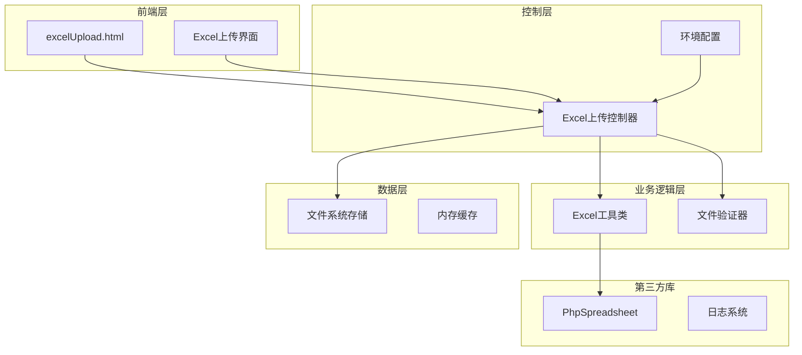
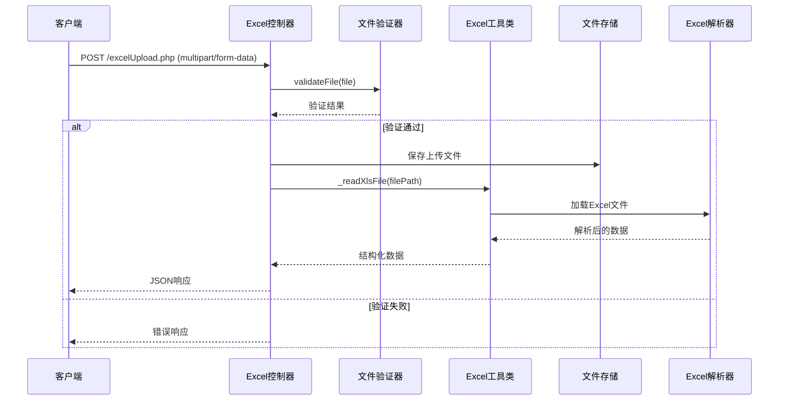
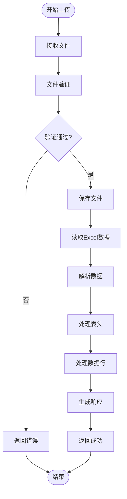
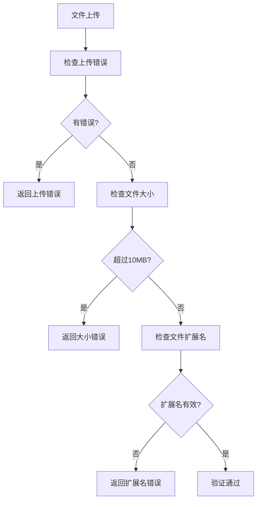
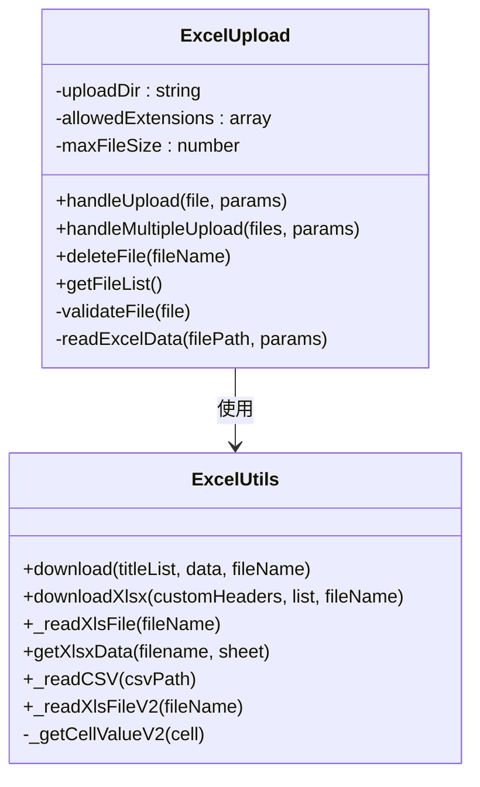
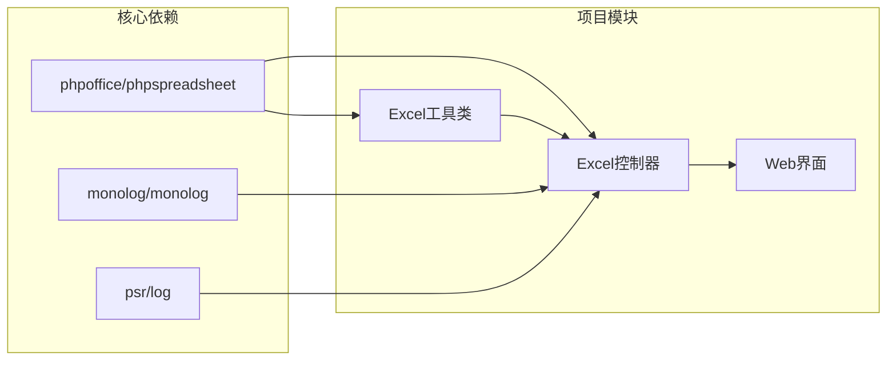
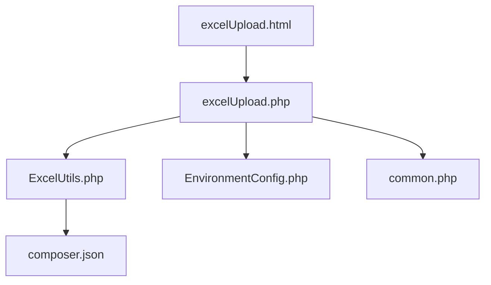

# Excel文件处理API

<cite>
**本文档引用的文件**
- [excelUpload.php](file://php/controller/excelUpload.php)
- [ExcelUtils.php](file://php/utils/ExcelUtils.php)
- [excelUpload.html](file://template/excelUpload.html)
- [composer.json](file://composer.json)
- [common.php](file://php/common.php)
- [EnvironmentConfig.php](file://php/controller/EnvironmentConfig.php)
</cite>

## 目录
1. [简介](#简介)
2. [项目结构](#项目结构)
3. [核心组件](#核心组件)
4. [架构概览](#架构概览)
5. [详细组件分析](#详细组件分析)
6. [依赖关系分析](#依赖关系分析)
7. [性能考虑](#性能考虑)
8. [故障排除指南](#故障排除指南)
9. [结论](#结论)
10. [附录](#附录)

## 简介
本项目提供了一个完整的Excel文件处理API，支持xlsx和xls格式文件的上传、解析和数据提取。该API集成了PHPExcel库（现由PhpSpreadsheet替代）来处理Excel文件读取，并提供了友好的Web界面用于文件上传和数据预览。

主要功能包括：
- 支持Excel文件上传（xlsx、xls格式）
- 文件大小限制（10MB）
- 自动文件验证和错误处理
- Excel数据读取和结构化输出
- Web界面集成的数据预览功能
- 批量文件处理能力

## 项目结构
项目采用分层架构设计，主要包含以下模块：



**图表来源**
- [excelUpload.php](file://php/controller/excelUpload.php#L1-L372)
- [ExcelUtils.php](file://php/utils/ExcelUtils.php#L1-L398)
- [excelUpload.html](file://template/excelUpload.html#L1-L472)

**章节来源**
- [excelUpload.php](file://php/controller/excelUpload.php#L1-L30)
- [ExcelUtils.php](file://php/utils/ExcelUtils.php#L1-L30)
- [excelUpload.html](file://template/excelUpload.html#L1-L50)

## 核心组件

### Excel上传控制器
Excel上传控制器是整个系统的核心，负责处理文件上传、验证、读取和响应生成。

**主要职责：**
- 文件上传接收和处理
- 文件格式和大小验证
- Excel文件数据读取
- 结构化数据输出
- 错误处理和状态管理

**关键特性：**
- 支持单文件和批量文件上传
- 动态预览行数配置
- 表头识别和数据转换
- 自动文件清理机制

**章节来源**
- [excelUpload.php](file://php/controller/excelUpload.php#L11-L95)

### Excel工具类
Excel工具类封装了底层的Excel文件处理逻辑，基于PhpSpreadsheet库实现。

**主要功能：**
- Excel文件读取（支持xlsx、xls格式）
- 数据结构化转换
- 长数字处理避免科学计数法
- 多工作表支持
- 内存优化处理

**章节来源**
- [ExcelUtils.php](file://php/utils/ExcelUtils.php#L20-L181)

### Web界面集成
提供用户友好的Excel文件上传界面，支持拖拽上传和实时预览。

**界面特性：**
- 拖拽上传区域
- 实时上传进度显示
- 文件状态指示器
- 数据预览表格
- 响应式设计

**章节来源**
- [excelUpload.html](file://template/excelUpload.html#L112-L283)

## 架构概览



**图表来源**
- [excelUpload.php](file://php/controller/excelUpload.php#L35-L95)
- [ExcelUtils.php](file://php/utils/ExcelUtils.php#L147-L181)

## 详细组件分析

### 文件上传处理流程



**图表来源**
- [excelUpload.php](file://php/controller/excelUpload.php#L35-L238)

### API接口规范

#### 单文件上传接口
**URL:** `/php/controller/excelUpload.php`
**方法:** POST
**内容类型:** `multipart/form-data`

**请求参数:**

| 参数名 | 类型 | 必填 | 描述 | 默认值 |
|--------|------|------|------|--------|
| `excelFile` | file | 是 | Excel文件字段 | - |
| `hasHeader` | boolean | 否 | 是否有表头，默认true | true |
| `previewRows` | integer | 否 | 预览行数，默认10 | 10 |

**响应格式:**

```json
{
  "success": true,
  "message": "文件上传并处理成功",
  "data": {
    "fileName": "example.xlsx",
    "uniqueName": "excel_xxxxxxxx_time.xlsx",
    "filePath": "/path/to/uploaded/file.xlsx",
    "rowCount": 100,
    "columnCount": 5,
    "headers": ["姓名", "年龄", "邮箱", "电话", "地址"],
    "rows": [...],
    "preview": [...]
  }
}
```

**章节来源**
- [excelUpload.php](file://php/controller/excelUpload.php#L331-L372)
- [excelUpload.php](file://php/controller/excelUpload.php#L337-L345)

#### 批量文件上传接口
**请求参数:**
- `excelFiles[]` - 多个Excel文件
- 其他参数同单文件上传

**批量响应格式:**
```json
{
  "success": false,
  "message": "处理完成：成功 2 个，失败 1 个",
  "data": [
    {
      "success": true,
      "message": "文件上传并处理成功",
      "data": {}
    }
  ],
  "summary": {
    "total": 3,
    "success": 2,
    "failed": 1
  }
}
```

**章节来源**
- [excelUpload.php](file://php/controller/excelUpload.php#L246-L289)

### 文件验证规则



**图表来源**
- [excelUpload.php](file://php/controller/excelUpload.php#L102-L140)

**验证规则:**
- **文件格式:** 仅允许 `.xlsx` 和 `.xls` 格式
- **文件大小:** 最大10MB限制
- **上传错误:** 处理PHP上传错误码
- **文件完整性:** 确保文件完全上传

**章节来源**
- [excelUpload.php](file://php/controller/excelUpload.php#L102-L140)

### Excel数据处理流程



**图表来源**
- [ExcelUtils.php](file://php/utils/ExcelUtils.php#L20-L398)
- [excelUpload.php](file://php/controller/excelUpload.php#L11-L328)

**数据处理特性:**
- **表头处理:** 自动识别第一行为表头
- **数据转换:** 将关联数组转换为索引数组
- **预览功能:** 支持可配置的预览行数
- **长数字保护:** 避免科学计数法格式化
- **多工作表支持:** 处理多个工作表数据

**章节来源**
- [ExcelUtils.php](file://php/utils/ExcelUtils.php#L147-L181)
- [excelUpload.php](file://php/controller/excelUpload.php#L148-L238)

## 依赖关系分析

### 外部依赖



**图表来源**
- [composer.json](file://composer.json#L1-L11)
- [ExcelUtils.php](file://php/utils/ExcelUtils.php#L5-L11)

**依赖说明:**
- **PhpSpreadsheet:** 核心Excel文件处理库
- **Monolog:** 日志记录服务
- **PSR-3:** 标准化日志接口

**章节来源**
- [composer.json](file://composer.json#L1-L11)

### 内部模块依赖



**图表来源**
- [excelUpload.php](file://php/controller/excelUpload.php#L1-L10)
- [ExcelUtils.php](file://php/utils/ExcelUtils.php#L1-L5)

**模块关系:**
- 控制器依赖工具类进行Excel处理
- 工具类独立于Web界面运行
- 环境配置提供运行时设置
- Web界面通过AJAX调用API

**章节来源**
- [excelUpload.php](file://php/controller/excelUpload.php#L1-L10)
- [ExcelUtils.php](file://php/utils/ExcelUtils.php#L1-L5)

## 性能考虑

### 内存优化策略
- **流式处理:** 使用PhpSpreadsheet的内存优化特性
- **延迟加载:** 仅在需要时加载工作表数据
- **及时释放:** 处理完成后及时释放内存

### 处理效率优化
- **批量处理:** 支持多文件同时处理
- **异步处理:** Web界面支持进度显示
- **缓存机制:** 临时文件缓存减少重复读取

### 存储管理
- **自动清理:** 处理失败的文件自动删除
- **目录结构:** 统一的上传文件存储位置
- **文件命名:** 唯一文件名避免冲突

## 故障排除指南

### 常见问题及解决方案

**文件上传失败**
- 检查文件大小是否超过10MB限制
- 确认文件格式为xlsx或xls
- 验证服务器磁盘空间充足

**Excel数据读取错误**
- 确认Excel文件格式正确
- 检查文件是否被其他程序占用
- 验证文件完整性

**权限问题**
- 确保上传目录具有写入权限
- 检查PHP配置中的文件上传设置

**内存不足**
- 减少单次处理的文件数量
- 优化Excel文件结构
- 增加服务器内存

### 错误代码对照

| 错误码 | 描述 | 解决方案 |
|--------|------|----------|
| UPLOAD_ERR_INI_SIZE | 超过服务器限制 | 调整php.ini中的upload_max_filesize |
| UPLOAD_ERR_PARTIAL | 文件部分上传 | 重新上传文件 |
| UPLOAD_ERR_NO_FILE | 无文件上传 | 检查表单字段名称 |
| 10MB限制 | 文件过大 | 分割文件或压缩数据 |

**章节来源**
- [excelUpload.php](file://php/controller/excelUpload.php#L105-L119)

## 结论
本Excel文件处理API提供了完整的文件上传、验证、解析和数据提取功能。通过合理的架构设计和性能优化，能够高效处理各种规模的Excel文件。系统支持多种文件格式、提供友好的用户界面，并具备良好的扩展性和维护性。

主要优势：
- 完整的文件处理流程
- 友好的Web界面集成
- 良好的错误处理机制
- 支持批量文件处理
- 内存和性能优化

## 附录

### API使用示例

**单文件上传示例:**
```javascript
const formData = new FormData();
formData.append('excelFile', fileInput.files[0]);
formData.append('hasHeader', true);
formData.append('previewRows', 10);

fetch('/php/controller/excelUpload.php', {
    method: 'POST',
    body: formData
})
.then(response => response.json())
.then(data => console.log(data));
```

**批量文件上传示例:**
```javascript
const formData = new FormData();
const files = fileInput.files;
for (let i = 0; i < files.length; i++) {
    formData.append('excelFiles[]', files[i]);
}
formData.append('hasHeader', true);
formData.append('previewRows', 10);
```

### 配置选项

**服务器配置建议:**
- PHP上传文件大小限制：10MB以上
- 内存限制：至少128MB
- 执行时间：根据文件大小调整

**安全配置:**
- 文件类型白名单验证
- 文件大小限制
- 上传目录权限控制