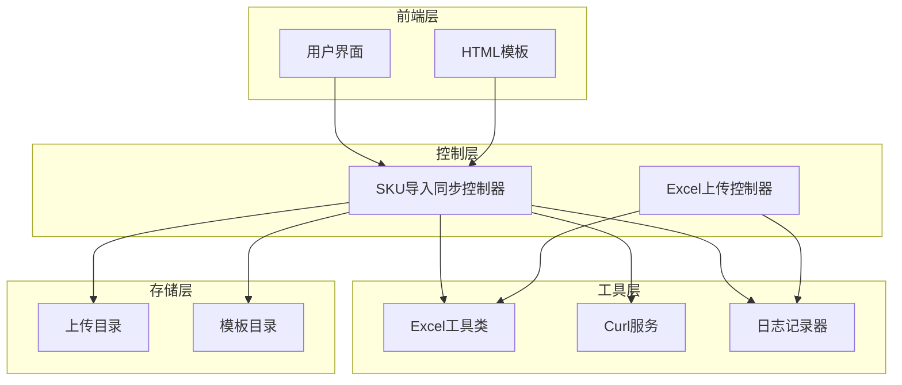
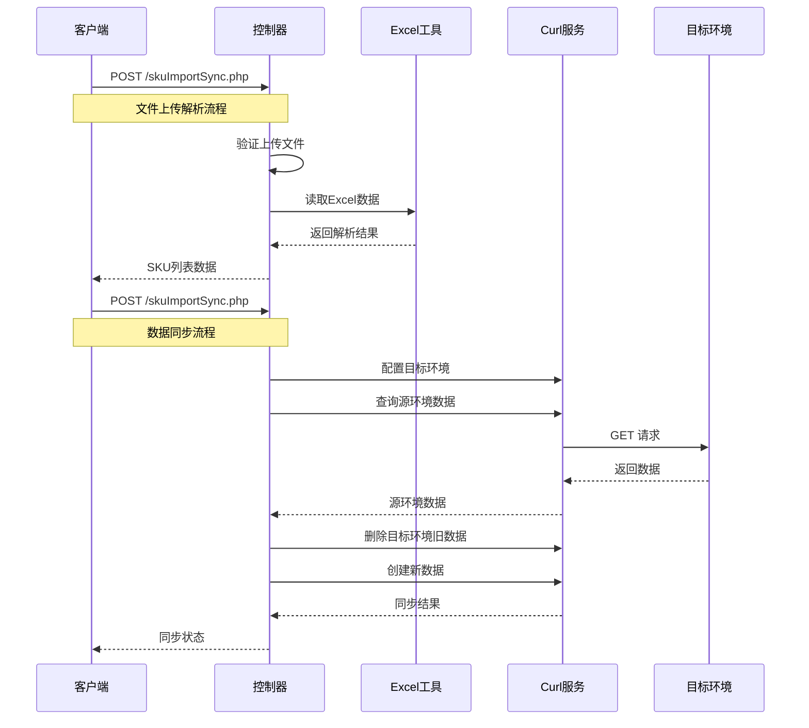
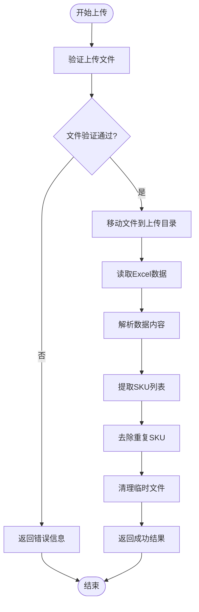
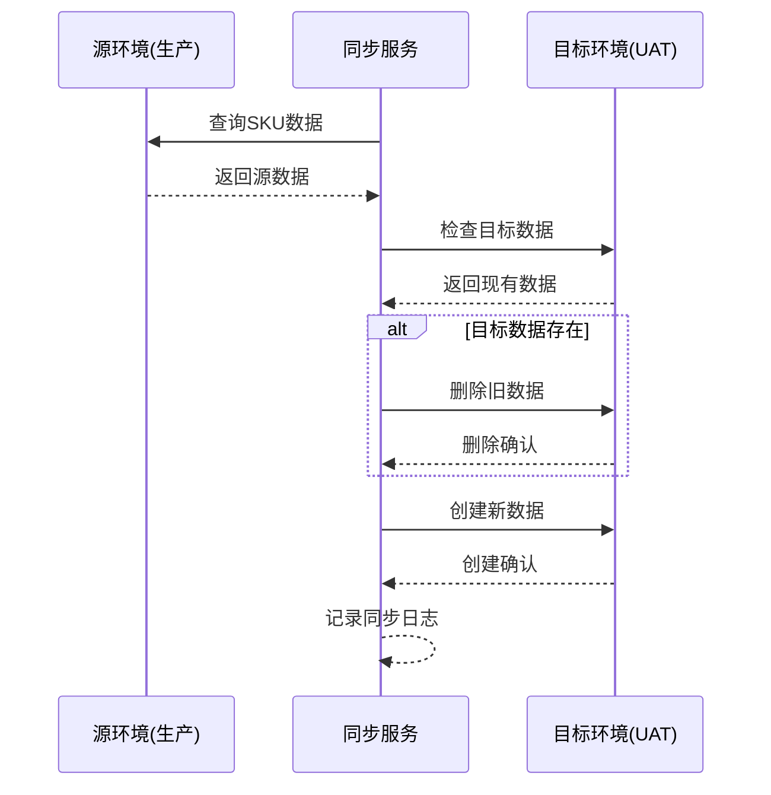
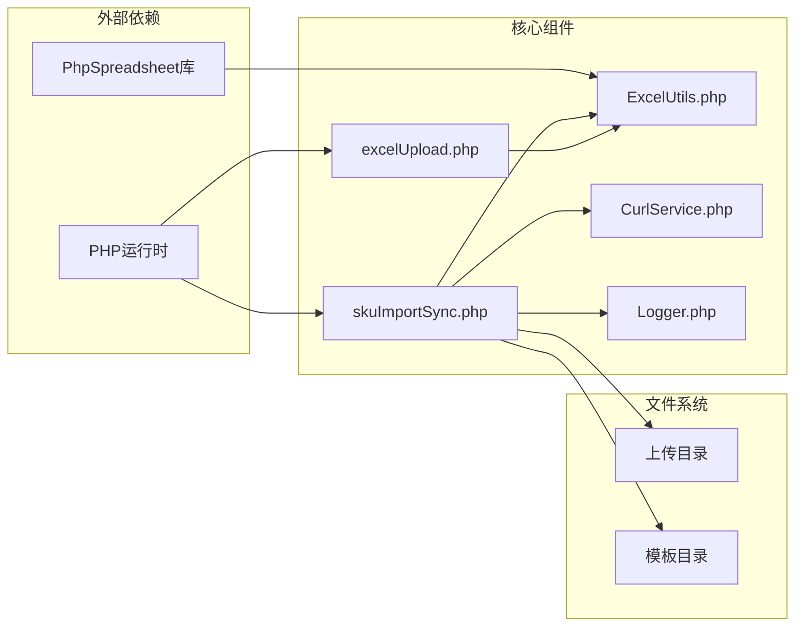

# SKU数据同步API

<cite>
**本文档引用的文件**
- [skuImportSync.php](file://php/controller/skuImportSync.php)
- [excelUpload.php](file://php/controller/excelUpload.php)
- [ExcelUtils.php](file://php/utils/ExcelUtils.php)
- [skuImportSync.html](file://template/fix/skuImportSync.html)
- [CurlService.php](file://php/curl/CurlService.php)
- [Logger.php](file://php/class/Logger.php)
</cite>

## 目录
1. [简介](#简介)
2. [项目结构](#项目结构)
3. [核心组件](#核心组件)
4. [架构概览](#架构概览)
5. [详细组件分析](#详细组件分析)
6. [依赖关系分析](#依赖关系分析)
7. [性能考虑](#性能考虑)
8. [故障排除指南](#故障排除指南)
9. [结论](#结论)

## 简介

SKU数据同步API是一个专门用于处理SKU数据导入和跨环境同步的Web服务。该系统提供了完整的SKU数据处理流程，包括Excel文件解析、数据验证、跨环境同步等功能。

该API主要服务于电商平台的SKU数据管理需求，支持将SKU数据从生产环境同步到测试(UAT)环境，涵盖多个业务模块的数据同步。

## 项目结构

项目采用分层架构设计，主要包含以下层次：



**图表来源**
- [skuImportSync.php](file://php/controller/skuImportSync.php#L1-L512)
- [excelUpload.php](file://php/controller/excelUpload.php#L1-L372)
- [ExcelUtils.php](file://php/utils/ExcelUtils.php#L1-L398)

**章节来源**
- [skuImportSync.php](file://php/controller/skuImportSync.php#L1-L50)
- [excelUpload.php](file://php/controller/excelUpload.php#L1-L30)

## 核心组件

### SKU导入同步控制器

SKU导入同步控制器是整个系统的核心，负责处理所有SKU相关的操作请求。

**主要功能特性：**
- Excel文件解析和验证
- SKU数据提取和去重
- 跨环境数据同步
- 模板下载功能
- 完整的日志记录机制

**支持的操作类型：**
- `parse`: 解析Excel文件，提取SKU列表
- `sync`: 同步SKU数据到目标环境
- `downloadTemplate`: 下载数据导入模板

**章节来源**
- [skuImportSync.php](file://php/controller/skuImportSync.php#L12-L77)

### Excel工具类

Excel工具类基于PhpSpreadsheet库，提供强大的Excel文件处理能力。

**核心功能：**
- Excel文件读取和解析
- 数据格式转换和处理
- CSV文件支持
- 长数字格式处理

**章节来源**
- [ExcelUtils.php](file://php/utils/ExcelUtils.php#L20-L398)

### Curl服务

Curl服务封装了HTTP请求功能，支持多环境配置和RESTful API调用。

**环境支持：**
- 本地开发环境
- 测试环境 (test)
- 用户验收测试环境 (uat)
- 生产环境 (pro)

**章节来源**
- [CurlService.php](file://php/curl/CurlService.php#L4-L143)

## 架构概览

系统采用MVC架构模式，通过清晰的职责分离实现高内聚低耦合的设计。



**图表来源**
- [skuImportSync.php](file://php/controller/skuImportSync.php#L40-L77)
- [CurlService.php](file://php/curl/CurlService.php#L664-L740)

## 详细组件分析

### 文件上传和解析流程

系统支持多种文件上传方式，包括拖拽上传和传统文件选择。



**图表来源**
- [skuImportSync.php](file://php/controller/skuImportSync.php#L164-L271)

**章节来源**
- [skuImportSync.php](file://php/controller/skuImportSync.php#L164-L271)
- [ExcelUtils.php](file://php/utils/ExcelUtils.php#L147-L181)

### 跨环境数据同步流程

系统支持将SKU数据从生产环境同步到测试(UAT)环境，涵盖多个业务模块。



**图表来源**
- [skuImportSync.php](file://php/controller/skuImportSync.php#L334-L386)

**章节来源**
- [skuImportSync.php](file://php/controller/skuImportSync.php#L278-L426)

### API接口规范

#### 基础URL
```
http://主机地址/php/controller/skuImportSync.php
```

#### 支持的HTTP方法
- `POST`: 主要的API调用方法
- `GET`: 模板下载（通过URL参数）

#### 公共请求参数

| 参数名 | 类型 | 必填 | 描述 | 示例值 |
|--------|------|------|------|--------|
| `action` | string | 是 | 操作类型 | `parse`、`sync`、`downloadTemplate` |
| `excelFile` | file | 否 | Excel文件上传 | - |
| `skuId` | string | 否 | SKU标识符 | `a25010100ux0001` |
| `module` | string | 否 | 业务模块名称 | `amazon_asins` |
| `port` | string | 否 | 服务端口标识 | `s3015` |
| `field` | string | 否 | 查询字段 | `skuId`、`productId` |
| `targetEnv` | string | 否 | 目标环境 | `test`、`uat` |

#### 文件上传验证规则

**文件类型限制：**
- 仅支持 `.xlsx` 和 `.xls` 格式
- 不支持其他电子表格格式

**文件大小限制：**
- 最大文件大小：2MB
- 超过限制将返回错误

**上传错误处理：**
- 服务器配置错误码映射
- 上传失败原因详细说明
- 临时文件检查和清理

**章节来源**
- [skuImportSync.php](file://php/controller/skuImportSync.php#L433-L471)

#### 成功响应格式

所有API调用都返回统一的JSON格式：

```json
{
    "success": true,
    "message": "操作描述信息",
    "data": {}
}
```

**通用响应字段：**

| 字段名 | 类型 | 描述 |
|--------|------|------|
| `success` | boolean | 操作是否成功 |
| `message` | string | 操作结果描述 |
| `data` | object | 具体业务数据 |

#### 失败响应格式

```json
{
    "success": false,
    "message": "错误描述信息",
    "data": []
}
```

**章节来源**
- [skuImportSync.php](file://php/controller/skuImportSync.php#L63-L76)

### 操作类型详解

#### 1. 文件解析操作 (`action=parse`)

**请求方式：** `POST`  
**文件上传：** 必须包含 `excelFile` 参数  
**用途：** 解析Excel文件，提取SKU列表

**响应数据结构：**
```json
{
    "success": true,
    "message": "文件解析成功",
    "data": {
        "skuList": ["SKU1", "SKU2", "SKU3"],
        "count": 3
    }
}
```

**章节来源**
- [skuImportSync.php](file://php/controller/skuImportSync.php#L252-L259)

#### 2. 数据同步操作 (`action=sync`)

**请求方式：** `POST` (JSON格式)  
**必需参数：** `skuId`, `module`, `port`, `field`  
**可选参数：** `targetEnv` (默认: `test`)

**同步流程：**
1. 验证目标环境参数
2. 从源环境查询SKU数据
3. 检查目标环境是否存在相同数据
4. 如存在则删除旧数据
5. 创建新数据到目标环境
6. 记录同步结果

**响应数据结构：**
```json
{
    "success": true,
    "message": "SKU同步成功消息",
    "data": {
        "skuId": "SKU标识符",
        "module": "业务模块",
        "targetEnv": "目标环境",
        "sourceCount": 1,
        "targetCount": 0
    }
}
```

**章节来源**
- [skuImportSync.php](file://php/controller/skuImportSync.php#L389-L399)

#### 3. 模板下载操作 (`GET`请求)

**请求方式：** `GET`  
**URL参数：** `action=downloadTemplate`  
**用途：** 下载标准的SKU导入模板文件

**模板特性：**
- 包含SKU ID和备注两列
- 预设示例数据
- 支持批量导入
- 文件格式：`.xlsx`

**章节来源**
- [skuImportSync.php](file://php/controller/skuImportSync.php#L83-L110)

### 前端集成指南

系统提供完整的前端界面，支持拖拽上传和进度监控。

**前端功能特性：**
- 拖拽文件上传区域
- 实时进度显示
- 同步状态跟踪
- 错误提示和处理

**API集成示例：**
```javascript
// 下载模板
fetch('/php/controller/skuImportSync.php?action=downloadTemplate')

// 解析Excel文件
const formData = new FormData();
formData.append('excelFile', file);
formData.append('action', 'parse');
fetch('/php/controller/skuImportSync.php', {
    method: 'POST',
    body: formData
});

// 同步SKU数据
fetch('/php/controller/skuImportSync.php', {
    method: 'POST',
    headers: {'Content-Type': 'application/json'},
    body: JSON.stringify({
        action: 'sync',
        skuId: 'SKU标识符',
        module: '业务模块',
        port: 's3015',
        field: '查询字段',
        targetEnv: 'test'
    })
});
```

**章节来源**
- [skuImportSync.html](file://template/fix/skuImportSync.html#L390-L560)

## 依赖关系分析

系统各组件之间的依赖关系如下：



**图表来源**
- [skuImportSync.php](file://php/controller/skuImportSync.php#L1-L10)
- [ExcelUtils.php](file://php/utils/ExcelUtils.php#L1-L15)

**章节来源**
- [skuImportSync.php](file://php/controller/skuImportSync.php#L1-L10)
- [excelUpload.php](file://php/controller/excelUpload.php#L1-L10)

## 性能考虑

### 文件处理优化

1. **内存管理：** 使用PhpSpreadsheet的高效内存模型
2. **文件大小限制：** 2MB限制防止内存溢出
3. **临时文件清理：** 自动删除解析失败的临时文件

### 网络请求优化

1. **连接复用：** CurlService支持连接池
2. **超时控制：** 默认30秒超时设置
3. **重试机制：** 失败自动重试最多1次

### 缓存策略

1. **模板缓存：** 模板文件生成后缓存
2. **日志轮转：** 按日期自动创建日志文件
3. **进度状态：** 前端实时状态更新

## 故障排除指南

### 常见错误及解决方案

**文件上传错误：**
- `文件大小超过限制`: 减少文件大小或拆分文件
- `文件格式不支持`: 确保使用.xlsx或.xls格式
- `上传失败`: 检查服务器权限和磁盘空间

**数据同步错误：**
- `缺少必要参数`: 确保提供skuId、module、port、field
- `目标环境无效`: 仅支持test和uat环境
- `查询无数据`: 检查SKU标识符是否正确

**日志分析：**
系统提供详细的日志记录，可通过以下路径查看：
- `/php/log/sku_import_sync_YYYYMMDD.log`
- `/php/log/default/`

**章节来源**
- [skuImportSync.php](file://php/controller/skuImportSync.php#L433-L471)
- [Logger.php](file://php/class/Logger.php#L14-L55)

### 调试建议

1. **启用详细日志：** 检查日志文件获取详细错误信息
2. **验证网络连接：** 确保目标环境服务可达
3. **测试文件格式：** 使用提供的模板文件进行测试
4. **监控资源使用：** 关注内存和CPU使用情况

## 结论

SKU数据同步API提供了一个完整、可靠的SKU数据处理解决方案。系统具有以下优势：

1. **功能完整：** 支持文件解析、数据同步、模板下载等核心功能
2. **易于使用：** 提供直观的前端界面和清晰的API规范
3. **稳定可靠：** 完善的错误处理和日志记录机制
4. **可扩展性强：** 模块化设计便于功能扩展和维护

该系统特别适用于需要频繁进行SKU数据同步的电商应用场景，能够有效提高数据处理效率和准确性。