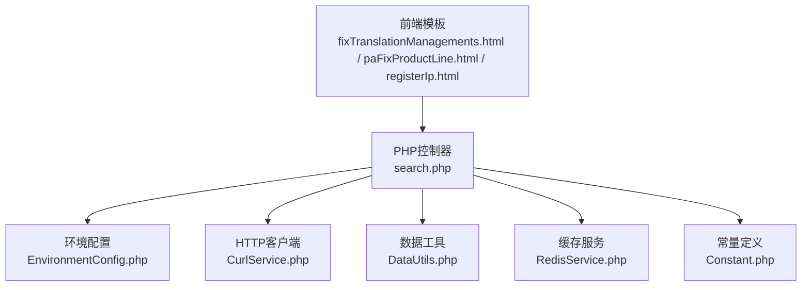
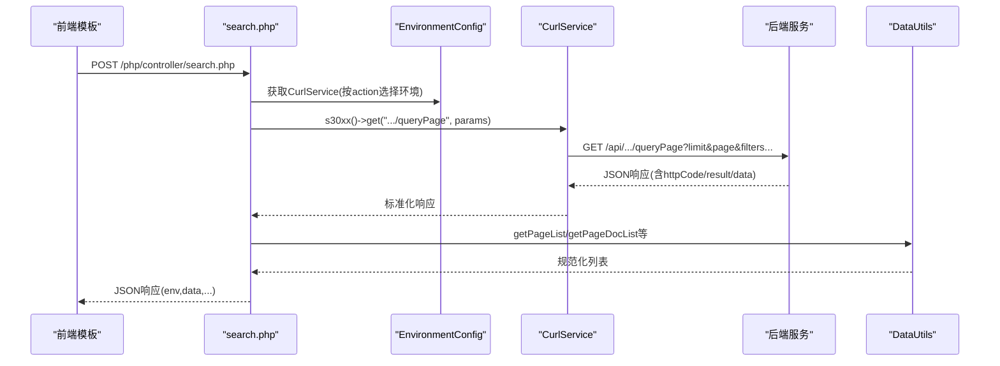
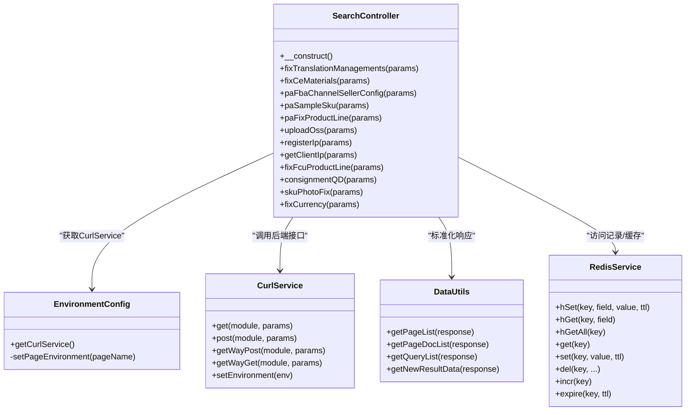

# 搜索查询API

<cite>
**本文引用的文件**
- [search.php](file://php/controller/search.php)
- [DataUtils.php](file://php/utils/DataUtils.php)
- [RedisService.php](file://php/redis/RedisService.php)
- [CurlService.php](file://php/curl/CurlService.php)
- [EnvironmentConfig.php](file://php/controller/EnvironmentConfig.php)
- [Constant.php](file://php/constant/Constant.php)
- [fixTranslationManagements.html](file://template/fix/fixTranslationManagements.html)
- [paFixProductLine.html](file://template/fix/paFixProductLine.html)
- [registerIp.html](file://template/fix/registerIp.html)
</cite>

## 目录
1. [简介](#简介)
2. [项目结构](#项目结构)
3. [核心组件](#核心组件)
4. [架构总览](#架构总览)
5. [详细组件分析](#详细组件分析)
6. [依赖关系分析](#依赖关系分析)
7. [性能考虑](#性能考虑)
8. [故障排查指南](#故障排查指南)
9. [结论](#结论)
10. [附录](#附录)

## 简介
本文件面向“搜索查询API”的完整技术文档，聚焦于关键词搜索、多条件查询、分页查询等能力，覆盖查询参数格式、过滤规则（模糊/精确/范围）、请求与响应结构、排序与分页信息、性能优化与索引策略、搜索历史与热门搜索处理、缓存机制与实时性保障等内容。同时结合前端模板展示典型调用方式与交互流程。

## 项目结构
搜索查询API位于PHP控制器层，通过统一入口路由到具体动作，并借助CurlService转发至后端微服务，使用DataUtils进行响应数据标准化，RedisService用于访问记录等场景的缓存与统计，前端模板通过Axios调用search.php实现交互。

图表来源
- [search.php](file://php/controller/search.php#L1-L719)
- [EnvironmentConfig.php](file://php/controller/EnvironmentConfig.php#L1-L62)
- [CurlService.php](file://php/curl/CurlService.php#L1-L996)
- [DataUtils.php](file://php/utils/DataUtils.php#L1-L802)
- [RedisService.php](file://php/redis/RedisService.php#L1-L77)
- [Constant.php](file://php/constant/Constant.php#L1-L26)

章节来源
- [search.php](file://php/controller/search.php#L1-L719)
- [EnvironmentConfig.php](file://php/controller/EnvironmentConfig.php#L1-L62)

## 核心组件
- 统一入口控制器：负责接收请求、解析action与params、路由到具体查询方法、构造响应。
- 环境配置：根据action选择目标环境（local/test/uat/pro），并注入CurlService。
- HTTP客户端：封装不同后端模块的访问，支持GET/POST/DELETE等方法，内置重试与日志。
- 数据工具：对后端返回的分页/查询结果进行标准化处理，屏蔽不同接口返回差异。
- 缓存服务：基于Redis的哈希/字符串读写，用于访问记录统计与临时数据存储。
- 常量定义：集中管理Redis主机、端口、密码及各类键空间命名。

章节来源
- [search.php](file://php/controller/search.php#L1-L719)
- [EnvironmentConfig.php](file://php/controller/EnvironmentConfig.php#L1-L62)
- [CurlService.php](file://php/curl/CurlService.php#L1-L996)
- [DataUtils.php](file://php/utils/DataUtils.php#L1-L802)
- [RedisService.php](file://php/redis/RedisService.php#L1-L77)
- [Constant.php](file://php/constant/Constant.php#L1-L26)

## 架构总览
搜索查询API采用“前端模板 -> 控制器 -> 环境配置 -> HTTP客户端 -> 后端服务”的链路。控制器根据action选择目标环境，再通过CurlService调用后端模块的queryPage接口，使用DataUtils标准化分页结果，必要时通过RedisService进行访问记录与统计。

图表来源
- [search.php](file://php/controller/search.php#L657-L719)
- [EnvironmentConfig.php](file://php/controller/EnvironmentConfig.php#L19-L57)
- [CurlService.php](file://php/curl/CurlService.php#L294-L433)
- [DataUtils.php](file://php/utils/DataUtils.php#L36-L84)

## 详细组件分析

### 统一入口与路由
- 入口文件读取请求体，解析action与params，实例化search控制器并注入CurlService，随后根据action分发到对应方法。
- 支持的动作包括：关键词搜索（如翻译标题、CE资料编号）、多条件查询（如SKU列表、渠道、币种）、访问记录统计（IP登记）等。

章节来源
- [search.php](file://php/controller/search.php#L657-L719)

### 关键词搜索与多条件查询
- 翻译标题搜索：通过“translation_managements/queryPage”接口，使用“limit/page/title_in”等参数进行关键词匹配与分页。
- CE资料编号搜索：通过“pa_ce_materials/queryPage”接口，使用“limit/page/ceBillNo_in”等参数进行精确匹配与分页。
- SKU产品线查询：通过“product-operation-lines/queryUserBySkuId”接口，使用“skuId”或“skuIdIn”进行批量查询。
- 币种一致性检查：通过“sku-seller-configs”与“product-skus”联合查询，对比渠道币种与产品属性，输出差异与可删除项。

章节来源
- [search.php](file://php/controller/search.php#L32-L76)
- [search.php](file://php/controller/search.php#L178-L198)
- [search.php](file://php/controller/search.php#L555-L652)

### 分页查询与结果标准化
- 分页参数：limit/page（部分接口支持columns/vertical等扩展字段）。
- 结果标准化：DataUtils提供getPageList、getPageDocList、getQueryList等方法，屏蔽后端返回差异，统一输出列表。
- 批量分片：对大列表（如SKU ID）进行分片处理，避免单次请求过大。

章节来源
- [search.php](file://php/controller/search.php#L38-L42)
- [search.php](file://php/controller/search.php#L64-L70)
- [search.php](file://php/controller/search.php#L184-L191)
- [search.php](file://php/controller/search.php#L566-L580)
- [DataUtils.php](file://php/utils/DataUtils.php#L36-L84)

### 查询参数与过滤规则
- 精确匹配：如“title_in”、“ceBillNo_in”、“skuId”、“skuIdIn”等，通常用于等值或IN集合查询。
- 范围查询：未在现有实现中直接体现，如需范围查询可扩展为“gte/lte”等参数（需后端支持）。
- 模糊匹配：未在现有实现中直接体现，如需模糊匹配可扩展为“title_like”等参数（需后端支持）。
- 多条件组合：通过params对象传递多个字段，由后端服务按业务规则组合过滤。

章节来源
- [search.php](file://php/controller/search.php#L38-L42)
- [search.php](file://php/controller/search.php#L64-L70)
- [search.php](file://php/controller/search.php#L184-L191)
- [search.php](file://php/controller/search.php#L566-L580)

### 响应结构与排序规则
- 响应结构：统一包含env（环境信息）与data（查询结果列表）。部分动作还包含附加字段（如uploadOss的下载链接、registerIp的访问统计）。
- 排序规则：未在现有实现中显式设置排序字段，如需排序可扩展为“sort”参数（需后端支持）。
- 分页信息：未在现有实现中返回分页总数/页码等元信息，如需分页详情可扩展为“total/pages”等字段（需后端支持）。

章节来源
- [search.php](file://php/controller/search.php#L45-L48)
- [search.php](file://php/controller/search.php#L73-L76)
- [search.php](file://php/controller/search.php#L169-L172)
- [search.php](file://php/controller/search.php#L194-L197)
- [search.php](file://php/controller/search.php#L222-L235)

### 搜索历史与热门搜索
- 访问记录统计：registerIp动作通过RedisService维护用户访问统计（hash结构），记录首次访问、最近访问、访问次数、UA等。
- 最近访问列表：按最近访问时间倒序取前N条，用于界面展示。
- 搜索历史：当前实现未直接记录关键词搜索历史，可通过扩展在registerIp逻辑中增加关键词缓存与热门TopN统计。

章节来源
- [search.php](file://php/controller/search.php#L244-L351)
- [RedisService.php](file://php/redis/RedisService.php#L48-L51)

### 缓存机制与实时性
- Redis缓存：registerIp使用Redis hash存储访问统计；uploadOss使用Redis存储OSS文件信息列表。
- 实时性：registerIp的访问统计为实时更新；uploadOss列表为内存态聚合，导出时生成Excel文件。
- 缓存键空间：通过Constant.php集中定义键名，便于维护与迁移。

章节来源
- [search.php](file://php/controller/search.php#L201-L236)
- [search.php](file://php/controller/search.php#L244-L351)
- [RedisService.php](file://php/redis/RedisService.php#L1-L77)
- [Constant.php](file://php/constant/Constant.php#L1-L26)

### 前端调用示例与交互
- Axios调用：前端模板通过POST请求search.php，携带action与params，解析响应并渲染结果。
- 示例动作：
  - 翻译标题查询：action=fixTranslationManagements，params={title: "..."}
  - 产品线查询：action=paFixProductLine，params={skuIdList: [...]}

章节来源
- [fixTranslationManagements.html](file://template/fix/fixTranslationManagements.html#L322-L345)
- [paFixProductLine.html](file://template/fix/paFixProductLine.html#L189-L200)

## 依赖关系分析

图表来源
- [search.php](file://php/controller/search.php#L12-L719)
- [EnvironmentConfig.php](file://php/controller/EnvironmentConfig.php#L7-L62)
- [CurlService.php](file://php/curl/CurlService.php#L4-L996)
- [DataUtils.php](file://php/utils/DataUtils.php#L7-L802)
- [RedisService.php](file://php/redis/RedisService.php#L7-L77)

## 性能考虑
- 分页与批量：对大列表进行分片（如SKU ID分批查询），减少单次请求负载。
- 响应标准化：统一使用DataUtils的分页/查询方法，降低前端适配成本。
- 环境选择：根据action选择合适环境（local/test/uat/pro），避免跨环境性能差异。
- 缓存策略：Redis用于高频统计与临时数据，注意键空间命名与TTL设置，避免内存膨胀。
- 超时与重试：CurlService内置超时与重试逻辑，建议在高并发场景下合理设置超时与重试次数。

[本节为通用指导，不直接分析具体文件]

## 故障排查指南
- HTTP状态码：CurlService在非2xx且非特定忽略码时抛出异常，需检查后端服务可用性与鉴权。
- 参数校验：前端需确保action与params合法，后端对必填字段进行判空。
- 日志定位：CurlService与search控制器均记录请求与参数日志，便于问题追踪。
- Redis连接：确认Redis主机、端口、密码配置正确，键空间命名一致。

章节来源
- [CurlService.php](file://php/curl/CurlService.php#L664-L740)
- [search.php](file://php/controller/search.php#L21-L24)

## 结论
搜索查询API通过统一入口与标准化工具，实现了关键词搜索、多条件查询与分页查询的核心能力，并结合Redis实现访问记录与缓存。建议后续扩展模糊匹配、范围查询、排序与分页详情等参数，以满足更复杂的业务需求；同时完善搜索历史与热门搜索的持久化与统计，提升用户体验与运营效率。

[本节为总结性内容，不直接分析具体文件]

## 附录

### API定义与调用规范
- 请求方式：POST
- 请求体字段：
  - action: 动作名称（如fixTranslationManagements、paFixProductLine、registerIp等）
  - params: 对象，包含具体查询参数
- 响应字段：
  - env: 当前环境
  - data: 查询结果列表
  - 其他：视动作而定（如uploadOss的下载链接、registerIp的访问统计）

章节来源
- [search.php](file://php/controller/search.php#L657-L719)

### 查询参数与过滤规则
- 精确匹配：title_in、ceBillNo_in、skuId、skuIdIn
- 扩展字段：columns、vertical、channel、pageSize/pageNum等（按接口支持情况）
- 批量处理：对大列表进行分片（如SKU ID分批）

章节来源
- [search.php](file://php/controller/search.php#L38-L42)
- [search.php](file://php/controller/search.php#L64-L70)
- [search.php](file://php/controller/search.php#L184-L191)
- [search.php](file://php/controller/search.php#L566-L580)

### 响应格式说明
- 成功响应：包含env与data字段，data为列表
- 错误响应：根据后端返回的httpCode与result结构，前端需进行兼容处理

章节来源
- [search.php](file://php/controller/search.php#L45-L48)
- [search.php](file://php/controller/search.php#L73-L76)
- [CurlService.php](file://php/curl/CurlService.php#L735-L740)

### 搜索历史与热门搜索处理
- 访问记录：registerIp通过Redis hash记录用户访问统计，支持最近访问列表与本页访问次数统计
- 搜索历史：当前未直接记录关键词历史，可扩展为在registerIp逻辑中增加关键词缓存与TopN统计

章节来源
- [search.php](file://php/controller/search.php#L244-L351)
- [RedisService.php](file://php/redis/RedisService.php#L48-L51)

### 缓存机制与实时性
- Redis键空间：通过Constant.php集中定义，便于维护
- 实时性：访问统计为实时更新；OSS文件列表为内存态聚合，导出时生成Excel

章节来源
- [Constant.php](file://php/constant/Constant.php#L1-L26)
- [search.php](file://php/controller/search.php#L201-L236)