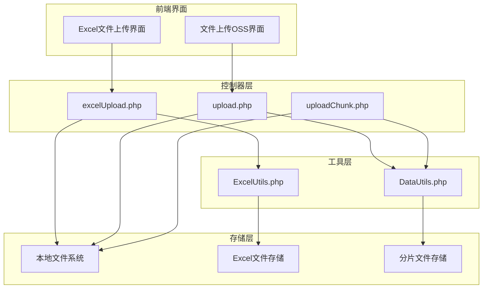
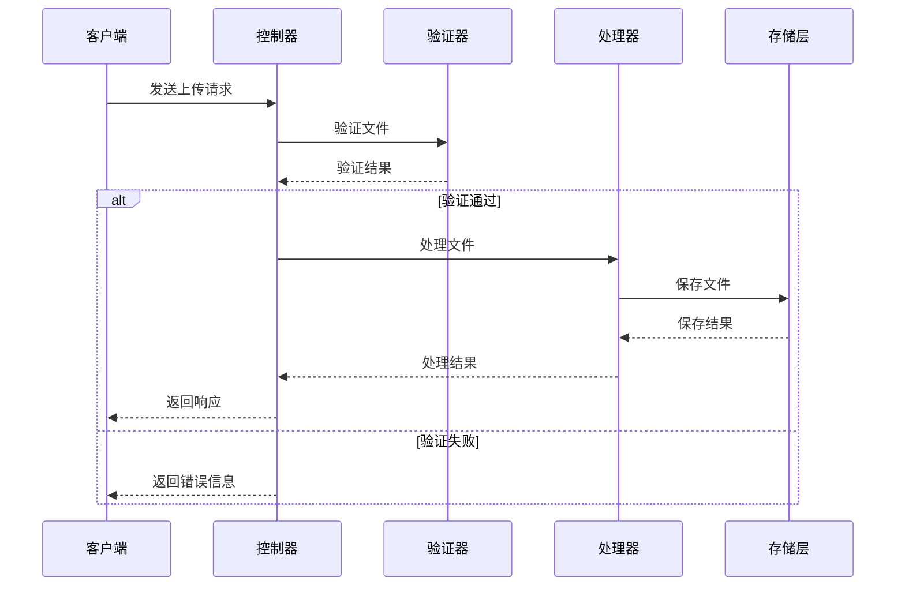
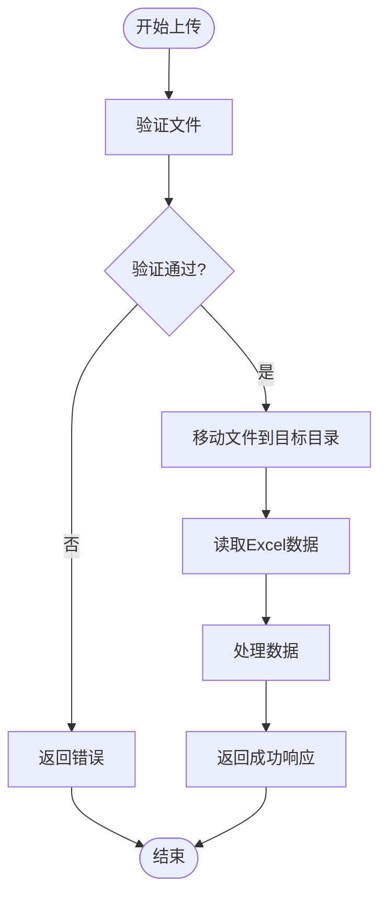
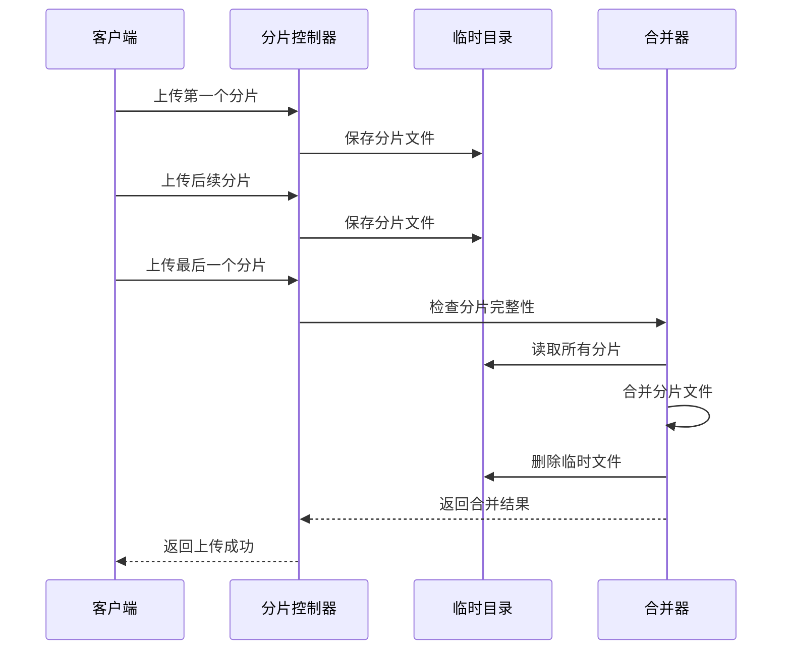
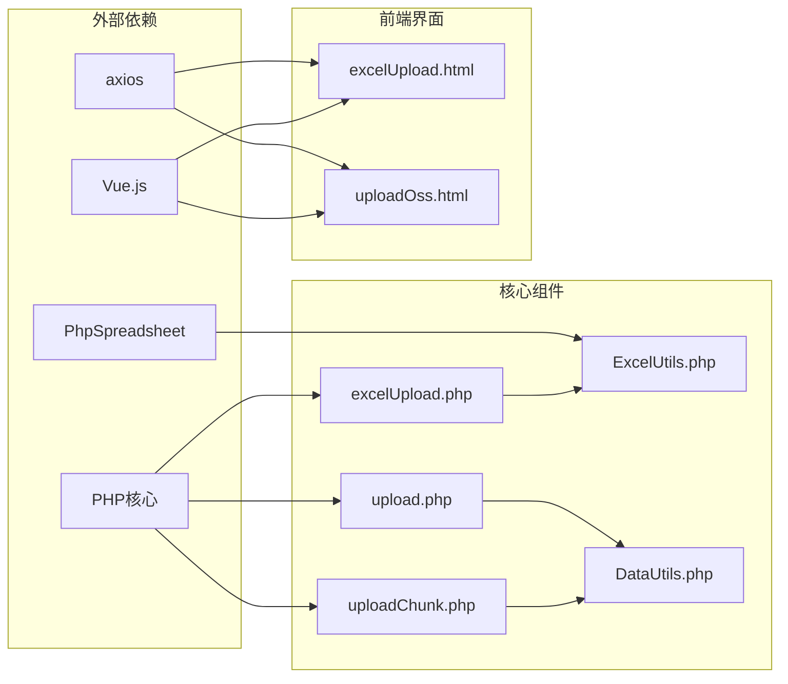

# 文件上传API

<cite>
**本文档引用的文件**
- [excelUpload.php](file://php/controller/excelUpload.php)
- [upload.php](file://php/controller/upload.php)
- [uploadChunk.php](file://php/controller/uploadChunk.php)
- [ExcelUtils.php](file://php/utils/ExcelUtils.php)
- [DataUtils.php](file://php/utils/DataUtils.php)
- [excelUpload.html](file://template/excelUpload.html)
- [uploadOss.html](file://template/fix/uploadOss.html)
</cite>

## 目录
1. [简介](#简介)
2. [项目结构](#项目结构)
3. [核心组件](#核心组件)
4. [架构概览](#架构概览)
5. [详细组件分析](#详细组件分析)
6. [依赖关系分析](#依赖关系分析)
7. [性能考虑](#性能考虑)
8. [故障排除指南](#故障排除指南)
9. [结论](#结论)

## 简介

本文档详细介绍了PaSystem项目中的文件上传API系统，包括通用文件上传接口的使用方法、单文件上传和分片上传两种模式。该系统提供了完整的文件上传、验证、处理和响应机制，支持Excel文件的特殊处理需求。

## 项目结构

文件上传API系统采用分层架构设计，主要包含以下组件：

**图表来源**
- [excelUpload.php](file://php/controller/excelUpload.php#L11-L27)
- [upload.php](file://php/controller/upload.php#L4-L13)
- [uploadChunk.php](file://php/controller/uploadChunk.php#L4-L13)

**章节来源**
- [excelUpload.php](file://php/controller/excelUpload.php#L1-L372)
- [upload.php](file://php/controller/upload.php#L1-L138)
- [uploadChunk.php](file://php/controller/uploadChunk.php#L1-L86)

## 核心组件

### Excel文件上传控制器

Excel文件上传控制器提供了完整的Excel文件处理能力，包括文件验证、数据读取和预览功能。

**关键特性：**
- 支持xlsx和xls格式文件
- 文件大小限制为10MB
- 自动验证文件类型和格式
- 提供数据预览功能
- 支持批量文件处理

**章节来源**
- [excelUpload.php](file://php/controller/excelUpload.php#L17-L27)
- [excelUpload.php](file://php/controller/excelUpload.php#L98-L140)

### 通用文件上传控制器

通用文件上传控制器支持多种文件类型的上传，特别针对Excel文件进行了优化处理。

**关键特性：**
- 支持单文件和多文件上传
- 文件类型验证（xlsx, xls）
- 唯一文件名生成
- Excel数据读取和处理
- 批量文件处理能力

**章节来源**
- [upload.php](file://php/controller/upload.php#L15-L60)
- [upload.php](file://php/controller/upload.php#L63-L121)

### 分片上传控制器

分片上传控制器实现了大文件的分片上传和合并功能，提高了上传的可靠性和效率。

**关键特性：**
- 支持大文件分片上传
- 分片完整性验证
- 自动文件合并
- 断点续传支持
- 临时文件管理

**章节来源**
- [uploadChunk.php](file://php/controller/uploadChunk.php#L15-L78)

## 架构概览

文件上传系统的整体架构采用MVC模式，清晰分离了业务逻辑、数据处理和用户界面。

**图表来源**
- [excelUpload.php](file://php/controller/excelUpload.php#L35-L95)
- [upload.php](file://php/controller/upload.php#L15-L60)

**章节来源**
- [ExcelUtils.php](file://php/utils/ExcelUtils.php#L147-L181)
- [DataUtils.php](file://php/utils/DataUtils.php#L337-L339)

## 详细组件分析

### Excel文件上传流程

Excel文件上传流程包含了完整的文件处理生命周期：

**图表来源**
- [excelUpload.php](file://php/controller/excelUpload.php#L35-L95)
- [excelUpload.php](file://php/controller/excelUpload.php#L148-L238)

**章节来源**
- [excelUpload.php](file://php/controller/excelUpload.php#L35-L95)
- [ExcelUtils.php](file://php/utils/ExcelUtils.php#L147-L181)

### 分片上传完整流程

分片上传实现了复杂的大文件传输机制：

**图表来源**
- [uploadChunk.php](file://php/controller/uploadChunk.php#L15-L78)

**章节来源**
- [uploadChunk.php](file://php/controller/uploadChunk.php#L15-L78)

### 响应格式规范

系统提供了统一的响应格式，确保前后端交互的一致性：

| 字段 | 类型 | 描述 | 示例 |
|------|------|------|------|
| success | boolean | 操作是否成功 | true/false |
| message | string | 操作结果描述 | "上传成功" |
| data | object/array | 返回的数据内容 | {} |
| code | integer | 状态码 | 200/400 |

**章节来源**
- [excelUpload.php](file://php/controller/excelUpload.php#L72-L94)
- [upload.php](file://php/controller/upload.php#L18-L60)

### 错误处理机制

系统实现了完善的错误处理机制，涵盖各种可能的错误场景：

**上传错误类型：**
- 文件大小超限
- 文件类型不支持
- 文件读写失败
- Excel数据解析错误
- 网络连接异常

**章节来源**
- [excelUpload.php](file://php/controller/excelUpload.php#L104-L140)
- [upload.php](file://php/controller/upload.php#L17-L34)

## 依赖关系分析

文件上传系统各组件之间的依赖关系如下：

**图表来源**
- [ExcelUtils.php](file://php/utils/ExcelUtils.php#L1-L15)
- [DataUtils.php](file://php/utils/DataUtils.php#L1-L10)

**章节来源**
- [requiredfile/requiredChorm.php](file://php/requiredfile/requiredChorm.php#L1-L10)

## 性能考虑

### 文件大小限制

系统设置了合理的文件大小限制以平衡功能需求和性能表现：

- **Excel文件上传**: 10MB限制
- **通用文件上传**: 无明确限制（建议合理设置）
- **分片大小**: 建议10-50MB范围

### 内存使用优化

- Excel文件使用流式读取避免内存溢出
- 分片上传采用临时文件存储
- 自动清理临时文件防止磁盘空间占用

### 并发处理

- 支持多文件并发上传
- 分片上传的并行处理能力
- 数据库连接池管理

## 故障排除指南

### 常见问题及解决方案

**文件上传失败**
- 检查文件大小是否超过限制
- 验证文件格式是否正确
- 确认服务器磁盘空间充足

**Excel文件解析错误**
- 确认Excel文件格式兼容性
- 检查文件是否被其他程序占用
- 验证Excel文件完整性

**分片上传异常**
- 检查网络连接稳定性
- 确认分片编号连续性
- 验证临时文件权限

**章节来源**
- [excelUpload.php](file://php/controller/excelUpload.php#L104-L140)
- [uploadChunk.php](file://php/controller/uploadChunk.php#L15-L78)

### 调试技巧

1. **启用详细错误日志**
2. **使用浏览器开发者工具监控网络请求**
3. **检查服务器端错误日志**
4. **验证文件权限设置**

## 结论

PaSystem的文件上传API系统提供了完整、可靠的文件处理解决方案。系统采用模块化设计，支持多种文件格式和上传模式，具有良好的扩展性和维护性。通过合理的错误处理机制和性能优化，能够满足大多数文件上传场景的需求。

建议在实际部署中：
- 根据具体需求调整文件大小限制
- 配置合适的分片大小
- 建立完善的监控和日志系统
- 定期备份重要文件数据