# Bootstrap组件系统

<cite>
**本文档引用的文件**
- [home.html](file://template/home.html)
- [excelUpload.html](file://template/excelUpload.html)
- [bootstrap.min.css](file://template/css_js/bootstrap-5.3.0/css/bootstrap.min.css)
- [bootstrap.bundle.min.js](file://template/css_js/bootstrap-5.3.0/js/bootstrap.bundle.min.js)
- [common.js](file://template/css_js/script/common.js)
- [package.json](file://template/package.json)
</cite>

## 目录
1. [简介](#简介)
2. [项目结构](#项目结构)
3. [核心组件](#核心组件)
4. [架构概览](#架构概览)
5. [详细组件分析](#详细组件分析)
6. [依赖关系分析](#依赖关系分析)
7. [性能考虑](#性能考虑)
8. [故障排除指南](#故障排除指南)
9. [结论](#结论)

## 简介

PaSystem采用Bootstrap 5.3.0作为前端UI框架，结合Vue.js实现现代化的数据管理系统。该系统提供了完整的响应式布局解决方案，包括网格系统、组件库和交互功能。

Bootstrap 5.3.0引入了新的设计理念，包括：
- 移动优先的响应式设计
- CSS变量驱动的主题系统
- 改进的网格系统和断点
- 增强的组件可定制性

## 项目结构

项目采用模块化的文件组织方式，主要包含以下结构：

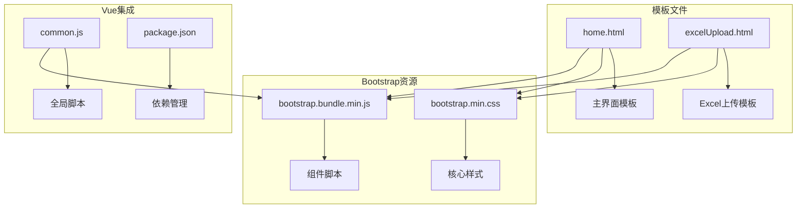

**图表来源**
- [home.html](file://template/home.html#L1-L761)
- [excelUpload.html](file://template/excelUpload.html#L1-L472)
- [bootstrap.min.css](file://template/css_js/bootstrap-5.3.0/css/bootstrap.min.css#L1-L6)
- [bootstrap.bundle.min.js](file://template/css_js/bootstrap-5.3.0/js/bootstrap.bundle.min.js#L1-L7)

**章节来源**
- [home.html](file://template/home.html#L1-L761)
- [excelUpload.html](file://template/excelUpload.html#L1-L472)
- [bootstrap.min.css](file://template/css_js/bootstrap-5.3.0/css/bootstrap.min.css#L1-L6)
- [bootstrap.bundle.min.js](file://template/css_js/bootstrap-5.3.0/js/bootstrap.bundle.min.js#L1-L7)

## 核心组件

### 网格系统

Bootstrap 5.3.0提供了强大的响应式网格系统，支持多种断点：

| 断点 | 最小宽度 | 类前缀 | 特性 |
|------|----------|--------|------|
| xs | 0 | 默认 | 超小设备（手机） |
| sm | 576px | `.col-sm-*` | 小型设备（平板） |
| md | 768px | `.col-md-*` | 中型设备（桌面） |
| lg | 992px | `.col-lg-*` | 大型设备（大桌面） |
| xl | 1200px | `.col-xl-*` | 超大设备（超宽屏） |
| xxl | 1400px | `.col-xxl-*` | 超超大设备 |

### 响应式布局特性

系统实现了完整的移动优先设计策略：

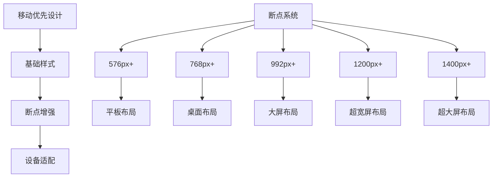

**图表来源**
- [bootstrap.min.css](file://template/css_js/bootstrap-5.3.0/css/bootstrap.min.css#L1-L6)

### 组件库概览

系统集成了Bootstrap的核心组件，包括：

- **卡片组件**：用于内容分组和展示
- **按钮组件**：支持多种样式和尺寸
- **导航组件**：包括导航栏和标签页
- **模态框**：用于弹窗和对话框
- **表单组件**：支持各种输入类型
- **网格系统**：响应式布局基础

**章节来源**
- [bootstrap.min.css](file://template/css_js/bootstrap-5.3.0/css/bootstrap.min.css#L1-L6)

## 架构概览

系统采用前后端分离的架构模式，Bootstrap负责前端UI展示，Vue.js处理数据绑定和组件逻辑。

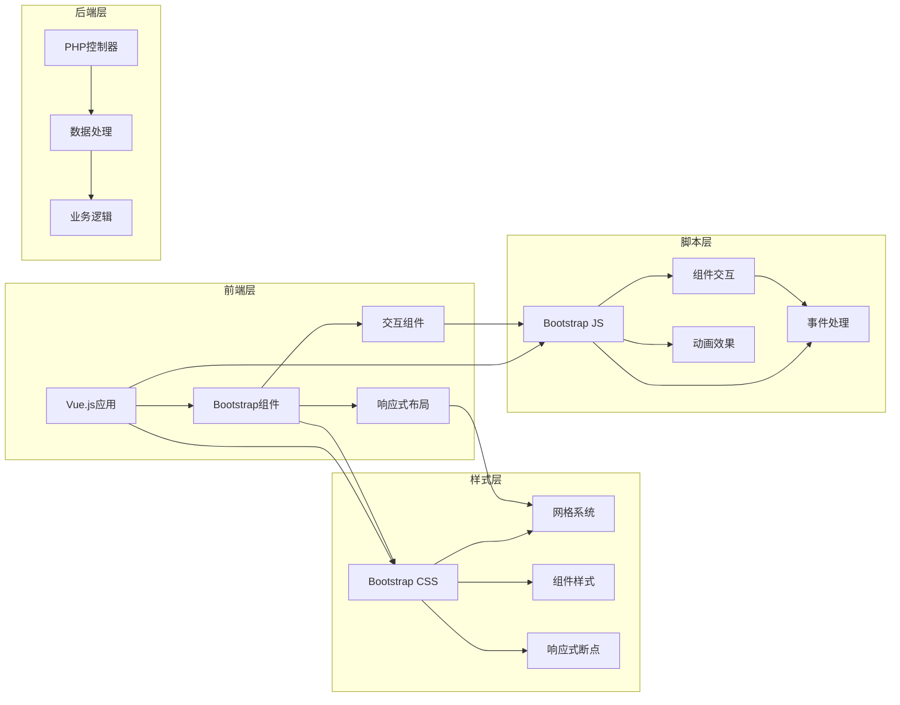

**图表来源**
- [home.html](file://template/home.html#L1-L761)
- [excelUpload.html](file://template/excelUpload.html#L1-L472)
- [bootstrap.bundle.min.js](file://template/css_js/bootstrap-5.3.0/js/bootstrap.bundle.min.js#L1-L7)

## 详细组件分析

### 卡片组件（Card）

卡片组件是系统中最常用的布局容器，提供了丰富的样式选项和交互功能。

#### 基础卡片结构

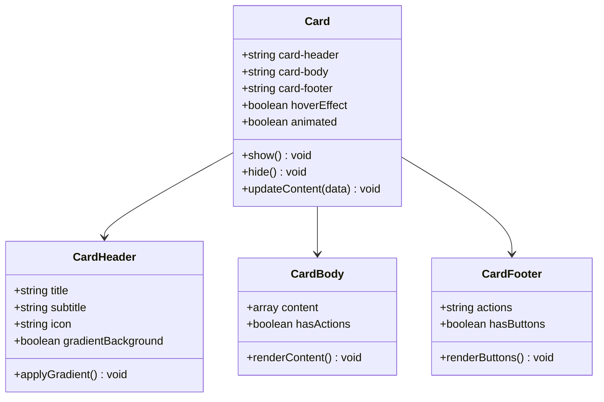

**图表来源**
- [home.html](file://template/home.html#L43-L88)

#### 卡片样式变体

系统实现了多种卡片样式变体：

| 样式类型 | CSS类 | 特性 | 使用场景 |
|----------|-------|------|----------|
| 标准卡片 | `.card` | 基础样式 | 通用内容展示 |
| 悬浮卡片 | `.card:hover` | 悬停效果 | 功能入口卡片 |
| 渐变卡片 | `.card-gradient` | 渐变背景 | 主要功能模块 |
| 毛玻璃卡片 | `.card-blur` | 模糊效果 | 弹窗和对话框 |

#### 卡片交互功能

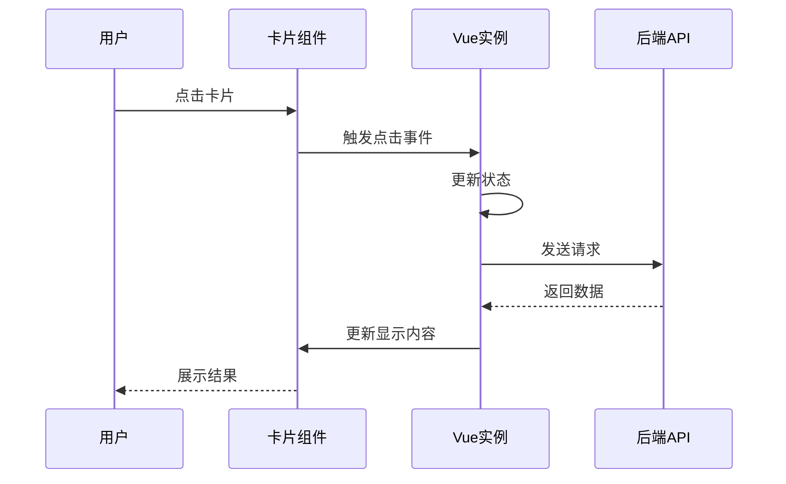

**图表来源**
- [home.html](file://template/home.html#L548-L565)

**章节来源**
- [home.html](file://template/home.html#L43-L88)
- [home.html](file://template/home.html#L521-L568)

### 按钮组件（Button）

按钮组件提供了统一的交互体验和视觉反馈。

#### 按钮样式系统

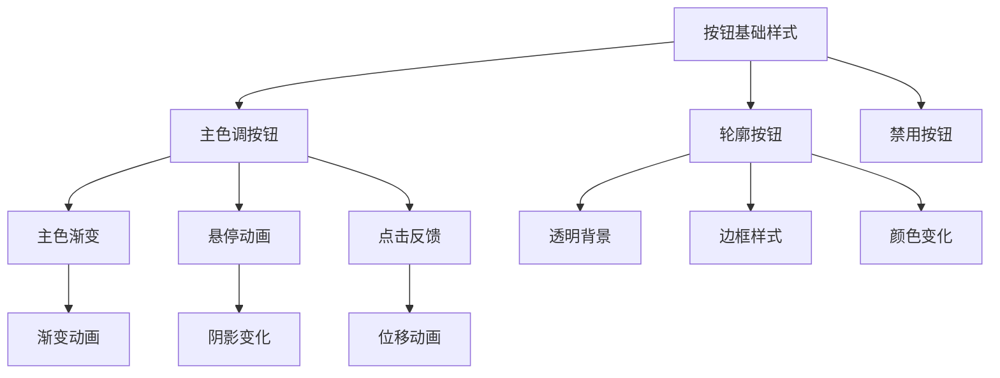

**图表来源**
- [home.html](file://template/home.html#L160-L211)

#### 按钮交互状态

| 状态 | CSS类 | 效果 | 用途 |
|------|-------|------|------|
| 正常 | `.btn-primary` | 实心渐变 | 主要操作 |
| 悬停 | `:hover` | 阴影增强 | 用户反馈 |
| 点击 | `:active` | 位移效果 | 按压感 |
| 禁用 | `.disabled` | 透明度降低 | 不可用状态 |

**章节来源**
- [home.html](file://template/home.html#L160-L211)
- [excelUpload.html](file://template/excelUpload.html#L195-L203)

### 导航组件（Navigation）

导航组件支持多种布局方式和交互模式。

#### 导航结构

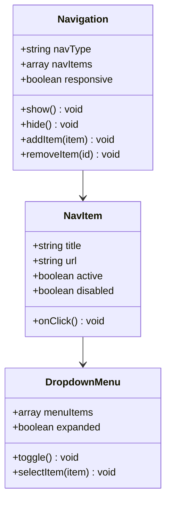

**图表来源**
- [home.html](file://template/home.html#L488-L500)

#### 导航响应式设计

系统实现了完整的导航响应式适配：

- **移动端**：折叠菜单，汉堡按钮
- **平板端**：简化导航项
- **桌面端**：完整导航栏

**章节来源**
- [home.html](file://template/home.html#L488-L500)

### 模态框组件（Modal）

模态框组件提供了弹窗和对话框功能。

#### 模态框生命周期

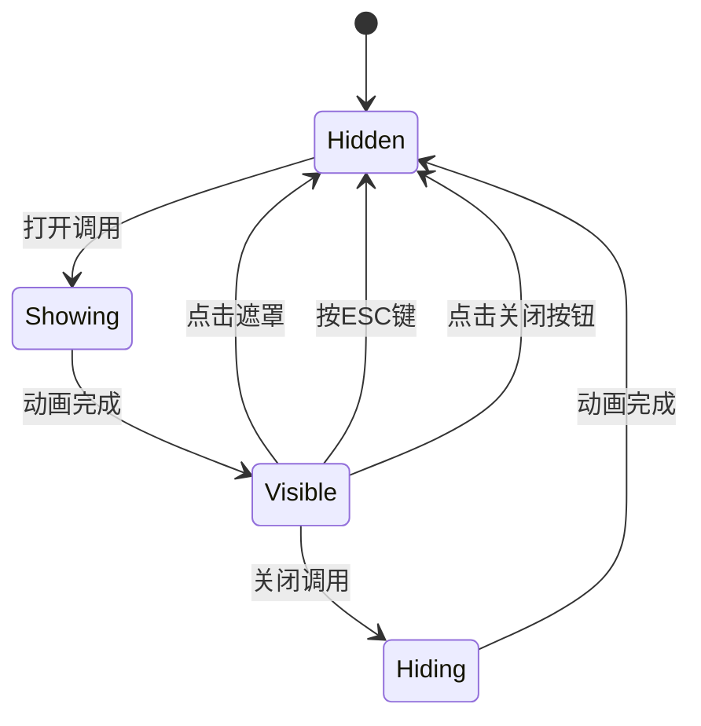

**图表来源**
- [bootstrap.bundle.min.js](file://template/css_js/bootstrap-5.3.0/js/bootstrap.bundle.min.js#L1-L7)

#### 模态框配置选项

| 选项 | 类型 | 默认值 | 描述 |
|------|------|--------|------|
| backdrop | boolean/string | true | 是否显示遮罩层 |
| keyboard | boolean | true | ESC键是否关闭 |
| focus | boolean | true | 自动聚焦到模态框 |
| show | boolean | true | 初始化时是否显示 |

**章节来源**
- [bootstrap.bundle.min.js](file://template/css_js/bootstrap-5.3.0/js/bootstrap.bundle.min.js#L1-L7)

### 表单组件（Form）

表单组件支持多种输入类型和验证功能。

#### 表单控件类型

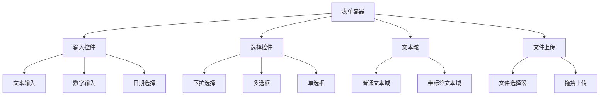

**图表来源**
- [excelUpload.html](file://template/excelUpload.html#L132-L152)

**章节来源**
- [excelUpload.html](file://template/excelUpload.html#L132-L152)

## 依赖关系分析

### 前端依赖管理

系统使用npm进行包管理，主要依赖包括：

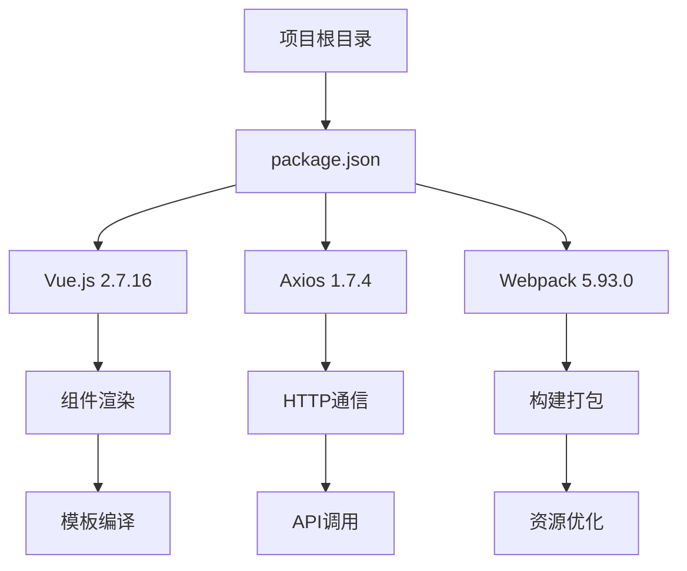

**图表来源**
- [package.json](file://template/package.json#L1-L15)

### 资源加载策略

系统采用了CDN和本地资源相结合的加载策略：

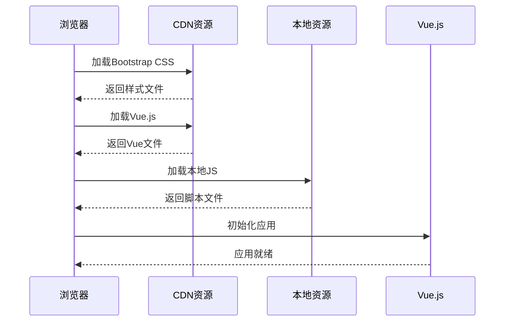

**图表来源**
- [home.html](file://template/home.html#L7-L10)

**章节来源**
- [package.json](file://template/package.json#L1-L15)
- [common.js](file://template/css_js/script/common.js#L1-L5)

## 性能考虑

### 资源优化策略

系统采用了多项性能优化措施：

1. **按需加载**：只加载必要的Bootstrap组件
2. **压缩优化**：使用minified版本的CSS和JS文件
3. **缓存策略**：利用浏览器缓存机制
4. **懒加载**：非关键资源延迟加载

### 响应式性能

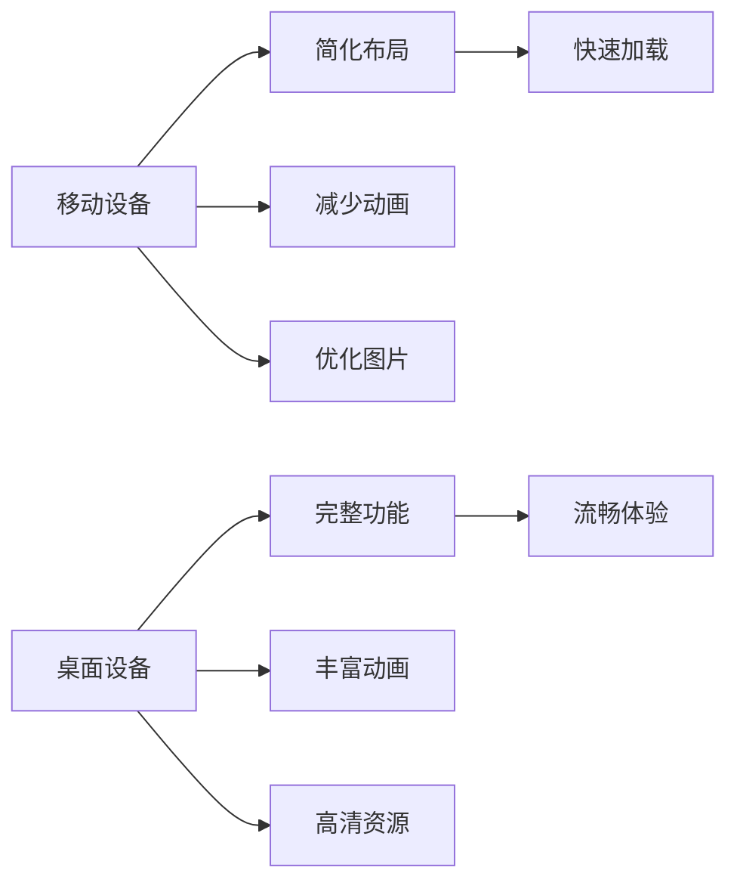

## 故障排除指南

### 常见问题及解决方案

#### Bootstrap样式冲突

**问题**：自定义样式覆盖Bootstrap默认样式
**解决方案**：
1. 使用更具体的选择器
2. 添加`!important`声明
3. 检查CSS加载顺序

#### Vue组件初始化失败

**问题**：Vue实例无法正确初始化
**解决方案**：
1. 确认Vue.js版本兼容性
2. 检查DOM元素是否存在
3. 验证数据绑定语法

#### 响应式布局异常

**问题**：在某些设备上布局错乱
**解决方案**：
1. 检查viewport meta标签
2. 验证断点设置
3. 测试不同屏幕尺寸

**章节来源**
- [excelUpload.html](file://template/excelUpload.html#L285-L292)

## 结论

PaSystem的Bootstrap 5.3.0组件系统提供了完整的前端解决方案，具有以下特点：

1. **现代化设计**：采用移动优先的设计理念
2. **组件丰富**：涵盖常用UI组件和交互功能
3. **易于扩展**：支持自定义主题和样式覆盖
4. **性能优化**：合理的资源管理和加载策略
5. **开发友好**：与Vue.js无缝集成

通过合理使用Bootstrap的网格系统、组件库和响应式特性，系统能够为用户提供优秀的跨设备使用体验。建议在实际开发中遵循Bootstrap的最佳实践，确保代码的可维护性和性能表现。