# Vue.js架构设计

<cite>
**本文档引用的文件**
- [home.html](file://template/home.html)
- [excelUpload.html](file://template/excelUpload.html)
- [skuImportSync.html](file://template/fix/skuImportSync.html)
- [package.json](file://template/package.json)
- [vue.global.js](file://template/css_js/script/vue.global.js)
- [common.js](file://template/css_js/script/common.js)
- [lizi.js](file://template/css_js/own/lizi.js)
- [toast.js](file://template/css_js/js/toast.js)
- [excelUpload.php](file://php/controller/excelUpload.php)
- [skuImportSync.php](file://php/controller/skuImportSync.php)
</cite>

## 目录
1. [简介](#简介)
2. [项目结构](#项目结构)
3. [核心组件](#核心组件)
4. [架构概览](#架构概览)
5. [详细组件分析](#详细组件分析)
6. [依赖关系分析](#依赖关系分析)
7. [性能考虑](#性能考虑)
8. [故障排除指南](#故障排除指南)
9. [结论](#结论)

## 简介

PaSystem是一个基于Vue.js 3的前端架构项目，采用MVVM（Model-View-ViewModel）设计模式，实现了完整的响应式数据绑定、组件生命周期管理和事件处理机制。该项目通过Vue.js 3的强大功能，结合PHP后端服务，构建了一个现代化的数据管理系统。

项目的核心特点包括：
- 基于Vue.js 3的MVVM架构实现
- 完整的响应式数据绑定系统
- 组件生命周期管理和事件处理
- 前后端分离的RESTful API设计
- 实时数据同步和状态管理
- 用户友好的界面交互体验

## 项目结构

PaSystem项目采用清晰的分层架构设计，主要分为前端模板层、Vue.js核心层和后端PHP控制器层：

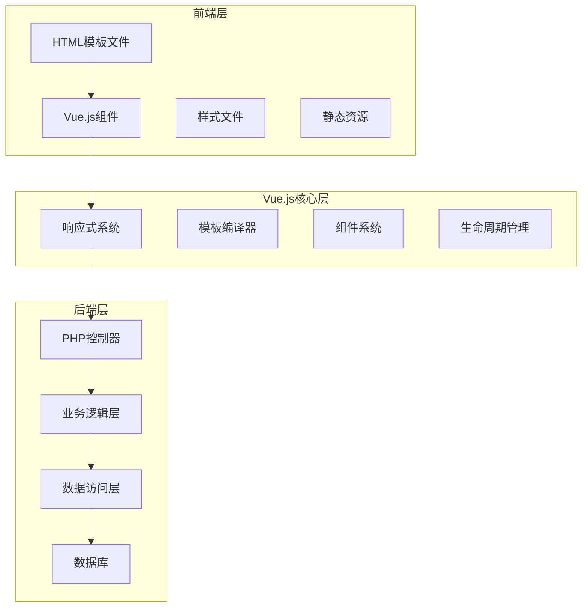

**图表来源**
- [home.html](file://template/home.html#L1-L761)
- [excelUpload.html](file://template/excelUpload.html#L1-L472)
- [skuImportSync.html](file://template/fix/skuImportSync.html#L1-L585)

### 核心目录结构

项目的主要目录组织如下：

- **template/**: 包含所有前端模板文件和静态资源
  - `home.html`: 主页面，展示功能列表和导航
  - `excelUpload.html`: Excel文件上传和数据处理页面
  - `fix/`: 修复功能页面集合
  - `css_js/`: 样式和JavaScript资源
  - `package.json`: 项目依赖配置

- **php/**: 后端PHP控制器和服务
  - `controller/`: API控制器类
  - `utils/`: 工具函数和辅助类
  - `export/`: 导出文件和数据

**章节来源**
- [home.html](file://template/home.html#L1-L761)
- [excelUpload.html](file://template/excelUpload.html#L1-L472)
- [skuImportSync.html](file://template/fix/skuImportSync.html#L1-L585)

## 核心组件

### Vue.js 3响应式系统

PaSystem项目充分利用了Vue.js 3的响应式系统特性，实现了高效的数据绑定和状态管理。

#### 响应式数据绑定

Vue.js 3通过Proxy实现响应式数据绑定，提供了更强大的数据监听能力：

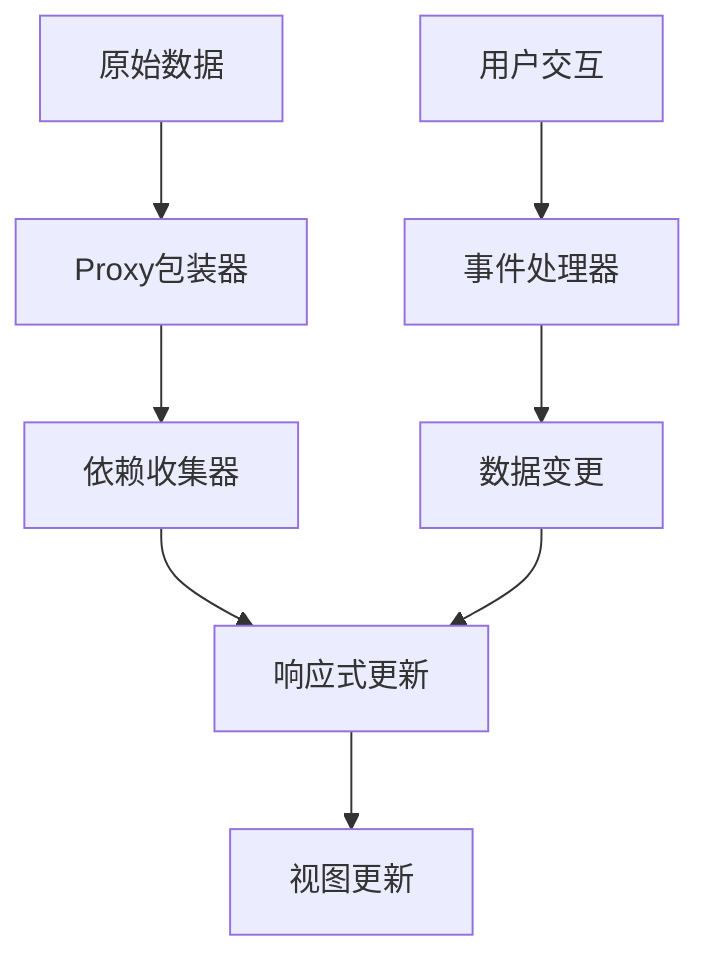

**图表来源**
- [vue.global.js](file://template/css_js/script/vue.global.js#L1831-L2013)

#### 计算属性系统

计算属性提供了高效的派生数据管理机制：

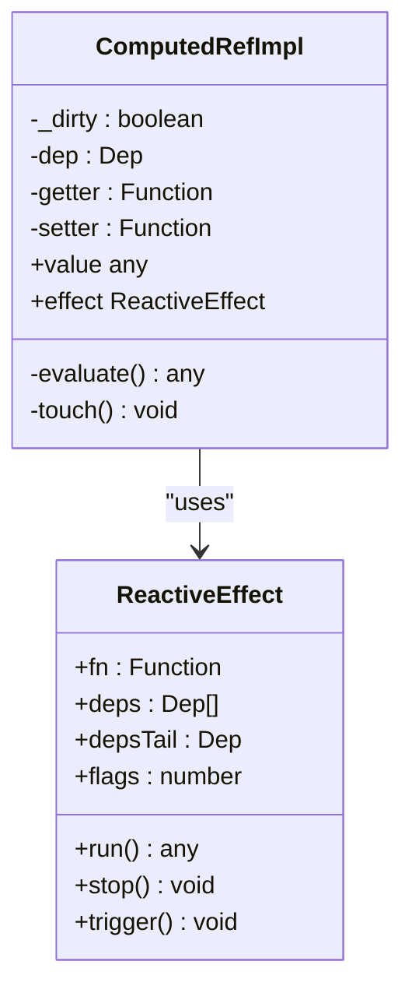

**图表来源**
- [vue.global.js](file://template/css_js/script/vue.global.js#L1831-L2013)

**章节来源**
- [vue.global.js](file://template/css_js/script/vue.global.js#L1831-L2013)

### 组件生命周期管理

Vue.js 3提供了完整的生命周期钩子系统，支持组件的创建、挂载、更新和销毁过程：

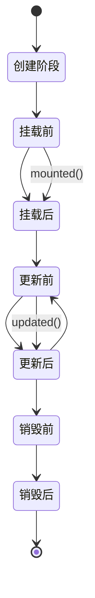

**图表来源**
- [vue.global.js](file://template/css_js/script/vue.global.js#L6040-L6084)

**章节来源**
- [vue.global.js](file://template/css_js/script/vue.global.js#L6040-L6084)

## 架构概览

PaSystem采用了经典的前后端分离架构，通过RESTful API实现数据交互：

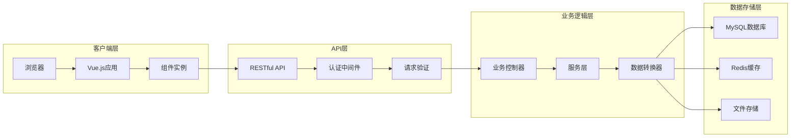

**图表来源**
- [excelUpload.html](file://template/excelUpload.html#L364-L396)
- [skuImportSync.html](file://template/fix/skuImportSync.html#L520-L544)

### 数据流架构

系统采用单向数据流设计，确保数据变更的可预测性和可追踪性：

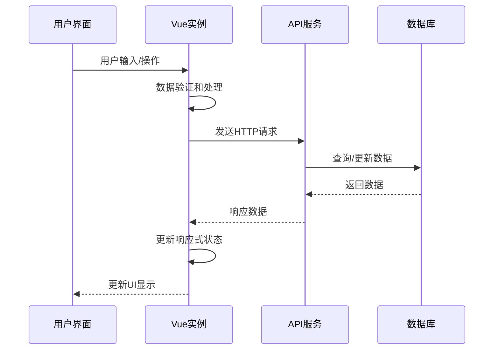

**图表来源**
- [excelUpload.php](file://php/controller/excelUpload.php#L331-L372)
- [skuImportSync.php](file://php/controller/skuImportSync.php#L474-L512)

## 详细组件分析

### 主页面组件 (home.html)

主页面组件展示了PaSystem的核心功能和导航结构，采用Vue.js 3的组合式API实现：

#### 组件结构分析

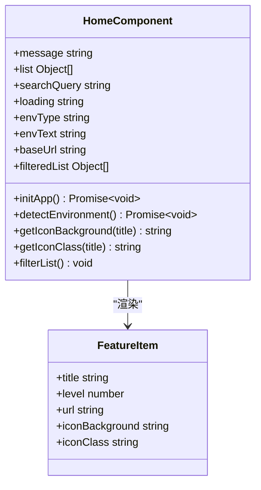

**图表来源**
- [home.html](file://template/home.html#L597-L758)

#### 响应式数据绑定

主页面使用了多种Vue.js 3的响应式特性：

1. **基础数据绑定**: `message`、`searchQuery`、`loading`
2. **计算属性**: `filteredList`实现动态搜索过滤
3. **条件渲染**: `v-if`、`v-else`控制空状态显示
4. **列表渲染**: `v-for`遍历功能列表

**章节来源**
- [home.html](file://template/home.html#L597-L758)

### Excel文件上传组件 (excelUpload.html)

Excel文件上传组件实现了完整的文件上传、预览和数据处理功能：

#### 组件功能特性

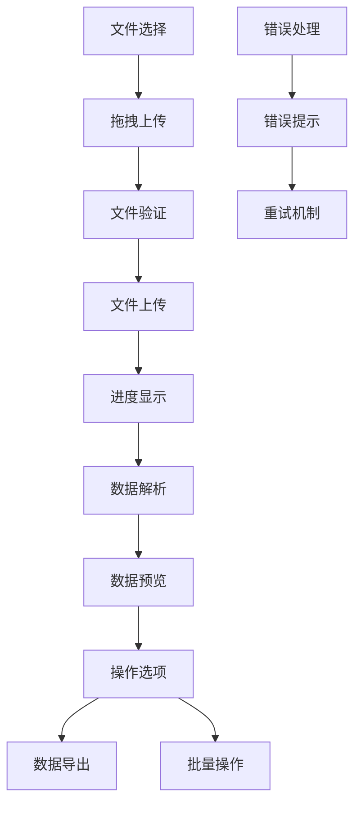

**图表来源**
- [excelUpload.html](file://template/excelUpload.html#L342-L463)

#### 事件处理机制

组件实现了丰富的用户交互事件处理：

1. **文件操作事件**: `@change`、`@drop`、`@dragover`
2. **用户界面事件**: `@click`、`@input`、`@submit`
3. **进度监控事件**: `onUploadProgress`回调
4. **状态管理事件**: 生命周期钩子

**章节来源**
- [excelUpload.html](file://template/excelUpload.html#L314-L463)

### SKU数据同步组件 (skuImportSync.html)

SKU数据同步组件提供了复杂的数据导入和同步功能，支持多模块、多环境的数据同步：

#### 同步流程设计

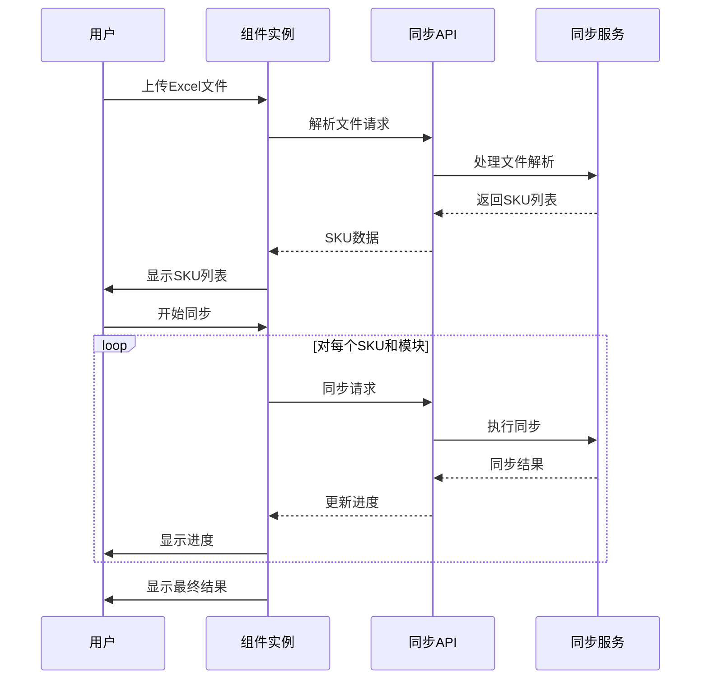

**图表来源**
- [skuImportSync.html](file://template/fix/skuImportSync.html#L458-L560)

#### 状态管理机制

组件使用Vue.js 3的响应式系统管理复杂的同步状态：

1. **同步状态**: `isSyncing`、`syncResults`
2. **统计计算**: `totalCount`、`completedCount`等
3. **进度跟踪**: 实时更新同步进度
4. **错误处理**: 统一的错误状态管理

**章节来源**
- [skuImportSync.html](file://template/fix/skuImportSync.html#L355-L582)

### 通用工具组件

#### Toast通知组件

Toast组件提供了统一的通知系统，支持多种通知类型：

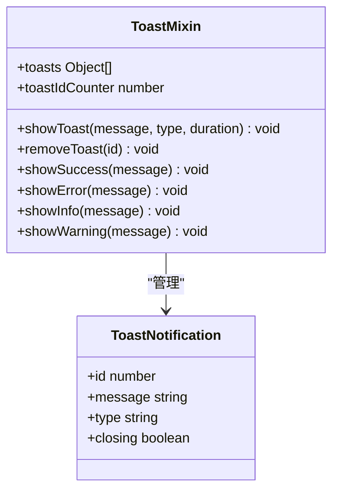

**图表来源**
- [toast.js](file://template/css_js/js/toast.js#L6-L86)

**章节来源**
- [toast.js](file://template/css_js/js/toast.js#L6-L86)

## 依赖关系分析

### 前端依赖管理

PaSystem项目使用npm进行包管理，主要依赖包括：

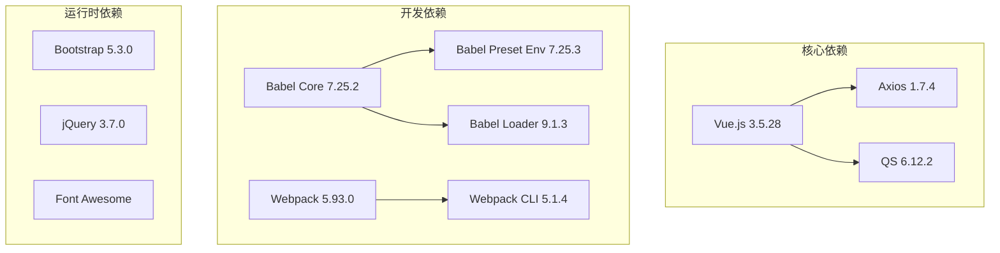

**图表来源**
- [package.json](file://template/package.json#L1-L15)

### 后端集成架构

系统通过RESTful API实现前后端通信：

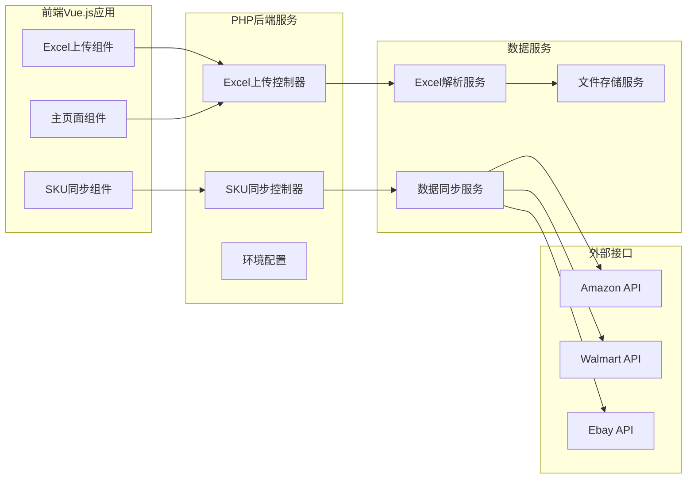

**图表来源**
- [excelUpload.php](file://php/controller/excelUpload.php#L1-L372)
- [skuImportSync.php](file://php/controller/skuImportSync.php#L1-L512)

**章节来源**
- [package.json](file://template/package.json#L1-L15)

## 性能考虑

### 响应式系统优化

Vue.js 3的响应式系统相比Vue.js 2有显著的性能提升：

1. **Proxy替代Object.defineProperty**: 提供更好的性能和更少的内存占用
2. **Tree-shaking支持**: 通过ES模块系统实现更好的代码分割
3. **更精确的依赖追踪**: 减少不必要的重新渲染

### 组件渲染优化

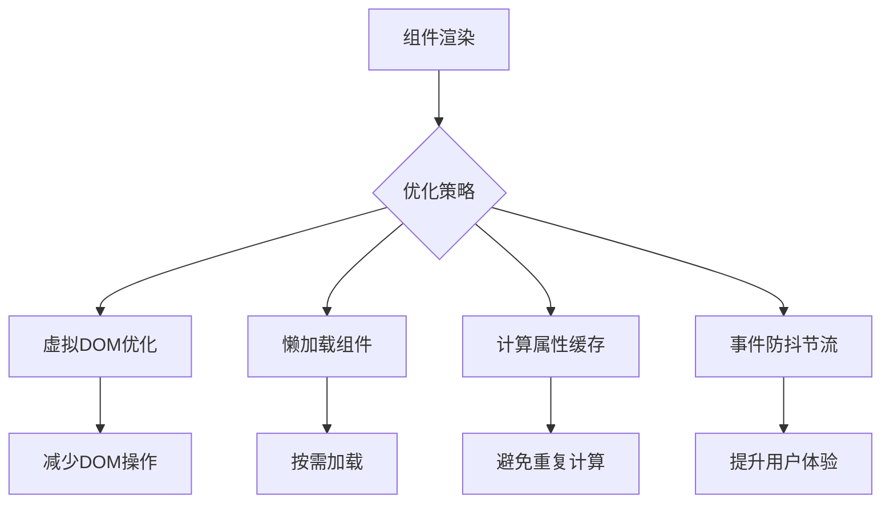

### 数据处理优化

1. **批量数据处理**: 使用分批处理避免长时间阻塞UI
2. **进度反馈**: 实时显示处理进度，提升用户体验
3. **错误恢复**: 实现断点续传和错误重试机制

## 故障排除指南

### 常见问题诊断

#### Vue.js实例创建问题

当Vue.js实例无法正常创建时，可以通过以下方式进行诊断：

1. **检查Vue.js版本兼容性**
2. **验证模板语法正确性**
3. **确认响应式数据初始化**

#### API通信问题

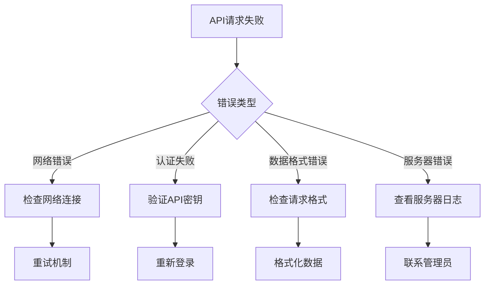

#### 性能问题排查

1. **监控组件渲染次数**
2. **检查计算属性依赖**
3. **分析事件处理性能**
4. **优化数据绑定层级**

**章节来源**
- [excelUpload.html](file://template/excelUpload.html#L285-L470)
- [skuImportSync.html](file://template/fix/skuImportSync.html#L352-L582)

## 结论

PaSystem项目成功地将Vue.js 3的强大功能与PHP后端服务相结合，构建了一个现代化、高性能的数据管理系统。通过采用MVVM架构模式，项目实现了：

1. **清晰的架构分离**: 前后端职责明确，便于维护和扩展
2. **高效的响应式系统**: 利用Vue.js 3的最新特性提升性能
3. **完善的错误处理**: 提供健壮的错误处理和恢复机制
4. **优秀的用户体验**: 通过实时反馈和进度显示提升用户满意度

项目的成功实施证明了Vue.js 3在现代Web应用开发中的强大能力，为类似项目提供了宝贵的参考经验。通过持续的优化和改进，PaSystem将继续为用户提供更好的数据管理解决方案。