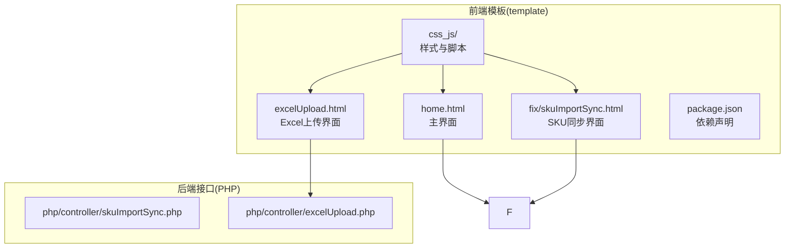
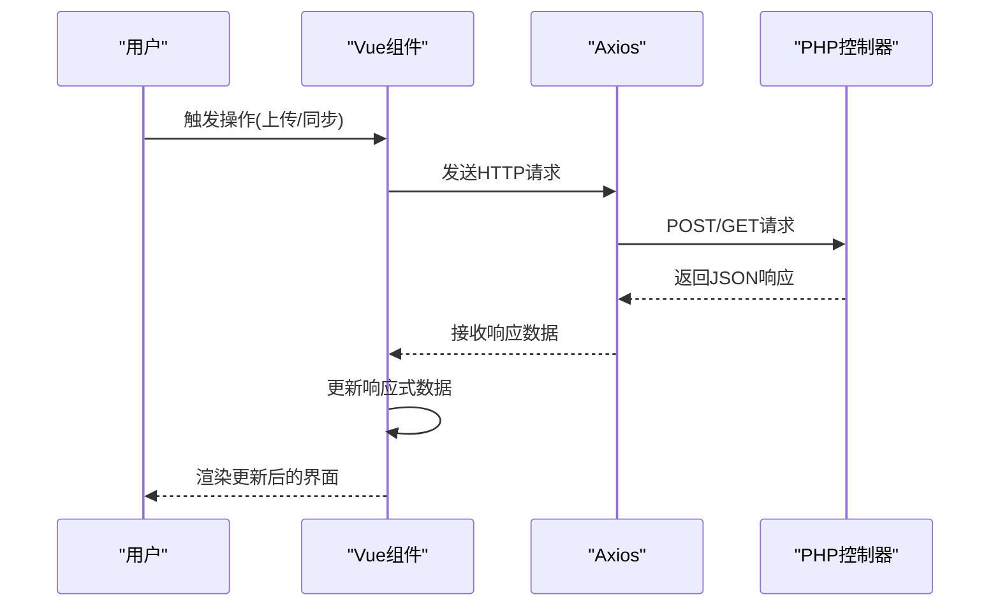
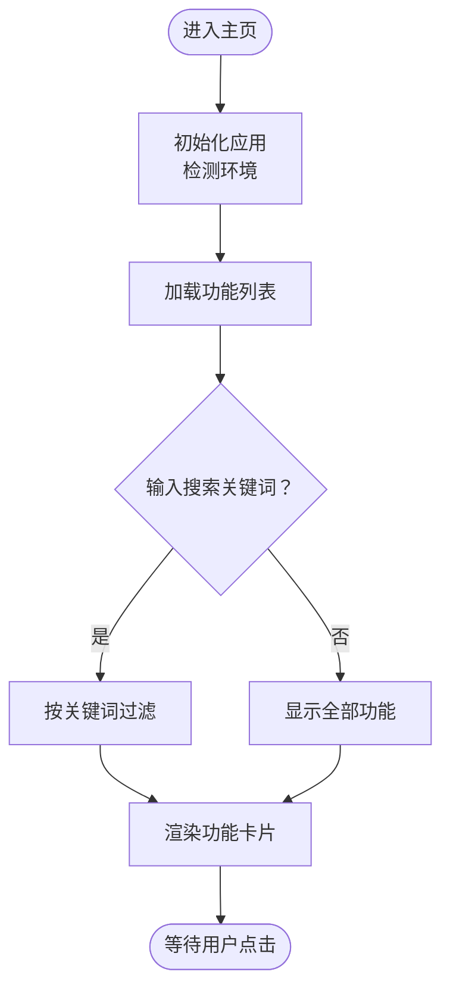
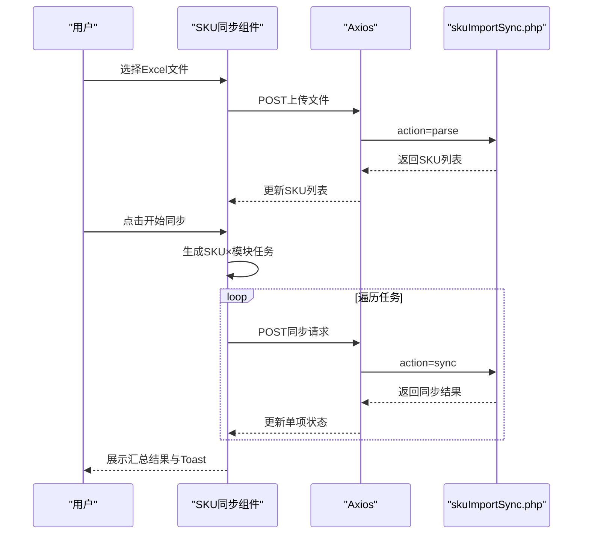
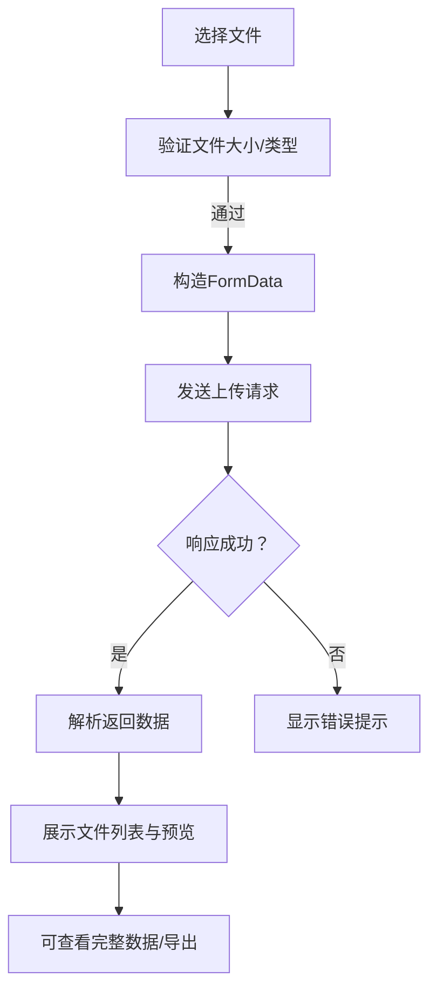
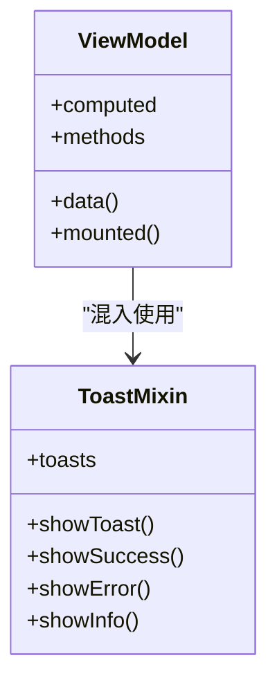
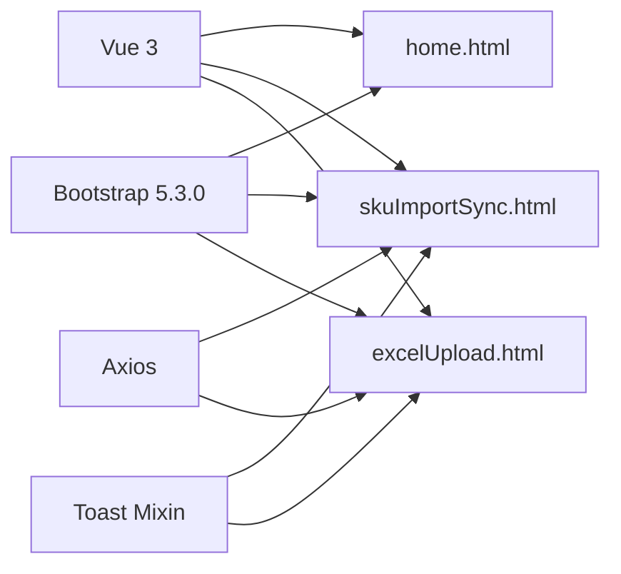

# 前端界面系统

<cite>
**本文档引用的文件**
- [home.html](file://template/home.html)
- [skuImportSync.html](file://template/fix/skuImportSync.html)
- [excelUpload.html](file://template/excelUpload.html)
- [package.json](file://template/package.json)
- [vue.global.js](file://template/css_js/script/vue.global.js)
- [bootstrap.bundle.min.js](file://template/css_js/bootstrap-5.3.0/js/bootstrap.bundle.min.js)
- [toast.js](file://template/css_js/js/toast.js)
- [code.js](file://template/css_js/own/code.js)
- [lizi.js](file://template/css_js/own/lizi.js)
- [common.js](file://template/css_js/script/common.js)
- [skuImportSync.php](file://php/controller/skuImportSync.php)
- [excelUpload.php](file://php/controller/excelUpload.php)
</cite>

## 目录
1. [简介](#简介)
2. [项目结构](#项目结构)
3. [核心组件](#核心组件)
4. [架构总览](#架构总览)
5. [详细组件分析](#详细组件分析)
6. [依赖关系分析](#依赖关系分析)
7. [性能考虑](#性能考虑)
8. [故障排除指南](#故障排除指南)
9. [结论](#结论)
10. [附录](#附录)

## 简介
本项目是一个基于Vue.js 3与Bootstrap 5.3.0构建的现代化前端界面系统，服务于PaSystem数据管理与同步场景。系统采用MVVM架构，通过Vue的响应式数据绑定与事件处理机制，结合Bootstrap的响应式布局与组件系统，提供直观、高效的用户交互体验。主要功能包括：
- 主界面：统一的功能入口与导航，支持按需筛选与环境指示
- SKU数据导入与同步：支持Excel模板下载、拖拽上传、批量同步至目标环境
- Excel文件上传与数据预览：支持多文件上传、进度反馈、数据表格预览

系统同时内置Toast通知组件与Canvas粒子特效，提升用户体验与视觉表现。

## 项目结构
前端资源集中于template目录，包含HTML页面、样式与脚本；后端接口位于php/controller目录，提供Excel解析与SKU同步服务。

**图表来源**
- [home.html](file://template/home.html#L1-L761)
- [skuImportSync.html](file://template/fix/skuImportSync.html#L1-L585)
- [excelUpload.html](file://template/excelUpload.html#L1-L472)
- [skuImportSync.php](file://php/controller/skuImportSync.php#L1-L512)
- [excelUpload.php](file://php/controller/excelUpload.php#L1-L372)

**章节来源**
- [home.html](file://template/home.html#L1-L761)
- [skuImportSync.html](file://template/fix/skuImportSync.html#L1-L585)
- [excelUpload.html](file://template/excelUpload.html#L1-L472)
- [package.json](file://template/package.json#L1-L15)

## 核心组件
- Vue.js 3：MVVM框架，负责视图层与数据层的双向绑定、组件化开发与生命周期管理
- Bootstrap 5.3.0：响应式UI框架，提供网格系统、组件与工具类，确保跨设备一致性
- Axios：HTTP客户端，用于前后端数据交互
- 自定义Toast通知：全局混入式通知组件，支持多种类型与自动关闭
- Canvas粒子特效：背景动画与交互增强

**章节来源**
- [package.json](file://template/package.json#L1-L15)
- [vue.global.js](file://template/css_js/script/vue.global.js#L1-L800)
- [bootstrap.bundle.min.js](file://template/css_js/bootstrap-5.3.0/js/bootstrap.bundle.min.js#L1-L7)
- [toast.js](file://template/css_js/js/toast.js#L1-L92)

## 架构总览
前端通过Vue组件驱动，使用Axios与后端PHP控制器进行数据交互；Bootstrap提供一致的UI体验；自定义脚本负责通知与特效。

**图表来源**
- [skuImportSync.html](file://template/fix/skuImportSync.html#L352-L582)
- [excelUpload.html](file://template/excelUpload.html#L285-L470)
- [skuImportSync.php](file://php/controller/skuImportSync.php#L474-L512)
- [excelUpload.php](file://php/controller/excelUpload.php#L330-L372)

## 详细组件分析

### 主界面组件（home.html）
- 功能入口：集中展示可用功能列表，支持关键词搜索与动态筛选
- 环境指示：根据主机名识别环境并显示对应徽章
- 响应式设计：针对移动端与平板进行适配
- 视觉增强：渐变背景、卡片阴影与悬停动画

**图表来源**
- [home.html](file://template/home.html#L594-L758)

**章节来源**
- [home.html](file://template/home.html#L1-L761)

### SKU数据导入与同步界面（skuImportSync.html）
- 模板下载：一键下载标准Excel模板
- 拖拽上传：支持拖拽与点击选择文件
- 解析Excel：读取SKU列表并校验文件大小
- 批量同步：遍历SKU与模块组合，逐项同步至目标环境（test/uat）
- 进度可视化：总体进度条与单项状态徽章
- 通知系统：Toast提示成功/失败/信息

**图表来源**
- [skuImportSync.html](file://template/fix/skuImportSync.html#L352-L582)
- [skuImportSync.php](file://php/controller/skuImportSync.php#L40-L77)

**章节来源**
- [skuImportSync.html](file://template/fix/skuImportSync.html#L1-L585)
- [skuImportSync.php](file://php/controller/skuImportSync.php#L1-L512)

### Excel文件上传与数据预览界面（excelUpload.html）
- 多文件上传：支持拖拽与多选
- 上传进度：实时显示百分比
- 数据预览：展示表头与预览行
- 成功/错误提示：基于响应状态显示

**图表来源**
- [excelUpload.html](file://template/excelUpload.html#L285-L470)
- [excelUpload.php](file://php/controller/excelUpload.php#L330-L372)

**章节来源**
- [excelUpload.html](file://template/excelUpload.html#L1-L472)
- [excelUpload.php](file://php/controller/excelUpload.php#L1-L372)

### Bootstrap组件系统与响应式设计
- 网格系统：基于Bootstrap网格实现灵活布局
- 组件库：按钮、卡片、进度条、下拉菜单等
- 响应式断点：针对不同屏幕尺寸优化显示
- 工具类：边距、颜色、对齐等辅助样式

**章节来源**
- [home.html](file://template/home.html#L1-L761)
- [skuImportSync.html](file://template/fix/skuImportSync.html#L1-L585)
- [excelUpload.html](file://template/excelUpload.html#L1-L472)
- [bootstrap.bundle.min.js](file://template/css_js/bootstrap-5.3.0/js/bootstrap.bundle.min.js#L1-L7)

### Vue MVVM架构实现
- 数据层：响应式数据（如SKU列表、上传状态、进度）
- 视图层：模板语法与指令（v-model、v-for、v-if等）
- 控制器：methods与computed，封装业务逻辑
- 生命周期：mounted钩子初始化与事件绑定

**图表来源**
- [skuImportSync.html](file://template/fix/skuImportSync.html#L352-L582)
- [toast.js](file://template/css_js/js/toast.js#L6-L86)

**章节来源**
- [skuImportSync.html](file://template/fix/skuImportSync.html#L352-L582)
- [excelUpload.html](file://template/excelUpload.html#L285-L470)
- [toast.js](file://template/css_js/js/toast.js#L1-L92)

### 用户交互流程与操作指南
- 主界面：打开页面后自动检测环境；输入关键词筛选功能；点击功能卡片进入对应页面
- SKU同步：下载模板 → 上传Excel → 选择目标环境 → 开始同步 → 查看进度与结果
- Excel上传：选择文件 → 查看上传进度 → 预览数据 → 查看完整数据/导出

**章节来源**
- [home.html](file://template/home.html#L594-L758)
- [skuImportSync.html](file://template/fix/skuImportSync.html#L352-L582)
- [excelUpload.html](file://template/excelUpload.html#L285-L470)

### 样式定制与主题配置
- CSS变量：通过CSS变量控制主色调与状态色
- 卡片与按钮：统一圆角、阴影与过渡动画
- 响应式断点：针对768px与576px进行布局调整
- 自定义Toast样式：滑入/滑出动画与状态徽章

**章节来源**
- [home.html](file://template/home.html#L13-L483)
- [skuImportSync.html](file://template/fix/skuImportSync.html#L14-L194)
- [excelUpload.html](file://template/excelUpload.html#L11-L110)
- [toast.js](file://template/css_js/js/toast.js#L1-L92)

### 前端性能优化策略
- 懒加载与按需引入：仅在需要时加载Vue与Bootstrap
- 上传进度回调：避免阻塞主线程
- Canvas动画节流：窗口大小变化时重置画布尺寸
- 组件化与混入：复用Toast逻辑，减少重复代码

**章节来源**
- [package.json](file://template/package.json#L1-L15)
- [excelUpload.html](file://template/excelUpload.html#L364-L373)
- [lizi.js](file://template/css_js/own/lizi.js#L89-L97)
- [toast.js](file://template/css_js/js/toast.js#L6-L86)

### 浏览器兼容性考虑
- Vue 3：支持现代浏览器，需关注旧版IE不支持
- Bootstrap 5：不再支持IE，建议使用Edge/Chrome/Firefox
- Axios：现代浏览器原生支持，无需额外polyfill
- Canvas：现代浏览器通用支持

**章节来源**
- [package.json](file://template/package.json#L1-L15)
- [bootstrap.bundle.min.js](file://template/css_js/bootstrap-5.3.0/js/bootstrap.bundle.min.js#L1-L7)

### 界面扩展与自定义指导
- 新增页面：参考现有HTML模板，引入Vue与Axios，定义data/computed/methods
- 自定义组件：将Toast混入应用于新页面，统一通知风格
- 样式扩展：通过CSS变量与Bootstrap类快速定制主题
- 交互增强：利用Canvas脚本实现背景动画或粒子效果

**章节来源**
- [home.html](file://template/home.html#L1-L761)
- [skuImportSync.html](file://template/fix/skuImportSync.html#L1-L585)
- [excelUpload.html](file://template/excelUpload.html#L1-L472)
- [code.js](file://template/css_js/own/code.js#L1-L62)
- [lizi.js](file://template/css_js/own/lizi.js#L1-L97)

## 依赖关系分析
- 前端依赖：Vue 3、Axios、Bootstrap 5.3.0
- 后端接口：SKU同步与Excel上传两个控制器
- 公共脚本：Toast混入、通用头部脚本引用

**图表来源**
- [package.json](file://template/package.json#L1-L15)
- [home.html](file://template/home.html#L1-L761)
- [skuImportSync.html](file://template/fix/skuImportSync.html#L1-L585)
- [excelUpload.html](file://template/excelUpload.html#L1-L472)
- [toast.js](file://template/css_js/js/toast.js#L1-L92)

**章节来源**
- [package.json](file://template/package.json#L1-L15)
- [common.js](file://template/css_js/script/common.js#L1-L5)

## 性能考虑
- 减少不必要的DOM更新：使用计算属性与响应式数据
- 上传优化：分块上传与进度回调，避免长时间阻塞
- 动画性能：Canvas动画使用requestAnimationFrame，降低CPU占用
- 资源压缩：使用min版本的JS/CSS文件

[本节为通用指导，无需特定文件引用]

## 故障排除指南
- Vue加载失败：检查CDN链接与本地资源路径
- 上传失败：确认文件大小与类型限制，检查后端目录权限
- 同步异常：查看后端日志与网络请求状态码
- Toast不显示：确认混入是否正确引入与调用

**章节来源**
- [excelUpload.html](file://template/excelUpload.html#L285-L470)
- [skuImportSync.php](file://php/controller/skuImportSync.php#L164-L271)
- [excelUpload.php](file://php/controller/excelUpload.php#L330-L372)

## 结论
该前端界面系统以Vue.js 3为核心，结合Bootstrap 5.3.0实现了现代化、响应式的用户界面；通过Axios与PHP后端控制器实现数据交互；Toast与Canvas特效提升了用户体验。系统具备良好的扩展性与可维护性，适合进一步集成更多业务场景。

[本节为总结，无需特定文件引用]

## 附录
- 开发依赖：Webpack、Babel等（用于构建与转译）
- 资源路径：统一通过相对路径引用，便于部署与迁移

**章节来源**
- [package.json](file://template/package.json#L7-L13)