# 响应式设计实现

<cite>
**本文档引用的文件**
- [home.html](file://template/home.html)
- [fixCeMaterials.html](file://template/fix/fixCeMaterials.html)
- [fixCurrency.html](file://template/fix/fixCurrency.html)
- [excelUpload.html](file://template/excelUpload.html)
- [bootstrap.css](file://template/css_js/bootstrap-5.3.0/css/bootstrap.css)
- [bootstrap-grid.css](file://template/css_js/bootstrap-5.3.0/css/bootstrap-grid.css)
- [lizi.css](file://template/css_js/own/lizi.css)
- [lizi.js](file://template/css_js/own/lizi.js)
- [code.css](file://template/css_js/own/code.css)
- [code.js](file://template/css_js/own/code.js)
- [toast.css](file://template/css_js/css/toast.css)
- [toast.js](file://template/css_js/js/toast.js)
- [common.js](file://template/css_js/script/common.js)
- [package.json](file://template/package.json)
</cite>

## 目录
1. [项目概述](#项目概述)
2. [响应式架构总览](#响应式架构总览)
3. [Bootstrap网格系统应用](#bootstrap网格系统应用)
4. [媒体查询与断点策略](#媒体查询与断点策略)
5. [Flexbox与CSS Grid使用](#flexbox与css-grid使用)
6. [触摸设备交互优化](#触摸设备交互优化)
7. [视觉效果与性能优化](#视觉效果与性能优化)
8. [测试方法与验证](#测试方法与验证)
9. [最佳实践建议](#最佳实践建议)
10. [故障排除指南](#故障排除指南)

## 项目概述

PaSystem是一个基于Bootstrap 5.3.0构建的响应式Web应用，主要包含以下核心页面：

- **首页门户**：功能导航和环境检测
- **修复工具页面**：多种数据修复功能
- **Excel文件上传**：文件处理和数据展示

项目采用现代化的前端技术栈，结合Bootstrap的响应式框架和自定义CSS实现，确保在各种设备上的良好用户体验。

## 响应式架构总览

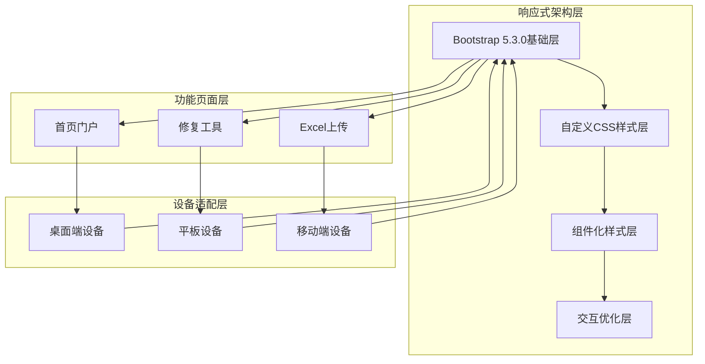

**图表来源**
- [bootstrap.css](file://template/css_js/bootstrap-5.3.0/css/bootstrap.css#L1-L800)
- [home.html](file://template/home.html#L1-L761)

## Bootstrap网格系统应用

### 标准网格系统使用

项目广泛使用Bootstrap的网格系统，采用以下断点策略：

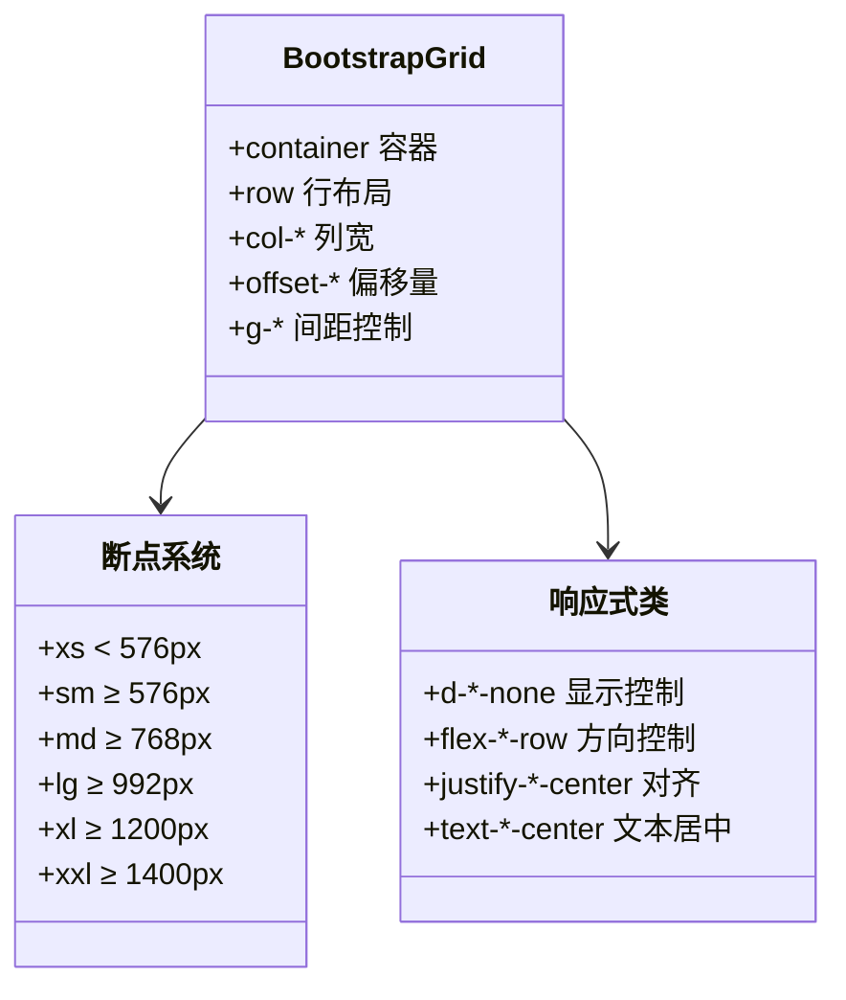

**图表来源**
- [bootstrap-grid.css](file://template/css_js/bootstrap-5.3.0/css/bootstrap-grid.css#L194-L218)
- [bootstrap.css](file://template/css_js/bootstrap-5.3.0/css/bootstrap.css#L747-L771)

### 网格系统在页面中的应用

#### 首页门户的网格布局

首页使用了复杂的网格系统组合：

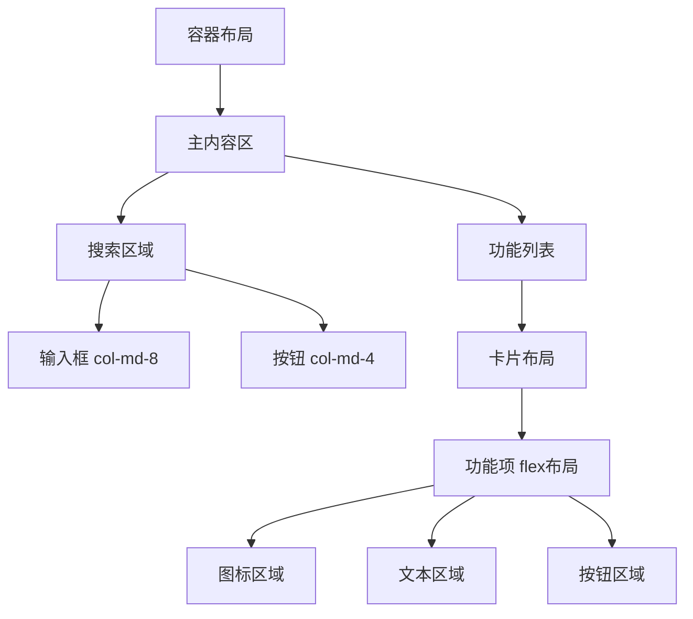

**图表来源**
- [home.html](file://template/home.html#L508-L568)

**章节来源**
- [bootstrap-grid.css](file://template/css_js/bootstrap-5.3.0/css/bootstrap-grid.css#L238-L340)
- [home.html](file://template/home.html#L32-L482)

## 媒体查询与断点策略

### 标准断点设置

项目采用Bootstrap的标准断点体系：

| 断点 | 最小宽度 | 使用场景 |
|------|----------|----------|
| xs | 0px | 所有设备的基础样式 |
| sm | 576px | 小型移动设备 |
| md | 768px | 平板设备 |
| lg | 992px | 小型桌面设备 |
| xl | 1200px | 中等桌面设备 |
| xxl | 1400px | 大型桌面设备 |

### 自定义媒体查询实现

#### 首页门户的响应式设计

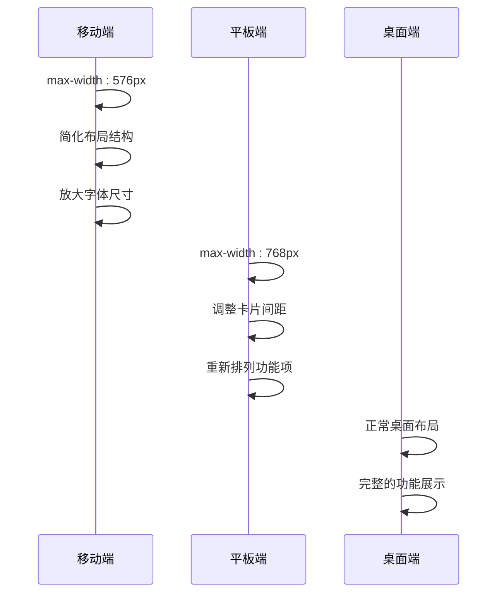

**图表来源**
- [home.html](file://template/home.html#L407-L482)

### 字体缩放策略

项目实现了动态字体缩放机制：

```mermaid
flowchart LR
A[基础字体大小] --> B[视口宽度计算]
B --> C[媒体查询适配]
C --> D[移动端放大]
C --> E[桌面端标准]
B --> F[calc() 函数计算]
F --> G[vw 单位使用]
F --> H[固定像素值]
```

**图表来源**
- [bootstrap.css](file://template/css_js/bootstrap-5.3.0/css/bootstrap.css#L220-L262)

**章节来源**
- [bootstrap.css](file://template/css_js/bootstrap-5.3.0/css/bootstrap.css#L121-L126)
- [home.html](file://template/home.html#L407-L482)

## Flexbox与CSS Grid使用

### Flexbox布局应用

项目在多个场景中使用Flexbox进行布局控制：

#### 主要Flexbox应用场景

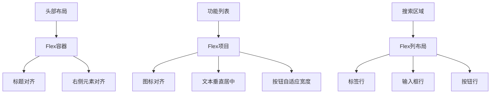

**图表来源**
- [home.html](file://template/home.html#L316-L358)
- [home.html](file://template/home.html#L529-L567)

### CSS Grid使用情况

虽然项目主要使用Flexbox，但在某些特定场景下也考虑了Grid布局的可能性：

- **数据表格布局**：考虑使用CSS Grid进行复杂的数据展示
- **卡片网格布局**：未来可能采用Grid实现更灵活的卡片排列
- **复杂仪表板**：Grid更适合处理多维度的数据展示需求

**章节来源**
- [home.html](file://template/home.html#L316-L358)
- [fixCurrency.html](file://template/fix/fixCurrency.html#L213-L250)

## 触摸设备交互优化

### 触摸友好的设计元素

#### 点击目标优化

项目特别关注触摸设备的交互体验：

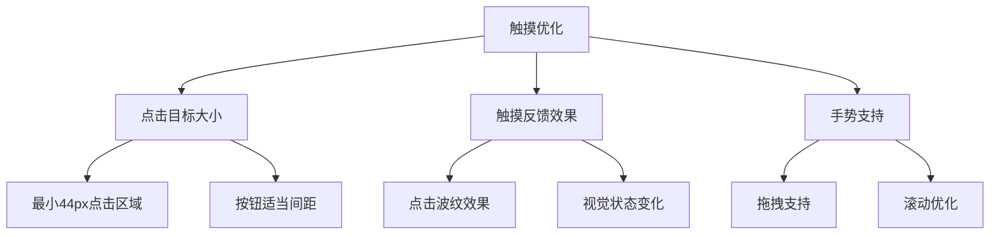

#### 粒子特效的触摸优化

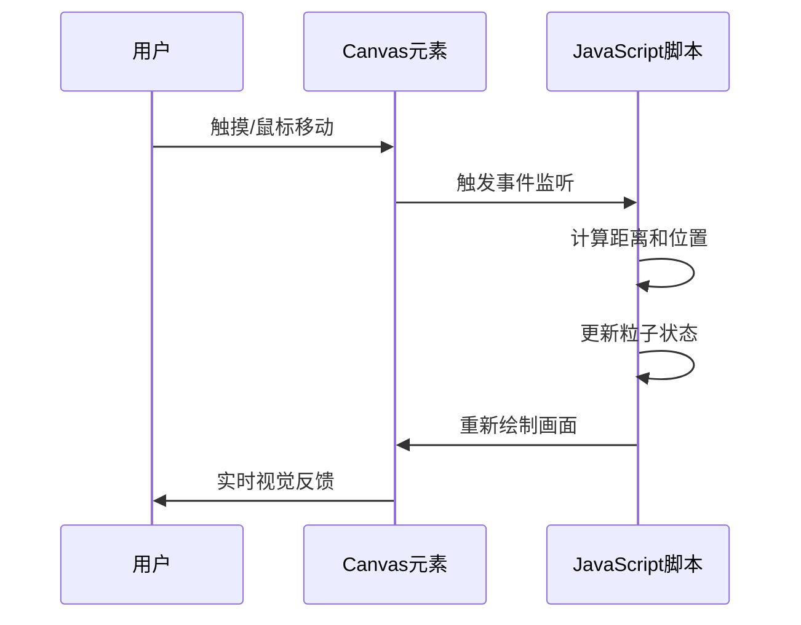

**图表来源**
- [lizi.js](file://template/css_js/own/lizi.js#L26-L56)

### 触摸设备的特殊处理

#### 移动端手势支持

项目实现了以下触摸交互特性：

- **鼠标跟踪**：粒子特效跟随鼠标移动
- **边界检测**：粒子在画布边界处循环出现
- **响应式尺寸**：根据窗口大小动态调整画布尺寸
- **性能优化**：使用requestAnimationFrame优化动画性能

**章节来源**
- [lizi.js](file://template/css_js/own/lizi.js#L1-L97)
- [lizi.css](file://template/css_js/own/lizi.css#L1-L24)

## 视觉效果与性能优化

### 响应式图片处理

项目采用了多种响应式图片策略：

#### 图片适配方案

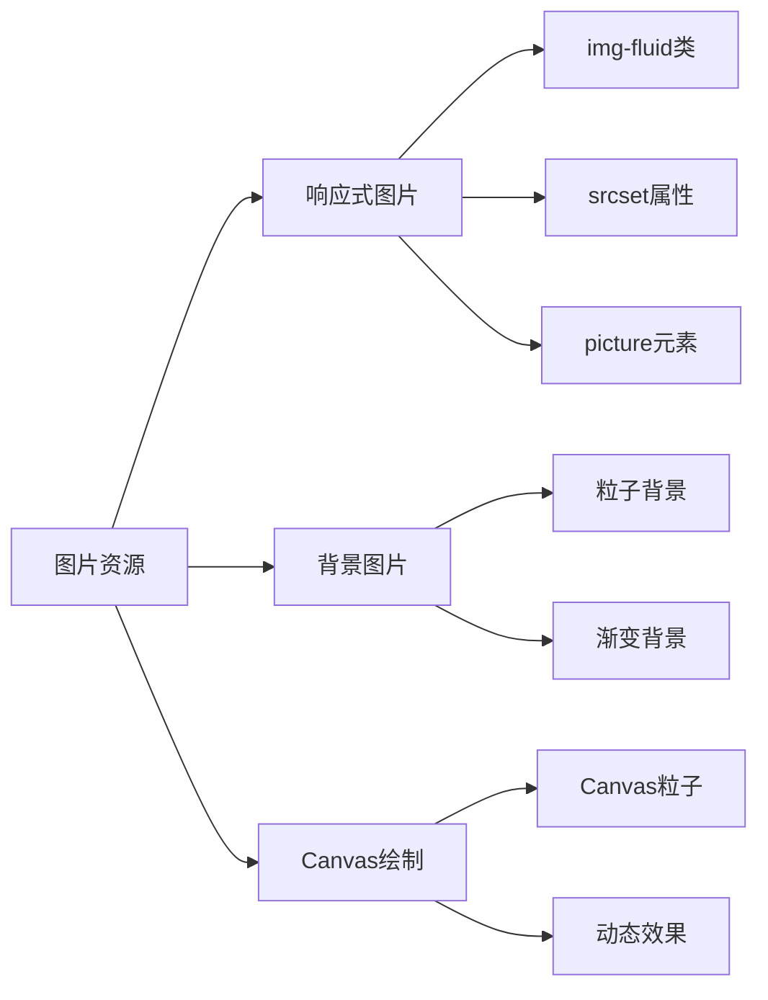

**图表来源**
- [bootstrap.css](file://template/css_js/bootstrap-5.3.0/css/bootstrap.css#L703-L706)

### 性能优化策略

#### 加载性能优化

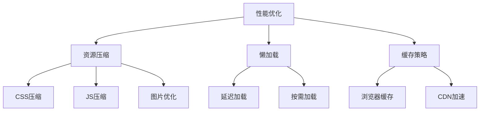

#### 移动端性能考虑

- **Canvas动画优化**：使用requestAnimationFrame减少CPU占用
- **事件处理优化**：防抖和节流机制避免频繁重绘
- **内存管理**：及时清理DOM元素和事件监听器

**章节来源**
- [lizi.js](file://template/css_js/own/lizi.js#L34-L67)
- [code.js](file://template/css_js/own/code.js#L37-L37)

## 测试方法与验证

### 跨设备测试策略

#### 测试设备清单

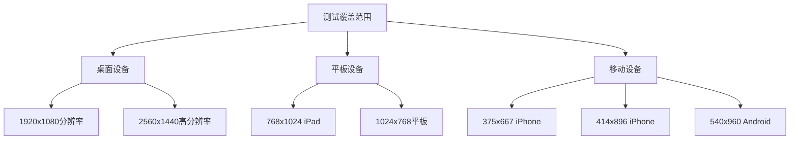

### 响应式测试方法

#### 自动化测试流程

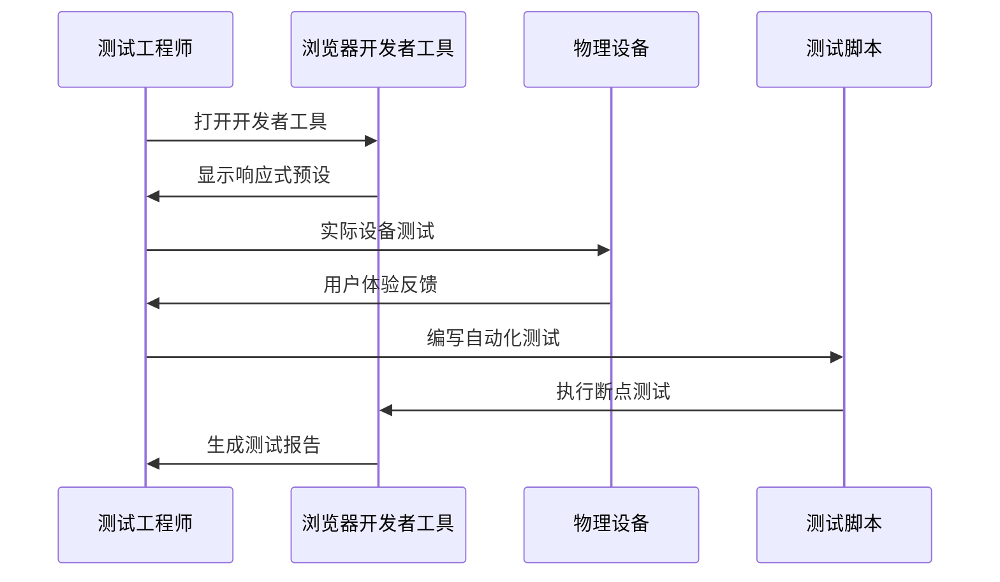

### 性能测试指标

#### 关键性能指标

| 指标类型 | 测试标准 | 优化目标 |
|----------|----------|----------|
| FCP | < 1.8秒 | < 1.5秒 |
| LCP | < 2.5秒 | < 2.0秒 |
| FID | < 100ms | < 50ms |
| CLS | < 0.1 | < 0.05 |
| TBT | < 200ms | < 100ms |

**章节来源**
- [home.html](file://template/home.html#L407-L482)
- [fixCurrency.html](file://template/fix/fixCurrency.html#L413-L484)

## 最佳实践建议

### 响应式设计最佳实践

#### 代码组织建议

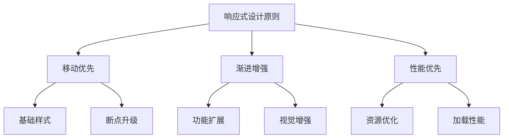

#### 开发规范建议

1. **命名规范**：使用语义化的CSS类名
2. **代码组织**：按功能模块组织CSS文件
3. **注释规范**：为关键样式添加注释说明
4. **版本管理**：跟踪CSS变更历史

### 维护性考虑

#### 可维护性设计

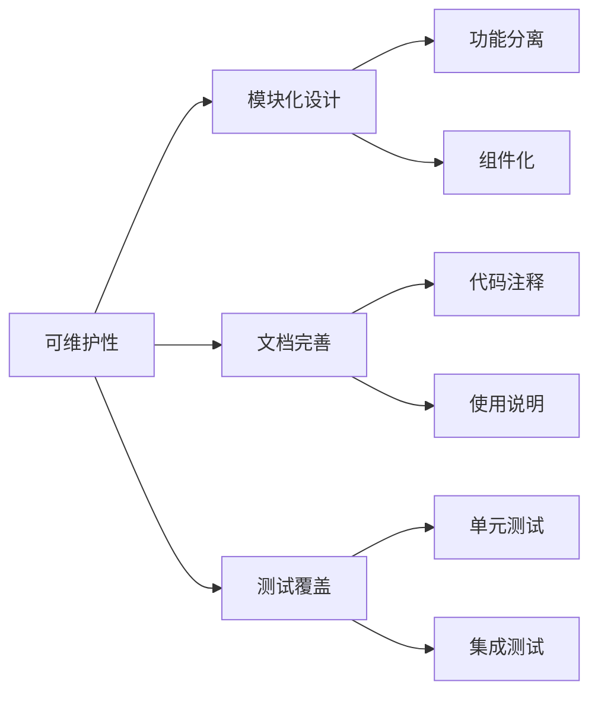

## 故障排除指南

### 常见响应式问题

#### 布局问题诊断

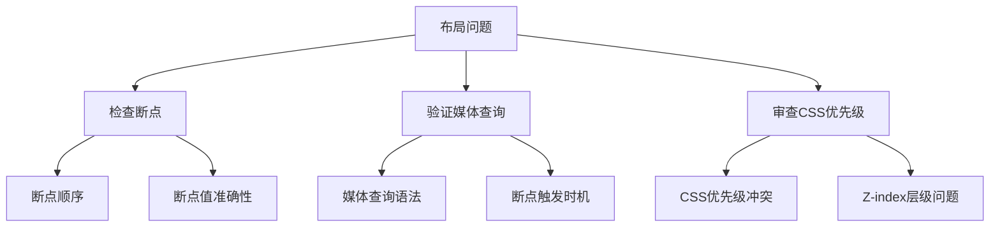

#### 性能问题排查

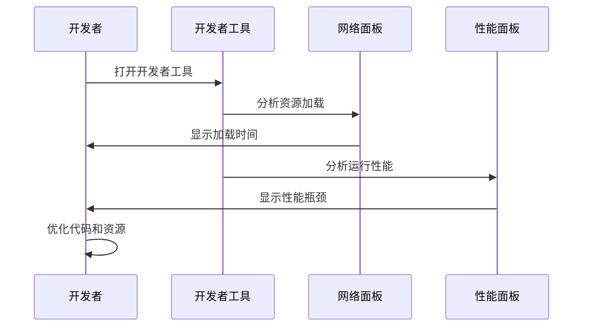

### 调试技巧

#### 快速定位问题

1. **使用浏览器开发者工具**
   - 检查元素盒模型
   - 验证媒体查询生效
   - 分析CSS优先级

2. **模拟不同设备**
   - 使用设备模拟器
   - 测试不同屏幕尺寸
   - 验证触摸交互

3. **性能监控**
   - 监控FPS和渲染时间
   - 分析内存使用情况
   - 检查网络请求优化

**章节来源**
- [toast.css](file://template/css_js/css/toast.css#L120-L133)
- [lizi.js](file://template/css_js/own/lizi.js#L89-L97)