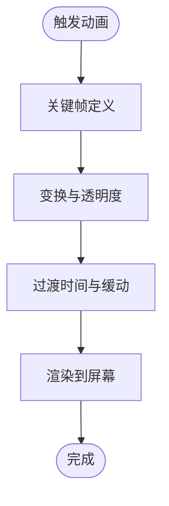

# 样式定制与主题配置

<cite>
**本文引用的文件**   
- [home.html](file://template/home.html)
- [fixCeMaterials.html](file://template/fix/fixCeMaterials.html)
- [fixCurrency.html](file://template/fix/fixCurrency.html)
- [common.js](file://template/css_js/script/common.js)
- [toast.css](file://template/css_js/css/toast.css)
- [code.css](file://template/css_js/own/code.css)
- [collbtn.css](file://template/css_js/own/collbtn.css)
- [lizi.css](file://template/css_js/own/lizi.css)
- [lizi.js](file://template/css_js/own/lizi.js)
- [package.json](file://template/package.json)
- [bootstrap-grid.css](file://template/css_js/bootstrap-5.3.0/css/bootstrap-grid.css)
- [bootstrap-utilities.css](file://template/css_js/bootstrap-5.3.0/css/bootstrap-utilities.css)
- [bootstrap.css](file://template/css_js/bootstrap-5.3.0/css/bootstrap.css)
- [vue.global.js](file://template/css_js/script/vue.global.js)
</cite>

## 目录
1. [简介](#简介)
2. [项目结构](#项目结构)
3. [核心组件](#核心组件)
4. [架构总览](#架构总览)
5. [详细组件分析](#详细组件分析)
6. [依赖关系分析](#依赖关系分析)
7. [性能考量](#性能考量)
8. [故障排查指南](#故障排查指南)
9. [结论](#结论)
10. [附录](#附录)

## 简介
本文件面向PaSystem的样式定制与主题配置，系统性梳理项目的CSS架构与实现方式，涵盖以下重点：
- CSS变量的使用与命名约定
- 颜色系统与渐变色彩实现
- 字体与排版规范
- 自定义样式的组织结构与模块化管理
- 主题与环境切换机制
- 动画与过渡效果
- 样式覆盖与主题定制最佳实践
- 浏览器兼容性与CSS前缀处理
- 样式调试与性能优化建议

## 项目结构
PaSystem前端采用“HTML + Bootstrap + 自定义CSS/JS”的组合模式：
- 主页与功能页通过内联样式与外部样式表共同构建主题风格
- 使用Bootstrap 5作为栅格与基础UI组件框架
- 自定义样式集中在template/css_js目录下，按功能模块拆分（如toast、粒子特效、按钮等）
- 通过Vue 2/3进行动态主题与交互控制

图表来源
- [home.html](file://template/home.html#L1-L761)
- [fixCeMaterials.html](file://template/fix/fixCeMaterials.html#L1-L348)
- [fixCurrency.html](file://template/fix/fixCurrency.html#L1-L645)
- [common.js](file://template/css_js/script/common.js#L1-L5)
- [bootstrap-grid.css](file://template/css_js/bootstrap-5.3.0/css/bootstrap-grid.css)
- [bootstrap-utilities.css](file://template/css_js/bootstrap-5.3.0/css/bootstrap-utilities.css)
- [bootstrap.css](file://template/css_js/bootstrap-5.3.0/css/bootstrap.css)
- [vue.global.js](file://template/css_js/script/vue.global.js)

章节来源
- [home.html](file://template/home.html#L1-L761)
- [fixCeMaterials.html](file://template/fix/fixCeMaterials.html#L1-L348)
- [fixCurrency.html](file://template/fix/fixCurrency.html#L1-L645)
- [common.js](file://template/css_js/script/common.js#L1-L5)

## 核心组件
- 全局主题与颜色系统：在主页中通过CSS变量定义主色、辅色、状态色，并结合渐变背景与卡片阴影营造现代风格
- Bootstrap集成：使用Bootstrap网格、工具类与组件样式，保证跨设备一致性
- 自定义通知系统：基于独立的toast.css与混入机制，实现统一的提示风格与动画
- 粒子背景特效：lizi.css与lizi.js提供Canvas粒子动画，增强视觉层次
- 按钮动效：collbtn.css展示基于CSS变量与伪元素的波纹扩散动效
- 终端风背景：code.css提供字符雨背景，适合特定页面氛围
- 环境指示：通过环境类型切换不同徽章样式，直观区分环境

章节来源
- [home.html](file://template/home.html#L13-L483)
- [toast.css](file://template/css_js/css/toast.css#L1-L134)
- [lizi.css](file://template/css_js/own/lizi.css#L1-L24)
- [lizi.js](file://template/css_js/own/lizi.js#L1-L97)
- [collbtn.css](file://template/css_js/own/collbtn.css#L1-L58)
- [code.css](file://template/css_js/own/code.css#L1-L36)

## 架构总览
整体样式架构由“全局主题变量 + Bootstrap基础层 + 自定义模块样式 + 动画与特效”构成。页面通过内联样式与外部样式表组合，配合Vue的响应式能力实现主题与状态的动态切换。

图表来源
- [home.html](file://template/home.html#L13-L483)
- [bootstrap.css](file://template/css_js/bootstrap-5.3.0/css/bootstrap.css)
- [bootstrap-utilities.css](file://template/css_js/bootstrap-5.3.0/css/bootstrap-utilities.css)
- [toast.css](file://template/css_js/css/toast.css#L1-L134)
- [lizi.css](file://template/css_js/own/lizi.css#L1-L24)
- [lizi.js](file://template/css_js/own/lizi.js#L1-L97)
- [collbtn.css](file://template/css_js/own/collbtn.css#L1-L58)
- [code.css](file://template/css_js/own/code.css#L1-L36)

## 详细组件分析

### CSS变量与颜色系统
- 变量定义：在主页中通过:root集中定义主色、辅色、状态色与明暗色，便于主题切换与一致性维护
- 渐变背景：卡片头、按钮、徽章等广泛使用线性渐变，提升视觉层次
- 状态色：成功、警告、错误等状态通过边框、图标与徽章颜色表达，确保可识别性

图表来源
- [home.html](file://template/home.html#L13-L483)

章节来源
- [home.html](file://template/home.html#L13-L483)

### 渐变色彩系统与字体规范
- 渐变系统：卡片头、按钮悬停光带、徽章均采用多色线性渐变，形成统一的视觉语言
- 字体规范：使用系统默认sans-serif族，保证跨平台一致性；标题与正文字号、字重有明确层级
- 响应式排版：在移动端对字号、行高与间距进行微调，确保可读性

章节来源
- [home.html](file://template/home.html#L29-L483)

### 自定义样式组织与命名约定
- 文件命名：按功能模块命名（如toast.css、lizi.css、collbtn.css），便于检索与维护
- 组件级样式：每个功能页通过内联<style>定义局部主题，同时引入全局样式与Bootstrap
- 类名约定：采用BEM风格倾向（如.feature-item、.toast-notification），提高可读性与可维护性

章节来源
- [home.html](file://template/home.html#L13-L483)
- [fixCeMaterials.html](file://template/fix/fixCeMaterials.html#L17-L81)
- [fixCurrency.html](file://template/fix/fixCurrency.html#L18-L158)

### 主题与环境切换机制
- 环境检测：通过JavaScript根据主机名判断环境类型，动态设置徽章样式与文案
- 徽章样式：不同环境映射到不同的背景色与文本色，确保一目了然
- 主题联动：徽章样式与CSS变量协同工作，保证整体风格一致

图表来源
- [home.html](file://template/home.html#L693-L710)

章节来源
- [home.html](file://template/home.html#L693-L710)

### 动画与过渡效果
- 卡片入场动画：fadeInUp关键帧实现从底部淡入的效果
- 悬停与过渡：卡片hover、按钮hover、输入框聚焦均有平滑过渡
- 通知动画：toast的滑入/滑出使用translateX与opacity组合，配合贝塞尔曲线
- 粒子动画：Canvas绘制粒子，鼠标靠近产生轻微排斥，粒子间连线随距离衰减

图表来源
- [home.html](file://template/home.html#L383-L401)
- [toast.css](file://template/css_js/css/toast.css#L29-L54)
- [lizi.js](file://template/css_js/own/lizi.js#L34-L67)

章节来源
- [home.html](file://template/home.html#L383-L401)
- [toast.css](file://template/css_js/css/toast.css#L29-L54)
- [lizi.js](file://template/css_js/own/lizi.js#L34-L67)

### 样式覆盖与主题定制最佳实践
- 局部覆盖：功能页通过内联<style>覆盖Bootstrap默认样式，保持隔离性
- 变量优先：优先使用CSS变量承载主题色，减少硬编码
- 组件化：将通知、按钮、粒子等封装为独立模块，便于复用与替换
- 渐进增强：在基础样式之上叠加渐变与动画，避免破坏可用性

章节来源
- [fixCeMaterials.html](file://template/fix/fixCeMaterials.html#L17-L81)
- [fixCurrency.html](file://template/fix/fixCurrency.html#L18-L158)
- [home.html](file://template/home.html#L13-L483)

### CSS模块化与组件样式管理
- 模块划分：toast、粒子、按钮、终端风背景分别独立文件，职责清晰
- 引入策略：页面仅引入所需模块，避免冗余
- Vue集成：通过mixins或直接在组件中使用，实现主题与状态的动态绑定

章节来源
- [toast.css](file://template/css_js/css/toast.css#L1-L134)
- [lizi.css](file://template/css_js/own/lizi.css#L1-L24)
- [collbtn.css](file://template/css_js/own/collbtn.css#L1-L58)
- [code.css](file://template/css_js/own/code.css#L1-L36)

### 浏览器兼容性与CSS前缀处理
- Bootstrap已内置常用前缀，满足主流浏览器需求
- 自定义动画与渐变在现代浏览器表现稳定，无需额外前缀
- 若需支持较老版本IE，建议通过构建工具（如Webpack + Babel）进行转译与前缀补齐

章节来源
- [bootstrap-grid.css](file://template/css_js/bootstrap-5.3.0/css/bootstrap-grid.css)
- [bootstrap-utilities.css](file://template/css_js/bootstrap-5.3.0/css/bootstrap-utilities.css)
- [bootstrap.css](file://template/css_js/bootstrap-5.3.0/css/bootstrap.css)
- [package.json](file://template/package.json#L7-L13)

## 依赖关系分析
- 页面依赖：各功能页依赖Bootstrap与通用脚本（jQuery、Bootstrap JS、Vue、Axios、QS）
- 样式依赖：全局主题依赖Bootstrap基础样式与工具类；自定义模块相互独立
- 运行时依赖：Vue用于主题与状态的动态渲染，Axios负责与后端通信

图表来源
- [home.html](file://template/home.html#L7-L11)
- [fixCeMaterials.html](file://template/fix/fixCeMaterials.html#L6-L12)
- [fixCurrency.html](file://template/fix/fixCurrency.html#L6-L13)
- [common.js](file://template/css_js/script/common.js#L1-L5)

章节来源
- [home.html](file://template/home.html#L7-L11)
- [fixCeMaterials.html](file://template/fix/fixCeMaterials.html#L6-L12)
- [fixCurrency.html](file://template/fix/fixCurrency.html#L6-L13)
- [common.js](file://template/css_js/script/common.js#L1-L5)

## 性能考量
- 样式体积：尽量使用Bootstrap工具类减少自定义样式，避免重复定义
- 动画性能：使用transform与opacity替代布局昂贵属性；限制动画数量与复杂度
- 资源加载：合并与压缩CSS/JS，合理使用CDN；按需加载模块
- 渲染优化：避免强制同步布局；使用will-change或GPU加速标记（谨慎使用）

## 故障排查指南
- 样式冲突：检查内联样式与外部样式的优先级；确认Bootstrap版本与自定义样式的覆盖顺序
- 动画异常：验证关键帧名称与浏览器支持；检查动画时长与缓动函数
- 环境徽章不显示：确认环境检测逻辑与徽章类名映射正确
- 粒子特效卡顿：降低粒子数量或帧率；检查Canvas尺寸与重绘频率

章节来源
- [home.html](file://template/home.html#L693-L710)
- [lizi.js](file://template/css_js/own/lizi.js#L1-L97)
- [toast.css](file://template/css_js/css/toast.css#L1-L134)

## 结论
PaSystem的样式体系以Bootstrap为基础，结合CSS变量、渐变与动画，形成了统一且可扩展的主题架构。通过模块化的自定义样式与Vue驱动的主题切换，既保证了开发效率，也提升了用户体验。建议在后续迭代中进一步沉淀主题变量与组件规范，完善构建流程以提升兼容性与性能。

## 附录
- 常用颜色变量：主色、辅色、成功、警告、危险、深色、浅色
- 渐变应用：卡片头、按钮、徽章、背景
- 动画应用：卡片入场、按钮悬停、通知滑入/滑出、粒子连线
- 兼容性：现代浏览器；如需支持旧版IE，建议启用构建转译与前缀