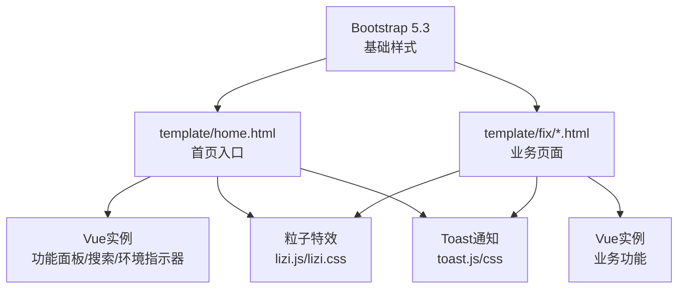
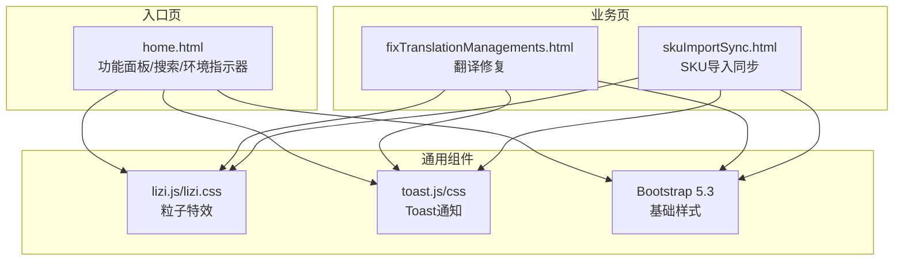
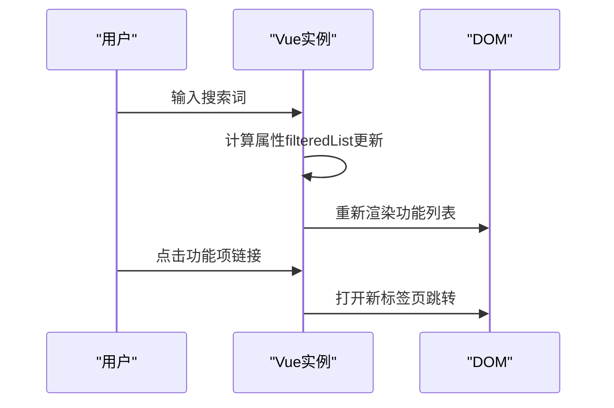
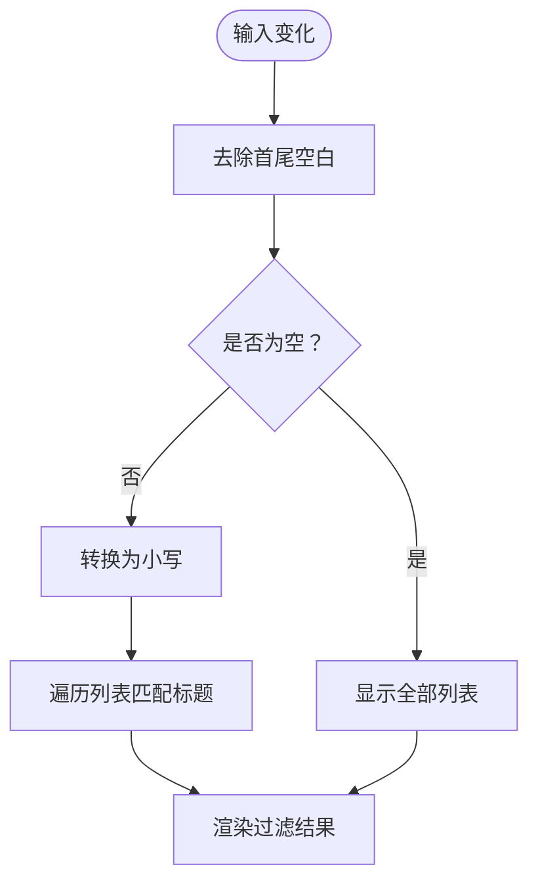
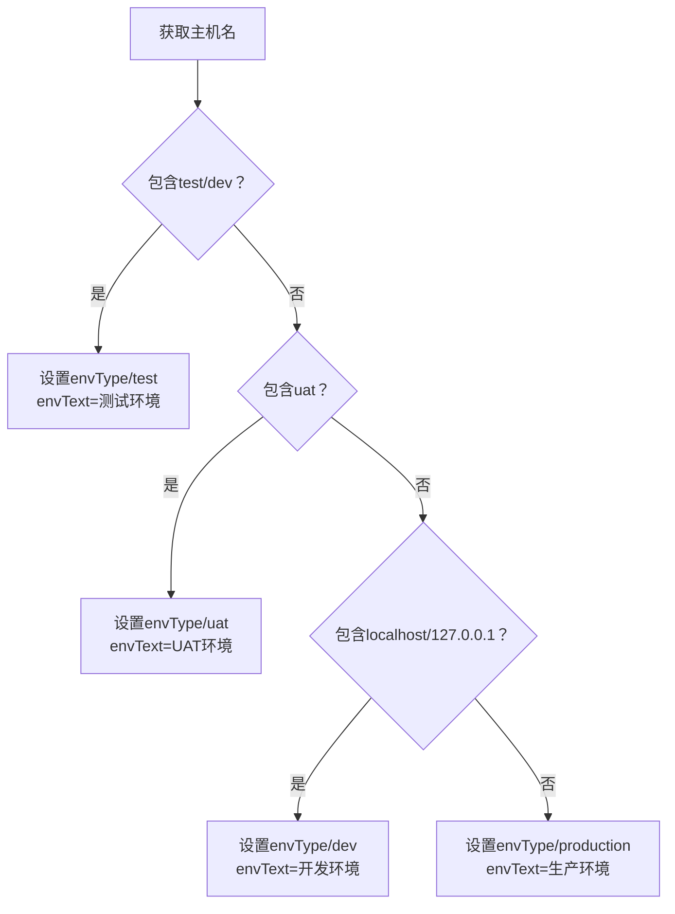
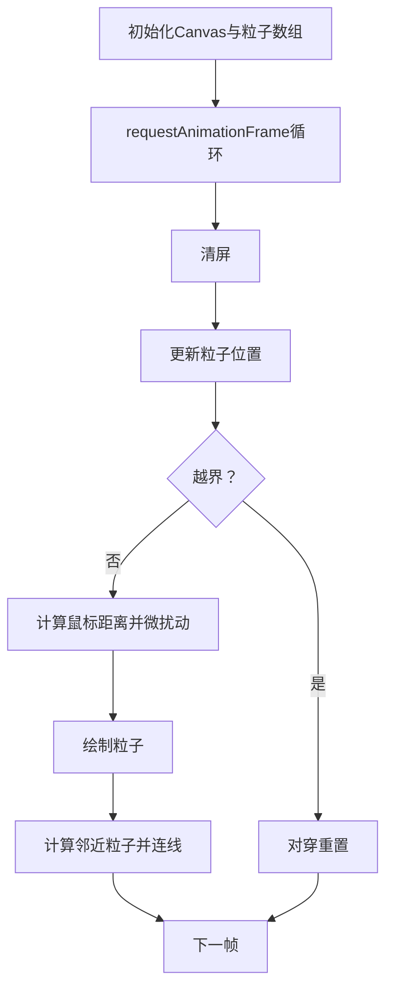
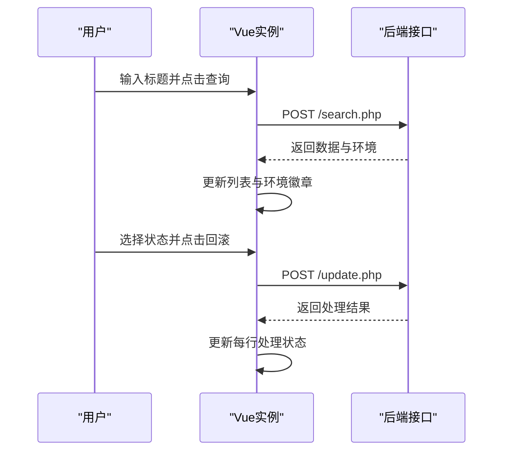
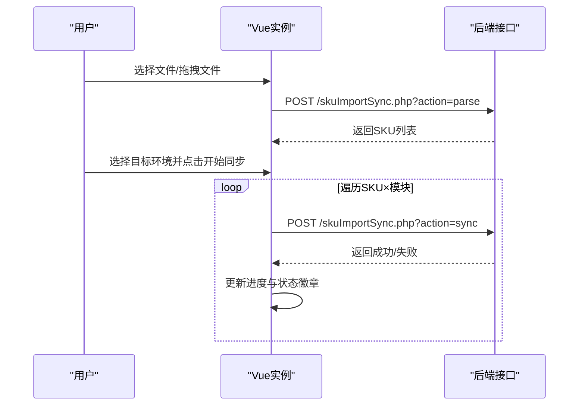
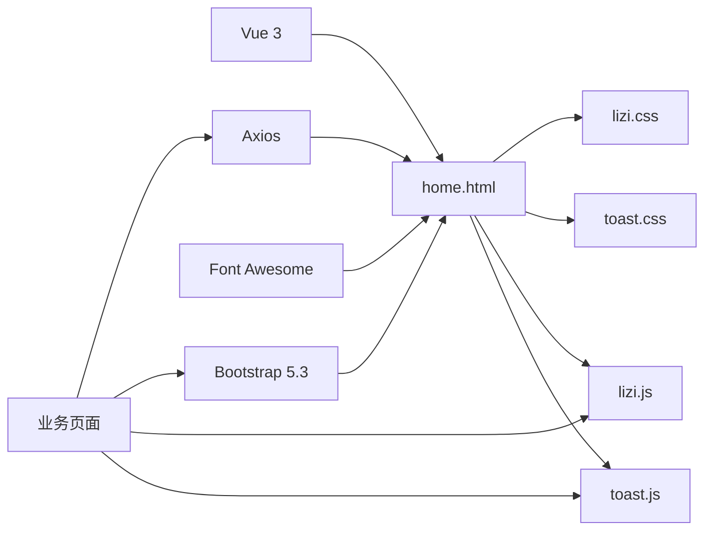

# 界面组件设计

<cite>
**本文档引用的文件**
- [template/home.html](file://template/home.html)
- [template/css_js/own/lizi.css](file://template/css_js/own/lizi.css)
- [template/css_js/own/lizi.js](file://template/css_js/own/lizi.js)
- [template/css_js/own/code.css](file://template/css_js/own/code.css)
- [template/css_js/own/code.js](file://template/css_js/own/code.js)
- [template/css_js/css/toast.css](file://template/css_js/css/toast.css)
- [template/css_js/js/toast.js](file://template/css_js/js/toast.js)
- [template/css_js/own/collbtn.css](file://template/css_js/own/collbtn.css)
- [template/fix/fixTranslationManagements.html](file://template/fix/fixTranslationManagements.html)
- [template/fix/skuImportSync.html](file://template/fix/skuImportSync.html)
- [template/css_js/bootstrap-5.3.0/css/bootstrap.min.css](file://template/css_js/bootstrap-5.3.0/css/bootstrap.min.css)
</cite>

## 目录
1. [简介](#简介)
2. [项目结构](#项目结构)
3. [核心组件](#核心组件)
4. [架构总览](#架构总览)
5. [详细组件分析](#详细组件分析)
6. [依赖关系分析](#依赖关系分析)
7. [性能考量](#性能考量)
8. [故障排除指南](#故障排除指南)
9. [结论](#结论)
10. [附录](#附录)

## 简介
本文件面向PaSystem的界面组件设计，聚焦于功能面板、搜索组件、环境指示器、功能列表等核心UI模块。文档从HTML结构、CSS样式、JavaScript交互三个维度进行深入剖析，并总结视觉设计原则（渐变色彩、动画效果、响应式适配）、粒子特效与悬停动画实现、组件定制与扩展方法、组件间协作关系与数据流、以及无障碍访问与浏览器兼容性建议。

## 项目结构
PaSystem采用前后端分离的静态页面+Vue.js前端框架设计。首页home.html作为入口，承载功能面板与全局样式；各业务修复页面（如翻译修复、SKU导入同步）独立封装为单页应用，共享Toast通知与粒子特效等通用组件。



图表来源
- [template/home.html](file://template/home.html#L486-L761)
- [template/fix/fixTranslationManagements.html](file://template/fix/fixTranslationManagements.html#L78-L451)
- [template/fix/skuImportSync.html](file://template/fix/skuImportSync.html#L196-L585)

章节来源
- [template/home.html](file://template/home.html#L1-L761)
- [template/css_js/bootstrap-5.3.0/css/bootstrap.min.css](file://template/css_js/bootstrap-5.3.0/css/bootstrap.min.css#L1-L5)

## 核心组件
- 功能面板（主页）：包含顶部标题栏、环境指示器、搜索框、功能列表卡片、空状态与加载状态。
- 搜索组件：基于Vue双向绑定与计算属性实现实时过滤。
- 环境指示器：根据域名动态识别环境并展示不同样式徽章。
- 功能列表：卡片式布局，支持徽标（新增/待做）、图标背景渐变、进入按钮与禁用态。
- 粒子特效：Canvas粒子系统，鼠标靠近产生微扰动并连接邻近粒子。
- Toast通知：右上角弹出式通知，支持多种类型与自动关闭。
- 业务页面组件：翻译修复、SKU导入同步等页面，包含上传区、进度条、状态徽章等。

章节来源
- [template/home.html](file://template/home.html#L486-L761)
- [template/fix/fixTranslationManagements.html](file://template/fix/fixTranslationManagements.html#L78-L451)
- [template/fix/skuImportSync.html](file://template/fix/skuImportSync.html#L196-L585)

## 架构总览
整体采用“入口页 + 业务页 + 通用组件”的分层架构。入口页负责导航与全局状态，业务页各自维护局部状态并通过HTTP请求与后端交互。通用组件（粒子、Toast）通过外部资源引入并在多页面复用。



图表来源
- [template/home.html](file://template/home.html#L486-L761)
- [template/fix/fixTranslationManagements.html](file://template/fix/fixTranslationManagements.html#L78-L451)
- [template/fix/skuImportSync.html](file://template/fix/skuImportSync.html#L196-L585)

## 详细组件分析

### 功能面板（主页）
- HTML结构
  - 顶部标题栏：包含系统标题与版本信息、环境指示器。
  - 主内容区域：搜索容器（输入框+搜索图标）、功能列表卡片、空状态与加载状态。
- CSS样式
  - 渐变背景与毛玻璃卡片：使用CSS变量定义主题色，卡片带阴影与圆角。
  - 悬停动画：卡片与按钮悬停时的位移动画与阴影增强。
  - 响应式布局：针对移动端的列布局与字体尺寸调整。
- JavaScript交互
  - Vue实例：data定义消息、功能列表、搜索词、加载状态、环境类型与文本。
  - 计算属性：filteredList基于搜索词进行过滤。
  - 生命周期：mounted后initApp模拟环境检测与初始化。
  - 方法：detectEnvironment根据域名设置环境类型；getIconBackground与getIconClass为功能项生成图标背景与图标类。
  - 事件：搜索输入触发filterList（实际由计算属性驱动）。



图表来源
- [template/home.html](file://template/home.html#L595-L758)

章节来源
- [template/home.html](file://template/home.html#L486-L761)

### 搜索组件
- HTML结构：输入框配合搜索图标，使用v-model双向绑定。
- 交互逻辑：搜索词变化通过计算属性实时过滤，无需显式调用filterList。
- 性能优化：计算属性缓存过滤结果，避免每次输入都全量遍历。



图表来源
- [template/home.html](file://template/home.html#L656-L669)

章节来源
- [template/home.html](file://template/home.html#L508-L568)

### 环境指示器
- HTML结构：span元素，class根据envType动态绑定。
- 样式：不同环境对应不同渐变背景色与文字颜色。
- 逻辑：detectEnvironment根据location.hostname判断环境并设置envType/envText。



图表来源
- [template/home.html](file://template/home.html#L693-L710)

章节来源
- [template/home.html](file://template/home.html#L492-L497)

### 功能列表
- HTML结构：卡片头部显示“可用功能”与数量徽标；列表项包含图标背景、标题徽标（新增/待做）、进入按钮或禁用按钮。
- 样式：图标背景使用渐变色；徽标使用线性渐变；按钮悬停有位移动画与阴影。
- 逻辑：level字段控制按钮状态；getIconBackground与getIconClass分别生成图标背景与图标类。

章节来源
- [template/home.html](file://template/home.html#L520-L568)

### 粒子特效
- 实现原理：Canvas绘制50个粒子，随机位置与速度，鼠标靠近时产生微扰动，粒子超出边界时对穿。
- 连接逻辑：当两粒子距离小于阈值时绘制连线，连线透明度随距离衰减。
- 响应式：窗口大小改变时重设Canvas尺寸。



图表来源
- [template/css_js/own/lizi.js](file://template/css_js/own/lizi.js#L1-L97)
- [template/css_js/own/lizi.css](file://template/css_js/own/lizi.css#L1-L24)

章节来源
- [template/css_js/own/lizi.js](file://template/css_js/own/lizi.js#L1-L97)
- [template/css_js/own/lizi.css](file://template/css_js/own/lizi.css#L1-L24)

### Toast通知
- 组件设计：通过Vue混入（Mixin）提供统一的Toast API，支持不同类型与自动关闭。
- 样式：右上角固定定位，滑入/滑出动画，左侧彩色边框区分类型。
- 使用方式：业务页面通过mixins: [ToastMixin]引入，调用showSuccess/showError等方法。

```mermaid
classDiagram
class ToastMixin {
+data() : object
+methods : {
+showToast(message, type, duration)
+removeToast(id)
+showSuccess(message)
+showError(message)
+showInfo(message)
+showWarning(message)
}
}
class 页面实例 {
+mixins : [ToastMixin]
+调用 : showSuccess()/showError()
}
ToastMixin <.. 页面实例 : "混入使用"
```

图表来源
- [template/css_js/js/toast.js](file://template/css_js/js/toast.js#L6-L86)
- [template/css_js/css/toast.css](file://template/css_js/css/toast.css#L6-L134)

章节来源
- [template/css_js/js/toast.js](file://template/css_js/js/toast.js#L1-L92)
- [template/css_js/css/toast.css](file://template/css_js/css/toast.css#L1-L134)

### 业务页面组件示例

#### 翻译修复页面
- 搜索卡片：输入翻译标题，点击查询按钮。
- 结果列表：表格展示标题、渠道、状态、SKU数量等。
- 状态回滚：选择目标状态，必要时填写审核人与日期，点击回滚。
- 环境信息：根据后端返回设置环境徽章样式与文案。
- 数据流：查询与回滚通过Axios向后端接口发送POST请求。



图表来源
- [template/fix/fixTranslationManagements.html](file://template/fix/fixTranslationManagements.html#L224-L448)

章节来源
- [template/fix/fixTranslationManagements.html](file://template/fix/fixTranslationManagements.html#L78-L451)

#### SKU导入同步页面
- 上传区域：支持拖拽与点击选择，解析Excel并提取SKU列表。
- 环境选择：默认Production源环境，目标环境可选Test/UAT。
- 同步进度：总进度条与详细列表，状态徽章区分待处理/处理中/成功/失败。
- 数据流：解析文件与逐项同步均通过Axios POST请求，支持自动统计与提示。



图表来源
- [template/fix/skuImportSync.html](file://template/fix/skuImportSync.html#L352-L582)

章节来源
- [template/fix/skuImportSync.html](file://template/fix/skuImportSync.html#L196-L585)

### 视觉设计原则与动画效果
- 渐变色彩：使用CSS变量定义主色与辅助色，卡片头、按钮、徽标均采用线性渐变。
- 动画效果：卡片入场淡入上移、按钮悬停位移与阴影增强、Toast滑入滑出、粒子上升与缩放。
- 响应式适配：媒体查询覆盖768px与576px断点，调整布局、字体与间距。

章节来源
- [template/home.html](file://template/home.html#L13-L483)

### 粒子特效与悬停动画实现
- 粒子系统：Canvas绘制圆形粒子，随机半径与透明度，鼠标靠近时受力微扰动，超出边界对穿。
- 连接线：两粒子距离小于阈值时绘制连线，透明度随距离衰减。
- 悬停动画：按钮与卡片悬停时位移与阴影变化，使用CSS transition实现平滑过渡。

章节来源
- [template/css_js/own/lizi.js](file://template/css_js/own/lizi.js#L1-L97)
- [template/css_js/own/lizi.css](file://template/css_js/own/lizi.css#L1-L24)
- [template/home.html](file://template/home.html#L13-L483)

### 组件定制与扩展方法
- 主题定制：通过CSS变量覆盖主题色，即可统一调整渐变与按钮样式。
- 图标扩展：在getIconClass映射中添加关键字到Font Awesome类的映射。
- 状态徽标：在功能列表中增加level类型，或扩展徽标样式类。
- Toast扩展：通过ToastMixin的showToast方法自定义时长与类型，或在toast.css中扩展样式。
- 粒子扩展：在lizi.js中调整粒子数量、速度范围与连接阈值，或在lizi.css中调整动画曲线。

章节来源
- [template/home.html](file://template/home.html#L712-L751)
- [template/css_js/js/toast.js](file://template/css_js/js/toast.js#L22-L84)
- [template/css_js/own/lizi.js](file://template/css_js/own/lizi.js#L12-L24)

### 组件协作关系与数据流
- 入口页与业务页：均依赖Bootstrap基础样式与Vue运行时；通用组件（粒子、Toast）跨页面复用。
- 数据流：业务页通过Axios与后端交互，返回数据驱动视图更新；入口页通过计算属性驱动列表过滤。
- 事件流：用户输入触发Vue响应式更新，渲染层再触发浏览器重绘与动画播放。

章节来源
- [template/home.html](file://template/home.html#L595-L758)
- [template/fix/fixTranslationManagements.html](file://template/fix/fixTranslationManagements.html#L224-L448)
- [template/fix/skuImportSync.html](file://template/fix/skuImportSync.html#L352-L582)

## 依赖关系分析
- 外部依赖：Bootstrap 5.3提供栅格与组件基础样式；Font Awesome提供图标；Axios提供HTTP请求能力；Vue 3提供响应式与组件化。
- 内部依赖：Toast与粒子为通用组件，被多个业务页引用；入口页与业务页共享基础样式与动画。



图表来源
- [template/home.html](file://template/home.html#L7-L12)
- [template/fix/fixTranslationManagements.html](file://template/fix/fixTranslationManagements.html#L6-L12)
- [template/fix/skuImportSync.html](file://template/fix/skuImportSync.html#L6-L13)

章节来源
- [template/home.html](file://template/home.html#L7-L12)
- [template/css_js/bootstrap-5.3.0/css/bootstrap.min.css](file://template/css_js/bootstrap-5.3.0/css/bootstrap.min.css#L1-L5)

## 性能考量
- 计算属性缓存：功能列表过滤使用计算属性，避免重复遍历。
- Canvas优化：requestAnimationFrame循环中仅清屏、更新、绘制与连接，减少DOM操作。
- 动画性能：使用transform与opacity而非改变布局属性，降低重排与重绘成本。
- 请求节流：业务页面在同步过程中避免频繁触发请求，通过状态徽章反馈进度。

## 故障排除指南
- 粒子特效不生效
  - 检查Canvas尺寸是否正确设置（窗口resize事件）。
  - 确认lizi.js脚本已正确加载且无语法错误。
- Toast不显示
  - 确认页面已引入toast.js并混入ToastMixin。
  - 检查toast容器是否存在且z-index足够高。
- 搜索无结果
  - 确认搜索词大小写不影响匹配（计算属性已转小写）。
  - 检查功能列表数据是否正确注入。
- 环境指示器不正确
  - 检查detectEnvironment逻辑与域名匹配规则。
- 业务页面请求失败
  - 检查后端接口URL与headers配置。
  - 查看网络面板与控制台错误日志。

章节来源
- [template/css_js/own/lizi.js](file://template/css_js/own/lizi.js#L89-L97)
- [template/css_js/js/toast.js](file://template/css_js/js/toast.js#L44-L52)
- [template/home.html](file://template/home.html#L693-L710)
- [template/fix/fixTranslationManagements.html](file://template/fix/fixTranslationManagements.html#L266-L278)
- [template/fix/skuImportSync.html](file://template/fix/skuImportSync.html#L442-L456)

## 结论
PaSystem的界面组件以Vue为核心，结合Bootstrap提供一致的基础样式，通过计算属性与响应式数据实现高效交互。粒子特效与Toast通知增强了用户体验，同时保持了良好的可维护性与扩展性。建议在后续迭代中进一步完善无障碍访问与跨浏览器兼容性测试，确保在更多设备与环境下稳定运行。

## 附录
- 无障碍访问建议
  - 为按钮与链接提供明确的aria-label或title。
  - 确保键盘可访问性（Tab顺序合理、Enter/Space激活）。
  - 为动画提供prefers-reduced-motion降级方案。
- 浏览器兼容性
  - Vue 3与Axios在主流现代浏览器中表现良好。
  - Canvas与requestAnimationFrame在IE/Edge旧版本需降级处理。
  - 建议在Chrome/Firefox/Safari最新版本中进行回归测试。