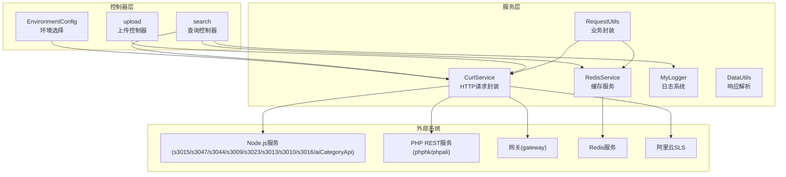
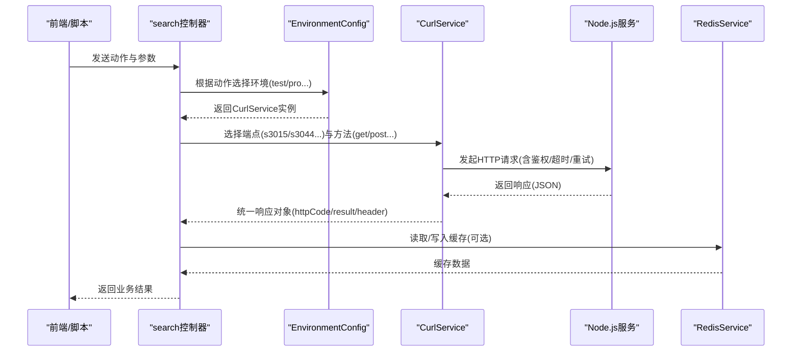
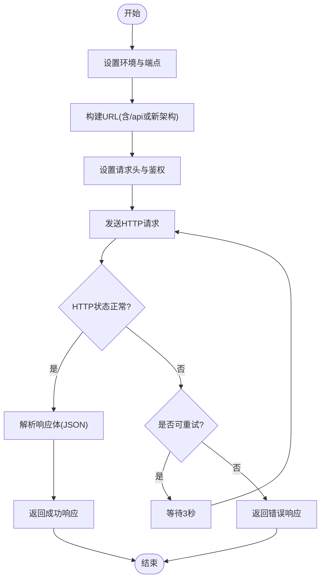
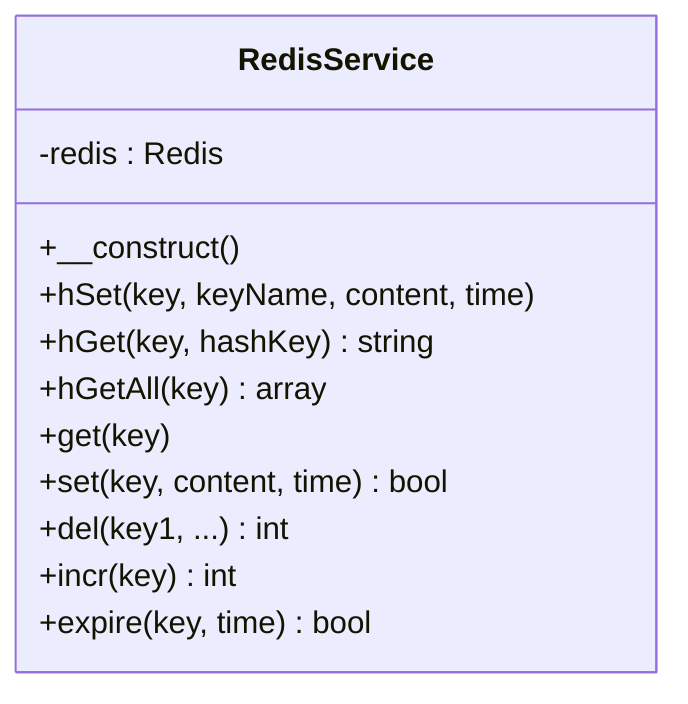
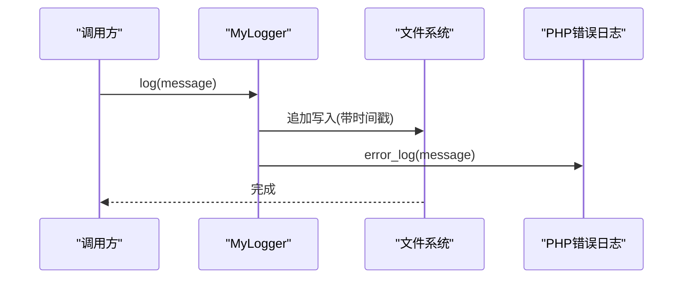
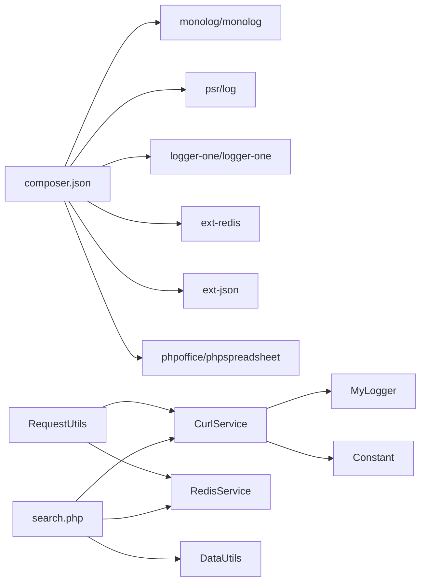

# HTTP服务层

<cite>
**本文引用的文件**
- [CurlService.php](file://php/curl/CurlService.php)
- [RedisService.php](file://php/redis/RedisService.php)
- [Logger.php](file://php/class/Logger.php)
- [common.php](file://php/common.php)
- [Constant.php](file://php/constant/Constant.php)
- [EnvironmentConfig.php](file://php/controller/EnvironmentConfig.php)
- [search.php](file://php/controller/search.php)
- [upload.php](file://php/controller/upload.php)
- [DataUtils.php](file://php/utils/DataUtils.php)
- [RequestUtils.php](file://php/utils/RequestUtils.php)
- [composer.json](file://composer.json)
- [config.json](file://php/json/config.json)
</cite>

## 目录
1. [简介](#简介)
2. [项目结构](#项目结构)
3. [核心组件](#核心组件)
4. [架构总览](#架构总览)
5. [详细组件分析](#详细组件分析)
6. [依赖关系分析](#依赖关系分析)
7. [性能考虑](#性能考虑)
8. [故障排查指南](#故障排查指南)
9. [结论](#结论)
10. [附录](#附录)

## 简介
本文件聚焦PaSystem的HTTP服务层，围绕以下目标展开：
- CurlService的HTTP请求封装设计：多环境配置、请求重试机制、超时处理与错误恢复策略
- RedisService缓存服务的实现原理：数据缓存策略、过期时间与缓存失效机制
- Logger日志记录系统的架构设计：日志级别、格式化输出与异步写入机制
- common.php中的通用函数与全局配置管理
- 服务层的安全防护措施：请求验证、数据加密与访问控制
- 性能优化建议与监控指标

## 项目结构
服务层主要由以下模块构成：
- HTTP请求封装：CurlService（多环境、多端点、多种请求方法、重试与超时）
- 缓存服务：RedisService（基于Redis的哈希与键值操作，带过期）
- 日志系统：MyLogger（文件落盘与错误日志输出）
- 控制器与入口：EnvironmentConfig、search、upload等
- 工具类：DataUtils（统一响应解析）、RequestUtils（业务封装）
- 全局配置：common.php（跨域与字符集）、composer.json（依赖）、config.json（规则配置）

图表来源
- [CurlService.php](file://php/curl/CurlService.php#L1-L996)
- [RedisService.php](file://php/redis/RedisService.php#L1-L77)
- [Logger.php](file://php/class/Logger.php#L1-L55)
- [EnvironmentConfig.php](file://php/controller/EnvironmentConfig.php#L1-L62)
- [search.php](file://php/controller/search.php#L1-L719)
- [upload.php](file://php/controller/upload.php#L1-L138)
- [DataUtils.php](file://php/utils/DataUtils.php#L1-L802)
- [RequestUtils.php](file://php/utils/RequestUtils.php#L1-L672)

章节来源
- [CurlService.php](file://php/curl/CurlService.php#L1-L996)
- [RedisService.php](file://php/redis/RedisService.php#L1-L77)
- [Logger.php](file://php/class/Logger.php#L1-L55)
- [EnvironmentConfig.php](file://php/controller/EnvironmentConfig.php#L1-L62)
- [search.php](file://php/controller/search.php#L1-L719)
- [upload.php](file://php/controller/upload.php#L1-L138)
- [DataUtils.php](file://php/utils/DataUtils.php#L1-L802)
- [RequestUtils.php](file://php/utils/RequestUtils.php#L1-L672)

## 核心组件
- CurlService：封装HTTP请求，支持多环境（local/test/uat/pro）、多端点（s3015/s3047/s3044/s3009/s3023/s3013/phpali/phphk/ux168/s3010/s3016/gateway/aiCategoryApi）、多种方法（GET/POST/PUT/DELETE/UPLOAD/表单上传）、请求头、鉴权、超时与重试。
- RedisService：连接本地Redis，提供哈希与键值操作，支持设置过期时间；常量定义了缓存键命名规范。
- MyLogger：基础文件日志写入，支持默认日志文件与自定义日志文件，同时写入错误日志。
- DataUtils：统一解析后端返回的响应格式，屏蔽不同接口返回差异。
- RequestUtils：面向业务的请求封装，聚合CurlService与RedisService，简化调用链。

章节来源
- [CurlService.php](file://php/curl/CurlService.php#L1-L996)
- [RedisService.php](file://php/redis/RedisService.php#L1-L77)
- [Logger.php](file://php/class/Logger.php#L1-L55)
- [DataUtils.php](file://php/utils/DataUtils.php#L1-L802)
- [RequestUtils.php](file://php/utils/RequestUtils.php#L1-L672)

## 架构总览
服务层通过EnvironmentConfig按页面动作选择环境（local/test/uat/pro），然后在控制器中使用CurlService向Node.js、PHP REST、网关或阿里云SLS发起HTTP请求；RedisService用于缓存用户、分类、OSS文件名等数据；MyLogger负责记录请求与异常信息；DataUtils与RequestUtils提供统一的响应解析与业务封装。

图表来源
- [search.php](file://php/controller/search.php#L1-L719)
- [EnvironmentConfig.php](file://php/controller/EnvironmentConfig.php#L1-L62)
- [CurlService.php](file://php/curl/CurlService.php#L1-L996)
- [RedisService.php](file://php/redis/RedisService.php#L1-L77)

## 详细组件分析

### CurlService：HTTP请求封装设计
- 多环境配置
  - 支持local/test/uat/pro四套环境，每套环境对不同端点（s3015/s3047/s3044/s3009/s3023/s3013/phpali/phphk/ux168/s3010/s3016/gateway/aiCategoryApi）映射到不同的主机地址。
  - 环境切换通过setEnvironment()/test()/uat()/pro()/local()完成，并在每次选择端点后调用setBaseComponentByEnv()应用对应环境的基地址。
- 请求头与鉴权
  - 默认请求头包含Content-Type、Trace-ID、Trace-Level等；支持自定义头合并或覆盖。
  - gateway()方法根据环境注入Authorization头（Bearer Token），支持自定义ucToken覆盖。
- 请求方法与URL构建
  - 支持get/post/put/delete/deleteWithBodyData、upload、新架构的getWayPost/getWayFormDataPost/getWayGet等。
  - URL构建遵循两种模式：传统/api前缀与新架构直接拼接；模块名自动补全“/”前缀。
- 超时与重试
  - curlRequestMethod/curlUploadMethod/curlRequestFormData均支持timeout与tryTimes参数，默认timeout=30秒、重试次数=1。
  - 重试逻辑：当HTTP状态码不在[401,404,429]且不在[200,300)区间时抛异常并重试；每次重试间隔3秒。
- 错误恢复策略
  - 捕获cURL执行异常与HTTP状态异常，记录日志后按策略重试；最终返回包含httpCode、header、result的数组。
- 特殊请求
  - 提供specialRequest用于特定第三方接口（如阿里云SLS）的定制化请求流程。

图表来源
- [CurlService.php](file://php/curl/CurlService.php#L664-L740)
- [CurlService.php](file://php/curl/CurlService.php#L751-L809)
- [CurlService.php](file://php/curl/CurlService.php#L824-L927)

章节来源
- [CurlService.php](file://php/curl/CurlService.php#L1-L996)

### RedisService：缓存服务实现原理
- 连接与认证
  - 在构造函数中连接本地Redis，使用常量定义的主机、端口与密码进行认证。
- 数据结构与操作
  - 键值操作：get/set/del/incr/expire
  - 哈希操作：hSet/hGet/hGetAll；hSet支持设置过期时间（秒）
- 缓存策略与键命名
  - 常量文件定义了多类缓存键前缀（如用户名、分类、SKU初始化品牌、OSS文件名、物料等），便于按业务域隔离缓存。
  - RequestUtils与search控制器中广泛使用hSet写入缓存并设置过期时间，典型过期时长为数小时至一天级别。
- 过期与失效机制
  - 通过expire(key,time)显式设置过期；也可在hSet时直接传入time参数；未设置过期的键将永久保留。

图表来源
- [RedisService.php](file://php/redis/RedisService.php#L1-L77)
- [Constant.php](file://php/constant/Constant.php#L1-L26)

章节来源
- [RedisService.php](file://php/redis/RedisService.php#L1-L77)
- [Constant.php](file://php/constant/Constant.php#L1-L26)
- [RequestUtils.php](file://php/utils/RequestUtils.php#L173-L252)
- [search.php](file://php/controller/search.php#L200-L236)

### Logger：日志记录系统架构
- 文件组织
  - 默认日志文件位于php/log/default/日期.log；可通过构造函数传入自定义日志文件名，形成php/log/{文件名}_YYYYMMDD.log。
- 写入行为
  - 使用file_put_contents追加写入，每条日志包含时间戳与消息；同时调用error_log输出到PHP错误日志。
- 异步写入
  - 当前实现为同步文件写入，未见异步队列或后台守护进程；若需高并发场景，建议引入异步日志方案（如扩展或消息队列）。
- 兼容性
  - 提供log2/log3方法，展示了对Monolog与LoggerOne的兼容尝试，但当前默认使用基础文件写入。

图表来源
- [Logger.php](file://php/class/Logger.php#L1-L55)

章节来源
- [Logger.php](file://php/class/Logger.php#L1-L55)

### common.php：通用函数与全局配置管理
- 跨域与字符集
  - 设置Access-Control-Allow-Origin为*，允许POST/GET方法与指定头部；设置页面字符集为UTF-8。
- 作用范围
  - 作为通用入口包含文件，确保后续页面具备跨域与字符集能力；未定义业务函数，主要用于全局配置。

章节来源
- [common.php](file://php/common.php#L1-L9)

### 服务层安全防护措施
- 请求验证
  - 控制器层对上传文件类型进行校验（仅xlsx/xls），防止恶意文件上传。
- 数据加密
  - 代码中未发现对敏感数据的加密处理；建议对涉及凭证与密钥的传输与存储采用HTTPS与加密存储。
- 访问控制
  - 网关端点通过Authorization头注入Bearer Token，EnvironmentConfig按动作选择环境，避免误用生产环境。
- 输入与输出
  - DataUtils对响应进行统一解析，避免直接透传不可信数据；建议在业务层增加参数校验与白名单机制。

章节来源
- [upload.php](file://php/controller/upload.php#L15-L60)
- [search.php](file://php/controller/search.php#L200-L236)
- [CurlService.php](file://php/curl/CurlService.php#L270-L290)

## 依赖关系分析
- Composer依赖
  - monolog/monolog、psr/log、logger-one/logger-one、ext-redis、ext-json、phpoffice/phpspreadsheet等。
- 内部依赖
  - CurlService依赖Logger；RedisService依赖Constant；search与RequestUtils依赖DataUtils；EnvironmentConfig决定CurlService的环境与端点。

图表来源
- [composer.json](file://composer.json#L1-L11)
- [search.php](file://php/controller/search.php#L1-L719)
- [RequestUtils.php](file://php/utils/RequestUtils.php#L1-L672)
- [CurlService.php](file://php/curl/CurlService.php#L1-L996)
- [RedisService.php](file://php/redis/RedisService.php#L1-L77)
- [DataUtils.php](file://php/utils/DataUtils.php#L1-L802)
- [Logger.php](file://php/class/Logger.php#L1-L55)
- [Constant.php](file://php/constant/Constant.php#L1-L26)

章节来源
- [composer.json](file://composer.json#L1-L11)
- [search.php](file://php/controller/search.php#L1-L719)
- [RequestUtils.php](file://php/utils/RequestUtils.php#L1-L672)
- [CurlService.php](file://php/curl/CurlService.php#L1-L996)
- [RedisService.php](file://php/redis/RedisService.php#L1-L77)
- [DataUtils.php](file://php/utils/DataUtils.php#L1-L802)
- [Logger.php](file://php/class/Logger.php#L1-L55)
- [Constant.php](file://php/constant/Constant.php#L1-L26)

## 性能考虑
- HTTP请求
  - 合理设置timeout与tryTimes，避免阻塞；对高频接口可考虑连接复用与并发限制。
  - 对大响应体建议分页或流式处理，减少内存占用。
- 缓存
  - 为热点数据设置合理过期时间，避免缓存穿透与雪崩；对写入频繁的数据采用短过期或惰性更新。
  - 使用hGetAll批量读取时注意内存峰值，必要时分批处理。
- 日志
  - 同步文件写入在高并发下可能成为瓶颈，建议引入异步日志或日志轮转策略。
- 依赖
  - Redis连接池与管道命令可提升批量操作性能；PHPExcel/Spreadsheet在大数据量场景下需谨慎使用。

## 故障排查指南
- HTTP请求失败
  - 检查环境配置是否正确（local/test/uat/pro）与端点映射；确认Authorization头是否注入成功。
  - 查看MyLogger日志定位具体URL与参数；关注cURL错误与HTTP状态码。
- 缓存异常
  - 确认Redis连接参数与密码；检查hSet时是否正确传入过期时间；核对键命名前缀是否匹配。
- 控制器问题
  - 上传文件类型校验失败时，检查文件扩展名与临时文件移动是否成功。
  - 响应解析异常时，确认DataUtils的解析逻辑与后端返回格式一致性。

章节来源
- [CurlService.php](file://php/curl/CurlService.php#L664-L740)
- [RedisService.php](file://php/redis/RedisService.php#L15-L77)
- [Logger.php](file://php/class/Logger.php#L22-L25)
- [upload.php](file://php/controller/upload.php#L15-L60)
- [DataUtils.php](file://php/utils/DataUtils.php#L18-L47)

## 结论
PaSystem的HTTP服务层通过CurlService实现了对多环境、多端点的统一HTTP请求封装，并结合RedisService与MyLogger提供了缓存与日志能力。在安全方面，通过跨域配置、文件类型校验与网关鉴权形成基础防护。建议在高并发场景下引入异步日志与缓存优化策略，并完善参数校验与数据加密机制，以进一步提升稳定性与安全性。

## 附录
- 常用配置参考
  - 环境与端点映射：参见CurlService的setLocalBaseComponent/setTestBaseComponent/setUatBaseComponent/setMasterBaseComponent
  - 缓存键命名：参见Constant.php中的REDIS_*常量
  - 规则配置：参见config.json中的广告与匹配规则

章节来源
- [CurlService.php](file://php/curl/CurlService.php#L441-L651)
- [Constant.php](file://php/constant/Constant.php#L1-L26)
- [config.json](file://php/json/config.json#L1-L316)