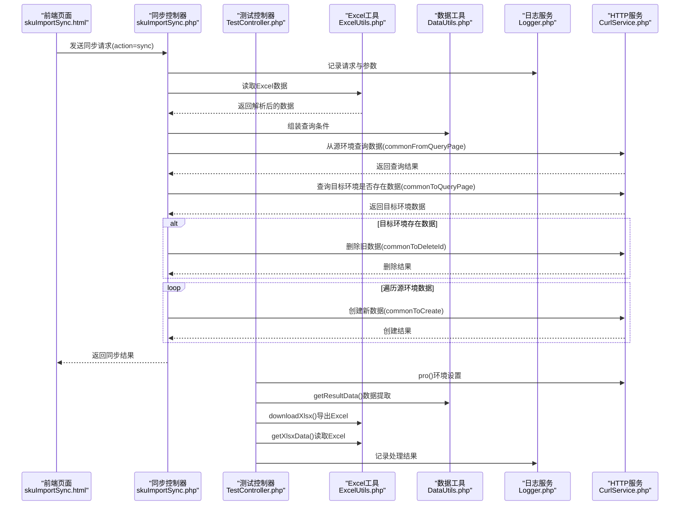
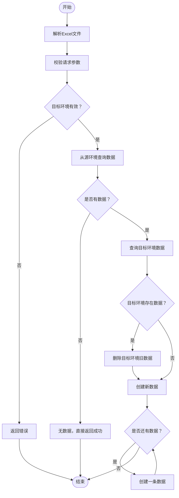
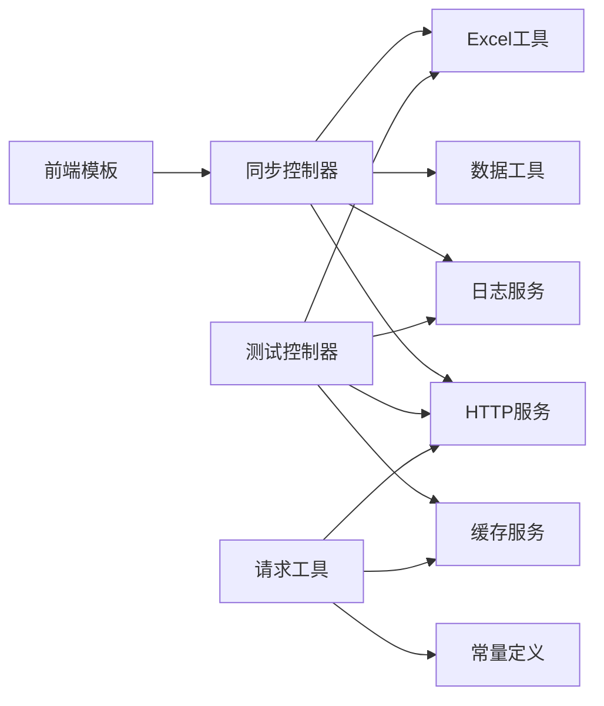

# Shell脚本系统

<cite>
**本文引用的文件**
- [php/controller/skuImportSync.php](file://php/controller/skuImportSync.php)
- [php/shell/TestController.php](file://php/shell/TestController.php)
- [php/utils/DataUtils.php](file://php/utils/DataUtils.php)
- [php/utils/ExcelUtils.php](file://php/utils/ExcelUtils.php)
- [php/class/Logger.php](file://php/class/Logger.php)
- [php/curl/CurlService.php](file://php/curl/CurlService.php)
- [php/redis/RedisService.php](file://php/redis/RedisService.php)
- [template/fix/skuImportSync.html](file://template/fix/skuImportSync.html)
- [php/utils/RequestUtils.php](file://php/utils/RequestUtils.php)
- [php/constant/Constant.php](file://php/constant/Constant.php)
</cite>

## 目录
1. [简介](#简介)
2. [项目结构](#项目结构)
3. [核心组件](#核心组件)
4. [架构总览](#架构总览)
5. [详细组件分析](#详细组件分析)
6. [依赖关系分析](#依赖关系分析)
7. [性能考虑](#性能考虑)
8. [故障排查指南](#故障排查指南)
9. [结论](#结论)
10. [附录](#附录)

## 简介
本文件面向PaSystem的Shell脚本系统，聚焦自动化脚本的设计架构与执行机制，涵盖数据同步脚本、修复脚本、审计脚本等核心功能。重点解释以下内容：
- 数据同步脚本的跨环境数据同步逻辑与增量更新策略
- 修复脚本的数据修复算法与批量处理能力
- Shell框架的通用处理模式与扩展机制
- 定时任务调度与批处理作业的管理方式
- 调试、性能监控与错误处理的最佳实践（日志记录与异常恢复）

**更新** 新增TestController类，展示了实际的数据同步和Excel处理应用场景，特别是图片拍摄进度的导出和读取功能。

## 项目结构
围绕Shell脚本系统的关键目录与文件如下：
- 控制器层：负责HTTP入口、参数解析、业务编排与日志输出
- 工具层：提供Excel读写、数据格式化、请求封装等通用能力
- 日志与服务层：统一日志记录、HTTP请求代理、缓存服务
- 前端模板：提供可视化界面，驱动批量同步与修复流程

```mermaid
graph TB
subgraph "前端"
FE["模板页面<br/>template/fix/skuImportSync.html"]
end
subgraph "后端控制器"
CTRL["php/controller/skuImportSync.php"]
TEST["php/shell/TestController.php"]
END
subgraph "工具与服务"
EXCEL["php/utils/ExcelUtils.php"]
DATA["php/utils/DataUtils.php"]
LOG["php/class/Logger.php"]
CURL["php/curl/CurlService.php"]
REDIS["php/redis/RedisService.php"]
REQ["php/utils/RequestUtils.php"]
CONST["php/constant/Constant.php"]
end
FE --> CTRL
CTRL --> EXCEL
CTRL --> DATA
CTRL --> LOG
CTRL --> CURL
CTRL --> REDIS
TEST --> LOG
TEST --> CURL
TEST --> REDIS
TEST --> EXCEL
REQ --> CURL
REQ --> REDIS
REQ --> CONST
```

**图表来源**
- [php/controller/skuImportSync.php](file://php/controller/skuImportSync.php#L1-L512)
- [php/shell/TestController.php](file://php/shell/TestController.php#L1-L89)
- [php/utils/ExcelUtils.php](file://php/utils/ExcelUtils.php#L1-L398)
- [php/utils/DataUtils.php](file://php/utils/DataUtils.php#L1-L802)
- [php/class/Logger.php](file://php/class/Logger.php)
- [php/curl/CurlService.php](file://php/curl/CurlService.php)
- [php/redis/RedisService.php](file://php/redis/RedisService.php)
- [template/fix/skuImportSync.html](file://template/fix/skuImportSync.html)
- [php/utils/RequestUtils.php](file://php/utils/RequestUtils.php#L1-L672)
- [php/constant/Constant.php](file://php/constant/Constant.php#L1-L26)

**章节来源**
- [php/controller/skuImportSync.php](file://php/controller/skuImportSync.php#L1-L512)
- [php/shell/TestController.php](file://php/shell/TestController.php#L1-L89)
- [php/utils/ExcelUtils.php](file://php/utils/ExcelUtils.php#L1-L398)
- [php/utils/DataUtils.php](file://php/utils/DataUtils.php#L1-L802)
- [php/class/Logger.php](file://php/class/Logger.php)
- [php/curl/CurlService.php](file://php/curl/CurlService.php)
- [php/redis/RedisService.php](file://php/redis/RedisService.php)
- [template/fix/skuImportSync.html](file://template/fix/skuImportSync.html)
- [php/utils/RequestUtils.php](file://php/utils/RequestUtils.php#L1-L672)
- [php/constant/Constant.php](file://php/constant/Constant.php#L1-L26)

## 核心组件
- 数据同步控制器：负责Excel解析、参数校验、跨环境同步、日志记录与异常处理
- Excel工具：提供Excel读取、写入与大列表分片导出能力
- 数据工具：封装各类接口响应数据的提取与转换
- 日志服务：统一日志记录，便于调试与审计
- HTTP服务：封装跨环境请求代理，支持多环境切换
- 缓存服务：Redis服务封装，用于状态与中间结果存储
- 前端模板：提供可视化界面，驱动批量同步与修复流程
- 测试控制器：专门用于数据同步和Excel处理的实际应用场景

**更新** 新增测试控制器组件，提供专门的数据同步和Excel处理功能。

**章节来源**
- [php/controller/skuImportSync.php](file://php/controller/skuImportSync.php#L12-L472)
- [php/shell/TestController.php](file://php/shell/TestController.php#L11-L26)
- [php/utils/ExcelUtils.php](file://php/utils/ExcelUtils.php#L20-L138)
- [php/utils/DataUtils.php](file://php/utils/DataUtils.php#L7-L271)
- [php/class/Logger.php](file://php/class/Logger.php)
- [php/curl/CurlService.php](file://php/curl/CurlService.php)
- [php/redis/RedisService.php](file://php/redis/RedisService.php)
- [template/fix/skuImportSync.html](file://template/fix/skuImportSync.html)

## 架构总览
系统采用"前端模板 + 后端控制器 + 工具与服务"的分层架构。前端通过HTTP请求触发后端控制器，控制器调用工具与服务完成数据处理与跨环境同步。



**图表来源**
- [php/controller/skuImportSync.php](file://php/controller/skuImportSync.php#L311-L426)
- [php/shell/TestController.php](file://php/shell/TestController.php#L37-L85)
- [php/utils/ExcelUtils.php](file://php/utils/ExcelUtils.php#L98-L138)
- [php/utils/DataUtils.php](file://php/utils/DataUtils.php#L18-L29)
- [php/class/Logger.php](file://php/class/Logger.php)
- [php/curl/CurlService.php](file://php/curl/CurlService.php)

## 详细组件分析

### 数据同步控制器（skuImportSync.php）
职责与特性：
- Excel解析与模板下载：支持xlsx/xls，自动创建模板并下载
- 参数校验与请求路由：根据action分发至不同处理逻辑
- 跨环境同步：支持从生产环境查询数据并同步到test/uat环境
- 增量更新策略：若目标环境存在同条件数据则先删除再创建，实现"全量覆盖式增量"
- 日志与异常：完整记录请求、查询、删除、创建过程，异常捕获并返回友好提示

关键流程要点：
- 解析Excel：读取首列作为SKU ID，去重并返回列表
- 同步逻辑：构造查询条件，分别从源与目标环境查询，存在即删除，逐条创建
- 环境切换：通过反射动态设置目标环境的HTTP服务实例



**图表来源**
- [php/controller/skuImportSync.php](file://php/controller/skuImportSync.php#L164-L426)

**章节来源**
- [php/controller/skuImportSync.php](file://php/controller/skuImportSync.php#L12-L472)

### 测试控制器（TestController.php）
职责与特性：
- 专门用于生产数据到测试环境的增删改查操作
- 提供图片拍摄进度数据的导出和读取功能
- 展示了实际的数据同步和Excel处理应用场景
- 集成了日志记录、HTTP请求代理和缓存服务

关键方法：
- `downloadPaSkuPhotoProgress()`：从生产环境查询图片拍摄进度数据，分页导出为Excel文件
- `readPaSkuPhotoProgress()`：读取导出的Excel文件，统计数据条目数量

**更新** 新增测试控制器组件，提供了实际的数据同步和Excel处理示例。

**章节来源**
- [php/shell/TestController.php](file://php/shell/TestController.php#L11-L89)

### Excel工具（ExcelUtils.php）
职责与特性：
- 写入导出：支持xlsx导出，自动设置表头与数据行
- 读取Excel：支持多工作表读取，自动处理列标题与数据行
- 长数字处理：针对长数字列强制文本格式，避免科学计数法丢失精度
- 分片导出：结合业务场景可将大数据集分批导出，降低内存压力

**章节来源**
- [php/utils/ExcelUtils.php](file://php/utils/ExcelUtils.php#L20-L398)

### 数据工具（DataUtils.php）
职责与特性：
- 响应数据提取：提供多种接口响应格式的提取方法（分页、查询、特殊格式等）
- 数据清洗：去重、查找、字段提取、数组对象处理
- 命令行参数解析：支持标准命令行参数解析，便于脚本化运行

**章节来源**
- [php/utils/DataUtils.php](file://php/utils/DataUtils.php#L7-L271)

### 日志服务（Logger.php）
职责与特性：
- 统一日志记录：支持文件切分、时间戳、级别等
- 与控制器集成：在关键节点记录请求、查询、删除、创建等步骤

**章节来源**
- [php/class/Logger.php](file://php/class/Logger.php)

### HTTP服务（CurlService.php）
职责与特性：
- 环境切换：支持test、uat、pro等多环境实例
- 统一请求封装：提供GET/POST等常用方法，便于控制器调用

**章节来源**
- [php/curl/CurlService.php](file://php/curl/CurlService.php)

### 缓存服务（RedisService.php）
职责与特性：
- 缓存与中间状态：可用于批处理状态跟踪、幂等控制等

**章节来源**
- [php/redis/RedisService.php](file://php/redis/RedisService.php)

### 前端模板（skuImportSync.html）
职责与特性：
- 可视化界面：支持Excel上传、批量同步、状态展示
- 交互流程：逐条发起同步请求，展示进度与结果

**章节来源**
- [template/fix/skuImportSync.html](file://template/fix/skuImportSync.html)

### 请求工具（RequestUtils.php）
职责与特性：
- 封装各种业务接口的请求方法
- 提供Redis缓存操作和常量定义
- 支持批量数据处理和分页查询

**更新** 新增请求工具组件，提供了更丰富的业务接口封装。

**章节来源**
- [php/utils/RequestUtils.php](file://php/utils/RequestUtils.php#L6-L672)

### 常量定义（Constant.php）
职责与特性：
- 定义Redis连接参数和各种业务常量
- 提供统一的配置管理

**更新** 新增常量定义组件，集中管理系统配置。

**章节来源**
- [php/constant/Constant.php](file://php/constant/Constant.php#L1-L26)

## 依赖关系分析
组件之间的依赖关系如下：



**图表来源**
- [php/controller/skuImportSync.php](file://php/controller/skuImportSync.php#L1-L512)
- [php/shell/TestController.php](file://php/shell/TestController.php#L1-L89)
- [php/utils/ExcelUtils.php](file://php/utils/ExcelUtils.php#L1-L398)
- [php/utils/DataUtils.php](file://php/utils/DataUtils.php#L1-L802)
- [php/class/Logger.php](file://php/class/Logger.php)
- [php/curl/CurlService.php](file://php/curl/CurlService.php)
- [php/redis/RedisService.php](file://php/redis/RedisService.php)
- [template/fix/skuImportSync.html](file://template/fix/skuImportSync.html)
- [php/utils/RequestUtils.php](file://php/utils/RequestUtils.php#L1-L672)
- [php/constant/Constant.php](file://php/constant/Constant.php#L1-L26)

**章节来源**
- [php/controller/skuImportSync.php](file://php/controller/skuImportSync.php#L1-L512)
- [php/shell/TestController.php](file://php/shell/TestController.php#L1-L89)
- [php/utils/ExcelUtils.php](file://php/utils/ExcelUtils.php#L1-L398)
- [php/utils/DataUtils.php](file://php/utils/DataUtils.php#L1-L802)
- [php/class/Logger.php](file://php/class/Logger.php)
- [php/curl/CurlService.php](file://php/curl/CurlService.php)
- [php/redis/RedisService.php](file://php/redis/RedisService.php)
- [template/fix/skuImportSync.html](file://template/fix/skuImportSync.html)
- [php/utils/RequestUtils.php](file://php/utils/RequestUtils.php#L1-L672)
- [php/constant/Constant.php](file://php/constant/Constant.php#L1-L26)

## 性能考虑
- 大数据分片：Excel读取与导出建议分批处理，避免一次性加载过多数据导致内存溢出
- 批量同步：前端逐条同步，可在业务允许范围内增加并发度以提升吞吐
- 环境切换：通过HTTP服务统一管理多环境，减少重复初始化成本
- 日志落盘：日志按天/按任务切分，避免单文件过大影响IO性能
- 缓存优化：Redis缓存用于频繁访问的数据，减少数据库查询压力

**更新** 新增缓存优化建议，提高系统整体性能。

## 故障排查指南
常见问题与处理建议：
- Excel上传失败：检查上传目录权限、文件大小限制、扩展名限制
- 同步无数据：确认查询条件字段与SKU ID是否正确，检查源环境数据是否存在
- 目标环境删除失败：记录错误日志，确认目标环境权限与接口可用性
- 创建失败：检查数据结构与必填字段，定位具体失败的记录并重试
- 日志定位：通过日志文件中的请求参数、查询条件、异常堆栈快速定位问题
- Excel读取异常：检查Excel文件格式、编码和数据完整性
- HTTP请求超时：检查网络连接、目标服务状态和请求参数

**章节来源**
- [php/controller/skuImportSync.php](file://php/controller/skuImportSync.php#L433-L471)
- [php/controller/skuImportSync.php](file://php/controller/skuImportSync.php#L414-L426)
- [php/shell/TestController.php](file://php/shell/TestController.php#L73-L75)

## 结论
PaSystem Shell脚本系统通过清晰的分层设计与完善的工具链，实现了跨环境数据同步、批量修复与可视化管理。其核心优势在于：
- 统一的控制器入口与日志体系，便于运维与审计
- Excel工具与数据工具提供强大的数据处理能力
- HTTP服务与缓存服务支撑多环境与高并发场景
- 前端模板驱动批处理流程，提升用户体验与效率
- 新增的测试控制器展示了实际的应用场景和最佳实践

**更新** 系统现已具备完整的测试和验证能力，能够更好地支持实际业务需求。

## 附录
- 定时任务与批处理：建议将批量同步与修复流程纳入定时任务，结合日志与告警实现自动化运维
- 扩展机制：新增脚本可复用现有工具与服务，遵循统一的日志与异常处理规范
- 测试验证：通过TestController类提供的实际应用场景，验证系统的稳定性和可靠性
- 性能监控：建议添加Redis监控和Excel处理性能指标，持续优化系统表现

**更新** 新增测试验证和性能监控建议，完善系统运维体系。