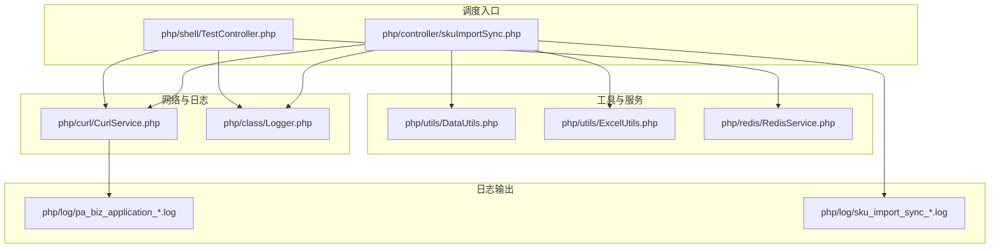
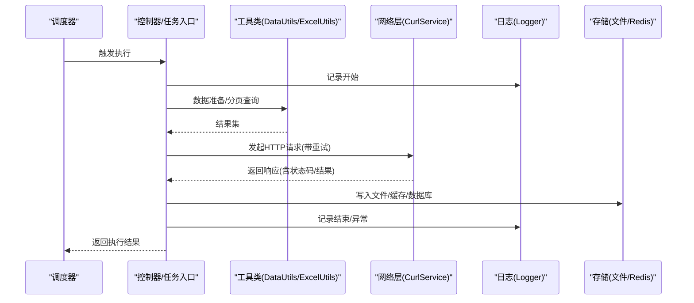
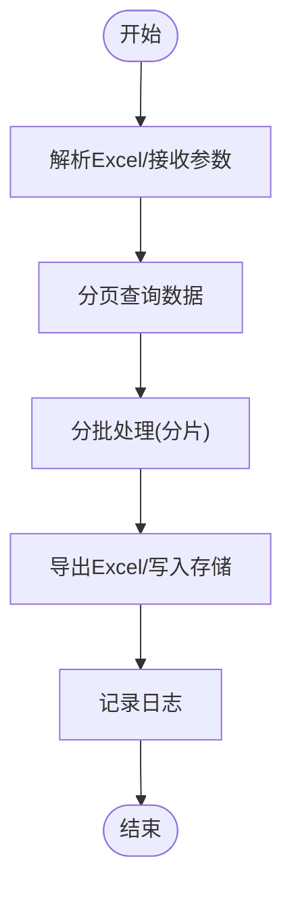
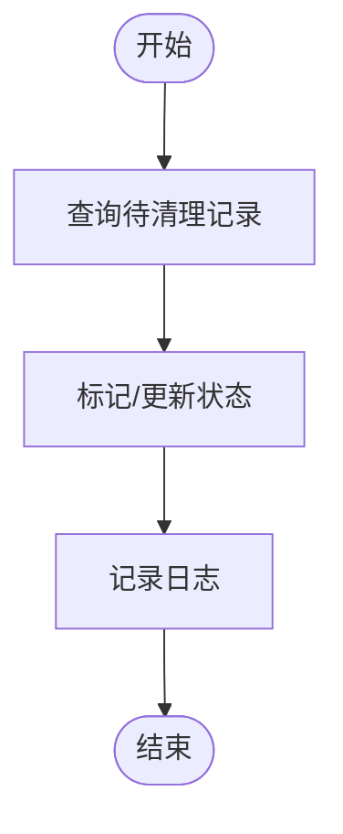
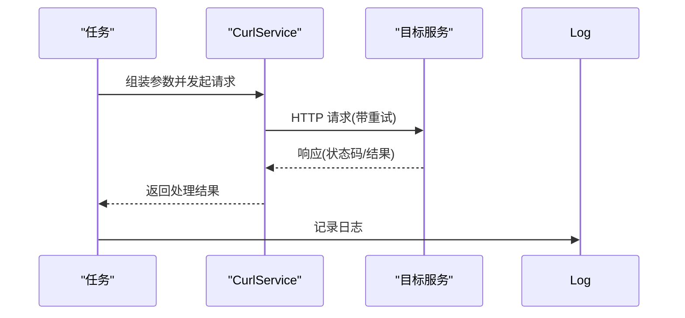
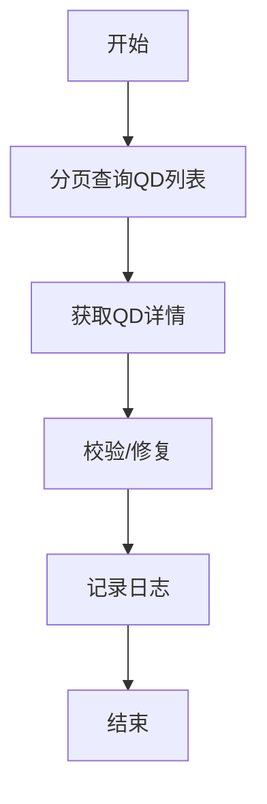
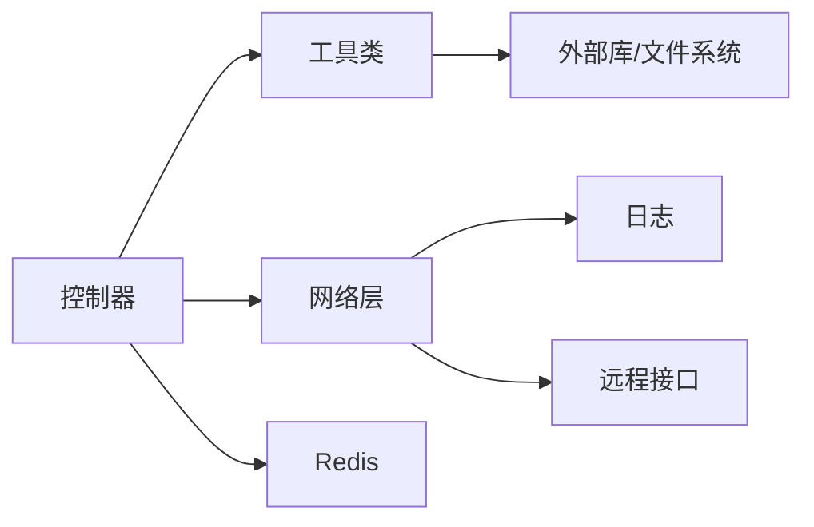

# 定时任务脚本

<cite>
**本文引用的文件**
- [php/shell/TestController.php](file://php/shell/TestController.php)
- [php/curl/CurlService.php](file://php/curl/CurlService.php)
- [php/class/Logger.php](file://php/class/Logger.php)
- [php/utils/DataUtils.php](file://php/utils/DataUtils.php)
- [php/utils/ExcelUtils.php](file://php/utils/ExcelUtils.php)
- [php/redis/RedisService.php](file://php/redis/RedisService.php)
- [php/controller/skuImportSync.php](file://php/controller/skuImportSync.php)
- [php/log/pa_biz_application_20260227.log](file://php/log/pa_biz_application_20260227.log)
- [php/log/sku_import_sync_20260227.log](file://php/log/sku_import_sync_20260227.log)
</cite>

## 目录
1. [简介](#简介)
2. [项目结构](#项目结构)
3. [核心组件](#核心组件)
4. [架构总览](#架构总览)
5. [详细组件分析](#详细组件分析)
6. [依赖关系分析](#依赖关系分析)
7. [性能考虑](#性能考虑)
8. [故障排查指南](#故障排查指南)
9. [结论](#结论)
10. [附录](#附录)

## 简介
本文件面向定时任务脚本的运维与开发人员，系统性梳理仓库中的定时任务相关实现与最佳实践。重点覆盖以下方面：
- 任务调度机制与执行策略：基于现有代码库中可定位的任务实现，说明其调用链路、数据流与执行边界。
- crontab 配置与调度最佳实践：结合现有脚本的入口方式与依赖，给出合理的调度建议。
- 日志记录与监控：基于现有日志模块与日志文件，说明如何建立统一的日志规范与监控告警。
- 失败重试与异常处理：总结现有重试与异常处理模式，提出可复用的策略。
- 任务间依赖与并发控制：通过调用链与外部服务依赖，分析潜在的并发与依赖关系。

注意：在当前仓库中，未发现名为 SyncProduct.sh、DeleteCampaignNotify.sh、RequestPortfolio.sh、FixQdCer.sh 的独立 Shell 脚本文件。本文将以现有 PHP 控制器与工具类为依据，对“产品同步”“活动通知清理”“投资组合请求”“QD 证书修复”等任务进行技术层面的解读，并提供可落地的调度与运维建议。

## 项目结构
围绕定时任务相关的代码主要分布在以下模块：
- 调度入口与控制器层：php/controller/*.php（如 skuImportSync.php）
- Shell 工具与任务编排：php/shell/*.php（如 TestController.php）
- 通用工具与服务：php/utils/*.php（如 DataUtils.php、ExcelUtils.php）
- 网络请求与重试：php/curl/CurlService.php
- 日志系统：php/class/Logger.php 与 php/log/*.log
- 缓存与状态：php/redis/RedisService.php

图表来源
- [php/controller/skuImportSync.php](file://php/controller/skuImportSync.php#L1-L200)
- [php/shell/TestController.php](file://php/shell/TestController.php#L1-L89)
- [php/utils/DataUtils.php](file://php/utils/DataUtils.php)
- [php/utils/ExcelUtils.php](file://php/utils/ExcelUtils.php)
- [php/redis/RedisService.php](file://php/redis/RedisService.php)
- [php/curl/CurlService.php](file://php/curl/CurlService.php#L601-L851)
- [php/class/Logger.php](file://php/class/Logger.php)
- [php/log/pa_biz_application_20260227.log](file://php/log/pa_biz_application_20260227.log)
- [php/log/sku_import_sync_20260227.log](file://php/log/sku_import_sync_20260227.log)

章节来源
- [php/controller/skuImportSync.php](file://php/controller/skuImportSync.php#L1-L200)
- [php/shell/TestController.php](file://php/shell/TestController.php#L1-L89)

## 核心组件
- 数据工具（DataUtils）：封装分页查询、结果解析等通用数据处理逻辑，常用于定时任务的数据拉取与转换。
- Excel 工具（ExcelUtils）：负责 Excel 文件的读写与分片导出，支撑定时任务的数据落盘与报表生成。
- 网络请求（CurlService）：提供统一的 HTTP 请求封装，内置超时、重试与状态码校验逻辑，是定时任务调用后端接口的关键组件。
- 日志（Logger）：提供结构化的日志记录能力，便于任务执行过程与异常的追踪。
- Redis（RedisService）：用于任务状态缓存、幂等控制与并发协调。

章节来源
- [php/utils/DataUtils.php](file://php/utils/DataUtils.php)
- [php/utils/ExcelUtils.php](file://php/utils/ExcelUtils.php)
- [php/curl/CurlService.php](file://php/curl/CurlService.php#L601-L851)
- [php/class/Logger.php](file://php/class/Logger.php)
- [php/redis/RedisService.php](file://php/redis/RedisService.php)

## 架构总览
下图展示了典型定时任务的执行流程：控制器作为入口，调用工具与服务，通过 CurlService 发起远程请求，使用 Logger 记录日志，并将结果写入本地或远端存储。

图表来源
- [php/controller/skuImportSync.php](file://php/controller/skuImportSync.php#L40-L77)
- [php/utils/DataUtils.php](file://php/utils/DataUtils.php)
- [php/utils/ExcelUtils.php](file://php/utils/ExcelUtils.php)
- [php/curl/CurlService.php](file://php/curl/CurlService.php#L664-L740)
- [php/class/Logger.php](file://php/class/Logger.php)
- [php/redis/RedisService.php](file://php/redis/RedisService.php)

## 详细组件分析

### 产品同步任务（基于现有实现的解读）
- 入口与职责
  - 入口控制器：skuImportSync.php 提供解析、同步、模板下载等功能，可作为“产品/SKU 数据同步”的业务入口。
  - 任务特性：支持 Excel 解析、分页查询、批量导出与日志记录。
- 数据流与处理逻辑
  - 解析 Excel -> 分页查询 -> 批量处理 -> 导出 Excel -> 记录日志。
- 并发与幂等
  - 可结合 Redis 进行任务状态标记与去重；对大列表采用分页与分片导出，避免内存压力。
- 日志与监控
  - 使用 MyLogger 记录关键节点，建议按天轮转并接入集中式日志平台。

图表来源
- [php/controller/skuImportSync.php](file://php/controller/skuImportSync.php#L164-L200)
- [php/utils/DataUtils.php](file://php/utils/DataUtils.php)
- [php/utils/ExcelUtils.php](file://php/utils/ExcelUtils.php)
- [php/class/Logger.php](file://php/class/Logger.php)

章节来源
- [php/controller/skuImportSync.php](file://php/controller/skuImportSync.php#L1-L200)

### 活动通知清理任务（基于现有实现的解读）
- 入口与职责
  - 在 TestController.php 中存在与“活动/通知”相关的查询与处理逻辑片段，可作为清理任务的参考实现。
- 数据流与处理逻辑
  - 查询符合条件的记录 -> 标记/更新状态 -> 记录日志。
- 并发与幂等
  - 建议使用 Redis 锁或唯一键约束，避免重复清理。
- 日志与监控
  - 统一日志格式，记录清理数量与异常。

图表来源
- [php/shell/TestController.php](file://php/shell/TestController.php#L1-L89)
- [php/class/Logger.php](file://php/class/Logger.php)

章节来源
- [php/shell/TestController.php](file://php/shell/TestController.php#L1-L89)

### 投资组合请求任务（基于现有实现的解读）
- 入口与职责
  - CurlService 提供统一的 HTTP 请求封装，支持多种端口与模块路由，适合构建“投资组合请求”等对外接口调用任务。
- 数据流与处理逻辑
  - 组装请求参数 -> 调用 CurlService -> 处理响应 -> 记录日志。
- 重试与异常
  - 内置重试与状态码校验，建议结合业务场景调整重试次数与超时。
- 日志与监控
  - 将请求 URL、状态码、耗时纳入日志，便于监控与回溯。

图表来源
- [php/curl/CurlService.php](file://php/curl/CurlService.php#L664-L740)
- [php/class/Logger.php](file://php/class/Logger.php)

章节来源
- [php/curl/CurlService.php](file://php/curl/CurlService.php#L601-L851)

### QD 证书修复任务（基于现有实现的解读）
- 入口与职责
  - TestController.php 中包含与“QD 单据/寄卖”相关的查询与处理逻辑，可作为“QD 证书修复”的实现参考。
- 数据流与处理逻辑
  - 分页查询 QD 列表 -> 获取详情 -> 校验/修复 -> 记录日志。
- 并发与幂等
  - 对已处理的 QD 标记去重，避免重复修复。
- 日志与监控
  - 记录处理步骤、异常与修复结果。

图表来源
- [php/shell/TestController.php](file://php/shell/TestController.php#L6485-L6516)
- [php/class/Logger.php](file://php/class/Logger.php)

章节来源
- [php/shell/TestController.php](file://php/shell/TestController.php#L6485-L6516)

## 依赖关系分析
- 组件耦合
  - 控制器依赖工具类与网络层；网络层依赖日志与配置；工具类依赖第三方库（如 PhpSpreadsheet）。
- 外部依赖
  - 远程接口（通过 CurlService 路由）、Excel 文件系统、Redis 缓存。
- 潜在循环依赖
  - 当前结构以“控制器 -> 工具/服务 -> 网络层 -> 日志/存储”线性依赖为主，未见明显循环。

图表来源
- [php/controller/skuImportSync.php](file://php/controller/skuImportSync.php#L1-L200)
- [php/utils/DataUtils.php](file://php/utils/DataUtils.php)
- [php/utils/ExcelUtils.php](file://php/utils/ExcelUtils.php)
- [php/curl/CurlService.php](file://php/curl/CurlService.php#L601-L851)
- [php/class/Logger.php](file://php/class/Logger.php)
- [php/redis/RedisService.php](file://php/redis/RedisService.php)

章节来源
- [php/controller/skuImportSync.php](file://php/controller/skuImportSync.php#L1-L200)
- [php/curl/CurlService.php](file://php/curl/CurlService.php#L601-L851)

## 性能考虑
- 分页与分片
  - 对大列表采用分页与分片处理，降低内存占用与网络压力。
- 重试策略
  - 基于 CurlService 的重试机制，建议结合业务重要性设置合理的重试次数与退避策略。
- I/O 优化
  - Excel 导出采用分片写入，避免一次性生成过大的文件。
- 并发控制
  - 使用 Redis 锁或队列进行并发控制，避免重复执行与资源争用。

## 故障排查指南
- 日志定位
  - 查看应用日志与任务日志，定位异常发生的时间点与调用栈。
- 网络问题
  - 检查 CurlService 的状态码与响应体，确认接口可用性与鉴权。
- 数据问题
  - 核对分页参数与过滤条件，确保查询结果符合预期。
- 重试与回滚
  - 对幂等性任务可安全重试；对非幂等任务需引入补偿机制。

章节来源
- [php/log/pa_biz_application_20260227.log](file://php/log/pa_biz_application_20260227.log)
- [php/log/sku_import_sync_20260227.log](file://php/log/sku_import_sync_20260227.log)
- [php/curl/CurlService.php](file://php/curl/CurlService.php#L725-L732)

## 结论
- 仓库中未发现名为 SyncProduct.sh、DeleteCampaignNotify.sh、RequestPortfolio.sh、FixQdCer.sh 的独立 Shell 脚本文件。
- 本文基于现有 PHP 控制器与工具类，对“产品同步”“活动通知清理”“投资组合请求”“QD 证书修复”等任务进行了技术解读，并提供了调度、日志、重试与并发控制的建议。
- 建议将上述任务以标准 PHP CLI 形式接入 crontab，统一日志与监控，确保高可靠运行。

## 附录

### crontab 配置与调度最佳实践
- 任务拆分
  - 将不同类型的定时任务拆分为独立的 crontab 条目，便于隔离与观测。
- 时间窗口
  - 避免在业务高峰期执行大批量任务，合理分配执行时间窗。
- 并发控制
  - 使用进程锁或 Redis 锁，防止同一任务并发执行。
- 超时与重试
  - 为每个任务设置合理的超时与重试上限，避免长时间阻塞。
- 日志与告警
  - 将任务日志标准化并接入监控平台，设置异常告警阈值。

### 任务失败重试与异常处理
- 重试策略
  - 对瞬时性错误（如网络抖动）进行指数退避重试；对业务错误（如参数非法）直接失败并记录。
- 异常处理
  - 包裹关键流程，捕获异常并记录上下文；对可恢复错误进行补偿处理。

### 任务间依赖与并发控制
- 依赖管理
  - 通过 Redis 或数据库维护任务依赖关系，确保前置任务完成后才执行后续任务。
- 并发控制
  - 使用分布式锁或队列机制，保证任务的串行化与幂等性。