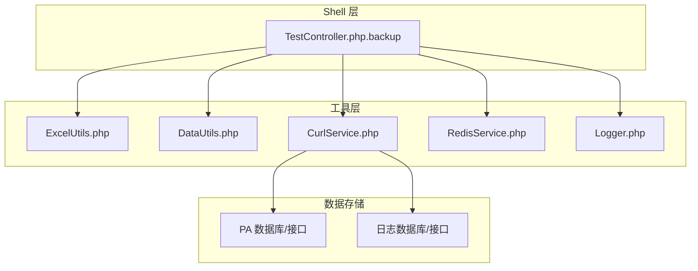
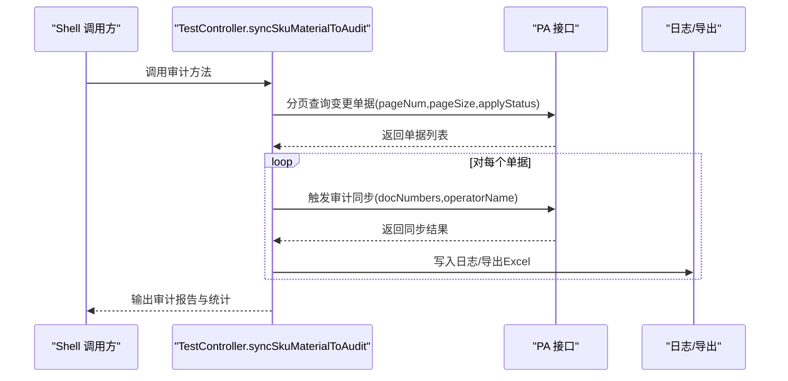
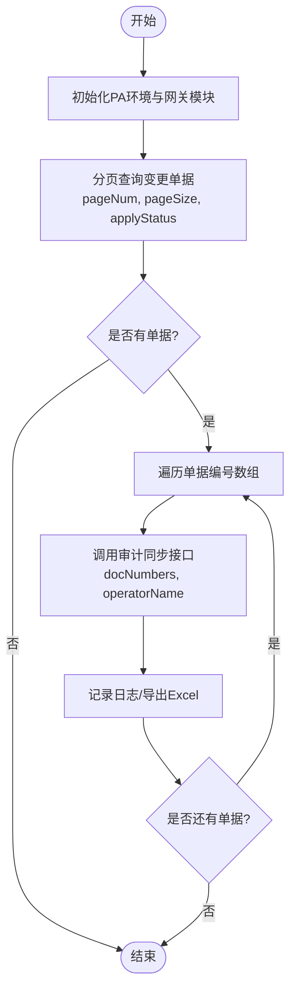
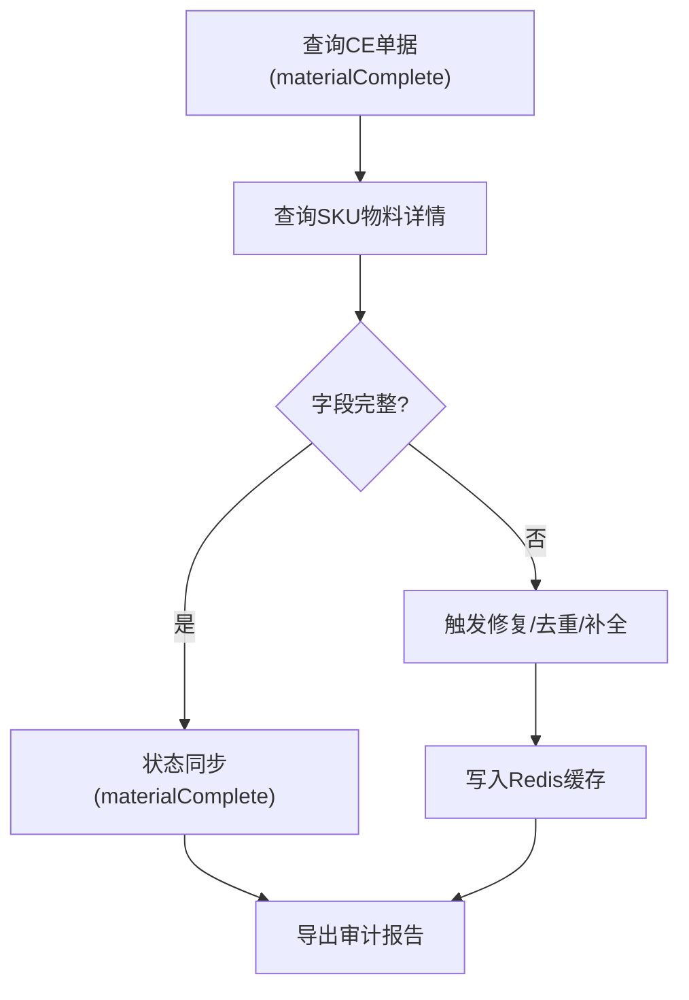
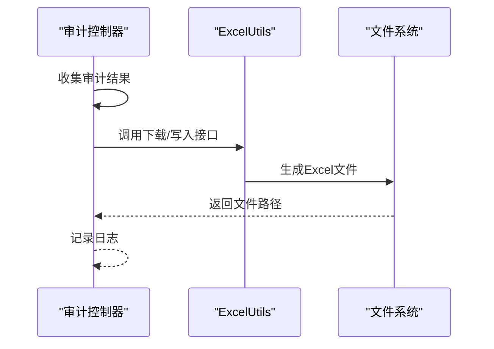
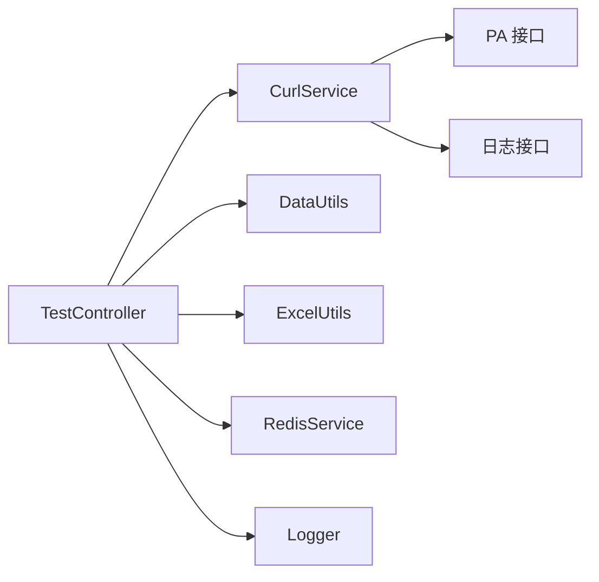

# 审计脚本

<cite>
**本文引用的文件**
- [TestController.php.backup](file://php/shell/TestController.php.backup)
- [ExcelUtils.php](file://php/utils/ExcelUtils.php)
- [DataUtils.php](file://php/utils/DataUtils.php)
- [CurlService.php](file://php/curl/CurlService.php)
- [RedisService.php](file://php/redis/RedisService.php)
- [Logger.php](file://php/class/Logger.php)
</cite>

## 目录
1. [简介](#简介)
2. [项目结构](#项目结构)
3. [核心组件](#核心组件)
4. [架构总览](#架构总览)
5. [详细组件分析](#详细组件分析)
6. [依赖关系分析](#依赖关系分析)
7. [性能考量](#性能考量)
8. [故障排查指南](#故障排查指南)
9. [结论](#结论)
10. [附录](#附录)

## 简介
本文件围绕“SKU物料审计”能力进行系统化说明，重点聚焦于审计脚本在仓库中的实现位置与调用入口，并基于现有源码梳理其数据完整性检查、状态同步机制、执行流程、数据比对逻辑、异常处理、审计报告生成与输出、配置与自定义参数、问题类型与处理建议，以及性能优化与批量处理策略。  
说明：当前仓库中未发现独立的“SyncSkuMaterialToAudit.php”或“SyncSkuMaterialToAudit.sh”。与该功能最接近的实现位于测试控制器备份文件中，通过一个名为 syncSkuMaterialToAudit 的方法对外暴露审计能力；同时，仓库提供了丰富的工具类（如 Excel 导出、分页数据拉取、HTTP 请求封装、日志与缓存等），这些是审计脚本运行的基础支撑。

## 项目结构
- 审计脚本入口与实现位于 shell 目录下的测试控制器备份文件中，方法名为 syncSkuMaterialToAudit。
- 数据导出与解析依赖 ExcelUtils 工具类。
- 分页查询与结果解析由 DataUtils 提供。
- HTTP 请求与模块路由由 CurlService 提供。
- 缓存与日志分别由 RedisService 与 Logger 提供。
- 其他相关方法（如日志审计、重复数据检测、发布前后广告信息比对）也位于同一文件中，可作为审计流程的参考与扩展。

**图示来源**
- [TestController.php.backup](file://php/shell/TestController.php.backup#L1667-L1704)
- [ExcelUtils.php](file://php/utils/ExcelUtils.php)
- [DataUtils.php](file://php/utils/DataUtils.php)
- [CurlService.php](file://php/curl/CurlService.php)
- [RedisService.php](file://php/redis/RedisService.php)
- [Logger.php](file://php/class/Logger.php)

**章节来源**
- [TestController.php.backup](file://php/shell/TestController.php.backup#L1667-L1704)

## 核心组件
- 审计入口方法：syncSkuMaterialToAudit
  - 功能：从 PA 模块接口分页查询变更过的 SKU 物料单据，逐个触发审计同步接口，记录日志并输出结果。
  - 关键参数：分页参数 pageNum、pageSize、applyStatus；单据编号列表 docNumbers；操作者 operatorName。
- 数据导出工具：ExcelUtils
  - 功能：将审计结果以 Excel 文件形式导出，支持多表头字段与分块写入。
- 分页与结果解析：DataUtils
  - 功能：统一处理分页查询返回结构，提供便捷的列表与文档提取方法。
- HTTP 服务封装：CurlService
  - 功能：封装模块路由、网关切换、GET/POST 请求与响应解析。
- 缓存与日志：RedisService、Logger
  - 功能：提供临时数据缓存与日志记录能力，便于审计过程追踪与问题定位。

**章节来源**
- [TestController.php.backup](file://php/shell/TestController.php.backup#L1667-L1704)
- [ExcelUtils.php](file://php/utils/ExcelUtils.php)
- [DataUtils.php](file://php/utils/DataUtils.php)
- [CurlService.php](file://php/curl/CurlService.php)
- [RedisService.php](file://php/redis/RedisService.php)
- [Logger.php](file://php/class/Logger.php)

## 架构总览
审计脚本整体采用“查询-触发-记录”的三层结构：
- 查询层：通过 PA 接口分页获取待审计的变更单据。
- 触发层：针对每个单据调用审计同步接口，完成状态与数据的对齐。
- 记录层：使用日志与 Excel 导出记录审计过程与结果，必要时借助 Redis 缓存中间态数据。

**图示来源**
- [TestController.php.backup](file://php/shell/TestController.php.backup#L1667-L1704)

## 详细组件分析

### 组件A：SKU物料审计主流程（syncSkuMaterialToAudit）
- 执行入口：在测试控制器中定义的 syncSkuMaterialToAudit 方法。
- 关键步骤：
  - 初始化 PA 环境与网关模块。
  - 分页查询变更单据，筛选 applyStatus=30 的记录。
  - 将单据编号集合拆分为数组，逐个调用审计同步接口。
  - 记录每次调用的响应与日志。
- 参数与配置：
  - 分页参数：pageNum、pageSize。
  - 状态筛选：applyStatus。
  - 单据编号：docNumbers（数组）。
  - 操作者：operatorName。
- 异常处理：
  - 若查询为空则终止；若单据编号为空则跳过；对每个单据调用均记录响应。
- 报告输出：
  - 使用日志记录审计过程与结果；可结合 Excel 导出工具生成报表（见下文“审计报告生成与输出”）。

**图示来源**
- [TestController.php.backup](file://php/shell/TestController.php.backup#L1667-L1704)

**章节来源**
- [TestController.php.backup](file://php/shell/TestController.php.backup#L1667-L1704)

### 组件B：数据完整性检查与状态同步机制
- 数据完整性检查：
  - 通过查询 CE 单据与 SKU 物料详情，对比 keywords、cpAsin、fitment 字段是否存在且非空。
  - 对已发布（materialComplete）的物料，进一步校验 publishOn/publishBy 是否满足条件。
- 状态同步机制：
  - 当 CE 单据状态为 materialComplete 且 SKU 物料状态为 developerComplete 时，触发同步流程，确保字段一致性。
  - 对重复数据进行去重处理（关键词、ASIN 去重，车型按 make/model 去重）。
- 中间态缓存：
  - 使用 Redis 缓存重复项与待修复项，便于后续导出与人工复核。

**图示来源**
- [TestController.php.backup](file://php/shell/TestController.php.backup#L3412-L3589)
- [TestController.php.backup](file://php/shell/TestController.php.backup#L3903-L3960)

**章节来源**
- [TestController.php.backup](file://php/shell/TestController.php.backup#L3412-L3589)
- [TestController.php.backup](file://php/shell/TestController.php.backup#L3903-L3960)

### 组件C：审计报告生成与输出
- 报表类型：
  - 发布后广告信息内容（CE 单、SKU、发布日期）。
  - 发布前广告信息内容（核心词、ASIN、车型）。
  - 重复 SKU 物料明细（用于识别异常与风险点）。
- 输出方式：
  - 使用 ExcelUtils 将结构化数据导出为 Excel 文件，支持多表头字段与分块写入，避免内存压力。
- 输出时机：
  - 在审计流程中按需导出，或在检测到异常后单独导出。

**图示来源**
- [TestController.php.backup](file://php/shell/TestController.php.backup#L3578-L3585)
- [TestController.php.backup](file://php/shell/TestController.php.backup#L3664-L3671)
- [TestController.php.backup](file://php/shell/TestController.php.backup#L3751-L3774)

**章节来源**
- [TestController.php.backup](file://php/shell/TestController.php.backup#L3578-L3585)
- [TestController.php.backup](file://php/shell/TestController.php.backup#L3664-L3671)
- [TestController.php.backup](file://php/shell/TestController.php.backup#L3751-L3774)

### 组件D：配置选项与自定义参数
- 分页参数：
  - pageNum：起始页码。
  - pageSize：每页条数。
- 状态筛选：
  - applyStatus：筛选已应用的变更单据。
- 单据选择：
  - docNumbers：指定单据编号数组，用于定向审计。
- 操作者标识：
  - operatorName：标注审计操作的执行者，便于溯源。
- 批量策略：
  - 对 docNumbers 进行分块处理，避免请求过大或超时。
- 时间阈值：
  - publishOn/publishBy 条件用于判断是否满足发布后的审计范围。

**章节来源**
- [TestController.php.backup](file://php/shell/TestController.php.backup#L1667-L1704)
- [TestController.php.backup](file://php/shell/TestController.php.backup#L3445-L3451)

### 组件E：问题类型与处理建议
- 问题类型：
  - 字段缺失：keywords、cpAsin、fitment 为空或不完整。
  - 发布时间异常：publishOn/publishBy 为空或早于阈值。
  - 重复数据：关键词、ASIN 或车型重复。
  - 状态不一致：CE 单据与 SKU 物料状态不匹配。
- 处理建议：
  - 字段缺失：根据 CE 单据内容补全，或回退到父 SKU 的模板数据。
  - 发布时间异常：修正时间戳或标记为待处理。
  - 重复数据：执行去重逻辑（关键词与 ASIN 去重，车型按 make/model 去重）。
  - 状态不一致：触发状态同步接口，确保 materialComplete 一致。

**章节来源**
- [TestController.php.backup](file://php/shell/TestController.php.backup#L3903-L3960)
- [TestController.php.backup](file://php/shell/TestController.php.backup#L3412-L3589)

### 组件F：性能优化与批量处理策略
- 分页与批量化：
  - 使用 DataUtils 的分页查询方法，控制 pageSize，避免一次性拉取过多数据。
  - 对 docNumbers 进行分块（例如每批 10 个），降低单次请求压力。
- 缓存中间态：
  - 使用 Redis 缓存重复项与待修复项，减少重复计算与网络往返。
- 导出优化：
  - 使用 ExcelUtils 的分块写入，避免大文件导致内存溢出。
- 并发与重试：
  - 建议在外部调度器中对 docNumbers 分片并发执行，并对失败请求进行有限重试。

**章节来源**
- [TestController.php.backup](file://php/shell/TestController.php.backup#L3445-L3451)
- [TestController.php.backup](file://php/shell/TestController.php.backup#L3492-L3493)
- [ExcelUtils.php](file://php/utils/ExcelUtils.php)

## 依赖关系分析
- 控制器依赖：
  - TestController 依赖 CurlService、DataUtils、ExcelUtils、RedisService、Logger。
- 数据流：
  - 通过 CurlService 访问 PA 接口，使用 DataUtils 解析分页结果，使用 ExcelUtils 导出报表，使用 RedisService 缓存中间态，使用 Logger 记录审计轨迹。
- 外部集成：
  - 审计流程可能依赖日志系统（通过日志接口查询对象变更日志），用于验证发布前后字段变化。

**图示来源**
- [TestController.php.backup](file://php/shell/TestController.php.backup#L1667-L1704)
- [CurlService.php](file://php/curl/CurlService.php)
- [DataUtils.php](file://php/utils/DataUtils.php)
- [ExcelUtils.php](file://php/utils/ExcelUtils.php)
- [RedisService.php](file://php/redis/RedisService.php)
- [Logger.php](file://php/class/Logger.php)

**章节来源**
- [TestController.php.backup](file://php/shell/TestController.php.backup#L1667-L1704)

## 性能考量
- 分页与限流：合理设置 pageSize，避免单次请求过大；对外部调度器施加并发限制，防止接口过载。
- 批量处理：对 docNumbers 进行分块处理，提升吞吐并降低失败率。
- 缓存利用：对重复项与待修复项使用 Redis 缓存，减少重复扫描与网络请求。
- 导出优化：使用分块写入 Excel，避免内存峰值。
- 错误重试：对外部接口调用增加有限重试与超时控制，提升稳定性。

[本节为通用性能建议，不直接分析具体文件]

## 故障排查指南
- 常见问题：
  - 查询为空：检查 applyStatus 与分页参数是否正确。
  - 审计接口失败：检查 operatorName 与 docNumbers 格式，确认网关与模块路由可用。
  - 导出失败：检查 ExcelUtils 的写入权限与磁盘空间。
  - 缓存异常：检查 Redis 连接与键空间。
- 排查步骤：
  - 查看日志：定位失败节点与错误信息。
  - 核对参数：确认分页参数、状态筛选与单据编号。
  - 验证接口：手动调用 PA 接口，确认返回结构与数据。
  - 检查缓存：确认 Redis 中的中间态数据是否正确。

**章节来源**
- [TestController.php.backup](file://php/shell/TestController.php.backup#L1667-L1704)
- [Logger.php](file://php/class/Logger.php)
- [RedisService.php](file://php/redis/RedisService.php)

## 结论
仓库中与“SKU物料审计”最接近的实现位于测试控制器的 syncSkuMaterialToAudit 方法中。该方法通过分页查询、逐单触发审计同步、日志记录与 Excel 导出，实现了完整的审计闭环。配合 DataUtils、CurlService、ExcelUtils、RedisService 与 Logger，可满足数据完整性检查、状态同步、异常处理与报告输出等需求。建议在生产环境中引入外部调度器与重试机制，并持续完善日志与监控体系，以保障审计流程的稳定性与可观测性。

[本节为总结性内容，不直接分析具体文件]

## 附录
- 相关方法与用途速览：
  - getRepeatSkuMaterial：检测发布后重复物料并导出。
  - getRepeatSkuMaterialByAliSls：基于日志系统回溯发布前广告信息。
  - exportBeforeSkuMaterial：导出发布前广告信息明细。
  - fixRepeatSkuMaterial：对重复物料执行去重与清理。
  - ceMaterialObjectLog：导出 CE 物料对象变更日志。
- 建议：
  - 将审计脚本封装为独立 CLI 脚本，便于定时任务与外部调度。
  - 增加配置文件与命令行参数，支持动态调整分页、阈值与导出路径。
  - 引入失败重试与断点续跑机制，提升大规模数据处理的鲁棒性。

**章节来源**
- [TestController.php.backup](file://php/shell/TestController.php.backup#L3412-L3589)
- [TestController.php.backup](file://php/shell/TestController.php.backup#L3592-L3674)
- [TestController.php.backup](file://php/shell/TestController.php.backup#L3696-L3778)
- [TestController.php.backup](file://php/shell/TestController.php.backup#L3903-L3960)
- [TestController.php.backup](file://php/shell/TestController.php.backup#L2905-L2969)