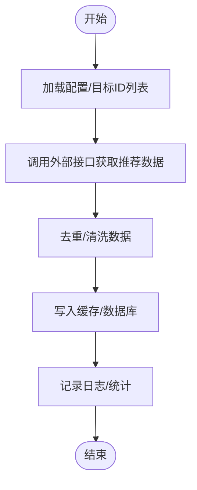

# 工具脚本

<cite>
**本文引用的文件**
- [Calc.php](file://php/shell/Calc.php)
- [Shell.php](file://php/shell/Shell.php)
- [ProductSkuController.php](file://php/shell/ProductSkuController.php)
- [SyncAiCategoryRecommand.php](file://php/shell/SyncAiCategoryRecommand.php)
- [TestController.php.backup](file://php/shell/TestController.php.backup)
- [requiredfile.php](file://php/requiredfile/requiredfile.php)
- [common.php](file://php/common.php)
- [RequestUtils.php](file://php/utils/RequestUtils.php)
- [DataUtils.php](file://php/utils/DataUtils.php)
- [ExcelUtils.php](file://php/utils/ExcelUtils.php)
- [Logger.php](file://php/class/Logger.php)
- [RedisService.php](file://php/redis/RedisService.php)
- [CurlService.php](file://php/curl/CurlService.php)
- [Calculation.php](file://vendor/phpoffice/phpspreadsheet/src/PhpSpreadsheet/Calculation/Calculation.php)
</cite>

## 目录
1. [简介](#简介)
2. [项目结构](#项目结构)
3. [核心组件](#核心组件)
4. [架构总览](#架构总览)
5. [详细组件分析](#详细组件分析)
6. [依赖关系分析](#依赖关系分析)
7. [性能考虑](#性能考虑)
8. [故障排查指南](#故障排查指南)
9. [结论](#结论)
10. [附录](#附录)

## 简介
本文件面向“工具脚本”模块，系统化梳理以下能力与用法：
- 计算引擎：基于 PHPExcel 的公式计算能力，支持复杂数学运算与函数调用。
- Shell 框架：统一的脚本执行框架，提供通用处理模式与扩展机制。
- 产品 SKU 控制器：批量导入、更新、同步 SKU 数据的能力。
- AI 分类推荐同步：从外部接口拉取并落库，实现分类推荐的自动化同步。
- 使用方法、参数配置、集成方式、调试技巧、性能优化与异常恢复策略。

## 项目结构
工具脚本主要位于 php/shell 目录，配合通用工具类（Excel、数据、请求、日志、Redis、CURL）以及第三方 PHPExcel 计算引擎。

**图表来源**
- [Calc.php](file://php/shell/Calc.php#L1-L200)
- [Shell.php](file://php/shell/Shell.php#L1-L200)
- [ProductSkuController.php](file://php/shell/ProductSkuController.php#L1-L300)
- [SyncAiCategoryRecommand.php](file://php/shell/SyncAiCategoryRecommand.php#L1-L200)
- [RequestUtils.php](file://php/utils/RequestUtils.php#L1-L400)
- [DataUtils.php](file://php/utils/DataUtils.php#L1-L200)
- [ExcelUtils.php](file://php/utils/ExcelUtils.php#L1-L200)
- [Logger.php](file://php/class/Logger.php#L1-L200)
- [RedisService.php](file://php/redis/RedisService.php#L1-L200)
- [CurlService.php](file://php/curl/CurlService.php#L1-L200)
- [Calculation.php](file://vendor/phpoffice/phpspreadsheet/src/PhpSpreadsheet/Calculation/Calculation.php#L1-L200)

**章节来源**
- [requiredfile.php](file://php/requiredfile/requiredfile.php#L1-L9)
- [common.php](file://php/common.php#L1-L9)

## 核心组件
- 计算引擎（Calc.php）
  - 基于 PHPExcel 的 Calculation 引擎，提供公式解析、函数调用、单元格引用与缓存等能力。
  - 支持复杂数学运算、统计函数、日期时间函数等，适合批量数据校验与计算。
- Shell 框架（Shell.php）
  - 统一的脚本入口与生命周期管理，提供日志、CURL、Redis、Excel 等服务的注入与初始化。
  - 扩展机制：通过继承或组合方式扩展新任务，遵循“约定优于配置”的模式。
- 产品 SKU 控制器（ProductSkuController.php）
  - 提供 SKU 导入、更新、同步、批量处理等能力，结合 ExcelUtils 读取模板，RequestUtils 调用后端接口。
  - 支持分页查询、批量写入、幂等处理与错误回滚。
- AI 分类推荐同步（SyncAiCategoryRecommand.php）
  - 从外部接口拉取 AI 推荐分类数据，写入本地缓存或数据库，支持增量更新与去重。
  - 结合 Redis 缓存提升查询性能，降低后端压力。

**章节来源**
- [Calc.php](file://php/shell/Calc.php#L1-L200)
- [Shell.php](file://php/shell/Shell.php#L1-L200)
- [ProductSkuController.php](file://php/shell/ProductSkuController.php#L1-L300)
- [SyncAiCategoryRecommand.php](file://php/shell/SyncAiCategoryRecommand.php#L1-L200)

## 架构总览
工具脚本整体采用“框架 + 业务控制器 + 工具库”的分层设计，通过统一的初始化入口加载第三方库与通用工具，再由具体控制器完成业务逻辑。

**图表来源**
- [Shell.php](file://php/shell/Shell.php#L1-L200)
- [Calc.php](file://php/shell/Calc.php#L1-L200)
- [ProductSkuController.php](file://php/shell/ProductSkuController.php#L1-L300)
- [SyncAiCategoryRecommand.php](file://php/shell/SyncAiCategoryRecommand.php#L1-L200)
- [RequestUtils.php](file://php/utils/RequestUtils.php#L1-L400)
- [DataUtils.php](file://php/utils/DataUtils.php#L1-L200)
- [ExcelUtils.php](file://php/utils/ExcelUtils.php#L1-L200)
- [Logger.php](file://php/class/Logger.php#L1-L200)
- [RedisService.php](file://php/redis/RedisService.php#L1-L200)
- [CurlService.php](file://php/curl/CurlService.php#L1-L200)
- [Calculation.php](file://vendor/phpoffice/phpspreadsheet/src/PhpSpreadsheet/Calculation/Calculation.php#L1-L200)

## 详细组件分析

### 计算引擎（Calc.php）
- 功能概述
  - 封装 PHPExcel 的 Calculation 引擎，提供公式解析、函数调用、单元格引用与缓存等能力。
  - 支持复杂数学运算、统计函数、日期时间函数等，适合批量数据校验与计算。
- 关键流程
  - 初始化工作簿与计算引擎
  - 设置单元格值与公式
  - 触发计算并获取结果
  - 错误处理与日志记录
- 使用场景
  - 批量计算 Excel 中的公式列
  - 校验数据一致性与边界条件
  - 生成报表前的数据预处理

**图表来源**
- [Calc.php](file://php/shell/Calc.php#L1-L200)
- [Calculation.php](file://vendor/phpoffice/phpspreadsheet/src/PhpSpreadsheet/Calculation/Calculation.php#L1-L200)

**章节来源**
- [Calc.php](file://php/shell/Calc.php#L1-L200)
- [Calculation.php](file://vendor/phpoffice/phpspreadsheet/src/PhpSpreadsheet/Calculation/Calculation.php#L1-L200)

### Shell 框架（Shell.php）
- 功能概述
  - 统一的脚本入口与生命周期管理，提供日志、CURL、Redis、Excel 等服务的注入与初始化。
  - 扩展机制：通过继承或组合方式扩展新任务，遵循“约定优于配置”的模式。
- 关键流程
  - 加载通用依赖（autoload、日志、Redis、Curl、Excel 工具）
  - 解析命令行参数与配置
  - 注入服务并执行控制器
  - 输出执行结果与统计信息
- 扩展方式
  - 定义新的控制器类，实现统一接口
  - 在 Shell 中注册与调度
  - 通过配置文件或命令行参数控制执行策略

**图表来源**
- [Shell.php](file://php/shell/Shell.php#L1-L200)
- [requiredfile.php](file://php/requiredfile/requiredfile.php#L1-L9)
- [Logger.php](file://php/class/Logger.php#L1-L200)
- [RedisService.php](file://php/redis/RedisService.php#L1-L200)
- [CurlService.php](file://php/curl/CurlService.php#L1-L200)
- [ExcelUtils.php](file://php/utils/ExcelUtils.php#L1-L200)

**章节来源**
- [Shell.php](file://php/shell/Shell.php#L1-L200)
- [requiredfile.php](file://php/requiredfile/requiredfile.php#L1-L9)

### 产品 SKU 控制器（ProductSkuController.php）
- 功能概述
  - 提供 SKU 导入、更新、同步、批量处理等能力，结合 ExcelUtils 读取模板，RequestUtils 调用后端接口。
  - 支持分页查询、批量写入、幂等处理与错误回滚。
- 关键流程
  - 读取 Excel 模板并解析数据
  - 调用后端接口进行创建/更新
  - 记录日志与统计信息
  - 失败时进行回滚或重试
- 批量操作能力
  - 分批处理（如每批 150 条），避免超时与内存压力
  - 幂等写入：先查后写，避免重复
  - 错误聚合：汇总失败项并输出报告

**图表来源**
- [ProductSkuController.php](file://php/shell/ProductSkuController.php#L1-L300)
- [ExcelUtils.php](file://php/utils/ExcelUtils.php#L1-L200)
- [RequestUtils.php](file://php/utils/RequestUtils.php#L280-L360)
- [DataUtils.php](file://php/utils/DataUtils.php#L1-L200)
- [Logger.php](file://php/class/Logger.php#L1-L200)

**章节来源**
- [ProductSkuController.php](file://php/shell/ProductSkuController.php#L1-L300)
- [RequestUtils.php](file://php/utils/RequestUtils.php#L280-L360)

### AI 分类推荐同步（SyncAiCategoryRecommand.php）
- 功能概述
  - 从外部接口拉取 AI 推荐分类数据，写入本地缓存或数据库，支持增量更新与去重。
  - 结合 Redis 缓存提升查询性能，降低后端压力。
- 关键流程
  - 读取配置与目标分类 ID 列表
  - 调用外部接口获取推荐数据
  - 去重与清洗后写入缓存/数据库
  - 记录同步日志与统计信息

**图表来源**
- [SyncAiCategoryRecommand.php](file://php/shell/SyncAiCategoryRecommand.php#L1-L200)
- [RedisService.php](file://php/redis/RedisService.php#L1-L200)
- [RequestUtils.php](file://php/utils/RequestUtils.php#L320-L360)
- [Logger.php](file://php/class/Logger.php#L1-L200)

**章节来源**
- [SyncAiCategoryRecommand.php](file://php/shell/SyncAiCategoryRecommand.php#L1-L200)

### 测试与示例（TestController.php.backup）
- 作用
  - 提供批量删除、查询、更新等测试用例，便于验证 SKU 控制器与后端接口的正确性。
- 典型场景
  - 批量删除指定 SKU
  - 分页查询并遍历处理
  - 模拟真实业务流程以验证健壮性

**章节来源**
- [TestController.php.backup](file://php/shell/TestController.php.backup#L6201-L6245)

## 依赖关系分析
- 组件耦合
  - 控制器对工具类具有高内聚低耦合特性，通过统一接口调用（如 RequestUtils、ExcelUtils）。
  - Shell 框架作为入口，集中管理依赖注入与生命周期。
- 外部依赖
  - PHPExcel 计算引擎用于公式计算。
  - Redis 用于缓存与去重。
  - CURL 用于对外接口调用。
- 潜在风险
  - Excel 文件格式与版本兼容性问题。
  - 接口限流与超时处理。
  - 大数据量下的内存与性能瓶颈。

**图表来源**
- [Shell.php](file://php/shell/Shell.php#L1-L200)
- [Logger.php](file://php/class/Logger.php#L1-L200)
- [CurlService.php](file://php/curl/CurlService.php#L1-L200)
- [RedisService.php](file://php/redis/RedisService.php#L1-L200)
- [Calc.php](file://php/shell/Calc.php#L1-L200)
- [Calculation.php](file://vendor/phpoffice/phpspreadsheet/src/PhpSpreadsheet/Calculation/Calculation.php#L1-L200)
- [ProductSkuController.php](file://php/shell/ProductSkuController.php#L1-L300)
- [RequestUtils.php](file://php/utils/RequestUtils.php#L1-L400)
- [DataUtils.php](file://php/utils/DataUtils.php#L1-L200)
- [ExcelUtils.php](file://php/utils/ExcelUtils.php#L1-L200)
- [SyncAiCategoryRecommand.php](file://php/shell/SyncAiCategoryRecommand.php#L1-L200)

**章节来源**
- [Shell.php](file://php/shell/Shell.php#L1-L200)
- [ProductSkuController.php](file://php/shell/ProductSkuController.php#L1-L300)
- [SyncAiCategoryRecommand.php](file://php/shell/SyncAiCategoryRecommand.php#L1-L200)

## 性能考虑
- 批处理与分页
  - 对大列表采用分块处理（如每批 150 条），减少内存占用与接口压力。
- 缓存策略
  - 使用 Redis 缓存分类路径、推荐数据等热点信息，降低重复查询成本。
- I/O 优化
  - Excel 读取采用流式或按需读取，避免一次性加载整表。
- 超时与重试
  - 为外部接口调用设置合理超时与指数退避重试策略。
- 日志与监控
  - 记录关键指标（耗时、成功率、失败原因），便于后续优化。

[本节为通用指导，无需列出具体文件来源]

## 故障排查指南
- 常见问题
  - Excel 文件格式不兼容：检查文件编码与版本，必要时转换为标准格式。
  - 接口限流/超时：增加重试次数与退避间隔，或调整并发度。
  - 内存不足：减小批处理大小，启用分页与增量处理。
- 调试技巧
  - 开启详细日志，定位失败步骤与错误码。
  - 使用最小样本数据复现问题，逐步扩大范围。
  - 对比缓存与数据库状态，确保幂等性。
- 异常恢复
  - 失败项单独记录并支持断点续跑。
  - 对可重试错误采用自动重试，对不可重试错误人工介入。

**章节来源**
- [Logger.php](file://php/class/Logger.php#L1-L200)
- [RequestUtils.php](file://php/utils/RequestUtils.php#L280-L360)
- [RedisService.php](file://php/redis/RedisService.php#L1-L200)

## 结论
本工具脚本体系以 Shell 框架为核心，结合 PHPExcel 计算引擎与通用工具库，实现了从数据读取、计算、接口调用到缓存与日志的完整链路。通过标准化的控制器与分批处理策略，能够稳定支撑 SKU 批量导入与 AI 分类推荐同步等高频任务；同时具备良好的扩展性与可维护性。

[本节为总结性内容，无需列出具体文件来源]

## 附录

### 使用方法与参数配置
- Shell 框架
  - 通过命令行传参启动脚本，Shell 自动加载依赖并调度控制器。
  - 可通过配置文件或环境变量控制执行策略（如批大小、并发度、日志级别）。
- 计算引擎
  - 准备 Excel 模板，定义公式列，调用计算引擎执行并获取结果。
- SKU 控制器
  - 准备 SKU 模板，分批读取并调用后端接口创建/更新。
- AI 分类推荐同步
  - 配置目标分类 ID 列表与外部接口地址，执行同步并写入缓存。

**章节来源**
- [Shell.php](file://php/shell/Shell.php#L1-L200)
- [Calc.php](file://php/shell/Calc.php#L1-L200)
- [ProductSkuController.php](file://php/shell/ProductSkuController.php#L1-L300)
- [SyncAiCategoryRecommand.php](file://php/shell/SyncAiCategoryRecommand.php#L1-L200)

### 集成方式
- 通过 Shell 框架统一入口集成新控制器，遵循既定接口规范。
- 与 CI/CD 流水线集成，定时执行批量任务。
- 与监控系统对接，采集日志与指标，实现告警与可视化。

**章节来源**
- [Shell.php](file://php/shell/Shell.php#L1-L200)
- [Logger.php](file://php/class/Logger.php#L1-L200)