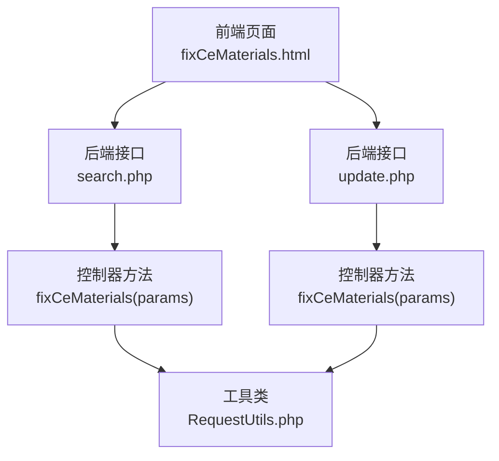
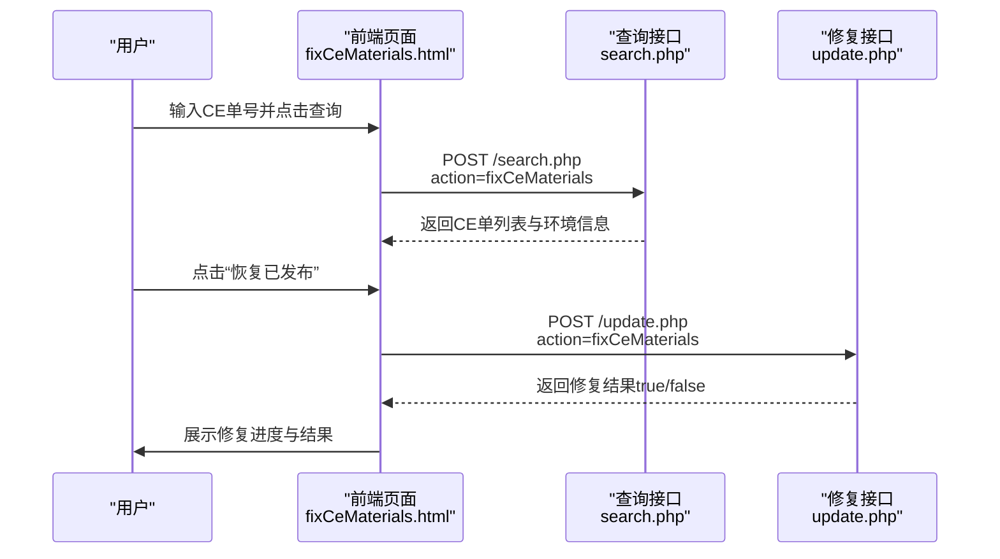
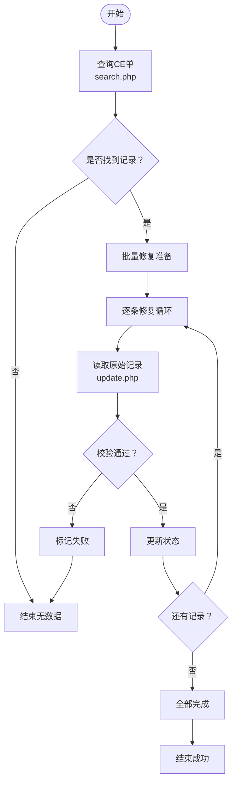
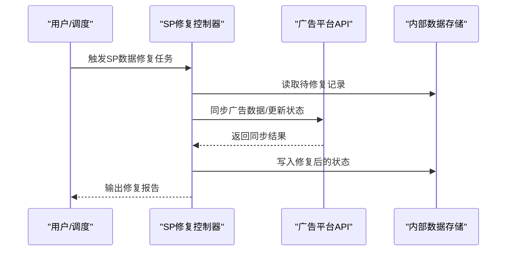
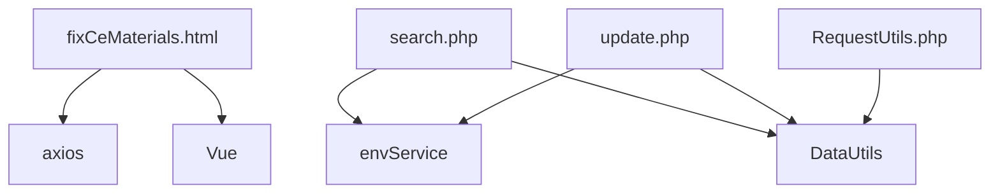

# 数据修复脚本

<cite>
**本文档引用的文件**
- [fixCeMaterials.html](file://template/fix/fixCeMaterials.html)
- [search.php](file://php/controller/search.php)
- [update.php](file://php/controller/update.php)
- [RequestUtils.php](file://php/utils/RequestUtils.php)
- [home.html](file://template/home.html)
</cite>

## 目录
1. [简介](#简介)
2. [项目结构](#项目结构)
3. [核心组件](#核心组件)
4. [架构总览](#架构总览)
5. [详细组件分析](#详细组件分析)
6. [依赖关系分析](#依赖关系分析)
7. [性能考虑](#性能考虑)
8. [故障排除指南](#故障排除指南)
9. [结论](#结论)
10. [附录](#附录)

## 简介
本文件面向业务与运维人员，系统化说明两类数据修复脚本的功能与使用方法：
- FixCeSkuMaterial：用于将CE材料数据的状态从“未发布”修复为“已发布”，支持按CE单号查询与批量修复。
- FixPaSkuMaterialSpDataController：用于修复SP（广告）数据，包括广告数据同步与状态修复。

文档涵盖触发条件、修复逻辑、批量处理能力、数据校验与回滚机制、验证方法及执行流程，并提供可视化图示帮助理解。

## 项目结构
该仓库采用前后端分离的Web界面与后端PHP控制器配合的模式：
- 前端页面位于 template/fix/，通过 axios 调用后端接口。
- 后端控制器位于 php/controller/，负责具体业务逻辑与数据交互。
- 工具类位于 php/utils/，提供通用的数据处理与请求封装能力。

图表来源
- [fixCeMaterials.html](file://template/fix/fixCeMaterials.html#L217-L344)
- [search.php](file://php/controller/search.php#L57-L77)
- [update.php](file://php/controller/update.php#L138-L165)
- [RequestUtils.php](file://php/utils/RequestUtils.php#L39-L80)

章节来源
- [fixCeMaterials.html](file://template/fix/fixCeMaterials.html#L1-L348)
- [search.php](file://php/controller/search.php#L50-L249)
- [update.php](file://php/controller/update.php#L130-L329)

## 核心组件
- 前端修复页面（CE材料）
  - 提供CE单号查询与“恢复已发布”批量修复功能。
  - 支持按环境切换（test/local/uat/prod），并在页面展示当前环境徽章。
- 后端查询接口（search.php）
  - 接收参数，调用网关服务查询CE材料数据，返回列表与当前环境。
- 后端修复接口（update.php）
  - 接收单条记录的_id与目标状态，拉取原始数据并更新状态。
- 工具类（RequestUtils.php）
  - 提供分页查询与批量拉取明细的能力，支撑大规模数据场景。

章节来源
- [fixCeMaterials.html](file://template/fix/fixCeMaterials.html#L93-L164)
- [search.php](file://php/controller/search.php#L57-L77)
- [update.php](file://php/controller/update.php#L138-L165)
- [RequestUtils.php](file://php/utils/RequestUtils.php#L39-L80)

## 架构总览
下图展示了CE材料修复的端到端调用链路与数据流：

图表来源
- [fixCeMaterials.html](file://template/fix/fixCeMaterials.html#L259-L343)
- [search.php](file://php/controller/search.php#L57-L77)
- [update.php](file://php/controller/update.php#L138-L165)

## 详细组件分析

### 组件A：CE材料修复（FixCeSkuMaterial）
- 功能概述
  - 将CE材料状态从非“已发布”修复为“已发布”，支持单条与批量修复。
- 触发条件
  - 用户在前端页面输入CE单号进行查询；或选择多条记录进行批量修复。
- 执行流程
  - 查询阶段：前端调用 search.php 的 fixCeMaterials 方法，按CE单号查询并返回列表。
  - 修复阶段：前端遍历选中记录，逐条调用 update.php 的 fixCeMaterials 方法，将状态更新为目标值。
- 数据校验
  - 后端在修复时会先拉取原始记录，检查状态字段是否存在且有效，再进行更新。
- 回滚机制
  - 当前实现未提供自动回滚；如需回滚，建议在修复前备份目标记录或在业务侧记录变更日志。
- 性能特性
  - 前端逐条修复，避免一次性大事务；后端对单条记录进行读取与更新，适合小规模修复。

图表来源
- [search.php](file://php/controller/search.php#L57-L77)
- [update.php](file://php/controller/update.php#L138-L165)
- [fixCeMaterials.html](file://template/fix/fixCeMaterials.html#L296-L343)

章节来源
- [fixCeMaterials.html](file://template/fix/fixCeMaterials.html#L93-L164)
- [search.php](file://php/controller/search.php#L57-L77)
- [update.php](file://php/controller/update.php#L138-L165)

### 组件B：SP数据修复（FixPaSkuMaterialSpDataController）
- 功能概述
  - 修复SP（广告）数据，包括广告数据同步与状态修复，确保广告组、关键词、否定词等处于正确状态。
- 触发条件
  - 广告数据异常、状态不一致或需要批量同步时触发。
- 执行流程
  - 通过SP相关控制器（如 SpPausedAdGroupController、SpEnabledKeywordController 等）进行状态修复与数据同步。
  - 可结合 SP 同步控制器（SpSyncPomsController）进行跨系统数据一致性修复。
- 数据校验
  - 修复前先拉取目标记录，核对状态与关键字段，避免误操作。
- 回滚机制
  - 建议在修复前记录原始状态与关键字段，必要时可按记录维度回滚。
- 性能特性
  - 支持分批处理与分页拉取，降低单次请求压力。

图表来源
- [SpPausedAdGroupController.php](file://php/shell/sp/adgroup/SpPausedAdGroupController.php)
- [SpEnabledKeywordController.php](file://php/shell/sp/keyword/SpEnabledKeywordController.php)
- [SpSyncPomsController.php](file://php/shell/sp/common/SpSyncPomsController.php)

章节来源
- [SpPausedAdGroupController.php](file://php/shell/sp/adgroup/SpPausedAdGroupController.php)
- [SpEnabledKeywordController.php](file://php/shell/sp/keyword/SpEnabledKeywordController.php)
- [SpSyncPomsController.php](file://php/shell/sp/common/SpSyncPomsController.php)

## 依赖关系分析
- 前端依赖
  - axios：发起HTTP请求至后端接口。
  - Vue：管理页面状态与交互。
- 后端依赖
  - 环境服务（envService）：根据当前环境选择不同的网关与模块。
  - DataUtils：统一的结果解析与分页处理。
  - RedisService：用于缓存与配置读取（在其他修复脚本中使用）。
- 工具类
  - RequestUtils：提供分页查询与批量明细拉取能力，支持大数据量场景。

图表来源
- [fixCeMaterials.html](file://template/fix/fixCeMaterials.html#L186-L214)
- [search.php](file://php/controller/search.php#L57-L77)
- [update.php](file://php/controller/update.php#L138-L165)
- [RequestUtils.php](file://php/utils/RequestUtils.php#L39-L80)

章节来源
- [fixCeMaterials.html](file://template/fix/fixCeMaterials.html#L186-L214)
- [search.php](file://php/controller/search.php#L57-L77)
- [update.php](file://php/controller/update.php#L138-L165)
- [RequestUtils.php](file://php/utils/RequestUtils.php#L39-L80)

## 性能考虑
- 分页与批量
  - RequestUtils 提供分页与分块拉取能力，避免一次性加载过多数据导致内存压力。
- 单条修复
  - CE修复采用逐条修复策略，降低并发风险与单次事务时间。
- 网络与超时
  - 建议在前端增加超时控制与重试机制，避免长时间阻塞。
- 日志与监控
  - 在修复过程中输出关键步骤日志，便于问题定位与审计。

## 故障排除指南
- 查询无结果
  - 检查CE单号是否正确；确认当前环境是否匹配目标数据所在环境。
- 修复失败
  - 检查后端返回状态与错误日志；确认目标记录是否存在且可更新。
- 网络异常
  - 前端捕获异常并提示；检查网络连通性与代理设置。
- 大数据量修复
  - 使用分页与分块策略；避免一次性提交过多请求。

章节来源
- [fixCeMaterials.html](file://template/fix/fixCeMaterials.html#L296-L343)
- [search.php](file://php/controller/search.php#L57-L77)
- [update.php](file://php/controller/update.php#L138-L165)

## 结论
- CE材料修复脚本提供了简单可靠的“已发布”状态修复能力，适合小规模与突发性修复场景。
- SP数据修复脚本覆盖广告组、关键词、否定词等多维度，建议结合同步控制器进行系统性修复。
- 建议在修复前做好数据备份与变更记录，确保可追溯与可回滚。

## 附录

### 使用方法与参数配置
- CE材料修复
  - 步骤
    1) 在前端页面输入CE单号并点击“查询CE单”。
    2) 查看查询结果，勾选需要修复的记录。
    3) 点击“恢复已发布”，系统将逐条修复并展示进度。
  - 参数
    - 查询：title（CE单号）
    - 修复：_id（记录主键）、status（目标状态）
- SP数据修复
  - 步骤
    1) 选择对应SP修复控制器（如广告组、关键词、否定词等）。
    2) 按照页面提示或命令行参数执行修复任务。
    3) 查看修复结果与日志。

章节来源
- [fixCeMaterials.html](file://template/fix/fixCeMaterials.html#L93-L164)
- [search.php](file://php/controller/search.php#L57-L77)
- [update.php](file://php/controller/update.php#L138-L165)
- [home.html](file://template/home.html#L619)