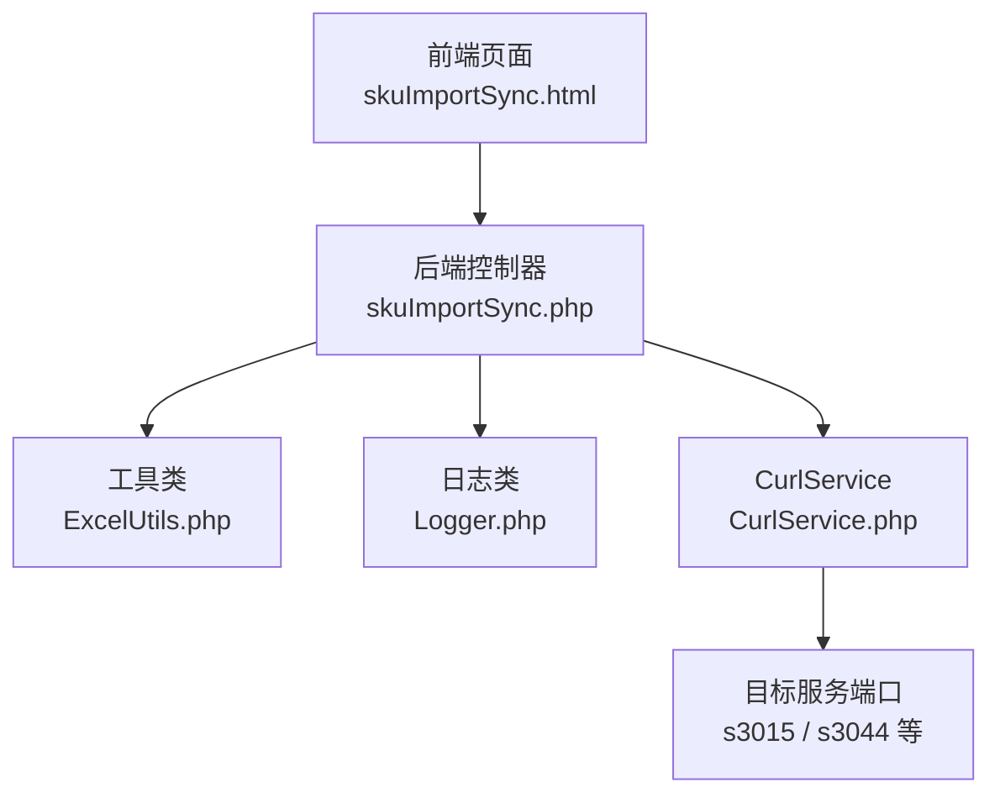
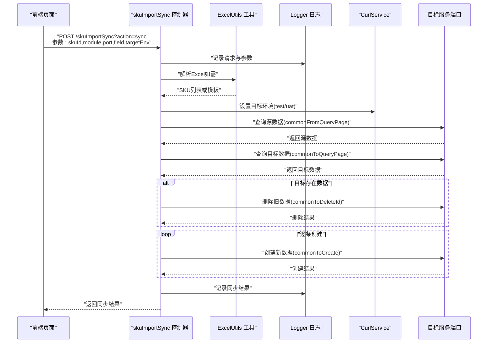
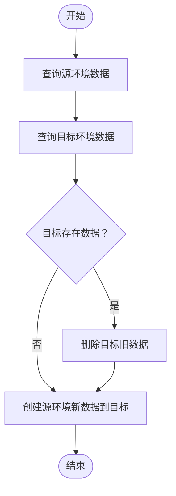
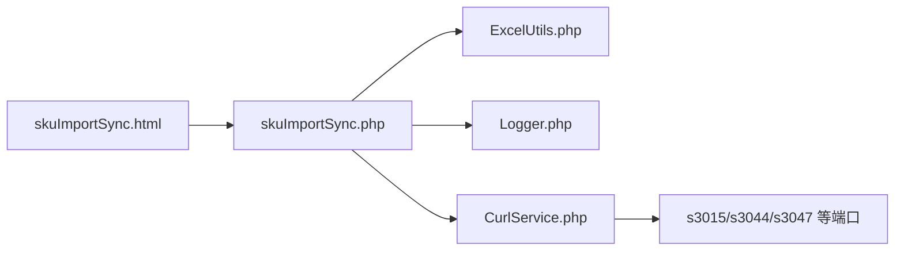

# 数据同步脚本

<cite>
**本文档引用的文件**
- [php/controller/skuImportSync.php](file://php/controller/skuImportSync.php)
- [php/curl/CurlService.php](file://php/curl/CurlService.php)
- [php/utils/ExcelUtils.php](file://php/utils/ExcelUtils.php)
- [php/class/Logger.php](file://php/class/Logger.php)
- [template/fix/skuImportSync.html](file://template/fix/skuImportSync.html)
</cite>

## 目录
1. [简介](#简介)
2. [项目结构](#项目结构)
3. [核心组件](#核心组件)
4. [架构总览](#架构总览)
5. [详细组件分析](#详细组件分析)
6. [依赖关系分析](#依赖关系分析)
7. [性能考虑](#性能考虑)
8. [故障排查指南](#故障排查指南)
9. [结论](#结论)
10. [附录](#附录)

## 简介
本文件面向数据同步脚本的使用者与维护者，系统性阐述跨环境数据同步机制、增量更新策略与批量处理逻辑。重点围绕以下目标展开：
- 解释 SyncProductSku 类的核心功能与职责边界
- 说明 Sync3015 与 Sync3044 两种同步模式的差异与适用场景
- 细化从源环境查询、对比目标环境、执行删除与创建的完整流程
- 提供使用示例、参数配置说明（SKU 列表输入格式、环境切换机制）
- 介绍错误处理与日志记录机制

## 项目结构
该同步脚本由前端页面、后端控制器、工具类与日志组件构成，形成“前端触发 → 控制器解析 → 工具读取 → CurlService 调用 → 目标环境写入”的闭环。

图表来源
- [template/fix/skuImportSync.html](file://template/fix/skuImportSync.html#L484-L508)
- [php/controller/skuImportSync.php](file://php/controller/skuImportSync.php#L1-L512)
- [php/utils/ExcelUtils.php](file://php/utils/ExcelUtils.php#L1-L398)
- [php/class/Logger.php](file://php/class/Logger.php#L1-L55)
- [php/curl/CurlService.php](file://php/curl/CurlService.php#L1-L800)

章节来源
- [php/controller/skuImportSync.php](file://php/controller/skuImportSync.php#L1-L512)
- [template/fix/skuImportSync.html](file://template/fix/skuImportSync.html#L484-L508)

## 核心组件
- 后端控制器 skuImportSync：负责接收请求、解析 Excel、构造同步参数、调用同步流程、记录日志与返回结果。
- 工具类 ExcelUtils：封装 Excel 读取与模板生成，支持 xlsx/xls。
- CurlService：封装 HTTP 请求，按环境（test/uat/pro/local）映射不同端口，支持 s3015、s3044、s3047 等端口。
- 日志类 Logger：统一写入本地日志文件并输出到错误日志。

章节来源
- [php/controller/skuImportSync.php](file://php/controller/skuImportSync.php#L12-L472)
- [php/utils/ExcelUtils.php](file://php/utils/ExcelUtils.php#L20-L398)
- [php/curl/CurlService.php](file://php/curl/CurlService.php#L4-L800)
- [php/class/Logger.php](file://php/class/Logger.php#L14-L55)

## 架构总览
下图展示一次完整的 SKU 同步调用链路，从前端发起请求到目标服务端口的交互。

图表来源
- [php/controller/skuImportSync.php](file://php/controller/skuImportSync.php#L278-L426)
- [php/curl/CurlService.php](file://php/curl/CurlService.php#L98-L143)
- [php/utils/ExcelUtils.php](file://php/utils/ExcelUtils.php#L147-L181)

## 详细组件分析

### 后端控制器 skuImportSync
- 职责
  - 接收并校验请求参数（action、skuId、module、port、field、targetEnv）
  - 解析 Excel 文件，提取 SKU 列表
  - 根据目标环境设置 CurlService 的环境与端口
  - 调用通用查询/删除/创建方法，执行同步
  - 记录详细日志并返回结构化结果
- 关键流程
  - 环境切换：通过反射设置 toCurlService 的环境（test 或 uat）
  - 查询源数据：commonFromQueryPage(module, port, condition)
  - 查询目标数据：commonToQueryPage(module, port, condition)
  - 删除旧数据：遍历目标数据，逐条 commonToDeleteId
  - 创建新数据：遍历源数据，逐条 commonToCreate
- 错误处理
  - 参数缺失、文件校验失败、HTTP 请求异常均捕获并返回友好提示
  - 删除失败仅记录错误，不影响后续创建；创建失败抛出异常并终止流程

章节来源
- [php/controller/skuImportSync.php](file://php/controller/skuImportSync.php#L40-L426)

### 工具类 ExcelUtils
- 职责
  - 读取 Excel（xlsx/xls），提取首行作为表头，从第二行起逐行读取数据
  - 生成模板文件，包含示例数据与说明
- 使用注意
  - 第一列应为 SKU ID
  - 支持去重与空值过滤

章节来源
- [php/utils/ExcelUtils.php](file://php/utils/ExcelUtils.php#L147-L181)
- [php/utils/ExcelUtils.php](file://php/utils/ExcelUtils.php#L116-L158)

### CurlService（环境与端口映射）
- 环境映射
  - test：使用测试环境端口集合
  - uat：使用 UAT 环境端口集合
  - pro：生产环境端口集合
  - local：本机环境端口集合
- 端口能力
  - s3015：商品与 SKU 相关模块
  - s3044：listing 相关模块（与 s3015 的差异见下节）
  - s3047：大数据相关模块
  - 其他：phpali、phphk、ux168、s3009、s3023、s3013、s3010、s3016、gateway、aiCategoryApi
- 请求方法
  - get/post/put/delete/upload/getWayGet/getWayPost/getWayFormDataPost
  - 统一封装 HTTP 请求，自动拼接 URL 与头部

章节来源
- [php/curl/CurlService.php](file://php/curl/CurlService.php#L98-L143)
- [php/curl/CurlService.php](file://php/curl/CurlService.php#L149-L262)
- [php/curl/CurlService.php](file://php/curl/CurlService.php#L664-L740)

### 日志类 Logger
- 职责
  - 将日志写入按日期命名的日志文件，并同时输出到 PHP 错误日志
- 使用方式
  - 控制器在关键节点调用 log 方法记录请求、参数、查询、删除、创建等步骤

章节来源
- [php/class/Logger.php](file://php/class/Logger.php#L22-L37)

### SyncProductSku 类与同步模式
- SyncProductSku 类定位
  - 该类用于封装“从源环境查询数据 → 对比目标环境 → 删除旧数据 → 创建新数据”的通用流程
  - 通过通用查询/删除/创建方法（commonFromQueryPage/commonToQueryPage/commonToDeleteId/commonToCreate）实现跨模块、跨端口的同步
- Sync3015 与 Sync3044 的区别与适用场景
  - s3015：适用于商品与 SKU 相关的基础数据同步（如 pa_sku_infos、sku_prices、sgu_sku_scu_channel_maps 等）
  - s3044：适用于 listing 相关的数据同步（如 listing 管理、广告相关数据）
  - 选择依据：根据业务模块（module）与字段（field）决定使用哪个端口
- 增量更新策略
  - 以 SKU 为维度进行同步，先删除目标环境同条件下的旧数据，再创建源环境的新数据
  - 该策略保证目标环境最终状态与源环境一致，适合“全量覆盖型”增量更新
- 批量处理逻辑
  - 前端页面支持批量 SKU 与模块组合，逐项调用后端同步接口
  - 后端逐条执行删除与创建，便于监控与回滚

章节来源
- [template/fix/skuImportSync.html](file://template/fix/skuImportSync.html#L484-L508)
- [php/controller/skuImportSync.php](file://php/controller/skuImportSync.php#L278-L426)

### 数据同步流程详解
- 步骤一：源环境查询
  - 使用 commonFromQueryPage(module, port, condition) 从源环境（固定为 pro）查询匹配条件的数据
- 步骤二：目标环境查询
  - 使用 commonToQueryPage(module, port, condition) 查询目标环境（test/uat）是否存在相同数据
- 步骤三：删除旧数据
  - 若目标存在数据，则逐条调用 commonToDeleteId(module, port, _id) 删除
- 步骤四：创建新数据
  - 遍历源数据，逐条调用 commonToCreate(module, port, data) 创建
- 步骤五：记录与返回
  - 记录各阶段日志，返回成功/失败信息与统计

图表来源
- [php/controller/skuImportSync.php](file://php/controller/skuImportSync.php#L335-L386)

## 依赖关系分析
- 前端依赖
  - 页面定义了多个模块与端口的组合（如 sgu_sku_scu_channel_maps/s3015、sku_prices/s3015 等），用于批量同步
- 后端依赖
  - 控制器依赖 ExcelUtils（解析 Excel）、Logger（记录日志）、CurlService（HTTP 调用）
- CurlService 依赖
  - 按环境映射不同端口，统一处理请求头与超时重试

图表来源
- [template/fix/skuImportSync.html](file://template/fix/skuImportSync.html#L484-L508)
- [php/controller/skuImportSync.php](file://php/controller/skuImportSync.php#L1-L512)
- [php/curl/CurlService.php](file://php/curl/CurlService.php#L1-L800)

章节来源
- [template/fix/skuImportSync.html](file://template/fix/skuImportSync.html#L484-L508)
- [php/controller/skuImportSync.php](file://php/controller/skuImportSync.php#L1-L512)
- [php/curl/CurlService.php](file://php/curl/CurlService.php#L1-L800)

## 性能考虑
- 批量同步建议
  - 前端按模块与 SKU 组合逐项同步，避免一次性提交过多请求导致超时
- 网络与重试
  - CurlService 内部具备超时与重试控制，建议在高并发场景下适当降低并发度
- 日志开销
  - 每步操作均写入日志，建议在大批量同步时关注磁盘 IO 与日志文件大小

## 故障排查指南
- 常见问题与定位
  - 参数缺失：检查请求参数（skuId/module/port/field/targetEnv）是否齐全
  - 文件解析失败：确认上传文件格式为 xlsx/xls，大小不超过限制，目录可写
  - 目标环境错误：targetEnv 仅支持 test/uat
  - HTTP 请求异常：查看 CurlService 返回的 httpCode 与 body，结合日志定位
  - 删除失败：不影响创建流程，但会记录错误日志
  - 创建失败：抛出异常并终止当前 SKU 的同步
- 日志位置
  - 控制器日志：php/log/sku_import_sync_YYYYMMDD.log
  - Curl 请求日志：php/log/curl/request_YYYYMMDD.log
- 建议排查步骤
  - 检查前端传参与模块/端口组合
  - 查看后端日志中“开始同步/查询/删除/创建”节点
  - 使用 CurlService 的 get/post/put/delete 方法单独验证目标端口连通性

章节来源
- [php/controller/skuImportSync.php](file://php/controller/skuImportSync.php#L164-L271)
- [php/controller/skuImportSync.php](file://php/controller/skuImportSync.php#L294-L301)
- [php/class/Logger.php](file://php/class/Logger.php#L22-L37)

## 结论
本数据同步脚本通过“前端批量触发 + 后端逐项同步 + CurlService 环境化调用”的架构，实现了跨环境（test/uat）的增量覆盖式同步。Sync3015 与 Sync3044 分别面向基础商品数据与 listing 数据，可根据业务模块灵活选择。配合完善的日志与错误处理机制，可在保证一致性的同时提升可观测性与可维护性。

## 附录

### 使用示例与参数说明
- 前端页面
  - 支持批量输入 SKU，页面内置多个模块与端口组合，逐项同步到目标环境（test/uat）
- 后端接口
  - 请求方式：POST
  - 必填参数：action=sync、skuId、module、port、field、targetEnv（test/uat）
  - 可选参数：excelFile（用于解析 Excel，获取 SKU 列表）
- SKU 列表输入格式
  - Excel 第一列必须为 SKU ID，支持去重与空值过滤
- 环境切换机制
  - 通过 targetEnv 指定 test 或 uat，控制器内部通过反射设置 CurlService 的环境

章节来源
- [template/fix/skuImportSync.html](file://template/fix/skuImportSync.html#L484-L508)
- [php/controller/skuImportSync.php](file://php/controller/skuImportSync.php#L40-L426)
- [php/utils/ExcelUtils.php](file://php/utils/ExcelUtils.php#L238-L247)