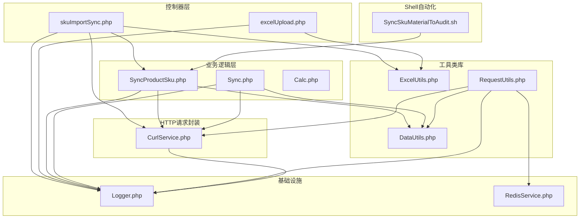
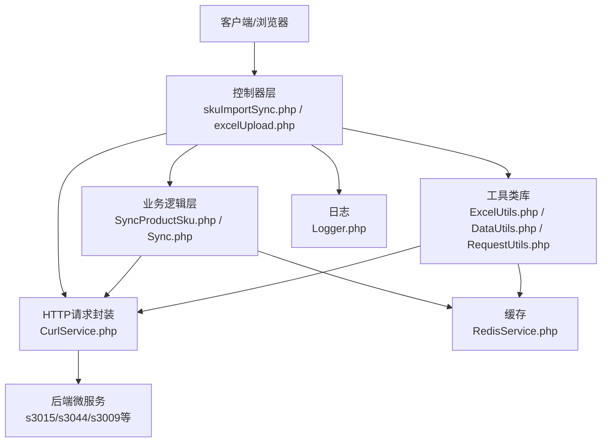
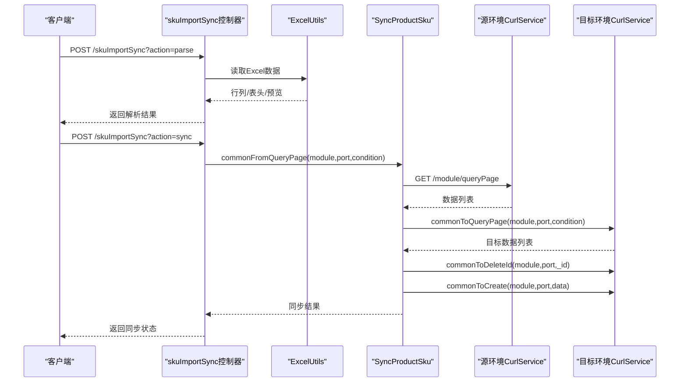
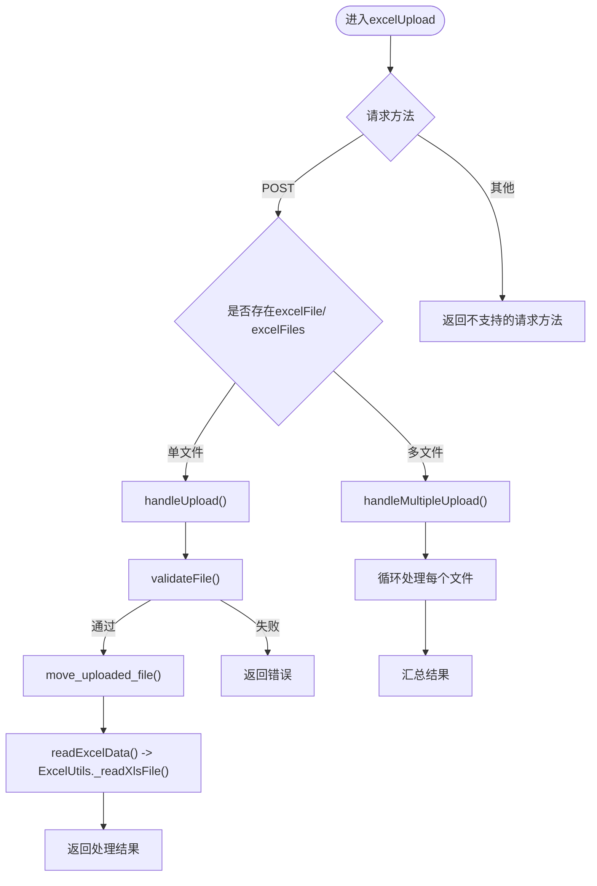
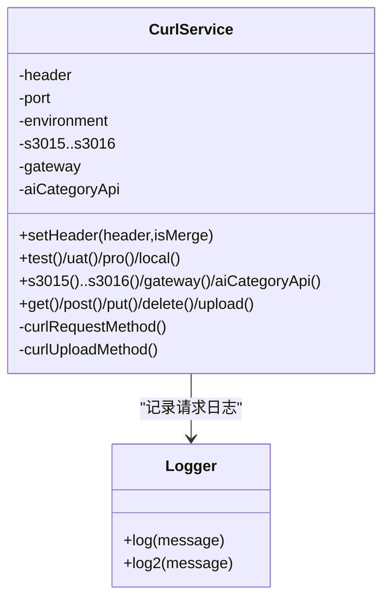
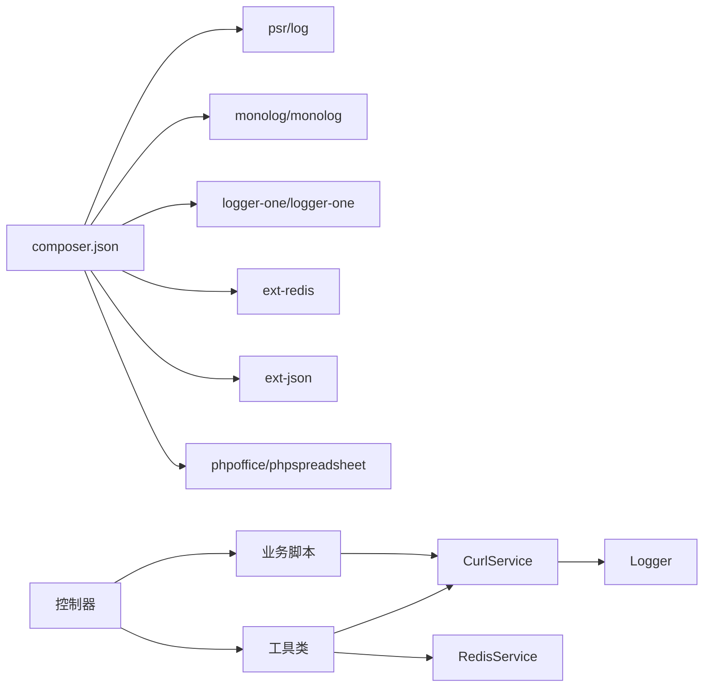

# 后端服务架构

<cite>
**本文档引用的文件**
- [skuImportSync.php](file://php/controller/skuImportSync.php)
- [excelUpload.php](file://php/controller/excelUpload.php)
- [ExcelUtils.php](file://php/utils/ExcelUtils.php)
- [DataUtils.php](file://php/utils/DataUtils.php)
- [RequestUtils.php](file://php/utils/RequestUtils.php)
- [CurlService.php](file://php/curl/CurlService.php)
- [SyncProductSku.php](file://php/shell/SyncProductSku.php)
- [Logger.php](file://php/class/Logger.php)
- [RedisService.php](file://php/redis/RedisService.php)
- [composer.json](file://composer.json)
- [SyncSkuMaterialToAudit.sh](file://php/shell/SyncSkuMaterialToAudit.sh)
- [Sync.php](file://php/shell/Sync.php)
- [Calc.php](file://php/shell/Calc.php)
</cite>

## 目录
1. [简介](#简介)
2. [项目结构](#项目结构)
3. [核心组件](#核心组件)
4. [架构总览](#架构总览)
5. [详细组件分析](#详细组件分析)
6. [依赖关系分析](#依赖关系分析)
7. [性能考虑](#性能考虑)
8. [故障排查指南](#故障排查指南)
9. [结论](#结论)

## 简介
本项目采用基于PHP的MVC架构实现，围绕控制器层、业务逻辑层与工具类库展开，提供SKU数据导入与同步、Excel文件上传与解析、跨服务HTTP请求封装、日志与缓存管理、Shell脚本自动化与批处理等功能。系统通过统一的CurlService对接多套后端微服务，利用DataUtils与ExcelUtils进行数据格式化与读写，借助RedisService实现缓存加速，通过Logger进行统一日志记录。

## 项目结构
- 控制器层：位于php/controller，负责接收HTTP请求、参数校验与调度，典型控制器包括SKU同步控制器与Excel上传控制器。
- 业务逻辑层：位于php/shell，封装具体业务流程，如跨环境SKU数据同步脚本。
- 工具类库：位于php/utils，提供Excel读写、数据格式化、请求封装、阿里云日志查询等工具。
- HTTP请求封装：位于php/curl，提供多环境、多端口的HTTP客户端封装。
- 缓存与日志：php/redis与php/class分别提供Redis缓存与日志记录能力。
- Shell自动化：位于php/shell，提供定时任务与批处理脚本入口。
- 依赖管理：composer.json声明第三方库与扩展依赖。

**图表来源**
- [skuImportSync.php](file://php/controller/skuImportSync.php#L1-L512)
- [excelUpload.php](file://php/controller/excelUpload.php#L1-L372)
- [SyncProductSku.php](file://php/shell/SyncProductSku.php#L1-L213)
- [ExcelUtils.php](file://php/utils/ExcelUtils.php#L1-L398)
- [DataUtils.php](file://php/utils/DataUtils.php#L1-L802)
- [RequestUtils.php](file://php/utils/RequestUtils.php#L1-L672)
- [CurlService.php](file://php/curl/CurlService.php#L1-L996)
- [Logger.php](file://php/class/Logger.php#L1-L55)
- [RedisService.php](file://php/redis/RedisService.php#L1-L77)
- [SyncSkuMaterialToAudit.sh](file://php/shell/SyncSkuMaterialToAudit.sh#L1-L2)

**章节来源**
- [composer.json](file://composer.json#L1-L11)

## 核心组件
- 控制器层
  - SKU导入与同步控制器：处理Excel模板下载、文件解析、SKU同步到不同环境（test/uat）。
  - Excel上传控制器：支持单文件/多文件上传、数据读取与预览、文件列表管理。
- 业务逻辑层
  - SKU跨环境同步脚本：封装从PRO源环境查询、目标环境清理与创建的完整流程。
  - 同步工具：提供配置项与规则的跨环境同步。
  - 计算工具：提供薪资计算与进度统计等辅助功能。
- 工具类库
  - Excel工具：支持xlsx/xls/csv读取、长数字处理、单元格值规范化。
  - 数据工具：统一响应结构解析、分页列表提取、数组去重与字段抽取。
  - 请求工具：封装多模块接口调用、用户与分类缓存、阿里云日志查询等。
- HTTP请求封装
  - CurlService：多环境（local/test/uat/pro）、多端口路由、请求头与鉴权、重试与超时控制。
- 基础设施
  - 日志：统一日志文件与error_log输出。
  - Redis：哈希与字符串缓存、过期控制、批量操作。

**章节来源**
- [skuImportSync.php](file://php/controller/skuImportSync.php#L1-L512)
- [excelUpload.php](file://php/controller/excelUpload.php#L1-L372)
- [SyncProductSku.php](file://php/shell/SyncProductSku.php#L1-L213)
- [ExcelUtils.php](file://php/utils/ExcelUtils.php#L1-L398)
- [DataUtils.php](file://php/utils/DataUtils.php#L1-L802)
- [RequestUtils.php](file://php/utils/RequestUtils.php#L1-L672)
- [CurlService.php](file://php/curl/CurlService.php#L1-L996)
- [Logger.php](file://php/class/Logger.php#L1-L55)
- [RedisService.php](file://php/redis/RedisService.php#L1-L77)

## 架构总览
系统采用分层架构：
- 表现层：控制器接收HTTP请求，调用工具类与业务脚本。
- 业务层：封装跨环境数据同步、配置迁移、日志查询等业务流程。
- 基础设施层：日志、缓存、HTTP请求封装与第三方库依赖。

**图表来源**
- [skuImportSync.php](file://php/controller/skuImportSync.php#L1-L512)
- [excelUpload.php](file://php/controller/excelUpload.php#L1-L372)
- [SyncProductSku.php](file://php/shell/SyncProductSku.php#L1-L213)
- [ExcelUtils.php](file://php/utils/ExcelUtils.php#L1-L398)
- [DataUtils.php](file://php/utils/DataUtils.php#L1-L802)
- [RequestUtils.php](file://php/utils/RequestUtils.php#L1-L672)
- [CurlService.php](file://php/curl/CurlService.php#L1-L996)
- [Logger.php](file://php/class/Logger.php#L1-L55)
- [RedisService.php](file://php/redis/RedisService.php#L1-L77)

## 详细组件分析

### SKU导入与同步控制器
- 职责
  - 模板下载：生成并提供SKU导入模板，包含示例数据与说明。
  - Excel解析：校验文件类型与大小，读取首张工作表，提取SKU列表并去重。
  - 跨环境同步：根据目标环境（test/uat）选择CurlService实例，从PRO源环境查询数据，清理目标环境旧数据后批量创建。
- 关键流程
  - 解析Excel文件：调用ExcelUtils读取数据，返回行列数、表头与预览。
  - 同步流程：commonFromQueryPage -> commonToQueryPage -> commonToDeleteId -> commonToCreate。
  - 错误处理：捕获异常并记录日志，返回统一结构。

**图表来源**
- [skuImportSync.php](file://php/controller/skuImportSync.php#L1-L512)
- [SyncProductSku.php](file://php/shell/SyncProductSku.php#L1-L213)
- [ExcelUtils.php](file://php/utils/ExcelUtils.php#L1-L398)
- [CurlService.php](file://php/curl/CurlService.php#L1-L996)

**章节来源**
- [skuImportSync.php](file://php/controller/skuImportSync.php#L1-L512)
- [SyncProductSku.php](file://php/shell/SyncProductSku.php#L1-L213)

### Excel上传控制器
- 职责
  - 文件上传校验：扩展名、大小、上传错误检查。
  - 数据读取：调用ExcelUtils读取Excel首张工作表，支持是否包含表头、预览行数配置。
  - 批量处理：支持多文件上传，汇总处理结果与统计。
  - 文件管理：列出上传目录文件、删除指定文件。
- 关键流程
  - 单文件：handleUpload -> validateFile -> move_uploaded_file -> readExcelData。
  - 多文件：handleMultipleUpload -> 循环处理每个文件 -> 汇总结果。

**图表来源**
- [excelUpload.php](file://php/controller/excelUpload.php#L1-L372)
- [ExcelUtils.php](file://php/utils/ExcelUtils.php#L1-L398)

**章节来源**
- [excelUpload.php](file://php/controller/excelUpload.php#L1-L372)

### 工具类库设计与实现

#### ExcelUtils
- 功能
  - 导出：支持xlsx与xls导出，动态写入表头与数据。
  - 读取：支持xlsx/xls/csv读取，长数字处理与单元格值规范化。
  - 数据结构：返回按工作表分组的二维数组，便于后续处理。
- 性能特性
  - 使用PhpSpreadsheet替代PHPExcel，具备更好的内存管理与兼容性。

**章节来源**
- [ExcelUtils.php](file://php/utils/ExcelUtils.php#L1-L398)

#### DataUtils
- 功能
  - 统一响应解析：getPageList/getQueryList/getPageDocList等，适配不同后端返回结构。
  - 数组处理：findIndexInArray/findIndexDataInArray、去重与字段抽取。
  - 辅助方法：getCreateReturnId、explainArgv、日志解析与精炼。
- 使用场景
  - 控制器与业务脚本中统一解析CurlService返回，减少重复代码。

**章节来源**
- [DataUtils.php](file://php/utils/DataUtils.php#L1-L802)

#### RequestUtils
- 功能
  - 业务接口封装：pa_product/pa_product_detail等表的CRUD与批量查询。
  - 缓存集成：用户信息、分类路径等通过RedisService缓存，降低后端压力。
  - 外部系统集成：阿里云日志查询接口调用示例。
- 设计要点
  - 通过CurlService按模块与端口路由，统一请求头与鉴权。
  - 使用DataUtils解析响应，保证上层调用一致性。

**章节来源**
- [RequestUtils.php](file://php/utils/RequestUtils.php#L1-L672)

### Shell脚本系统与批处理
- 自动化入口
  - SyncSkuMaterialToAudit.sh：调用PHP脚本执行SKU物料审计同步。
- 批处理能力
  - Sync.php：提供配置项与规则的跨环境同步，按批处理方式调用后端接口。
  - Calc.php：演示基础计算与Redis自增等辅助功能。
- 执行策略
  - 通过cron或手动触发，结合日志与缓存，实现稳定可靠的批处理。

**章节来源**
- [SyncSkuMaterialToAudit.sh](file://php/shell/SyncSkuMaterialToAudit.sh#L1-L2)
- [Sync.php](file://php/shell/Sync.php#L1-L80)
- [Calc.php](file://php/shell/Calc.php#L1-L82)

### CurlService HTTP请求封装与外部API集成
- 多环境与端口
  - 支持local/test/uat/pro四环境，映射到不同端口与域名。
  - 端口覆盖：s3015/s3047/s3044/s3009/s3023/s3013/phphk/phpali/ux168/s3010/s3016/gateway/aiCategoryApi。
- 请求方法
  - 支持GET/POST/PUT/DELETE/UPLOAD，统一设置Header、Referer、User-Agent。
- 错误处理与重试
  - 统一解析HTTP状态码，非2xx且非特定忽略码时抛出异常，支持重试与超时控制。
- 鉴权
  - gateway端口支持Authorization头注入，支持UC Token覆盖。

**图表来源**
- [CurlService.php](file://php/curl/CurlService.php#L1-L996)
- [Logger.php](file://php/class/Logger.php#L1-L55)

**章节来源**
- [CurlService.php](file://php/curl/CurlService.php#L1-L996)

## 依赖关系分析
- Composer依赖
  - psr/log、monolog/monolog、logger-one/logger-one：日志标准化与增强。
  - ext-redis、ext-json：Redis与JSON处理扩展。
  - phpoffice/phpspreadsheet：Excel读写与数据处理。
- 组件耦合
  - 控制器依赖工具类与业务脚本，业务脚本依赖CurlService与DataUtils，CurlService依赖日志组件。
  - RequestUtils与RedisService耦合，提升用户与分类等数据访问效率。

**图表来源**
- [composer.json](file://composer.json#L1-L11)

**章节来源**
- [composer.json](file://composer.json#L1-L11)

## 性能考虑
- Excel处理
  - 使用PhpSpreadsheet替代PHPExcel，具备更优内存管理；对长数字进行格式识别与字符串化，避免精度丢失。
- 缓存策略
  - 用户信息与分类路径通过Redis缓存，减少重复查询；设置合理过期时间，平衡一致性与性能。
- 批处理与分片
  - 批量查询与更新采用分片（chunk）策略，控制单次请求规模，降低后端压力。
- 日志与监控
  - 统一日志输出，便于定位性能瓶颈；CurlService记录请求与参数，辅助排障。

[本节为通用指导，无需具体文件引用]

## 故障排查指南
- Excel上传失败
  - 检查文件大小与扩展名限制，确认上传目录权限与可写性。
  - 查看日志文件与error_log输出，定位具体错误。
- SKU同步异常
  - 核对目标环境参数（test/uat），确认CurlService端口映射正确。
  - 检查源环境查询结果与目标环境清理过程，关注删除与创建的异常分支。
- 缓存失效
  - 检查Redis连接参数与认证，确认键空间与过期策略。
- 外部API调用失败
  - 查看CurlService日志，确认Header、鉴权与URL拼接；必要时调整重试与超时参数。

**章节来源**
- [Logger.php](file://php/class/Logger.php#L1-L55)
- [CurlService.php](file://php/curl/CurlService.php#L1-L996)
- [RedisService.php](file://php/redis/RedisService.php#L1-L77)

## 结论
本后端服务以清晰的分层架构与实用的工具类库为基础，结合CurlService实现多环境、多端口的HTTP请求封装，配合日志与缓存机制，实现了SKU数据导入与同步、Excel文件处理、跨环境配置迁移与Shell自动化批处理等核心能力。通过分片与缓存策略，系统在可维护性与性能之间取得良好平衡，适合在多服务协作的复杂业务场景中持续演进。