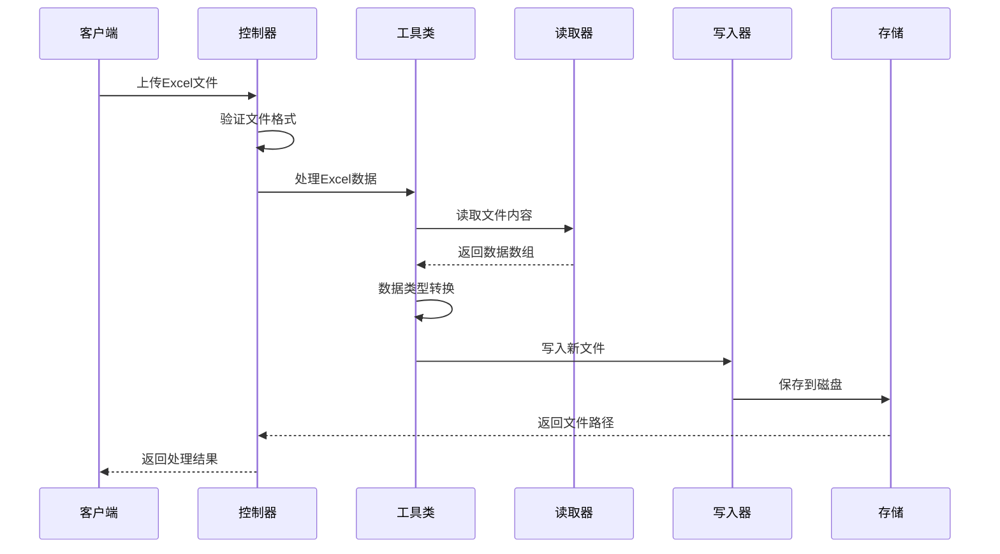
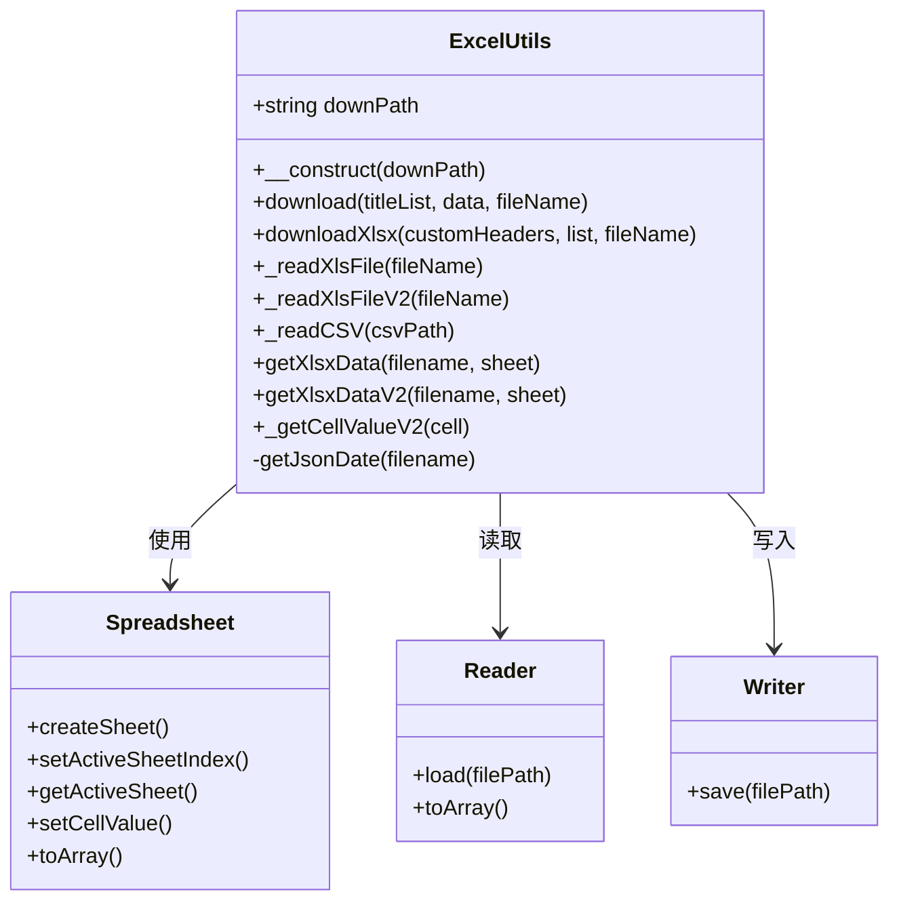
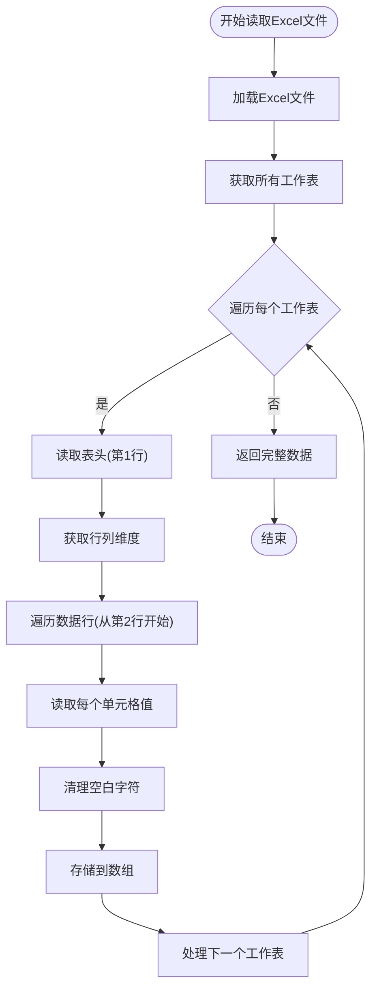
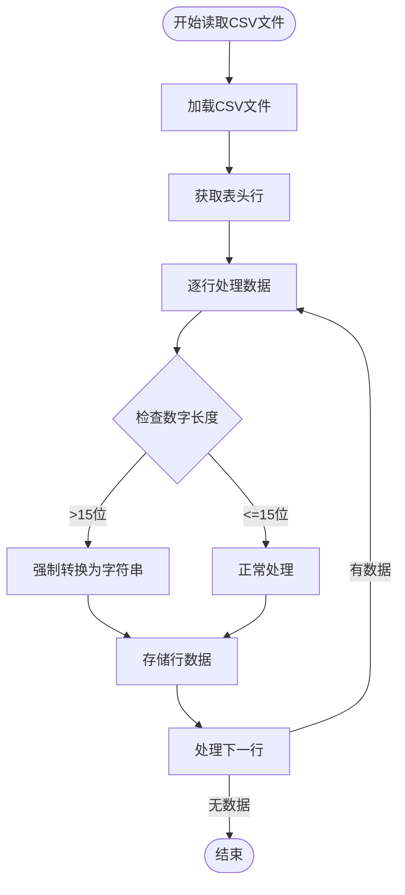
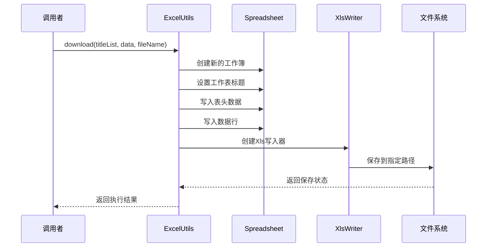
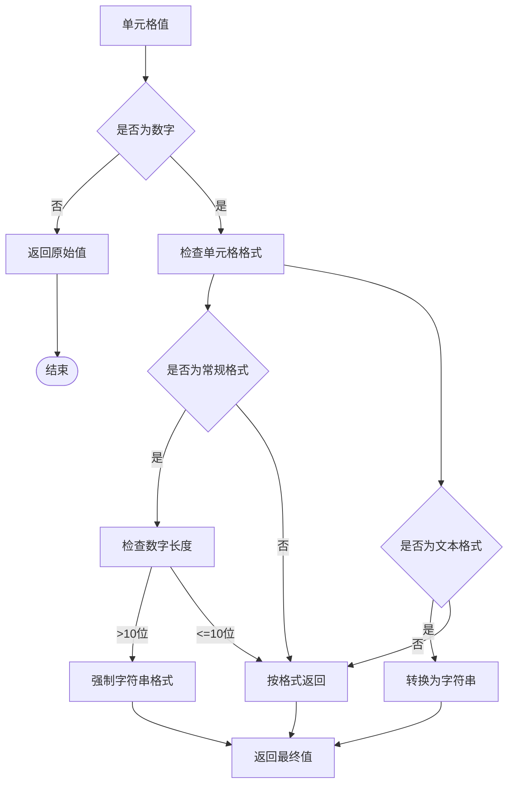
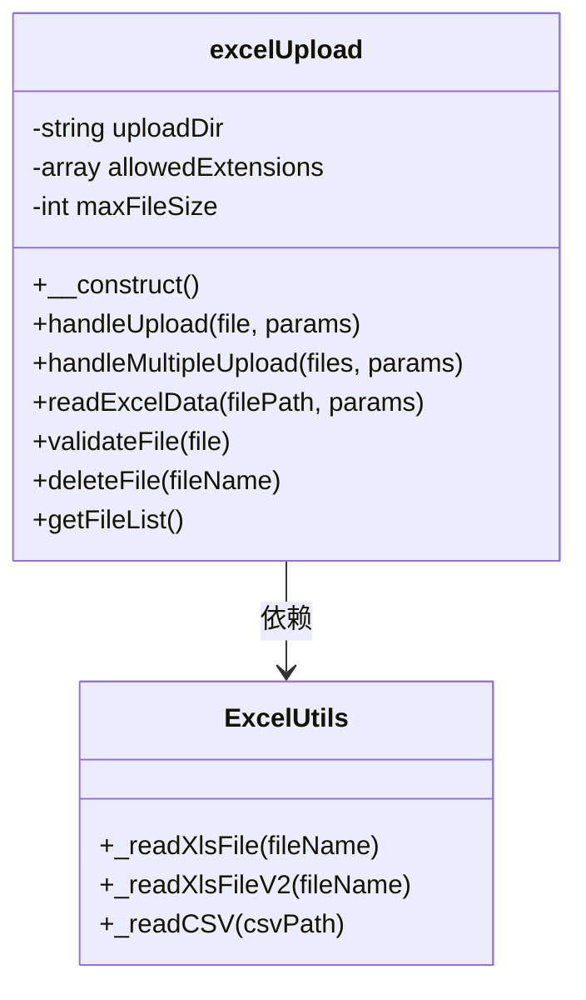
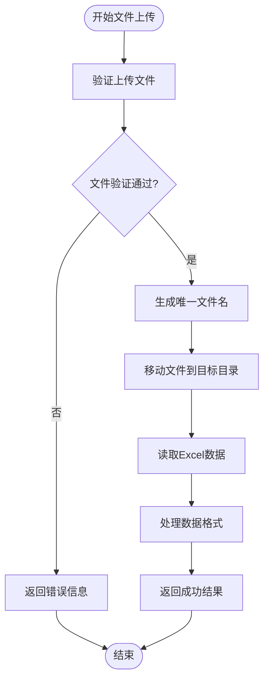
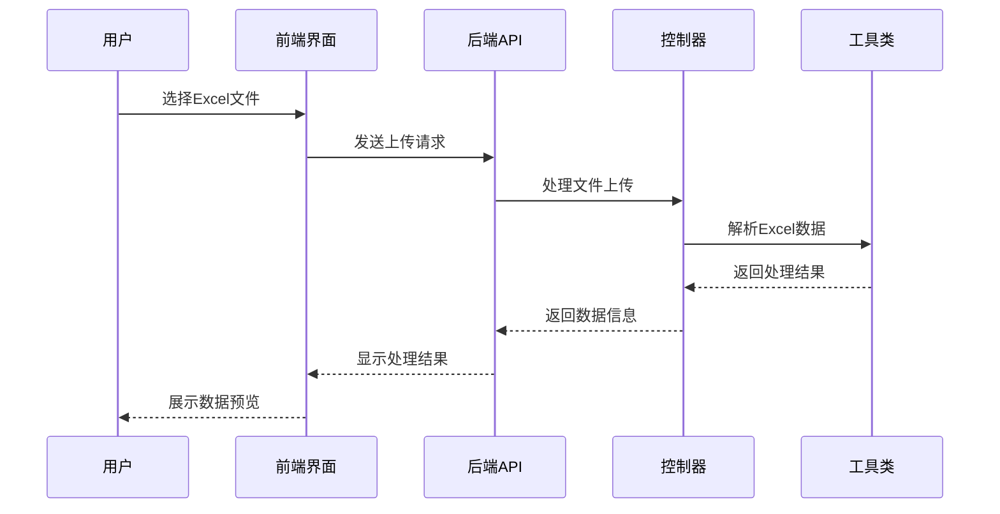

# Excel文件处理工具

<cite>
**本文档引用的文件**
- [ExcelUtils.php](file://php/utils/ExcelUtils.php)
- [excelUpload.php](file://php/controller/excelUpload.php)
- [excelUpload.html](file://template/excelUpload.html)
- [composer.json](file://composer.json)
- [ExcelUtils.php.backup](file://php/utils/ExcelUtils.php.backup)
- [excelUpload.php.backup](file://php/controller/excelUpload.php.backup)
</cite>

## 更新摘要
**变更内容**
- 完全迁移到PhpSpreadsheet 1.29.2版本，移除PHPExcel兼容层
- 改进导出路径配置机制，支持动态路径设置
- 增强单元格值处理逻辑，特别是长数字保护机制
- 优化CSV文件处理，改进长数字不转科学计数法的处理
- 更新控制器架构，支持更灵活的文件上传配置

## 目录
1. [简介](#简介)
2. [项目结构](#项目结构)
3. [核心组件](#核心组件)
4. [架构概览](#架构概览)
5. [详细组件分析](#详细组件分析)
6. [依赖关系分析](#依赖关系分析)
7. [性能考虑](#性能考虑)
8. [故障排除指南](#故障排除指南)
9. [结论](#结论)
10. [附录](#附录)

## 简介
本项目提供了一个完整的Excel文件处理工具类，基于PhpSpreadsheet库实现Excel文件的读取、写入和格式化功能。该工具类支持多种Excel格式（xlsx、xls），具备长数字不转科学计数法的特殊处理机制，能够处理多工作表、表头识别、数据类型转换等复杂场景。

**更新** 项目已完全迁移到PhpSpreadsheet 1.29.2版本，移除了对旧版PHPExcel的依赖，提供了更好的性能和兼容性。

## 项目结构
项目采用分层架构设计，主要包含以下模块：

```mermaid
graph TB
subgraph "前端层"
UI[Excel上传界面]
HTML[HTML模板]
end
subgraph "控制层"
Controller[Excel上传控制器]
API[API接口]
end
subgraph "业务层"
Utils[Excel工具类]
Parser[数据解析器]
end
subgraph "数据访问层"
Storage[文件存储]
Cache[内存缓存]
end
subgraph "第三方库"
PhpSpreadsheet[PhpSpreadsheet 1.29.2]
PHPExcel[PHPExcel兼容层(已移除)]
end
UI --> Controller
HTML --> Controller
Controller --> Utils
Utils --> PhpSpreadsheet
Utils --> Storage
Utils --> Cache
```

**图表来源**
- [ExcelUtils.php](file://php/utils/ExcelUtils.php#L1-L398)
- [excelUpload.php](file://php/controller/excelUpload.php#L1-L372)

**章节来源**
- [ExcelUtils.php](file://php/utils/ExcelUtils.php#L1-L398)
- [excelUpload.php](file://php/controller/excelUpload.php#L1-L372)

## 核心组件
Excel工具类是整个系统的核心，提供了完整的Excel文件处理能力：

### 主要功能特性
- **多格式支持**: 支持xlsx、xls、csv等多种Excel格式
- **长数字保护**: 自动检测并保护长数字不转科学计数法
- **多工作表处理**: 支持读取和处理多个工作表
- **灵活的数据类型转换**: 自动识别和转换数据类型
- **高性能内存管理**: 基于PhpSpreadsheet的优化内存使用
- **动态导出路径**: 支持自定义导出文件路径配置

### 核心方法概览
- `_readXlsFile`: 读取xls文件的主要实现
- `_readXlsFileV2`: 优化版本的xls文件读取
- `_readCSV`: CSV文件读取和处理
- `download`: XLS格式数据导出
- `downloadXlsx`: XLSX格式数据导出

**更新** 新版本移除了PHPExcel相关的兼容方法，完全基于PhpSpreadsheet实现。

**章节来源**
- [ExcelUtils.php](file://php/utils/ExcelUtils.php#L16-L398)

## 架构概览
系统采用MVC架构模式，实现了完整的Excel文件处理流程：



**图表来源**
- [excelUpload.php](file://php/controller/excelUpload.php#L35-L95)
- [ExcelUtils.php](file://php/utils/ExcelUtils.php#L147-L181)

## 详细组件分析

### ExcelUtils类详细分析

#### 类结构图


**图表来源**
- [ExcelUtils.php](file://php/utils/ExcelUtils.php#L20-L398)

#### 文件读取功能

##### _readXlsFile方法实现原理
该方法实现了完整的Excel文件读取功能，支持多工作表处理：



**图表来源**
- [ExcelUtils.php](file://php/utils/ExcelUtils.php#L147-L181)

##### _readXlsFileV2方法优化机制
V2版本提供了更高效的读取机制：

- **改进的单元格值获取**: 使用统一的值处理方法
- **更好的内存管理**: 减少不必要的数据复制
- **增强的错误处理**: 提供更详细的异常信息

##### _readCSV方法特殊处理
CSV文件读取具有特殊的长数字保护机制：



**图表来源**
- [ExcelUtils.php](file://php/utils/ExcelUtils.php#L246-L311)

#### 文件导出功能

##### download方法实现机制
该方法负责将数据导出为XLS格式文件：



**图表来源**
- [ExcelUtils.php](file://php/utils/ExcelUtils.php#L46-L86)

##### downloadXlsx方法高级功能
XLSX格式导出提供了更多自定义选项：

- **灵活的表头设置**: 支持自定义表头数组
- **批量数据处理**: 高效处理大量数据
- **文件路径管理**: 统一的文件保存策略

**更新** 新版本使用PhpSpreadsheet的IOFactory来创建Writer，提供更好的兼容性和性能。

#### 单元格值处理逻辑

##### 长数字不转科学计数法机制
系统实现了智能的数字处理逻辑：



**图表来源**
- [ExcelUtils.php](file://php/utils/ExcelUtils.php#L366-L394)

**更新** 新版本使用PhpSpreadsheet的NumberFormat常量，提供了更精确的格式判断。

**章节来源**
- [ExcelUtils.php](file://php/utils/ExcelUtils.php#L147-L394)

### Excel上传控制器分析

#### 控制器架构


**图表来源**
- [excelUpload.php](file://php/controller/excelUpload.php#L11-L328)

#### 文件上传处理流程
控制器实现了完整的文件上传和验证机制：



**图表来源**
- [excelUpload.php](file://php/controller/excelUpload.php#L35-L95)

**更新** 新版本移除了PHPExcel相关的导入语句，完全基于PhpSpreadsheet实现。

**章节来源**
- [excelUpload.php](file://php/controller/excelUpload.php#L11-L328)

### 前端界面集成

#### 用户交互流程
前端界面提供了直观的Excel文件处理体验：



**图表来源**
- [excelUpload.html](file://template/excelUpload.html#L342-L397)

**章节来源**
- [excelUpload.html](file://template/excelUpload.html#L1-L472)

## 依赖关系分析

### 第三方库集成
系统主要依赖PhpSpreadsheet库实现Excel文件处理功能：

```mermaid
graph LR
subgraph "应用层"
ExcelUtils[ExcelUtils工具类]
Controller[Excel上传控制器]
end
subgraph "PhpSpreadsheet核心库"
Spreadsheet[Spreadsheet核心类]
Reader[Reader读取器]
Writer[Writer写入器]
Cell[Cell单元格]
Style[Style样式]
end
subgraph "兼容性层"
PHPExcel[PHPExcel兼容层(已移除)]
Legacy[旧版支持]
end
ExcelUtils --> Spreadsheet
ExcelUtils --> Reader
ExcelUtils --> Writer
ExcelUtils --> Cell
ExcelUtils --> Style
```

**图表来源**
- [composer.json](file://composer.json#L1-L11)
- [ExcelUtils.php](file://php/utils/ExcelUtils.php#L4-L14)

### 依赖版本要求
- **PhpSpreadsheet**: 1.29.2版本
- **PHP版本**: 支持现代PHP版本
- **扩展依赖**: json、redis等标准扩展

**更新** 新版本完全移除了对PHPExcel的依赖，仅使用PhpSpreadsheet 1.29.2。

**章节来源**
- [composer.json](file://composer.json#L1-L11)

## 性能考虑

### 内存优化策略
系统采用了多项内存优化技术：

1. **流式处理**: 对于大文件采用流式读取方式
2. **延迟加载**: 按需加载工作表和数据
3. **垃圾回收**: 及时释放不再使用的对象
4. **缓存机制**: 对常用数据进行缓存

### 处理速度优化
- **批量操作**: 支持批量数据处理
- **并行处理**: 多文件同时处理能力
- **增量更新**: 支持部分数据更新

**更新** 新版本移除了PHPExcel的缓存设置，使用PhpSpreadsheet的内置优化机制。

## 故障排除指南

### 常见问题及解决方案

#### 文件格式错误
**问题**: Excel文件无法正确读取
**解决方案**: 
- 检查文件扩展名是否正确
- 确认文件格式是否受支持
- 验证文件完整性

#### 内存不足错误
**问题**: 处理大文件时出现内存溢出
**解决方案**:
- 分批处理大数据集
- 增加PHP内存限制
- 使用流式处理方式

#### 数字精度丢失
**问题**: 长数字显示为科学计数法
**解决方案**:
- 检查单元格格式设置
- 使用字符串格式存储长数字
- 配置PhpSpreadsheet格式设置

**更新** 新版本使用更精确的数字长度检查机制，确保长数字不会被转换为科学计数法。

**章节来源**
- [ExcelUtils.php](file://php/utils/ExcelUtils.php#L366-L394)

## 结论
Excel文件处理工具类提供了完整的企业级Excel文件处理解决方案。通过集成PhpSpreadsheet库，系统实现了高性能、高可靠性的Excel文件读写功能。其独特的长数字保护机制和多格式支持能力，使其成为处理复杂Excel数据的理想选择。

**更新** 新版本完全迁移到PhpSpreadsheet 1.29.2，提供了更好的性能、兼容性和维护性，移除了对过时库的依赖。

## 附录

### 使用示例

#### 基本文件读取
```php
// 创建Excel工具实例
$excelUtils = new ExcelUtils();

// 读取Excel文件
$data = $excelUtils->_readXlsFile('path/to/file.xlsx');

// 处理数据
foreach ($data as $sheetName => $sheetData) {
    echo "工作表: " . $sheetName . "\n";
    foreach ($sheetData as $row) {
        print_r($row);
    }
}
```

#### 数据导出功能
```php
// 准备导出数据
$titleList = [
    'id' => '用户ID',
    'name' => '用户名',
    'email' => '邮箱地址'
];

$data = [
    ['id' => '001', 'name' => '张三', 'email' => 'zhangsan@example.com'],
    ['id' => '002', 'name' => '李四', 'email' => 'lisi@example.com']
];

// 导出为Excel文件
$excelUtils->download($titleList, $data, '用户数据.xlsx');
```

#### CSV文件处理
```php
// 读取CSV文件
$csvData = $excelUtils->_readCSV('path/to/data.csv');

// 处理长数字
foreach ($csvData as $row) {
    foreach ($row as $key => $value) {
        // 长数字会自动保持为字符串格式
        echo $key . ': ' . $value . "\n";
    }
}
```

### API参考

#### 核心方法参数说明

| 方法名 | 参数 | 返回值 | 描述 |
|--------|------|--------|------|
| download | titleList: array, data: array, fileName: string | void | 导出XLS格式文件 |
| downloadXlsx | customHeaders: array, list: array, fileName: string | string | 导出XLSX格式文件 |
| _readXlsFile | fileName: string | array | 读取XLS文件 |
| _readXlsFileV2 | fileName: string | array | 读取XLS文件(优化版) |
| _readCSV | csvPath: string | array | 读取CSV文件 |
| getXlsxData | filename: string, sheet: string | array | 获取XLSX数据 |
| getXlsxDataV2 | filename: string, sheet: string | array | 获取XLSX数据(优化版) |

**更新** 新版本移除了PHPExcel相关的兼容方法，所有方法都基于PhpSpreadsheet实现。

**章节来源**
- [ExcelUtils.php](file://php/utils/ExcelUtils.php#L46-L138)

### 版本迁移指南

#### 从PHPExcel到PhpSpreadsheet的迁移

**主要变更**:
- 移除PHPExcel命名空间导入
- 更新单元格坐标获取方法
- 替换Writer类为PhpSpreadsheet Writer
- 使用新的NumberFormat常量

**迁移步骤**:
1. 更新composer.json中的依赖版本
2. 移除PHPExcel相关导入语句
3. 更新单元格坐标获取方法
4. 替换Writer类引用
5. 更新NumberFormat常量引用

**章节来源**
- [ExcelUtils.php.backup](file://php/utils/ExcelUtils.php.backup#L4-L387)
- [excelUpload.php.backup](file://php/controller/excelUpload.php.backup#L1-L372)