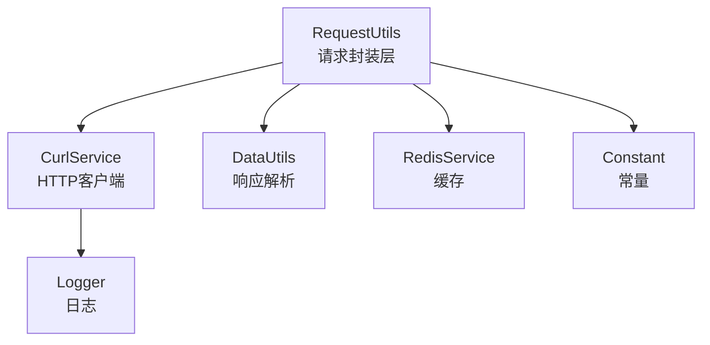
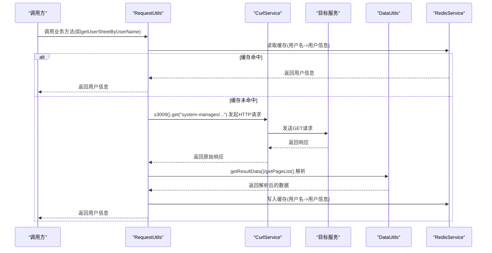
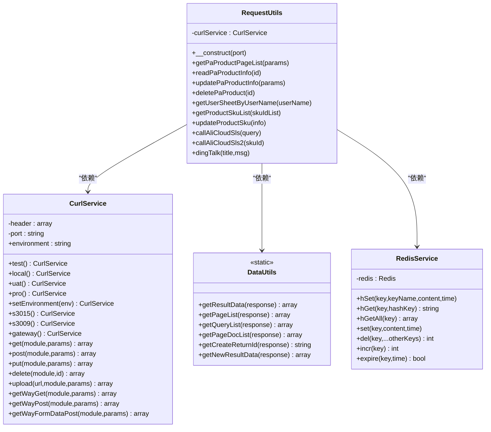
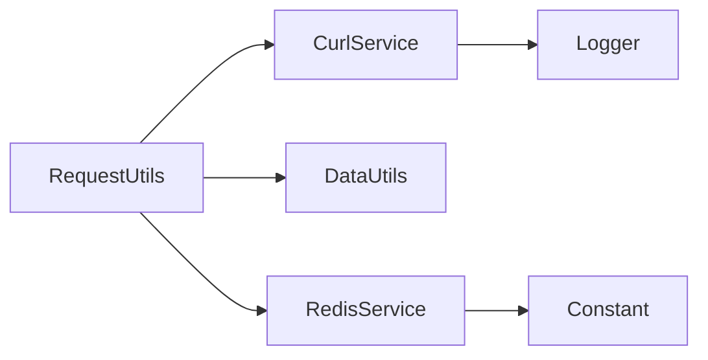

# HTTP请求工具

<cite>
**本文引用的文件**
- [RequestUtils.php](file://php/utils/RequestUtils.php)
- [CurlService.php](file://php/curl/CurlService.php)
- [DataUtils.php](file://php/utils/DataUtils.php)
- [RedisService.php](file://php/redis/RedisService.php)
- [Constant.php](file://php/constant/Constant.php)
- [skuImportSync.php](file://php/controller/skuImportSync.php)
- [Logger.php](file://php/class/Logger.php)
</cite>

## 目录
1. [简介](#简介)
2. [项目结构](#项目结构)
3. [核心组件](#核心组件)
4. [架构总览](#架构总览)
5. [详细组件分析](#详细组件分析)
6. [依赖关系分析](#依赖关系分析)
7. [性能考量](#性能考量)
8. [故障排查指南](#故障排查指南)
9. [结论](#结论)
10. [附录](#附录)

## 简介
本文件系统性梳理并文档化 RequestUtils HTTP请求工具类，涵盖：
- API调用封装：统一GET/POST/PUT/DELETE等HTTP方法的调用与参数构建
- 数据传输：请求参数构建、响应数据解析、错误处理
- 请求配置：超时、重试、认证、环境切换
- 数据格式处理：JSON序列化、表单提交、文件上传
- 使用示例：跨环境数据同步、外部API调用、批量数据处理
- 请求优化与安全最佳实践

## 项目结构
RequestUtils位于php/utils目录，依赖CurlService进行HTTP请求，依赖DataUtils进行响应数据解析，依赖RedisService进行缓存，依赖Logger进行日志记录。

图表来源
- [RequestUtils.php](file://php/utils/RequestUtils.php#L6-L16)
- [CurlService.php](file://php/curl/CurlService.php#L4-L37)
- [DataUtils.php](file://php/utils/DataUtils.php#L7-L11)
- [RedisService.php](file://php/redis/RedisService.php#L7-L19)
- [Constant.php](file://php/constant/Constant.php#L4-L9)

章节来源
- [RequestUtils.php](file://php/utils/RequestUtils.php#L6-L16)
- [CurlService.php](file://php/curl/CurlService.php#L4-L37)
- [DataUtils.php](file://php/utils/DataUtils.php#L7-L11)
- [RedisService.php](file://php/redis/RedisService.php#L7-L19)
- [Constant.php](file://php/constant/Constant.php#L4-L9)

## 核心组件
- RequestUtils：面向业务的HTTP请求封装，统一调用CurlService并使用DataUtils解析响应，结合RedisService实现缓存。
- CurlService：通用HTTP客户端，负责环境切换、认证头注入、GET/POST/PUT/DELETE、multipart/form-data上传、重试与超时控制。
- DataUtils：响应数据标准化解析，提供分页、查询、创建返回ID等解析方法。
- RedisService：Redis缓存访问，用于用户信息、分类信息等热点数据缓存。
- Logger：日志记录，记录请求URL、参数、响应状态等。

章节来源
- [RequestUtils.php](file://php/utils/RequestUtils.php#L6-L16)
- [CurlService.php](file://php/curl/CurlService.php#L4-L37)
- [DataUtils.php](file://php/utils/DataUtils.php#L7-L11)
- [RedisService.php](file://php/redis/RedisService.php#L7-L19)
- [Logger.php](file://php/class/Logger.php#L1-L200)

## 架构总览
RequestUtils通过构造函数选择目标端口（如s3015、s3009等），随后在各业务方法中调用CurlService的HTTP方法，再由DataUtils解析响应。对于高频查询，结合RedisService进行缓存。

图表来源
- [RequestUtils.php](file://php/utils/RequestUtils.php#L181-L207)
- [CurlService.php](file://php/curl/CurlService.php#L295-L311)
- [DataUtils.php](file://php/utils/DataUtils.php#L18-L29)
- [RedisService.php](file://php/redis/RedisService.php#L43-L51)

章节来源
- [RequestUtils.php](file://php/utils/RequestUtils.php#L181-L207)
- [CurlService.php](file://php/curl/CurlService.php#L295-L311)
- [DataUtils.php](file://php/utils/DataUtils.php#L18-L29)
- [RedisService.php](file://php/redis/RedisService.php#L43-L51)

## 详细组件分析

### RequestUtils 类
- 职责：面向业务的HTTP请求封装，提供多模块API方法（如pa_product、pa_product_detail、option-val-lists、system-manages、product-skus、product_base_infos、translation_managements、pa_ce_materials、pa_sku_attributes等），统一使用DataUtils解析响应。
- 关键点：
  - 构造函数接收端口号字符串，委托CurlService设置目标端口与环境。
  - 大量方法采用分页查询（queryPage）或单条查询（按ID），并使用DataUtils.getPageList、getQueryList、getResultData等进行解析。
  - 部分方法结合RedisService进行缓存（如用户信息、分类信息）。
  - 提供阿里云SLS日志查询方法（callAliCloudSls、callAliCloudSls2），内部直接使用cURL发起请求。
  - 提供钉钉OA通知发送方法（dingTalk），通过phpali端口POST发送。

章节来源
- [RequestUtils.php](file://php/utils/RequestUtils.php#L13-L16)
- [RequestUtils.php](file://php/utils/RequestUtils.php#L19-L22)
- [RequestUtils.php](file://php/utils/RequestUtils.php#L181-L207)
- [RequestUtils.php](file://php/utils/RequestUtils.php#L337-L362)
- [RequestUtils.php](file://php/utils/RequestUtils.php#L503-L573)
- [RequestUtils.php](file://php/utils/RequestUtils.php#L575-L646)
- [RequestUtils.php](file://php/utils/RequestUtils.php#L474-L497)

### CurlService 类
- 职责：通用HTTP客户端，封装GET/POST/PUT/DELETE、multipart/form-data上传、新架构路由（getWayGet/post）、认证头（Authorization bearer）、环境切换（local/test/uat/pro）、超时与重试。
- 关键点：
  - 端口选择：s3015、s3047、s3044、s3009、s3023、s3013、phpali、phphk、ux168、s3010、s3035、s3016、gateway、aiCategoryApi。
  - 环境切换：setEnvironment/test/local/uat/pro，分别设置不同基础URL。
  - 认证：gateway()方法根据环境注入Authorization头，支持ucToken覆盖。
  - 方法族：get/post/put/delete/deleteWithBodyData/upload/getWayGet/getWayPost/getWayFormDataPost。
  - 重试与超时：curlRequestMethod/curlUploadMethod/curlRequestFormData均支持timeout与tryTimes参数。
  - 日志：通过Logger记录请求URL、参数、响应状态。

章节来源
- [CurlService.php](file://php/curl/CurlService.php#L149-L154)
- [CurlService.php](file://php/curl/CurlService.php#L295-L311)
- [CurlService.php](file://php/curl/CurlService.php#L319-L326)
- [CurlService.php](file://php/curl/CurlService.php#L393-L400)
- [CurlService.php](file://php/curl/CurlService.php#L408-L418)
- [CurlService.php](file://php/curl/CurlService.php#L664-L740)
- [CurlService.php](file://php/curl/CurlService.php#L751-L809)
- [CurlService.php](file://php/curl/CurlService.php#L824-L927)
- [CurlService.php](file://php/curl/CurlService.php#L270-L290)

### DataUtils 类
- 职责：对CurlService返回的响应进行标准化解析，屏蔽不同接口返回结构差异。
- 关键点：
  - getResultData：返回result字段。
  - getPageList：返回分页data数组。
  - getQueryList：返回查询结果数组。
  - getPageDocList：针对node后端特殊docs结构。
  - getCreateReturnId：返回创建接口的_id。
  - getNewResultData：新架构state.code==2000000时返回data。
  - 辅助方法：getArrHeadData、checkArrFilesIsExist、findIndexInArray、clearRepeatData、arrayExtractSomeFilesCombineNewArray等。

章节来源
- [DataUtils.php](file://php/utils/DataUtils.php#L18-L29)
- [DataUtils.php](file://php/utils/DataUtils.php#L36-L47)
- [DataUtils.php](file://php/utils/DataUtils.php#L54-L65)
- [DataUtils.php](file://php/utils/DataUtils.php#L72-L84)
- [DataUtils.php](file://php/utils/DataUtils.php#L238-L252)
- [DataUtils.php](file://php/utils/DataUtils.php#L260-L271)

### RedisService 类
- 职责：Redis连接与常用操作封装，提供hSet/hGet/hGetAll/set/del/incr/expire等。
- 关键点：
  - 连接常量来自Constant.php（REDIS_HOST、REDIS_PORT、REDIS_PWD）。
  - RequestUtils中用于缓存用户信息（REDIS_USER_NAME_KEY）与分类信息（REDIS_CATEGORY_ID_KEY）。

章节来源
- [RedisService.php](file://php/redis/RedisService.php#L15-L19)
- [RedisService.php](file://php/redis/RedisService.php#L29-L51)
- [Constant.php](file://php/constant/Constant.php#L4-L9)

### 类关系图

图表来源
- [RequestUtils.php](file://php/utils/RequestUtils.php#L6-L16)
- [CurlService.php](file://php/curl/CurlService.php#L4-L37)
- [DataUtils.php](file://php/utils/DataUtils.php#L7-L11)
- [RedisService.php](file://php/redis/RedisService.php#L7-L19)

章节来源
- [RequestUtils.php](file://php/utils/RequestUtils.php#L6-L16)
- [CurlService.php](file://php/curl/CurlService.php#L4-L37)
- [DataUtils.php](file://php/utils/DataUtils.php#L7-L11)
- [RedisService.php](file://php/redis/RedisService.php#L7-L19)

## 依赖关系分析
- RequestUtils依赖CurlService进行HTTP请求，依赖DataUtils进行响应解析，依赖RedisService进行缓存，依赖Logger进行日志记录。
- CurlService内部维护多个端口属性（如s3015、s3009等），通过setBaseComponentByEnv根据环境动态设置基础URL。
- DataUtils提供多种解析方法，适配不同接口返回结构，降低上层调用复杂度。
- RedisService提供哈希与字符串缓存能力，配合Constant.php中的缓存键常量使用。

图表来源
- [RequestUtils.php](file://php/utils/RequestUtils.php#L6-L16)
- [CurlService.php](file://php/curl/CurlService.php#L4-L37)
- [DataUtils.php](file://php/utils/DataUtils.php#L7-L11)
- [RedisService.php](file://php/redis/RedisService.php#L7-L19)
- [Constant.php](file://php/constant/Constant.php#L4-L9)

章节来源
- [RequestUtils.php](file://php/utils/RequestUtils.php#L6-L16)
- [CurlService.php](file://php/curl/CurlService.php#L4-L37)
- [DataUtils.php](file://php/utils/DataUtils.php#L7-L11)
- [RedisService.php](file://php/redis/RedisService.php#L7-L19)
- [Constant.php](file://php/constant/Constant.php#L4-L9)

## 性能考量
- 批量查询与分页：RequestUtils中大量使用DataUtils.getPageList，结合分页参数limit/page，避免一次性拉取过多数据。
- 分块处理：对大批量SKU或分类ID列表，使用array_chunk进行分块处理，减少单次请求压力。
- 缓存：对高频查询（如用户信息、分类路径）使用Redis缓存，显著降低后端压力与延迟。
- 重试与超时：CurlService默认重试次数为1，超时时间为30秒；可通过curlRequestMethod/curlUploadMethod/curlRequestFormData的timeout与tryTimes参数调整。
- 日志：CurlService使用Logger记录请求与响应，便于问题定位与性能分析。

章节来源
- [RequestUtils.php](file://php/utils/RequestUtils.php#L63-L65)
- [RequestUtils.php](file://php/utils/RequestUtils.php#L70-L79)
- [RequestUtils.php](file://php/utils/RequestUtils.php#L340-L356)
- [CurlService.php](file://php/curl/CurlService.php#L664-L740)
- [CurlService.php](file://php/curl/CurlService.php#L751-L809)
- [CurlService.php](file://php/curl/CurlService.php#L824-L927)

## 故障排查指南
- HTTP状态码异常：CurlService在curlRequestMethod中对httpCode进行校验，非2xx且非401/404/429时抛出异常。检查目标服务状态与鉴权。
- cURL错误：当curl_exec返回false时抛出异常，检查网络连通性、代理设置、SSL证书验证。
- 响应解析失败：DataUtils.getResultData/PageList等方法对response进行结构校验，若result为空或结构不符，返回空数组或空字符串。检查上游接口返回格式。
- 缓存失效：RedisService连接常量来自Constant.php，若缓存异常，检查Redis服务状态与密码。
- 日志定位：CurlService与Controller均使用Logger记录关键信息，优先查看日志定位问题。

章节来源
- [CurlService.php](file://php/curl/CurlService.php#L725-L729)
- [CurlService.php](file://php/curl/CurlService.php#L893-L896)
- [DataUtils.php](file://php/utils/DataUtils.php#L18-L29)
- [RedisService.php](file://php/redis/RedisService.php#L15-L19)
- [Logger.php](file://php/class/Logger.php#L1-L200)

## 结论
RequestUtils通过CurlService与DataUtils实现了对多模块API的统一封装，结合Redis缓存与日志记录，提供了稳定、可维护的HTTP请求能力。其设计遵循“低耦合、高内聚”的原则，适合在跨环境数据同步、外部API调用、批量数据处理等场景中复用。

## 附录

### API调用封装与数据传输
- 统一HTTP方法：GET/POST/PUT/DELETE，支持新架构路由（getWayGet/post、getWayFormDataPost）。
- 请求参数构建：GET使用http_build_query拼接查询参数；POST/PUT/DELETE使用json_encode序列化。
- 响应数据解析：getResultData、getPageList、getQueryList、getPageDocList、getCreateReturnId、getNewResultData等。
- 错误处理：对httpCode进行校验，异常时抛出异常；cURL错误捕获并记录。

章节来源
- [CurlService.php](file://php/curl/CurlService.php#L295-L311)
- [CurlService.php](file://php/curl/CurlService.php#L319-L326)
- [CurlService.php](file://php/curl/CurlService.php#L393-L400)
- [CurlService.php](file://php/curl/CurlService.php#L408-L418)
- [CurlService.php](file://php/curl/CurlService.php#L376-L386)
- [CurlService.php](file://php/curl/CurlService.php#L361-L368)
- [DataUtils.php](file://php/utils/DataUtils.php#L18-L29)
- [DataUtils.php](file://php/utils/DataUtils.php#L36-L47)
- [DataUtils.php](file://php/utils/DataUtils.php#L54-L65)
- [DataUtils.php](file://php/utils/DataUtils.php#L72-L84)
- [DataUtils.php](file://php/utils/DataUtils.php#L238-L252)
- [DataUtils.php](file://php/utils/DataUtils.php#L260-L271)

### 请求配置与环境管理
- 环境切换：test/local/uat/pro，分别设置不同基础URL。
- 认证：gateway()方法注入Authorization头，支持ucToken覆盖。
- 超时与重试：curlRequestMethod/curlUploadMethod/curlRequestFormData支持timeout与tryTimes参数。
- 请求头：setHeader默认注入Content-Type: application/json; charset=UTF-8与request-trace-id等。

章节来源
- [CurlService.php](file://php/curl/CurlService.php#L98-L132)
- [CurlService.php](file://php/curl/CurlService.php#L149-L154)
- [CurlService.php](file://php/curl/CurlService.php#L270-L290)
- [CurlService.php](file://php/curl/CurlService.php#L74-L92)
- [CurlService.php](file://php/curl/CurlService.php#L664-L740)
- [CurlService.php](file://php/curl/CurlService.php#L751-L809)
- [CurlService.php](file://php/curl/CurlService.php#L824-L927)

### 数据格式处理
- JSON序列化：POST/PUT/DELETE参数统一使用json_encode($params, JSON_UNESCAPED_UNICODE)。
- 表单提交：getWayFormDataPost使用multipart/form-data，自动设置boundary，不手动设置Content-Type。
- 文件上传：upload/url/module/params直接POST上传，适用于非标准路由。

章节来源
- [CurlService.php](file://php/curl/CurlService.php#L699-L708)
- [CurlService.php](file://php/curl/CurlService.php#L854-L860)
- [CurlService.php](file://php/curl/CurlService.php#L334-L338)
- [CurlService.php](file://php/curl/CurlService.php#L885-L887)

### 使用示例与场景
- 跨环境数据同步：skuImportSync控制器演示了如何在不同环境间查询、删除、创建数据，结合RequestUtils与CurlService实现。
- 外部API调用：RequestUtils提供阿里云SLS日志查询方法（callAliCloudSls、callAliCloudSls2），直接使用cURL发起请求。
- 批量数据处理：RequestUtils中对SKU列表、分类ID列表使用array_chunk分块处理，避免单次请求过大。

章节来源
- [skuImportSync.php](file://php/controller/skuImportSync.php#L314-L322)
- [skuImportSync.php](file://php/controller/skuImportSync.php#L335-L342)
- [skuImportSync.php](file://php/controller/skuImportSync.php#L347-L351)
- [skuImportSync.php](file://php/controller/skuImportSync.php#L357-L368)
- [skuImportSync.php](file://php/controller/skuImportSync.php#L376-L386)
- [RequestUtils.php](file://php/utils/RequestUtils.php#L63-L65)
- [RequestUtils.php](file://php/utils/RequestUtils.php#L70-L79)
- [RequestUtils.php](file://php/utils/RequestUtils.php#L503-L573)
- [RequestUtils.php](file://php/utils/RequestUtils.php#L575-L646)

### 请求优化策略与安全最佳实践
- 优化策略：
  - 合理设置分页参数（limit/page），避免一次性拉取过多数据。
  - 使用Redis缓存热点数据，降低后端压力。
  - 控制重试次数与超时时间，避免雪崩效应。
- 安全最佳实践：
  - 生产环境建议开启SSL证书验证（CURLOPT_SSL_VERIFYPEER/CURLOPT_SSL_VERIFYHOST）。
  - 避免在日志中打印敏感信息（如Authorization头）。
  - 使用白名单控制允许的HTTP方法与路由。
  - 对外部API调用增加限流与熔断策略。

章节来源
- [CurlService.php](file://php/curl/CurlService.php#L683-L684)
- [CurlService.php](file://php/curl/CurlService.php#L966-L967)
- [CurlService.php](file://php/curl/CurlService.php#L730-L732)
- [CurlService.php](file://php/curl/CurlService.php#L910-L914)