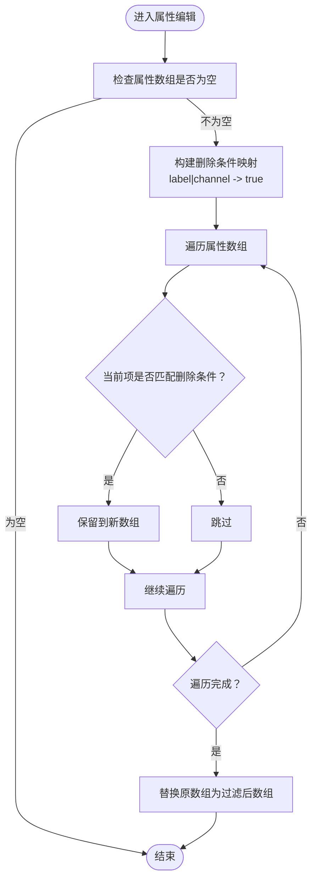

# 产品信息工具

<cite>
**本文引用的文件**
- [ProductUtils.php](file://php/utils/ProductUtils.php)
- [DataUtils.php](file://php/utils/DataUtils.php)
- [ExcelUtils.php](file://php/utils/ExcelUtils.php)
- [skuImportSync.php](file://php/controller/skuImportSync.php)
- [search.php](file://php/controller/search.php)
- [update.php](file://php/controller/update.php)
- [TestController.php.backup](file://php/shell/TestController.php.backup)
- [Logger.php](file://php/class/Logger.php)
- [CurlService.php](file://php/curl/CurlService.php)
- [skuImportSync.html](file://template/fix/skuImportSync.html)
</cite>

## 目录
1. [简介](#简介)
2. [项目结构](#项目结构)
3. [核心组件](#核心组件)
4. [架构总览](#架构总览)
5. [详细组件分析](#详细组件分析)
6. [依赖关系分析](#依赖关系分析)
7. [性能考量](#性能考量)
8. [故障排查指南](#故障排查指南)
9. [结论](#结论)
10. [附录](#附录)

## 简介
本文件围绕产品信息工具类 ProductUtils 展开，系统性梳理其在产品 SKU 属性管理、产品数据校验与状态维护、产品关联数据处理等方面的能力与实现，并结合仓库内实际的导入同步、数据查询与更新、Shell 批处理脚本等模块，给出完整使用示例与集成方式说明。文档同时提供可视化图示，帮助读者快速理解数据流与控制流。

## 项目结构
与 ProductUtils 相关的核心文件分布如下：
- 工具类与通用工具
  - php/utils/ProductUtils.php：产品属性编辑与批量删除工具
  - php/utils/DataUtils.php：数据分页/查询/去重等通用工具
  - php/utils/ExcelUtils.php：Excel 读写与数据解析工具
- 控制器与页面
  - php/controller/skuImportSync.php：SKU 导入与同步控制器
  - php/controller/search.php：产品属性查询与校验逻辑
  - php/controller/update.php：产品属性更新与操作线信息维护
  - template/fix/skuImportSync.html：前端导入同步页面
- 日志与网络服务
  - php/class/Logger.php：日志记录
  - php/curl/CurlService.php：HTTP 调用封装
- Shell 批处理
  - php/shell/TestController.php.backup：包含大量产品 SKU 查询、属性处理与批量操作示例

**图表来源**
- [ProductUtils.php](file://php/utils/ProductUtils.php#L1-L127)
- [DataUtils.php](file://php/utils/DataUtils.php#L1-L802)
- [ExcelUtils.php](file://php/utils/ExcelUtils.php#L1-L398)
- [skuImportSync.php](file://php/controller/skuImportSync.php#L1-L512)
- [search.php](file://php/controller/search.php#L577-L629)
- [update.php](file://php/controller/update.php#L433-L450)
- [TestController.php.backup](file://php/shell/TestController.php.backup#L1742-L5604)

**章节来源**
- [ProductUtils.php](file://php/utils/ProductUtils.php#L1-L127)
- [DataUtils.php](file://php/utils/DataUtils.php#L1-L802)
- [ExcelUtils.php](file://php/utils/ExcelUtils.php#L1-L398)
- [skuImportSync.php](file://php/controller/skuImportSync.php#L1-L512)
- [search.php](file://php/controller/search.php#L577-L629)
- [update.php](file://php/controller/update.php#L433-L450)
- [TestController.php.backup](file://php/shell/TestController.php.backup#L1742-L5604)

## 核心组件
- ProductUtils：提供产品 SKU 属性的增改、批量增改、批量删除能力，核心方法包括：
  - editProductAttribute：按 label+channel 更新或新增属性值
  - editProductAttributeByArr：批量更新或新增属性
  - deleteProductAttributeByArr / deleteProductAttributeByArrV2：按 label+channel 条件批量删除属性
- DataUtils：提供分页数据获取、查询结果提取、数组去重、条件查找等通用能力，支撑 ProductUtils 的属性匹配与筛选
- ExcelUtils：提供 Excel 读取与模板生成能力，支撑导入流程
- 控制器与页面：skuImportSync.php 实现导入解析与同步；search.php 与 update.php 实现属性查询/校验与更新；前端 skuImportSync.html 提供用户交互
- Shell 批处理：TestController.php.backup 中包含大量产品 SKU 查询与属性处理示例，体现与 ProductUtils 的配合使用

**章节来源**
- [ProductUtils.php](file://php/utils/ProductUtils.php#L23-L125)
- [DataUtils.php](file://php/utils/DataUtils.php#L183-L197)
- [ExcelUtils.php](file://php/utils/ExcelUtils.php#L147-L181)
- [skuImportSync.php](file://php/controller/skuImportSync.php#L164-L271)
- [search.php](file://php/controller/search.php#L577-L629)
- [update.php](file://php/controller/update.php#L433-L450)
- [TestController.php.backup](file://php/shell/TestController.php.backup#L1742-L5604)

## 架构总览
ProductUtils 作为工具类，主要通过 DataUtils 的条件匹配与筛选能力，实现对产品 SKU 属性的精准编辑与批量处理。在实际业务中，控制器层负责接收用户请求、解析数据、调用工具类与服务层接口，完成导入、同步、查询与更新等流程。

**图表来源**
- [skuImportSync.php](file://php/controller/skuImportSync.php#L164-L426)
- [ExcelUtils.php](file://php/utils/ExcelUtils.php#L147-L181)
- [ProductUtils.php](file://php/utils/ProductUtils.php#L42-L62)
- [DataUtils.php](file://php/utils/DataUtils.php#L183-L197)
- [CurlService.php](file://php/curl/CurlService.php)

**章节来源**
- [skuImportSync.php](file://php/controller/skuImportSync.php#L164-L426)
- [ExcelUtils.php](file://php/utils/ExcelUtils.php#L147-L181)
- [ProductUtils.php](file://php/utils/ProductUtils.php#L42-L62)
- [DataUtils.php](file://php/utils/DataUtils.php#L183-L197)

## 详细组件分析

### ProductUtils 类分析
- 设计要点
  - 面向产品 SKU 的 attribute 数组进行增改删操作
  - 通过 DataUtils::findIndexInArray 实现按 label+channel 的条件匹配
  - 批量处理采用一次遍历构建删除映射，减少数组操作次数
- 方法概览
  - editProductAttribute：按条件更新或新增属性值
  - editProductAttributeByArr：批量更新或新增属性
  - deleteProductAttributeByArr / deleteProductAttributeByArrV2：按条件批量删除属性
- 性能与复杂度
  - 条件匹配基于 array_filter，时间复杂度 O(n)
  - 批量删除通过哈希映射构建 O(k) 条件集，随后单次遍历 O(n)，整体优于多次 splice 操作

**图表来源**
- [ProductUtils.php](file://php/utils/ProductUtils.php#L71-L96)
- [ProductUtils.php](file://php/utils/ProductUtils.php#L100-L125)

**章节来源**
- [ProductUtils.php](file://php/utils/ProductUtils.php#L23-L125)
- [DataUtils.php](file://php/utils/DataUtils.php#L183-L197)

### 数据校验与业务规则
- 币种一致性校验
  - 在查询流程中，针对 MSRPWithTax_currency、MSRP_currency 等标签，按渠道比对真实币种，不一致则标记可删除
- 批量处理与去重
  - 使用 DataUtils::clearRepeatData 对对象数组去重，避免重复处理
- 条件匹配与筛选
  - 使用 DataUtils::findIndexInArray 实现多条件匹配，支持 label/channel 组合

**图表来源**
- [search.php](file://php/controller/search.php#L577-L629)
- [DataUtils.php](file://php/utils/DataUtils.php#L183-L197)

**章节来源**
- [search.php](file://php/controller/search.php#L577-L629)
- [DataUtils.php](file://php/utils/DataUtils.php#L283-L296)
- [DataUtils.php](file://php/utils/DataUtils.php#L183-L197)

### 导入与同步流程
- Excel 解析
  - 通过 ExcelUtils 读取上传的 Excel 文件，提取 SKU 列表并去重
- 同步策略
  - 从 PRO 环境查询产品数据，如目标环境存在则先删除旧数据，再创建新数据
  - 支持按模块/端口/字段条件查询与同步
- 错误处理
  - 记录详细日志，捕获异常并返回统一结构

**图表来源**
- [skuImportSync.php](file://php/controller/skuImportSync.php#L164-L426)
- [ExcelUtils.php](file://php/utils/ExcelUtils.php#L147-L181)
- [CurlService.php](file://php/curl/CurlService.php)

**章节来源**
- [skuImportSync.php](file://php/controller/skuImportSync.php#L164-L426)
- [ExcelUtils.php](file://php/utils/ExcelUtils.php#L147-L181)

### 产品关联数据处理
- 产品线与操作线
  - 在更新流程中，为 SKU 维护 product_operation_lines，包含产品线、开发者、跟踪人等信息
- 渠道与价格
  - 通过查询与比对渠道币种，清理不一致的价格属性
- 批量处理示例
  - Shell 中包含复制渠道属性、同步材料数据等批量任务

**图表来源**
- [update.php](file://php/controller/update.php#L433-L450)
- [search.php](file://php/controller/search.php#L577-L629)
- [TestController.php.backup](file://php/shell/TestController.php.backup#L1742-L5604)

**章节来源**
- [update.php](file://php/controller/update.php#L433-L450)
- [search.php](file://php/controller/search.php#L577-L629)
- [TestController.php.backup](file://php/shell/TestController.php.backup#L1742-L5604)

## 依赖关系分析
- ProductUtils 依赖 DataUtils 的条件匹配与数组处理能力
- 控制器层依赖 ExcelUtils 进行数据解析，依赖 CurlService 进行后端服务调用
- 前端页面与控制器通过 JSON 接口交互，实现导入与同步的可视化

**图表来源**
- [ProductUtils.php](file://php/utils/ProductUtils.php#L1-L127)
- [DataUtils.php](file://php/utils/DataUtils.php#L1-L802)
- [ExcelUtils.php](file://php/utils/ExcelUtils.php#L1-L398)
- [skuImportSync.php](file://php/controller/skuImportSync.php#L1-L512)
- [search.php](file://php/controller/search.php#L577-L629)
- [update.php](file://php/controller/update.php#L433-L450)
- [skuImportSync.html](file://template/fix/skuImportSync.html#L447-L466)

**章节来源**
- [ProductUtils.php](file://php/utils/ProductUtils.php#L1-L127)
- [DataUtils.php](file://php/utils/DataUtils.php#L1-L802)
- [ExcelUtils.php](file://php/utils/ExcelUtils.php#L1-L398)
- [skuImportSync.php](file://php/controller/skuImportSync.php#L1-L512)
- [search.php](file://php/controller/search.php#L577-L629)
- [update.php](file://php/controller/update.php#L433-L450)
- [skuImportSync.html](file://template/fix/skuImportSync.html#L447-L466)

## 性能考量
- 批量删除优化：通过构建 label|channel 唯一键映射，单次遍历完成筛选，避免多次数组 splice 操作
- 分页查询：使用 DataUtils::getPageList 获取分页数据，降低单次请求负载
- Excel 处理：使用 PhpSpreadsheet 读取，注意大文件内存占用，建议分片处理
- 日志与异常：统一记录与捕获，便于定位性能瓶颈与错误点

[本节为通用指导，无需具体文件分析]

## 故障排查指南
- Excel 解析失败
  - 检查文件扩展名与大小限制，确认上传目录可写
  - 查看日志输出，定位解析异常
- 同步失败
  - 检查目标环境参数（test/uat），确认 CurlService 配置
  - 查看删除旧数据与创建新数据的异常日志
- 属性更新异常
  - 确认 label+channel 条件是否正确
  - 使用 DataUtils::findIndexInArray 校验匹配结果

**章节来源**
- [skuImportSync.php](file://php/controller/skuImportSync.php#L433-L471)
- [Logger.php](file://php/class/Logger.php)

## 结论
ProductUtils 以简洁高效的 API 提供产品 SKU 属性的增改删能力，结合 DataUtils 的条件匹配与数组处理、ExcelUtils 的数据解析、以及控制器层的导入同步流程，形成一套完整的 SKU 数据管理方案。通过币种一致性校验与批量处理示例，进一步强化了业务规则与可运维性。

[本节为总结，无需具体文件分析]

## 附录

### 使用示例与最佳实践
- 产品导入
  - 前端上传 Excel，控制器解析为 SKU 列表，调用 CurlService 查询 PRO 数据，再写入目标环境
  - 参考路径：[skuImportSync.php](file://php/controller/skuImportSync.php#L164-L426)、[ExcelUtils.php](file://php/utils/ExcelUtils.php#L147-L181)
- 数据同步
  - 按模块/端口/字段条件查询，目标环境存在则删除旧数据，再创建新数据
  - 参考路径：[skuImportSync.php](file://php/controller/skuImportSync.php#L278-L426)
- 批量处理
  - 使用 ProductUtils::editProductAttributeByArr 批量更新属性
  - 使用 ProductUtils::deleteProductAttributeByArr 批量删除属性
  - 参考路径：[ProductUtils.php](file://php/utils/ProductUtils.php#L42-L62)、[ProductUtils.php](file://php/utils/ProductUtils.php#L71-L96)
- 币种一致性校验
  - 针对 MSRPWithTax_currency、MSRP_currency 标签，按渠道比对真实币种，不一致则标记删除
  - 参考路径：[search.php](file://php/controller/search.php#L577-L629)
- 产品线与操作线维护
  - 更新 SKU 时维护 product_operation_lines，包含产品线、开发者、跟踪人等
  - 参考路径：[update.php](file://php/controller/update.php#L433-L450)

**章节来源**
- [skuImportSync.php](file://php/controller/skuImportSync.php#L164-L426)
- [ExcelUtils.php](file://php/utils/ExcelUtils.php#L147-L181)
- [ProductUtils.php](file://php/utils/ProductUtils.php#L42-L96)
- [search.php](file://php/controller/search.php#L577-L629)
- [update.php](file://php/controller/update.php#L433-L450)