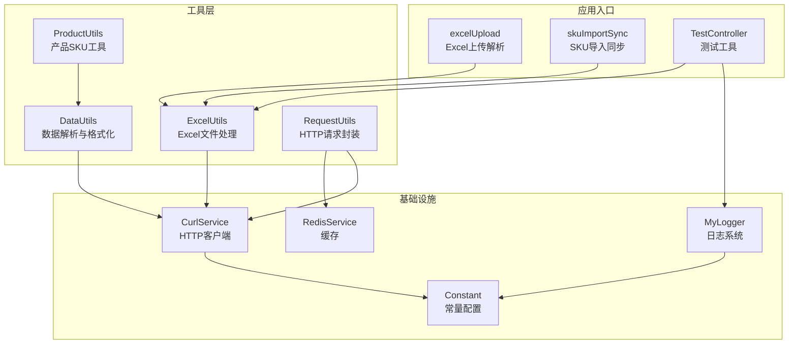
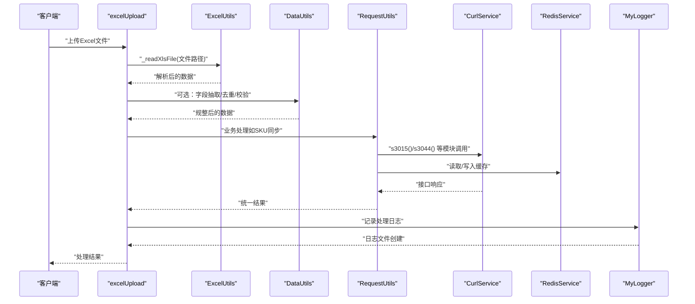
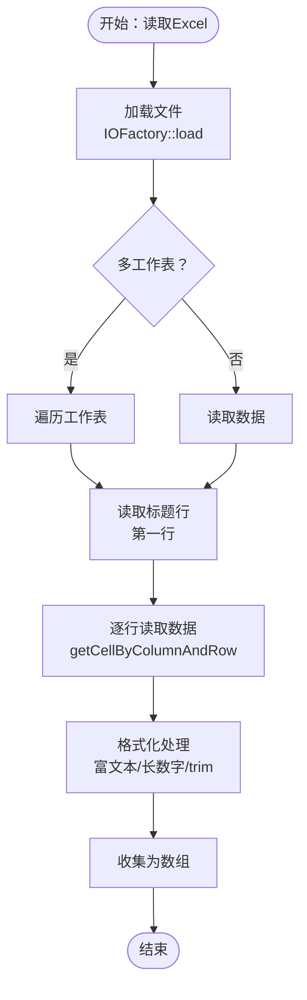
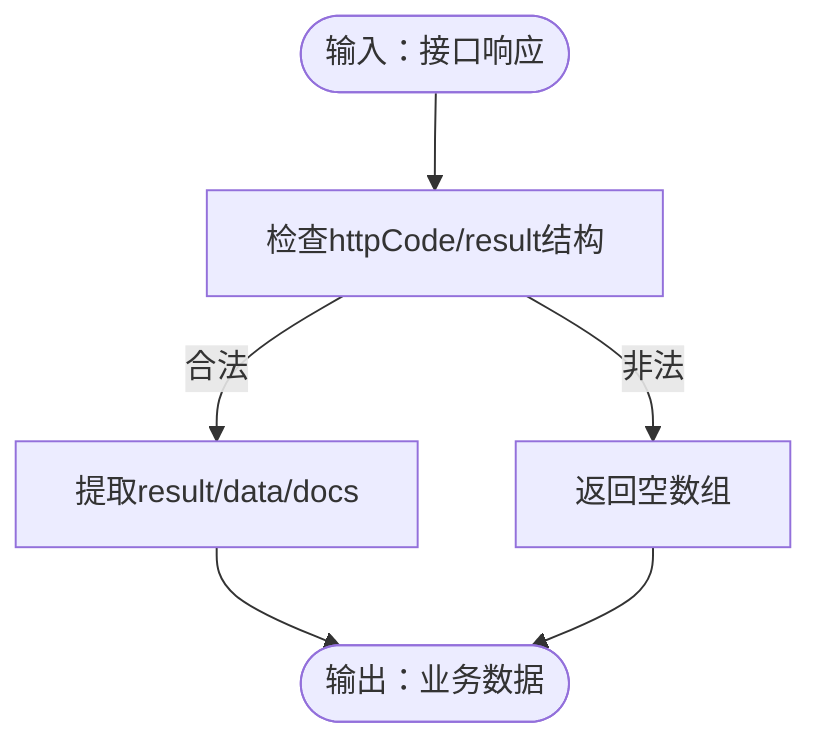
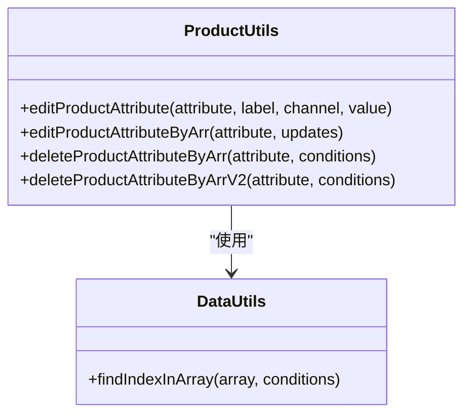
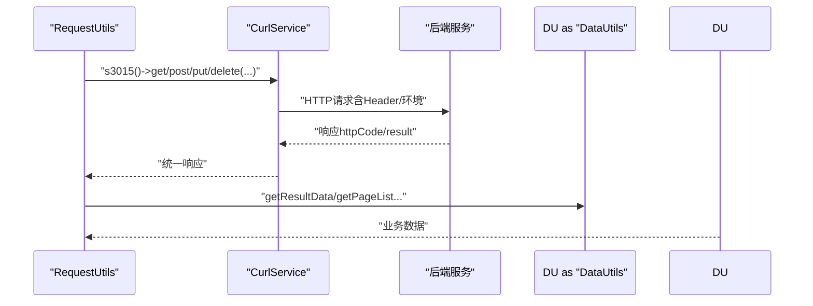
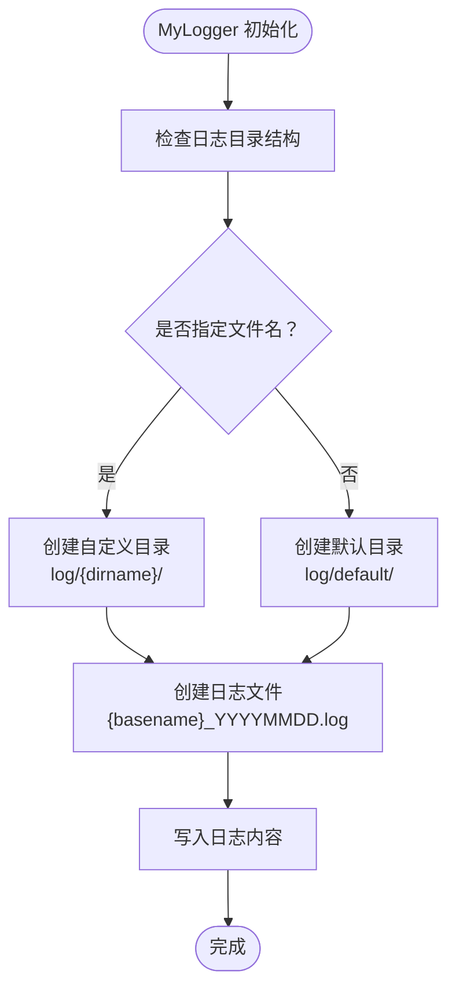
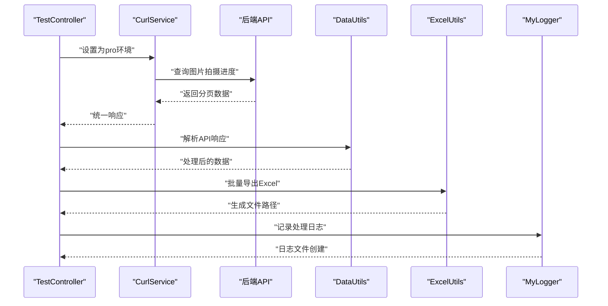
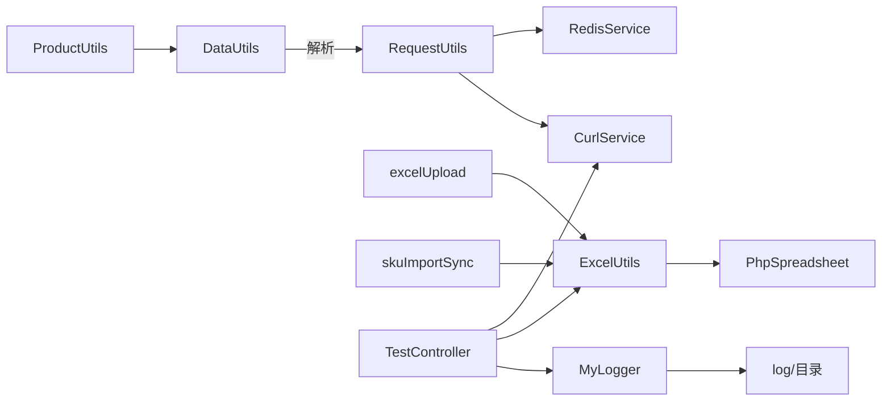

# 工具类库

<cite>
**本文档引用的文件**
- [ExcelUtils.php](file://php/utils/ExcelUtils.php)
- [DataUtils.php](file://php/utils/DataUtils.php)
- [ProductUtils.php](file://php/utils/ProductUtils.php)
- [RequestUtils.php](file://php/utils/RequestUtils.php)
- [CurlService.php](file://php/curl/CurlService.php)
- [RedisService.php](file://php/redis/RedisService.php)
- [Constant.php](file://php/constant/Constant.php)
- [Logger.php](file://php/class/Logger.php)
- [TestController.php](file://php/shell/TestController.php)
- [composer.json](file://composer.json)
- [excelUpload.php](file://php/controller/excelUpload.php)
- [skuImportSync.php](file://php/controller/skuImportSync.php)
</cite>

## 更新摘要
**所做更改**
- 新增日志系统增强章节，详细介绍 MyLogger 类的自动目录创建和文件管理功能
- 更新 ExcelUtils 组件分析，增加 CSV 读取增强和长数字保护机制
- 新增测试工具章节，展示 TestController 的日志记录和 Excel 导出实践
- 完善日志系统架构图，体现新的日志目录结构和自动创建机制
- 更新故障排查指南，增加日志系统相关的诊断步骤

## 目录
1. [简介](#简介)
2. [项目结构](#项目结构)
3. [核心组件](#核心组件)
4. [架构总览](#架构总览)
5. [详细组件分析](#详细组件分析)
6. [日志系统增强](#日志系统增强)
7. [测试工具集成](#测试工具集成)
8. [依赖关系分析](#依赖关系分析)
9. [性能考虑](#性能考虑)
10. [故障排查指南](#故障排查指南)
11. [结论](#结论)
12. [附录](#附录)

## 简介
本文件系统性梳理 PaSystem 工具类库，重点覆盖以下能力：
- Excel 文件处理：读取、解析、格式转换、导出
- 数据处理与格式化：接口响应解析、数组去重、字段抽取、日志解析与规整
- 产品相关工具：SKU 属性编辑、批量更新与删除
- HTTP 请求封装：多模块网关、环境切换、统一响应解析
- Excel 集成库：基于 PhpSpreadsheet 的兼容与迁移策略
- **新增** 日志系统：MyLogger 类的自动目录创建和文件管理
- **新增** 测试工具：TestController 的日志记录和 Excel 导出实践
- 实战示例、性能优化与扩展开发指南

## 项目结构
工具类库位于 php/utils 目录，配合 curl、redis、controller 等模块协同工作，Composer 管理第三方依赖（如 PhpSpreadsheet）。**新增**的日志系统位于 php/class 目录，提供自动化的日志文件管理和目录结构。

**图表来源**
- [ExcelUtils.php](file://php/utils/ExcelUtils.php#L1-L398)
- [DataUtils.php](file://php/utils/DataUtils.php#L1-L802)
- [ProductUtils.php](file://php/utils/ProductUtils.php#L1-L127)
- [RequestUtils.php](file://php/utils/RequestUtils.php#L1-L672)
- [CurlService.php](file://php/curl/CurlService.php#L1-L996)
- [RedisService.php](file://php/redis/RedisService.php#L1-L77)
- [Constant.php](file://php/constant/Constant.php#L1-L26)
- [Logger.php](file://php/class/Logger.php#L1-L60)
- [TestController.php](file://php/shell/TestController.php#L1-L89)
- [excelUpload.php](file://php/controller/excelUpload.php#L1-L372)
- [skuImportSync.php](file://php/controller/skuImportSync.php#L1-L512)

**章节来源**
- [ExcelUtils.php](file://php/utils/ExcelUtils.php#L1-L398)
- [DataUtils.php](file://php/utils/DataUtils.php#L1-L802)
- [ProductUtils.php](file://php/utils/ProductUtils.php#L1-L127)
- [RequestUtils.php](file://php/utils/RequestUtils.php#L1-L672)
- [CurlService.php](file://php/curl/CurlService.php#L1-L996)
- [RedisService.php](file://php/redis/RedisService.php#L1-L77)
- [Constant.php](file://php/constant/Constant.php#L1-L26)
- [Logger.php](file://php/class/Logger.php#L1-L60)
- [TestController.php](file://php/shell/TestController.php#L1-L89)
- [excelUpload.php](file://php/controller/excelUpload.php#L1-L372)
- [skuImportSync.php](file://php/controller/skuImportSync.php#L1-L512)

## 核心组件
- ExcelUtils：提供 Excel/XLS/XLSX/CVS 读取、导出、长数字安全读取、单元格值处理等能力
- DataUtils：统一解析接口响应、数组过滤与去重、字段抽取、日志解析与规整
- ProductUtils：SKU 属性的增删改、批量更新与删除
- RequestUtils：多模块 API 调用封装、环境切换、Redis 缓存、阿里云日志查询等
- CurlService：多环境端口映射、统一请求方法、日志记录
- RedisService：Redis 基础操作（哈希、字符串、过期等）
- Constant：Redis 常量与键空间定义
- **新增** MyLogger：日志系统，支持自动创建目录和文件管理

**章节来源**
- [ExcelUtils.php](file://php/utils/ExcelUtils.php#L1-L398)
- [DataUtils.php](file://php/utils/DataUtils.php#L1-L802)
- [ProductUtils.php](file://php/utils/ProductUtils.php#L1-L127)
- [RequestUtils.php](file://php/utils/RequestUtils.php#L1-L672)
- [CurlService.php](file://php/curl/CurlService.php#L1-L996)
- [RedisService.php](file://php/redis/RedisService.php#L1-L77)
- [Constant.php](file://php/constant/Constant.php#L1-L26)
- [Logger.php](file://php/class/Logger.php#L1-L60)

## 架构总览
工具类库围绕"数据采集-数据处理-数据写入/调用"的闭环构建，ExcelUtils 负责文件读写，DataUtils 统一解析与规整，RequestUtils 通过 CurlService 调用后端 API，RedisService 提供缓存加速。**新增**的 MyLogger 提供统一的日志管理，TestController 展示了日志系统的实际应用场景。

**图表来源**
- [excelUpload.php](file://php/controller/excelUpload.php#L1-L372)
- [ExcelUtils.php](file://php/utils/ExcelUtils.php#L1-L398)
- [DataUtils.php](file://php/utils/DataUtils.php#L1-L802)
- [RequestUtils.php](file://php/utils/RequestUtils.php#L1-L672)
- [CurlService.php](file://php/curl/CurlService.php#L1-L996)
- [RedisService.php](file://php/redis/RedisService.php#L1-L77)
- [Logger.php](file://php/class/Logger.php#L1-L60)

## 详细组件分析

### ExcelUtils 组件分析
- 功能概览
  - 导出：支持 XLS/XLSX 下载，动态写入标题与数据，自动保存至指定目录
  - 读取：支持 XLS/XLSX/CVS，自动识别多工作表，逐行解析为关联数组
  - 安全读取：长数字保护（科学计数法规避）、富文本转纯文本、单元格格式判断
  - 辅助：提供 V1/V2 两种读取模式，CSV 专用列格式处理

- 关键方法与行为
  - download(titleList, data, fileName)：写入标题与数据，保存为 XLS 文件
  - downloadXlsx(customHeaders, list, fileName)：写入自定义表头与数据，保存为 XLSX
  - _readXlsFile(fileName)：读取 XLS/XLSX，逐行解析为数组
  - getXlsxData(filename, sheet)/getXlsxDataV2(filename, sheet)：便捷读取指定工作表
  - _readCSV(csvPath)：CSV 读取，强制文本列格式，修复长数字
  - _readXlsFileV2(fileName)：增强版读取，统一值处理与格式判断
  - _getCellValueV2(cell)：单元格值处理，富文本、长数字、格式化

- 性能与健壮性
  - 使用 PhpSpreadsheet 替代旧版 PHPExcel，具备更好的内存管理
  - 读取时按行迭代，避免一次性加载全部数据
  - 长数字保护：当数值长度超阈值或为常规格式时，强制转为字符串

- 使用示例（路径参考）
  - [Excel 文件上传与解析](file://php/controller/excelUpload.php#L148-L238)
  - [SKU 导入模板与解析](file://php/controller/skuImportSync.php#L164-L271)

**图表来源**
- [ExcelUtils.php](file://php/utils/ExcelUtils.php#L147-L398)

**章节来源**
- [ExcelUtils.php](file://php/utils/ExcelUtils.php#L1-L398)
- [excelUpload.php](file://php/controller/excelUpload.php#L1-L372)
- [skuImportSync.php](file://php/controller/skuImportSync.php#L1-L512)

### DataUtils 组件分析
- 功能概览
  - 接口响应解析：getPageList/getQueryList/getPageDocList 等，统一提取 result/data/docs
  - 数组处理：findIndexInArray/findIndexDataInArray、去重与重复检测、字段抽取
  - 日志解析：parseAndTransformQdLogList/refineLogActionList/refineLogActionListV2/removeDuplicateRepublishLogs
  - 工具方法：getOptionVal/getArrHeadData/checkArrFilesIsExist、explainArgv 等

- 关键方法与行为
  - getResultData/getPageList/getQueryList/getPageDocList：按约定结构提取数据
  - getCreateReturnId：提取新建接口返回的主键
  - clearRepeatData/hasDuplicates：对象数组去重与重复检测
  - arrayExtractSomeFilesCombineNewArray：按字段集抽取并重组
  - parseAndTransformQdLogList/refineLogActionList/refineLogActionListV2：日志结构化与上下文补全
  - removeDuplicateRepublishLogs：去重"重新发布"日志

- 使用场景
  - RequestUtils 统一封装响应解析
  - 日志审计与状态回溯

**图表来源**
- [DataUtils.php](file://php/utils/DataUtils.php#L18-L136)

**章节来源**
- [DataUtils.php](file://php/utils/DataUtils.php#L1-L802)
- [RequestUtils.php](file://php/utils/RequestUtils.php#L1-L672)

### ProductUtils 组件分析
- 功能概览
  - editProductAttribute/editProductAttributeByArr：按 label/channel 更新或新增属性
  - deleteProductAttributeByArr/deleteProductAttributeByArrV2：按 label/channel 删除属性
  - 基于 DataUtils.findIndexInArray 的高效查找与过滤

- 设计要点
  - 使用引用传递，减少数组复制成本
  - 构建查询键映射，提升批量删除效率

**图表来源**
- [ProductUtils.php](file://php/utils/ProductUtils.php#L1-L127)
- [DataUtils.php](file://php/utils/DataUtils.php#L183-L219)

**章节来源**
- [ProductUtils.php](file://php/utils/ProductUtils.php#L1-L127)
- [DataUtils.php](file://php/utils/DataUtils.php#L1-L802)

### RequestUtils 组件分析
- 功能概览
  - pa_product/pa_product_detail/option_val_list 等模块的 CRUD 封装
  - 用户与组织信息：getUserSheetByUserName/getEmployeeByCompanySequenceId
  - SKU 与基础信息：getProductSkuList/updateProductSku/createProductSku 等
  - 分类与品牌：getCategoryIdInfoV1/V2（含 Redis 缓存）
  - 翻译与 CE 材料：翻译主表/子表、CE 材料查询与更新
  - 阿里云日志查询：callAliCloudSls/callAliCloudSls2
  - 环境切换：s3015/s3044/s3009 等模块端口映射与 Authorization

- 关键流程
  - 环境选择：test/uat/local/pro，自动设置端口与 Authorization
  - 统一响应：通过 DataUtils 解析接口返回
  - 缓存：RedisService 缓存用户与分类信息

**图表来源**
- [RequestUtils.php](file://php/utils/RequestUtils.php#L1-L672)
- [CurlService.php](file://php/curl/CurlService.php#L1-L996)
- [DataUtils.php](file://php/utils/DataUtils.php#L1-L802)

**章节来源**
- [RequestUtils.php](file://php/utils/RequestUtils.php#L1-L672)
- [CurlService.php](file://php/curl/CurlService.php#L1-L996)
- [RedisService.php](file://php/redis/RedisService.php#L1-L77)
- [Constant.php](file://php/constant/Constant.php#L1-L26)

### Excel 集成库与兼容性
- 库与版本
  - 使用 PhpSpreadsheet 1.29.2 替代旧版 PHPExcel
  - 项目内保留 extends/PHPExcel-1.8 作为历史兼容与迁移参考

- 兼容策略
  - 读写器分离：Reader/Writer 命名空间清晰，便于迁移
  - API 一致性：通过 IOFactory 统一入口，降低迁移成本
  - 长数字保护：在读取阶段即处理，避免后续业务层重复处理

- 迁移建议
  - 逐步替换旧 PHPExcel 代码为 PhpSpreadsheet
  - 优先迁移高频读取场景（如 SKU 导入）
  - 保留兼容层（如 _readXlsFileV2）过渡期内并行验证

**章节来源**
- [ExcelUtils.php](file://php/utils/ExcelUtils.php#L1-L398)
- [composer.json](file://composer.json#L1-L11)

## 日志系统增强

### MyLogger 类分析
- 功能概览
  - 自动目录创建：根据日志文件路径自动创建必要的目录结构
  - 文件管理：支持默认日志文件和自定义日志文件的管理
  - 日志记录：提供 log 和 log2 两种日志记录方法
  - 目录结构：采用与 php 文件夹同级的 log 目录结构

- 关键特性
  - 目录自动创建：ensureDirectoryExists 方法确保日志目录存在
  - 默认文件管理：未指定文件名时使用 default 子目录
  - 自定义文件管理：支持按子目录组织的日志文件
  - 文件命名：自动添加日期后缀，便于日志文件管理

- 使用场景
  - 控制器层日志记录
  - 批处理任务日志
  - 错误追踪和调试

**图表来源**
- [Logger.php](file://php/class/Logger.php#L13-L27)

**章节来源**
- [Logger.php](file://php/class/Logger.php#L1-L60)

## 测试工具集成

### TestController 分析
- 功能概览
  - 日志记录：使用 MyLogger 进行测试过程的日志记录
  - Excel 导出：批量导出图片拍摄进度数据
  - API 调用：通过 CurlService 调用后端 API 获取数据
  - 数据处理：使用 DataUtils 解析 API 响应

- 关键流程
  - 环境配置：设置为 pro 环境进行数据获取
  - 分页查询：使用 array_chunk 进行大数据分批处理
  - Excel 导出：批量导出数据到 XLSX 文件
  - 日志记录：记录处理过程和结果

- 实际应用场景
  - 生产数据同步到测试环境
  - 大批量数据导出和处理
  - 测试环境数据准备

**图表来源**
- [TestController.php](file://php/shell/TestController.php#L37-L77)

**章节来源**
- [TestController.php](file://php/shell/TestController.php#L1-L89)

## 依赖关系分析
- Composer 依赖
  - phpoffice/phpspreadsheet：Excel 读写
  - monolog/monolog：日志记录（CurlService 内部使用）
  - ext-redis/ext-json：运行时扩展

- 内部耦合
  - RequestUtils 依赖 CurlService、DataUtils、RedisService
  - ProductUtils 依赖 DataUtils
  - ExcelUtils 依赖 PhpSpreadsheet
  - **新增** TestController 依赖 MyLogger、ExcelUtils、CurlService
  - 控制器层（excelUpload、skuImportSync）依赖工具类
  - **新增** 日志系统独立于其他组件，提供通用日志服务

**图表来源**
- [composer.json](file://composer.json#L1-L11)
- [ExcelUtils.php](file://php/utils/ExcelUtils.php#L1-L398)
- [DataUtils.php](file://php/utils/DataUtils.php#L1-L802)
- [ProductUtils.php](file://php/utils/ProductUtils.php#L1-L127)
- [RequestUtils.php](file://php/utils/RequestUtils.php#L1-L672)
- [CurlService.php](file://php/curl/CurlService.php#L1-L996)
- [RedisService.php](file://php/redis/RedisService.php#L1-L77)
- [Logger.php](file://php/class/Logger.php#L1-L60)
- [TestController.php](file://php/shell/TestController.php#L1-L89)
- [excelUpload.php](file://php/controller/excelUpload.php#L1-L372)
- [skuImportSync.php](file://php/controller/skuImportSync.php#L1-L512)

**章节来源**
- [composer.json](file://composer.json#L1-L11)
- [RequestUtils.php](file://php/utils/RequestUtils.php#L1-L672)
- [CurlService.php](file://php/curl/CurlService.php#L1-L996)

## 性能考虑
- Excel 处理
  - 使用 PhpSpreadsheet 的逐行读取，避免大文件一次性加载
  - 长数字保护在读取阶段完成，减少后续转换成本
  - 导出时按需写入，避免多余列与行

- HTTP 调用
  - RequestUtils 通过分批查询（array_chunk）与分页（page/pageSize）降低单次请求压力
  - Redis 缓存用户与分类信息，减少重复查询

- 数据处理
  - DataUtils 的去重与重复检测采用序列化键，兼顾准确性与性能
  - 批量更新/删除使用映射表，减少多次遍历

- **新增** 日志系统性能
  - MyLogger 采用异步文件写入，避免阻塞主线程
  - 目录自动创建仅在首次使用时执行，后续访问性能稳定
  - 日志文件按日期分割，便于管理和清理

## 故障排查指南
- Excel 读取异常
  - 确认文件格式与扩展名（xlsx/xls/csv）
  - 检查文件是否为空或表头缺失
  - 关注长数字被转为科学计数法的问题，使用 _getCellValueV2 或 _readCSV 文本列处理

- 接口响应解析失败
  - 检查 httpCode 与 result 结构是否符合 DataUtils 预期
  - 使用 getResultData/getPageList/getQueryList 等方法进行分层提取

- Redis 缓存问题
  - 确认 Redis 连接参数（host/port/password）与键空间常量
  - 检查过期时间与数据编码（JSON_UNESCAPED_UNICODE）

- Curl 请求异常
  - 切换环境（test/uat/local/pro）确认端口映射正确
  - 检查 Authorization 与 Header 设置
  - 查看 CurlService 日志定位问题

- **新增** 日志系统问题
  - 检查 log 目录权限，确保可写入
  - 确认日志文件路径格式正确，支持子目录结构
  - 验证日期后缀格式，确保日志文件按天分割
  - 检查 error_log 配置，确保系统日志正常记录

**章节来源**
- [ExcelUtils.php](file://php/utils/ExcelUtils.php#L1-L398)
- [DataUtils.php](file://php/utils/DataUtils.php#L1-L802)
- [RedisService.php](file://php/redis/RedisService.php#L1-L77)
- [CurlService.php](file://php/curl/CurlService.php#L1-L996)
- [Logger.php](file://php/class/Logger.php#L1-L60)

## 结论
PaSystem 工具类库以"高内聚、低耦合"为目标，围绕 Excel 处理、数据解析、产品 SKU 管理与 HTTP 请求封装构建完整能力矩阵。**新增**的日志系统通过 MyLogger 提供了统一的日志管理解决方案，TestController 展示了日志系统在实际测试场景中的应用。通过 PhpSpreadsheet 的现代化替代、统一响应解析与 Redis 缓存，显著提升了稳定性与可维护性。建议在实际使用中遵循本文档的使用示例与性能建议，并结合扩展开发指南持续演进。

## 附录

### 使用示例（路径参考）
- Excel 文件上传与解析
  - [excelUpload.handleUpload](file://php/controller/excelUpload.php#L35-L95)
  - [excelUpload.readExcelData](file://php/controller/excelUpload.php#L148-L238)
- SKU 导入与同步
  - [skuImportSync.parseExcelFile](file://php/controller/skuImportSync.php#L164-L271)
  - [skuImportSync.syncSingleSku](file://php/controller/skuImportSync.php#L278-L426)
- Excel 导出
  - [ExcelUtils.download](file://php/utils/ExcelUtils.php#L46-L86)
  - [ExcelUtils.downloadXlsx](file://php/utils/ExcelUtils.php#L98-L138)
- 数据解析与规整
  - [DataUtils.getPageList](file://php/utils/DataUtils.php#L36-L47)
  - [DataUtils.parseAndTransformQdLogList](file://php/utils/DataUtils.php#L453-L563)
- 产品 SKU 管理
  - [ProductUtils.editProductAttributeByArr](file://php/utils/ProductUtils.php#L42-L63)
  - [ProductUtils.deleteProductAttributeByArr](file://php/utils/ProductUtils.php#L71-L96)
- HTTP 请求封装
  - [RequestUtils.getPaProductPageList](file://php/utils/RequestUtils.php#L19-L22)
  - [RequestUtils.getUserSheetByUserName](file://php/utils/RequestUtils.php#L181-L207)
  - [RequestUtils.getCategoryIdInfoV2](file://php/utils/RequestUtils.php#L337-L362)
- **新增** 日志系统使用
  - [MyLogger.__construct](file://php/class/Logger.php#L13-L27)
  - [MyLogger.log](file://php/class/Logger.php#L40-L44)
- **新增** 测试工具使用
  - [TestController.downloadPaSkuPhotoProgress](file://php/shell/TestController.php#L37-L77)
  - [TestController.readPaSkuPhotoProgress](file://php/shell/TestController.php#L80-L85)

### 性能优化建议
- Excel
  - 大文件分片读取，避免一次性加载
  - 长数字在读取阶段统一处理为字符串
  - 导出时按需写入，减少列宽与样式
- HTTP
  - 分批查询与分页，控制单次请求规模
  - 合理设置超时与重试次数
  - 使用 Redis 缓存热点数据
- 数据处理
  - 批量操作使用映射表与一次遍历
  - 对象去重采用序列化键，兼顾准确与性能
- **新增** 日志系统
  - 合理使用日志级别，避免过多的 debug 日志
  - 批量日志写入，减少文件系统调用次数
  - 定期清理过期日志文件，控制磁盘空间使用

### 扩展开发指南
- 新增 Excel 处理场景
  - 在 ExcelUtils 中扩展 Reader/Writer 或新增读取方法
  - 保持与现有 _getCellValueV2 的格式处理一致性
- 新增数据解析规则
  - 在 DataUtils 中新增解析方法，遵循统一命名规范
  - 提供单元测试覆盖边界场景
- 新增 API 调用
  - 在 RequestUtils 中新增方法，复用 CurlService 与 DataUtils
  - 明确定义环境映射与缓存策略
- 新增缓存键空间
  - 在 Constant 中新增键名常量
  - 在 RedisService 中补充对应操作方法
- **新增** 日志系统扩展
  - 在 Logger.php 中扩展日志记录方法
  - 支持不同日志级别的分类管理
  - 实现日志轮转和清理策略
- **新增** 测试工具开发
  - 在 TestController 中添加新的测试场景
  - 集成更多的 API 调用和数据处理逻辑
  - 实现自动化测试脚本和报告生成