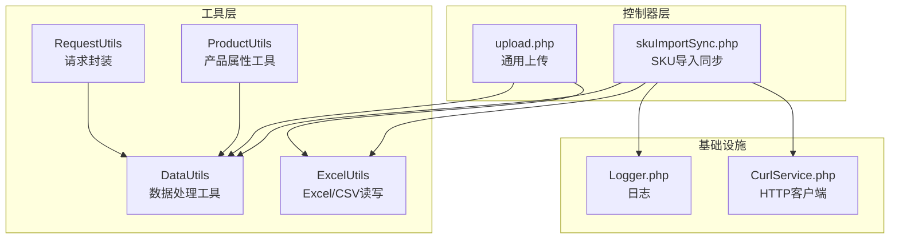
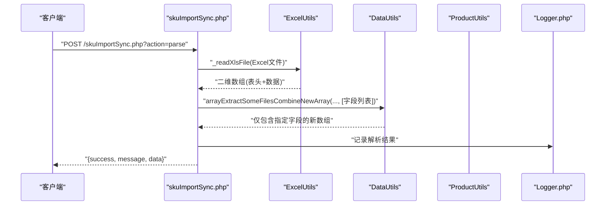
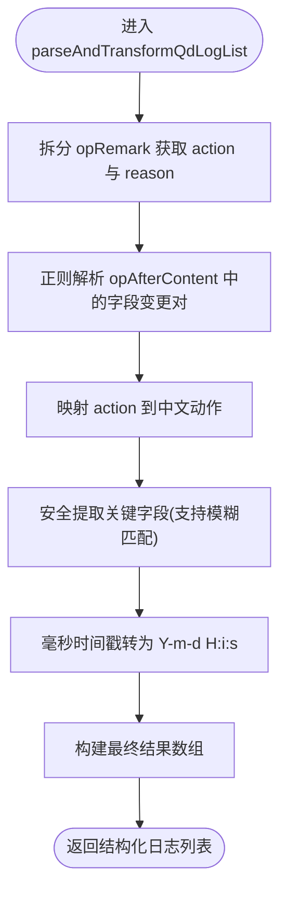
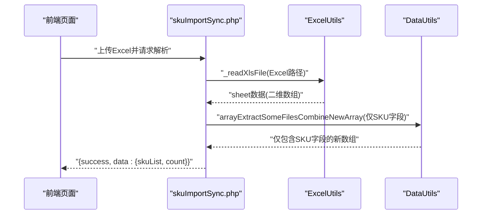
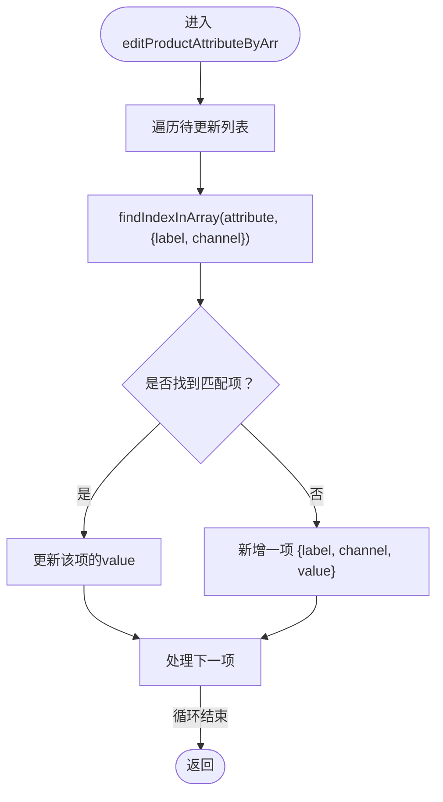
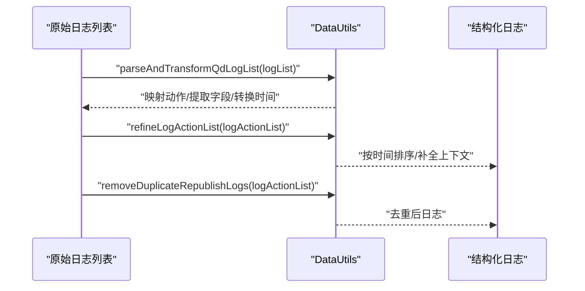
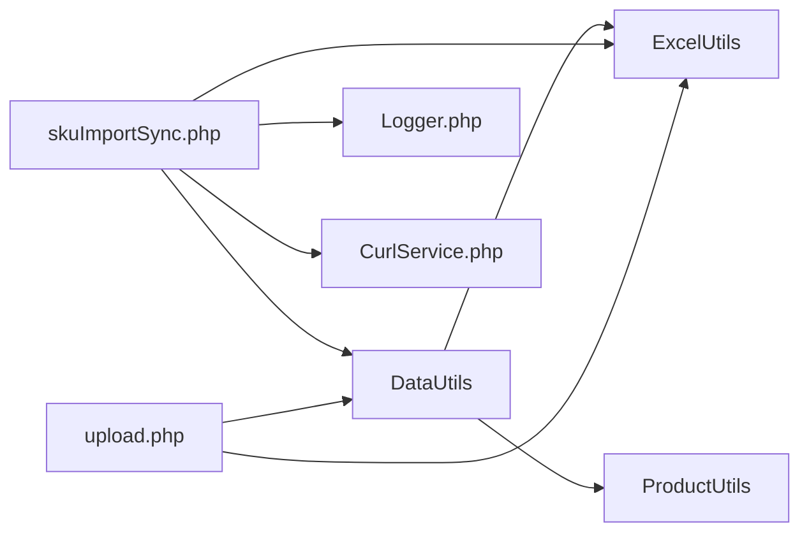

# 数据处理工具

<cite>
**本文引用的文件**
- [DataUtils.php](file://php/utils/DataUtils.php)
- [ExcelUtils.php](file://php/utils/ExcelUtils.php)
- [ProductUtils.php](file://php/utils/ProductUtils.php)
- [skuImportSync.php](file://php/controller/skuImportSync.php)
- [upload.php](file://php/controller/upload.php)
- [Logger.php](file://php/class/Logger.php)
- [CurlService.php](file://php/curl/CurlService.php)
- [RequestUtils.php](file://php/utils/RequestUtils.php)
</cite>

## 目录
1. [简介](#简介)
2. [项目结构](#项目结构)
3. [核心组件](#核心组件)
4. [架构总览](#架构总览)
5. [详细组件分析](#详细组件分析)
6. [依赖关系分析](#依赖关系分析)
7. [性能考量](#性能考量)
8. [故障排查指南](#故障排查指南)
9. [结论](#结论)
10. [附录](#附录)

## 简介
本文件围绕 DataUtils 数据处理工具类展开，系统性梳理其在数据验证、格式化、清洗、转换等方面的实现与使用方式，并结合项目中的 SKU 数据导入与同步、产品属性管理等场景，给出实际应用示例与性能优化建议。文档同时提供可视化图示帮助理解组件交互与数据流。

## 项目结构
DataUtils 位于 php/utils 目录，配套的 ExcelUtils 提供读写 Excel/CSV 的能力，ProductUtils 提供产品属性的增删改辅助方法，控制器层 skuImportSync.php 与 upload.php 展示了 DataUtils 在真实业务中的集成使用。

图表来源
- [DataUtils.php](file://php/utils/DataUtils.php#L1-L802)
- [ExcelUtils.php](file://php/utils/ExcelUtils.php#L1-L398)
- [ProductUtils.php](file://php/utils/ProductUtils.php#L1-L127)
- [skuImportSync.php](file://php/controller/skuImportSync.php#L1-L512)
- [upload.php](file://php/controller/upload.php#L1-L138)
- [Logger.php](file://php/class/Logger.php#L1-L200)
- [CurlService.php](file://php/curl/CurlService.php#L1-L200)
- [RequestUtils.php](file://php/utils/RequestUtils.php#L640-L672)

章节来源
- [DataUtils.php](file://php/utils/DataUtils.php#L1-L802)
- [ExcelUtils.php](file://php/utils/ExcelUtils.php#L1-L398)
- [ProductUtils.php](file://php/utils/ProductUtils.php#L1-L127)
- [skuImportSync.php](file://php/controller/skuImportSync.php#L1-L512)
- [upload.php](file://php/controller/upload.php#L1-L138)

## 核心组件
- DataUtils：集中提供响应数据解析、数组字段校验、数组去重与重复检测、字段抽取与重组、日志解析与结构化、动作日志二次整理与去重等能力。
- ExcelUtils：基于 PhpSpreadsheet 的 Excel/CSV 读写工具，解决长数字不丢失、文本格式读取、多工作表读取等常见问题。
- ProductUtils：围绕产品属性 attribute 的增删改辅助，内部大量复用 DataUtils 的数组查询与过滤能力。
- 控制器层：skuImportSync.php 与 upload.php 展示 DataUtils 在上传解析、SKU 同步、日志结构化等场景的实际应用。

章节来源
- [DataUtils.php](file://php/utils/DataUtils.php#L18-L799)
- [ExcelUtils.php](file://php/utils/ExcelUtils.php#L1-L398)
- [ProductUtils.php](file://php/utils/ProductUtils.php#L1-L127)
- [skuImportSync.php](file://php/controller/skuImportSync.php#L1-L512)
- [upload.php](file://php/controller/upload.php#L1-L138)

## 架构总览
DataUtils 作为数据处理中枢，向上承接控制器层的业务请求，向下对接 ExcelUtils 的数据读取与 ProductUtils 的属性操作。其核心职责包括：
- 响应数据规范化：统一从不同接口返回体中提取 result/data/docs 等结构。
- 数据验证与清洗：字段存在性与空值判断、数组去重、重复检测、字段抽取与重组。
- 日志解析与结构化：将复杂日志字符串解析为结构化动作列表，并进行二次整理与去重。
- 编码与格式化：提供 UUID 生成、JSON 输出等辅助能力。

图表来源
- [skuImportSync.php](file://php/controller/skuImportSync.php#L164-L271)
- [ExcelUtils.php](file://php/utils/ExcelUtils.php#L147-L181)
- [DataUtils.php](file://php/utils/DataUtils.php#L325-L335)

## 详细组件分析

### 数据验证与类型转换
- 字段存在性与空值判断
  - 方法：checkArrFilesIsExist(array, field, checkEmpty=true)
  - 作用：检查数组字段是否存在且非空（可配置是否校验空值）
  - 复杂度：O(1)
- 等值判断
  - 方法：checkArrFilesIsExistEqualValue(array, field, value)
  - 作用：检查字段值是否等于给定值
  - 复杂度：O(1)
- 响应数据解析
  - 方法：getResultData、getPageList、getQueryList、getPageDocList、getPageListInFirstData、getPageListInFirstDataV2、getQueryListInFirstDataV3、getNewResultData
  - 作用：从不同接口返回体中提取 result/data/docs 等结构，兼容多种分页/查询格式
  - 复杂度：O(n)，n 为数据条目数

章节来源
- [DataUtils.php](file://php/utils/DataUtils.php#L172-L271)

### 数据格式化与字符串处理
- JSON 输出
  - 方法：jsonEncode(list, option=JSON_UNESCAPED_UNICODE)
  - 作用：输出 JSON，避免 Unicode 转义，便于前端直接消费
- 字符串与日期时间处理
  - parseAndTransformQdLogList：解析 opRemark 与 opAfterContent，提取字段变更对，映射动作，转换毫秒时间戳为标准时间格式
  - refineLogActionList/refineLogActionListV2：按时间排序，补全“重新发布/作废/重新分配”上下文，保证 before/after 字段一致性
  - removeDuplicateRepublishLogs：对“重新发布”日志按关键键去重，保留最早记录
- 复杂日志解析流程（流程图）

图表来源
- [DataUtils.php](file://php/utils/DataUtils.php#L453-L563)

章节来源
- [DataUtils.php](file://php/utils/DataUtils.php#L273-L563)

### 数据清洗与去重
- 数组对象去重
  - 方法：clearRepeatData(array)
  - 机制：使用 md5(serialize(item)) 作为唯一键，避免浅比较导致的误判
  - 复杂度：O(n)，n 为数组长度
- 重复检测
  - 方法：hasDuplicates(array)
  - 机制：序列化对象作为键，O(1) 检测是否已存在
  - 复杂度：O(n)
- 字段抽取与重组
  - 方法：arrayExtractSomeFilesCombineNewArray(originArray, fieldsToExtract)
  - 作用：从原数组对象中仅提取指定字段，生成新的数组对象
  - 复杂度：O(n*m)，n 为数组长度，m 为字段数

章节来源
- [DataUtils.php](file://php/utils/DataUtils.php#L283-L335)

### 数据转换与编码
- UUID 生成
  - 方法：buildGenerateUuidLike()
  - 作用：生成十六进制 UUID 风格字符串，用于文件命名等场景
- 数组转换
  - findIndexInArray/findIndexDataInArray：按多条件过滤数组，返回匹配项集合
  - getArrHeadData：取数组首元素
  - getCreateReturnId：从创建接口响应中提取主键（支持 _id）
- 编码转换
  - ExcelUtils：针对长数字采用文本格式读取，避免科学计数法丢失精度

章节来源
- [DataUtils.php](file://php/utils/DataUtils.php#L337-L339)
- [ExcelUtils.php](file://php/utils/ExcelUtils.php#L366-L394)

### 实际使用示例

#### 场景一：SKU 数据导入与解析
- 控制器：skuImportSync.php
  - 解析 Excel：调用 ExcelUtils._readXlsFile 获取二维数组
  - 字段抽取：使用 DataUtils.arrayExtractSomeFilesCombineNewArray 仅保留 SKU ID 等必要字段
  - 去重：array_unique 对 SKU 列进行去重
  - 结果返回：封装为 {success, message, data.skuList, count}

图表来源
- [skuImportSync.php](file://php/controller/skuImportSync.php#L164-L271)
- [ExcelUtils.php](file://php/utils/ExcelUtils.php#L147-L181)
- [DataUtils.php](file://php/utils/DataUtils.php#L325-L335)

章节来源
- [skuImportSync.php](file://php/controller/skuImportSync.php#L164-L271)

#### 场景二：产品属性批量编辑
- 工具：ProductUtils.editProductAttributeByArr
  - 内部使用 DataUtils.findIndexInArray 定位匹配项，存在则更新，不存在则新增
  - 适合批量更新 attribute 中的 label/channel/value 组合

图表来源
- [ProductUtils.php](file://php/utils/ProductUtils.php#L42-L62)
- [DataUtils.php](file://php/utils/DataUtils.php#L183-L219)

章节来源
- [ProductUtils.php](file://php/utils/ProductUtils.php#L23-L62)

#### 场景三：日志结构化与二次整理
- DataUtils.parseAndTransformQdLogList：解析复杂日志字符串，映射动作，提取字段变更，转换时间戳
- refineLogActionList/refineLogActionListV2：按时间排序，补全“重新发布/作废/重新分配”的上下文
- removeDuplicateRepublishLogs：对“重新发布”日志按关键键去重，保留最早记录

图表来源
- [DataUtils.php](file://php/utils/DataUtils.php#L453-L563)
- [DataUtils.php](file://php/utils/DataUtils.php#L572-L649)
- [DataUtils.php](file://php/utils/DataUtils.php#L756-L798)

章节来源
- [DataUtils.php](file://php/utils/DataUtils.php#L453-L798)

## 依赖关系分析
- DataUtils 与 ExcelUtils：在 SKU 导入解析中，DataUtils 负责字段抽取与清洗，ExcelUtils 负责读取 Excel/CSV。
- DataUtils 与 ProductUtils：ProductUtils 的属性编辑依赖 DataUtils 的数组查询与过滤能力。
- 控制器层与基础设施：skuImportSync.php 依赖 Logger.php 记录日志，CurlService.php 发起跨环境同步请求。

图表来源
- [DataUtils.php](file://php/utils/DataUtils.php#L1-L802)
- [ExcelUtils.php](file://php/utils/ExcelUtils.php#L1-L398)
- [ProductUtils.php](file://php/utils/ProductUtils.php#L1-L127)
- [skuImportSync.php](file://php/controller/skuImportSync.php#L1-L512)
- [upload.php](file://php/controller/upload.php#L1-L138)
- [Logger.php](file://php/class/Logger.php#L1-L200)
- [CurlService.php](file://php/curl/CurlService.php#L1-L200)

章节来源
- [DataUtils.php](file://php/utils/DataUtils.php#L1-L802)
- [ExcelUtils.php](file://php/utils/ExcelUtils.php#L1-L398)
- [ProductUtils.php](file://php/utils/ProductUtils.php#L1-L127)
- [skuImportSync.php](file://php/controller/skuImportSync.php#L1-L512)
- [upload.php](file://php/controller/upload.php#L1-L138)

## 性能考量
- 数组去重与重复检测
  - 使用 serialize(md5) 作为键，避免浅比较误判，但序列化成本较高。对于超大数组，建议：
    - 优先在上游（如数据库/接口）去重
    - 使用哈希表（关联数组）存储已见过的对象键，O(1) 检测
- 字段抽取与重组
  - array_map + array_intersect_key 的组合在大数据量时仍较高效，注意字段列表较小且稳定
- 日志解析
  - 正则匹配与多轮遍历可能带来性能压力，建议：
    - 预编译正则表达式（如可用 PCRE JIT）
    - 分批处理日志，避免一次性加载全部
    - 对高频字段建立映射表，减少模糊匹配次数
- Excel 读取
  - ExcelUtils 已采用 PhpSpreadsheet 的内存友好方式，避免手动设置缓存；仍建议：
    - 控制并发读取数量
    - 对长数字采用文本格式读取，避免科学计数法导致的精度问题

[本节为通用性能建议，不直接分析具体文件]

## 故障排查指南
- Excel 读取异常
  - 现象：读取结果为空或字段缺失
  - 排查要点：确认文件格式、表头是否在第一行、是否存在隐藏列/空行
  - 参考实现：ExcelUtils._readXlsFileV2 逐列读取并处理富文本与长数字
- 长数字丢失
  - 现象：Excel 中的长数字（如 UPC/订单号）被转为科学计数法
  - 处理：ExcelUtils._getCellValueV2 中根据单元格格式与长度判断，必要时强制转为字符串
- 日志解析不准确
  - 现象：字段名包含不可见字符或空格，导致映射失败
  - 处理：parseAndTransformQdLogList 中对字段名进行清理与模糊匹配
- 同步失败
  - 现象：SKU 同步到目标环境失败
  - 排查要点：检查目标环境连接、权限、网络；查看 Logger.php 日志定位错误位置
  - 参考实现：skuImportSync.php 中对删除与创建过程分别记录日志

章节来源
- [ExcelUtils.php](file://php/utils/ExcelUtils.php#L315-L394)
- [DataUtils.php](file://php/utils/DataUtils.php#L453-L563)
- [skuImportSync.php](file://php/controller/skuImportSync.php#L303-L426)

## 结论
DataUtils 以“响应数据规范化 + 数组清洗 + 日志结构化 + 编码转换”为核心能力，广泛支撑 SKU 导入解析、产品属性管理、跨环境数据同步等场景。通过与 ExcelUtils、ProductUtils、Logger、CurlService 的协作，形成完整的数据处理闭环。建议在大规模数据场景下进一步优化去重与日志解析的性能，并持续完善错误日志与监控告警。

[本节为总结性内容，不直接分析具体文件]

## 附录

### 常用方法速览
- 响应数据解析
  - getResultData、getPageList、getQueryList、getPageDocList、getPageListInFirstData、getPageListInFirstDataV2、getQueryListInFirstDataV3、getNewResultData
- 数据验证
  - checkArrFilesIsExist、checkArrFilesIsExistEqualValue
- 清洗与去重
  - clearRepeatData、hasDuplicates、arrayExtractSomeFilesCombineNewArray
- 日志解析与整理
  - parseAndTransformQdLogList、refineLogActionList、refineLogActionListV2、removeDuplicateRepublishLogs
- 编码与格式化
  - jsonEncode、buildGenerateUuidLike

章节来源
- [DataUtils.php](file://php/utils/DataUtils.php#L18-L799)