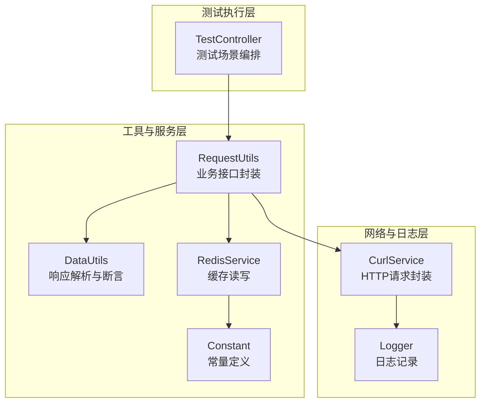
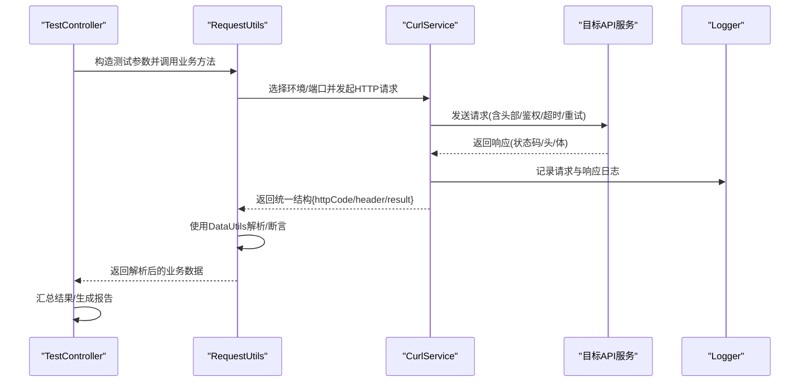
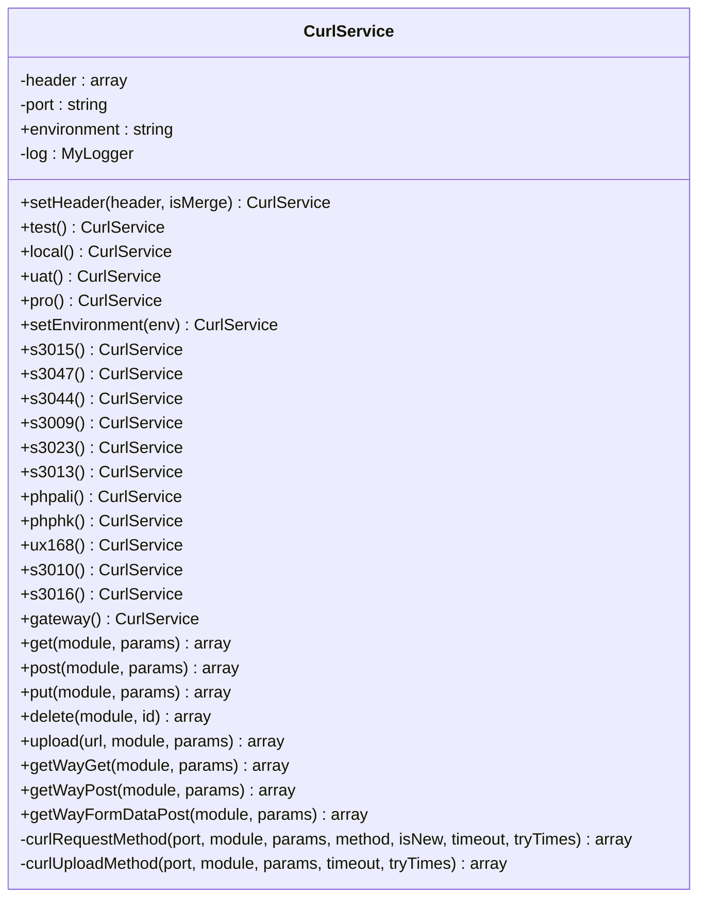
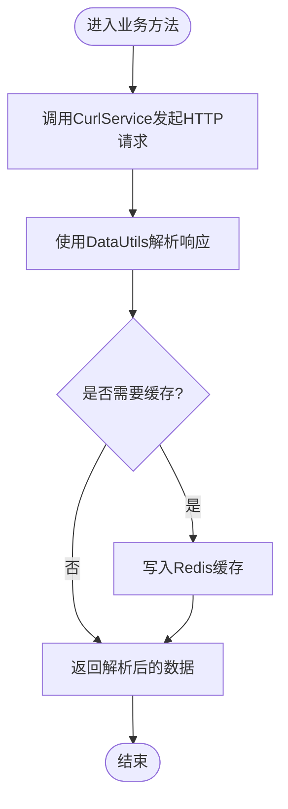
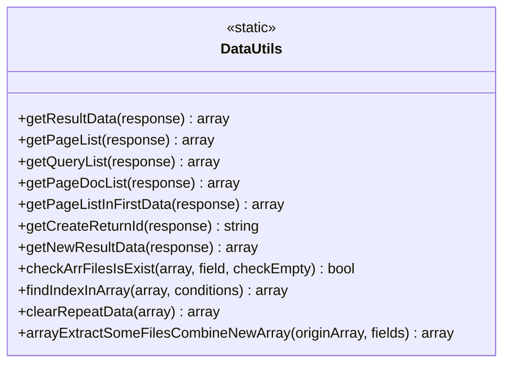
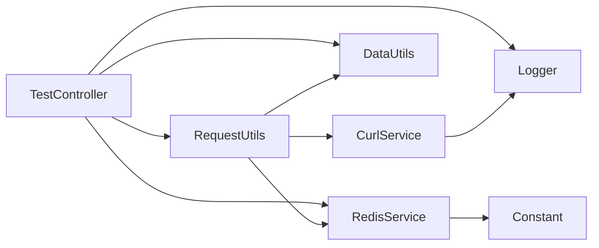

# API测试控制器

<cite>
**本文引用的文件**
- [CurlService.php](file://php/curl/CurlService.php)
- [Logger.php](file://php/class/Logger.php)
- [RequestUtils.php](file://php/utils/RequestUtils.php)
- [DataUtils.php](file://php/utils/DataUtils.php)
- [RedisService.php](file://php/redis/RedisService.php)
- [Constant.php](file://php/constant/Constant.php)
- [TestController.php](file://php/shell/TestController.php)
</cite>

## 目录
1. [简介](#简介)
2. [项目结构](#项目结构)
3. [核心组件](#核心组件)
4. [架构总览](#架构总览)
5. [详细组件分析](#详细组件分析)
6. [依赖关系分析](#依赖关系分析)
7. [性能考量](#性能考量)
8. [故障排查指南](#故障排查指南)
9. [结论](#结论)
10. [附录](#附录)

## 简介
本文件面向“API测试控制器”的设计与实现，系统性阐述基于PHP的HTTP测试框架如何完成对外部API的调用、响应验证与性能观测，以及测试参数配置、测试场景定义、结果记录与报告生成、与外部服务交互及测试环境隔离机制。文档同时给出测试自动化与持续集成的应用建议，并提供最佳实践与故障排查方法。

## 项目结构
围绕API测试控制器的关键模块如下：
- HTTP请求层：CurlService负责统一的HTTP请求封装、环境切换、头部与鉴权注入、重试与超时控制、日志记录。
- 工具层：RequestUtils将具体业务接口抽象为方法，DataUtils负责统一响应数据解析与校验。
- 缓存层：RedisService提供用户与分类等缓存能力，降低重复请求成本。
- 常量层：Constant集中管理Redis连接常量。
- 测试执行层：TestController提供测试场景编排、参数构造、结果汇总与报告输出。

图表来源
- [TestController.php](file://php/shell/TestController.php)
- [RequestUtils.php](file://php/utils/RequestUtils.php)
- [DataUtils.php](file://php/utils/DataUtils.php)
- [RedisService.php](file://php/redis/RedisService.php)
- [Constant.php](file://php/constant/Constant.php)
- [CurlService.php](file://php/curl/CurlService.php)
- [Logger.php](file://php/class/Logger.php)

章节来源
- [CurlService.php](file://php/curl/CurlService.php#L1-L996)
- [RequestUtils.php](file://php/utils/RequestUtils.php#L1-L672)
- [DataUtils.php](file://php/utils/DataUtils.php#L1-L802)
- [RedisService.php](file://php/redis/RedisService.php#L1-L77)
- [Constant.php](file://php/constant/Constant.php#L1-L26)
- [TestController.php](file://php/shell/TestController.php)

## 核心组件
- CurlService：统一HTTP客户端，支持多环境（local/test/uat/pro）、多种端口路由、GET/POST/PUT/DELETE/上传等方法，内置重试与超时、日志记录、鉴权头注入。
- RequestUtils：业务接口适配层，将底层CurlService封装为具体的业务方法（如分页查询、详情读取、更新、删除、批量查询等），并使用DataUtils进行响应标准化。
- DataUtils：统一响应解析工具，提供分页列表、查询列表、首条数据、创建返回ID、新架构响应解析、数组去重与字段抽取等能力。
- RedisService：Redis客户端封装，提供hash与通用键值操作，用于用户信息、分类信息等缓存。
- Logger：日志工具，自动创建目录并写入文件，便于测试请求与响应追踪。
- TestController：测试场景编排入口，负责参数构造、并发/串行策略、结果聚合与报告输出。

章节来源
- [CurlService.php](file://php/curl/CurlService.php#L1-L996)
- [RequestUtils.php](file://php/utils/RequestUtils.php#L1-L672)
- [DataUtils.php](file://php/utils/DataUtils.php#L1-L802)
- [RedisService.php](file://php/redis/RedisService.php#L1-L77)
- [Logger.php](file://php/class/Logger.php#L1-L77)
- [TestController.php](file://php/shell/TestController.php)

## 架构总览
API测试控制器采用“请求适配层 + 业务封装层 + 数据解析层 + 缓存层 + 日志层”的分层架构，通过CurlService统一封装HTTP请求，RequestUtils将业务接口标准化，DataUtils统一解析响应，RedisService提供缓存加速，Logger记录请求与响应细节，TestController负责测试场景编排与报告生成。

图表来源
- [TestController.php](file://php/shell/TestController.php)
- [RequestUtils.php](file://php/utils/RequestUtils.php#L1-L672)
- [CurlService.php](file://php/curl/CurlService.php#L664-L740)
- [Logger.php](file://php/class/Logger.php#L39-L49)

## 详细组件分析

### CurlService 组件分析
- 环境与端口管理：支持local/test/uat/pro四套环境，每套环境映射不同主机与端口，可通过链式方法选择模块与环境。
- HTTP方法封装：提供get/post/put/delete/upload/getWayGet/getWayPost/getWayFormDataPost等方法，统一处理URL拼接、参数编码、头部设置与响应解析。
- 鉴权与头部：默认注入Content-Type、Trace ID、Expect等头部；gateway模式自动注入Authorization头；支持自定义头部合并或覆盖。
- 重试与超时：请求失败时可按配置重试，设置超时时间，避免长时间阻塞。
- 日志记录：请求与参数通过Logger写入独立日志文件，便于问题定位。

图表来源
- [CurlService.php](file://php/curl/CurlService.php#L4-L996)

章节来源
- [CurlService.php](file://php/curl/CurlService.php#L1-L996)

### RequestUtils 组件分析
- 业务接口适配：将底层CurlService封装为具体业务方法，如分页查询、详情读取、更新、删除、创建、批量查询等。
- 响应解析：统一使用DataUtils进行响应解析，保证不同接口返回格式的一致性。
- 缓存集成：对用户信息、分类信息等调用RedisService进行缓存读写，减少重复请求。
- 示例方法（节选）：getPaProductPageList/readPaProductInfo/updatePaProductInfo/deletePaProduct、getPaProductDetailPageList/readPaProductDetailInfo/updatePaProductDetailInfo/deletePaProductDetail/createPaProductDetail、getUserSheetByUserName/getEmployeeByCompanySequenceId等。

图表来源
- [RequestUtils.php](file://php/utils/RequestUtils.php#L1-L672)
- [DataUtils.php](file://php/utils/DataUtils.php#L1-L802)
- [RedisService.php](file://php/redis/RedisService.php#L1-L77)

章节来源
- [RequestUtils.php](file://php/utils/RequestUtils.php#L1-L672)

### DataUtils 组件分析
- 统一解析：提供getResultData/getPageList/getQueryList/getPageDocList/getCreateReturnId/getNewResultData等静态方法，屏蔽不同接口返回格式差异。
- 断言与辅助：提供checkArrFilesIsExist/checkArrFilesIsExistEqualValue/findIndexInArray/findIndexDataInArray等辅助方法，便于断言与数据筛选。
- 数组处理：提供clearRepeatData/hasDuplicates/arrayExtractSomeFilesCombineNewArray等数组处理方法，支持去重与字段抽取。

图表来源
- [DataUtils.php](file://php/utils/DataUtils.php#L1-L802)

章节来源
- [DataUtils.php](file://php/utils/DataUtils.php#L1-L802)

### RedisService 与 Constant 组件分析
- RedisService：提供hSet/hGet/hGetAll/set/del/incr/expire等常用操作，配合Constant中的Redis连接常量使用。
- Constant：集中定义Redis主机、端口、密码与各类缓存键名，便于统一管理与维护。

章节来源
- [RedisService.php](file://php/redis/RedisService.php#L1-L77)
- [Constant.php](file://php/constant/Constant.php#L1-L26)

### Logger 组件分析
- 自动目录创建：根据传入的日志文件路径自动创建目录，避免手动维护。
- 文件写入：将日志写入独立文件，便于测试请求与响应的追踪与回溯。

章节来源
- [Logger.php](file://php/class/Logger.php#L1-L77)

### TestController 组件分析
- 场景编排：负责测试参数构造、并发/串行策略、结果聚合与报告输出。
- 与工具层协作：通过RequestUtils调用业务接口，借助DataUtils进行断言，使用Logger记录日志，使用RedisService进行缓存。
- 报告生成：汇总测试结果，输出统计信息与异常详情，便于人工复核与自动化归档。

章节来源
- [TestController.php](file://php/shell/TestController.php)

## 依赖关系分析
- CurlService依赖Logger进行日志记录。
- RequestUtils依赖CurlService进行HTTP请求，并依赖DataUtils进行响应解析，同时可依赖RedisService进行缓存。
- DataUtils为纯静态工具类，被RequestUtils广泛使用。
- RedisService依赖Constant中的Redis连接常量。
- TestController依赖RequestUtils、DataUtils、Logger、RedisService等组件。

图表来源
- [CurlService.php](file://php/curl/CurlService.php#L1-L996)
- [RequestUtils.php](file://php/utils/RequestUtils.php#L1-L672)
- [DataUtils.php](file://php/utils/DataUtils.php#L1-L802)
- [RedisService.php](file://php/redis/RedisService.php#L1-L77)
- [Constant.php](file://php/constant/Constant.php#L1-L26)
- [TestController.php](file://php/shell/TestController.php)

章节来源
- [CurlService.php](file://php/curl/CurlService.php#L1-L996)
- [RequestUtils.php](file://php/utils/RequestUtils.php#L1-L672)
- [DataUtils.php](file://php/utils/DataUtils.php#L1-L802)
- [RedisService.php](file://php/redis/RedisService.php#L1-L77)
- [Constant.php](file://php/constant/Constant.php#L1-L26)
- [TestController.php](file://php/shell/TestController.php)

## 性能考量
- 连接与超时：CurlService默认设置超时时间与重试次数，避免长时间阻塞；可根据接口特性调整超时与重试策略。
- 缓存优化：通过RedisService对高频查询（如用户信息、分类信息）进行缓存，减少重复请求，提升整体性能。
- 批量处理：RequestUtils对批量查询采用分片（chunk）策略，降低单次请求压力，提高吞吐量。
- 日志开销：Logger写入磁盘会产生IO开销，建议在高并发场景下合理控制日志级别与频率。

## 故障排查指南
- 环境配置错误：确认CurlService的环境设置（local/test/uat/pro）与目标端口映射正确，避免请求发往错误地址。
- 鉴权失败：gateway模式下需确保Authorization头正确注入；如使用自定义token，需通过getUcToken传入。
- 响应解析异常：使用DataUtils提供的断言方法（如checkArrFilesIsExist）快速定位缺失字段；必要时打印原始响应结构进行分析。
- 缓存一致性：Redis缓存可能导致数据延迟，必要时清理相关键或缩短过期时间。
- 日志定位：通过Logger记录的请求与参数快速定位问题；关注httpCode与响应体中的错误信息。
- 网络波动：适当增加重试次数与超时时间，避免偶发抖动影响测试稳定性。

章节来源
- [CurlService.php](file://php/curl/CurlService.php#L664-L740)
- [DataUtils.php](file://php/utils/DataUtils.php#L172-L231)
- [Logger.php](file://php/class/Logger.php#L39-L49)
- [RedisService.php](file://php/redis/RedisService.php#L29-L35)

## 结论
API测试控制器通过分层架构实现了对外部API的统一调用、标准化响应解析与缓存优化，结合日志与测试场景编排，能够高效地完成接口调用测试、响应验证与性能观测。通过合理的环境隔离与参数配置，可在不同环境中稳定运行，并为持续集成提供可靠支撑。

## 附录

### 测试参数与场景定义
- 环境参数：通过CurlService的test/local/uat/pro方法切换环境，或使用setEnvironment自定义环境。
- 端口参数：通过链式方法选择目标端口（如s3015/s3047/s3044/s3009/s3023/s3013/phpali/phphk/ux168/s3010/s3016/gateway/aiCategoryApi）。
- 鉴权参数：gateway模式自动注入Authorization头；也可通过getUcToken传入自定义token。
- 重试与超时：通过curlRequestMethod/curlUploadMethod的timeout与tryTimes参数控制。

章节来源
- [CurlService.php](file://php/curl/CurlService.php#L98-L143)
- [CurlService.php](file://php/curl/CurlService.php#L441-L458)
- [CurlService.php](file://php/curl/CurlService.php#L664-L740)

### 测试API接口文档（示例）
以下为典型接口的测试参数、预期结果与验证规则（以RequestUtils中的方法为例）：

- 分页查询（示例：pa_products/queryPage）
  - 请求方法：GET
  - 参数：支持分页与过滤条件（如batchName/batchName_in等）
  - 预期结果：httpCode为200，result包含data字段且为数组
  - 验证规则：使用DataUtils.getPageList断言返回列表非空
  - 参考路径：[RequestUtils.php](file://php/utils/RequestUtils.php#L19-L22)

- 详情读取（示例：pa_products/{id}）
  - 请求方法：GET
  - 参数：id为主键
  - 预期结果：httpCode为200，result为对象
  - 验证规则：使用DataUtils.getQueryList断言返回对象非空
  - 参考路径：[RequestUtils.php](file://php/utils/RequestUtils.php#L24-L27)

- 更新（示例：pa_products/{_id}）
  - 请求方法：PUT
  - 参数：包含_id与更新字段
  - 预期结果：httpCode为200，result为更新后的数据
  - 验证规则：使用DataUtils.getResultData断言返回数据
  - 参考路径：[RequestUtils.php](file://php/utils/RequestUtils.php#L29-L32)

- 删除（示例：pa_products/{id}）
  - 请求方法：DELETE
  - 参数：id为主键
  - 预期结果：httpCode为200
  - 验证规则：使用DataUtils.getResultData断言返回成功状态
  - 参考路径：[RequestUtils.php](file://php/utils/RequestUtils.php#L34-L37)

- 批量查询（示例：product-skus/queryPage）
  - 请求方法：GET
  - 参数：productId_in与limit
  - 预期结果：httpCode为200，返回分页列表
  - 验证规则：使用DataUtils.getPageList断言返回列表
  - 参考路径：[RequestUtils.php](file://php/utils/RequestUtils.php#L255-L268)

- 用户信息缓存（示例：system-manages/getUserSheetByUserName）
  - 请求方法：GET
  - 参数：userName与status
  - 预期结果：httpCode为200，返回用户信息
  - 验证规则：使用DataUtils.getResultData断言返回对象；Redis缓存命中率可作为性能指标
  - 参考路径：[RequestUtils.php](file://php/utils/RequestUtils.php#L181-L207)

### 测试自动化与持续集成
- 参数化：通过配置文件或命令行参数传入测试场景与参数，结合CurlService的环境切换实现多环境自动化。
- 并发策略：在TestController中实现并发/串行策略，平衡吞吐与稳定性。
- 报告输出：汇总测试结果，输出统计信息与异常详情，便于CI系统归档与告警。
- 缓存与日志：合理使用Redis缓存与Logger，降低测试成本并提升可观测性。

章节来源
- [TestController.php](file://php/shell/TestController.php)
- [RequestUtils.php](file://php/utils/RequestUtils.php#L1-L672)
- [RedisService.php](file://php/redis/RedisService.php#L1-L77)
- [Logger.php](file://php/class/Logger.php#L1-L77)