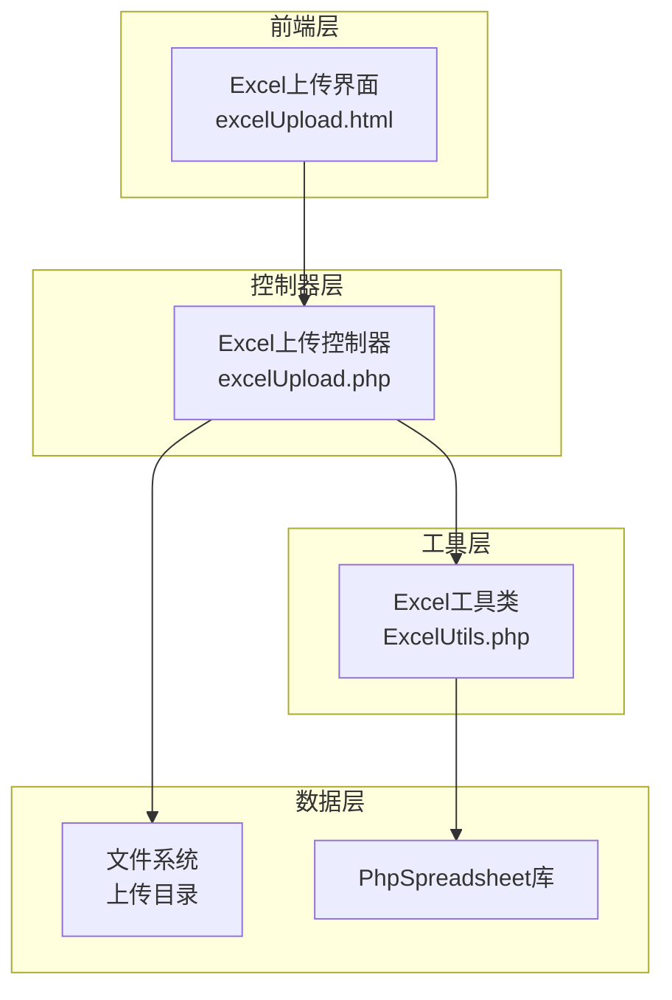
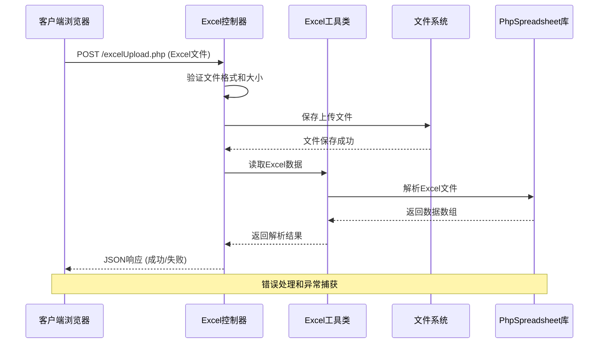
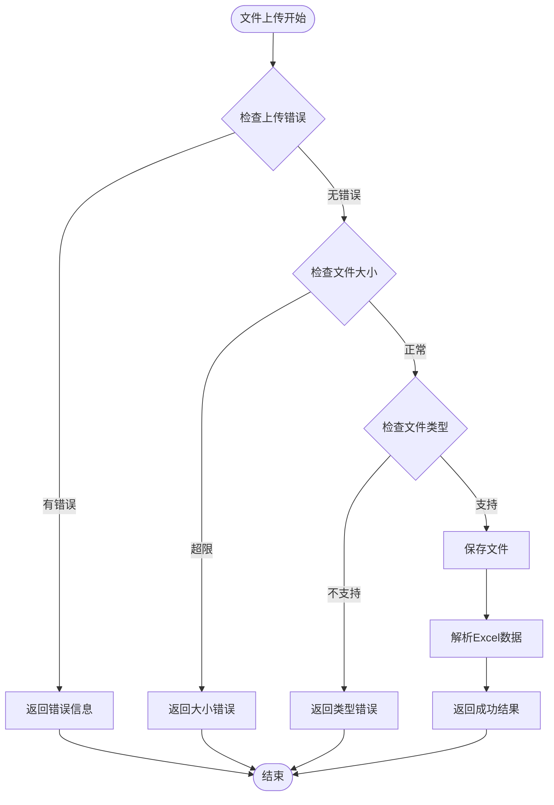
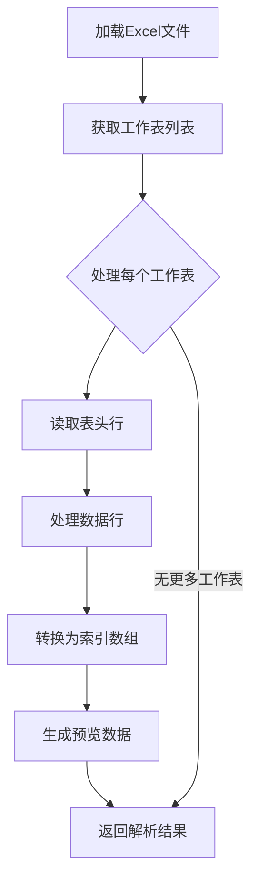
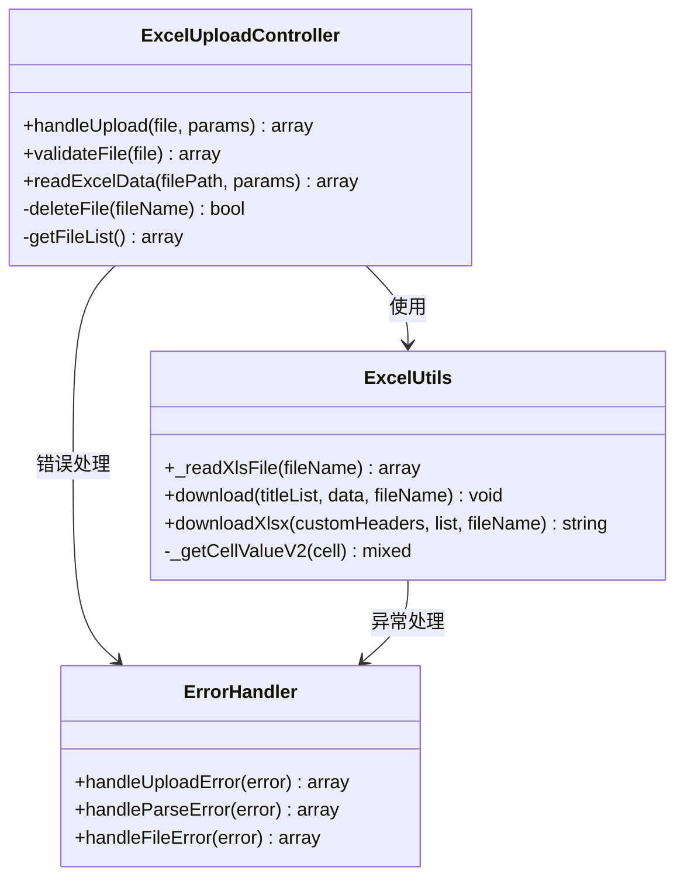
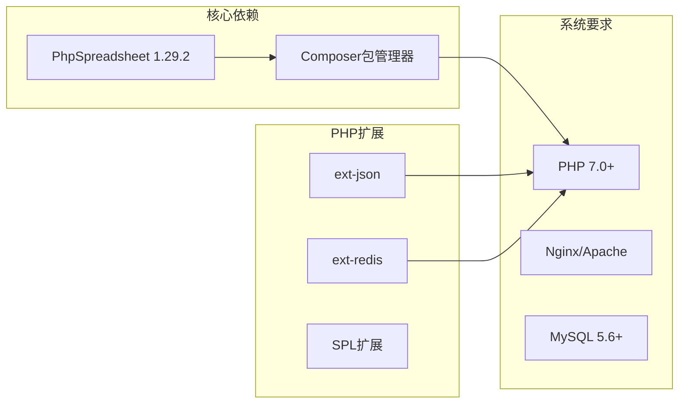
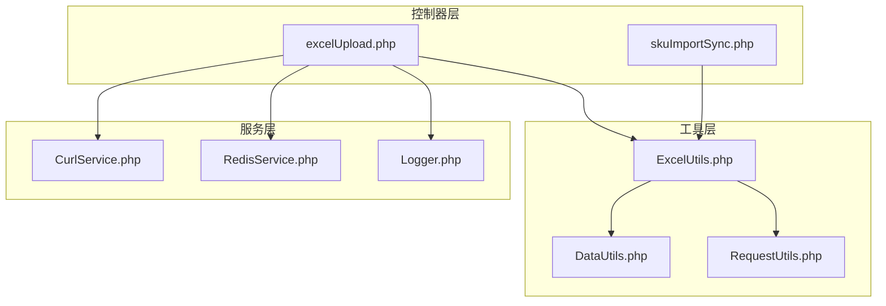
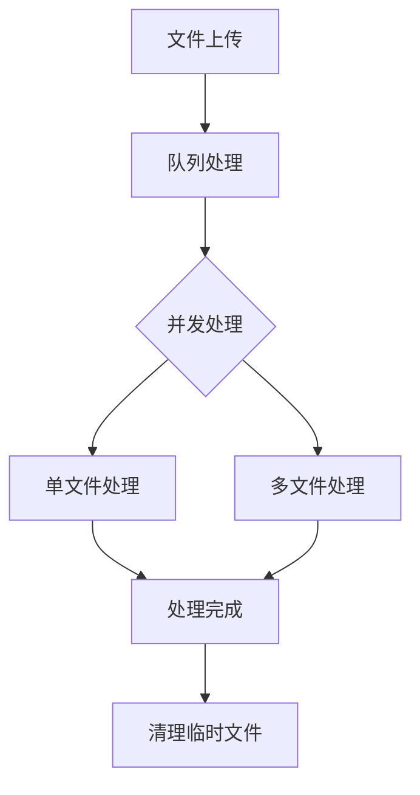

# Excel文件上传控制器

<cite>
**本文档引用的文件**
- [excelUpload.php](file://php/controller/excelUpload.php)
- [ExcelUtils.php](file://php/utils/ExcelUtils.php)
- [excelUpload.html](file://template/excelUpload.html)
- [composer.json](file://composer.json)
- [requiredChorm.php](file://php/requiredfile/requiredChorm.php)
- [skuImportSync.php](file://php/controller/skuImportSync.php)
</cite>

## 目录
1. [简介](#简介)
2. [项目结构](#项目结构)
3. [核心组件](#核心组件)
4. [架构概览](#架构概览)
5. [详细组件分析](#详细组件分析)
6. [依赖关系分析](#依赖关系分析)
7. [性能考虑](#性能考虑)
8. [故障排除指南](#故障排除指南)
9. [结论](#结论)

## 简介

Excel文件上传控制器是一个基于PHP的Web应用程序模块，专门用于处理Excel文件的上传、验证、解析和数据提取。该系统集成了PhpSpreadsheet库来处理各种Excel格式（xlsx和xls），提供了完整的文件上传流程管理和错误处理机制。

该控制器支持单文件和多文件上传，具有严格的安全验证措施，包括文件类型限制、大小限制和内容验证。通过与ExcelUtils工具类的深度集成，实现了高效的数据读取和处理功能。

## 项目结构

该项目采用分层架构设计，主要包含以下核心组件：

**图表来源**
- [excelUpload.php](file://php/controller/excelUpload.php#L1-L372)
- [ExcelUtils.php](file://php/utils/ExcelUtils.php#L1-L398)
- [excelUpload.html](file://template/excelUpload.html#L1-L472)

**章节来源**
- [excelUpload.php](file://php/controller/excelUpload.php#L1-L30)
- [ExcelUtils.php](file://php/utils/ExcelUtils.php#L1-L30)
- [excelUpload.html](file://template/excelUpload.html#L1-L50)

## 核心组件

### Excel上传控制器 (excelUpload)

Excel上传控制器是整个系统的核心，负责处理Excel文件的完整生命周期管理：

- **文件接收**: 处理HTTP POST请求中的文件上传
- **格式验证**: 验证文件类型、大小和格式有效性
- **数据解析**: 使用PhpSpreadsheet库读取Excel内容
- **存储机制**: 将文件保存到指定目录并返回处理结果

### Excel工具类 (ExcelUtils)

Excel工具类提供了丰富的Excel文件处理功能：

- **文件读取**: 支持xlsx和xls格式的Excel文件读取
- **数据提取**: 将Excel数据转换为PHP数组格式
- **格式处理**: 处理长数字、富文本等特殊数据格式
- **导出功能**: 提供Excel文件导出能力

### 前端界面 (excelUpload.html)

提供用户友好的Excel文件上传界面：

- **拖拽上传**: 支持拖拽和点击两种上传方式
- **实时预览**: 展示上传进度和文件状态
- **数据可视化**: 显示Excel文件的表头和预览数据
- **配置选项**: 支持是否包含表头和预览行数设置

**章节来源**
- [excelUpload.php](file://php/controller/excelUpload.php#L11-L328)
- [ExcelUtils.php](file://php/utils/ExcelUtils.php#L20-L398)
- [excelUpload.html](file://template/excelUpload.html#L112-L283)

## 架构概览

Excel文件上传系统的整体架构采用MVC模式，实现了清晰的职责分离：

**图表来源**
- [excelUpload.php](file://php/controller/excelUpload.php#L35-L95)
- [ExcelUtils.php](file://php/utils/ExcelUtils.php#L147-L181)

**章节来源**
- [excelUpload.php](file://php/controller/excelUpload.php#L331-L372)
- [ExcelUtils.php](file://php/utils/ExcelUtils.php#L147-L181)

## 详细组件分析

### 文件验证机制

控制器实现了多层次的文件验证机制：

**图表来源**
- [excelUpload.php](file://php/controller/excelUpload.php#L102-L140)

#### 验证规则说明

1. **上传错误检查**: 检查PHP上传常量，处理各种上传失败情况
2. **大小限制**: 默认10MB限制，防止大文件占用过多资源
3. **文件类型验证**: 仅允许xlsx和xls格式
4. **安全检查**: 验证文件路径和权限

**章节来源**
- [excelUpload.php](file://php/controller/excelUpload.php#L102-L140)

### Excel数据解析流程

Excel文件解析过程采用分步处理策略：

**图表来源**
- [ExcelUtils.php](file://php/utils/ExcelUtils.php#L147-L181)
- [excelUpload.php](file://php/controller/excelUpload.php#L148-L238)

#### 数据处理特性

1. **多工作表支持**: 自动处理多个工作表的数据
2. **动态表头**: 第一行作为表头，后续行作为数据
3. **预览功能**: 支持可配置的预览行数
4. **数据类型处理**: 自动识别和处理不同数据类型

**章节来源**
- [ExcelUtils.php](file://php/utils/ExcelUtils.php#L147-L181)
- [excelUpload.php](file://php/controller/excelUpload.php#L183-L216)

### 错误处理机制

系统实现了全面的错误处理策略：

**图表来源**
- [excelUpload.php](file://php/controller/excelUpload.php#L11-L328)
- [ExcelUtils.php](file://php/utils/ExcelUtils.php#L20-L398)

#### 错误分类处理

1. **上传错误**: 文件大小、格式、权限等问题
2. **解析错误**: Excel文件损坏、格式不兼容
3. **系统错误**: 服务器异常、数据库连接失败
4. **业务错误**: 数据验证失败、格式不匹配

**章节来源**
- [excelUpload.php](file://php/controller/excelUpload.php#L88-L94)
- [ExcelUtils.php](file://php/utils/ExcelUtils.php#L227-L237)

## 依赖关系分析

### 外部依赖

系统依赖以下关键组件：

**图表来源**
- [composer.json](file://composer.json#L1-L11)

### 内部依赖关系

**图表来源**
- [excelUpload.php](file://php/controller/excelUpload.php#L1-L5)
- [requiredChorm.php](file://php/requiredfile/requiredChorm.php#L1-L10)

**章节来源**
- [composer.json](file://composer.json#L1-L11)
- [requiredChorm.php](file://php/requiredfile/requiredChorm.php#L1-L10)

## 性能考虑

### 内存管理

系统在处理大型Excel文件时采用了多项优化策略：

1. **流式处理**: 使用PhpSpreadsheet的流式读取功能
2. **分页预览**: 默认只显示前10行数据进行预览
3. **内存监控**: 实时监控内存使用情况
4. **垃圾回收**: 及时释放不再使用的变量

### 并发处理

**图表来源**
- [excelUpload.php](file://php/controller/excelUpload.php#L246-L289)

### 缓存策略

系统支持多种缓存机制：

1. **文件缓存**: 上传文件的临时缓存
2. **数据缓存**: 解析后的数据缓存
3. **配置缓存**: 用户配置的缓存
4. **会话缓存**: 用户会话状态管理

## 故障排除指南

### 常见问题及解决方案

#### 文件上传失败

| 问题类型 | 错误代码 | 可能原因 | 解决方案 |
|---------|---------|---------|---------|
| 上传错误 | UPLOAD_ERR_INI_SIZE | 超过服务器限制 | 调整php.ini配置 |
| 上传错误 | UPLOAD_ERR_FORM_SIZE | 超过表单限制 | 增加表单大小限制 |
| 上传错误 | UPLOAD_ERR_PARTIAL | 文件部分上传 | 检查网络连接稳定性 |
| 上传错误 | UPLOAD_ERR_NO_FILE | 未选择文件 | 确认文件选择操作 |
| 上传错误 | UPLOAD_ERR_NO_TMP_DIR | 临时目录问题 | 检查临时目录权限 |

#### Excel文件解析错误

| 错误类型 | 错误信息 | 可能原因 | 解决方案 |
|---------|---------|---------|---------|
| 格式不支持 | 不支持的Excel格式 | 文件损坏或格式不兼容 | 使用标准Excel格式 |
| 内容为空 | Excel文件中没有数据 | 工作表为空或数据格式错误 | 检查Excel文件内容 |
| 解析失败 | 读取Excel文件时发生错误 | PhpSpreadsheet库问题 | 更新PhpSpreadsheet版本 |

#### 性能问题

| 问题类型 | 症状 | 解决方案 |
|---------|------|---------|
| 内存不足 | PHP内存耗尽 | 减少预览行数，优化数据处理 |
| 处理缓慢 | Excel文件处理时间过长 | 使用流式处理，分批处理数据 |
| 超时错误 | 请求超时 | 增加PHP执行时间限制 |

**章节来源**
- [excelUpload.php](file://php/controller/excelUpload.php#L105-L119)
- [ExcelUtils.php](file://php/utils/ExcelUtils.php#L227-L237)

### 调试技巧

1. **启用错误日志**: 在php.ini中启用错误日志记录
2. **使用调试工具**: 利用浏览器开发者工具检查网络请求
3. **查看服务器日志**: 检查Apache/Nginx错误日志
4. **单元测试**: 编写针对Excel解析功能的测试用例

## 结论

Excel文件上传控制器是一个功能完整、架构清晰的文件处理系统。它通过以下关键特性确保了系统的可靠性：

1. **安全性**: 多层次的文件验证和安全检查
2. **可靠性**: 全面的错误处理和异常恢复机制
3. **可扩展性**: 模块化的架构设计，易于功能扩展
4. **易用性**: 用户友好的界面和清晰的错误反馈

该系统为Excel文件的上传、验证、解析和处理提供了完整的解决方案，适用于各种企业级应用场景。通过合理的性能优化和错误处理策略，能够满足高并发和大数据量的处理需求。

建议在生产环境中：
- 定期更新PhpSpreadsheet库到最新版本
- 配置适当的文件大小和数量限制
- 实施定期的系统维护和性能监控
- 建立完善的备份和恢复机制