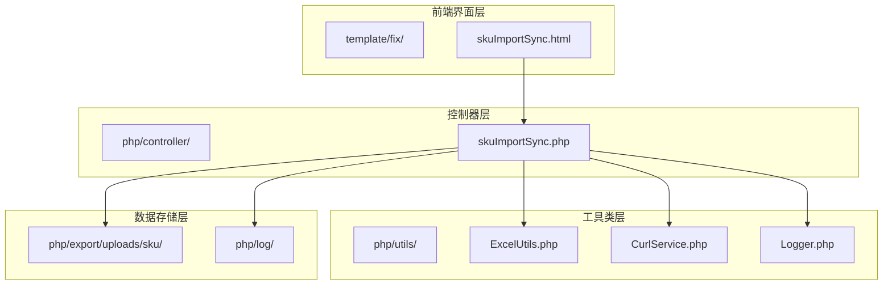
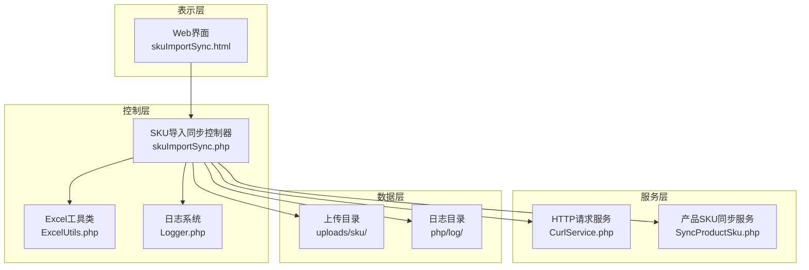
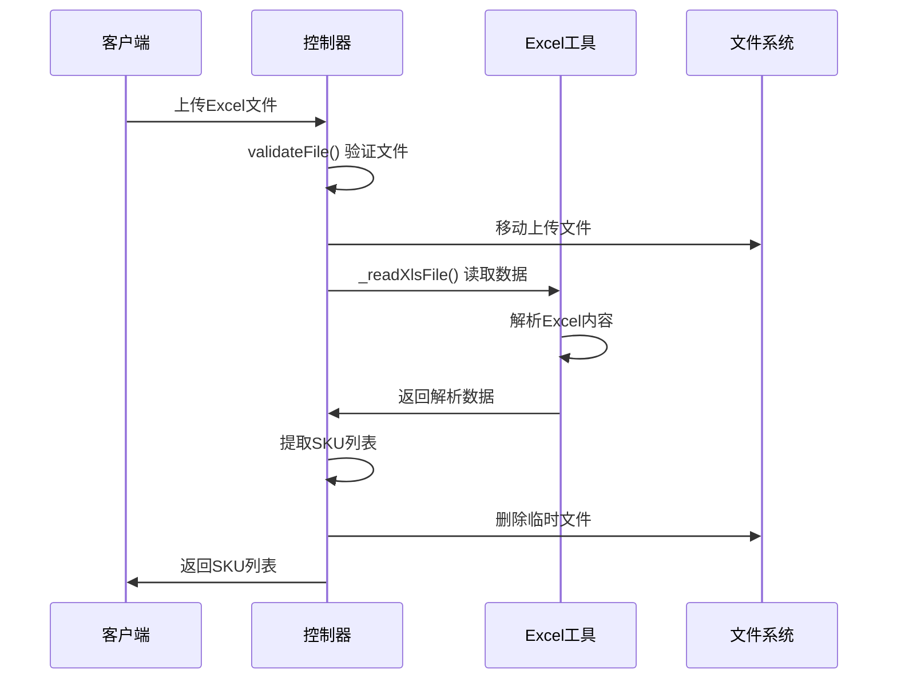
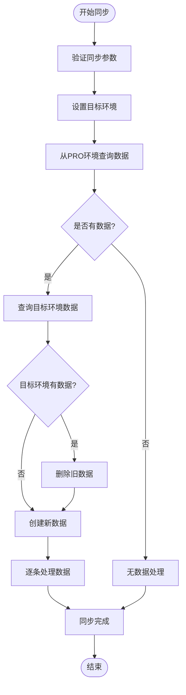
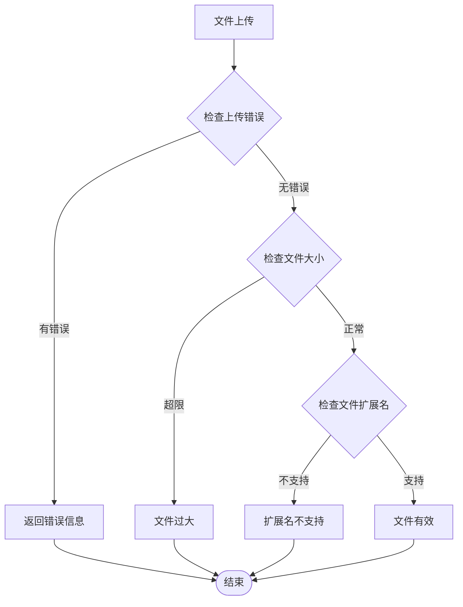
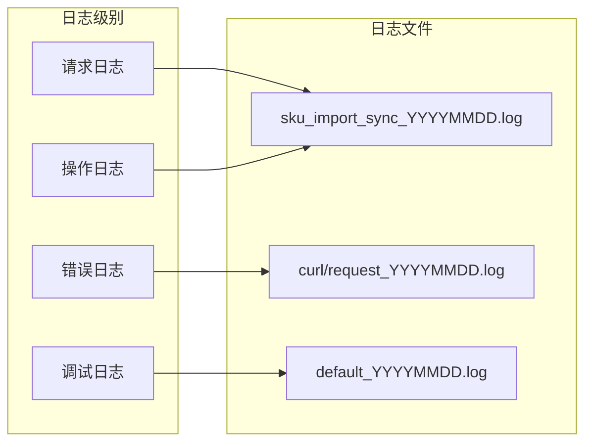
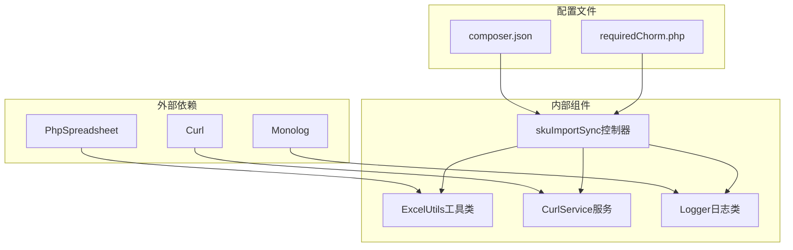

# SKU数据导入同步控制器

<cite>
**本文档引用的文件**
- [skuImportSync.php](file://php/controller/skuImportSync.php)
- [ExcelUtils.php](file://php/utils/ExcelUtils.php)
- [CurlService.php](file://php/curl/CurlService.php)
- [Logger.php](file://php/class/Logger.php)
- [skuImportSync.html](file://template/fix/skuImportSync.html)
</cite>

## 目录
1. [简介](#简介)
2. [项目结构](#项目结构)
3. [核心组件](#核心组件)
4. [架构概览](#架构概览)
5. [详细组件分析](#详细组件分析)
6. [依赖关系分析](#依赖关系分析)
7. [性能考虑](#性能考虑)
8. [故障排除指南](#故障排除指南)
9. [结论](#结论)

## 简介

SKU数据导入同步控制器是一个专门用于处理SKU数据导入和跨环境同步的Web应用程序。该系统提供了完整的Excel文件解析、SKU数据同步、模板下载等功能，支持从PRO环境查询数据并同步到TEST或UAT目标环境。

该控制器采用模块化设计，集成了Excel文件处理、HTTP请求转发、日志记录等核心功能，为用户提供了一个完整的SKU数据管理解决方案。

## 项目结构

项目采用分层架构设计，主要包含以下核心目录：



**图表来源**
- [skuImportSync.php](file://php/controller/skuImportSync.php#L1-L512)
- [ExcelUtils.php](file://php/utils/ExcelUtils.php#L1-L398)
- [CurlService.php](file://php/curl/CurlService.php#L1-L996)

**章节来源**
- [skuImportSync.php](file://php/controller/skuImportSync.php#L1-L50)
- [ExcelUtils.php](file://php/utils/ExcelUtils.php#L1-L30)

## 核心组件

### 主控制器类

skuImportSync类是整个系统的中枢控制器，负责处理所有用户请求和业务逻辑协调。

**主要特性：**
- 多操作模式支持（解析、同步、模板下载）
- 完整的文件验证机制
- 结构化的日志记录系统
- 错误处理和异常管理

**初始化配置：**
- 上传目录：`__DIR__ . "/../export/uploads/sku/"`
- 支持格式：xlsx, xls
- 最大文件大小：2MB
- 日志系统：MyLogger集成

**章节来源**
- [skuImportSync.php](file://php/controller/skuImportSync.php#L12-L33)

### Excel文件处理工具

ExcelUtils类提供了强大的Excel文件读取和写入功能，基于PhpSpreadsheet库构建。

**核心功能：**
- 支持多种Excel格式（xlsx, xls, csv）
- 数据读取和解析
- 文件导出功能
- 长数字格式处理

**章节来源**
- [ExcelUtils.php](file://php/utils/ExcelUtils.php#L20-L398)

### HTTP请求服务

CurlService类封装了所有HTTP请求操作，支持多环境配置和请求管理。

**环境支持：**
- 测试环境（test）
- 用户验收测试环境（uat）
- 生产环境（pro）
- 本地环境（local）

**模块支持：**
- 产品运营应用（pa-biz-application）
- 多个业务模块端口（s3015, s3047, s3044等）

**章节来源**
- [CurlService.php](file://php/curl/CurlService.php#L4-L144)

## 架构概览

系统采用三层架构设计，实现了清晰的职责分离：



**图表来源**
- [skuImportSync.php](file://php/controller/skuImportSync.php#L1-L512)
- [skuImportSync.html](file://template/fix/skuImportSync.html#L1-L585)

## 详细组件分析

### Excel文件解析流程



**图表来源**
- [skuImportSync.php](file://php/controller/skuImportSync.php#L164-L271)
- [ExcelUtils.php](file://php/utils/ExcelUtils.php#L147-L181)

**章节来源**
- [skuImportSync.php](file://php/controller/skuImportSync.php#L164-L271)

### SKU同步完整流程

系统实现了三阶段的SKU同步机制：



**图表来源**
- [skuImportSync.php](file://php/controller/skuImportSync.php#L278-L426)

**章节来源**
- [skuImportSync.php](file://php/controller/skuImportSync.php#L278-L426)

### 文件验证机制

系统实现了多层次的文件验证：



**图表来源**
- [skuImportSync.php](file://php/controller/skuImportSync.php#L433-L471)

**章节来源**
- [skuImportSync.php](file://php/controller/skuImportSync.php#L433-L471)

### API接口规范

#### parse操作
**请求方式：** POST  
**文件参数：** excelFile  
**返回格式：**
```json
{
  "success": true,
  "message": "文件解析成功",
  "data": {
    "skuList": ["SKU1", "SKU2", "SKU3"],
    "count": 3
  }
}
```

#### sync操作
**请求方式：** POST  
**必需参数：**
- skuId: SKU标识符
- module: 模块名称
- port: 端口号
- field: 查询字段
- targetEnv: 目标环境(test/uat)

**返回格式：**
```json
{
  "success": true,
  "message": "SKU同步成功",
  "data": {
    "skuId": "SKU1",
    "module": "amazon_asins",
    "targetEnv": "test",
    "sourceCount": 1,
    "targetCount": 0
  }
}
```

#### downloadTemplate操作
**请求方式：** GET  
**URL参数：** action=downloadTemplate  
**返回：** Excel模板文件下载

**章节来源**
- [skuImportSync.php](file://php/controller/skuImportSync.php#L40-L77)
- [skuImportSync.html](file://template/fix/skuImportSync.html#L390-L456)

### 日志记录机制

系统采用了多层次的日志记录策略：



**图表来源**
- [Logger.php](file://php/class/Logger.php#L14-L55)

**章节来源**
- [Logger.php](file://php/class/Logger.php#L14-L55)

## 依赖关系分析

系统依赖关系清晰，各组件职责明确：



**图表来源**
- [skuImportSync.php](file://php/controller/skuImportSync.php#L1-L10)
- [ExcelUtils.php](file://php/utils/ExcelUtils.php#L1-L15)

**章节来源**
- [skuImportSync.php](file://php/controller/skuImportSync.php#L1-L10)

## 性能考虑

### 文件处理优化
- 使用PhpSpreadsheet进行内存高效的Excel读取
- 实现文件大小限制防止内存溢出
- 临时文件自动清理机制

### 网络请求优化
- HTTP连接复用
- 请求超时控制
- 失败重试机制

### 缓存策略
- 模板文件缓存
- 日志文件分日期存储
- 进程内状态缓存

## 故障排除指南

### 常见问题及解决方案

**文件上传失败**
- 检查上传目录权限
- 验证文件大小限制
- 确认文件格式支持

**Excel解析错误**
- 检查Excel文件完整性
- 验证数据格式正确性
- 确认列标题匹配

**同步失败**
- 检查网络连接
- 验证目标环境配置
- 查看详细错误日志

**章节来源**
- [skuImportSync.php](file://php/controller/skuImportSync.php#L166-L270)

### 调试方法

1. **启用详细日志**：检查日志文件中的详细信息
2. **浏览器开发者工具**：监控网络请求和响应
3. **后端错误日志**：查看PHP错误日志
4. **数据库连接**：验证数据库连接状态

**章节来源**
- [Logger.php](file://php/class/Logger.php#L22-L25)

## 结论

SKU数据导入同步控制器是一个功能完整、架构清晰的Web应用程序。它成功地整合了Excel文件处理、跨环境数据同步、用户界面交互等多个方面，为用户提供了一站式的SKU数据管理解决方案。

系统的主要优势包括：
- 模块化设计便于维护和扩展
- 完善的错误处理和日志记录
- 支持多环境配置灵活部署
- 用户友好的界面设计

未来可以考虑的功能增强：
- 批量处理优化
- 更丰富的Excel格式支持
- 增强的安全验证机制
- 更详细的统计报告功能