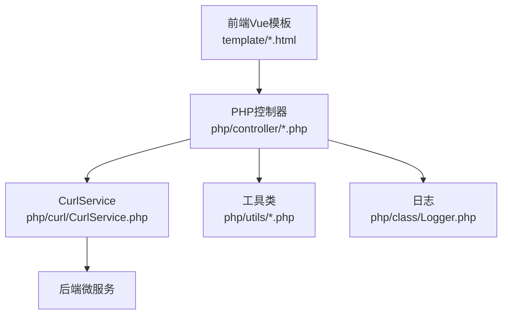
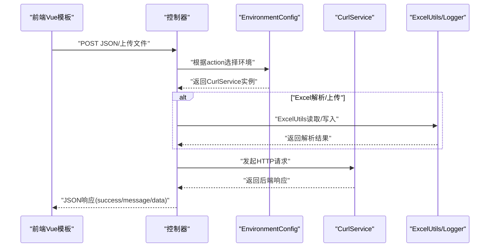
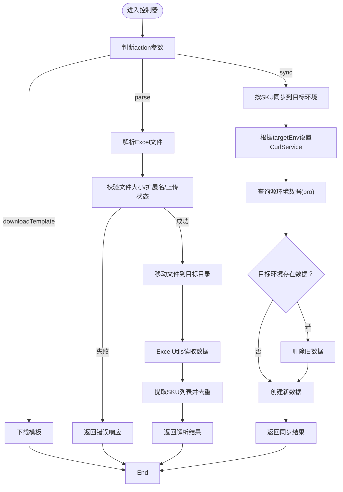
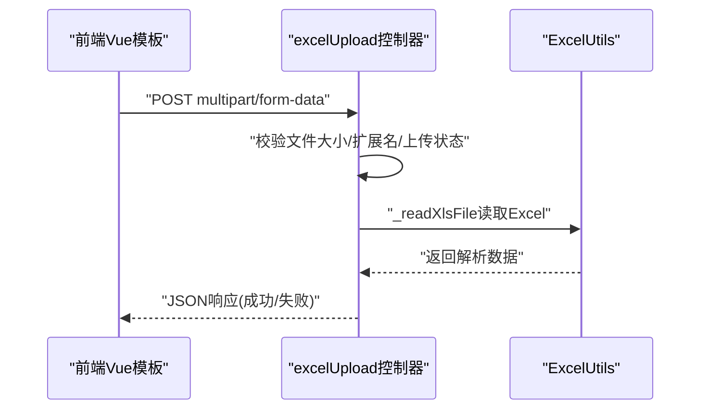
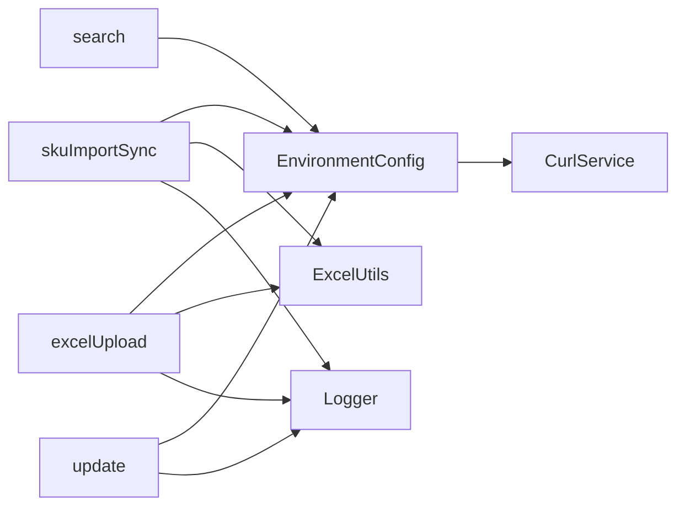

# 控制器层

<cite>
**本文引用的文件**
- [php/controller/skuImportSync.php](file://php/controller/skuImportSync.php)
- [php/controller/excelUpload.php](file://php/controller/excelUpload.php)
- [php/controller/upload.php](file://php/controller/upload.php)
- [php/controller/uploadChunk.php](file://php/controller/uploadChunk.php)
- [php/controller/search.php](file://php/controller/search.php)
- [php/controller/update.php](file://php/controller/update.php)
- [php/controller/EnvironmentConfig.php](file://php/controller/EnvironmentConfig.php)
- [php/curl/CurlService.php](file://php/curl/CurlService.php)
- [php/utils/ExcelUtils.php](file://php/utils/ExcelUtils.php)
- [php/class/Logger.php](file://php/class/Logger.php)
- [template/home.html](file://template/home.html)
- [template/excelUpload.html](file://template/excelUpload.html)
</cite>

## 目录
1. [简介](#简介)
2. [项目结构](#项目结构)
3. [核心组件](#核心组件)
4. [架构总览](#架构总览)
5. [详细组件分析](#详细组件分析)
6. [依赖关系分析](#依赖关系分析)
7. [性能考虑](#性能考虑)
8. [故障排查指南](#故障排查指南)
9. [结论](#结论)
10. [附录](#附录)

## 简介
本文件系统性梳理PaSystem控制器层的MVC架构设计与实现，聚焦以下控制器模块：
- SKU数据同步控制器：负责Excel模板下载、批量解析与按SKU同步至目标环境（test/uat）。
- Excel文件上传控制器：负责单/多文件上传、数据解析、预览与批量处理。
- 文件上传控制器：通用文件上传与OSS直传辅助。
- 搜索控制器：面向业务查询与数据检索，统一通过CurlService对接后端微服务。
- 更新控制器：面向业务数据更新与补丁操作，统一通过CurlService对接后端微服务。

控制器层遵循MVC模式职责分离：控制器仅负责请求路由、参数校验、调用服务与响应封装；模型与业务逻辑由CurlService与工具类承担；视图由前端Vue.js模板承载。

## 项目结构
控制器层位于php/controller目录，配合php/curl、php/utils、php/class等模块协作，前端模板位于template目录并通过Axios与控制器交互。

图表来源
- [php/controller/skuImportSync.php](file://php/controller/skuImportSync.php#L1-L512)
- [php/controller/excelUpload.php](file://php/controller/excelUpload.php#L1-L372)
- [php/controller/search.php](file://php/controller/search.php#L1-L719)
- [php/controller/update.php](file://php/controller/update.php#L1-L800)
- [php/curl/CurlService.php](file://php/curl/CurlService.php#L1-L996)
- [php/utils/ExcelUtils.php](file://php/utils/ExcelUtils.php#L1-L398)
- [php/class/Logger.php](file://php/class/Logger.php#L1-L55)

章节来源
- [php/controller/skuImportSync.php](file://php/controller/skuImportSync.php#L1-L512)
- [php/controller/excelUpload.php](file://php/controller/excelUpload.php#L1-L372)
- [php/controller/upload.php](file://php/controller/upload.php#L1-L138)
- [php/controller/uploadChunk.php](file://php/controller/uploadChunk.php#L1-L86)
- [php/controller/search.php](file://php/controller/search.php#L1-L719)
- [php/controller/update.php](file://php/controller/update.php#L1-L800)
- [php/controller/EnvironmentConfig.php](file://php/controller/EnvironmentConfig.php#L1-L62)
- [php/curl/CurlService.php](file://php/curl/CurlService.php#L1-L996)
- [php/utils/ExcelUtils.php](file://php/utils/ExcelUtils.php#L1-L398)
- [php/class/Logger.php](file://php/class/Logger.php#L1-L55)
- [template/home.html](file://template/home.html#L1-L761)
- [template/excelUpload.html](file://template/excelUpload.html#L1-L472)

## 核心组件
- SKU数据同步控制器（skuImportSync）：支持Excel模板下载、文件上传解析、按SKU字段同步至目标环境（test/uat），包含严格的参数校验与日志记录。
- Excel文件上传控制器（excelUpload）：支持单/多文件上传、文件校验、Excel解析、数据预览与批量处理。
- 文件上传控制器（upload）：通用文件上传与OSS直传辅助，兼容xlsx/xls。
- 搜索控制器（search）：集中处理各类查询场景，统一通过EnvironmentConfig与CurlService切换环境。
- 更新控制器（update）：集中处理各类更新场景，统一通过EnvironmentConfig与CurlService切换环境。
- 环境配置（EnvironmentConfig）：根据action动态选择目标环境（test/uat/pro）与CurlService实例。
- CurlService：统一的HTTP客户端，支持多环境、多模块、多种请求方法与上传。
- ExcelUtils：Excel读写工具，支持xlsx/xls/csv读取与导出。
- Logger：基础日志记录器，统一输出到文件与error_log。

章节来源
- [php/controller/skuImportSync.php](file://php/controller/skuImportSync.php#L1-L512)
- [php/controller/excelUpload.php](file://php/controller/excelUpload.php#L1-L372)
- [php/controller/upload.php](file://php/controller/upload.php#L1-L138)
- [php/controller/uploadChunk.php](file://php/controller/uploadChunk.php#L1-L86)
- [php/controller/search.php](file://php/controller/search.php#L1-L719)
- [php/controller/update.php](file://php/controller/update.php#L1-L800)
- [php/controller/EnvironmentConfig.php](file://php/controller/EnvironmentConfig.php#L1-L62)
- [php/curl/CurlService.php](file://php/curl/CurlService.php#L1-L996)
- [php/utils/ExcelUtils.php](file://php/utils/ExcelUtils.php#L1-L398)
- [php/class/Logger.php](file://php/class/Logger.php#L1-L55)

## 架构总览
控制器层采用“请求路由 + 参数校验 + 服务调用 + 统一响应”的MVC模式：
- 前端通过Axios向控制器发送请求，控制器根据action或请求类型分派到具体处理逻辑。
- 控制器调用CurlService进行跨服务通信，必要时使用ExcelUtils进行Excel读写。
- 所有关键操作均记录日志，便于追踪与排障。
- 响应体统一为JSON，包含success/message/data三段式结构。

图表来源
- [php/controller/search.php](file://php/controller/search.php#L657-L719)
- [php/controller/update.php](file://php/controller/update.php#L1-L800)
- [php/controller/skuImportSync.php](file://php/controller/skuImportSync.php#L474-L512)
- [php/controller/excelUpload.php](file://php/controller/excelUpload.php#L330-L372)
- [php/controller/EnvironmentConfig.php](file://php/controller/EnvironmentConfig.php#L19-L62)
- [php/curl/CurlService.php](file://php/curl/CurlService.php#L295-L433)
- [php/utils/ExcelUtils.php](file://php/utils/ExcelUtils.php#L147-L181)
- [php/class/Logger.php](file://php/class/Logger.php#L22-L37)

## 详细组件分析

### SKU数据同步控制器（skuImportSync）
职责与流程
- 模板下载：生成或返回SKU导入模板（xlsx），支持首次创建与缓存复用。
- Excel解析：接收上传文件，校验大小/扩展名/上传错误，移动到目标目录，使用ExcelUtils读取首张表数据，提取SKU列表并去重。
- 同步逻辑：根据目标环境（test/uat）构造CurlService，查询源环境（pro）数据，再对比目标环境是否存在，存在则删除旧数据，不存在则创建新数据。
- 统一响应：返回统一JSON结构，包含成功标志、消息与数据详情。

请求处理流程

图表来源
- [php/controller/skuImportSync.php](file://php/controller/skuImportSync.php#L40-L77)
- [php/controller/skuImportSync.php](file://php/controller/skuImportSync.php#L83-L110)
- [php/controller/skuImportSync.php](file://php/controller/skuImportSync.php#L164-L271)
- [php/controller/skuImportSync.php](file://php/controller/skuImportSync.php#L278-L426)

章节来源
- [php/controller/skuImportSync.php](file://php/controller/skuImportSync.php#L1-L512)

### Excel文件上传控制器（excelUpload）
职责与流程
- 单/多文件上传：接收excelFile或excelFiles[]，分别处理。
- 文件校验：大小限制、扩展名校验、上传错误检查。
- 数据解析：使用ExcelUtils读取首张表，支持是否包含表头与预览行数配置。
- 批量处理：支持多文件逐个处理并汇总结果。
- 统一响应：返回文件名、行列数、表头、预览与完整数据。

请求处理流程

图表来源
- [php/controller/excelUpload.php](file://php/controller/excelUpload.php#L330-L372)
- [php/controller/excelUpload.php](file://php/controller/excelUpload.php#L35-L95)
- [php/controller/excelUpload.php](file://php/controller/excelUpload.php#L148-L238)
- [php/controller/excelUpload.php](file://php/controller/excelUpload.php#L246-L289)
- [php/utils/ExcelUtils.php](file://php/utils/ExcelUtils.php#L147-L181)

章节来源
- [php/controller/excelUpload.php](file://php/controller/excelUpload.php#L1-L372)
- [php/utils/ExcelUtils.php](file://php/utils/ExcelUtils.php#L1-L398)
- [template/excelUpload.html](file://template/excelUpload.html#L310-L397)

### 文件上传控制器（upload）
职责与流程
- 通用文件上传：校验扩展名（xlsx/xls），生成唯一文件名，移动到目标目录。
- OSS直传辅助：支持多文件上传，生成UUID风格文件名，返回文件集合信息。
- 统一响应：返回code/message/fileName/excelList或fileCollect等结构。

章节来源
- [php/controller/upload.php](file://php/controller/upload.php#L1-L138)

### 分片上传控制器（uploadChunk）
职责与流程
- 接收分片文件，按索引保存到临时目录。
- 当最后一个分片到达时，合并分片为完整文件，清理临时目录，返回最终文件路径与结果列表。

章节来源
- [php/controller/uploadChunk.php](file://php/controller/uploadChunk.php#L1-L86)

### 搜索控制器（search）
职责与流程
- 动态路由：根据action分派到具体查询方法（如翻译、CE资料、FBA配置、留样、产品线、IP登记、FCU产品线、币种修复等）。
- 环境选择：通过EnvironmentConfig根据action选择目标环境（test/uat/pro），并注入CurlService。
- 统一响应：返回env/data/errors等结构，便于前端展示与处理。

章节来源
- [php/controller/search.php](file://php/controller/search.php#L1-L719)
- [php/controller/EnvironmentConfig.php](file://php/controller/EnvironmentConfig.php#L1-L62)
- [php/curl/CurlService.php](file://php/curl/CurlService.php#L1-L996)

### 更新控制器（update）
职责与流程
- 动态路由：根据action分派到具体更新方法（如翻译状态、CE资料状态、FBA配置、留样、产品线、IP登记、FCU产品线、币种修复等）。
- 环境选择：通过EnvironmentConfig根据action选择目标环境（test/uat/pro），并注入CurlService。
- 统一响应：返回布尔值或结构化数据，便于前端展示与处理。

章节来源
- [php/controller/update.php](file://php/controller/update.php#L1-L800)
- [php/controller/EnvironmentConfig.php](file://php/controller/EnvironmentConfig.php#L1-L62)
- [php/curl/CurlService.php](file://php/curl/CurlService.php#L1-L996)

## 依赖关系分析
- 控制器依赖EnvironmentConfig选择CurlService实例，CurlService根据环境与模块动态构建URL并发起HTTP请求。
- Excel解析依赖ExcelUtils，文件上传依赖Logger进行日志记录。
- 前端通过Axios与控制器交互，控制器统一返回JSON结构，便于前端处理。

图表来源
- [php/controller/skuImportSync.php](file://php/controller/skuImportSync.php#L1-L512)
- [php/controller/excelUpload.php](file://php/controller/excelUpload.php#L1-L372)
- [php/controller/search.php](file://php/controller/search.php#L1-L719)
- [php/controller/update.php](file://php/controller/update.php#L1-L800)
- [php/controller/EnvironmentConfig.php](file://php/controller/EnvironmentConfig.php#L1-L62)
- [php/curl/CurlService.php](file://php/curl/CurlService.php#L1-L996)
- [php/utils/ExcelUtils.php](file://php/utils/ExcelUtils.php#L1-L398)
- [php/class/Logger.php](file://php/class/Logger.php#L1-L55)

章节来源
- [php/controller/skuImportSync.php](file://php/controller/skuImportSync.php#L1-L512)
- [php/controller/excelUpload.php](file://php/controller/excelUpload.php#L1-L372)
- [php/controller/search.php](file://php/controller/search.php#L1-L719)
- [php/controller/update.php](file://php/controller/update.php#L1-L800)
- [php/controller/EnvironmentConfig.php](file://php/controller/EnvironmentConfig.php#L1-L62)
- [php/curl/CurlService.php](file://php/curl/CurlService.php#L1-L996)
- [php/utils/ExcelUtils.php](file://php/utils/ExcelUtils.php#L1-L398)
- [php/class/Logger.php](file://php/class/Logger.php#L1-L55)

## 性能考虑
- Excel解析：使用PhpSpreadsheet进行内存友好型读取，建议控制单次解析行数与并发数，避免大文件导致内存峰值过高。
- 环境切换：CurlService按action选择环境，减少不必要的环境切换成本。
- 日志：MyLogger采用文件追加写入，建议结合轮转策略避免日志文件过大。
- 并发与限流：控制器未内置限流，建议在网关或反向代理层实施限流策略，防止突发流量压垮后端。

## 故障排查指南
常见问题与定位
- 文件上传失败：检查上传大小限制、扩展名限制、目标目录权限与可写性。
- Excel解析为空：确认Excel首行是否为表头、列名是否重复、单元格格式是否正确。
- 同步失败：核对目标环境（test/uat）与源环境（pro）的CurlService配置，查看日志定位具体错误。
- 响应异常：检查控制器返回的JSON结构，确认success/message/data字段是否完整。

定位步骤
- 查看控制器日志：MyLogger输出到php/log目录，按日期分文件。
- 检查CurlService请求：确认URL、Header、Body与HTTP状态码。
- 核对前端请求：确认Axios请求参数、Content-Type与文件上传格式。

章节来源
- [php/class/Logger.php](file://php/class/Logger.php#L22-L37)
- [php/curl/CurlService.php](file://php/curl/CurlService.php#L664-L740)

## 结论
控制器层通过清晰的职责划分与统一的环境/服务抽象，实现了SKU同步、Excel上传、查询与更新等核心业务能力。结合前端Vue模板与Axios，形成完整的MVC闭环。建议后续在限流、缓存与监控方面进一步完善，以提升稳定性与可观测性。

## 附录

### 前端与控制器交互要点
- 前端模板通过Axios向控制器发送请求，控制器统一返回JSON结构。
- 搜索与更新控制器通过action字段区分业务场景，EnvironmentConfig据此选择环境。
- Excel上传页面示例展示了多文件上传、进度反馈与数据预览的典型交互。

章节来源
- [template/home.html](file://template/home.html#L601-L647)
- [template/excelUpload.html](file://template/excelUpload.html#L310-L397)
- [php/controller/search.php](file://php/controller/search.php#L657-L719)
- [php/controller/update.php](file://php/controller/update.php#L1-L800)