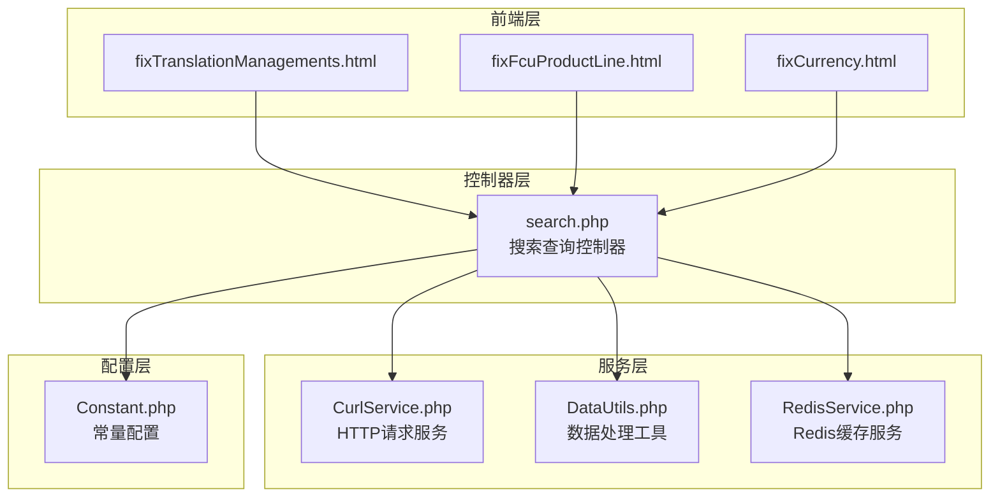
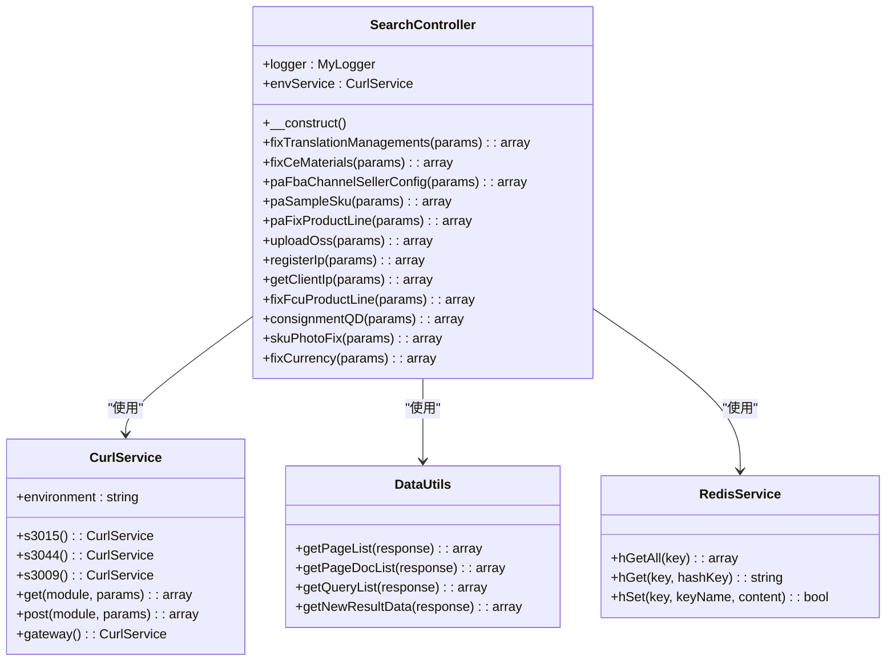
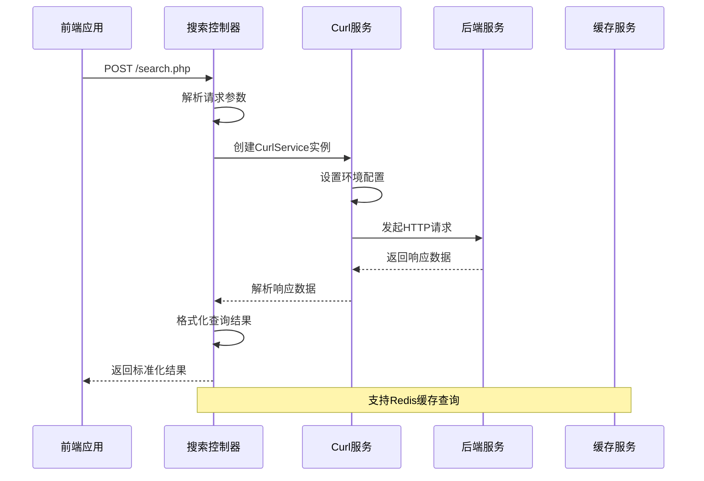
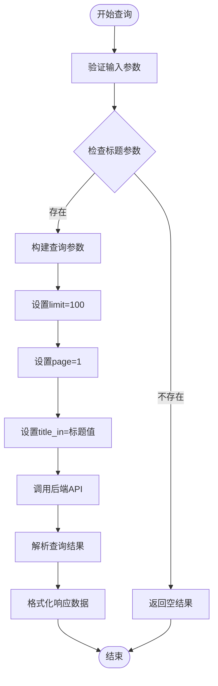
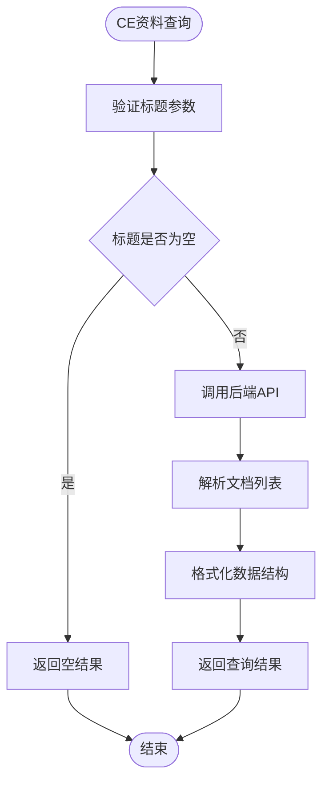
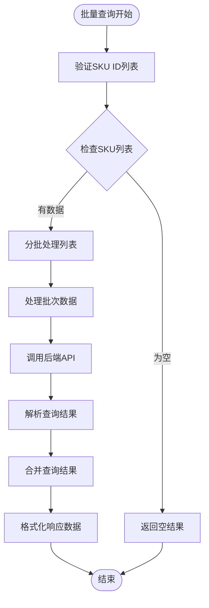
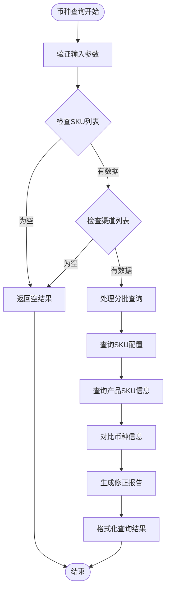
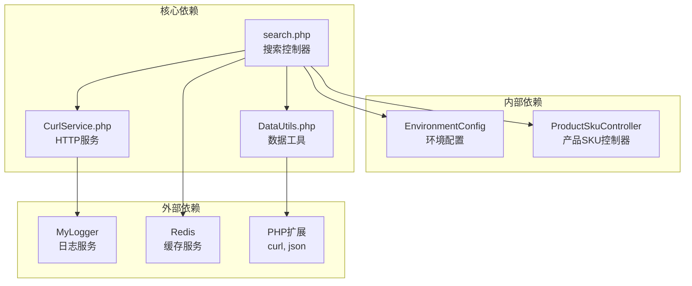

# 搜索查询控制器

<cite>
**本文档引用的文件**
- [search.php](file://php/controller/search.php)
- [CurlService.php](file://php/curl/CurlService.php)
- [DataUtils.php](file://php/utils/DataUtils.php)
- [RedisService.php](file://php/redis/RedisService.php)
- [Constant.php](file://php/constant/Constant.php)
- [fixTranslationManagements.html](file://template/fix/fixTranslationManagements.html)
- [fixFcuProductLine.html](file://template/fix/fixFcuProductLine.html)
- [fixCurrency.html](file://template/fix/fixCurrency.html)
</cite>

## 目录
1. [简介](#简介)
2. [项目结构](#项目结构)
3. [核心组件](#核心组件)
4. [架构概览](#架构概览)
5. [详细组件分析](#详细组件分析)
6. [依赖关系分析](#依赖关系分析)
7. [性能考虑](#性能考虑)
8. [故障排除指南](#故障排除指南)
9. [结论](#结论)
10. [附录](#附录)

## 简介

搜索查询控制器是PA系统中的核心搜索功能模块，负责处理多种类型的搜索查询，包括翻译管理、CE资料、产品线信息、币种修正等业务场景。该控制器采用PHP编写，通过统一的接口设计实现了多条件查询、模糊匹配和结果过滤功能。

该控制器的主要特点包括：
- 统一的搜索入口和参数处理机制
- 多后端服务集成能力
- 灵活的查询参数构建方式
- 标准化的结果格式化和分页处理
- 完善的错误处理和日志记录机制

## 项目结构

搜索查询控制器位于PHP控制器目录中，采用面向对象的设计模式，结合前端模板实现完整的搜索功能。



**图表来源**
- [search.php](file://php/controller/search.php#L1-L719)
- [CurlService.php](file://php/curl/CurlService.php#L1-L996)
- [DataUtils.php](file://php/utils/DataUtils.php#L1-L802)

**章节来源**
- [search.php](file://php/controller/search.php#L1-L719)
- [CurlService.php](file://php/curl/CurlService.php#L1-L996)

## 核心组件

### 搜索查询控制器架构

搜索查询控制器采用单一职责原则，每个搜索功能都封装在独立的方法中，通过统一的入口进行调度。



**图表来源**
- [search.php](file://php/controller/search.php#L12-L654)
- [CurlService.php](file://php/curl/CurlService.php#L4-L262)
- [DataUtils.php](file://php/utils/DataUtils.php#L7-L802)
- [RedisService.php](file://php/redis/RedisService.php#L7-L77)

### 数据处理工具类

数据处理工具类提供了统一的响应数据解析和格式化功能，支持多种数据格式的处理。

**章节来源**
- [DataUtils.php](file://php/utils/DataUtils.php#L36-L84)

## 架构概览

搜索查询控制器采用分层架构设计，实现了清晰的职责分离和良好的扩展性。



**图表来源**
- [search.php](file://php/controller/search.php#L657-L719)
- [CurlService.php](file://php/curl/CurlService.php#L294-L433)

## 详细组件分析

### 翻译管理搜索功能

翻译管理搜索功能支持基于标题的精确匹配查询，适用于翻译标题的检索和管理。

#### 查询参数构建



**图表来源**
- [search.php](file://php/controller/search.php#L32-L49)
- [DataUtils.php](file://php/utils/DataUtils.php#L36-L47)

#### API接口规范

| 参数名称 | 类型 | 必填 | 描述 | 示例 |
|---------|------|------|------|------|
| action | string | 是 | 操作类型 | fixTranslationManagements |
| params.title | string | 是 | 翻译标题 | "产品介绍" |
| params.status | string | 否 | 状态筛选 | "0" |

**章节来源**
- [search.php](file://php/controller/search.php#L32-L49)
- [fixTranslationManagements.html](file://template/fix/fixTranslationManagements.html#L300-L345)

### CE资料搜索功能

CE资料搜索功能支持基于单据号的精确匹配查询，适用于CE资料的检索和管理。

#### 查询逻辑实现



**图表来源**
- [search.php](file://php/controller/search.php#L57-L77)
- [DataUtils.php](file://php/utils/DataUtils.php#L72-L84)

#### 数据格式化

CE资料查询返回的数据格式经过标准化处理，确保前后端数据一致性。

**章节来源**
- [search.php](file://php/controller/search.php#L57-L77)

### 产品线查询功能

产品线查询功能支持基于SKU ID列表的批量查询，采用分批处理机制提高查询效率。

#### 批量查询优化



**图表来源**
- [search.php](file://php/controller/search.php#L178-L198)

#### 查询参数优化

产品线查询采用分批处理策略，每批最多200个SKU ID，平衡查询性能和内存使用。

**章节来源**
- [search.php](file://php/controller/search.php#L178-L198)

### 币种修正查询功能

币种修正查询功能支持多渠道、多SKU的币种信息对比和修正建议。

#### 多维度查询逻辑



**图表来源**
- [search.php](file://php/controller/search.php#L555-L652)

#### 币种对比算法

币种修正功能通过对比SKU配置中的币种信息和产品SKU中的币种标签，生成差异报告。

**章节来源**
- [search.php](file://php/controller/search.php#L555-L652)

### IP注册查询功能

IP注册查询功能基于Redis缓存实现，支持用户访问记录的查询和统计。

#### Redis数据结构

```mermaid
graph LR
subgraph "Redis数据结构"
A[username_ip_{env}_stats<br/>用户访问统计哈希]
B[username_ip_{env}<br/>用户信息哈希]
C[username_ip_{env}<br/>IP访问记录哈希]
end
subgraph "查询流程"
D[获取用户统计]
E[获取用户信息]
F[生成访问报告]
end
A --> D
B --> E
C --> F
```

**图表来源**
- [search.php](file://php/controller/search.php#L244-L351)
- [RedisService.php](file://php/redis/RedisService.php#L48-L51)

#### 访问统计机制

IP注册功能实现了完整的访问统计机制，包括访问次数、最后访问时间和用户代理信息的记录。

**章节来源**
- [search.php](file://php/controller/search.php#L244-L351)
- [RedisService.php](file://php/redis/RedisService.php#L1-L77)

## 依赖关系分析

搜索查询控制器的依赖关系体现了清晰的分层架构设计。



**图表来源**
- [search.php](file://php/controller/search.php#L1-L24)
- [CurlService.php](file://php/curl/CurlService.php#L1-L37)
- [DataUtils.php](file://php/utils/DataUtils.php#L1-L11)

### 环境配置管理

搜索查询控制器支持多环境部署，通过EnvironmentConfig类实现环境切换和配置管理。

**章节来源**
- [search.php](file://php/controller/search.php#L664-L717)

## 性能考虑

### 查询优化策略

搜索查询控制器采用了多种性能优化策略：

1. **分批查询机制**：对大量数据采用分批处理，避免单次请求过大
2. **缓存利用**：合理使用Redis缓存减少重复查询
3. **数据格式化**：通过DataUtils统一处理响应数据，提高处理效率
4. **错误重试**：实现HTTP请求的自动重试机制

### 索引使用策略

虽然具体的数据库索引信息未在代码中体现，但搜索查询控制器的设计考虑了以下索引优化原则：

- 使用合适的查询参数进行精确匹配
- 避免全表扫描的大查询
- 合理设置查询限制和分页参数

## 故障排除指南

### 常见问题及解决方案

#### HTTP请求失败

当后端服务不可用时，CurlService会抛出异常并记录错误日志。建议检查：
- 网络连接状态
- 后端服务可用性
- 环境配置正确性

#### 数据解析错误

DataUtils在解析响应数据时会验证HTTP状态码和数据格式。如遇解析错误：
- 检查后端API响应格式
- 验证参数传递正确性
- 查看日志文件获取详细错误信息

#### Redis连接问题

IP注册功能依赖Redis缓存服务。如遇Redis连接失败：
- 检查Redis服务状态
- 验证连接参数配置
- 确认防火墙设置

**章节来源**
- [CurlService.php](file://php/curl/CurlService.php#L725-L733)
- [DataUtils.php](file://php/utils/DataUtils.php#L24-L28)

## 结论

搜索查询控制器是一个功能完整、架构清晰的搜索功能模块。它通过统一的接口设计实现了多种搜索场景的支持，具备良好的扩展性和维护性。

主要优势包括：
- 统一的搜索入口和参数处理机制
- 灵活的查询参数构建方式
- 完善的错误处理和日志记录
- 多环境支持和配置管理
- 性能优化的查询策略

该控制器为PA系统的搜索功能提供了坚实的基础，能够满足不同业务场景的查询需求。

## 附录

### API接口文档

#### 基础接口规范

| 接口名称 | URL | 方法 | 描述 |
|---------|-----|------|------|
| 搜索查询 | /php/controller/search.php | POST | 统一的搜索查询入口 |
| 环境配置 | /php/controller/EnvironmentConfig.php | GET | 环境配置获取 |

#### 搜索动作类型

| 动作类型 | 描述 | 主要用途 |
|---------|------|----------|
| fixTranslationManagements | 翻译管理查询 | 翻译标题检索 |
| fixCeMaterials | CE资料查询 | CE单据号检索 |
| paFbaChannelSellerConfig | FBA渠道配置 | 渠道配置查询 |
| paSampleSku | 样品SKU查询 | 样品信息检索 |
| paFixProductLine | 产品线查询 | SKU产品线信息 |
| uploadOss | OSS文件查询 | 文件上传记录 |
| registerIp | IP注册查询 | 用户访问记录 |
| fixFcuProductLine | FCU产品线查询 | FCU产品线信息 |
| fixCurrency | 币种修正查询 | 多渠道币种对比 |

### 配置参数说明

#### 环境配置参数

| 参数名称 | 类型 | 默认值 | 描述 |
|---------|------|--------|------|
| REDIS_HOST | string | 127.0.0.1 | Redis服务器地址 |
| REDIS_PORT | int | 6379 | Redis服务器端口 |
| REDIS_PWD | string | dzAJvWuCKUQ= | Redis认证密码 |

#### 查询参数限制

| 参数类型 | 限制值 | 说明 |
|---------|--------|------|
| SKU ID查询 | 最多5000个 | 防止查询过载 |
| 分批大小 | 200个 | 平衡性能和内存 |
| 查询限制 | 100条 | 控制单次查询量 |