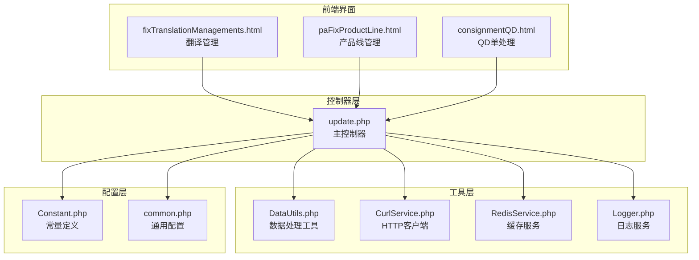
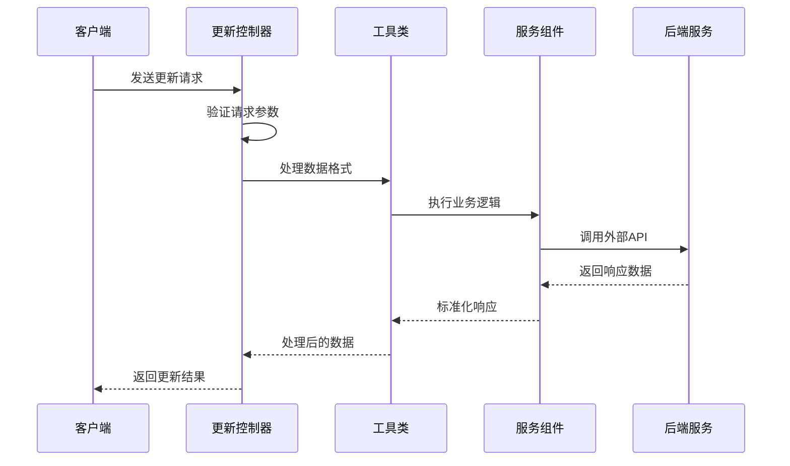
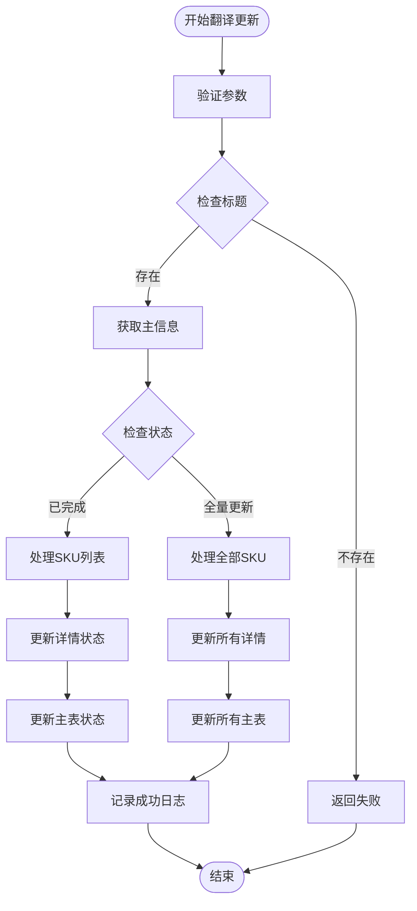
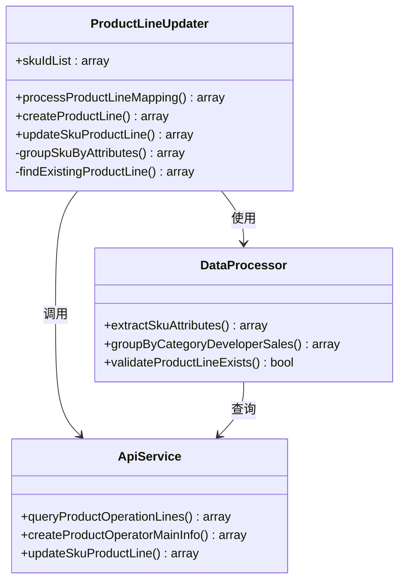
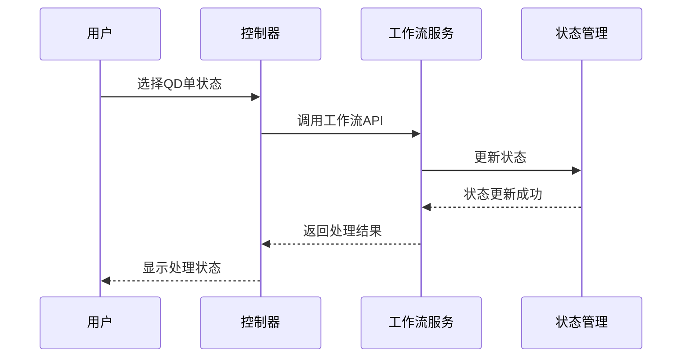
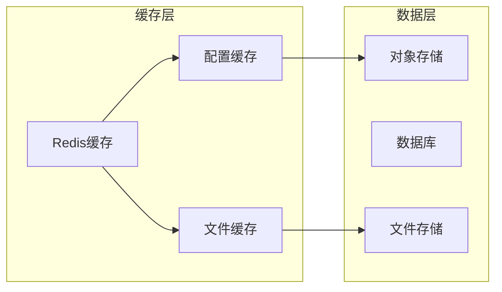
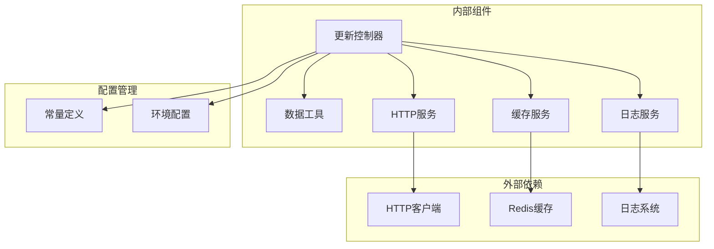

# 数据更新控制器

<cite>
**本文档引用的文件**
- [update.php](file://php/controller/update.php)
- [DataUtils.php](file://php/utils/DataUtils.php)
- [CurlService.php](file://php/curl/CurlService.php)
- [RedisService.php](file://php/redis/RedisService.php)
- [Constant.php](file://php/constant/Constant.php)
- [Logger.php](file://php/class/Logger.php)
- [common.php](file://php/common.php)
- [fixTranslationManagements.html](file://template/fix/fixTranslationManagements.html)
- [paFixProductLine.html](file://template/fix/paFixProductLine.html)
- [consignmentQD.html](file://template/fix/consignmentQD.html)
</cite>

## 目录
1. [简介](#简介)
2. [项目结构](#项目结构)
3. [核心组件](#核心组件)
4. [架构概览](#架构概览)
5. [详细组件分析](#详细组件分析)
6. [依赖关系分析](#依赖关系分析)
7. [性能考虑](#性能考虑)
8. [故障排除指南](#故障排除指南)
9. [结论](#结论)

## 简介

数据更新控制器是PaSystem项目中的核心模块，负责处理各种数据更新操作，包括单条记录更新和批量更新。该控制器提供了统一的接口来管理产品信息、翻译管理、库存状态、产品线配置等多种业务场景的数据更新。

该控制器采用多环境支持设计，能够连接到不同的后端服务组件，实现了灵活的数据操作能力。通过集成多种工具类和服务，提供了完整的数据验证、安全控制和错误处理机制。

## 项目结构

数据更新控制器位于PHP控制器目录中，采用面向对象的设计模式，每个更新功能都封装在独立的方法中：

**图表来源**
- [update.php](file://php/controller/update.php#L1-L1017)
- [DataUtils.php](file://php/utils/DataUtils.php#L1-L800)
- [CurlService.php](file://php/curl/CurlService.php#L1-L996)

**章节来源**
- [update.php](file://php/controller/update.php#L1-L1017)
- [common.php](file://php/common.php#L1-L9)

## 核心组件

### 主控制器类

update类是数据更新的核心控制器，提供了以下主要功能：

- **多环境支持**：支持test、uat、pro、local四种环境
- **批量处理**：支持大批次数据的分块处理
- **错误处理**：完善的异常捕获和错误处理机制
- **日志记录**：详细的操作日志记录

### 数据处理工具

DataUtils类提供了统一的数据处理接口：

- **响应解析**：标准化API响应数据格式
- **分页处理**：支持分页查询结果的处理
- **数据验证**：提供数组字段存在性检查
- **数据转换**：支持不同类型数据格式的转换

### HTTP客户端服务

CurlService类封装了HTTP请求的复杂性：

- **多组件支持**：支持多个后端服务组件
- **环境切换**：动态环境配置和切换
- **请求重试**：自动重试机制
- **超时控制**：请求超时管理和重试

**章节来源**
- [update.php](file://php/controller/update.php#L13-L25)
- [DataUtils.php](file://php/utils/DataUtils.php#L7-L12)
- [CurlService.php](file://php/curl/CurlService.php#L4-L38)

## 架构概览

数据更新控制器采用分层架构设计，实现了清晰的关注点分离：

**图表来源**
- [update.php](file://php/controller/update.php#L959-L1017)
- [DataUtils.php](file://php/utils/DataUtils.php#L18-L29)
- [CurlService.php](file://php/curl/CurlService.php#L664-L740)

### 组件交互流程

控制器通过以下流程处理数据更新请求：

1. **请求接收**：解析JSON请求体
2. **参数验证**：检查必需参数的存在性
3. **业务处理**：执行具体的更新逻辑
4. **响应封装**：标准化返回格式
5. **错误处理**：捕获和处理异常情况

**章节来源**
- [update.php](file://php/controller/update.php#L959-L1017)

## 详细组件分析

### 翻译管理更新

翻译管理功能提供了完整的翻译状态更新机制：

**图表来源**
- [update.php](file://php/controller/update.php#L32-L131)

#### 核心特性

- **状态管理**：支持多种翻译状态的转换
- **批量处理**：支持大批次SKU的分块处理
- **审核机制**：翻译完成时的审核人信息记录
- **完整性检查**：防止重复更新和无效状态

**章节来源**
- [update.php](file://php/controller/update.php#L32-L131)

### 产品线配置更新

产品线配置更新功能实现了复杂的业务逻辑：

**图表来源**
- [update.php](file://php/controller/update.php#L300-L474)
- [DataUtils.php](file://php/utils/DataUtils.php#L36-L65)

#### 处理流程

1. **数据分组**：按产品线、开发者、销售人员分组SKU
2. **查询验证**：检查产品线是否已存在
3. **创建更新**：根据需要创建新的产品线或更新现有记录
4. **批量处理**：支持大批次数据的高效处理

**章节来源**
- [update.php](file://php/controller/update.php#L300-L474)

### QD单状态处理

QD单状态处理提供了工作流自动化功能：

**图表来源**
- [update.php](file://php/controller/update.php#L802-L834)

#### 支持的状态转换

- **to发布**：自动发布QD单
- **to待分配**：将QD单置为待分配状态
- **to处理分配**：处理待分配的QD单

**章节来源**
- [update.php](file://php/controller/update.php#L802-L834)

### 缓存和持久化

系统集成了Redis缓存机制来提高性能：

**图表来源**
- [RedisService.php](file://php/redis/RedisService.php#L1-L77)
- [Constant.php](file://php/constant/Constant.php#L13-L14)

**章节来源**
- [RedisService.php](file://php/redis/RedisService.php#L1-L77)
- [Constant.php](file://php/constant/Constant.php#L1-L26)

## 依赖关系分析

数据更新控制器的依赖关系体现了清晰的分层架构：

**图表来源**
- [update.php](file://php/controller/update.php#L1-L25)
- [CurlService.php](file://php/curl/CurlService.php#L1-L38)

### 关键依赖特性

- **松耦合设计**：各组件间依赖关系清晰
- **可替换性**：支持不同环境的服务替换
- **扩展性**：易于添加新的更新功能
- **稳定性**：通过工具类保证代码复用

**章节来源**
- [update.php](file://php/controller/update.php#L1-L25)
- [CurlService.php](file://php/curl/CurlService.php#L40-L66)

## 性能考虑

### 批量处理优化

系统采用了多种批量处理策略来提高性能：

- **分块处理**：支持200个SKU的分块处理
- **并发控制**：合理控制同时处理的批次数量
- **内存管理**：及时释放处理完成的数据
- **超时控制**：设置合理的请求超时时间

### 缓存策略

- **Redis缓存**：使用Redis存储临时数据和配置
- **文件缓存**：支持文件系统的缓存机制
- **智能过期**：设置合适的缓存过期时间

### 错误处理机制

- **异常捕获**：全面的异常处理和错误记录
- **重试机制**：自动重试失败的请求
- **降级策略**：在网络异常时的降级处理

## 故障排除指南

### 常见问题及解决方案

#### 环境配置问题

**问题**：更新操作在错误环境中执行
**解决方案**：
1. 检查环境配置参数
2. 验证CurlService的环境设置
3. 确认目标服务的URL配置

#### 数据验证失败

**问题**：参数验证导致更新失败
**解决方案**：
1. 检查必需参数是否完整
2. 验证数据格式的正确性
3. 确认数据类型的匹配

#### 网络连接问题

**问题**：HTTP请求超时或连接失败
**解决方案**：
1. 检查网络连接状态
2. 验证目标服务的可用性
3. 调整超时参数设置

### 日志分析

系统提供了详细的日志记录功能：

- **请求日志**：记录所有HTTP请求的详细信息
- **错误日志**：记录所有异常和错误信息
- **性能日志**：记录处理时间和性能指标

**章节来源**
- [Logger.php](file://php/class/Logger.php#L1-L77)
- [CurlService.php](file://php/curl/CurlService.php#L664-L740)

## 结论

数据更新控制器是一个功能完善、设计合理的数据管理模块。它通过以下特点实现了高效的批量数据更新：

1. **模块化设计**：每个更新功能都是独立的模块，便于维护和扩展
2. **多环境支持**：支持开发、测试、生产等多环境部署
3. **性能优化**：采用批量处理和缓存机制提升处理效率
4. **错误处理**：完善的异常捕获和错误处理机制
5. **监控日志**：详细的日志记录便于问题排查

该控制器为PaSystem项目提供了强大的数据更新能力，能够满足各种复杂的业务场景需求。通过持续的优化和改进，可以进一步提升系统的稳定性和性能表现。