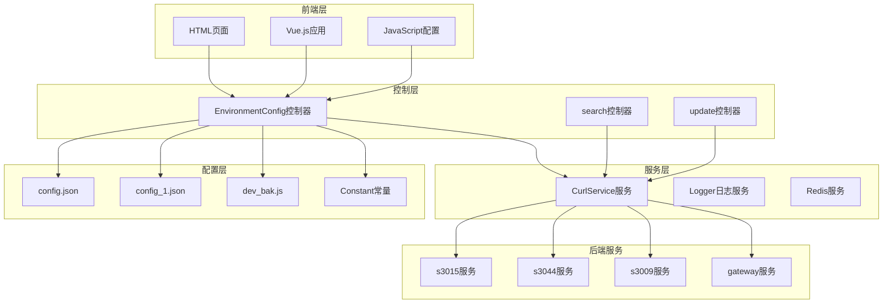
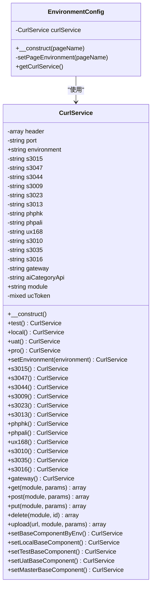
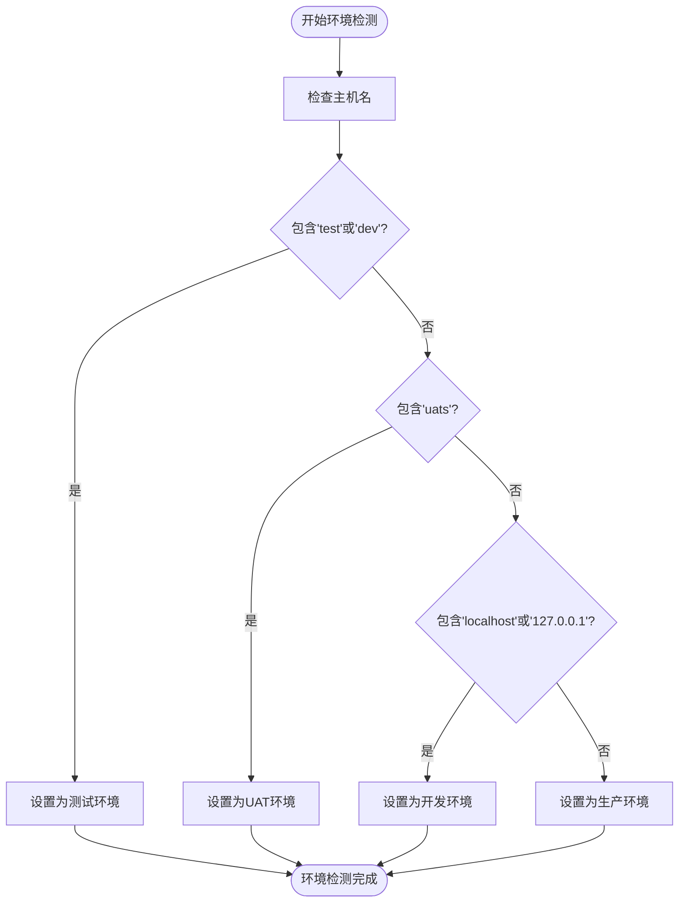
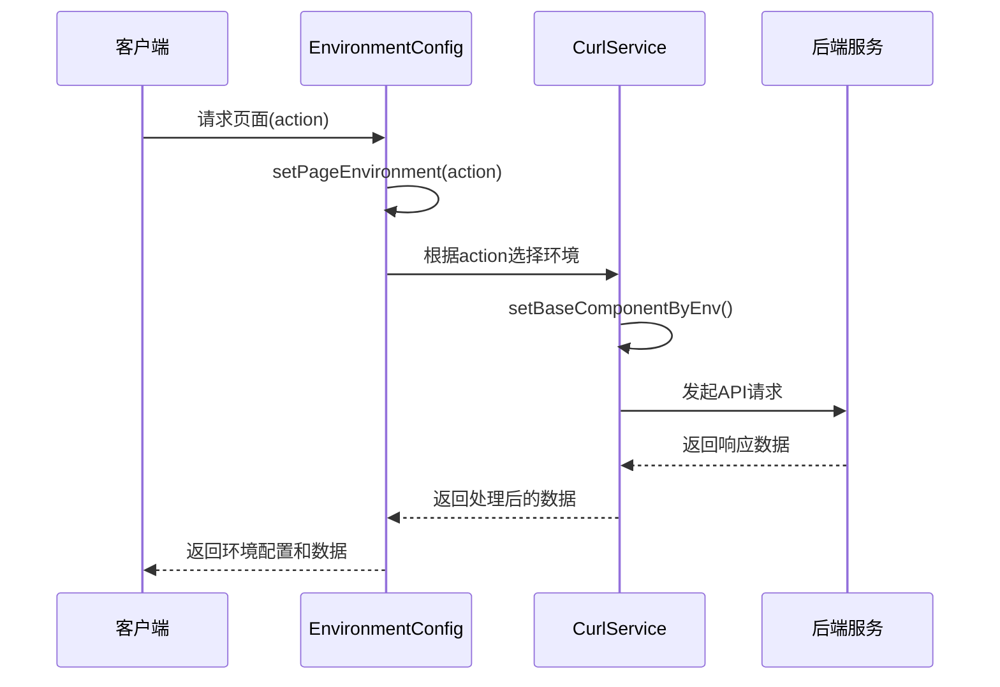
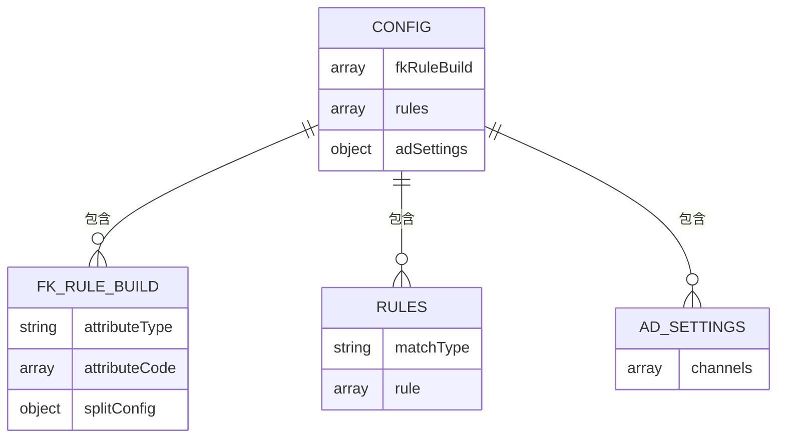
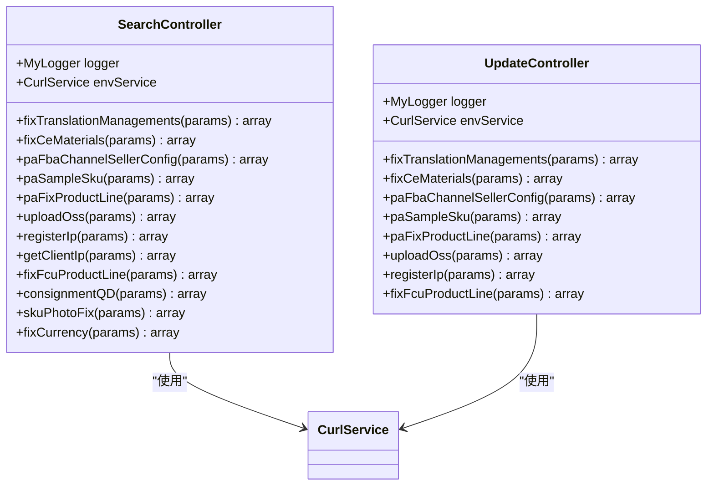
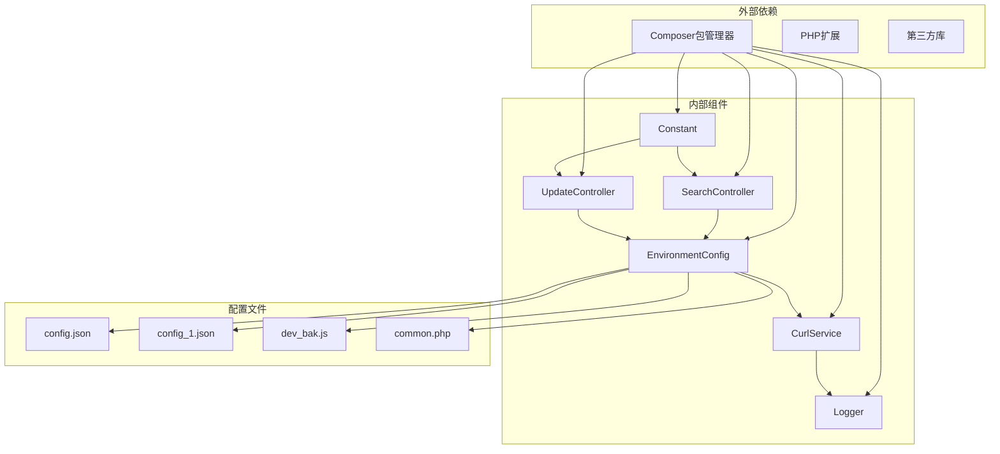
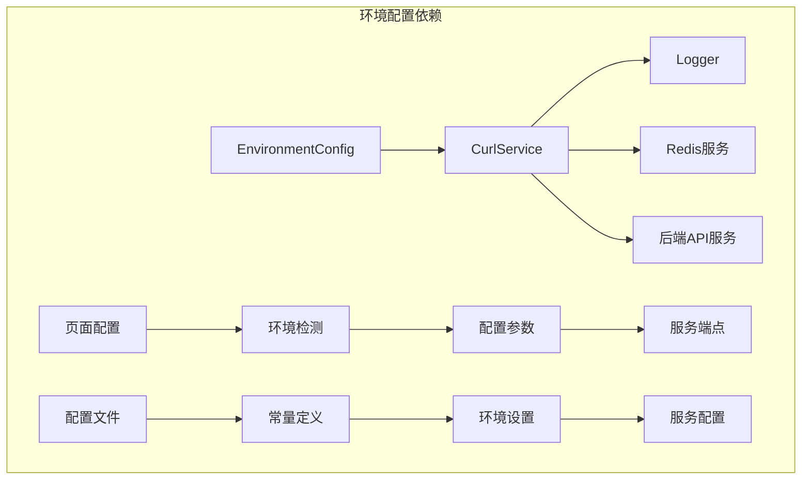
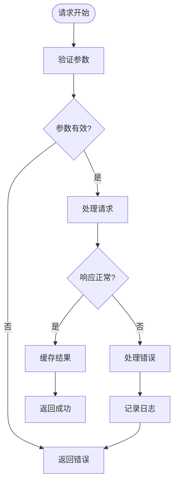

# 环境配置控制器

<cite>
**本文档引用的文件**
- [EnvironmentConfig.php](file://php/controller/EnvironmentConfig.php)
- [CurlService.php](file://php/curl/CurlService.php)
- [search.php](file://php/controller/search.php)
- [update.php](file://php/controller/update.php)
- [Logger.php](file://php/class/Logger.php)
- [config.json](file://php/json/config.json)
- [config_1.json](file://template/config/config_1.json)
- [home.html](file://template/home.html)
- [common.php](file://php/common.php)
- [Constant.php](file://php/constant/Constant.php)
- [dev_bak.js](file://php/json/dev_bak.js)
</cite>

## 目录
1. [简介](#简介)
2. [项目结构](#项目结构)
3. [核心组件](#核心组件)
4. [架构概览](#架构概览)
5. [详细组件分析](#详细组件分析)
6. [依赖关系分析](#依赖关系分析)
7. [性能考虑](#性能考虑)
8. [故障排除指南](#故障排除指南)
9. [结论](#结论)
10. [附录](#附录)

## 简介

环境配置控制器是PaSystem项目中的关键组件，负责管理系统在不同环境（开发、测试、UAT、生产）之间的配置切换和参数管理。该系统通过统一的环境配置管理机制，实现了对多个后端服务组件的动态路由和环境感知。

系统支持四种主要环境模式：
- **Development (dev)**: 本地开发环境
- **Test (test)**: 测试环境
- **UAT**: 用户验收测试环境  
- **Production (pro)**: 生产环境

通过环境配置控制器，前端页面能够根据当前运行环境自动调整配置参数，并提供相应的功能支持。

## 项目结构

PaSystem项目的环境配置管理采用分层架构设计，主要包含以下层次：



**图表来源**
- [EnvironmentConfig.php](file://php/controller/EnvironmentConfig.php#L1-L62)
- [CurlService.php](file://php/curl/CurlService.php#L1-L996)
- [search.php](file://php/controller/search.php#L1-L719)

**章节来源**
- [EnvironmentConfig.php](file://php/controller/EnvironmentConfig.php#L1-L62)
- [CurlService.php](file://php/curl/CurlService.php#L1-L996)

## 核心组件

### 环境配置控制器 (EnvironmentConfig)

EnvironmentConfig控制器是整个环境配置系统的核心，负责根据页面名称动态选择合适的环境配置。



**图表来源**
- [EnvironmentConfig.php](file://php/controller/EnvironmentConfig.php#L7-L62)
- [CurlService.php](file://php/curl/CurlService.php#L4-L996)

### 环境检测机制

系统提供了多种环境检测方式，确保能够准确识别当前运行环境：



**图表来源**
- [home.html](file://template/home.html#L693-L710)

**章节来源**
- [EnvironmentConfig.php](file://php/controller/EnvironmentConfig.php#L20-L57)
- [CurlService.php](file://php/curl/CurlService.php#L98-L143)

## 架构概览

### 环境配置切换流程

系统通过EnvironmentConfig控制器实现环境的动态切换，支持以下配置模式：



**图表来源**
- [search.php](file://php/controller/search.php#L664-L717)
- [EnvironmentConfig.php](file://php/controller/EnvironmentConfig.php#L14-L57)

### 环境配置参数

系统支持多种环境配置参数，包括：

| 环境类型 | 端口配置 | 服务地址 | 认证方式 |
|---------|----------|----------|----------|
| 开发环境(dev) | 本地端口 | http://172.16.29.23:3015 | 本地认证 |
| 测试环境(test) | 30015端口 | http://172.16.10.62:30015 | 测试令牌 |
| UAT环境(uat) | 30015端口 | http://172.16.11.221:30015 | UAT令牌 |
| 生产环境(pro) | HTTPS端口 | https://master-*.ux168.cn | 生产令牌 |

**章节来源**
- [CurlService.php](file://php/curl/CurlService.php#L441-L651)

## 详细组件分析

### CurlService服务组件

CurlService是环境配置系统的核心服务组件，负责管理所有后端API调用的连接和配置。

#### 环境设置方法

```mermaid
flowchart LR
subgraph "环境设置方法"
A[test()] --> A1[设置environment='test']
B[local()] --> B1[设置environment='local']
C[uat()] --> C1[设置environment='uat']
D[pro()] --> D1[设置environment='pro']
E[setEnvironment(env)] --> E1[自定义环境设置]
end
subgraph "服务端点配置"
F[s3015()] --> F1[listing_management服务]
G[s3044()] --> G1[poms_listing服务]
H[s3009()] --> H1[product_operation服务]
I[gateway()] --> I1[网关服务]
end
```

**图表来源**
- [CurlService.php](file://php/curl/CurlService.php#L98-L143)
- [CurlService.php](file://php/curl/CurlService.php#L149-L290)

#### API请求方法

CurlService提供了完整的HTTP请求方法支持：

| 方法类型 | 用途 | 参数 | 返回值 |
|---------|------|------|--------|
| get() | GET请求 | module, params | 响应数组 |
| post() | POST请求 | module, params | 响应数组 |
| put() | PUT请求 | module, params | 响应数组 |
| delete() | DELETE请求 | module, id | 响应数组 |
| upload() | 文件上传 | url, module, params | 响应数组 |
| getWayPost() | 新架构POST | module, params | 响应数组 |
| getWayGet() | 新架构GET | module, params | 响应数组 |

**章节来源**
- [CurlService.php](file://php/curl/CurlService.php#L294-L433)

### 配置文件管理

系统使用多种配置文件来管理不同类型的配置信息：

#### 主配置文件 (config.json)

主配置文件包含广告设置和规则配置：



**图表来源**
- [config.json](file://php/json/config.json#L1-L316)

#### 字段映射配置 (config_1.json)

字段映射配置文件定义了不同模块之间的字段对应关系：

| 配置类型 | 字段数量 | 用途 |
|---------|----------|------|
| pmoFiledMap | 27个字段 | PMO数据字段映射 |
| ceFiledMap | 55个字段 | CE数据字段映射 |
| paSkuInfoField | 15个字段 | PA SKU信息字段映射 |
| productSkuFiledMap | 121个字段 | 产品SKU字段映射 |
| paCEMaterialFiledMap | 135个字段 | PA CE材料字段映射 |
| paFindCEMaterialFiledMap | 164个字段 | PA查找CE材料字段映射 |

**章节来源**
- [config_1.json](file://template/config/config_1.json#L1-L166)

### 控制器接口设计

#### 查询控制器 (search.php)

查询控制器提供了多种业务功能的查询接口：



**图表来源**
- [search.php](file://php/controller/search.php#L12-L654)
- [update.php](file://php/controller/update.php#L13-L1017)

**章节来源**
- [search.php](file://php/controller/search.php#L32-L652)
- [update.php](file://php/controller/update.php#L32-L788)

## 依赖关系分析

### 组件依赖图



**图表来源**
- [composer.json](file://composer.json)
- [EnvironmentConfig.php](file://php/controller/EnvironmentConfig.php#L3-L5)
- [CurlService.php](file://php/curl/CurlService.php#L2)

### 环境配置依赖

系统环境配置依赖关系如下：



**图表来源**
- [EnvironmentConfig.php](file://php/controller/EnvironmentConfig.php#L14-L57)
- [CurlService.php](file://php/curl/CurlService.php#L34-L37)

**章节来源**
- [EnvironmentConfig.php](file://php/controller/EnvironmentConfig.php#L1-L62)
- [CurlService.php](file://php/curl/CurlService.php#L1-L996)

## 性能考虑

### 缓存策略

系统采用了多层次的缓存策略来优化性能：

1. **Redis缓存**：用于存储用户访问记录和文件上传信息
2. **日志缓存**：通过Logger类的文件写入机制减少I/O操作
3. **配置缓存**：通过配置文件的静态加载减少运行时解析开销

### 性能优化建议

1. **批量处理**：对于大量数据的操作，使用分批处理机制（如array_chunk）
2. **连接复用**：CurlService支持连接复用，减少连接建立开销
3. **异步处理**：对于耗时操作，考虑使用异步处理机制
4. **资源池管理**：合理管理Redis连接池，避免连接泄漏

### 错误处理机制

系统实现了完善的错误处理机制：



**图表来源**
- [CurlService.php](file://php/curl/CurlService.php#L725-L740)

**章节来源**
- [Logger.php](file://php/class/Logger.php#L39-L49)
- [CurlService.php](file://php/curl/CurlService.php#L664-L740)

## 故障排除指南

### 常见问题及解决方案

#### 环境配置问题

| 问题类型 | 症状 | 解决方案 |
|---------|------|----------|
| 环境检测失败 | 页面显示错误的环境信息 | 检查hostname配置和环境检测逻辑 |
| API调用失败 | 请求超时或返回错误 | 验证CurlService配置和后端服务状态 |
| 配置加载失败 | 配置文件无法读取 | 检查文件权限和路径配置 |

#### 调试工具

1. **日志查看**：通过Logger类查看详细的请求日志
2. **环境变量检查**：验证环境变量的正确性
3. **网络连接测试**：使用curl命令测试后端服务连接

**章节来源**
- [Logger.php](file://php/class/Logger.php#L12-L27)
- [common.php](file://php/common.php#L1-L9)

### 错误处理最佳实践

1. **参数验证**：在处理任何请求之前验证输入参数
2. **异常捕获**：使用try-catch机制捕获和处理异常
3. **日志记录**：详细记录错误信息和调试信息
4. **优雅降级**：在网络不可用时提供备用方案

## 结论

环境配置控制器为PaSystem项目提供了强大而灵活的环境管理能力。通过统一的配置管理和动态环境切换机制，系统能够支持多环境部署和开发工作流。

### 主要优势

1. **统一管理**：集中管理所有环境配置参数
2. **动态切换**：支持运行时环境切换和参数调整
3. **多环境支持**：完整支持开发、测试、UAT和生产环境
4. **可扩展性**：易于添加新的环境和服务配置

### 改进建议

1. **配置热更新**：实现配置的热更新机制，避免重启服务
2. **监控集成**：集成监控系统，实时跟踪环境配置状态
3. **安全增强**：加强配置文件的安全保护机制
4. **文档完善**：完善配置文档和使用指南

## 附录

### API接口文档

#### 环境配置接口

| 接口 | 方法 | 参数 | 返回值 | 描述 |
|------|------|------|--------|------|
| /search.php | POST | action, params | env, data | 查询接口 |
| /update.php | POST | action, params | success, data | 更新接口 |
| /EnvironmentConfig.php | GET | pageName | CurlService | 环境配置接口 |

#### 环境检测接口

| 接口 | 方法 | 参数 | 返回值 | 描述 |
|------|------|------|--------|------|
| detectEnvironment | GET | 无 | envType, envText | 环境检测接口 |
| setEnvMessage | GET | env | envMsg, envClass | 环境消息设置接口 |

### 配置参数参考

#### 环境配置参数

| 参数名 | 类型 | 默认值 | 描述 |
|-------|------|--------|------|
| environment | string | 'test' | 当前环境类型 |
| port | string | null | 服务端口号 |
| module | string | 'pa-biz-application' | 模块名称 |
| header | array | [] | HTTP请求头 |
| ucToken | mixed | null | 用户认证令牌 |

#### 常量定义

| 常量名 | 值 | 描述 |
|-------|----|------|
| REDIS_HOST | '127.0.0.1' | Redis服务器地址 |
| REDIS_PORT | 6379 | Redis端口号 |
| REDIS_PWD | 'dzAJvWuCKUQ=' | Redis密码 |
| REDIS_USERNAME_IP_KEY | 'username_ip' | 用户IP键 |
| REDIS_OSS_FILE_NAME_KEY | 'oss_file' | OSS文件名键 |

**章节来源**
- [Constant.php](file://php/constant/Constant.php#L4-L26)
- [common.php](file://php/common.php#L1-L9)