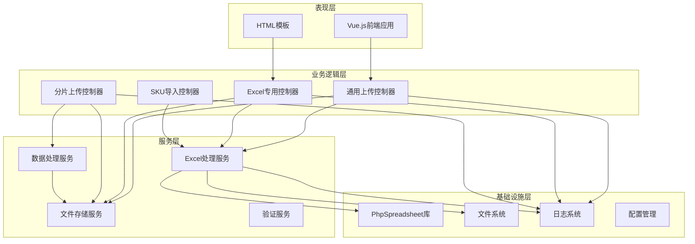
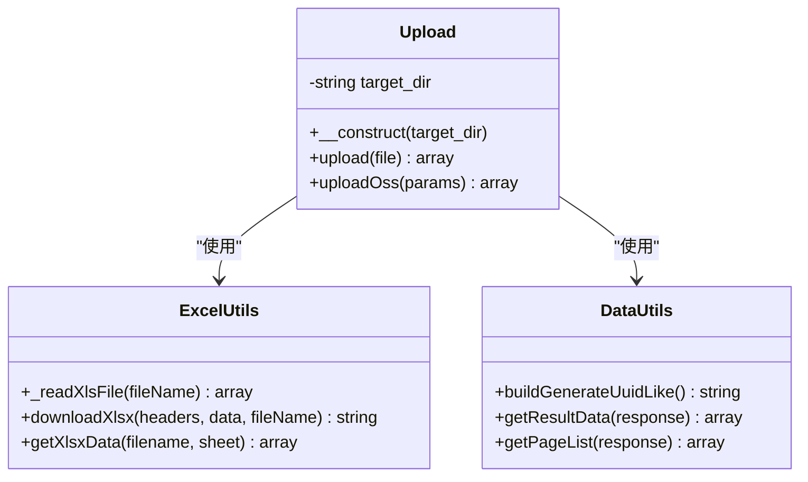
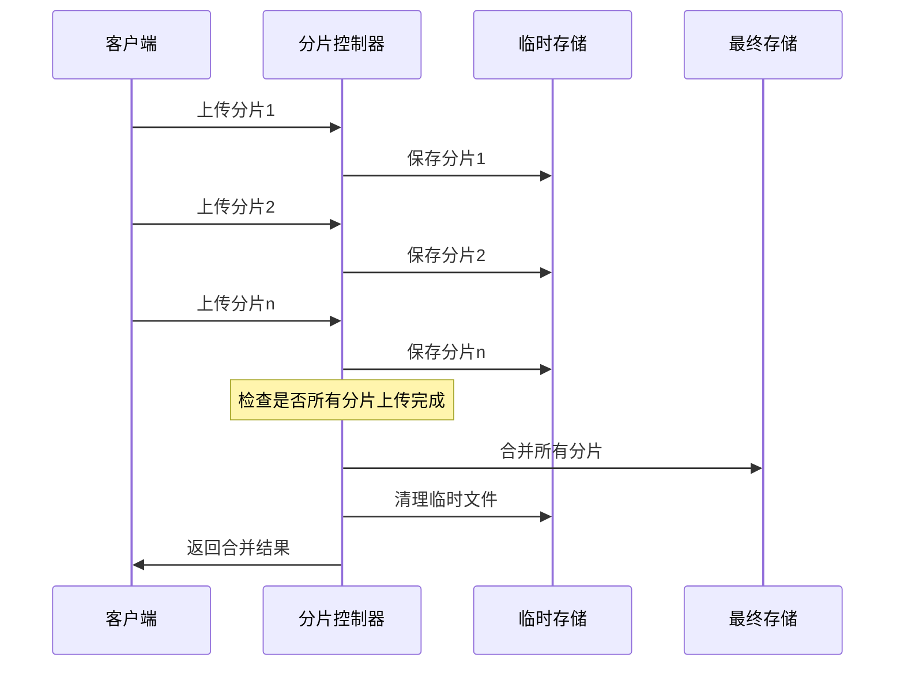
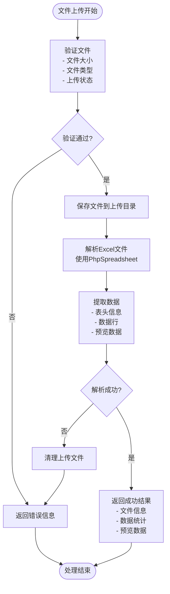
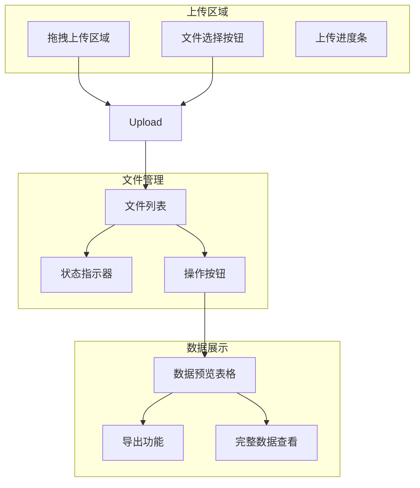
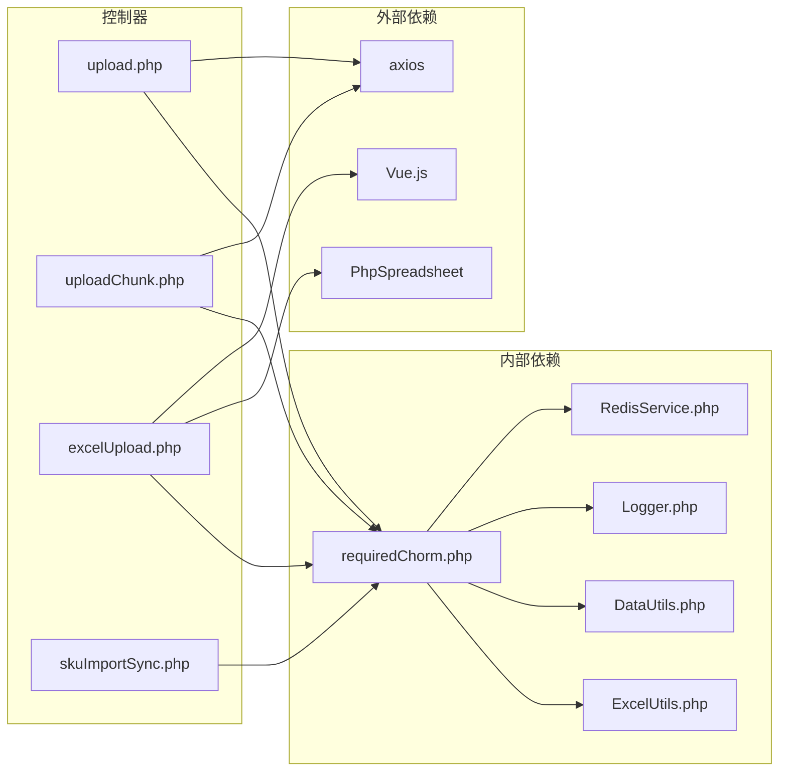

# 通用文件上传控制器

<cite>
**本文档引用的文件**
- [upload.php](file://php/controller/upload.php)
- [uploadChunk.php](file://php/controller/uploadChunk.php)
- [excelUpload.php](file://php/controller/excelUpload.php)
- [excelUpload.html](file://template/excelUpload.html)
- [ExcelUtils.php](file://php/utils/ExcelUtils.php)
- [DataUtils.php](file://php/utils/DataUtils.php)
- [requiredChorm.php](file://php/requiredfile/requiredChorm.php)
- [skuImportSync.php](file://php/controller/skuImportSync.php)
</cite>

## 目录
1. [简介](#简介)
2. [项目结构](#项目结构)
3. [核心组件](#核心组件)
4. [架构概览](#架构概览)
5. [详细组件分析](#详细组件分析)
6. [依赖关系分析](#依赖关系分析)
7. [性能考虑](#性能考虑)
8. [故障排除指南](#故障排除指南)
9. [结论](#结论)
10. [附录](#附录)

## 简介

本项目提供了一套完整的通用文件上传控制器解决方案，支持多种文件上传模式和处理场景。系统主要包含以下核心功能：

- **单文件上传**：支持标准的单文件上传处理
- **分片上传**：实现大文件的分片上传、断点续传功能
- **Excel文件处理**：专门针对Excel文件的上传、验证、解析和数据提取
- **前端Vue.js集成**：提供完整的前端交互界面和进度显示机制
- **安全验证**：包含文件类型验证、大小限制和安全检查措施

系统采用PHP作为后端语言，结合Vue.js构建现代化的用户界面，使用PhpSpreadsheet库处理Excel文件，实现了从文件上传到数据处理的完整流程。

## 项目结构

项目采用模块化组织结构，主要分为以下几个层次：

```mermaid
graph TB
subgraph "前端层"
FE[Vue.js前端应用]
HTML[HTML模板]
end
subgraph "控制器层"
UC[upload.php<br/>单文件上传]
UCH[uploadChunk.php<br/>分片上传]
EU[excelUpload.php<br/>Excel专用上传]
SIS[skuImportSync.php<br/>SKU导入同步]
end
subgraph "工具层"
EUTIL[ExcelUtils.php<br/>Excel处理工具]
DUTIL[DataUtils.php<br/>数据处理工具]
RCH[requiredChorm.php<br/>依赖注入]
end
subgraph "存储层"
TEMP[临时文件存储]
PERM[永久文件存储]
OSS[对象存储(OSS)]
end
FE --> UC
FE --> UCH
FE --> EU
HTML --> EU
UC --> EUTIL
UCH --> DUTIL
EU --> EUTIL
EU --> DUTIL
EU --> TEMP
EU --> PERM
UC --> TEMP
UCH --> TEMP
EU --> OSS
```

**图表来源**
- [upload.php](file://php/controller/upload.php#L1-L138)
- [uploadChunk.php](file://php/controller/uploadChunk.php#L1-L86)
- [excelUpload.php](file://php/controller/excelUpload.php#L1-L372)

**章节来源**
- [upload.php](file://php/controller/upload.php#L1-L138)
- [uploadChunk.php](file://php/controller/uploadChunk.php#L1-L86)
- [excelUpload.php](file://php/controller/excelUpload.php#L1-L372)

## 核心组件

### 1. 单文件上传控制器 (upload.php)

该控制器提供了基础的文件上传功能，支持多种文件类型的处理：

- **文件类型支持**：xlsx、xls格式的Excel文件
- **安全验证**：文件大小限制、扩展名验证
- **文件命名**：生成唯一文件名避免冲突
- **批量处理**：支持多文件同时上传

### 2. 分片上传控制器 (uploadChunk.php)

实现大文件的分片上传和断点续传功能：

- **分片管理**：将大文件分割为多个片段
- **临时存储**：每个分片单独存储在temp目录
- **合并处理**：当所有分片上传完成后自动合并
- **断点续传**：支持网络中断后的续传功能

### 3. Excel专用上传控制器 (excelUpload.php)

专门为Excel文件设计的上传处理控制器：

- **严格验证**：文件类型、大小、格式的多重验证
- **数据解析**：使用PhpSpreadsheet库解析Excel内容
- **数据预览**：提供数据预览功能
- **批量处理**：支持多文件同时处理
- **错误处理**：完善的异常捕获和错误反馈

### 4. 前端Vue.js组件 (excelUpload.html)

提供现代化的用户界面和交互体验：

- **拖拽上传**：支持拖拽文件到指定区域
- **进度显示**：实时显示上传进度
- **文件管理**：文件列表展示和状态指示
- **数据预览**：表格形式展示解析后的数据
- **响应式设计**：适配不同屏幕尺寸

**章节来源**
- [upload.php](file://php/controller/upload.php#L4-L124)
- [uploadChunk.php](file://php/controller/uploadChunk.php#L4-L80)
- [excelUpload.php](file://php/controller/excelUpload.php#L11-L328)
- [excelUpload.html](file://template/excelUpload.html#L1-L472)

## 架构概览

系统采用分层架构设计，确保各组件职责清晰、耦合度低：



**图表来源**
- [excelUpload.php](file://php/controller/excelUpload.php#L11-L328)
- [ExcelUtils.php](file://php/utils/ExcelUtils.php#L20-L398)
- [DataUtils.php](file://php/utils/DataUtils.php#L7-L802)

## 详细组件分析

### 通用上传控制器 (upload.php)

#### 类结构设计



**图表来源**
- [upload.php](file://php/controller/upload.php#L4-L124)
- [ExcelUtils.php](file://php/utils/ExcelUtils.php#L147-L181)
- [DataUtils.php](file://php/utils/DataUtils.php#L337-L339)

#### 核心功能实现

**文件验证机制**：
- 检查上传错误状态码
- 验证文件扩展名（仅xlsx、xls）
- 生成唯一文件名避免冲突

**批量文件处理**：
- 支持多文件同时上传
- 统一的错误处理机制
- 结果聚合和返回

**章节来源**
- [upload.php](file://php/controller/upload.php#L15-L121)

### 分片上传控制器 (uploadChunk.php)

#### 分片上传流程



**图表来源**
- [uploadChunk.php](file://php/controller/uploadChunk.php#L15-L78)

#### 断点续传实现

分片上传控制器实现了完整的断点续传功能：

- **临时目录管理**：每个文件使用独立的temp目录
- **分片索引跟踪**：通过`.part`索引标识分片位置
- **完整性检查**：上传完成后验证所有分片是否完整
- **资源清理**：成功合并后自动清理临时文件

**章节来源**
- [uploadChunk.php](file://php/controller/uploadChunk.php#L15-L78)

### Excel专用上传控制器 (excelUpload.php)

#### 数据流处理



**图表来源**
- [excelUpload.php](file://php/controller/excelUpload.php#L35-L95)

#### 配置参数详解

Excel上传控制器支持灵活的配置参数：

| 参数名称 | 类型 | 默认值 | 描述 |
|---------|------|--------|------|
| hasHeader | boolean | true | 是否包含表头行 |
| previewRows | integer | 10 | 预览数据行数 |
| maxFileSize | integer | 10MB | 文件大小限制 |
| allowedExtensions | array | ['xlsx','xls'] | 允许的文件类型 |

**章节来源**
- [excelUpload.php](file://php/controller/excelUpload.php#L35-L95)

### 前端Vue.js组件 (excelUpload.html)

#### 用户界面组件



**图表来源**
- [excelUpload.html](file://template/excelUpload.html#L125-L270)

#### 交互流程

前端Vue.js组件提供了完整的用户交互体验：

- **拖拽上传**：支持拖拽文件到指定区域
- **进度监控**：实时显示上传进度百分比
- **状态反馈**：成功/失败状态的颜色指示
- **数据预览**：表格形式展示解析后的数据
- **批量操作**：支持多文件同时上传和管理

**章节来源**
- [excelUpload.html](file://template/excelUpload.html#L295-L469)

## 依赖关系分析

### 核心依赖关系



**图表来源**
- [requiredChorm.php](file://php/requiredfile/requiredChorm.php#L1-L10)
- [excelUpload.php](file://php/controller/excelUpload.php#L2-L6)

### 依赖注入机制

系统采用依赖注入的方式管理组件间的依赖关系：

- **集中式引入**：通过`requiredChorm.php`统一管理所有依赖
- **按需加载**：根据具体功能需求动态加载相应组件
- **版本兼容**：确保第三方库版本的兼容性

**章节来源**
- [requiredChorm.php](file://php/requiredfile/requiredChorm.php#L1-L10)

## 性能考虑

### 1. 内存优化策略

Excel文件处理采用流式读取方式，避免一次性加载整个文件到内存：

- **逐行读取**：使用PhpSpreadsheet的迭代器模式逐行处理
- **内存限制**：设置合理的内存使用上限
- **垃圾回收**：及时释放不再使用的变量和资源

### 2. 并发处理能力

- **异步上传**：前端支持多文件并发上传
- **队列管理**：后端支持任务队列处理大量上传请求
- **资源池**：数据库连接和文件句柄使用连接池管理

### 3. 缓存策略

- **临时文件缓存**：分片上传使用临时文件缓存
- **结果缓存**：解析后的数据结果进行短期缓存
- **配置缓存**：常用配置信息进行内存缓存

### 4. 网络优化

- **断点续传**：支持网络中断后的续传功能
- **压缩传输**：大文件传输时使用压缩技术
- **超时处理**：合理的超时设置和重试机制

## 故障排除指南

### 常见问题及解决方案

#### 1. 文件上传失败

**问题症状**：
- 上传过程中断
- 返回错误信息："文件保存失败"

**可能原因**：
- 上传目录权限不足
- 磁盘空间不足
- 文件大小超出限制

**解决步骤**：
1. 检查上传目录权限（777权限）
2. 确认磁盘空间充足
3. 验证文件大小是否超过限制
4. 检查PHP配置中的上传限制

#### 2. Excel文件解析错误

**问题症状**：
- Excel文件无法解析
- 返回"无法读取Excel文件内容"

**可能原因**：
- 文件格式不正确
- 文件损坏
- PhpSpreadsheet版本不兼容

**解决步骤**：
1. 验证Excel文件格式（xlsx/xls）
2. 使用Excel软件打开文件确认完整性
3. 更新PhpSpreadsheet库到最新版本
4. 检查文件编码格式

#### 3. 分片上传异常

**问题症状**：
- 分片上传后无法合并
- 断点续传功能失效

**可能原因**：
- 临时文件丢失
- 分片索引错误
- 目录权限问题

**解决步骤**：
1. 检查temp目录权限
2. 验证分片文件完整性
3. 清理临时目录后重新上传
4. 检查磁盘空间

### 调试工具和方法

#### 日志记录

系统提供了完善的日志记录机制：

- **上传日志**：记录每次文件上传的详细信息
- **错误日志**：捕获和记录所有异常情况
- **性能日志**：监控系统性能指标

#### 调试模式

- **开发环境**：启用详细错误信息显示
- **生产环境**：记录错误但不暴露敏感信息
- **API调试**：提供API调用的详细日志

**章节来源**
- [excelUpload.php](file://php/controller/excelUpload.php#L88-L94)
- [upload.php](file://php/controller/upload.php#L17-L23)

## 结论

本通用文件上传控制器系统提供了完整、可靠的文件处理解决方案。通过模块化的设计和丰富的功能特性，能够满足各种文件上传场景的需求。

### 主要优势

1. **功能全面**：支持单文件上传、分片上传、Excel处理等多种模式
2. **用户体验**：提供现代化的Vue.js界面和实时进度反馈
3. **安全性强**：完善的文件验证和安全检查机制
4. **性能优秀**：采用流式处理和内存优化策略
5. **易于扩展**：模块化设计便于功能扩展和维护

### 技术特点

- **分层架构**：清晰的分层设计确保代码可维护性
- **依赖注入**：灵活的依赖管理机制
- **异常处理**：完善的错误处理和恢复机制
- **性能优化**：针对大文件和高并发场景的优化

该系统为后续的功能扩展和维护奠定了良好的基础，可以根据具体业务需求进行定制和增强。

## 附录

### API接口规范

#### 通用上传接口

**请求地址**：`/php/controller/upload.php`

**请求方法**：POST

**请求参数**：

| 参数名 | 类型 | 必填 | 描述 |
|--------|------|------|------|
| fileToUpload | file | 是 | 要上传的文件 |
| fileToUploadOss | file | 否 | OSS文件上传参数 |

**响应格式**：
```json
{
  "code": 200,
  "message": "上传成功",
  "fileName": "unique_filename.xlsx",
  "excelList": []
}
```

#### 分片上传接口

**请求地址**：`/php/controller/uploadChunk.php`

**请求方法**：POST

**请求参数**：

| 参数名 | 类型 | 必填 | 描述 |
|--------|------|------|------|
| filename | string | 是 | 原始文件名 |
| chunkIndex | integer | 是 | 当前分片索引 |
| totalChunks | integer | 是 | 总分片数量 |
| name | string | 是 | 文件显示名称 |
| file | file | 是 | 分片文件内容 |

**响应格式**：
```json
{
  "success": true,
  "message": "文件上传成功",
  "filePath": "/path/to/final/file"
}
```

#### Excel上传接口

**请求地址**：`/php/controller/excelUpload.php`

**请求方法**：POST

**请求参数**：

| 参数名 | 类型 | 必填 | 描述 |
|--------|------|------|------|
| excelFile | file | 是 | Excel文件 |
| hasHeader | boolean | 否 | 是否包含表头，默认true |
| previewRows | integer | 否 | 预览行数，默认10 |

**响应格式**：
```json
{
  "success": true,
  "message": "文件上传并处理成功",
  "data": {
    "fileName": "original.xlsx",
    "uniqueName": "unique_name.xlsx",
    "filePath": "/path/to/file",
    "rowCount": 100,
    "columnCount": 10,
    "headers": ["列1", "列2"],
    "rows": [],
    "preview": []
  }
}
```

### 最佳实践建议

1. **文件大小控制**：合理设置文件大小限制，避免系统资源耗尽
2. **安全验证**：始终进行文件类型和内容的双重验证
3. **错误处理**：完善异常捕获和用户友好的错误提示
4. **性能监控**：建立性能监控机制，及时发现和解决问题
5. **备份策略**：重要文件定期备份，防止数据丢失
6. **权限管理**：严格控制文件访问权限，保护敏感数据