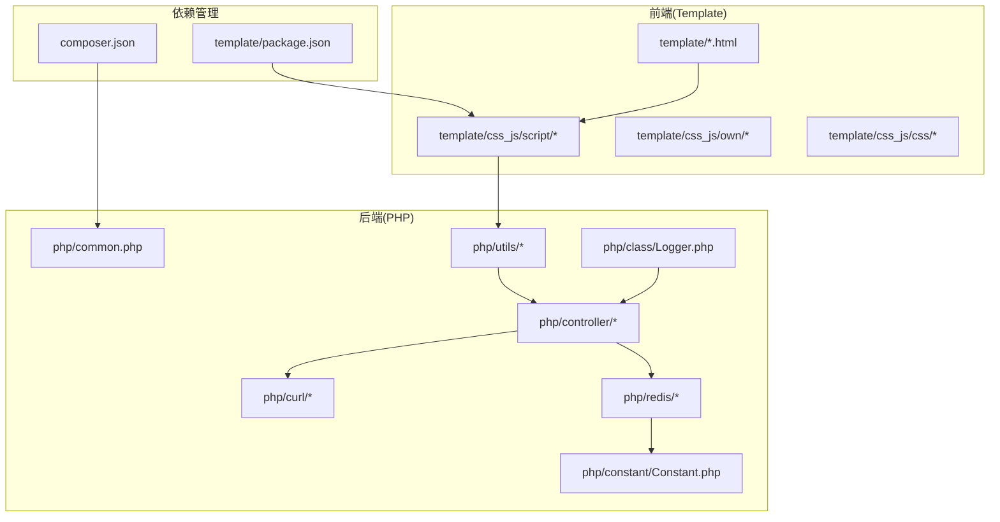
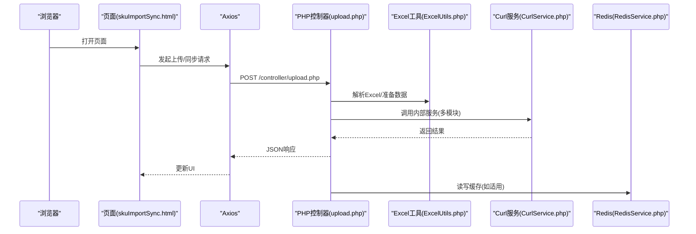
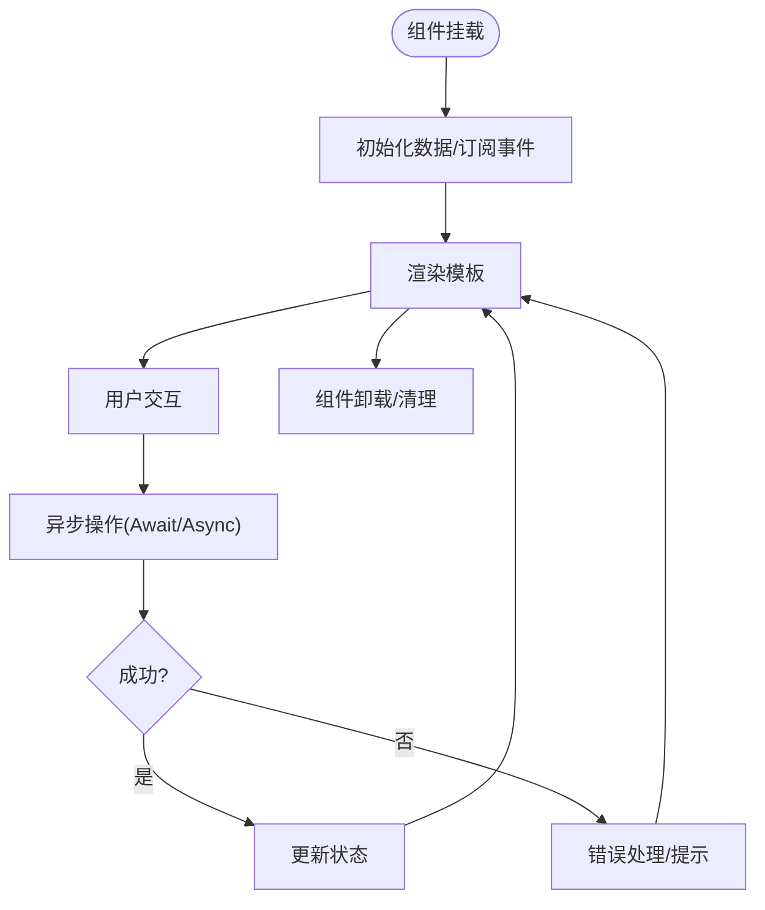
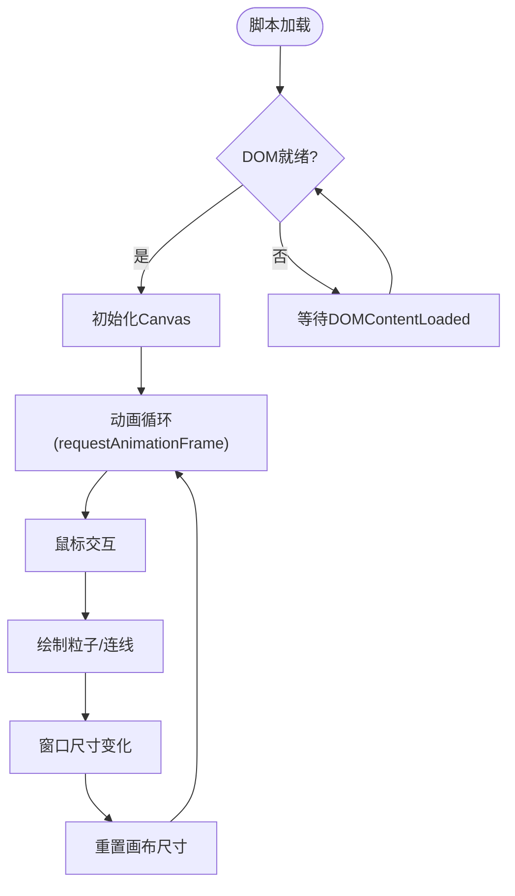
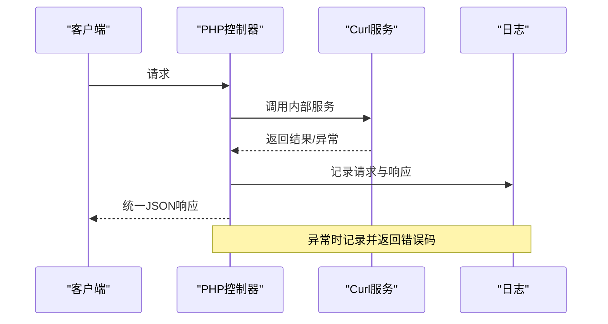
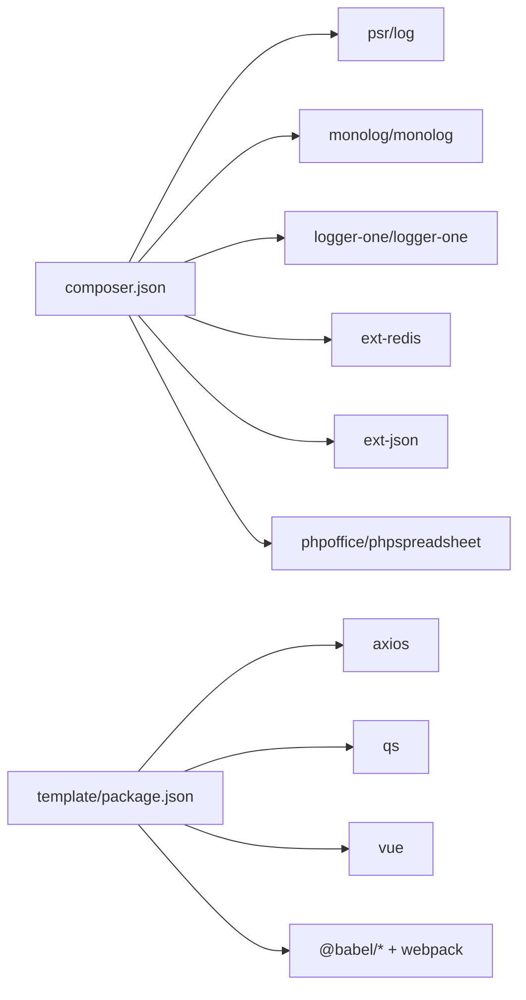

# 代码规范与最佳实践

<cite>
**本文档引用的文件**
- [composer.json](file://composer.json)
- [common.php](file://php/common.php)
- [Logger.php](file://php/class/Logger.php)
- [Constant.php](file://php/constant/Constant.php)
- [package.json](file://template/package.json)
- [upload.php](file://php/controller/upload.php)
- [DataUtils.php](file://php/utils/DataUtils.php)
- [RedisService.php](file://php/redis/RedisService.php)
- [code.js](file://template/css_js/own/code.js)
- [code.css](file://template/css_js/own/code.css)
- [lizi.js](file://template/css_js/own/lizi.js)
- [vue.global.js](file://template/css_js/script/vue.global.js)
- [common.js](file://template/css_js/script/common.js)
- [skuImportSync.html](file://template/fix/skuImportSync.html)
- [ExcelUtils.php](file://php/utils/ExcelUtils.php)
- [ProductUtils.php](file://php/utils/ProductUtils.php)
- [CurlService.php](file://php/curl/CurlService.php)
</cite>

## 目录
1. [简介](#简介)
2. [项目结构](#项目结构)
3. [核心组件](#核心组件)
4. [架构总览](#架构总览)
5. [详细组件分析](#详细组件分析)
6. [依赖关系分析](#依赖关系分析)
7. [性能考虑](#性能考虑)
8. [故障排查指南](#故障排查指南)
9. [结论](#结论)
10. [附录](#附录)

## 简介
本指南面向PaSystem项目，系统性地制定PHP编码标准、Vue.js组件开发规范、CSS/SCSS与JavaScript编码标准、Git提交消息规范与代码审查标准、错误处理与异常管理最佳实践、性能优化与内存管理技巧，以及代码重构与遗留代码处理方法。文档以仓库现有实现为基础，结合通用工程实践，形成可落地的团队规范。

## 项目结构
PaSystem采用前后端混合部署模式：
- 后端PHP位于php目录，包含控制器、工具类、服务层、常量与日志等
- 前端模板位于template目录，包含页面、样式、脚本与静态资源
- 依赖管理通过composer.json与template/package.json分别管理PHP与前端依赖
- 项目根目录提供Composer安装与依赖锁定

**图表来源**
- [composer.json](file://composer.json#L1-L11)
- [package.json](file://template/package.json#L1-L15)
- [common.php](file://php/common.php#L1-L9)
- [Logger.php](file://php/class/Logger.php#L1-L55)
- [Constant.php](file://php/constant/Constant.php#L1-L26)

**章节来源**
- [composer.json](file://composer.json#L1-L11)
- [package.json](file://template/package.json#L1-L15)
- [common.php](file://php/common.php#L1-L9)

## 核心组件
- PHP通用入口与跨域配置：统一设置跨域头与字符集，便于前后端联调
- 日志组件：提供基础文件日志能力，并预留Monolog与LoggerOne集成点
- 常量与Redis配置：集中定义Redis连接参数与键空间命名
- Excel工具：基于PhpSpreadsheet实现读写与格式兼容处理
- Curl服务：封装多环境、多模块的HTTP客户端，支持重试与日志
- 前端脚手架：引入Vue、Axios、Bootstrap等依赖，提供页面与交互

**章节来源**
- [common.php](file://php/common.php#L1-L9)
- [Logger.php](file://php/class/Logger.php#L1-L55)
- [Constant.php](file://php/constant/Constant.php#L1-L26)
- [ExcelUtils.php](file://php/utils/ExcelUtils.php#L1-L398)
- [CurlService.php](file://php/curl/CurlService.php#L1-L996)

## 架构总览
PaSystem整体交互流程如下：浏览器通过HTML页面发起请求，前端脚本调用Axios与后端PHP控制器交互，控制器使用Excel工具解析/导出文件，使用Curl服务访问内部微服务，Redis提供缓存，日志组件记录请求与错误。

**图表来源**
- [skuImportSync.html](file://template/fix/skuImportSync.html#L352-L585)
- [upload.php](file://php/controller/upload.php#L1-L138)
- [ExcelUtils.php](file://php/utils/ExcelUtils.php#L1-L398)
- [CurlService.php](file://php/curl/CurlService.php#L1-L996)
- [RedisService.php](file://php/redis/RedisService.php#L1-L77)

## 详细组件分析

### PHP编码标准与最佳实践
- 命名约定
  - 类名使用大驼峰，文件名与类名一致，遵循PSR-4命名空间约定
  - 方法与属性使用小驼峰，常量使用全大写加下划线
  - 常量文件集中定义，避免魔法数字与字符串
- 代码格式
  - 缩进统一使用4空格，括号后空一格，逗号后空一格
  - 控制结构关键字后空一格，方法调用与括号间无空格
  - 函数与类之间留空行，逻辑块之间留空行
- 注释规范
  - 类与方法使用PHPDoc注释，描述用途、参数、返回值与异常
  - 复杂算法与业务规则添加行内注释，说明背景与边界条件
- 函数设计原则
  - 单一职责，尽量短小精悍；长流程拆分为多个私有方法
  - 参数校验前置，尽早失败；返回值统一为数组/对象，便于前端消费
  - 错误处理：抛出异常或返回错误码+消息，避免静默失败
- 文件组织
  - 控制器仅负责路由与参数校验，业务逻辑下沉至工具类
  - 工具类方法静态化，减少实例化成本
  - 常量集中管理，避免分散定义

**章节来源**
- [upload.php](file://php/controller/upload.php#L1-L138)
- [DataUtils.php](file://php/utils/DataUtils.php#L1-L802)
- [ProductUtils.php](file://php/utils/ProductUtils.php#L1-L127)
- [Constant.php](file://php/constant/Constant.php#L1-L26)

### Vue.js组件开发规范
- 组件结构
  - 单文件组件(.vue)按模板、脚本、样式三段式组织
  - 本项目使用全局Vue实例方式，建议逐步迁移到模块化打包
- Props设计
  - 明确props类型与默认值，使用布尔类型开关控制行为
  - 避免在组件内直接修改props，通过事件向上反馈
- 事件处理
  - 使用v-on绑定事件，命名采用小驼峰
  - 异步操作使用await/async，统一错误捕获与提示
- 状态管理
  - 简单状态直接在data中维护
  - 复杂状态与共享数据建议引入Vuex或Pinia，提升可维护性
- 生命周期与副作用
  - 在mounted中初始化外部资源，在beforeUnmount清理定时器与事件监听
  - 避免在渲染函数中执行副作用

**图表来源**
- [skuImportSync.html](file://template/fix/skuImportSync.html#L352-L585)

**章节来源**
- [skuImportSync.html](file://template/fix/skuImportSync.html#L1-L585)
- [vue.global.js](file://template/css_js/script/vue.global.js#L1-L800)

### CSS/SCSS样式规范与JavaScript编码标准
- CSS/SCSS
  - 使用BEM或功能型命名，避免深层嵌套
  - 优先使用语义化类名，颜色与尺寸变量集中管理
  - 响应式断点与组件样式分离，避免全局污染
- JavaScript
  - ES6+语法优先，使用const/let声明变量
  - 函数式编程风格，避免全局变量，使用模块化封装
  - DOM操作最小化，批量更新时使用DocumentFragment
  - Canvas动画注意帧率与内存释放，及时清理定时器

**图表来源**
- [lizi.js](file://template/css_js/own/lizi.js#L1-L97)
- [code.js](file://template/css_js/own/code.js#L1-L62)
- [code.css](file://template/css_js/own/code.css#L1-L36)

**章节来源**
- [lizi.js](file://template/css_js/own/lizi.js#L1-L97)
- [code.js](file://template/css_js/own/code.js#L1-L62)
- [code.css](file://template/css_js/own/code.css#L1-L36)

### Git提交消息规范与代码审查标准
- 提交消息规范
  - 标题：动词开头，简洁描述变更目的(如feat: 添加Excel导入功能)
  - 正文：说明变更动机、影响范围与风险点
  - 闭合Issue：在正文末尾引用关联Issue或需求编号
- 代码审查标准
  - 必须通过静态检查与单元测试
  - 关键路径必须有注释与边界条件说明
  - 复杂逻辑建议拆分PR，避免一次性引入过多变更
  - 审查者需关注安全性、性能与可维护性

### 错误处理与异常管理最佳实践
- PHP
  - 统一返回结构：包含httpCode、header、result
  - 对外错误：捕获异常并返回明确错误码与消息
  - 对内错误：记录日志并重试有限次数
- 日志
  - 使用MyLogger记录请求URL、参数与响应状态
  - 分环境分文件，避免敏感信息泄露
- 前端
  - Axios拦截器统一处理错误与超时
  - Toast提示错误信息，避免控制台裸错误

**图表来源**
- [CurlService.php](file://php/curl/CurlService.php#L664-L740)
- [Logger.php](file://php/class/Logger.php#L14-L55)

**章节来源**
- [CurlService.php](file://php/curl/CurlService.php#L1-L996)
- [Logger.php](file://php/class/Logger.php#L1-L55)

### 性能优化与内存管理
- PHP
  - Excel读取：使用PhpSpreadsheet流式读取，避免一次性加载大文件
  - Redis：合理设置过期时间，批量操作使用pipeline
  - Curl：复用连接，设置超时与重试，避免阻塞
- 前端
  - Canvas动画：限制粒子数量，使用requestAnimationFrame
  - DOM：减少重排重绘，使用虚拟滚动处理长列表
  - 资源：CDN加速、按需加载、压缩合并

### 代码重构指导与遗留代码处理
- 重构原则
  - 以测试驱动，保证行为不变
  - 逐步替换：先加适配层，再迁移调用方
  - 文档先行：更新接口文档与变更说明
- 遗留代码
  - 标记废弃API与函数，提供迁移指引
  - 逐步淘汰第三方库，统一到现代生态
  - 增加监控与告警，及时发现异常

## 依赖关系分析
- PHP运行时依赖
  - psr/log、monolog/monolog、logger-one/logger-one用于日志标准化
  - ext-redis、ext-json用于Redis与JSON处理
  - phpoffice/phpspreadsheet用于Excel读写
- 前端依赖
  - axios、qs、vue用于HTTP与响应式数据
  - webpack与babel用于构建与转译

**图表来源**
- [composer.json](file://composer.json#L1-L11)
- [package.json](file://template/package.json#L1-L15)

**章节来源**
- [composer.json](file://composer.json#L1-L11)
- [package.json](file://template/package.json#L1-L15)

## 性能考虑
- I/O密集场景
  - Excel解析：分片读取，避免内存峰值
  - Redis：批量写入，设置合理TTL
- 网络请求
  - 合并请求，减少往返；设置超时与指数退避
- 前端渲染
  - 虚拟列表、懒加载、防抖节流
- 日志与监控
  - 异步写日志，采样记录关键路径

## 故障排查指南
- 常见问题定位
  - 查看日志文件与错误码，确认请求参数与返回体
  - 检查Redis连接参数与键空间是否正确
  - 核对Excel列名与数据类型，避免解析异常
- 前端调试
  - 打开开发者工具，观察网络面板与Console
  - 检查跨域头与Content-Type设置
- 回归测试
  - 针对上传、解析、同步等关键流程编写自动化用例

**章节来源**
- [common.php](file://php/common.php#L1-L9)
- [Logger.php](file://php/class/Logger.php#L1-L55)
- [ExcelUtils.php](file://php/utils/ExcelUtils.php#L1-L398)
- [RedisService.php](file://php/redis/RedisService.php#L1-L77)

## 结论
本指南基于PaSystem现有实现，提出了统一的编码规范与最佳实践，涵盖PHP、Vue.js、CSS/SCSS与JavaScript、Git与代码审查、错误处理与性能优化等方面。建议团队在实际开发中严格执行，并根据项目演进持续迭代完善。

## 附录
- 命名与注释示例参考
  - 类与方法注释：参考[DataUtils.php](file://php/utils/DataUtils.php#L3-L29)
  - 常量定义：参考[Constant.php](file://php/constant/Constant.php#L1-L26)
  - 日志记录：参考[Logger.php](file://php/class/Logger.php#L22-L25)
- 前端脚手架与依赖
  - 依赖声明：参考[package.json](file://template/package.json#L1-L15)
  - 全局脚本引入：参考[common.js](file://template/css_js/script/common.js#L1-L5)