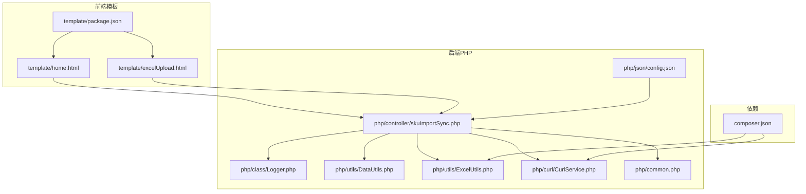
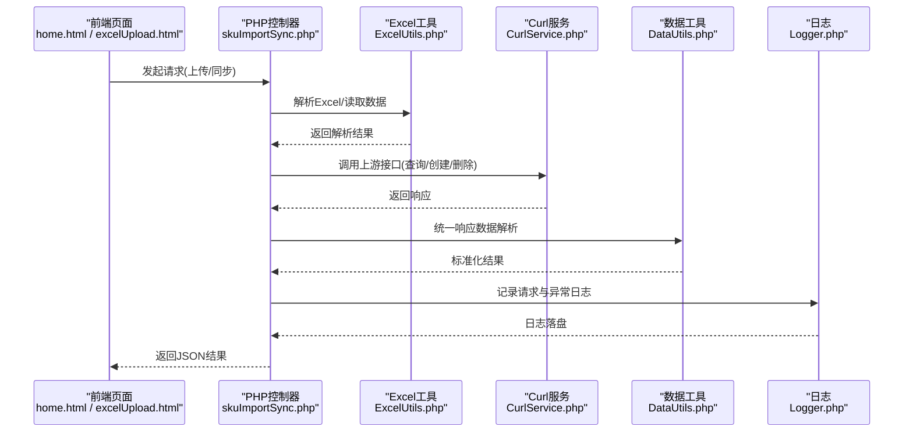
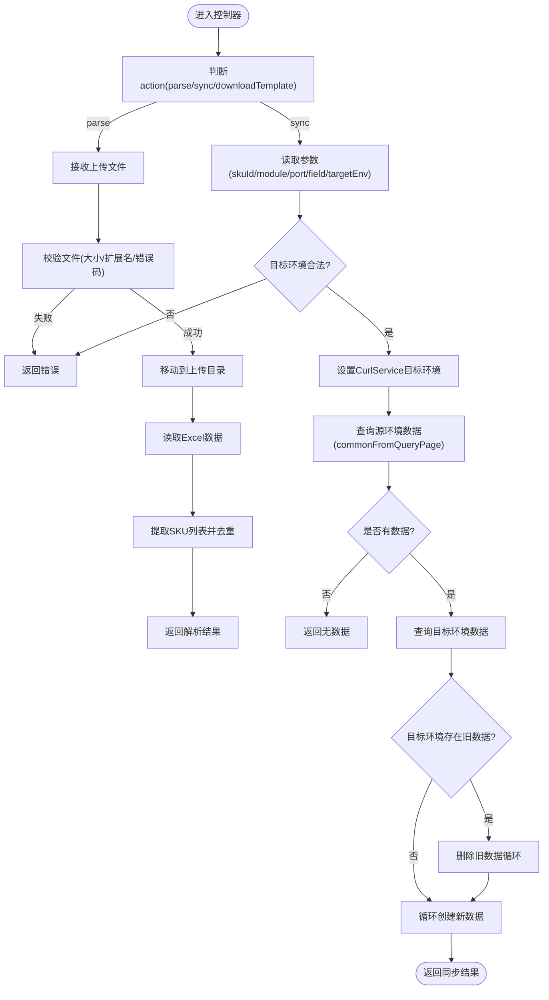
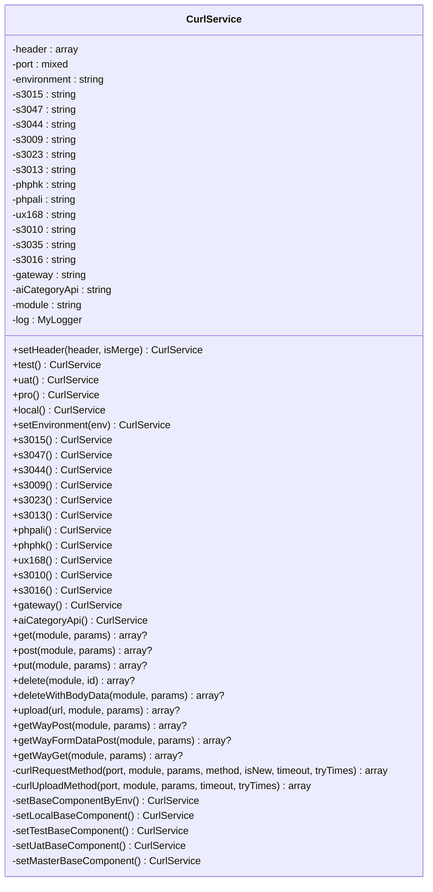
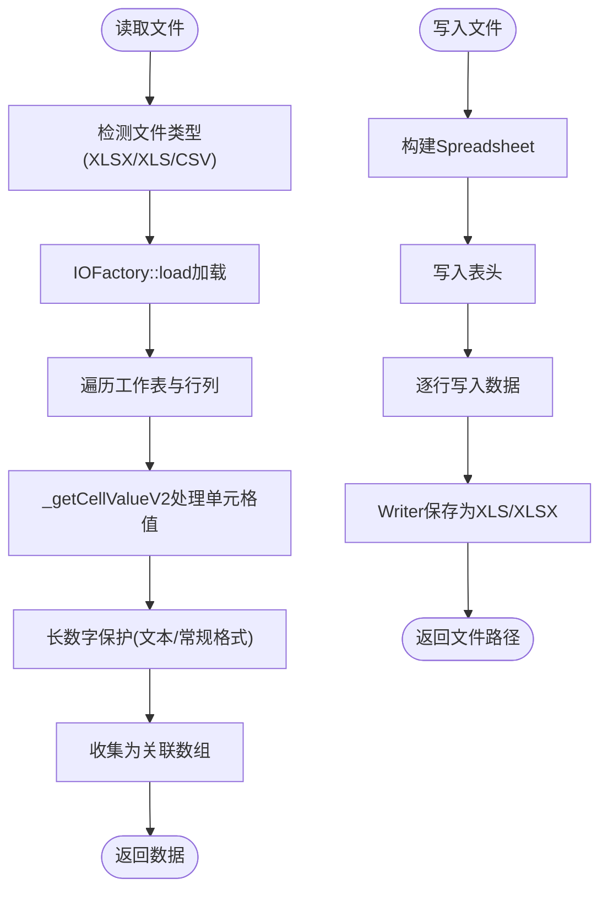
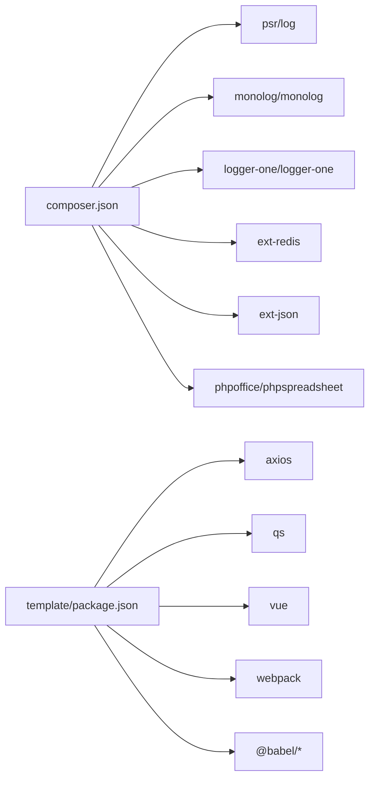

# 开发指南

<cite>
**本文引用的文件**
- [composer.json](file://composer.json)
- [php/common.php](file://php/common.php)
- [php/json/config.json](file://php/json/config.json)
- [template/package.json](file://template/package.json)
- [php/class/Logger.php](file://php/class/Logger.php)
- [php/utils/DataUtils.php](file://php/utils/DataUtils.php)
- [php/controller/skuImportSync.php](file://php/controller/skuImportSync.php)
- [template/home.html](file://template/home.html)
- [template/excelUpload.html](file://template/excelUpload.html)
- [php/utils/ExcelUtils.php](file://php/utils/ExcelUtils.php)
- [php/curl/CurlService.php](file://php/curl/CurlService.php)
</cite>

## 目录
1. [简介](#简介)
2. [项目结构](#项目结构)
3. [核心组件](#核心组件)
4. [架构总览](#架构总览)
5. [详细组件分析](#详细组件分析)
6. [依赖关系分析](#依赖关系分析)
7. [性能考虑](#性能考虑)
8. [故障排查指南](#故障排查指南)
9. [结论](#结论)
10. [附录](#附录)

## 简介
本开发指南面向PaSystem项目，提供从环境搭建、代码规范、测试策略、Git工作流、日志与调试、代码评审到新功能开发模板与性能优化的全流程指导。文档兼顾PHP后端与前端Vue组件的开发实践，帮助团队统一标准、提升效率与质量。

## 项目结构
PaSystem采用前后端分离的静态页面+PHP后端接口模式：
- 前端模板位于 template/，包含HTML页面、样式与脚本资源
- 后端PHP控制器与工具类位于 php/，包含控制器、工具、日志、CURL服务等
- 依赖管理通过Composer与npm分别管理PHP与前端依赖
- 配置文件位于 php/json/config.json，定义业务规则与广告设置

图表来源
- [template/home.html](file://template/home.html#L1-L761)
- [template/excelUpload.html](file://template/excelUpload.html#L1-L472)
- [template/package.json](file://template/package.json#L1-L15)
- [php/controller/skuImportSync.php](file://php/controller/skuImportSync.php#L1-L512)
- [php/class/Logger.php](file://php/class/Logger.php#L1-L55)
- [php/utils/DataUtils.php](file://php/utils/DataUtils.php#L1-L802)
- [php/utils/ExcelUtils.php](file://php/utils/ExcelUtils.php#L1-L398)
- [php/curl/CurlService.php](file://php/curl/CurlService.php#L1-L996)
- [php/json/config.json](file://php/json/config.json#L1-L316)
- [php/common.php](file://php/common.php#L1-L9)
- [composer.json](file://composer.json#L1-L11)

章节来源
- [composer.json](file://composer.json#L1-L11)
- [template/package.json](file://template/package.json#L1-L15)
- [php/common.php](file://php/common.php#L1-L9)
- [php/json/config.json](file://php/json/config.json#L1-L316)

## 核心组件
- 日志系统：MyLogger提供基础文件日志能力，并预留Monolog与LoggerOne集成路径
- Excel工具：ExcelUtils封装读写、CSV处理与长数字保护
- 数据工具：DataUtils提供统一响应数据解析与数组处理
- Curl服务：CurlService封装多环境、多模块、多端口的HTTP请求
- 控制器：skuImportSync负责Excel上传、解析与SKU同步流程
- 前端页面：home.html提供功能导航，excelUpload.html提供Excel上传与预览

章节来源
- [php/class/Logger.php](file://php/class/Logger.php#L1-L55)
- [php/utils/ExcelUtils.php](file://php/utils/ExcelUtils.php#L1-L398)
- [php/utils/DataUtils.php](file://php/utils/DataUtils.php#L1-L802)
- [php/curl/CurlService.php](file://php/curl/CurlService.php#L1-L996)
- [php/controller/skuImportSync.php](file://php/controller/skuImportSync.php#L1-L512)
- [template/home.html](file://template/home.html#L1-L761)
- [template/excelUpload.html](file://template/excelUpload.html#L1-L472)

## 架构总览
后端通过PHP控制器接收前端请求，调用Excel工具解析文件，使用Curl服务访问上游服务，再通过数据工具统一响应格式，最后由前端页面渲染展示。

图表来源
- [php/controller/skuImportSync.php](file://php/controller/skuImportSync.php#L1-L512)
- [php/utils/ExcelUtils.php](file://php/utils/ExcelUtils.php#L1-L398)
- [php/curl/CurlService.php](file://php/curl/CurlService.php#L1-L996)
- [php/utils/DataUtils.php](file://php/utils/DataUtils.php#L1-L802)
- [php/class/Logger.php](file://php/class/Logger.php#L1-L55)
- [template/excelUpload.html](file://template/excelUpload.html#L1-L472)
- [template/home.html](file://template/home.html#L1-L761)

## 详细组件分析

### 组件A：Excel上传与SKU同步流程
- 功能概述：支持Excel上传、解析、模板下载、SKU同步至目标环境
- 关键流程：
  - 上传校验：扩展名、大小、错误码
  - 解析Excel：读取首行作为表头，逐行提取数据
  - 同步逻辑：按字段查询源环境数据，清理目标环境旧数据后批量创建
  - 环境切换：通过反射动态设置CurlService目标环境(test/uat)
  - 日志记录：请求、参数、结果、异常均写入日志文件

图表来源
- [php/controller/skuImportSync.php](file://php/controller/skuImportSync.php#L1-L512)

章节来源
- [php/controller/skuImportSync.php](file://php/controller/skuImportSync.php#L1-L512)

### 组件B：CurlService多环境与模块路由
- 功能概述：集中管理多环境(baseURL)、多模块(module)、多端口(port)的HTTP请求
- 设计要点：
  - 环境切换：test/uat/pro/local
  - 模块映射：通过getModule映射不同服务模块
  - 端口映射：s3015/s3047/s3044/s3009/s3023/s3013/phpali/phphk/ux168/s3010/s3016/gateway/aiCategoryApi
  - 请求方法：get/post/put/delete/upload/getWayPost/getWayFormDataPost/getWayGet
  - 日志记录：请求URL与参数写入curl/request日志

图表来源
- [php/curl/CurlService.php](file://php/curl/CurlService.php#L1-L996)
- [php/class/Logger.php](file://php/class/Logger.php#L1-L55)

章节来源
- [php/curl/CurlService.php](file://php/curl/CurlService.php#L1-L996)

### 组件C：Excel工具与长数字保护
- 功能概述：读写Excel、CSV，处理长数字不丢失精度
- 关键点：
  - PhpSpreadsheet替代PHPExcel，支持XLSX/XLS/CSV
  - 单元格值读取时识别富文本、文本格式、常规格式，必要时转为字符串
  - 导出支持XLS与XLSX两种格式

图表来源
- [php/utils/ExcelUtils.php](file://php/utils/ExcelUtils.php#L1-L398)

章节来源
- [php/utils/ExcelUtils.php](file://php/utils/ExcelUtils.php#L1-L398)

### 组件D：数据工具与响应解析
- 功能概述：统一解析后端响应，提供多种数据提取方法
- 关键点：
  - getResultData/getPageList/getQueryList/getPageDocList等
  - getNewResultData兼容新架构
  - 数组去重、查找、字段提取、UUID生成等辅助方法

章节来源
- [php/utils/DataUtils.php](file://php/utils/DataUtils.php#L1-L802)

### 组件E：日志系统
- 功能概述：提供基础文件日志能力，支持Monolog与LoggerOne集成占位
- 关键点：
  - 日志文件按日期分片
  - 支持普通写入与第三方库集成

章节来源
- [php/class/Logger.php](file://php/class/Logger.php#L1-L55)

## 依赖关系分析
- PHP依赖：psr/log、monolog/monolog、logger-one/logger-one、ext-redis、ext-json、phpoffice/phpspreadsheet
- 前端依赖：axios、qs、vue、webpack、babel等

图表来源
- [composer.json](file://composer.json#L1-L11)
- [template/package.json](file://template/package.json#L1-L15)

章节来源
- [composer.json](file://composer.json#L1-L11)
- [template/package.json](file://template/package.json#L1-L15)

## 性能考虑
- Excel处理
  - 使用PhpSpreadsheet替代PHPExcel，具备更好的内存管理
  - 长数字保护：在读取时根据单元格格式强制文本或字符串，避免科学计数法丢失精度
- 网络请求
  - CurlService统一超时与重试机制，建议结合熔断与限流
  - 环境配置集中管理，减少硬编码带来的切换成本
- 前端交互
  - 使用Vue响应式数据绑定，避免不必要的DOM操作
  - 上传进度与错误提示增强用户体验

章节来源
- [php/utils/ExcelUtils.php](file://php/utils/ExcelUtils.php#L1-L398)
- [php/curl/CurlService.php](file://php/curl/CurlService.php#L1-L996)
- [template/excelUpload.html](file://template/excelUpload.html#L1-L472)

## 故障排查指南
- Excel上传失败
  - 检查文件大小与扩展名限制
  - 确认上传目录可写权限
  - 查看日志文件php/log/default/与php/log/sku_import_sync_*
- SKU同步异常
  - 核对目标环境(test/uat)与字段参数
  - 检查CurlService的Authorization与端口映射
  - 关注日志中的异常堆栈与HTTP状态码
- 响应数据解析错误
  - 使用DataUtils提供的统一解析方法，确认后端返回结构
- 前端页面加载失败
  - 检查CDN资源可用性与本地打包产物
  - 确认跨域头设置与Content-Type

章节来源
- [php/controller/skuImportSync.php](file://php/controller/skuImportSync.php#L1-L512)
- [php/class/Logger.php](file://php/class/Logger.php#L1-L55)
- [php/utils/DataUtils.php](file://php/utils/DataUtils.php#L1-L802)
- [php/common.php](file://php/common.php#L1-L9)

## 结论
PaSystem通过清晰的前后端职责划分、统一的Excel处理与HTTP请求封装、标准化的日志与数据解析工具，形成了可维护、可扩展的开发体系。遵循本文档的开发规范与流程，可显著提升开发效率与系统稳定性。

## 附录

### 开发环境搭建
- PHP运行环境：启用ext-redis、ext-json
- Composer安装：安装composer.json声明的PHP依赖
- 前端依赖：安装template/package.json声明的依赖
- Web服务器：配置静态资源与PHP入口，确保跨域头与字符集设置

章节来源
- [composer.json](file://composer.json#L1-L11)
- [template/package.json](file://template/package.json#L1-L15)
- [php/common.php](file://php/common.php#L1-L9)

### 代码规范与最佳实践
- PHP
  - 类与方法命名遵循PSR-4/PSR-12风格
  - 使用DataUtils/DataUtils统一响应解析
  - Excel处理使用ExcelUtils，注意长数字保护
  - CurlService集中管理环境与模块，避免硬编码
- Vue.js
  - 组件拆分与职责单一
  - 使用响应式数据绑定，避免直接操作DOM
  - 上传与请求使用axios，配合进度与错误提示

章节来源
- [php/utils/DataUtils.php](file://php/utils/DataUtils.php#L1-L802)
- [php/utils/ExcelUtils.php](file://php/utils/ExcelUtils.php#L1-L398)
- [php/curl/CurlService.php](file://php/curl/CurlService.php#L1-L996)
- [template/excelUpload.html](file://template/excelUpload.html#L1-L472)

### 测试策略与单元测试
- 建议
  - 为Excel工具增加边界用例（空文件、长数字、特殊字符）
  - 为CurlService增加Mock测试，覆盖多环境与异常场景
  - 为控制器增加集成测试，模拟上传与同步流程
- 单元测试编写要点
  - 使用断言验证响应结构与数据一致性
  - 使用日志断言定位异常

章节来源
- [php/utils/ExcelUtils.php](file://php/utils/ExcelUtils.php#L1-L398)
- [php/curl/CurlService.php](file://php/curl/CurlService.php#L1-L996)
- [php/controller/skuImportSync.php](file://php/controller/skuImportSync.php#L1-L512)

### Git工作流程与分支管理
- 分支策略
  - develop：日常开发分支
  - feature/*：功能开发分支
  - release/*：预发布分支
  - hotfix/*：紧急修复分支
- 提交规范
  - 标准化提交信息，包含功能、影响范围与变更摘要
- 代码评审
  - 至少一名同事评审，关注安全性、性能与可维护性

[本节为通用流程建议，不直接分析具体文件]

### 日志记录与调试技巧
- 使用MyLogger记录关键路径与异常
- CurlService记录请求URL与参数，便于定位上游问题
- 前端控制台输出与网络面板检查请求与响应

章节来源
- [php/class/Logger.php](file://php/class/Logger.php#L1-L55)
- [php/curl/CurlService.php](file://php/curl/CurlService.php#L1-L996)
- [template/excelUpload.html](file://template/excelUpload.html#L1-L472)

### 代码审查清单
- 代码可读性：命名规范、注释与结构
- 安全性：输入校验、敏感信息处理、跨域与CORS
- 性能：大文件处理、网络请求优化、缓存策略
- 兼容性：多环境配置、浏览器兼容、依赖版本
- 可测试性：可Mock、可断言、边界用例覆盖

[本节为通用清单，不直接分析具体文件]

### 新功能开发模板与示例
- 模板步骤
  - 在template/新增页面与资源
  - 在php/controller/新增控制器方法
  - 在php/utils/扩展工具类或复用现有工具
  - 在php/curl/CurlService.php新增端口映射或模块映射
  - 在php/json/config.json新增配置项
  - 编写单元/集成测试
  - 提交代码并发起评审
- 示例参考
  - SKU导入同步流程：skuImportSync.php
  - Excel读写与长数字保护：ExcelUtils.php
  - 统一响应解析：DataUtils.php
  - 多环境HTTP请求：CurlService.php

章节来源
- [php/controller/skuImportSync.php](file://php/controller/skuImportSync.php#L1-L512)
- [php/utils/ExcelUtils.php](file://php/utils/ExcelUtils.php#L1-L398)
- [php/utils/DataUtils.php](file://php/utils/DataUtils.php#L1-L802)
- [php/curl/CurlService.php](file://php/curl/CurlService.php#L1-L996)
- [php/json/config.json](file://php/json/config.json#L1-L316)

### 性能分析与优化方法
- PHP
  - 使用PhpSpreadsheet优化内存占用
  - 对长数字读取进行格式识别与字符串保护
- 前端
  - 减少不必要的响应式计算，合理使用虚拟滚动
  - 上传进度与错误提示优化用户体验
- 网络
  - 统一超时与重试，必要时引入熔断与降级

章节来源
- [php/utils/ExcelUtils.php](file://php/utils/ExcelUtils.php#L1-L398)
- [template/excelUpload.html](file://template/excelUpload.html#L1-L472)
- [php/curl/CurlService.php](file://php/curl/CurlService.php#L1-L996)