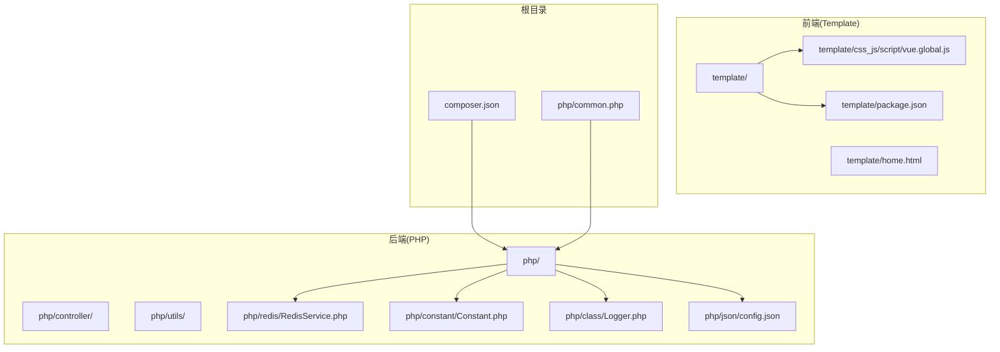
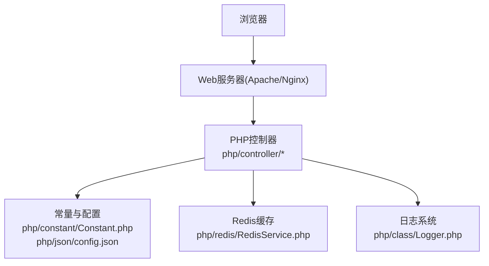
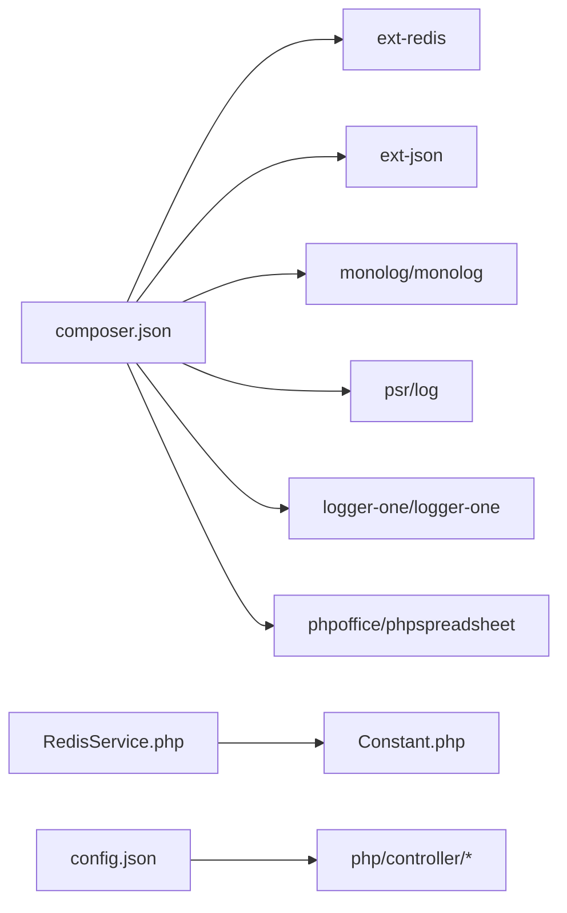

# 开发环境搭建

<cite>
**本文引用的文件**
- [composer.json](file://composer.json)
- [package.json](file://template/package.json)
- [common.php](file://php/common.php)
- [config.json](file://php/json/config.json)
- [RedisService.php](file://php/redis/RedisService.php)
- [Constant.php](file://php/constant/Constant.php)
- [Logger.php](file://php/class/Logger.php)
</cite>

## 目录
1. [简介](#简介)
2. [项目结构](#项目结构)
3. [核心组件](#核心组件)
4. [架构总览](#架构总览)
5. [详细组件分析](#详细组件分析)
6. [依赖关系分析](#依赖关系分析)
7. [性能考虑](#性能考虑)
8. [故障排除指南](#故障排除指南)
9. [结论](#结论)
10. [附录](#附录)

## 简介
本指南面向PaSystem项目的开发者，提供从零搭建本地开发环境的完整流程，涵盖PHP后端、前端、数据库与缓存、Web服务器以及IDE配置建议。文档基于仓库中的实际配置文件进行说明，确保每一步都可落地执行。

## 项目结构
PaSystem采用前后端分离与后端脚本并行的组织方式：
- 后端PHP逻辑位于php目录，包含控制器、工具类、日志、Redis封装等
- 前端静态资源与示例页面位于template目录，包含Vue 2示例与打包工具配置
- 根目录composer.json声明PHP扩展与第三方库依赖
- 常量与配置通过常量文件与JSON配置文件集中管理

图表来源
- [composer.json](file://composer.json#L1-L11)
- [package.json](file://template/package.json#L1-L15)
- [common.php](file://php/common.php#L1-L9)
- [config.json](file://php/json/config.json#L1-L316)
- [RedisService.php](file://php/redis/RedisService.php#L1-L77)
- [Constant.php](file://php/constant/Constant.php#L1-L26)
- [Logger.php](file://php/class/Logger.php#L1-L55)

章节来源
- [composer.json](file://composer.json#L1-L11)
- [package.json](file://template/package.json#L1-L15)
- [common.php](file://php/common.php#L1-L9)

## 核心组件
- PHP扩展与依赖
  - 必需扩展：ext-redis、ext-json
  - 第三方库：psr/log、monolog/monolog、logger-one/logger-one、phpoffice/phpspreadsheet
- 前端依赖与构建
  - 运行时依赖：axios、qs、vue
  - 开发依赖：@babel/core、@babel/preset-env、babel-loader、webpack、webpack-cli
- 常量与配置
  - Redis连接常量：REDIS_HOST、REDIS_PORT、REDIS_PWD
  - 业务规则配置：php/json/config.json
- 日志与跨域
  - 默认日志落盘策略与日期分片
  - 全局跨域响应头设置

章节来源
- [composer.json](file://composer.json#L1-L11)
- [package.json](file://template/package.json#L1-L15)
- [Constant.php](file://php/constant/Constant.php#L1-L26)
- [config.json](file://php/json/config.json#L1-L316)
- [Logger.php](file://php/class/Logger.php#L1-L55)
- [common.php](file://php/common.php#L1-L9)

## 架构总览
下图展示开发环境的关键交互：浏览器请求经由Web服务器路由到PHP控制器，控制器读取配置与常量，访问Redis缓存，最终返回结果；前端通过Vue与Axios与后端交互。

图表来源
- [RedisService.php](file://php/redis/RedisService.php#L1-L77)
- [Constant.php](file://php/constant/Constant.php#L1-L26)
- [config.json](file://php/json/config.json#L1-L316)
- [Logger.php](file://php/class/Logger.php#L1-L55)

## 详细组件分析

### PHP后端环境准备
- PHP版本与扩展
  - 使用支持ext-redis与ext-json的PHP运行时
  - 安装并启用上述扩展以满足composer.json要求
- Composer依赖安装
  - 在项目根目录执行安装命令以生成vendor目录
  - 安装完成后，确保扩展已正确加载且无报错
- 常量与Redis配置
  - Redis默认连接地址与端口、认证密码在常量文件中定义
  - RedisService封装了常用操作，如hash读写、字符串存取、过期时间设置等
- 日志与跨域
  - Logger类提供基础文件日志能力，默认按日期切分
  - common.php设置全局跨域响应头，便于前后端联调

章节来源
- [composer.json](file://composer.json#L1-L11)
- [Constant.php](file://php/constant/Constant.php#L1-L26)
- [RedisService.php](file://php/redis/RedisService.php#L1-L77)
- [Logger.php](file://php/class/Logger.php#L1-L55)
- [common.php](file://php/common.php#L1-L9)

### 前端开发环境设置
- Node.js与包管理器
  - 安装Node.js LTS版本
  - 使用npm或yarn安装依赖（template/package.json）
- Vue.js与构建工具
  - 运行时依赖包含Vue 2与Axios、QS
  - 开发依赖包含Babel与Webpack，用于本地构建与热更新
- 示例页面
  - template/home.html为入口页面，可直接打开进行联调
  - Vue示例脚本位于template/css_js/script/vue.global.js

章节来源
- [package.json](file://template/package.json#L1-L15)

### 本地服务器搭建（Apache/Nginx）
- Apache
  - 将项目根目录作为站点根目录
  - 确保对PHP文件的解析正常，静态资源可访问
- Nginx
  - 反向代理或直接指向项目根目录
  - 配置静态资源与PHP解析规则
- 虚拟主机
  - 建议为项目配置独立域名，便于Cookie、跨域与HTTPS联调
  - 在hosts中绑定域名至127.0.0.1

[本节为通用部署建议，不涉及具体源码文件，故无“章节来源”]

### 数据库与Redis配置
- Redis
  - 使用常量文件中的默认地址与端口进行连接
  - 认证密码在常量中定义，RedisService构造函数中完成连接与鉴权
  - 如需变更，请同步修改常量文件并在RedisService中生效
- 数据库
  - 本仓库未包含数据库配置文件，若项目使用数据库，请在对应控制器或服务层补充连接配置

章节来源
- [Constant.php](file://php/constant/Constant.php#L1-L26)
- [RedisService.php](file://php/redis/RedisService.php#L1-L77)

### 环境变量与安全设置
- 环境变量
  - Redis连接参数已在常量文件中硬编码，如需区分开发/生产，建议引入.env并从环境变量读取
- 安全建议
  - 生产环境关闭错误显示，统一通过日志记录
  - 跨域头仅在开发阶段放开，生产阶段限定来源域名
  - Redis密码应定期轮换，避免弱口令

[本节为通用安全建议，不涉及具体源码文件，故无“章节来源”]

### IDE配置建议
- PHPStorm
  - PHP版本选择与扩展检查：确保启用ext-redis与ext-json
  - 代码格式化：使用PSR-12风格，结合内置代码清理
  - 调试：配置Xdebug或PHPDBG，设置断点与监听端口
- VS Code
  - 扩展：安装PHP Intelephense、PHP Debug、EditorConfig、Prettier
  - 代码格式化：配置prettier与editorconfig，保持团队一致
  - 调试：使用PHP Debug扩展，配合launch.json配置启动

[本节为通用IDE建议，不涉及具体源码文件，故无“章节来源”]

## 依赖关系分析
- PHP后端依赖
  - composer.json声明了日志、Excel处理与Redis扩展需求
  - RedisService依赖常量文件提供的连接参数
- 前端依赖
  - template/package.json声明Vue 2与构建工具链
- 配置耦合
  - php/json/config.json为业务规则配置中心，被相关控制器读取使用

图表来源
- [composer.json](file://composer.json#L1-L11)
- [RedisService.php](file://php/redis/RedisService.php#L1-L77)
- [Constant.php](file://php/constant/Constant.php#L1-L26)
- [config.json](file://php/json/config.json#L1-L316)

章节来源
- [composer.json](file://composer.json#L1-L11)
- [RedisService.php](file://php/redis/RedisService.php#L1-L77)
- [Constant.php](file://php/constant/Constant.php#L1-L26)
- [config.json](file://php/json/config.json#L1-L316)

## 性能考虑
- Redis缓存命中率
  - 合理设置键过期时间，避免内存膨胀
  - 对热点数据使用hash结构存储，减少序列化开销
- 日志落盘
  - 按日期切分日志，避免单文件过大
  - 生产环境建议异步写入或使用专用日志采集
- 前端构建
  - 使用Webpack优化打包体积，开启Tree Shaking与代码分割
  - 生产环境启用压缩与缓存策略

[本节为通用性能建议，不涉及具体源码文件，故无“章节来源”]

## 故障排除指南
- PHP扩展缺失
  - 症状：Composer安装时报错或运行时报扩展未加载
  - 处理：确认ext-redis与ext-json已安装并启用
- Redis连接失败
  - 症状：连接超时或认证失败
  - 处理：核对常量文件中的REDIS_HOST、REDIS_PORT、REDIS_PWD是否正确
- 跨域问题
  - 症状：前端请求被浏览器拦截
  - 处理：检查common.php中的跨域头设置，生产环境请限制来源域名
- 日志无法写入
  - 症状：日志文件未生成或权限不足
  - 处理：确认日志目录存在且具备写权限

章节来源
- [common.php](file://php/common.php#L1-L9)
- [Constant.php](file://php/constant/Constant.php#L1-L26)
- [RedisService.php](file://php/redis/RedisService.php#L1-L77)
- [Logger.php](file://php/class/Logger.php#L1-L55)

## 结论
通过本指南，您可以在本地快速搭建PaSystem的开发环境：安装PHP扩展与Composer依赖，配置Redis与日志，准备前端依赖并通过Apache/Nginx提供服务。建议在开发阶段保持宽松的跨域策略，在生产阶段严格限制来源并强化安全配置。

## 附录
- 常用命令参考
  - 安装PHP依赖：composer install
  - 安装前端依赖：npm install 或 yarn install
  - 启动前端开发服务器：根据package.json脚本执行（如webpack-dev-server）
- 文件路径速查
  - Redis配置与封装：php/redis/RedisService.php、php/constant/Constant.php
  - 业务配置：php/json/config.json
  - 日志类：php/class/Logger.php
  - 跨域与字符集：php/common.php