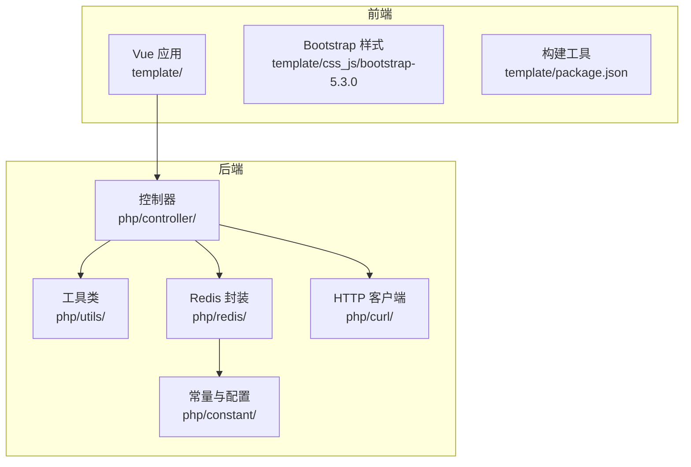
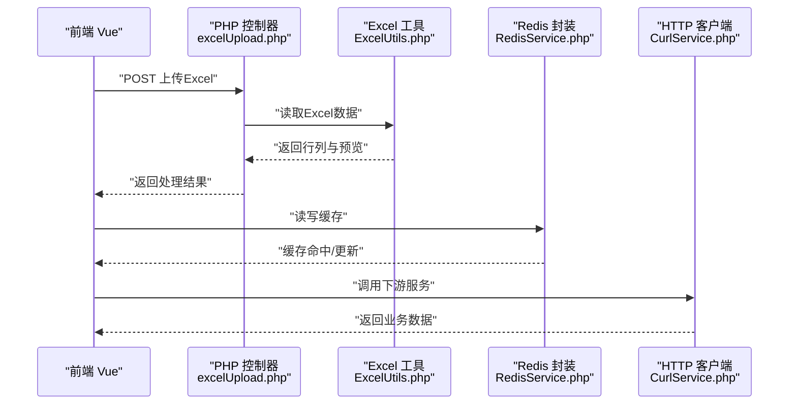
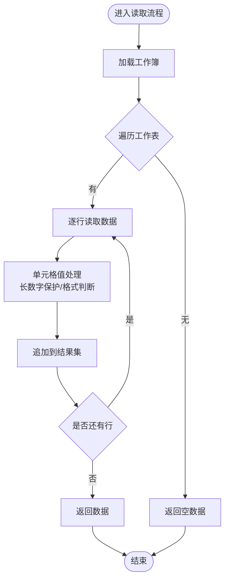
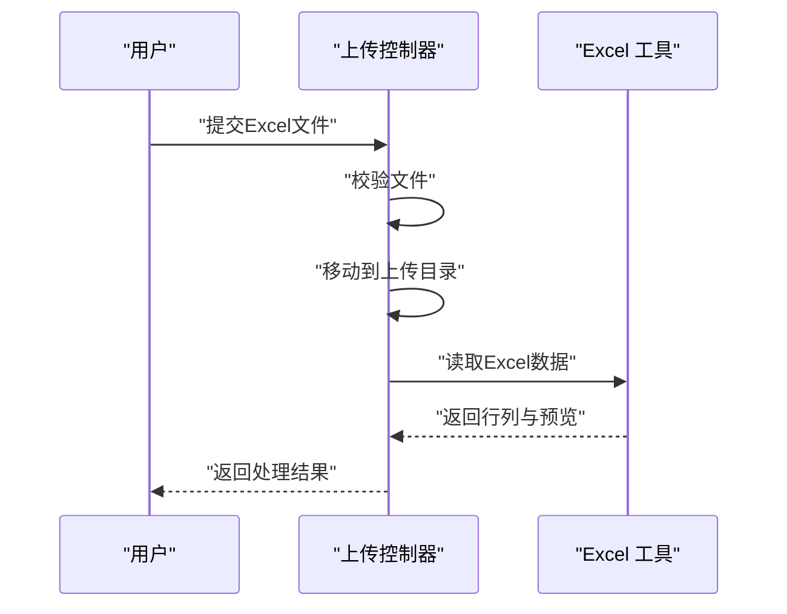
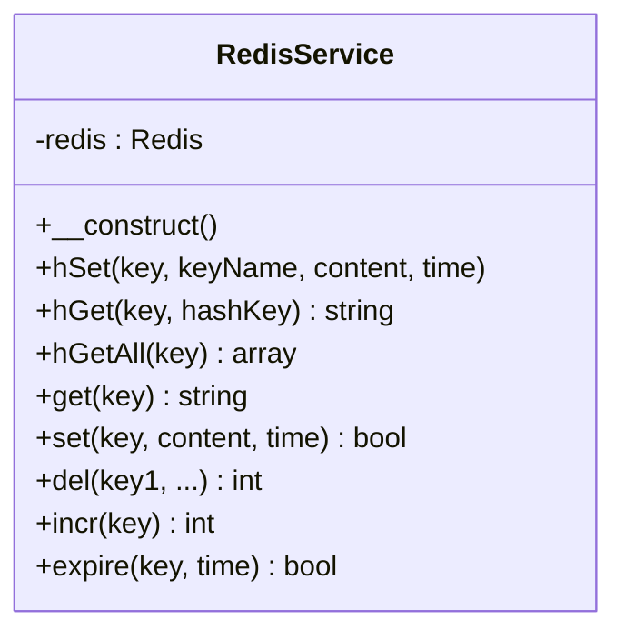
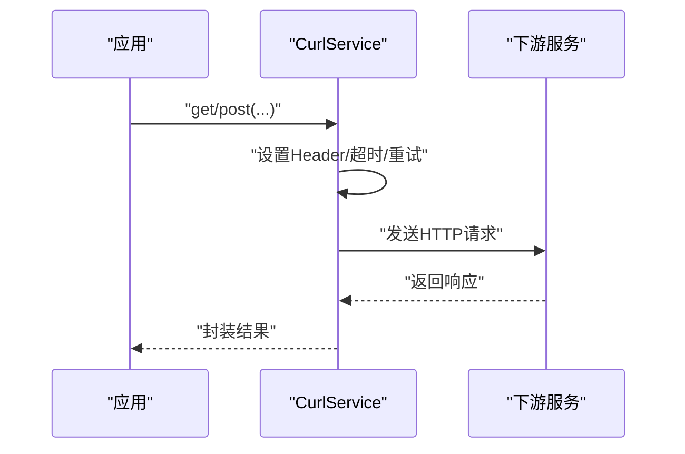
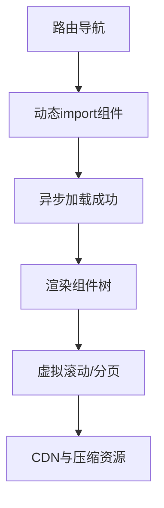
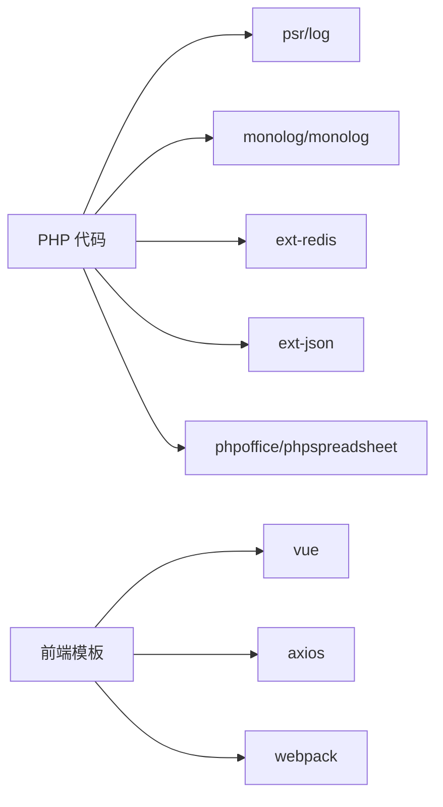

# 性能优化与分析

<cite>
**本文引用的文件**
- [common.php](file://php/common.php)
- [ExcelUtils.php](file://php/utils/ExcelUtils.php)
- [excelUpload.php](file://php/controller/excelUpload.php)
- [RedisService.php](file://php/redis/RedisService.php)
- [Constant.php](file://php/constant/Constant.php)
- [CurlService.php](file://php/curl/CurlService.php)
- [composer.json](file://composer.json)
- [package.json](file://template/package.json)
- [vue.global.js](file://template/css_js/script/vue.global.js)
- [bootstrap.css](file://template/css_js/bootstrap-5.3.0/css/bootstrap.css)
- [bootstrap.rtl.css](file://template/css_js/bootstrap-5.3.0/css/bootstrap.rtl.css)
</cite>

## 目录
1. [简介](#简介)
2. [项目结构](#项目结构)
3. [核心组件](#核心组件)
4. [架构总览](#架构总览)
5. [详细组件分析](#详细组件分析)
6. [依赖关系分析](#依赖关系分析)
7. [性能考量](#性能考量)
8. [故障排查指南](#故障排查指南)
9. [结论](#结论)
10. [附录](#附录)

## 简介
本文件面向PaSystem项目的性能优化与分析，覆盖后端PHP代码优化、前端Vue.js优化、Excel文件处理优化、Redis缓存策略、网络请求与CDN建议、数据库索引与查询分析、性能监控与指标、以及移动端与响应式设计优化。目标是在保证功能正确性的前提下，系统性降低延迟、减少内存占用、提升吞吐与稳定性。

## 项目结构
PaSystem采用前后端分离与模块化组织：
- 后端PHP位于php/目录，包含工具类、控制器、缓存、网络请求等模块
- 前端模板位于template/目录，包含Vue.js、Bootstrap、Webpack构建配置
- 依赖通过composer.json与package.json管理

图示来源
- [excelUpload.php](file://php/controller/excelUpload.php#L1-L372)
- [ExcelUtils.php](file://php/utils/ExcelUtils.php#L1-L398)
- [RedisService.php](file://php/redis/RedisService.php#L1-L77)
- [CurlService.php](file://php/curl/CurlService.php#L1-L996)
- [Constant.php](file://php/constant/Constant.php#L1-L26)
- [package.json](file://template/package.json#L1-L15)

章节来源
- [excelUpload.php](file://php/controller/excelUpload.php#L1-L372)
- [ExcelUtils.php](file://php/utils/ExcelUtils.php#L1-L398)
- [RedisService.php](file://php/redis/RedisService.php#L1-L77)
- [CurlService.php](file://php/curl/CurlService.php#L1-L996)
- [Constant.php](file://php/constant/Constant.php#L1-L26)
- [package.json](file://template/package.json#L1-L15)

## 核心组件
- Excel文件处理：基于PhpSpreadsheet的读写封装，支持xlsx/xls/csv，具备长数字保护与逐行读取能力
- 上传控制器：统一校验、移动上传文件、读取Excel数据并返回预览
- Redis缓存：提供哈希、字符串、自增、过期等常用操作
- HTTP客户端：统一请求头、多环境基址、超时与重试、日志记录
- 前端框架：Vue 2.7 + Axios + Webpack，具备异步组件与构建优化空间

章节来源
- [ExcelUtils.php](file://php/utils/ExcelUtils.php#L1-L398)
- [excelUpload.php](file://php/controller/excelUpload.php#L1-L372)
- [RedisService.php](file://php/redis/RedisService.php#L1-L77)
- [CurlService.php](file://php/curl/CurlService.php#L1-L996)
- [package.json](file://template/package.json#L1-L15)

## 架构总览
后端通过控制器接收请求，调用工具类进行Excel解析或Redis/Curl操作；前端通过Axios发起请求，Vue按需加载组件，样式由Bootstrap提供响应式基础。

图示来源
- [excelUpload.php](file://php/controller/excelUpload.php#L35-L95)
- [ExcelUtils.php](file://php/utils/ExcelUtils.php#L147-L181)
- [RedisService.php](file://php/redis/RedisService.php#L29-L65)
- [CurlService.php](file://php/curl/CurlService.php#L29-L418)

## 详细组件分析

### Excel文件处理与性能优化
- 读取策略
  - 使用PhpSpreadsheet逐行读取，避免一次性加载整表导致内存峰值过高
  - 针对长数字场景，按单元格格式判断并以字符串形式保留精度
- 写出策略
  - 分Sheet创建与写入，批量写入时注意释放中间变量，减少内存驻留
- 大文件优化建议
  - 采用流式读取与分页处理，结合进度上报
  - 对CSV可先做首行标题解析，再按行迭代
  - 控制并发读取任务数量，避免磁盘IO瓶颈
- 错误与边界
  - 空工作表、空文件、列数不一致等情况需提前校验并快速返回

图示来源
- [ExcelUtils.php](file://php/utils/ExcelUtils.php#L147-L181)
- [ExcelUtils.php](file://php/utils/ExcelUtils.php#L315-L359)
- [ExcelUtils.php](file://php/utils/ExcelUtils.php#L366-L394)

章节来源
- [ExcelUtils.php](file://php/utils/ExcelUtils.php#L147-L181)
- [ExcelUtils.php](file://php/utils/ExcelUtils.php#L315-L359)
- [ExcelUtils.php](file://php/utils/ExcelUtils.php#L366-L394)

### 上传控制器与内存控制
- 校验与落盘
  - 严格校验文件大小、扩展名与上传错误码
  - 成功后移动至独立上传目录，失败立即清理
- 数据解析
  - 仅读取必要字段，避免多余计算
  - 提供预览行数上限，防止前端渲染压力过大
- 并发与批处理
  - 支持多文件批量处理，汇总统计结果
  - 建议增加队列化处理，避免阻塞请求线程

图示来源
- [excelUpload.php](file://php/controller/excelUpload.php#L35-L95)
- [excelUpload.php](file://php/controller/excelUpload.php#L148-L238)

章节来源
- [excelUpload.php](file://php/controller/excelUpload.php#L35-L95)
- [excelUpload.php](file://php/controller/excelUpload.php#L148-L238)

### Redis缓存策略与性能调优
- 连接与认证
  - 统一连接常量，避免硬编码
  - 合理设置过期时间，避免缓存雪崩
- 命令选择
  - 字符串适合简单KV；哈希适合结构化对象
  - 原子自增用于计数类场景
- 命名规范
  - 使用统一前缀常量，便于运维与清理
- 性能建议
  - 批量写入使用管道命令
  - 合理设置内存上限与淘汰策略
  - 对热点数据设置短ttl并配合后台刷新

图示来源
- [RedisService.php](file://php/redis/RedisService.php#L7-L77)
- [Constant.php](file://php/constant/Constant.php#L4-L18)

章节来源
- [RedisService.php](file://php/redis/RedisService.php#L7-L77)
- [Constant.php](file://php/constant/Constant.php#L4-L18)

### HTTP客户端与网络优化
- 环境隔离
  - 通过环境切换设置不同基址，便于灰度与压测
- 请求头与安全
  - 固定Content-Type与UA，关闭SSL校验仅限内网/测试
- 超时与重试
  - 合理设置超时与重试次数，避免长时间阻塞
- 日志与追踪
  - 记录请求URL、参数与响应状态，便于定位问题

图示来源
- [CurlService.php](file://php/curl/CurlService.php#L29-L418)
- [CurlService.php](file://php/curl/CurlService.php#L664-L740)
- [CurlService.php](file://php/curl/CurlService.php#L751-L800)

章节来源
- [CurlService.php](file://php/curl/CurlService.php#L29-L418)
- [CurlService.php](file://php/curl/CurlService.php#L664-L740)
- [CurlService.php](file://php/curl/CurlService.php#L751-L800)

### 前端Vue.js性能优化
- 组件懒加载
  - 使用异步组件与动态import，拆分路由与页面组件
- 渲染优化
  - 列表渲染使用key，避免不必要的整表重绘
  - 大表格采用虚拟滚动或分页
- 资源压缩
  - 生产构建开启Tree Shaking与代码分割
  - 图片与静态资源启用CDN与压缩
- 响应式与移动端
  - 基于Bootstrap栅格系统，合理使用断点
  - 减少DOM层级，避免过度重排重绘

图示来源
- [vue.global.js](file://template/css_js/script/vue.global.js#L4885-L5044)
- [package.json](file://template/package.json#L1-L15)
- [bootstrap.css](file://template/css_js/bootstrap-5.3.0/css/bootstrap.css#L179-L262)
- [bootstrap.rtl.css](file://template/css_js/bootstrap-5.3.0/css/bootstrap.rtl.css#L179-L262)

章节来源
- [vue.global.js](file://template/css_js/script/vue.global.js#L4885-L5044)
- [package.json](file://template/package.json#L1-L15)
- [bootstrap.css](file://template/css_js/bootstrap-5.3.0/css/bootstrap.css#L179-L262)
- [bootstrap.rtl.css](file://template/css_js/bootstrap-5.3.0/css/bootstrap.rtl.css#L179-L262)

## 依赖关系分析
- 后端依赖
  - PhpSpreadsheet用于Excel读写
  - Redis扩展用于缓存
  - Monolog用于日志
- 前端依赖
  - Vue 2.7 + Axios + Webpack
  - Bootstrap提供响应式样式

图示来源
- [composer.json](file://composer.json#L1-L11)
- [package.json](file://template/package.json#L1-L15)

章节来源
- [composer.json](file://composer.json#L1-L11)
- [package.json](file://template/package.json#L1-L15)

## 性能考量
- PHP代码优化
  - 算法优化：优先使用内置函数与数组原语，避免嵌套循环
  - 内存管理：及时unset大数组与中间结果，分批处理大数据
  - I/O优化：批量写入、减少磁盘随机访问
- Excel处理
  - 流式读取与分页，控制并发与内存峰值
  - 长数字保护与格式判断，避免精度丢失
- Redis
  - 合理设置TTL与淘汰策略，避免内存膨胀
  - 热点键加互斥锁，降低击穿风险
- 网络请求
  - 合理超时与重试，避免级联阻塞
  - CDN加速静态资源，减少回源压力
- 前端
  - 组件懒加载与代码分割，缩短首屏时间
  - 虚拟滚动与分页，降低DOM节点数量
- 移动端与响应式
  - 使用媒体查询与弹性布局，适配多设备
  - 控制图片尺寸与格式，优先WebP

## 故障排查指南
- Excel读取失败
  - 检查文件是否为空、列数是否一致、格式是否受支持
  - 关注长数字处理逻辑，确认是否被转为科学计数法
- 上传失败
  - 查看上传错误码与文件大小限制
  - 确认上传目录权限与磁盘空间
- Redis异常
  - 检查连接参数与密码，确认键空间与TTL设置
- HTTP请求错误
  - 查看日志中的URL与状态码，核对环境基址与鉴权头
- 前端白屏或卡顿
  - 检查组件懒加载与动态import是否生效
  - 审视列表渲染与DOM数量，启用虚拟滚动

章节来源
- [excelUpload.php](file://php/controller/excelUpload.php#L102-L140)
- [ExcelUtils.php](file://php/utils/ExcelUtils.php#L246-L311)
- [RedisService.php](file://php/redis/RedisService.php#L15-L19)
- [CurlService.php](file://php/curl/CurlService.php#L714-L740)
- [vue.global.js](file://template/css_js/script/vue.global.js#L4885-L5044)

## 结论
通过在Excel处理、Redis缓存、HTTP请求、前端渲染与响应式设计等方面的系统性优化，PaSystem可在保证功能完整性的同时显著提升性能与用户体验。建议持续引入性能监控与A/B测试，形成闭环优化机制。

## 附录
- 常用配置与常量
  - Redis主机、端口、密码与键命名规范
  - CORS与字符集设置
- 建议的监控指标
  - 接口耗时、错误率、Redis命中率、Excel处理耗时、前端首屏时间、资源体积与加载时延

章节来源
- [Constant.php](file://php/constant/Constant.php#L4-L26)
- [common.php](file://php/common.php#L1-L9)