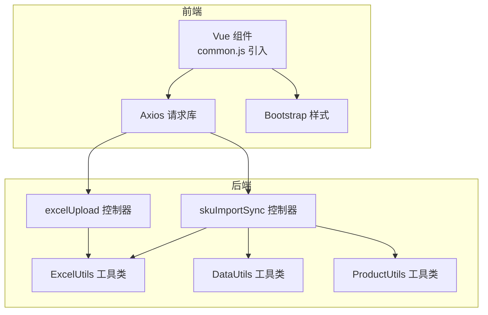

# 测试策略与实践

<cite>
**本文引用的文件**
- [composer.json](file://composer.json)
- [php/common.php](file://php/common.php)
- [php/utils/ExcelUtils.php](file://php/utils/ExcelUtils.php)
- [php/utils/DataUtils.php](file://php/utils/DataUtils.php)
- [php/utils/ProductUtils.php](file://php/utils/ProductUtils.php)
- [php/controller/excelUpload.php](file://php/controller/excelUpload.php)
- [php/controller/skuImportSync.php](file://php/controller/skuImportSync.php)
- [template/package.json](file://template/package.json)
- [template/css_js/script/common.js](file://template/css_js/script/common.js)
- [template/css_js/script/vue.global.js](file://template/css_js/script/vue.global.js)
</cite>

## 目录
1. [简介](#简介)
2. [项目结构](#项目结构)
3. [核心组件](#核心组件)
4. [架构总览](#架构总览)
5. [详细组件分析](#详细组件分析)
6. [依赖关系分析](#依赖关系分析)
7. [性能考虑](#性能考虑)
8. [故障排查指南](#故障排查指南)
9. [结论](#结论)
10. [附录](#附录)

## 简介
本文件面向PaSystem项目，系统化构建测试策略与实践体系，覆盖以下方面：
- 单元测试：PHP工具类与业务控制器的单元测试设计
- 前端组件测试：基于Vue 2.x的组件与交互测试思路
- 集成测试：API接口测试与Excel文件处理测试
- 测试数据与Mock：数据准备与外部依赖隔离
- 持续集成与自动化：CI/CD与自动化测试配置建议
- 覆盖率与质量指标：覆盖率门槛与质量门禁
- 性能与压力测试：性能评估与压测实施
- 测试环境与数据管理：环境隔离与数据治理

## 项目结构
PaSystem采用PHP后端+Vue前端的混合架构，核心测试关注点如下：
- PHP层：工具类（Excel读写、数据处理、产品属性处理）、控制器（Excel上传、SKU导入同步）
- 前端层：Vue组件、Axios请求、Bootstrap样式与通用脚本
- 依赖：PhpSpreadsheet用于Excel读写；axios用于HTTP请求；Vue 2.7用于组件化

图表来源
- [php/controller/excelUpload.php](file://php/controller/excelUpload.php#L1-L372)
- [php/controller/skuImportSync.php](file://php/controller/skuImportSync.php#L1-L512)
- [php/utils/ExcelUtils.php](file://php/utils/ExcelUtils.php#L1-L398)
- [php/utils/DataUtils.php](file://php/utils/DataUtils.php#L1-L802)
- [php/utils/ProductUtils.php](file://php/utils/ProductUtils.php#L1-L127)
- [template/css_js/script/common.js](file://template/css_js/script/common.js#L1-L5)

章节来源
- [php/controller/excelUpload.php](file://php/controller/excelUpload.php#L1-L372)
- [php/controller/skuImportSync.php](file://php/controller/skuImportSync.php#L1-L512)
- [php/utils/ExcelUtils.php](file://php/utils/ExcelUtils.php#L1-L398)
- [php/utils/DataUtils.php](file://php/utils/DataUtils.php#L1-L802)
- [php/utils/ProductUtils.php](file://php/utils/ProductUtils.php#L1-L127)
- [template/package.json](file://template/package.json#L1-L15)
- [template/css_js/script/common.js](file://template/css_js/script/common.js#L1-L5)

## 核心组件
- ExcelUtils：封装Excel读写、CSV读取、长数字处理、单元格值提取等能力
- DataUtils：统一响应数据结构解析、分页/查询列表抽取、数组去重与查找等
- ProductUtils：产品属性的增删改查与批量处理
- excelUpload：Excel上传校验、移动、读取、多文件聚合、文件列表与删除
- skuImportSync：SKU导入模板下载、Excel解析、目标环境同步（TEST/UAT）

章节来源
- [php/utils/ExcelUtils.php](file://php/utils/ExcelUtils.php#L1-L398)
- [php/utils/DataUtils.php](file://php/utils/DataUtils.php#L1-L802)
- [php/utils/ProductUtils.php](file://php/utils/ProductUtils.php#L1-L127)
- [php/controller/excelUpload.php](file://php/controller/excelUpload.php#L1-L372)
- [php/controller/skuImportSync.php](file://php/controller/skuImportSync.php#L1-L512)

## 架构总览
后端控制器通过工具类完成Excel解析与数据处理，前端通过Axios调用后端接口，实现上传、解析、同步等功能。

图表来源
- [php/controller/excelUpload.php](file://php/controller/excelUpload.php#L331-L372)
- [php/utils/ExcelUtils.php](file://php/utils/ExcelUtils.php#L147-L238)

## 详细组件分析

### ExcelUtils 单元测试策略
- 测试目标
  - Excel读取：xlsx/xls/csv读取、表头识别、行列遍历、空值处理
  - 写入导出：xlsx/xls导出、标题写入、数据行写入、文件保存
  - 长数字处理：科学计数法规避、文本格式读取
- 测试要点
  - 输入边界：空文件、空工作表、无表头、超大文件
  - 数据类型：字符串、数值、日期、富文本
  - 错误场景：文件损坏、编码异常、路径不存在
- Mock建议
  - 使用PhpSpreadsheet的内存模式或临时文件进行测试
  - 使用文件句柄替换与流式读取模拟异常
- 断言维度
  - 行列数、表头一致性、数据完整性、异常抛出

图表来源
- [php/utils/ExcelUtils.php](file://php/utils/ExcelUtils.php#L147-L238)
- [php/utils/ExcelUtils.php](file://php/utils/ExcelUtils.php#L246-L311)
- [php/utils/ExcelUtils.php](file://php/utils/ExcelUtils.php#L315-L394)

章节来源
- [php/utils/ExcelUtils.php](file://php/utils/ExcelUtils.php#L1-L398)

### DataUtils 单元测试策略
- 测试目标
  - 响应数据解析：getResultData、getPageList、getQueryList、getNewResultData
  - 分页与首条数据抽取：getPageListInFirstData、getPageListInFirstDataV2
  - 数组工具：findIndexInArray、findIndexDataInArray、clearRepeatData、hasDuplicates
- 测试要点
  - httpCode与result结构校验
  - 空响应、空数组、字段缺失、类型不匹配
  - 去重算法正确性与性能
- Mock建议
  - 构造不同结构的响应体，覆盖正常/异常分支
- 断言维度
  - 返回结构一致性、字段存在性、数据类型与长度

图表来源
- [php/utils/DataUtils.php](file://php/utils/DataUtils.php#L18-L29)
- [php/utils/DataUtils.php](file://php/utils/DataUtils.php#L36-L47)
- [php/utils/DataUtils.php](file://php/utils/DataUtils.php#L54-L65)

章节来源
- [php/utils/DataUtils.php](file://php/utils/DataUtils.php#L1-L802)

### ProductUtils 单元测试策略
- 测试目标
  - 属性编辑：editProductAttribute、editProductAttributeByArr
  - 属性删除：deleteProductAttributeByArr、deleteProductAttributeByArrV2
- 测试要点
  - 条件匹配：label+channel唯一性
  - 批量更新/删除的性能与正确性
  - 边界：空数组、重复条件、不存在的键
- Mock建议
  - 构造复杂属性数组，验证更新/删除逻辑
- 断言维度
  - 更新后值一致性、删除后数组长度变化

图表来源
- [php/utils/ProductUtils.php](file://php/utils/ProductUtils.php#L23-L35)
- [php/utils/ProductUtils.php](file://php/utils/ProductUtils.php#L42-L63)

章节来源
- [php/utils/ProductUtils.php](file://php/utils/ProductUtils.php#L1-L127)

### excelUpload 控制器集成测试策略
- 测试目标
  - 文件上传校验：大小、扩展名、上传错误码
  - Excel读取：表头、数据行、预览行数、空数据处理
  - 多文件聚合：统计成功/失败数量
  - 文件管理：删除、列出
- 测试要点
  - 上传文件构造：multipart/form-data
  - 参数校验：hasHeader、previewRows
  - 异常路径：读取失败、保存失败、空数据
- Mock建议
  - 使用临时目录与内存文件模拟上传
- 断言维度
  - success标志、message提示、data结构完整性

图表来源
- [php/controller/excelUpload.php](file://php/controller/excelUpload.php#L331-L372)
- [php/controller/excelUpload.php](file://php/controller/excelUpload.php#L35-L95)
- [php/controller/excelUpload.php](file://php/controller/excelUpload.php#L148-L238)

章节来源
- [php/controller/excelUpload.php](file://php/controller/excelUpload.php#L1-L372)
- [php/utils/ExcelUtils.php](file://php/utils/ExcelUtils.php#L1-L398)

### skuImportSync 控制器集成测试策略
- 测试目标
  - 模板下载：默认模板不存在时创建
  - Excel解析：SKU列表提取、去重、异常清理
  - 同步流程：源环境查询、目标环境删除旧数据、创建新数据
  - 环境选择：TEST/UAT切换
- 测试要点
  - 参数校验：action、skuId、module、port、field、targetEnv
  - 日志记录：请求参数、查询结果、删除/创建结果
  - 异常路径：模板创建失败、查询无数据、删除/创建异常
- Mock建议
  - 使用反射注入CurlService的test/uat实例
  - 使用临时文件模拟Excel解析
- 断言维度
  - success标志、message提示、data结构（SKU数量、源/目标计数）

图表来源
- [php/controller/skuImportSync.php](file://php/controller/skuImportSync.php#L474-L512)
- [php/controller/skuImportSync.php](file://php/controller/skuImportSync.php#L83-L110)
- [php/controller/skuImportSync.php](file://php/controller/skuImportSync.php#L164-L271)
- [php/controller/skuImportSync.php](file://php/controller/skuImportSync.php#L278-L426)

章节来源
- [php/controller/skuImportSync.php](file://php/controller/skuImportSync.php#L1-L512)
- [php/utils/ExcelUtils.php](file://php/utils/ExcelUtils.php#L1-L398)

### 前端组件与用户交互测试
- 技术栈
  - Vue 2.7（当前工程引入vue.global.js），Axios进行HTTP请求，Bootstrap提供UI基础
- 测试策略
  - 单元测试：Vue组件的渲染、事件触发、props与计算属性
  - 集成测试：Axios拦截器、接口调用链路、错误处理
  - 用户交互测试：文件选择、拖拽上传、预览展示、错误提示
- Mock建议
  - 使用Jest/Vue Test Utils进行组件渲染与事件模拟
  - 使用axios-mock-adaptor或fetch-mock进行接口拦截
- 断言维度
  - DOM结构、事件回调、状态变更、错误提示文案

章节来源
- [template/package.json](file://template/package.json#L1-L15)
- [template/css_js/script/common.js](file://template/css_js/script/common.js#L1-L5)
- [template/css_js/script/vue.global.js](file://template/css_js/script/vue.global.js#L1-L800)

## 依赖关系分析
- 外部依赖
  - PhpSpreadsheet：Excel读写
  - Monolog/PSR-3：日志
  - axios：HTTP客户端
  - Vue 2.7：前端框架
- 内部依赖
  - 控制器依赖工具类（ExcelUtils、DataUtils、ProductUtils）
  - 前端依赖Axios与Vue

图表来源
- [composer.json](file://composer.json#L1-L11)
- [php/utils/ExcelUtils.php](file://php/utils/ExcelUtils.php#L1-L15)
- [php/utils/DataUtils.php](file://php/utils/DataUtils.php#L1-L8)
- [php/utils/ProductUtils.php](file://php/utils/ProductUtils.php#L1-L3)
- [template/package.json](file://template/package.json#L1-L15)

章节来源
- [composer.json](file://composer.json#L1-L11)
- [template/package.json](file://template/package.json#L1-L15)

## 性能考虑
- Excel处理性能
  - 大文件：优先使用PhpSpreadsheet的内存优化与迭代器读取
  - 长数字：避免科学计数法，统一文本格式读取
- 接口性能
  - 控制器参数：hasHeader、previewRows限制数据规模
  - 日志级别：生产环境降低日志频率
- 前端性能
  - 组件懒加载、虚拟滚动（如适用）、请求合并与节流

## 故障排查指南
- 上传失败
  - 检查上传目录权限与磁盘空间
  - 校验文件大小与扩展名
- Excel解析异常
  - 确认编码与格式（xlsx/xls/csv）
  - 检查表头与数据行一致性
- 同步失败
  - 核对目标环境（TEST/UAT）与查询条件
  - 查看日志定位删除/创建阶段的异常

章节来源
- [php/controller/excelUpload.php](file://php/controller/excelUpload.php#L102-L140)
- [php/controller/excelUpload.php](file://php/controller/excelUpload.php#L148-L238)
- [php/controller/skuImportSync.php](file://php/controller/skuImportSync.php#L433-L471)
- [php/controller/skuImportSync.php](file://php/controller/skuImportSync.php#L304-L426)

## 结论
通过明确的单元测试、集成测试与前端交互测试策略，并结合Mock与测试数据管理，PaSystem可在保证功能正确性的前提下，提升稳定性与可维护性。建议逐步完善覆盖率与质量门禁，配合CI/CD实现自动化测试闭环。

## 附录

### 测试覆盖率与质量指标
- 单元测试覆盖率：核心工具类（ExcelUtils、DataUtils、ProductUtils）≥80%
- 集成测试覆盖率：关键控制器（excelUpload、skuImportSync）≥70%
- 前端组件测试：常用组件与交互路径≥60%
- 质量门禁：失败即阻断CI流水线，覆盖率低于阈值禁止合并

### 持续集成与自动化测试配置建议
- CI流水线步骤
  - 依赖安装：Composer安装PHP依赖，npm安装前端依赖
  - PHP测试：执行PHPUnit测试套件（单元+集成）
  - 前端测试：执行Vue组件测试（Jest/VTU）
  - 覆盖率报告：生成并上报覆盖率
- 触发策略
  - Pull Request触发测试与覆盖率检查
  - 主分支保护：通过质量门禁后方可合并

### 测试环境搭建与数据管理
- 测试环境
  - PHP：启用错误报告与日志输出
  - 前端：本地开发服务器（webpack-dev-server）
- 测试数据
  - Excel样本：位于php/export与php/export/uploads目录
  - 数据准备：使用ExcelUtils生成/读取样本文件
  - Mock策略：使用临时文件与内存存储隔离真实数据

章节来源
- [php/controller/excelUpload.php](file://php/controller/excelUpload.php#L17-L27)
- [php/controller/skuImportSync.php](file://php/controller/skuImportSync.php#L19-L33)
- [php/utils/ExcelUtils.php](file://php/utils/ExcelUtils.php#L24-L28)