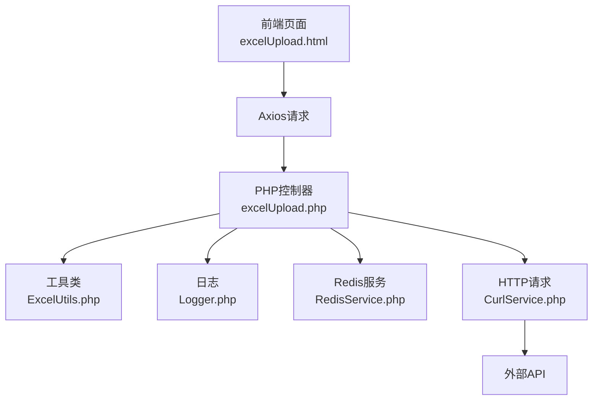
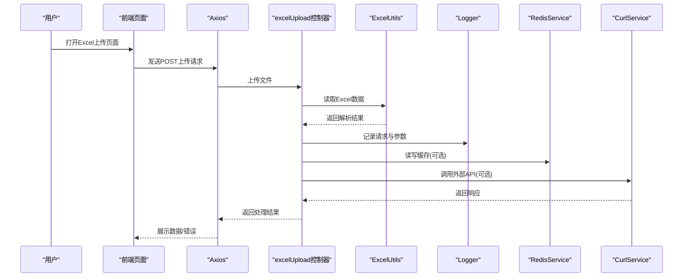
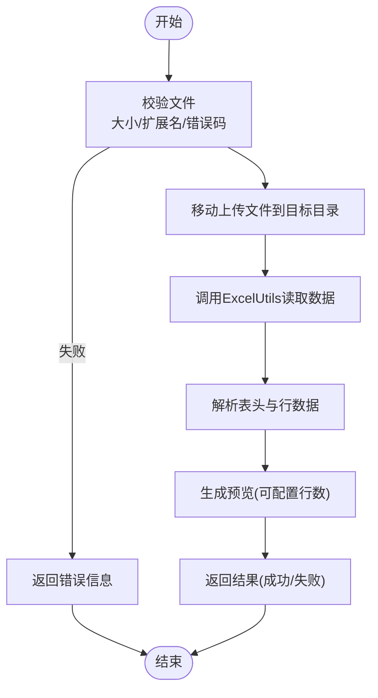
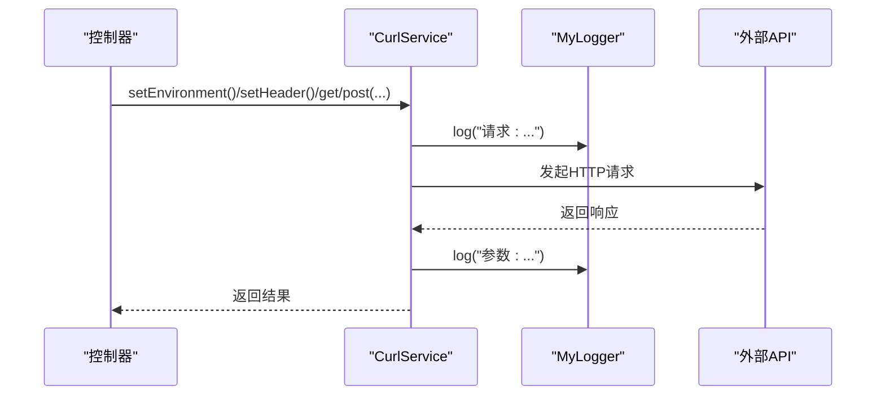
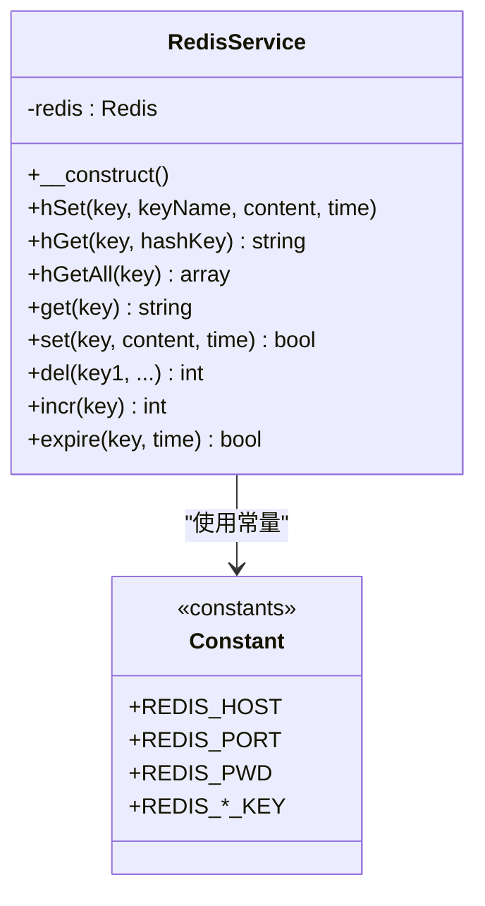
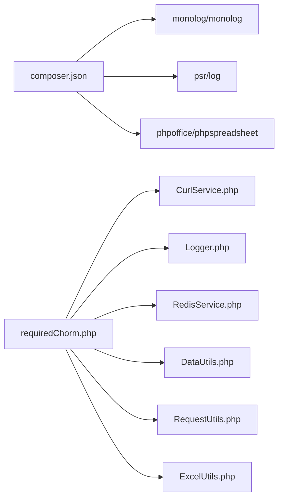

# 调试技巧与故障排查

<cite>
**本文引用的文件**
- [composer.json](file://composer.json)
- [common.php](file://php/common.php)
- [Logger.php](file://php/class/Logger.php)
- [Constant.php](file://php/constant/Constant.php)
- [RedisService.php](file://php/redis/RedisService.php)
- [ExcelUtils.php](file://php/utils/ExcelUtils.php)
- [CurlService.php](file://php/curl/CurlService.php)
- [excelUpload.php](file://php/controller/excelUpload.php)
- [requiredChorm.php](file://php/requiredfile/requiredChorm.php)
- [vue.global.js](file://template/css_js/script/vue.global.js)
- [excelUpload.html](file://template/excelUpload.html)
- [config.json](file://php/json/config.json)
- [request_20260227.log](file://php/log/curl/request_20260227.log)
</cite>

## 目录
1. [简介](#简介)
2. [项目结构](#项目结构)
3. [核心组件](#核心组件)
4. [架构总览](#架构总览)
5. [详细组件分析](#详细组件分析)
6. [依赖关系分析](#依赖关系分析)
7. [性能考虑](#性能考虑)
8. [故障排查指南](#故障排查指南)
9. [结论](#结论)
10. [附录](#附录)

## 简介
本指南面向PaSystem项目的调试与故障排查，覆盖以下方面：
- PHP后端调试：Xdebug配置建议、错误日志分析、性能分析工具使用
- 前端调试：浏览器开发者工具与Vue DevTools配置
- Excel文件处理：上传、读取、数据校验与常见问题排查
- 网络请求调试与API接口诊断
- Redis缓存问题排查
- 日志分析与错误追踪
- 常见问题快速解决与预防措施

## 项目结构
PaSystem采用前后端分离与后端脚本结合的方式：
- 前端模板位于template目录，包含Vue页面与静态资源
- 后端PHP位于php目录，包含控制器、工具类、日志与配置
- 通过CurlService统一发起跨模块HTTP请求
- 通过ExcelUtils处理Excel读写
- 通过RedisService访问Redis缓存

图表来源
- [excelUpload.html](file://template/excelUpload.html#L310-L373)
- [excelUpload.php](file://php/controller/excelUpload.php#L331-L372)
- [ExcelUtils.php](file://php/utils/ExcelUtils.php#L1-L398)
- [Logger.php](file://php/class/Logger.php#L1-L55)
- [RedisService.php](file://php/redis/RedisService.php#L1-L77)
- [CurlService.php](file://php/curl/CurlService.php#L1-L996)

章节来源
- [excelUpload.html](file://template/excelUpload.html#L1-L472)
- [excelUpload.php](file://php/controller/excelUpload.php#L1-L372)
- [ExcelUtils.php](file://php/utils/ExcelUtils.php#L1-L398)
- [Logger.php](file://php/class/Logger.php#L1-L55)
- [RedisService.php](file://php/redis/RedisService.php#L1-L77)
- [CurlService.php](file://php/curl/CurlService.php#L1-L996)

## 核心组件
- 日志系统：MyLogger提供基础文件日志能力，并可集成Monolog/LoggerOne
- Redis服务：RedisService封装常用哈希与字符串操作
- Excel工具：ExcelUtils基于PhpSpreadsheet读写Excel/CVS
- HTTP服务：CurlService封装多环境、多模块的HTTP请求
- 控制器：excelUpload.php负责Excel上传与数据读取
- 前端页面：excelUpload.html配合Vue进行交互与数据展示

章节来源
- [Logger.php](file://php/class/Logger.php#L14-L55)
- [RedisService.php](file://php/redis/RedisService.php#L7-L77)
- [ExcelUtils.php](file://php/utils/ExcelUtils.php#L20-L398)
- [CurlService.php](file://php/curl/CurlService.php#L4-L996)
- [excelUpload.php](file://php/controller/excelUpload.php#L11-L328)

## 架构总览
后端通过控制器接收前端请求，调用工具类处理业务逻辑，必要时访问Redis与外部API。

图表来源
- [excelUpload.html](file://template/excelUpload.html#L342-L397)
- [excelUpload.php](file://php/controller/excelUpload.php#L35-L95)
- [ExcelUtils.php](file://php/utils/ExcelUtils.php#L147-L238)
- [Logger.php](file://php/class/Logger.php#L22-L25)
- [RedisService.php](file://php/redis/RedisService.php#L29-L65)
- [CurlService.php](file://php/curl/CurlService.php#L664-L740)

## 详细组件分析

### Excel上传与读取流程
- 前端通过excelUpload.html提交文件，Axios以multipart/form-data发送
- 控制器excelUpload.php进行文件校验、移动、读取
- 工具类ExcelUtils.php使用PhpSpreadsheet读取XLS/XLSX/CVS
- 解析完成后返回预览与统计信息

图表来源
- [excelUpload.php](file://php/controller/excelUpload.php#L35-L95)
- [excelUpload.php](file://php/controller/excelUpload.php#L102-L140)
- [excelUpload.php](file://php/controller/excelUpload.php#L148-L238)
- [ExcelUtils.php](file://php/utils/ExcelUtils.php#L147-L181)
- [ExcelUtils.php](file://php/utils/ExcelUtils.php#L315-L359)

章节来源
- [excelUpload.html](file://template/excelUpload.html#L342-L397)
- [excelUpload.php](file://php/controller/excelUpload.php#L35-L95)
- [excelUpload.php](file://php/controller/excelUpload.php#L102-L140)
- [excelUpload.php](file://php/controller/excelUpload.php#L148-L238)
- [ExcelUtils.php](file://php/utils/ExcelUtils.php#L147-L181)
- [ExcelUtils.php](file://php/utils/ExcelUtils.php#L315-L359)

### HTTP请求与日志记录
- CurlService封装了多环境URL映射、请求头、超时与重试
- 统一日志通过MyLogger记录请求方法、URL与参数
- 生产日志示例可参考php/log/curl/request_YYYYMMDD.log

图表来源
- [CurlService.php](file://php/curl/CurlService.php#L34-L38)
- [CurlService.php](file://php/curl/CurlService.php#L664-L740)
- [Logger.php](file://php/class/Logger.php#L22-L25)
- [request_20260227.log](file://php/log/curl/request_20260227.log#L1-L12)

章节来源
- [CurlService.php](file://php/curl/CurlService.php#L40-L132)
- [CurlService.php](file://php/curl/CurlService.php#L441-L458)
- [CurlService.php](file://php/curl/CurlService.php#L664-L740)
- [Logger.php](file://php/class/Logger.php#L22-L25)
- [request_20260227.log](file://php/log/curl/request_20260227.log#L1-L12)

### Redis缓存交互
- RedisService封装了hSet/hGet/hGetAll/get/set/del/incr/expire等常用操作
- 通过常量文件定义Redis主机、端口、密码与键空间

图表来源
- [RedisService.php](file://php/redis/RedisService.php#L7-L77)
- [Constant.php](file://php/constant/Constant.php#L4-L26)

章节来源
- [RedisService.php](file://php/redis/RedisService.php#L7-L77)
- [Constant.php](file://php/constant/Constant.php#L4-L26)

### 前端调试与Vue DevTools
- 前端页面引入Vue 3与Axios，使用createApp创建应用
- 可在浏览器控制台查看Vue对象与应用状态
- 建议安装Vue DevTools浏览器插件进行组件树与状态监控

章节来源
- [excelUpload.html](file://template/excelUpload.html#L285-L470)
- [vue.global.js](file://template/css_js/script/vue.global.js#L1-L200)

## 依赖关系分析
- Composer声明了日志与Excel处理相关依赖
- 控制器通过requiredChorm.php集中引入CurlService、Logger、RedisService、DataUtils、RequestUtils、ExcelUtils

图表来源
- [composer.json](file://composer.json#L1-L11)
- [requiredChorm.php](file://php/requiredfile/requiredChorm.php#L1-L10)

章节来源
- [composer.json](file://composer.json#L1-L11)
- [requiredChorm.php](file://php/requiredfile/requiredChorm.php#L1-L10)

## 性能考虑
- Excel读取建议：使用PhpSpreadsheet的流式读取策略，避免一次性加载大文件；合理设置预览行数
- HTTP请求：CurlService内置超时与重试机制，建议根据外部API响应时间调整超时与重试次数
- Redis：批量读写使用管道或事务减少RTT；合理设置TTL避免缓存雪崩
- 前端：避免在大列表渲染中执行复杂计算，使用虚拟滚动与懒加载

## 故障排查指南

### PHP调试方法
- Xdebug配置建议
  - 在php.ini中启用xdebug.remote_enable、xdebug.remote_host、xdebug.remote_port
  - IDE侧设置断点与监听端口，确保与xdebug.remote_host一致
  - 通过浏览器或Postman触发请求，观察断点命中情况
- 错误日志分析
  - 后端日志由MyLogger写入php/log/default/日期.log
  - CurlService同时写入php/log/curl/request_YYYYMMDD.log，便于定位请求与参数
  - 示例日志文件：[request_20260227.log](file://php/log/curl/request_20260227.log#L1-L12)
- 性能分析工具
  - 使用Xdebug profiler生成cachegrind文件，结合WebGrind可视化分析
  - 使用Blackfire或Tideways进行线上性能采样
  - 关注Excel读取与API调用的热点函数

章节来源
- [Logger.php](file://php/class/Logger.php#L22-L25)
- [CurlService.php](file://php/curl/CurlService.php#L714-L715)
- [request_20260227.log](file://php/log/curl/request_20260227.log#L1-L12)

### 前端调试技巧
- 浏览器开发者工具
  - Network面板：查看Axios请求的URL、请求头、响应体与状态码
  - Console面板：检查Vue对象是否正确加载，打印响应数据
  - Elements面板：检查DOM结构与事件绑定
- Vue DevTools
  - 安装Vue DevTools浏览器插件，查看组件树、Props、状态与事件
  - 在组件生命周期钩子处设置断点，观察数据变化

章节来源
- [excelUpload.html](file://template/excelUpload.html#L285-L470)
- [vue.global.js](file://template/css_js/script/vue.global.js#L1-L200)

### Excel文件处理问题排查
- 上传失败
  - 检查文件大小是否超过10MB限制
  - 确认扩展名为xlsx或xls
  - 查看控制器返回的错误消息
- 读取异常
  - 确认第一行是否为表头，或是否正确传递hasHeader参数
  - 检查预览行数previewRows配置
  - 使用ExcelUtils的多种读取方法对比结果
- 数据校验
  - 核对表头字段与期望一致
  - 检查长数字读取是否被转换为科学计数法，必要时强制文本格式
  - 校验CSV分隔符与编码设置

章节来源
- [excelUpload.php](file://php/controller/excelUpload.php#L102-L140)
- [excelUpload.php](file://php/controller/excelUpload.php#L148-L238)
- [ExcelUtils.php](file://php/utils/ExcelUtils.php#L246-L311)
- [ExcelUtils.php](file://php/utils/ExcelUtils.php#L366-L394)

### 网络请求调试与API接口诊断
- 环境切换
  - 通过CurlService的setEnvironment/test/local/uat/pro切换不同环境
  - 确认端口映射与网关地址正确
- 请求头与鉴权
  - 检查Content-Type、Authorization等头部
  - 如需UC Token，使用getUcToken注入
- 响应与错误
  - 关注httpCode与result字段
  - 对非2xx响应抛出异常，结合日志定位问题

章节来源
- [CurlService.php](file://php/curl/CurlService.php#L98-L132)
- [CurlService.php](file://php/curl/CurlService.php#L264-L290)
- [CurlService.php](file://php/curl/CurlService.php#L664-L740)

### Redis缓存问题排查
- 连接失败
  - 检查REDIS_HOST/REDIS_PORT/REDIS_PWD是否与Constant.php一致
  - 使用Redis命令行验证连通性
- 数据异常
  - 使用hGetAll/get/incr等方法核对键值
  - 检查TTL设置，避免过期导致的“假空”
- 缓存穿透/击穿
  - 对空结果设置短TTL或布隆过滤
  - 对热点键增加互斥锁或双写策略

章节来源
- [RedisService.php](file://php/redis/RedisService.php#L15-L19)
- [RedisService.php](file://php/redis/RedisService.php#L48-L51)
- [Constant.php](file://php/constant/Constant.php#L4-L6)

### 日志分析与错误追踪
- 日志位置
  - 默认日志：php/log/default/日期.log
  - Curl日志：php/log/curl/request_YYYYMMDD.log
- 分析要点
  - 结合请求时间线定位异常
  - 关注参数与响应体中的关键字段
  - 对重复错误进行聚合统计

章节来源
- [Logger.php](file://php/class/Logger.php#L17-L20)
- [Logger.php](file://php/class/Logger.php#L22-L25)
- [CurlService.php](file://php/curl/CurlService.php#L714-L715)
- [request_20260227.log](file://php/log/curl/request_20260227.log#L1-L12)

### 常见问题快速解决方案与预防措施
- Excel上传报错
  - 解决：检查hasHeader与previewRows参数；确认文件编码与分隔符
  - 预防：在前端增加文件类型与大小校验
- Excel数据缺失
  - 解决：确认表头是否正确；检查是否跳过了首行
  - 预防：固定表头规范与字段顺序
- API调用失败
  - 解决：切换环境至test/uat/pro；检查Authorization与请求头
  - 预防：在CurlService中统一设置默认头与超时
- Redis连接异常
  - 解决：核对Constant.php中的主机与密码；检查防火墙
  - 预防：增加连接池与健康检查

章节来源
- [excelUpload.php](file://php/controller/excelUpload.php#L102-L140)
- [ExcelUtils.php](file://php/utils/ExcelUtils.php#L315-L359)
- [CurlService.php](file://php/curl/CurlService.php#L98-L132)
- [Constant.php](file://php/constant/Constant.php#L4-L6)

## 结论
通过统一的日志、清晰的组件边界与完善的工具链，PaSystem具备良好的可调试性与可观测性。建议在开发与运维中持续完善：
- 前端：使用Vue DevTools与浏览器工具链
- 后端：启用Xdebug与性能分析，完善日志分级
- 数据：标准化Excel与API契约，加强校验与回滚
- 缓存：优化TTL与一致性策略，提升稳定性

## 附录
- 前端页面入口与API地址
  - 页面：[excelUpload.html](file://template/excelUpload.html#L310)
  - API：http://172.16.29.23:90/php/controller/excelUpload.php
- 配置参考
  - Excel规则配置：[config.json](file://php/json/config.json#L1-L316)
- 依赖声明
  - [composer.json](file://composer.json#L1-L11)