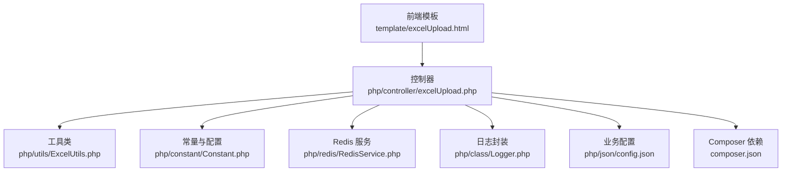
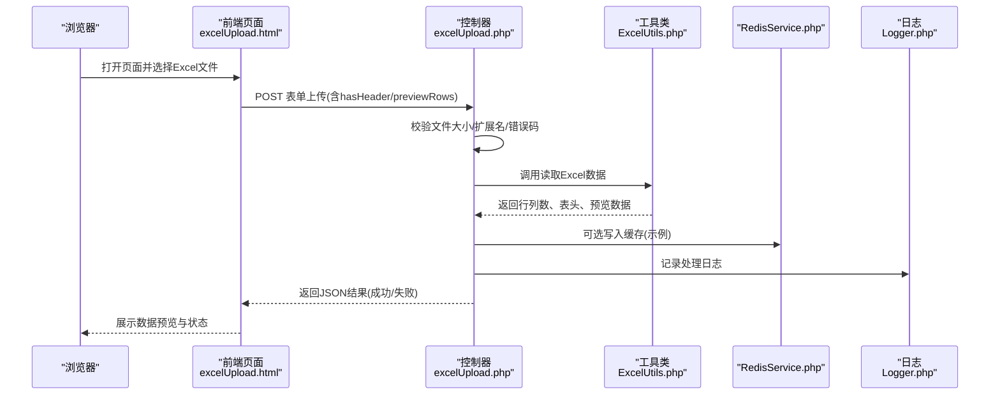
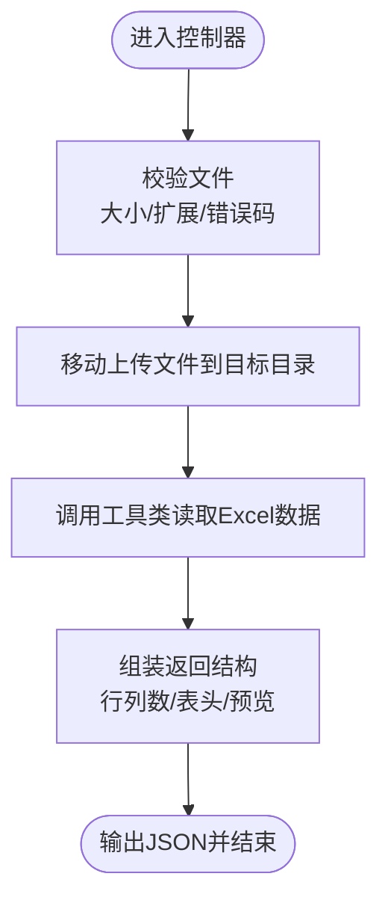
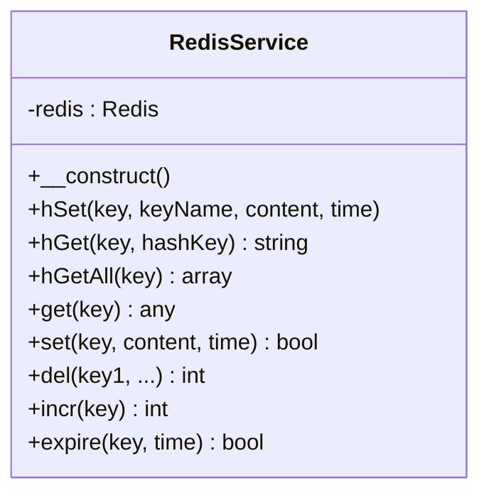
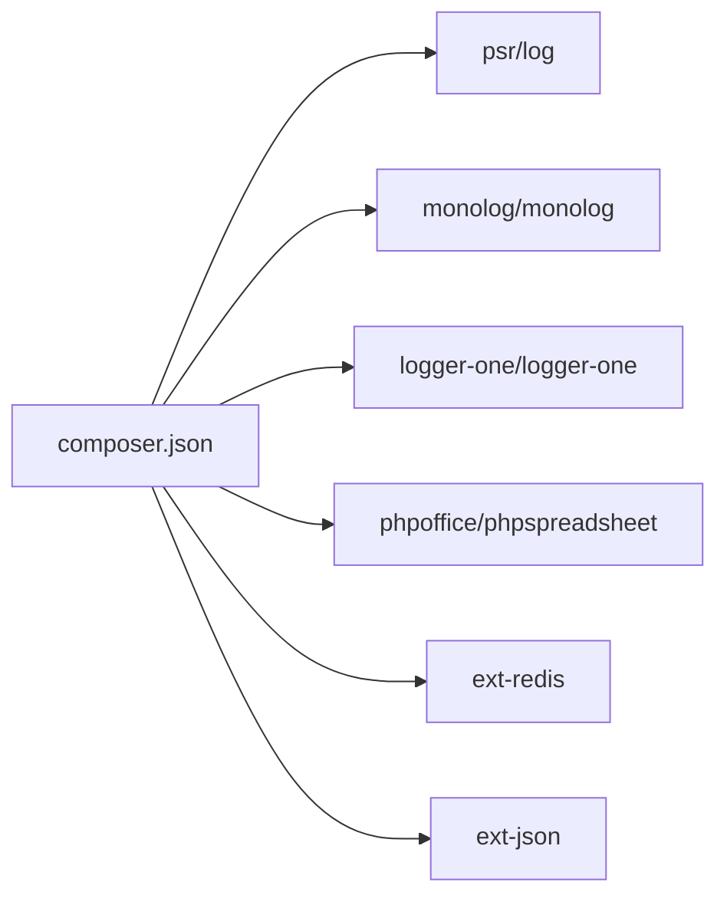

# 快速开始

<cite>
**本文引用的文件**
- [composer.json](file://composer.json)
- [common.php](file://php/common.php)
- [Constant.php](file://php/constant/Constant.php)
- [RedisService.php](file://php/redis/RedisService.php)
- [Logger.php](file://php/class/Logger.php)
- [config.json](file://php/json/config.json)
- [excelUpload.php](file://php/controller/excelUpload.php)
- [ExcelUtils.php](file://php/utils/ExcelUtils.php)
- [excelUpload.html](file://template/excelUpload.html)
- [DeleteCampaignNotify.sh](file://php/job/DeleteCampaignNotify.sh)
- [SyncSkuMaterialToAudit.sh](file://php/shell/SyncSkuMaterialToAudit.sh)
- [README.md (Monolog)](file://vendor/monolog/monolog/README.md)
- [README.md (PhpSpreadsheet)](file://vendor/phpoffice/phpspreadsheet/README.md)
</cite>

## 目录
1. [简介](#简介)
2. [项目结构](#项目结构)
3. [核心组件](#核心组件)
4. [架构总览](#架构总览)
5. [详细组件分析](#详细组件分析)
6. [依赖分析](#依赖分析)
7. [性能考虑](#性能考虑)
8. [故障排除指南](#故障排除指南)
9. [结论](#结论)
10. [附录](#附录)

## 简介
本指南面向首次接触 PaSystem 的开发者，帮助你在约 30 分钟内完成环境准备、依赖安装、基础配置与本地运行，并通过 Web 界面完成“上传 Excel 并查看处理结果”的首个示例。项目基于 PHP 与 Composer 管理依赖，使用 PhpSpreadsheet 进行 Excel 读写，结合 Redis 缓存与日志能力，提供可扩展的上传与数据处理流程。

## 项目结构
PaSystem 采用“前端模板 + PHP 控制器/工具 + 配置 + 日志/缓存”的分层组织方式：
- 前端模板位于 template/，包含 Web 页面与静态资源
- PHP 核心位于 php/，包含控制器、工具类、常量、日志与 Redis 封装
- 依赖通过 Composer 管理，位于根目录 composer.json/composer.lock
- 示例与导出数据位于 php/export/ 与 php/export/uploads/

图表来源
- [excelUpload.html](file://template/excelUpload.html#L1-L472)
- [excelUpload.php](file://php/controller/excelUpload.php#L1-L372)
- [ExcelUtils.php](file://php/utils/ExcelUtils.php#L1-L398)
- [Constant.php](file://php/constant/Constant.php#L1-L26)
- [RedisService.php](file://php/redis/RedisService.php#L1-L77)
- [Logger.php](file://php/class/Logger.php#L1-L55)
- [config.json](file://php/json/config.json#L1-L316)
- [composer.json](file://composer.json#L1-L11)

章节来源
- [excelUpload.html](file://template/excelUpload.html#L1-L472)
- [excelUpload.php](file://php/controller/excelUpload.php#L1-L372)
- [ExcelUtils.php](file://php/utils/ExcelUtils.php#L1-L398)
- [Constant.php](file://php/constant/Constant.php#L1-L26)
- [RedisService.php](file://php/redis/RedisService.php#L1-L77)
- [Logger.php](file://php/class/Logger.php#L1-L55)
- [config.json](file://php/json/config.json#L1-L316)
- [composer.json](file://composer.json#L1-L11)

## 核心组件
- 依赖与扩展
  - PHP 版本与扩展：根据依赖声明，需满足 ext-redis、ext-json；具体 PHP 最低版本请参考 PhpSpreadsheet 文档说明
  - 核心库：psr/log、monolog/monolog、logger-one/logger-one、phpoffice/phpspreadsheet
- Excel 上传与解析
  - 控制器负责接收文件、校验、移动、调用工具类解析并返回结构化数据
  - 工具类基于 PhpSpreadsheet 读取 xlsx/xls/csv 等格式，处理长数字与文本格式
- 缓存与日志
  - RedisService 提供常用哈希/字符串操作与过期控制
  - Logger 提供基础文件日志能力，亦可启用 Monolog 或 LoggerOne
- 配置
  - 常量集中定义 Redis 主机、端口、密码与键空间
  - 业务规则与广告设置以 JSON 形式存放，便于动态调整

章节来源
- [composer.json](file://composer.json#L1-L11)
- [excelUpload.php](file://php/controller/excelUpload.php#L1-L372)
- [ExcelUtils.php](file://php/utils/ExcelUtils.php#L1-L398)
- [RedisService.php](file://php/redis/RedisService.php#L1-L77)
- [Logger.php](file://php/class/Logger.php#L1-L55)
- [config.json](file://php/json/config.json#L1-L316)

## 架构总览
下图展示了从浏览器发起上传请求到后端解析并返回数据的整体流程：

图表来源
- [excelUpload.html](file://template/excelUpload.html#L310-L396)
- [excelUpload.php](file://php/controller/excelUpload.php#L331-L372)
- [ExcelUtils.php](file://php/utils/ExcelUtils.php#L147-L181)
- [RedisService.php](file://php/redis/RedisService.php#L1-L77)
- [Logger.php](file://php/class/Logger.php#L1-L55)

## 详细组件分析

### 组件A：Excel 上传与解析流程
- 功能要点
  - 接收单/多文件上传，校验扩展名与大小
  - 移动上传文件至目标目录
  - 调用 ExcelUtils 读取数据，支持 xlsx/xls/csv
  - 返回结构化结果：文件名、行列数、表头、预览行
- 典型调用链
  - 前端通过 axios 发送 multipart/form-data
  - 控制器 handleUpload -> ExcelUtils._readXlsFile/_readCSV
  - 结果经 JSON 编码返回前端渲染

图表来源
- [excelUpload.php](file://php/controller/excelUpload.php#L35-L95)
- [ExcelUtils.php](file://php/utils/ExcelUtils.php#L147-L181)

章节来源
- [excelUpload.php](file://php/controller/excelUpload.php#L1-L372)
- [ExcelUtils.php](file://php/utils/ExcelUtils.php#L1-L398)
- [excelUpload.html](file://template/excelUpload.html#L342-L397)

### 组件B：Redis 服务封装
- 能力概览
  - 连接、认证、哈希与字符串读写、自增、过期控制
  - 常量中定义了键空间前缀，便于统一管理
- 使用建议
  - 在上传/同步等场景中，将中间态数据写入 Redis，提升后续处理效率
  - 注意设置合理的过期时间，避免缓存堆积

图表来源
- [RedisService.php](file://php/redis/RedisService.php#L1-L77)
- [Constant.php](file://php/constant/Constant.php#L1-L26)

章节来源
- [RedisService.php](file://php/redis/RedisService.php#L1-L77)
- [Constant.php](file://php/constant/Constant.php#L1-L26)

### 组件C：日志与 Monolog 集成
- 当前实现
  - Logger.php 提供基础文件日志写入与错误日志输出
  - 注释中保留了 Monolog 与 LoggerOne 的集成示例
- 建议
  - 生产环境推荐启用 Monolog，按日期切分文件，统一输出格式
  - 可结合 LoggerOne 的文件处理器与格式化器，提升可维护性

章节来源
- [Logger.php](file://php/class/Logger.php#L1-L55)
- [README.md (Monolog)](file://vendor/monolog/monolog/README.md#L1-L95)

### 组件D：业务配置与规则
- 配置位置
  - config.json 中包含属性拆分规则、匹配模型与广告渠道的竞价策略
- 使用场景
  - 在导入/导出或广告策略计算时，读取该配置进行规则化处理

章节来源
- [config.json](file://php/json/config.json#L1-L316)

## 依赖分析
- Composer 依赖
  - psr/log、monolog/monolog、logger-one/logger-one、ext-redis、ext-json、phpoffice/phpspreadsheet
- PHP 版本与扩展
  - 项目明确声明 ext-redis、ext-json
  - PhpSpreadsheet 文档建议最低 PHP 版本为 7.4（以实际文档为准）

图表来源
- [composer.json](file://composer.json#L1-L11)
- [README.md (PhpSpreadsheet)](file://vendor/phpoffice/phpspreadsheet/README.md#L14-L22)

章节来源
- [composer.json](file://composer.json#L1-L11)
- [README.md (PhpSpreadsheet)](file://vendor/phpoffice/phpspreadsheet/README.md#L14-L22)

## 性能考虑
- Excel 解析
  - 使用 PhpSpreadsheet 时注意大文件内存占用，必要时分片读取或降低预览行数
- Redis 缓存
  - 对高频查询结果进行缓存，设置合理过期时间，避免长期驻留
- 日志
  - 生产环境建议异步写入或滚动切分，避免阻塞请求

## 故障排除指南
- 依赖安装失败
  - 确认已安装 Composer，并在项目根目录执行安装命令
  - 若 PHP 版本与扩展缺失，先补齐 ext-redis、ext-json，再重试
- 上传失败
  - 检查上传目录权限与磁盘空间
  - 确认前端表单字段与控制器参数一致（hasHeader、previewRows）
- Redis 连接异常
  - 核对常量中的主机、端口、密码是否正确
  - 确认 Redis 服务已启动并开放相应端口
- 日志未输出
  - 当前 Logger.php 默认使用基础文件写入；若需 Monolog/LoggerOne，请取消注释并按需配置
- 前端无法加载
  - 确认模板中 API 地址与本机 IP 一致，且服务器已启动

章节来源
- [excelUpload.php](file://php/controller/excelUpload.php#L331-L372)
- [excelUpload.html](file://template/excelUpload.html#L310-L396)
- [RedisService.php](file://php/redis/RedisService.php#L15-L19)
- [Logger.php](file://php/class/Logger.php#L1-L55)

## 结论
通过本指南，你可以在 30 分钟内完成环境与依赖准备、基础配置与本地运行，并成功完成“上传 Excel 并查看处理结果”的首个示例。后续可根据业务需求扩展 Redis 缓存、完善日志体系与导入导出流程。

## 附录

### 环境要求与依赖安装
- 环境要求
  - PHP 版本：满足 PhpSpreadsheet 最低版本要求（建议 7.4+）
  - 扩展：ext-redis、ext-json
- 安装步骤
  - 安装 Composer（如未安装）
  - 在项目根目录执行安装命令，拉取 vendor 依赖
  - 确认 vendor 目录存在并可被 Web 服务器访问
- 核心库
  - psr/log、monolog/monolog、logger-one/logger-one、phpoffice/phpspreadsheet

章节来源
- [composer.json](file://composer.json#L1-L11)
- [README.md (PhpSpreadsheet)](file://vendor/phpoffice/phpspreadsheet/README.md#L14-L22)

### 基础配置步骤
- Redis
  - 修改常量中的主机、端口、密码，确保与实际环境一致
- 日志
  - 可直接使用 Logger.php 的基础写入；如需 Monolog/LoggerOne，请按注释启用并配置
- 控制器与跨域
  - 控制器已内置跨域头部设置，确保前端可正常访问

章节来源
- [Constant.php](file://php/constant/Constant.php#L1-L26)
- [Logger.php](file://php/class/Logger.php#L1-L55)
- [common.php](file://php/common.php#L1-L9)

### 启动本地开发服务器与访问
- 启动方式
  - 使用 PHP 内置服务器或 Nginx/Apache + PHP-FPM
  - 将 Web 根目录指向项目根目录，确保可访问 template 与 php 目录
- 访问地址
  - 打开前端页面 template/excelUpload.html
  - 确认页面中的 API 地址与本机 IP 一致

章节来源
- [excelUpload.html](file://template/excelUpload.html#L310-L311)

### 第一个简单示例：上传 Excel 并查看结果
- 步骤
  - 在前端页面选择 Excel 文件（xlsx/xls），勾选“第一行为表头”，设置预览行数
  - 点击上传，等待进度条完成
  - 查看返回结果：文件名、行列数、表头与预览数据
- 输出
  - 控制器返回 JSON，前端渲染表格预览

章节来源
- [excelUpload.html](file://template/excelUpload.html#L342-L397)
- [excelUpload.php](file://php/controller/excelUpload.php#L331-L372)
- [ExcelUtils.php](file://php/utils/ExcelUtils.php#L147-L181)

### 常见问题与解决方案
- 依赖缺失
  - 安装缺失扩展（ext-redis、ext-json），重新执行 Composer 安装
- 上传目录权限不足
  - 确保上传目录可写，且 Web 用户具备写权限
- Redis 无法连接
  - 核对常量与 Redis 实际配置，确认网络连通
- 日志未落盘
  - 检查日志文件路径与权限，或启用 Monolog/LoggerOne

章节来源
- [excelUpload.php](file://php/controller/excelUpload.php#L24-L27)
- [RedisService.php](file://php/redis/RedisService.php#L15-L19)
- [Logger.php](file://php/class/Logger.php#L1-L55)