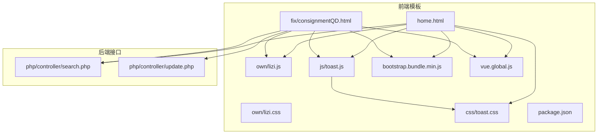
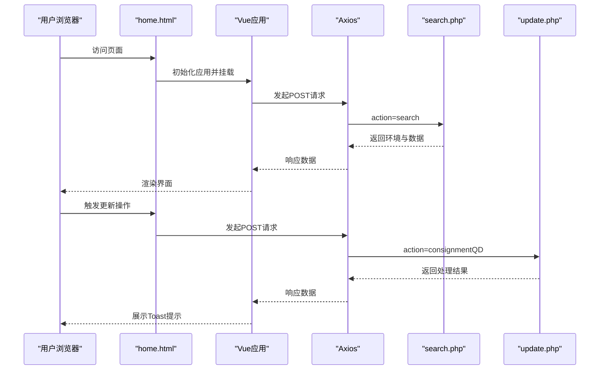
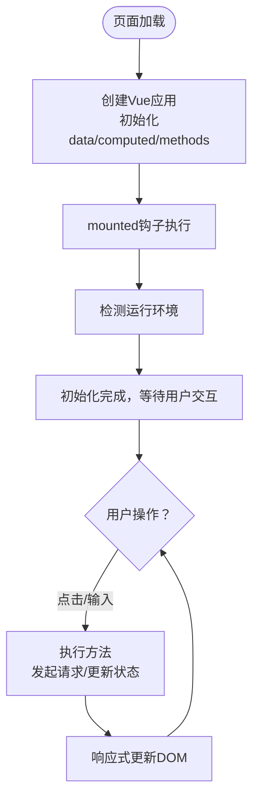
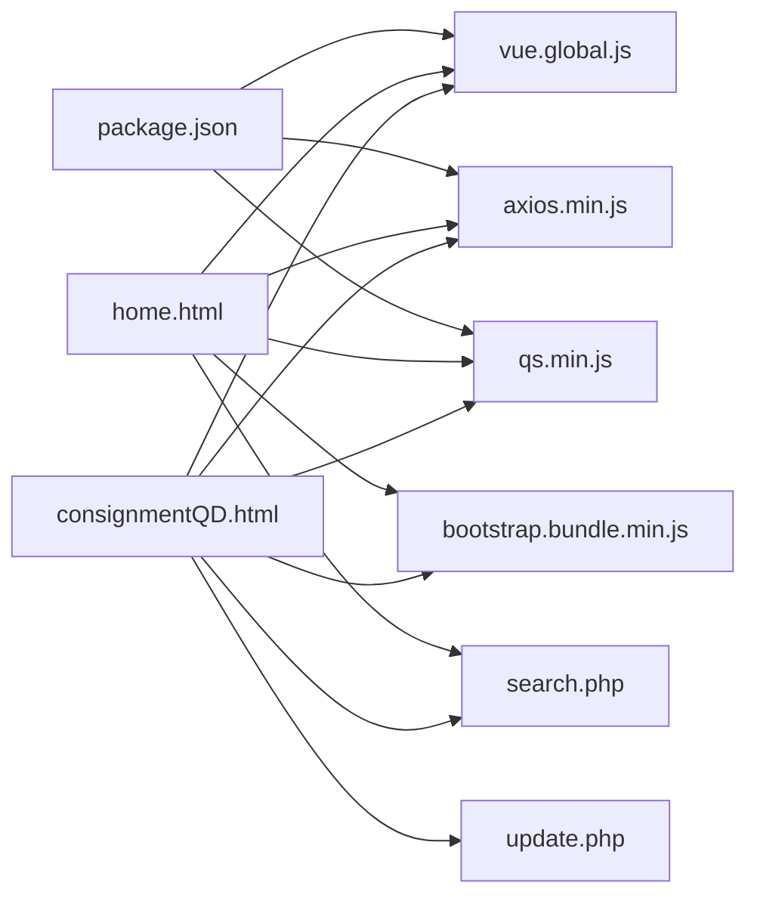

# 前端界面问题

<cite>
**本文引用的文件**
- [template/home.html](file://template/home.html)
- [template/fix/consignmentQD.html](file://template/fix/consignmentQD.html)
- [template/css_js/css/toast.css](file://template/css_js/css/toast.css)
- [template/css_js/js/toast.js](file://template/css_js/js/toast.js)
- [template/css_js/own/lizi.css](file://template/css_js/own/lizi.css)
- [template/css_js/own/lizi.js](file://template/css_js/own/lizi.js)
- [template/css_js/script/common.js](file://template/css_js/script/common.js)
- [template/css_js/script/vue.global.js](file://template/css_js/script/vue.global.js)
- [template/css_js/bootstrap-5.3.0/js/bootstrap.bundle.min.js](file://template/css_js/bootstrap-5.3.0/js/bootstrap.bundle.min.js)
- [template/package.json](file://template/package.json)
- [php/controller/search.php](file://php/controller/search.php)
- [php/controller/update.php](file://php/controller/update.php)
</cite>

## 目录
1. [简介](#简介)
2. [项目结构](#项目结构)
3. [核心组件](#核心组件)
4. [架构总览](#架构总览)
5. [详细组件分析](#详细组件分析)
6. [依赖关系分析](#依赖关系分析)
7. [性能考量](#性能考量)
8. [故障排查指南](#故障排查指南)
9. [结论](#结论)
10. [附录](#附录)

## 简介
本指南面向前端与运维工程师，聚焦于本项目中常见的前端界面问题排查与解决，涵盖以下主题：
- Vue.js 组件加载失败与生命周期问题诊断
- Bootstrap 样式冲突与版本兼容性
- JavaScript 执行错误定位与修复
- 浏览器兼容性识别与解决方案
- 静态资源加载失败（CSS、JS、字体）排查
- 响应式布局调试与移动端适配
- 数据绑定异常处理
- 前端缓存清理与版本更新策略

## 项目结构
前端以模板页为核心，采用内联 Vue 3 与 Bootstrap 5 的方式组织，配合自定义粒子特效与 Toast 通知组件；后端通过 PHP 控制器提供数据与业务接口。

**图表来源**
- [template/home.html](file://template/home.html#L1-L761)
- [template/fix/consignmentQD.html](file://template/fix/consignmentQD.html#L1-L278)
- [template/css_js/js/toast.js](file://template/css_js/js/toast.js#L1-L92)
- [template/css_js/css/toast.css](file://template/css_js/css/toast.css#L1-L134)
- [template/css_js/own/lizi.js](file://template/css_js/own/lizi.js#L1-L97)
- [template/css_js/own/lizi.css](file://template/css_js/own/lizi.css#L1-L24)
- [template/css_js/bootstrap-5.3.0/js/bootstrap.bundle.min.js](file://template/css_js/bootstrap-5.3.0/js/bootstrap.bundle.min.js#L1-L7)
- [template/css_js/script/vue.global.js](file://template/css_js/script/vue.global.js#L1-L800)
- [template/package.json](file://template/package.json#L1-L15)
- [php/controller/search.php](file://php/controller/search.php#L1-L719)
- [php/controller/update.php](file://php/controller/update.php#L1-L800)

**章节来源**
- [template/home.html](file://template/home.html#L1-L761)
- [template/fix/consignmentQD.html](file://template/fix/consignmentQD.html#L1-L278)
- [template/css_js/js/toast.js](file://template/css_js/js/toast.js#L1-L92)
- [template/css_js/css/toast.css](file://template/css_js/css/toast.css#L1-L134)
- [template/css_js/own/lizi.js](file://template/css_js/own/lizi.js#L1-L97)
- [template/css_js/own/lizi.css](file://template/css_js/own/lizi.css#L1-L24)
- [template/css_js/bootstrap-5.3.0/js/bootstrap.bundle.min.js](file://template/css_js/bootstrap-5.3.0/js/bootstrap.bundle.min.js#L1-L7)
- [template/css_js/script/vue.global.js](file://template/css_js/script/vue.global.js#L1-L800)
- [template/package.json](file://template/package.json#L1-L15)
- [php/controller/search.php](file://php/controller/search.php#L1-L719)
- [php/controller/update.php](file://php/controller/update.php#L1-L800)

## 核心组件
- Vue 3 应用与生命周期
  - 在首页与功能页中通过全局引入的 Vue 3 运行时创建应用，挂载到 DOM 节点，使用响应式数据与计算属性进行渲染与交互。
  - 生命周期钩子在页面挂载时触发，用于环境检测与初始状态设置。
- Bootstrap 5 组件与样式
  - 通过 CDN 与本地打包的 Bootstrap 5 资源提供栅格、组件与交互行为；注意版本与模块化差异。
- Toast 通知系统
  - 通过 Mixin 提供统一的提示展示能力，支持多种类型与自动关闭。
- 粒子特效
  - Canvas 实现的背景粒子动画，鼠标交互与边界循环，需关注性能与兼容性。

**章节来源**
- [template/home.html](file://template/home.html#L594-L758)
- [template/fix/consignmentQD.html](file://template/fix/consignmentQD.html#L138-L274)
- [template/css_js/js/toast.js](file://template/css_js/js/toast.js#L6-L86)
- [template/css_js/own/lizi.js](file://template/css_js/own/lizi.js#L1-L97)

## 架构总览
前端通过模板页加载 Vue 与 Bootstrap 资源，调用后端 PHP 接口完成数据查询与更新。接口根据 action 参数路由到不同业务处理方法。

**图表来源**
- [template/home.html](file://template/home.html#L594-L758)
- [template/fix/consignmentQD.html](file://template/fix/consignmentQD.html#L138-L274)
- [php/controller/search.php](file://php/controller/search.php#L657-L719)
- [php/controller/update.php](file://php/controller/update.php#L792-L800)

## 详细组件分析

### Vue 组件与生命周期
- 页面入口与应用初始化
  - 在模板页中创建 Vue 应用实例，挂载到根节点，初始化数据与计算属性，执行挂载后的逻辑。
- 生命周期钩子
  - 在 mounted 中执行环境检测与初始化任务，避免在 SSR 或 DOM 未就绪时访问节点。
- 数据绑定与事件
  - 使用 v-model、v-for、v-if 等指令绑定数据与渲染列表；事件处理器负责状态切换与请求发起。

**图表来源**
- [template/home.html](file://template/home.html#L594-L758)
- [template/fix/consignmentQD.html](file://template/fix/consignmentQD.html#L138-L274)

**章节来源**
- [template/home.html](file://template/home.html#L594-L758)
- [template/fix/consignmentQD.html](file://template/fix/consignmentQD.html#L138-L274)

### Bootstrap 样式与组件
- 版本与模块化
  - 项目同时引入了 CDN 与本地打包的 Bootstrap 资源，需确保版本一致，避免样式冲突。
- 组件使用
  - 列表、卡片、按钮等组件依赖 Bootstrap 的 CSS 与 JS；若出现交互失效，检查是否正确加载了 bundle 文件。
- 响应式断点
  - 模板中包含媒体查询，注意在不同设备上的表现差异。

**章节来源**
- [template/home.html](file://template/home.html#L7-L12)
- [template/fix/consignmentQD.html](file://template/fix/consignmentQD.html#L6-L11)
- [template/css_js/bootstrap-5.3.0/js/bootstrap.bundle.min.js](file://template/css_js/bootstrap-5.3.0/js/bootstrap.bundle.min.js#L1-L7)

### Toast 通知系统
- 组件职责
  - 通过 Mixin 提供统一的提示展示，支持成功、错误、信息、警告四类样式与自动关闭。
- 样式与动画
  - 右上角弹出式通知，包含滑入/滑出动画与响应式适配。
- 使用建议
  - 在异步请求前后调用相应方法，避免频繁弹窗；注意移动端体验。

**章节来源**
- [template/css_js/js/toast.js](file://template/css_js/js/toast.js#L6-L86)
- [template/css_js/css/toast.css](file://template/css_js/css/toast.css#L1-L134)
- [template/fix/consignmentQD.html](file://template/fix/consignmentQD.html#L118-L133)

### 粒子特效
- 技术实现
  - Canvas 绘制粒子，鼠标交互与边界循环；适合背景装饰，需关注性能与兼容性。
- 注意事项
  - 在低端设备或移动设备上可能影响帧率；可按需禁用或降级。

**章节来源**
- [template/css_js/own/lizi.js](file://template/css_js/own/lizi.js#L1-L97)
- [template/css_js/own/lizi.css](file://template/css_js/own/lizi.css#L1-L24)

## 依赖关系分析
- 前端依赖
  - Vue 3 运行时与 DOM 渲染；Axios 用于 HTTP 请求；Bootstrap 提供 UI 组件与样式；QS 用于查询串处理。
- 后端接口
  - search.php 与 update.php 根据 action 参数分发到具体业务方法，返回 JSON 数据。

**图表来源**
- [template/package.json](file://template/package.json#L1-L15)
- [template/css_js/script/vue.global.js](file://template/css_js/script/vue.global.js#L1-L800)
- [template/css_js/script/common.js](file://template/css_js/script/common.js#L1-L5)
- [template/css_js/bootstrap-5.3.0/js/bootstrap.bundle.min.js](file://template/css_js/bootstrap-5.3.0/js/bootstrap.bundle.min.js#L1-L7)
- [php/controller/search.php](file://php/controller/search.php#L657-L719)
- [php/controller/update.php](file://php/controller/update.php#L792-L800)

**章节来源**
- [template/package.json](file://template/package.json#L1-L15)
- [template/css_js/script/common.js](file://template/css_js/script/common.js#L1-L5)
- [php/controller/search.php](file://php/controller/search.php#L657-L719)
- [php/controller/update.php](file://php/controller/update.php#L792-L800)

## 性能考量
- 资源加载优化
  - 将第三方库（如 Vue、Axios、Bootstrap）尽量使用本地缓存版本，减少 CDN 不可用风险。
  - 合理拆分与懒加载非关键资源，避免阻塞首屏渲染。
- Canvas 性能
  - 粒子特效在低端设备上可能造成卡顿，建议在移动端或低性能设备上禁用或降低粒子数量。
- 响应式与移动端
  - 使用媒体查询与 Bootstrap 断点，确保在小屏设备上的可读性与交互性。

[本节为通用指导，无需特定文件引用]

## 故障排查指南

### 一、Vue 组件加载失败
- 症状
  - 页面空白、控制台报错、组件不渲染。
- 排查步骤
  - 检查 Vue 资源是否正确加载（CDN 或本地路径），确认版本兼容性。
  - 查看模板中是否正确挂载到根节点，确认 mounted 钩子执行顺序。
  - 检查模板中的 v-bind/v-on 等指令语法是否正确。
- 解决方案
  - 固定 Vue 版本并在本地部署；确保模板页中仅保留必要的脚本与样式。
  - 对复杂组件进行拆分与懒加载，避免一次性初始化过多逻辑。

**章节来源**
- [template/home.html](file://template/home.html#L594-L758)
- [template/fix/consignmentQD.html](file://template/fix/consignmentQD.html#L138-L274)
- [template/css_js/script/vue.global.js](file://template/css_js/script/vue.global.js#L1-L800)

### 二、Bootstrap 样式冲突
- 症状
  - 组件样式错乱、按钮/表格/导航显示异常。
- 排查步骤
  - 确认仅加载一种版本的 Bootstrap（CDN 与本地不要混用）。
  - 检查自定义 CSS 是否覆盖了关键样式，优先级是否过高。
- 解决方案
  - 统一使用本地打包的 Bootstrap，避免 CDN 与本地版本冲突。
  - 使用更精确的选择器或 CSS Modules，减少全局污染。

**章节来源**
- [template/home.html](file://template/home.html#L7-L12)
- [template/fix/consignmentQD.html](file://template/fix/consignmentQD.html#L6-L11)
- [template/css_js/bootstrap-5.3.0/js/bootstrap.bundle.min.js](file://template/css_js/bootstrap-5.3.0/js/bootstrap.bundle.min.js#L1-L7)

### 三、JavaScript 执行错误
- 症状
  - 控制台报错、功能不可用、页面崩溃。
- 排查步骤
  - 定位报错堆栈，检查变量作用域、函数调用时机与异步回调。
  - 检查 Axios 请求参数与后端接口返回格式一致性。
- 解决方案
  - 在关键流程增加 try/catch 并使用 Toast 提示错误信息。
  - 对外部依赖（如 CDN）增加降级方案（本地备用资源）。

**章节来源**
- [template/fix/consignmentQD.html](file://template/fix/consignmentQD.html#L212-L272)
- [php/controller/search.php](file://php/controller/search.php#L657-L719)
- [php/controller/update.php](file://php/controller/update.php#L792-L800)

### 四、浏览器兼容性问题
- 症状
  - 某些特性在旧版浏览器不生效（如 ES6+ 语法、Canvas API）。
- 排查步骤
  - 使用浏览器开发者工具的兼容性面板检查不支持的特性。
  - 检查 Vue 与 Bootstrap 的兼容矩阵，必要时引入 polyfill。
- 解决方案
  - 引入必要的 polyfill；对不兼容特性进行降级处理；在移动端优先保证基础功能。

[本节为通用指导，无需特定文件引用]

### 五、静态资源加载失败（CSS/JS/字体）
- 症状
  - 样式未生效、脚本 404、字体乱码。
- 排查步骤
  - 检查资源路径是否正确（相对路径与绝对路径），确认服务器可访问。
  - 检查 MIME 类型与跨域头设置，避免浏览器拦截。
- 解决方案
  - 使用本地资源并固定版本；在构建阶段进行资源指纹化与缓存策略配置。

**章节来源**
- [template/home.html](file://template/home.html#L7-L12)
- [template/fix/consignmentQD.html](file://template/fix/consignmentQD.html#L6-L11)
- [template/css_js/script/common.js](file://template/css_js/script/common.js#L1-L5)

### 六、响应式布局与移动端适配
- 症状
  - 字体过小、按钮拥挤、滚动条遮挡内容。
- 排查步骤
  - 检查 viewport 设置与媒体查询断点。
  - 在多设备上测试，关注触摸交互与点击目标尺寸。
- 解决方案
  - 使用 Bootstrap 断点与工具类；为移动端提供更大点击区域；限制最大宽度与内边距。

**章节来源**
- [template/home.html](file://template/home.html#L407-L482)
- [template/fix/consignmentQD.html](file://template/fix/consignmentQD.html#L17-L59)
- [template/css_js/css/toast.css](file://template/css_js/css/toast.css#L120-L134)

### 七、Vue 组件生命周期问题
- 症状
  - 数据未初始化、DOM 未就绪即访问、内存泄漏。
- 排查步骤
  - 确认在 mounted 后再访问 DOM；在 beforeUnmount 中清理定时器与事件监听。
- 解决方案
  - 将副作用逻辑放入 mounted；使用 onScopeDispose 管理响应式作用域。

**章节来源**
- [template/home.html](file://template/home.html#L671-L710)
- [template/fix/consignmentQD.html](file://template/fix/consignmentQD.html#L170-L190)

### 八、数据绑定异常
- 症状
  - 输入框不更新、列表不刷新、按钮状态不变。
- 排查步骤
  - 检查 v-model 与 v-for 的 key、对象引用变化与响应式规则。
- 解决方案
  - 使用计算属性与响应式包装；避免直接修改数组长度；确保键值稳定。

**章节来源**
- [template/home.html](file://template/home.html#L530-L566)
- [template/fix/consignmentQD.html](file://template/fix/consignmentQD.html#L77-L116)

### 九、前端缓存清理与版本更新策略
- 缓存清理
  - 清除浏览器缓存与 Service Worker；强制刷新（Ctrl+F5）。
- 版本更新
  - 在构建阶段启用文件指纹；后端设置合理的缓存头；CDN 与本地资源版本号分离。
- 策略建议
  - 对关键资源（如 Vue、Bootstrap）使用固定版本；对业务 CSS/JS 使用指纹命名。

**章节来源**
- [template/package.json](file://template/package.json#L1-L15)

## 结论
本项目前端以 Vue 3 与 Bootstrap 5 为基础，结合自定义通知与粒子特效，形成简洁直观的界面。排查前端问题的关键在于：
- 统一资源版本与路径
- 正确的生命周期与数据绑定
- 响应式与移动端适配
- 后端接口的一致性与稳定性

遵循本指南的排查流程与最佳实践，可快速定位并解决常见前端界面问题。

[本节为总结，无需特定文件引用]

## 附录

### A. 常见错误与修复对照
- Vue 未定义：检查 Vue 资源加载顺序与版本
- Bootstrap 交互无效：确认 bundle 文件加载且版本一致
- Axios 请求失败：检查接口 URL、参数与后端返回格式
- Toast 不显示：确认 Mixin 注入与样式文件加载

**章节来源**
- [template/css_js/js/toast.js](file://template/css_js/js/toast.js#L6-L86)
- [template/css_js/css/toast.css](file://template/css_js/css/toast.css#L1-L134)
- [php/controller/search.php](file://php/controller/search.php#L657-L719)