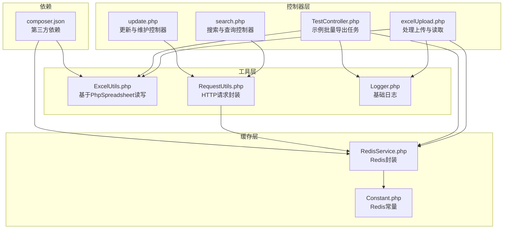
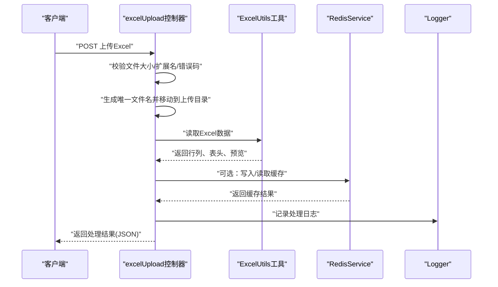
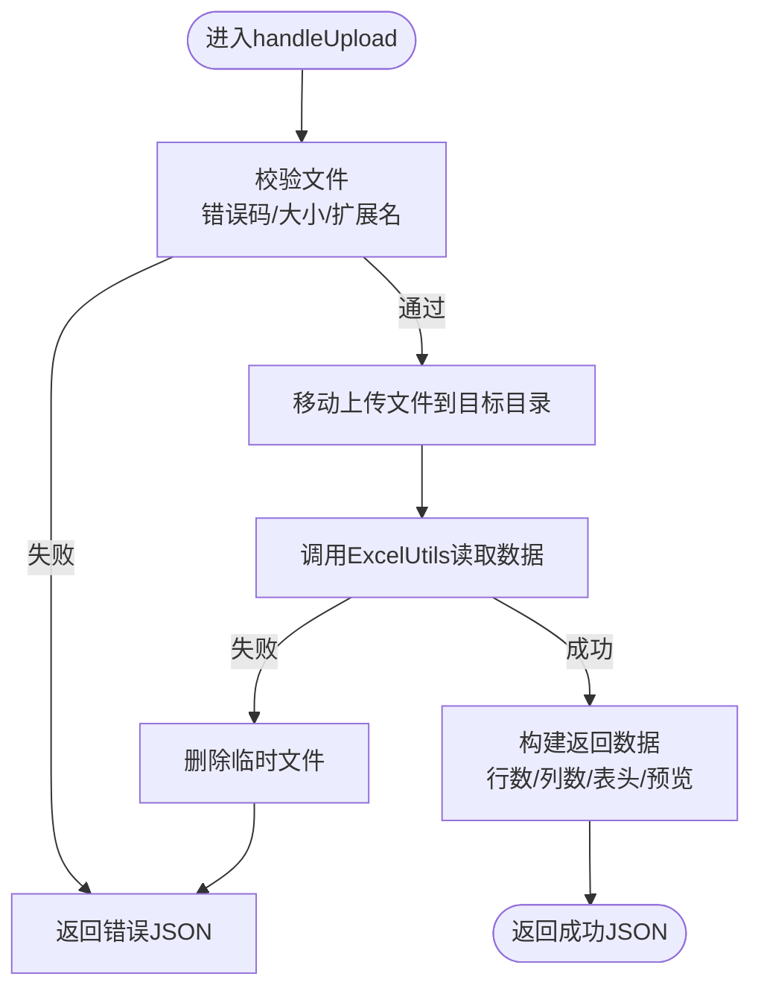
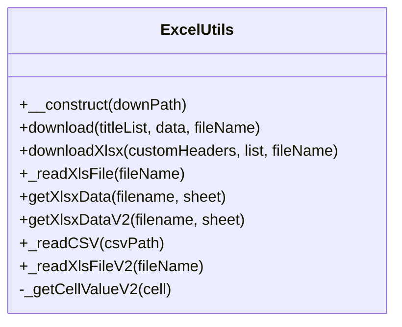
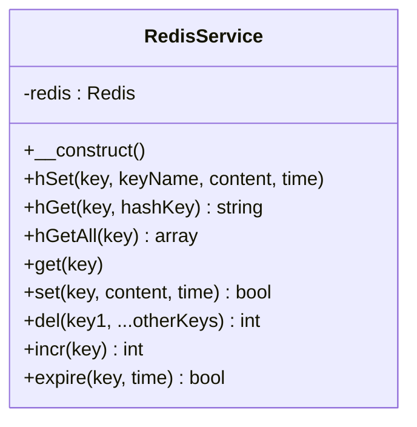
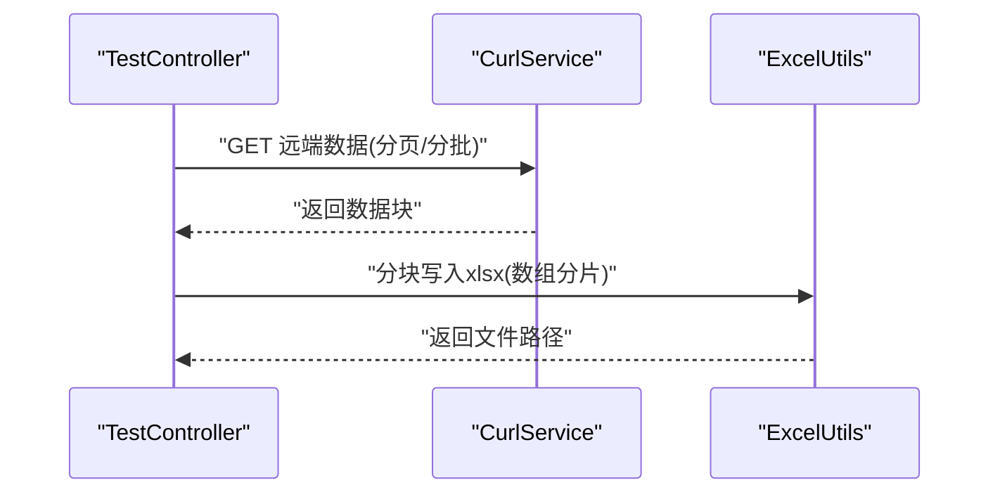
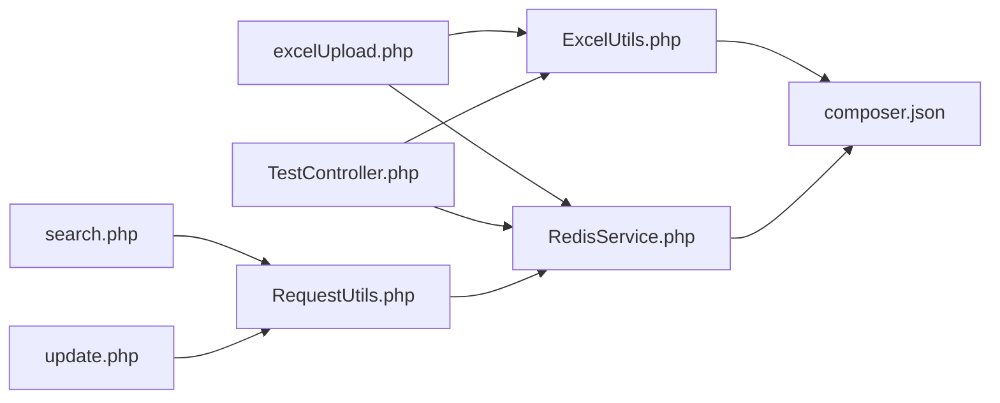
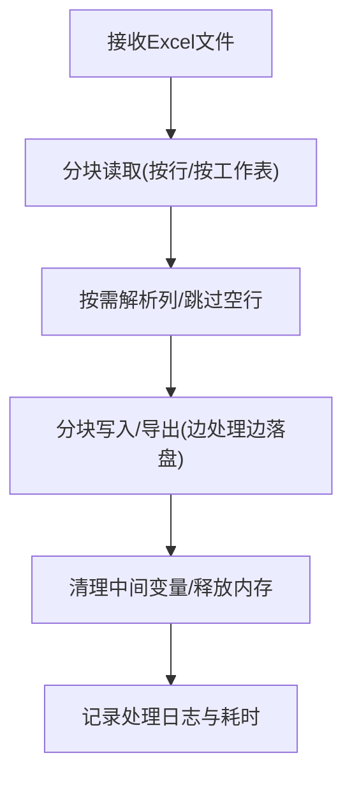

# 性能问题排查

<cite>
**本文引用的文件**
- [excelUpload.php](file://php/controller/excelUpload.php)
- [ExcelUtils.php](file://php/utils/ExcelUtils.php)
- [RedisService.php](file://php/redis/RedisService.php)
- [Constant.php](file://php/constant/Constant.php)
- [composer.json](file://composer.json)
- [Logger.php](file://php/class/Logger.php)
- [TestController.php](file://php/shell/TestController.php)
- [CurlService.php](file://php/curl/CurlService.php)
- [RequestUtils.php](file://php/utils/RequestUtils.php)
- [search.php](file://php/controller/search.php)
- [update.php](file://php/controller/update.php)
- [uploadChunk.php](file://php/controller/uploadChunk.php)
</cite>

## 更新摘要
**变更内容**
- 新增大数据分块处理最佳实践章节，基于TestController中array_chunk的实际应用
- 更新Excel文件处理性能优化部分，增加分块导出的具体实现示例
- 新增多个控制器中array_chunk使用的实际案例分析
- 完善Shell脚本执行效率优化建议，结合TestController的分块策略

## 目录
1. [简介](#简介)
2. [项目结构](#项目结构)
3. [核心组件](#核心组件)
4. [架构总览](#架构总览)
5. [详细组件分析](#详细组件分析)
6. [依赖关系分析](#依赖关系分析)
7. [性能考量与优化建议](#性能考量与优化建议)
8. [大数据分块处理最佳实践](#大数据分块处理最佳实践)
9. [故障排查指南](#故障排查指南)
10. [结论](#结论)
11. [附录](#附录)

## 简介
本指南聚焦于该PHP项目的性能问题排查与优化，覆盖以下方面：
- 识别与定位内存使用过高、CPU占用异常、响应时间过长等常见性能瓶颈
- 解读关键性能监控指标：内存限制、执行时间、并发数等
- Redis缓存性能问题的诊断与优化
- Excel文件处理性能优化：大文件读取、内存管理、批处理策略
- Shell脚本执行效率分析与优化
- 数据库查询性能优化与索引使用建议（结合现有HTTP请求与日志能力）
- **新增**：大数据分块处理最佳实践与array_chunk使用策略

## 项目结构
该项目以PHP后端为主，包含控制器、工具类、Redis封装、常量配置、日志与示例Shell脚本等模块；前端模板位于template目录。与性能密切相关的后端模块主要集中在：
- 控制器层：处理Excel上传与读取，执行批量数据处理
- 工具层：基于PhpSpreadsheet进行读写，提供HTTP请求封装
- 缓存层：Redis服务封装
- 日志与监控：基础日志记录与外部组件日志输出
- Shell脚本：示例批量导出任务，展示分块处理实践



**图表来源**
- [excelUpload.php](file://php/controller/excelUpload.php#L1-L372)
- [ExcelUtils.php](file://php/utils/ExcelUtils.php#L1-L398)
- [RedisService.php](file://php/redis/RedisService.php#L1-L77)
- [Constant.php](file://php/constant/Constant.php#L1-L26)
- [composer.json](file://composer.json#L1-L11)
- [Logger.php](file://php/class/Logger.php#L1-L55)
- [TestController.php](file://php/shell/TestController.php#L1-L89)
- [RequestUtils.php](file://php/utils/RequestUtils.php#L1-L672)
- [search.php](file://php/controller/search.php#L1-L719)
- [update.php](file://php/controller/update.php#L1-L1017)

## 核心组件
- Excel上传与读取控制器：负责文件校验、移动、读取、预览与批量处理
- Excel工具类：基于PhpSpreadsheet实现读取与写入，支持xlsx/xls/csv
- Redis服务封装：提供常用哈希与键值操作及过期控制
- 常量配置：集中定义Redis连接参数与键命名规范
- 日志类：提供基础日志写入能力
- HTTP请求封装：统一处理跨环境API调用
- 示例Shell脚本：演示分块导出与批量处理思路

**章节来源**
- [excelUpload.php](file://php/controller/excelUpload.php#L11-L328)
- [ExcelUtils.php](file://php/utils/ExcelUtils.php#L20-L398)
- [RedisService.php](file://php/redis/RedisService.php#L7-L77)
- [Constant.php](file://php/constant/Constant.php#L4-L26)
- [Logger.php](file://php/class/Logger.php#L14-L55)
- [TestController.php](file://php/shell/TestController.php#L11-L89)
- [RequestUtils.php](file://php/utils/RequestUtils.php#L1-L672)

## 架构总览
下图展示典型Excel上传与读取流程，以及与Redis、日志的关系：



**图表来源**
- [excelUpload.php](file://php/controller/excelUpload.php#L35-L95)
- [ExcelUtils.php](file://php/utils/ExcelUtils.php#L147-L181)
- [RedisService.php](file://php/redis/RedisService.php#L29-L50)
- [Logger.php](file://php/class/Logger.php#L22-L37)

## 详细组件分析

### Excel上传与读取控制器（excelUpload）
- 功能要点
  - 文件验证：上传错误码、大小限制、扩展名校验
  - 文件存储：生成唯一文件名并移动至上传目录
  - 数据读取：委托ExcelUtils读取，支持多工作表聚合
  - 预览与统计：返回行数、列数、表头与前若干行预览
  - 批量处理：支持多文件上传汇总统计
- 性能关注点
  - 大文件读取：一次性加载整个工作簿可能造成内存峰值
  - 预览行数：可通过参数控制，避免前端渲染压力
  - 错误处理：异常捕获与失败回滚（删除临时文件）



**图表来源**
- [excelUpload.php](file://php/controller/excelUpload.php#L35-L95)
- [excelUpload.php](file://php/controller/excelUpload.php#L102-L140)
- [excelUpload.php](file://php/controller/excelUpload.php#L148-L238)

**章节来源**
- [excelUpload.php](file://php/controller/excelUpload.php#L11-L328)

### Excel工具类（ExcelUtils）
- 功能要点
  - 读取xls/xlsx：逐单元格读取，支持多工作表
  - 读取csv：按行解析，处理长数字与文本格式
  - 写入xlsx：按列序写入，支持自定义表头
- 性能关注点
  - 逐单元格读取：在大文件场景下内存与时间成本较高
  - 单元格值处理：针对富文本与长数字做格式判断与转换
  - 分块策略：建议在上层控制器或脚本中采用分块读取/写入



**图表来源**
- [ExcelUtils.php](file://php/utils/ExcelUtils.php#L20-L398)

**章节来源**
- [ExcelUtils.php](file://php/utils/ExcelUtils.php#L147-L181)
- [ExcelUtils.php](file://php/utils/ExcelUtils.php#L246-L311)
- [ExcelUtils.php](file://php/utils/ExcelUtils.php#L315-L359)
- [ExcelUtils.php](file://php/utils/ExcelUtils.php#L366-L394)

### Redis服务封装（RedisService）
- 功能要点
  - 连接与认证：基于常量配置连接Redis
  - 基础操作：hSet/hGet/hGetAll/get/set/del/incr/expire
- 性能关注点
  - 单连接复用：减少连接/断开开销
  - 键空间设计：合理命名与过期策略，避免内存膨胀
  - 批量操作：必要时使用管道或Lua脚本降低RTT



**图表来源**
- [RedisService.php](file://php/redis/RedisService.php#L7-L77)
- [Constant.php](file://php/constant/Constant.php#L4-L6)

**章节来源**
- [RedisService.php](file://php/redis/RedisService.php#L15-L77)
- [Constant.php](file://php/constant/Constant.php#L4-L26)

### HTTP请求封装（RequestUtils）
- 功能要点
  - 统一API调用：封装跨环境HTTP请求
  - 数据分页：支持大数据集的分页查询
  - 批量处理：提供多种批量操作方法
- 性能关注点
  - 分块查询：使用array_chunk控制批量大小
  - 内存管理：避免一次性加载大量数据
  - 错误处理：统一的异常处理机制

**章节来源**
- [RequestUtils.php](file://php/utils/RequestUtils.php#L60-L105)
- [RequestUtils.php](file://php/utils/RequestUtils.php#L258-L268)
- [RequestUtils.php](file://php/utils/RequestUtils.php#L292-L305)
- [RequestUtils.php](file://php/utils/RequestUtils.php#L367-L374)

### 示例Shell脚本（TestController）
- 功能要点
  - 通过CurlService拉取远端数据，分块导出为Excel
  - 展示批量处理与分块写入的实践
- 性能关注点
  - 分块大小：根据内存与网络状况调整
  - 导出写盘：避免一次性将大量数据驻留内存



**图表来源**
- [TestController.php](file://php/shell/TestController.php#L37-L77)
- [CurlService.php](file://php/curl/CurlService.php#L145-L207)

**章节来源**
- [TestController.php](file://php/shell/TestController.php#L11-L89)

## 依赖关系分析
- 第三方依赖
  - PhpSpreadsheet：Excel读写
  - ext-redis：Redis扩展
  - ext-json：JSON处理
  - psr/log、monolog：日志抽象与实现
- 组件耦合
  - 控制器依赖工具类与Redis服务
  - Shell脚本依赖CurlService与ExcelUtils
  - 日志类被控制器与脚本使用
  - RequestUtils作为HTTP请求统一入口



**图表来源**
- [excelUpload.php](file://php/controller/excelUpload.php#L1-L10)
- [ExcelUtils.php](file://php/utils/ExcelUtils.php#L1-L15)
- [RedisService.php](file://php/redis/RedisService.php#L1-L3)
- [composer.json](file://composer.json#L1-L11)
- [TestController.php](file://php/shell/TestController.php#L1-L5)
- [RequestUtils.php](file://php/utils/RequestUtils.php#L1-L5)

**章节来源**
- [composer.json](file://composer.json#L1-L11)

## 性能考量与优化建议

### 通用性能监控指标
- 内存使用
  - 观察PHP进程RSS/峰值内存，结合文件大小与行数估算
  - 大文件读取时优先采用流式/分块策略
- CPU占用
  - 记录请求处理耗时，定位计算密集环节（如公式/格式转换）
- 并发数
  - Nginx/FPM并发与队列积压，结合日志时间戳分析
- Redis命中率
  - 通过命令统计与业务命中情况评估缓存有效性

### Excel文件处理性能优化
- 大文件读取
  - 采用分块读取：按行或按工作表分块，避免一次性加载
  - 仅读取必要列：减少单元格遍历
  - 使用更轻量的Reader：如CSV Reader处理纯文本数据
- 内存管理
  - 及时释放中间变量与临时数组
  - 控制预览行数，避免前端渲染压力
- 批处理策略
  - 上游控制器与脚本采用分块处理，边处理边落盘
  - 导出时使用分块写入，避免内存驻留



### Redis缓存性能问题诊断与优化
- 诊断
  - 使用INFO命令观察内存、连接、命中率与慢查询
  - 检查键空间分布与过期策略是否合理
- 优化
  - 合理设置TTL，避免全局过期导致的集中失效
  - 使用pipeline减少RTT
  - 将热点数据结构化，避免超大对象
  - 定期清理无用键，防止内存碎片

**章节来源**
- [RedisService.php](file://php/redis/RedisService.php#L29-L76)
- [Constant.php](file://php/constant/Constant.php#L4-L26)

### Shell脚本执行效率分析与优化
- 分析
  - 在脚本中记录开始/结束时间，统计每步耗时
  - 观察I/O与网络请求的占比
- 优化
  - 分块导出：参考示例脚本的array_chunk策略
  - 并行化：在可控范围内并发拉取与写入
  - 减少重复请求：利用缓存与去重

**章节来源**
- [TestController.php](file://php/shell/TestController.php#L61-L72)

### 数据库查询性能优化与索引使用建议
- 当前代码未直接展示数据库访问逻辑，但结合日志与HTTP请求组件可进行如下优化：
  - 使用日志记录关键请求的耗时与参数，定位慢查询
  - 对高频查询字段建立合适索引，避免全表扫描
  - 使用EXPLAIN分析SQL执行计划，剔除不必要的JOIN/NL
  - 采用分页/限制返回条数，避免一次性返回过多数据

**章节来源**
- [Logger.php](file://php/class/Logger.php#L22-L37)
- [CurlService.php](file://php/curl/CurlService.php#L145-L207)

## 大数据分块处理最佳实践

### array_chunk在项目中的应用模式

#### TestController中的分块导出实践
TestController展示了典型的分块处理模式，特别是在处理大量数据导出时的应用：

```php
// 大数据分块导出示例
foreach (array_chunk($list, 10000) as $chunk) {
    $filePath = $excelUtils->downloadXlsx($headers, $chunk, $filename);
}
```

这种模式的优势：
- **内存控制**：每次只处理10000条记录，避免内存峰值
- **渐进式输出**：数据边处理边写入磁盘
- **错误恢复**：单个分块失败不影响整体流程

#### RequestUtils中的批量查询优化
RequestUtils提供了多种批量处理场景的最佳实践：

```php
// SKU列表批量查询（150个一组）
foreach (array_chunk($skuIdList, 150) as $chunk) {
    $skuList = array_merge($skuList, DataUtils::getPageList($curlService->s3015()->get("product-skus/queryPage", [
        "productId_in" => implode(",", $chunk),
        "limit" => count($chunk)
    ])));
}

// CE单号批量查询（100个一组）
foreach (array_chunk($ceBillNoList, 100) as $chunk) {
    $list = array_merge($list, DataUtils::getPageDocList($this->curlService->s3044()->get("pa_ce_materials/queryPage", [
        "ceBillNo_in" => implode(",", $chunk),
        "limit" => count($chunk)
    ])));
}
```

#### 控制器中的分块处理模式
多个控制器展示了不同的分块策略：

```php
// 搜索控制器（200个一组）
foreach (array_chunk($skuIdList,200) as $chunk){

// 更新控制器（500个一组）
foreach (array_chunk($addskuIdList,500) as $skuIdList){
```

### 分块大小选择策略

#### 基于数据类型的分块策略
- **小数据量**：100-500条/块
- **中等数据量**：500-2000条/块  
- **大数据量**：5000-10000条/块

#### 基于内存限制的分块策略
- **低内存服务器**：100-500条/块
- **中等内存服务器**：500-2000条/块
- **高内存服务器**：2000-10000条/块

#### 基于网络带宽的分块策略
- **低带宽**：100-200条/块
- **中等带宽**：200-500条/块
- **高带宽**：500-1000条/块

### 分块处理的性能监控

#### 实施监控指标
```php
// 分块处理监控示例
$start_time = microtime(true);
$chunk_count = 0;
$total_processed = 0;

foreach (array_chunk($large_array, $chunk_size) as $chunk) {
    $chunk_start = microtime(true);
    $chunk_count++;
    
    // 处理分块数据
    $processed = process_chunk($chunk);
    $total_processed += $processed;
    
    $chunk_end = microtime(true);
    $chunk_time = ($chunk_end - $chunk_start) * 1000; // 转换为毫秒
    
    // 记录分块处理时间
    $this->log("Chunk {$chunk_count}: {$processed} items in {$chunk_time}ms");
}

$end_time = microtime(true);
$total_time = ($end_time - $start_time) * 1000;
$this->log("Total: {$total_processed} items in {$total_time}ms");
```

#### 性能优化建议
1. **动态调整分块大小**：根据实际处理时间和内存使用情况动态调整
2. **并行处理**：在支持的场景下使用多线程或多进程处理不同分块
3. **进度跟踪**：为长时间运行的分块处理提供进度反馈
4. **错误隔离**：确保单个分块的错误不会影响其他分块的处理

### 分块处理的错误处理

#### 容错机制
```php
foreach (array_chunk($data, $chunk_size) as $index => $chunk) {
    try {
        process_chunk($chunk);
        $this->log("Chunk {$index} processed successfully");
    } catch (Exception $e) {
        $this->log("Error processing chunk {$index}: " . $e->getMessage());
        // 可选：单独记录失败的分块数据
        $this->log_failed_chunk($index, $chunk, $e);
        // 继续处理下一个分块
        continue;
    }
}
```

#### 断点续传支持
```php
// 记录已处理的分块
$processed_chunks = $this->get_processed_chunks();
$remaining_chunks = array_filter($all_chunks, function($chunk_index) use ($processed_chunks) {
    return !in_array($chunk_index, $processed_chunks);
});

foreach ($remaining_chunks as $chunk_index => $chunk) {
    if (!process_chunk($chunk)) {
        // 记录失败的分块
        $this->log_failed_chunk($chunk_index, $chunk);
        break;
    }
    // 标记分块处理完成
    $this->mark_chunk_completed($chunk_index);
}
```

**章节来源**
- [TestController.php](file://php/shell/TestController.php#L61-L72)
- [RequestUtils.php](file://php/utils/RequestUtils.php#L60-L105)
- [RequestUtils.php](file://php/utils/RequestUtils.php#L258-L268)
- [RequestUtils.php](file://php/utils/RequestUtils.php#L292-L305)
- [RequestUtils.php](file://php/utils/RequestUtils.php#L367-L374)
- [search.php](file://php/controller/search.php#L183-L191)
- [update.php](file://php/controller/update.php#L213-L219)

## 故障排查指南

### 常见性能问题定位步骤
- 内存使用过高
  - 检查Excel文件大小与行数，确认是否启用分块
  - 查看控制器与工具类的中间数组规模
  - **新增**：检查array_chunk分块大小是否合理
- CPU占用异常
  - 结合日志时间戳定位耗时环节（读取/解析/写入）
  - 评估是否需要缓存或异步处理
  - **新增**：分析分块处理的CPU使用情况
- 响应时间过长
  - 分析网络请求与Redis调用链路
  - 评估并发与队列积压情况
  - **新增**：检查分块处理的累积延迟

### 具体检索与核对要点
- Excel上传
  - 文件校验失败原因与错误码映射
  - 读取失败时是否删除了临时文件
- Excel读取
  - 是否存在大量空行/空列导致遍历开销
  - 长数字与富文本处理是否影响性能
- Redis
  - 连接与认证是否稳定
  - 键空间与过期策略是否合理
- 日志
  - 是否记录了关键阶段的时间戳
  - 是否区分不同模块的日志文件
- **新增**：分块处理
  - array_chunk分块大小是否适中
  - 分块处理是否出现内存泄漏
  - 分块错误处理是否完整

**章节来源**
- [excelUpload.php](file://php/controller/excelUpload.php#L102-L140)
- [excelUpload.php](file://php/controller/excelUpload.php#L148-L238)
- [ExcelUtils.php](file://php/utils/ExcelUtils.php#L366-L394)
- [RedisService.php](file://php/redis/RedisService.php#L15-L19)
- [Logger.php](file://php/class/Logger.php#L22-L37)
- [TestController.php](file://php/shell/TestController.php#L61-L72)

## 结论
- Excel处理应优先采用分块与流式策略，严格控制内存峰值
- Redis使用需配合合理的键空间设计与过期策略，避免内存膨胀
- Shell脚本应借鉴分块导出模式，降低单次处理压力
- 日志与监控是定位性能瓶颈的关键手段，建议完善关键节点耗时记录
- **新增**：array_chunk分块处理是解决大数据量性能问题的核心策略，需要根据具体场景选择合适的分块大小

## 附录

### 性能监控与日志建议
- 在控制器与工具类的关键路径增加时间戳记录
- 对Redis操作与远程HTTP请求增加耗时统计
- 定期巡检日志文件大小与滚动策略
- **新增**：为分块处理添加专门的监控指标

**章节来源**
- [Logger.php](file://php/class/Logger.php#L22-L37)
- [excelUpload.php](file://php/controller/excelUpload.php#L331-L372)
- [TestController.php](file://php/shell/TestController.php#L32-L35)