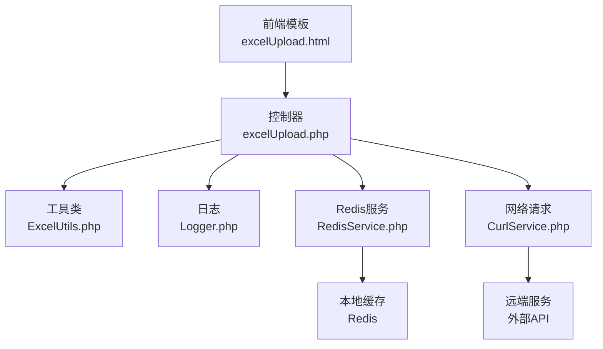
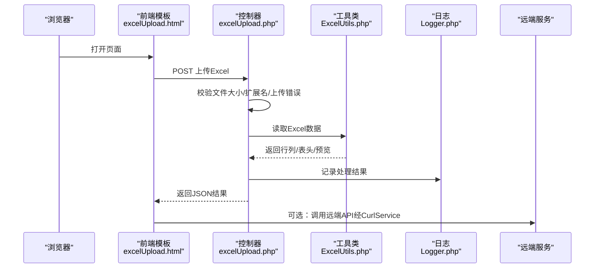
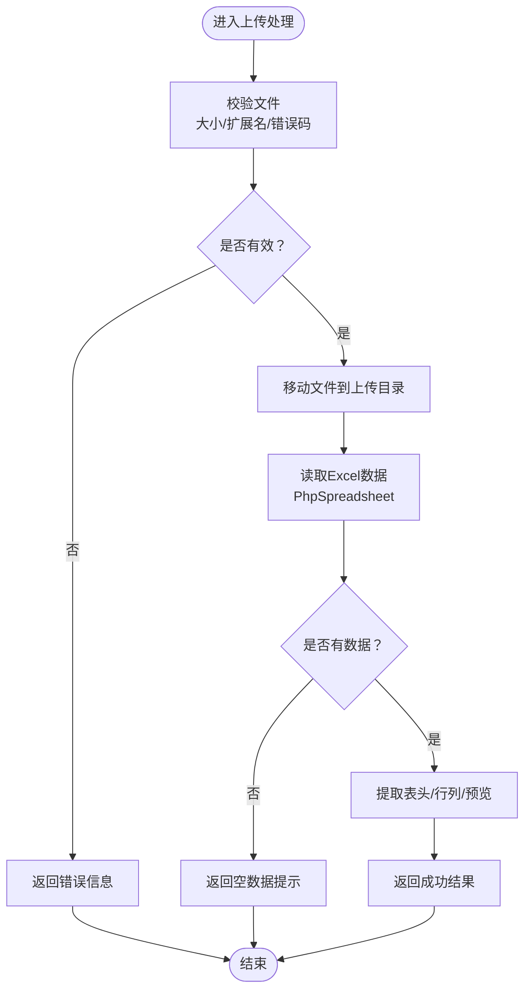
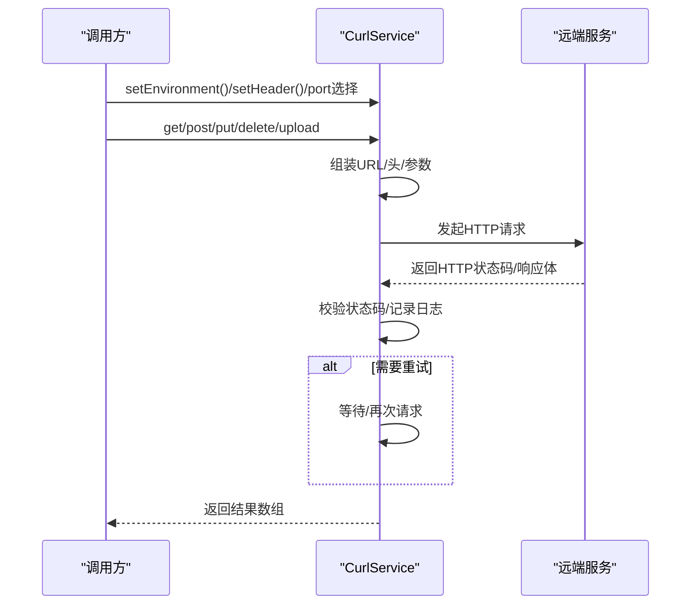
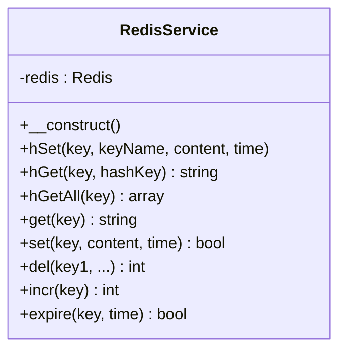
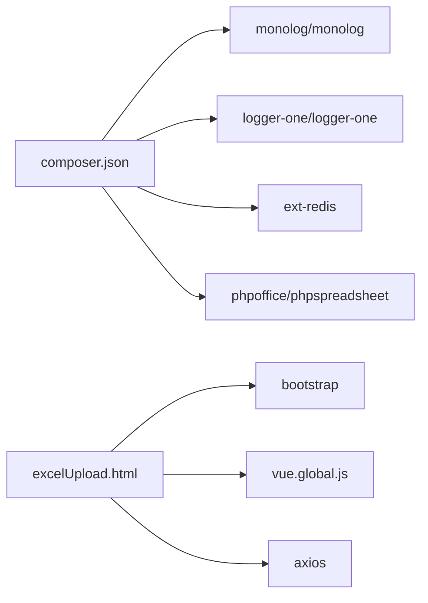

# 故障排除

<cite>
**本文引用的文件**
- [excelUpload.php](file://php/controller/excelUpload.php)
- [ExcelUtils.php](file://php/utils/ExcelUtils.php)
- [CurlService.php](file://php/curl/CurlService.php)
- [RedisService.php](file://php/redis/RedisService.php)
- [Logger.php](file://php/class/Logger.php)
- [Constant.php](file://php/constant/Constant.php)
- [composer.json](file://composer.json)
- [excelUpload.html](file://template/excelUpload.html)
- [request_20260227.log](file://php/log/curl/request_20260227.log)
</cite>

## 目录
1. [简介](#简介)
2. [项目结构](#项目结构)
3. [核心组件](#核心组件)
4. [架构总览](#架构总览)
5. [详细组件分析](#详细组件分析)
6. [依赖关系分析](#依赖关系分析)
7. [性能考虑](#性能考虑)
8. [故障排除指南](#故障排除指南)
9. [结论](#结论)
10. [附录](#附录)

## 简介
本指南面向PaSystem运维与开发人员，聚焦于系统在实际运行中可能遇到的常见问题，提供可操作的诊断与解决步骤。覆盖范围包括：
- Excel文件处理错误（格式、大小、读取失败、内存溢出）
- 网络连接问题（HTTP状态码、超时、鉴权失败、重试机制）
- 内存不足与性能瓶颈（大文件、并发、缓存策略）
- 日志分析与错误定位（后端日志、前端控制台、网络请求日志）
- 系统监控指标与异常处理（Redis、Curl、文件上传）
- 数据库连接与缓存故障（Redis连接、认证、键空间）
- 网络请求失败的诊断与重试机制
- 前端界面问题调试（Vue、Axios、拖拽上传）
- 紧急情况下的应急处理与回滚策略

## 项目结构
PaSystem采用PHP后端+前端模板的混合架构，核心模块包括：
- 控制器层：Excel上传与处理入口
- 工具层：Excel读写、网络请求、日志、Redis封装
- 前端模板：Vue驱动的Excel上传界面
- 日志与常量：统一日志输出与Redis配置常量

**图表来源**
- [excelUpload.php](file://php/controller/excelUpload.php#L1-L372)
- [ExcelUtils.php](file://php/utils/ExcelUtils.php#L1-L398)
- [CurlService.php](file://php/curl/CurlService.php#L1-L996)
- [RedisService.php](file://php/redis/RedisService.php#L1-L77)
- [Logger.php](file://php/class/Logger.php#L1-L55)
- [excelUpload.html](file://template/excelUpload.html#L1-L472)

**章节来源**
- [excelUpload.php](file://php/controller/excelUpload.php#L1-L372)
- [ExcelUtils.php](file://php/utils/ExcelUtils.php#L1-L398)
- [CurlService.php](file://php/curl/CurlService.php#L1-L996)
- [RedisService.php](file://php/redis/RedisService.php#L1-L77)
- [Logger.php](file://php/class/Logger.php#L1-L55)
- [excelUpload.html](file://template/excelUpload.html#L1-L472)

## 核心组件
- Excel上传控制器：负责文件校验、移动、读取、批量处理、结果返回与错误处理
- Excel工具类：基于PhpSpreadsheet读取Excel/XLS/CVS，处理长数字、单元格格式
- Curl服务：封装HTTP请求、环境切换、鉴权头、重试与日志
- Redis服务：封装常用KV与Hash操作，连接本地Redis
- 日志类：统一日志输出至文件与标准错误
- 前端模板：Vue + Axios，支持拖拽上传、进度条、多文件处理

**章节来源**
- [excelUpload.php](file://php/controller/excelUpload.php#L11-L328)
- [ExcelUtils.php](file://php/utils/ExcelUtils.php#L20-L398)
- [CurlService.php](file://php/curl/CurlService.php#L4-L740)
- [RedisService.php](file://php/redis/RedisService.php#L7-L77)
- [Logger.php](file://php/class/Logger.php#L14-L55)
- [excelUpload.html](file://template/excelUpload.html#L285-L470)

## 架构总览
后端通过控制器接收Excel上传请求，调用Excel工具类解析数据；若涉及跨服务交互，则通过CurlService发起HTTP请求；Redis用于缓存与状态存储；日志统一记录请求与错误信息。

**图表来源**
- [excelUpload.php](file://php/controller/excelUpload.php#L331-L372)
- [ExcelUtils.php](file://php/utils/ExcelUtils.php#L147-L181)
- [Logger.php](file://php/class/Logger.php#L22-L25)
- [CurlService.php](file://php/curl/CurlService.php#L664-L740)

## 详细组件分析

### Excel上传与读取组件
- 文件校验：大小限制、扩展名校验、上传错误码映射
- 读取策略：使用PhpSpreadsheet读取，自动遍历工作表，处理首行作为表头
- 预览与统计：返回行列数、表头、预览行集合
- 错误处理：捕获异常并返回统一结构，必要时清理上传文件

**图表来源**
- [excelUpload.php](file://php/controller/excelUpload.php#L35-L95)
- [ExcelUtils.php](file://php/utils/ExcelUtils.php#L147-L181)

**章节来源**
- [excelUpload.php](file://php/controller/excelUpload.php#L102-L238)
- [ExcelUtils.php](file://php/utils/ExcelUtils.php#L147-L181)

### 网络请求组件
- 环境配置：支持local/test/uat/pro，自动拼接URL
- 鉴权头：支持Authorization bearer与自定义头
- 请求方法：GET/POST/PUT/DELETE/UPLOAD，统一日志记录
- 重试机制：可配置重试次数与超时时间，过滤特定HTTP状态码
- 错误处理：捕获异常并按重试策略执行

**图表来源**
- [CurlService.php](file://php/curl/CurlService.php#L441-L740)

**章节来源**
- [CurlService.php](file://php/curl/CurlService.php#L441-L740)

### Redis组件
- 连接与认证：通过常量配置主机、端口、密码
- 常用操作：KV、Hash、自增、过期、删除
- 使用场景：缓存配置、用户/IP绑定、物料信息等键空间

**图表来源**
- [RedisService.php](file://php/redis/RedisService.php#L7-L77)
- [Constant.php](file://php/constant/Constant.php#L4-L6)

**章节来源**
- [RedisService.php](file://php/redis/RedisService.php#L15-L77)
- [Constant.php](file://php/constant/Constant.php#L4-L26)

### 日志组件
- 输出目标：文件与标准错误
- 使用方式：记录请求URL、参数、响应体与状态码
- 建议：结合日期轮转与保留策略，避免磁盘膨胀

**章节来源**
- [Logger.php](file://php/class/Logger.php#L14-L55)
- [CurlService.php](file://php/curl/CurlService.php#L714-L716)

### 前端上传组件
- 技术栈：Vue 3 + Axios
- 功能：拖拽上传、多文件、进度条、错误/成功提示
- 接口：指向后端控制器API

**章节来源**
- [excelUpload.html](file://template/excelUpload.html#L285-L470)

## 依赖关系分析
- Composer依赖：Monolog、Logger One、Redis扩展、PhpSpreadsheet
- 前端依赖：Bootstrap、Vue、Axios、jQuery、qs

**图表来源**
- [composer.json](file://composer.json#L1-L11)
- [excelUpload.html](file://template/excelUpload.html#L7-L11)

**章节来源**
- [composer.json](file://composer.json#L1-L11)
- [excelUpload.html](file://template/excelUpload.html#L7-L11)

## 性能考虑
- Excel读取
  - 使用PhpSpreadsheet进行流式读取与内存管理，避免一次性加载大文件
  - 建议：限制预览行数、分页读取、关闭不必要的样式计算
- 网络请求
  - 合理设置超时与重试次数，避免阻塞线程
  - 建议：并发控制、连接池复用、降级策略
- 缓存
  - Redis连接池与键空间规划，避免热键与过期风暴
  - 建议：合理设置TTL、批量操作、监控命中率
- 前端
  - 上传进度与分片上传（如需），减少长时间阻塞

[本节为通用指导，无需具体文件引用]

## 故障排除指南

### 一、Excel文件处理错误
- 症状
  - 上传失败、文件保存失败、读取为空、无数据
- 诊断步骤
  - 检查上传目录权限与是否存在
  - 查看控制器返回的错误消息（上传错误码映射）
  - 确认文件大小与扩展名是否符合要求
  - 使用Excel工具类读取，观察是否抛出异常
- 解决方案
  - 修正上传目录权限，确保可写
  - 调整文件大小限制或拆分大文件
  - 确保Excel格式正确，首行作为表头
  - 增加重试与日志记录，便于定位

**章节来源**
- [excelUpload.php](file://php/controller/excelUpload.php#L102-L140)
- [ExcelUtils.php](file://php/utils/ExcelUtils.php#L147-L181)

### 二、网络连接问题
- 症状
  - HTTP状态码异常（401/404/429/5xx）、超时、鉴权失败
- 诊断步骤
  - 查看Curl日志，确认请求URL、头信息、参数
  - 检查环境配置（local/test/uat/pro）与端口映射
  - 校验Authorization头与Token有效性
- 解决方案
  - 切换到正确的环境，核对端点
  - 更新鉴权Token或头信息
  - 调整超时与重试参数，增加幂等保护

**章节来源**
- [CurlService.php](file://php/curl/CurlService.php#L664-L740)
- [request_20260227.log](file://php/log/curl/request_20260227.log#L1-L12)

### 三、内存不足
- 症状
  - 处理大Excel时内存告警、进程退出、读取缓慢
- 诊断步骤
  - 分析Excel行数与列数，评估内存占用
  - 检查是否启用缓存与临时文件
- 解决方案
  - 降低预览行数，分批读取
  - 使用更高效的读取策略（逐行/逐块）
  - 增加服务器内存或优化算法

**章节来源**
- [ExcelUtils.php](file://php/utils/ExcelUtils.php#L147-L181)

### 四、日志分析与错误定位
- 日志位置
  - Curl请求日志：php/log/curl/request_YYYYMMDD.log
  - 应用日志：php/log/pa_biz_application_YYYYMMDD.log等
- 分析要点
  - 请求URL与参数是否正确
  - HTTP状态码与响应体结构
  - 异常堆栈与时间戳
- 实操建议
  - 结合业务上下文定位问题
  - 将关键请求与响应写入独立文件便于复现

**章节来源**
- [Logger.php](file://php/class/Logger.php#L22-L25)
- [CurlService.php](file://php/curl/CurlService.php#L714-L716)
- [request_20260227.log](file://php/log/curl/request_20260227.log#L1-L12)

### 五、性能问题排查与优化
- 排查步骤
  - 监控CPU/内存/磁盘IO峰值
  - 分析慢查询与热点接口
  - 评估Excel读取与网络请求耗时
- 优化建议
  - 读取策略优化、缓存热点数据
  - 合理设置超时与并发上限
  - 前端分页与懒加载

**章节来源**
- [ExcelUtils.php](file://php/utils/ExcelUtils.php#L147-L181)
- [CurlService.php](file://php/curl/CurlService.php#L664-L740)

### 六、数据库连接与缓存故障
- Redis连接
  - 检查主机、端口、密码配置
  - 确认Redis服务可用与防火墙放行
- 常见问题
  - 连接失败、认证失败、命令执行异常
- 解决方案
  - 核对常量配置，重启Redis客户端
  - 清理过期键，避免键空间膨胀

**章节来源**
- [RedisService.php](file://php/redis/RedisService.php#L15-L19)
- [Constant.php](file://php/constant/Constant.php#L4-L6)

### 七、网络请求失败的诊断与重试机制
- 诊断
  - 查看HTTP状态码与响应体
  - 核对请求头与鉴权信息
- 重试
  - 合理设置重试次数与等待间隔
  - 对幂等请求进行安全重试

**章节来源**
- [CurlService.php](file://php/curl/CurlService.php#L664-L740)

### 八、前端界面问题调试
- 症状
  - 页面加载失败、Vue初始化报错、上传无响应
- 诊断
  - 浏览器控制台错误信息
  - 网络面板查看请求与响应
- 解决
  - 确认静态资源CDN可用
  - 检查API地址与跨域配置

**章节来源**
- [excelUpload.html](file://template/excelUpload.html#L285-L470)

### 九、紧急情况下的应急处理与回滚策略
- 应急措施
  - 限流与熔断：停止高风险接口
  - 快速回滚：切换到稳定版本镜像
  - 降级：关闭非关键功能
- 回滚策略
  - 版本标签与镜像管理
  - 数据库迁移回滚脚本
  - 缓存与配置回退

[本节为通用指导，无需具体文件引用]

## 结论
通过明确的组件职责、完善的日志与监控、合理的重试与缓存策略，PaSystem能够在复杂环境中保持稳定运行。建议在日常运维中持续关注Excel处理、网络请求与缓存健康度，并建立标准化的应急流程以缩短故障恢复时间。

## 附录
- 常用命令参考
  - 查看日志：tail -f php/log/curl/request_$(date +%Y%m%d).log
  - Redis连接：redis-cli -h REDIS_HOST -p REDIS_PORT -a REDIS_PWD
- 常见错误对照
  - 上传错误码：参考控制器中的错误映射
  - HTTP状态码：参考Curl服务中的状态码校验

**章节来源**
- [excelUpload.php](file://php/controller/excelUpload.php#L106-L119)
- [CurlService.php](file://php/curl/CurlService.php#L725-L729)