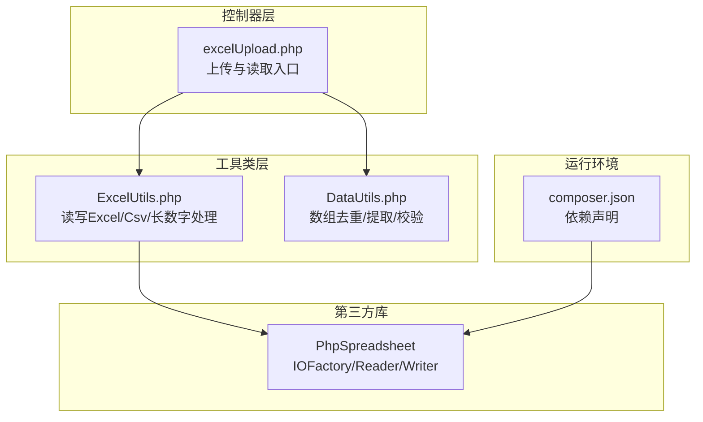
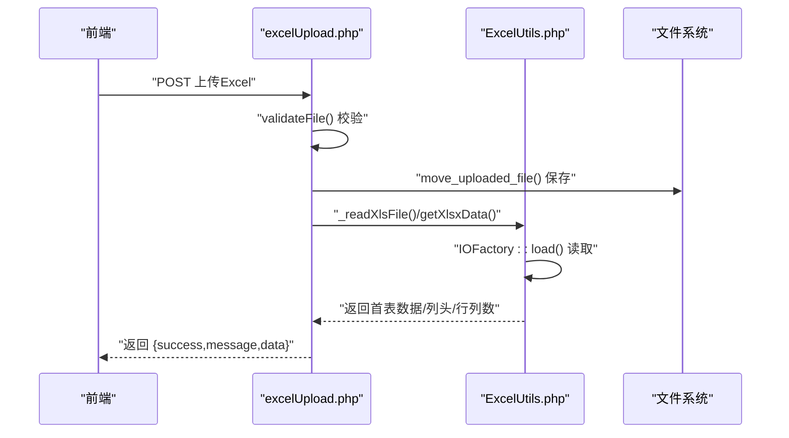
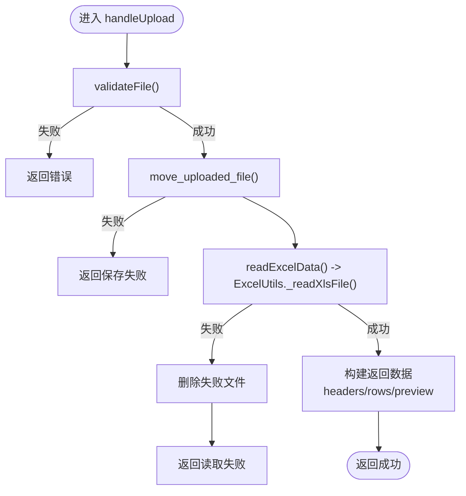
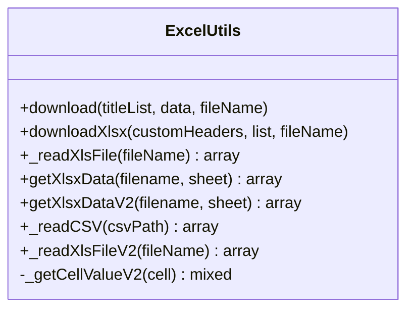
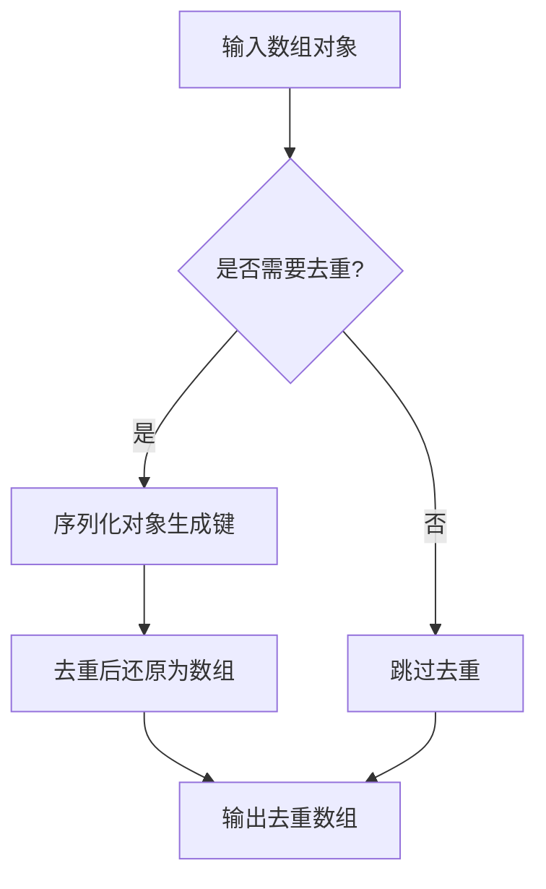

# 数据处理异常

<cite>
**本文引用的文件**
- [excelUpload.php](file://php/controller/excelUpload.php)
- [ExcelUtils.php](file://php/utils/ExcelUtils.php)
- [DataUtils.php](file://php/utils/DataUtils.php)
- [composer.json](file://composer.json)
- [README.md（PhpSpreadsheet）](file://vendor/phpoffice/phpspreadsheet/README.md)
- [CHANGELOG.md（PhpSpreadsheet）](file://vendor/phpoffice/phpspreadsheet/CHANGELOG.md)
</cite>

## 目录
1. [简介](#简介)
2. [项目结构](#项目结构)
3. [核心组件](#核心组件)
4. [架构总览](#架构总览)
5. [详细组件分析](#详细组件分析)
6. [依赖分析](#依赖分析)
7. [性能考虑](#性能考虑)
8. [故障排查指南](#故障排查指南)
9. [结论](#结论)
10. [附录](#附录)

## 简介
本指南聚焦于数据处理异常的排查与解决，围绕以下场景提供系统化方法论与实操建议：
- Excel 文件导入失败、数据格式不匹配、字段缺失
- 数据验证失败的排查步骤与清洗技巧
- 大数据量处理的内存管理与分批策略
- 数据编码问题、特殊字符处理、日期格式转换
- 数据导出异常的诊断与文件格式兼容性处理
- 数据完整性检查与重复数据处理最佳实践

## 项目结构
该项目采用 PHP 控制器 + 工具类的分层设计，Excel 导入由控制器负责文件校验与调用工具类读取，工具类基于 PhpSpreadsheet 实现读写能力；数据清洗与去重由通用工具类提供。

图表来源
- [excelUpload.php](file://php/controller/excelUpload.php#L1-L372)
- [ExcelUtils.php](file://php/utils/ExcelUtils.php#L1-L398)
- [DataUtils.php](file://php/utils/DataUtils.php#L1-L802)
- [composer.json](file://composer.json#L1-L11)

章节来源
- [excelUpload.php](file://php/controller/excelUpload.php#L1-L372)
- [ExcelUtils.php](file://php/utils/ExcelUtils.php#L1-L398)
- [DataUtils.php](file://php/utils/DataUtils.php#L1-L802)
- [composer.json](file://composer.json#L1-L11)

## 核心组件
- 上传与读取控制器：负责文件校验、移动、读取与返回结果，支持单文件与多文件批量处理。
- Excel 工具类：封装 PhpSpreadsheet 的读写、长数字处理、CSV 读取与编码处理。
- 数据工具类：提供数组对象去重、字段提取、重复检测等通用能力。

章节来源
- [excelUpload.php](file://php/controller/excelUpload.php#L11-L328)
- [ExcelUtils.php](file://php/utils/ExcelUtils.php#L20-L398)
- [DataUtils.php](file://php/utils/DataUtils.php#L7-L802)

## 架构总览
Excel 导入流程从 HTTP 请求进入，经控制器校验与调度，调用工具类读取 Excel 内容，再返回给前端或下游业务。

图表来源
- [excelUpload.php](file://php/controller/excelUpload.php#L35-L238)
- [ExcelUtils.php](file://php/utils/ExcelUtils.php#L147-L181)

章节来源
- [excelUpload.php](file://php/controller/excelUpload.php#L35-L238)
- [ExcelUtils.php](file://php/utils/ExcelUtils.php#L147-L181)

## 详细组件分析

### 组件A：Excel 上传与读取（控制器）
职责与要点
- 文件校验：上传错误码、大小限制、扩展名校验
- 文件保存：移动到目标目录
- 数据读取：调用工具类读取首表数据，支持是否包含表头、预览行数
- 错误处理：捕获异常并返回统一结构
- 批量处理：聚合多次上传结果

图表来源
- [excelUpload.php](file://php/controller/excelUpload.php#L35-L95)
- [excelUpload.php](file://php/controller/excelUpload.php#L102-L140)
- [excelUpload.php](file://php/controller/excelUpload.php#L148-L238)

章节来源
- [excelUpload.php](file://php/controller/excelUpload.php#L35-L95)
- [excelUpload.php](file://php/controller/excelUpload.php#L102-L140)
- [excelUpload.php](file://php/controller/excelUpload.php#L148-L238)

### 组件B：Excel/Csv 读取与长数字处理（工具类）
职责与要点
- 读取 Excel：通过 IOFactory 加载，遍历工作表与行列，构造关联数组
- 读取 CSV：设置输入编码与分隔符，逐行读取并合并为数组
- 长数字处理：针对数值型且长度超阈值的单元格，强制转为字符串，避免科学计数
- 富文本处理：富文本转纯文本
- 去除前后空格：统一清洗

图表来源
- [ExcelUtils.php](file://php/utils/ExcelUtils.php#L20-L398)

章节来源
- [ExcelUtils.php](file://php/utils/ExcelUtils.php#L147-L181)
- [ExcelUtils.php](file://php/utils/ExcelUtils.php#L246-L311)
- [ExcelUtils.php](file://php/utils/ExcelUtils.php#L315-L394)

### 组件C：数据清洗与重复处理（工具类）
职责与要点
- 数组对象去重：基于序列化键去重，保持唯一性
- 重复检测：判断是否存在重复对象
- 字段提取与重组：按指定字段集提取并生成新数组对象
- 其他：响应数据结构化提取、参数解析等

图表来源
- [DataUtils.php](file://php/utils/DataUtils.php#L283-L296)

章节来源
- [DataUtils.php](file://php/utils/DataUtils.php#L283-L317)
- [DataUtils.php](file://php/utils/DataUtils.php#L325-L335)

## 依赖分析
- 依赖关系：控制器依赖工具类；工具类依赖 PhpSpreadsheet；Composer 声明依赖版本。
- 版本特性：PhpSpreadsheet 在较新版本中增强了内存与速度优化、读取过滤、错误处理等能力。

图表来源
- [excelUpload.php](file://php/controller/excelUpload.php#L1-L6)
- [ExcelUtils.php](file://php/utils/ExcelUtils.php#L1-L15)
- [composer.json](file://composer.json#L1-L11)

章节来源
- [composer.json](file://composer.json#L1-L11)
- [README.md（PhpSpreadsheet）](file://vendor/phpoffice/phpspreadsheet/README.md#L1-L145)
- [CHANGELOG.md（PhpSpreadsheet）](file://vendor/phpoffice/phpspreadsheet/CHANGELOG.md#L1-L200)

## 性能考虑
- 大文件与大数据量
  - 使用 PhpSpreadsheet 的读取过滤与内存优化能力，避免一次性加载全部数据
  - 分批读取：按行或按块迭代，减少峰值内存占用
  - 长数字处理：在读取阶段即转为字符串，避免后续计算与格式化带来的额外开销
- 导出性能
  - 优先使用 Xlsx Writer，减少中间格式转换
  - 控制预览与导出行数，必要时开启流式写入（如适用）

章节来源
- [ExcelUtils.php](file://php/utils/ExcelUtils.php#L147-L181)
- [CHANGELOG.md（PhpSpreadsheet）](file://vendor/phpoffice/phpspreadsheet/CHANGELOG.md#L46-L47)

## 故障排查指南

### 一、Excel 导入失败
常见原因与定位步骤
- 上传错误码
  - 检查控制器中的上传错误映射，确认具体错误类型（大小、临时目录、扩展名等）
  - 参考：[excelUpload.php](file://php/controller/excelUpload.php#L106-L119)
- 文件保存失败
  - 确认上传目录权限与磁盘空间
  - 参考：[excelUpload.php](file://php/controller/excelUpload.php#L55-L61)
- Excel 读取失败
  - 检查文件是否为空或无数据行
  - 参考：[excelUpload.php](file://php/controller/excelUpload.php#L156-L181)
- 读取异常
  - 捕获异常并记录日志，返回统一错误结构
  - 参考：[excelUpload.php](file://php/controller/excelUpload.php#L227-L237)

解决方案
- 严格校验文件大小与扩展名
- 保证上传目录存在且可写
- 对空文件与空表进行前置判断

章节来源
- [excelUpload.php](file://php/controller/excelUpload.php#L102-L140)
- [excelUpload.php](file://php/controller/excelUpload.php#L148-L181)
- [excelUpload.php](file://php/controller/excelUpload.php#L227-L237)

### 二、数据格式不匹配
常见问题与定位步骤
- 长数字丢失精度
  - 检查单元格格式与数值长度，必要时强制文本格式
  - 参考：[ExcelUtils.php](file://php/utils/ExcelUtils.php#L375-L390)
- 富文本读取
  - 富文本需转为纯文本，避免渲染字符干扰
  - 参考：[ExcelUtils.php](file://php/utils/ExcelUtils.php#L370-L373)
- 编码与特殊字符
  - CSV 读取时设置输入编码，避免乱码
  - 参考：[ExcelUtils.php](file://php/utils/ExcelUtils.php#L250-L251)

解决方案
- 在读取阶段统一转为字符串或纯文本
- 明确输入编码，避免默认编码差异导致的乱码

章节来源
- [ExcelUtils.php](file://php/utils/ExcelUtils.php#L366-L394)
- [ExcelUtils.php](file://php/utils/ExcelUtils.php#L246-L311)

### 三、字段缺失与表头不一致
常见问题与定位步骤
- 表头缺失或为空
  - 读取首行作为表头，若为空则提示缺少表头
  - 参考：[excelUpload.php](file://php/controller/excelUpload.php#L190-L195)
- 是否包含表头由参数决定
  - hasHeader 参数控制起始行，避免误读
  - 参考：[excelUpload.php](file://php/controller/excelUpload.php#L198-L199)

解决方案
- 明确约定：是否包含表头，并在前端与后端保持一致
- 对空表头进行告警与回退处理

章节来源
- [excelUpload.php](file://php/controller/excelUpload.php#L190-L200)

### 四、数据验证失败的排查步骤
- 结构化提取
  - 使用工具类提供的字段提取与重组能力，快速定位缺失字段
  - 参考：[DataUtils.php](file://php/utils/DataUtils.php#L325-L335)
- 重复检测
  - 对关键字段组合进行去重，识别重复数据
  - 参考：[DataUtils.php](file://php/utils/DataUtils.php#L303-L317)

解决方案
- 在入库前执行字段校验与重复检测
- 对缺失字段进行补齐或报错提示

章节来源
- [DataUtils.php](file://php/utils/DataUtils.php#L303-L335)

### 五、大数据量处理的内存管理与分批策略
- 分批读取
  - 使用迭代器或分块读取，避免一次性加载全部数据
  - 参考：[CHANGELOG.md（PhpSpreadsheet）](file://vendor/phpoffice/phpspreadsheet/CHANGELOG.md#L46-L47)
- 长数字处理前置
  - 在读取阶段即转为字符串，降低后续处理成本
  - 参考：[ExcelUtils.php](file://php/utils/ExcelUtils.php#L375-L390)

章节来源
- [CHANGELOG.md（PhpSpreadsheet）](file://vendor/phpoffice/phpspreadsheet/CHANGELOG.md#L46-L47)
- [ExcelUtils.php](file://php/utils/ExcelUtils.php#L366-L394)

### 六、数据编码问题与特殊字符处理
- 输入编码
  - CSV 读取时显式设置编码，避免默认编码差异
  - 参考：[ExcelUtils.php](file://php/utils/ExcelUtils.php#L250-L251)
- 特殊字符
  - 富文本转纯文本，去除不可见字符
  - 参考：[ExcelUtils.php](file://php/utils/ExcelUtils.php#L370-L373)

章节来源
- [ExcelUtils.php](file://php/utils/ExcelUtils.php#L246-L311)
- [ExcelUtils.php](file://php/utils/ExcelUtils.php#L366-L394)

### 七、日期格式转换
- 日期读取
  - 使用 PhpSpreadsheet 的日期处理能力，避免手动格式转换
  - 参考：[README.md（PhpSpreadsheet）](file://vendor/phpoffice/phpspreadsheet/README.md#L106-L108)
- 日期格式掩码
  - 使用格式掩码工具进行统一展示
  - 参考：[README.md（PhpSpreadsheet）](file://vendor/phpoffice/phpspreadsheet/README.md#L33-L36)

章节来源
- [README.md（PhpSpreadsheet）](file://vendor/phpoffice/phpspreadsheet/README.md#L106-L108)
- [README.md（PhpSpreadsheet）](file://vendor/phpoffice/phpspreadsheet/README.md#L33-L36)

### 八、数据导出异常与格式兼容性
- 导出流程
  - 构建 Spreadsheet，设置表头与数据，选择合适 Writer（Xlsx/Xls）
  - 参考：[ExcelUtils.php](file://php/utils/ExcelUtils.php#L46-L86)
- 兼容性
  - Xlsx 更通用，Xls 用于兼容旧版软件
  - 参考：[ExcelUtils.php](file://php/utils/ExcelUtils.php#L83-L84)

章节来源
- [ExcelUtils.php](file://php/utils/ExcelUtils.php#L46-L86)
- [ExcelUtils.php](file://php/utils/ExcelUtils.php#L83-L84)

### 九、数据完整性检查与重复数据处理最佳实践
- 去重策略
  - 基于序列化键去重，保证对象级唯一
  - 参考：[DataUtils.php](file://php/utils/DataUtils.php#L283-L296)
- 重复检测
  - 快速判断是否存在重复，便于提前阻断
  - 参考：[DataUtils.php](file://php/utils/DataUtils.php#L303-L317)
- 字段提取
  - 仅保留必要字段，减少冗余与潜在不一致
  - 参考：[DataUtils.php](file://php/utils/DataUtils.php#L325-L335)

章节来源
- [DataUtils.php](file://php/utils/DataUtils.php#L283-L335)

## 结论
通过明确的上传校验、严格的读取与清洗策略、以及面向大数据量的分批与内存优化手段，可显著提升数据导入/导出的稳定性与一致性。结合工具类提供的去重与字段提取能力，可在入库前完成关键质量保障，降低下游处理风险。

## 附录
- 依赖版本参考：PhpSpreadsheet 1.29.x
  - 参考：[composer.json](file://composer.json#L8-L8)
  - 更新日志与优化点：[CHANGELOG.md（PhpSpreadsheet）](file://vendor/phpoffice/phpspreadsheet/CHANGELOG.md#L1-L200)