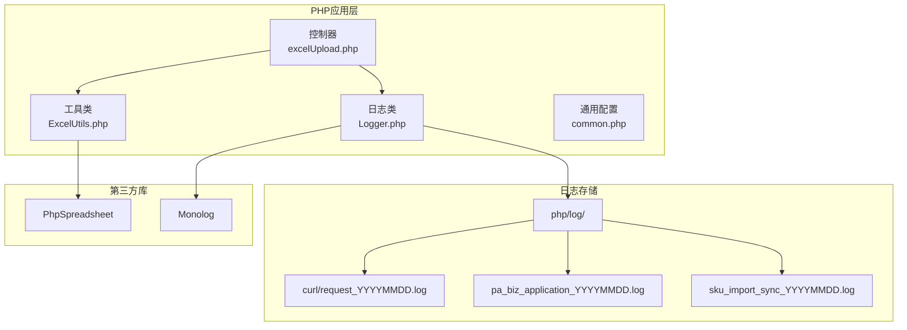
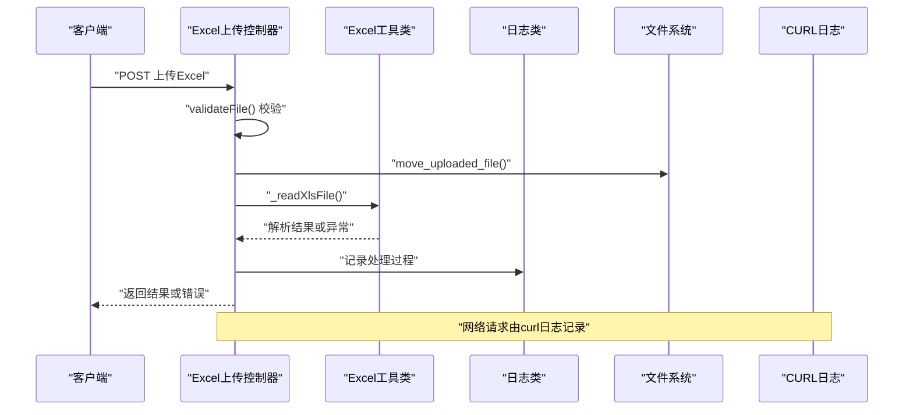
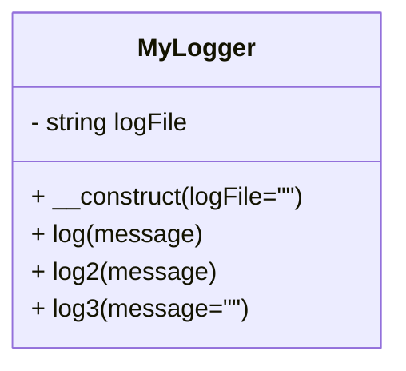
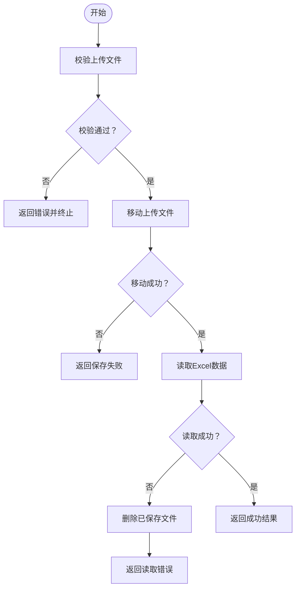
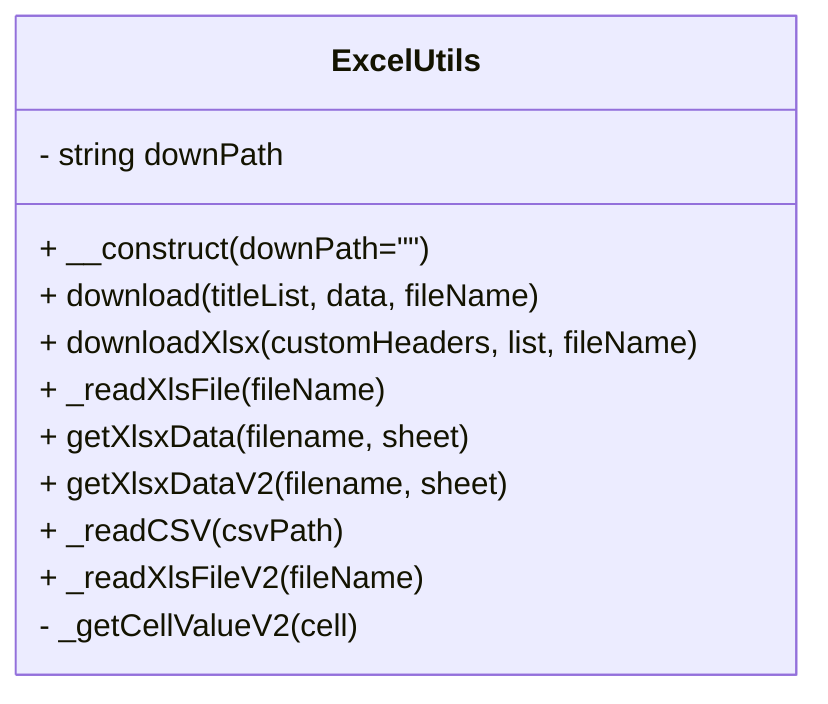
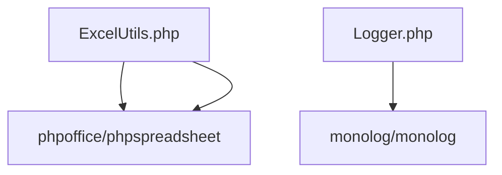

# 系统错误诊断

<cite>
**本文档引用的文件**
- [Logger.php](file://php/class/Logger.php)
- [common.php](file://php/common.php)
- [excelUpload.php](file://php/controller/excelUpload.php)
- [ExcelUtils.php](file://php/utils/ExcelUtils.php)
- [request_20260213.log](file://php/log/curl/request_20260213.log)
- [sku_import_sync_20260213.log](file://php/log/sku_import_sync_20260213.log)
- [pa_biz_application_20260213.log](file://php/log/pa_biz_application_20260213.log)
- [composer.json](file://composer.json)
</cite>

## 目录
1. [简介](#简介)
2. [项目结构](#项目结构)
3. [核心组件](#核心组件)
4. [架构总览](#架构总览)
5. [详细组件分析](#详细组件分析)
6. [依赖关系分析](#依赖关系分析)
7. [性能考虑](#性能考虑)
8. [故障排除指南](#故障排除指南)
9. [结论](#结论)

## 简介
本指南面向系统运维与开发人员，提供针对该PHP系统的系统性错误诊断方法与实践流程。内容涵盖：
- 错误日志分析：日志文件组织结构、命名规则、默认日志与业务日志区分
- 错误级别识别与堆栈跟踪分析
- 常见运行时错误定位与处置：内存溢出、超时、文件权限、网络请求失败
- 具体错误类型排查：数据库连接错误、文件上传失败、Excel处理异常
- 错误代码对照与快速解决方案
- 实战案例：基于现有日志文件的诊断示例

## 项目结构
系统采用“控制器-工具类-日志-资源”分层组织，关键目录与职责如下：
- php/class：日志与通用类（如MyLogger）
- php/controller：业务控制器（如Excel上传、SKU同步）
- php/utils：工具类（如Excel解析、数据处理）
- php/log：日志输出目录（按日期与模块命名）
- php/export：导出资源与示例文件
- composer.json：依赖管理（含PhpSpreadsheet、Monolog等）

**图表来源**
- [excelUpload.php](file://php/controller/excelUpload.php#L1-L372)
- [ExcelUtils.php](file://php/utils/ExcelUtils.php#L1-L398)
- [Logger.php](file://php/class/Logger.php#L1-L55)
- [composer.json](file://composer.json#L1-L11)

**章节来源**
- [excelUpload.php](file://php/controller/excelUpload.php#L1-L372)
- [ExcelUtils.php](file://php/utils/ExcelUtils.php#L1-L398)
- [Logger.php](file://php/class/Logger.php#L1-L55)
- [composer.json](file://composer.json#L1-L11)

## 核心组件
- 日志类（MyLogger）：负责将消息写入按日期命名的日志文件，并同时写入PHP错误日志，便于统一收集与检索。
- Excel上传控制器：封装文件验证、移动、读取与错误回滚逻辑，支持单文件与多文件批量处理。
- Excel工具类：基于PhpSpreadsheet实现Excel/XLS/CVS读取与导出，具备长数字保护与单元格格式处理能力。
- 通用配置：设置跨域与字符集，保证接口兼容性。

**章节来源**
- [Logger.php](file://php/class/Logger.php#L1-L55)
- [excelUpload.php](file://php/controller/excelUpload.php#L1-L372)
- [ExcelUtils.php](file://php/utils/ExcelUtils.php#L1-L398)
- [common.php](file://php/common.php#L1-L9)

## 架构总览
系统通过控制器接收请求，调用工具类进行数据处理，期间通过日志类记录关键事件与错误。网络请求由curl日志记录，便于追踪上游服务交互。

**图表来源**
- [excelUpload.php](file://php/controller/excelUpload.php#L35-L95)
- [ExcelUtils.php](file://php/utils/ExcelUtils.php#L147-L181)
- [Logger.php](file://php/class/Logger.php#L22-L25)

## 详细组件分析

### 组件A：日志系统（MyLogger）
- 功能要点
  - 默认日志文件按日期命名，默认路径为php/log/default/YYYYMMDD.log
  - 支持自定义日志文件名，按模块命名（如php/log/{name}_YYYYMMDD.log）
  - 写入方式：追加写入；同时调用PHP内置错误日志函数，便于集中采集
- 适用场景
  - 业务流程日志
  - 错误事件记录
  - 调试与审计

**图表来源**
- [Logger.php](file://php/class/Logger.php#L14-L54)

**章节来源**
- [Logger.php](file://php/class/Logger.php#L14-L54)

### 组件B：Excel上传控制器（excelUpload）
- 功能要点
  - 文件校验：错误码映射、大小限制、扩展名校验
  - 文件移动：上传后重命名并移动至上传目录
  - 数据读取：委托Excel工具类解析Excel
  - 错误回滚：读取失败自动删除已保存文件
  - 批量处理：支持多文件上传统计汇总
- 常见错误类型
  - 上传错误码（如无文件、部分上传、无临时目录、写入失败）
  - 文件过大、扩展名不被允许
  - Excel解析失败（空文件、无数据、解析异常）

**图表来源**
- [excelUpload.php](file://php/controller/excelUpload.php#L35-L95)
- [excelUpload.php](file://php/controller/excelUpload.php#L102-L140)
- [excelUpload.php](file://php/controller/excelUpload.php#L148-L238)

**章节来源**
- [excelUpload.php](file://php/controller/excelUpload.php#L17-L95)
- [excelUpload.php](file://php/controller/excelUpload.php#L102-L140)
- [excelUpload.php](file://php/controller/excelUpload.php#L148-L238)

### 组件C：Excel工具类（ExcelUtils）
- 功能要点
  - 读取XLS/XLSX：基于PhpSpreadsheet，逐表读取并返回关联数组
  - 读取CSV：支持UTF-8编码与特定列文本格式处理
  - 导出：支持XLS与XLSX导出，设置表头与数据行
  - 长数字保护：检测数值长度并转换为字符串，避免科学计数法丢失精度
- 性能与内存
  - 使用PhpSpreadsheet，具备较好的内存管理能力
  - 大文件建议分批处理或流式读取策略

**图表来源**
- [ExcelUtils.php](file://php/utils/ExcelUtils.php#L20-L398)

**章节来源**
- [ExcelUtils.php](file://php/utils/ExcelUtils.php#L147-L181)
- [ExcelUtils.php](file://php/utils/ExcelUtils.php#L246-L311)
- [ExcelUtils.php](file://php/utils/ExcelUtils.php#L315-L394)

### 组件D：业务日志与CURL日志
- 业务日志（业务应用）
  - 示例：sku_import_sync_YYYYMMDD.log 记录SKU同步流程、查询与写入步骤
  - 特点：结构化时间戳、模块标识、请求参数、查询结果数量、删除/创建记录明细
- CURL日志
  - 示例：curl/request_YYYYMMDD.log 记录HTTP请求（GET/POST/DELETE）、目标地址、参数
  - 特点：便于定位上游服务调用链路与状态码异常

**图表来源**
- [sku_import_sync_20260213.log](file://php/log/sku_import_sync_20260213.log#L1-L200)
- [request_20260213.log](file://php/log/curl/request_20260213.log#L1-L100)

**章节来源**
- [sku_import_sync_20260213.log](file://php/log/sku_import_sync_20260213.log#L1-L200)
- [request_20260213.log](file://php/log/curl/request_20260213.log#L1-L100)

## 依赖关系分析
- 第三方库
  - PhpSpreadsheet：Excel/CSV读写
  - Monolog：日志记录（注释中保留了使用示例）
- 运行时扩展
  - ext-redis、ext-json：系统依赖

**图表来源**
- [ExcelUtils.php](file://php/utils/ExcelUtils.php#L4-L14)
- [Logger.php](file://php/class/Logger.php#L4-L6)
- [composer.json](file://composer.json#L2-L9)

**章节来源**
- [composer.json](file://composer.json#L1-L11)

## 性能考虑
- Excel处理
  - 使用PhpSpreadsheet进行读写，建议对大文件采用分页读取或流式处理
  - 长数字保护避免精度丢失，但需注意字符串化带来的内存与计算成本
- 日志写入
  - 追加写入与错误日志同步写入，建议在高并发下评估磁盘I/O瓶颈
- 网络请求
  - curl日志有助于发现上游服务延迟与失败，建议结合监控指标进行容量规划

## 故障排除指南

### 一、日志文件组织与命名规则
- 默认日志
  - 路径：php/log/default/YYMMDD.log
  - 用途：通用业务与调试信息
- 业务日志
  - 命名：模块名_YYYYMMDD.log（如sku_import_sync_YYYYMMDD.log、pa_biz_application_YYYYMMDD.log）
  - 用途：记录业务流程与关键步骤
- CURL日志
  - 命名：curl/request_YYYYMMDD.log
  - 用途：记录HTTP请求与参数，便于定位上游服务问题

**章节来源**
- [Logger.php](file://php/class/Logger.php#L17-L20)
- [sku_import_sync_20260213.log](file://php/log/sku_import_sync_20260213.log#L1-L20)
- [pa_biz_application_20260213.log](file://php/log/pa_biz_application_20260213.log#L1-L20)
- [request_20260213.log](file://php/log/curl/request_20260213.log#L1-L20)

### 二、错误级别识别与堆栈跟踪
- 错误级别
  - 业务错误：通过业务日志与控制器返回消息体现（如“文件保存失败”、“无法读取Excel文件内容”）
  - 上传错误：通过PHP上传错误码映射（UPLOAD_ERR_*），用于快速定位
  - 网络错误：通过curl日志查看请求失败、超时、状态码异常
- 堆栈跟踪
  - 控制器与工具类均使用try-catch捕获异常并返回结构化错误信息
  - 建议在生产环境开启错误日志与异常捕获，结合curl日志进行端到端追踪

**章节来源**
- [excelUpload.php](file://php/controller/excelUpload.php#L105-L119)
- [excelUpload.php](file://php/controller/excelUpload.php#L88-L94)
- [ExcelUtils.php](file://php/utils/ExcelUtils.php#L227-L237)

### 三、常见运行时错误诊断步骤

#### 1) 内存溢出
- 症状
  - 处理大Excel文件时报错或进程退出
- 诊断
  - 查看业务日志是否出现“无法读取Excel文件内容”或“读取Excel文件时发生错误”
  - 检查curl日志是否存在大量请求导致的资源紧张
- 处置
  - 优化Excel读取策略（分页/流式）
  - 增加PHP内存限制（谨慎）
  - 分批处理与异步队列

**章节来源**
- [ExcelUtils.php](file://php/utils/ExcelUtils.php#L147-L181)

#### 2) 超时错误
- 症状
  - curl日志显示请求超时或上游服务响应慢
- 诊断
  - 在curl日志中定位超时请求的时间窗口与目标地址
  - 结合业务日志确认触发条件（如SKU同步）
- 处置
  - 调整超时阈值与重试策略
  - 上游服务扩容或优化

**章节来源**
- [request_20260213.log](file://php/log/curl/request_20260213.log#L1-L100)

#### 3) 文件权限问题
- 症状
  - “文件保存失败”或“文件写入失败”
- 诊断
  - 上传控制器返回“文件保存失败”，检查上传目录权限
  - 确认上传目录存在且可写
- 处置
  - 修改上传目录权限（如0777）
  - 确保PHP运行用户对目标目录有写权限

**章节来源**
- [excelUpload.php](file://php/controller/excelUpload.php#L55-L61)
- [excelUpload.php](file://php/controller/excelUpload.php#L24-L26)

#### 4) 数据库连接错误
- 症状
  - 业务日志中出现“查询结果数量: 0”或“未查询到数据”，但上游服务正常
  - 若涉及数据库读写，通常会在控制器或工具类中抛出异常
- 诊断
  - 检查curl日志中对应查询接口的状态码与响应
  - 确认上游服务可用性与认证配置
- 处置
  - 检查上游服务配置与网络连通性
  - 增加重试与降级策略

**章节来源**
- [sku_import_sync_20260213.log](file://php/log/sku_import_sync_20260213.log#L20-L44)

#### 5) 文件上传失败
- 症状
  - 上传错误码提示（如无文件、部分上传、写入失败）
  - 控制器返回“文件保存失败”或“读取Excel文件时发生错误”
- 诊断
  - 校验上传错误码映射
  - 检查文件大小与扩展名限制
  - 确认上传目录存在且可写
- 处置
  - 调整max_file_size与允许扩展名
  - 修复目录权限

**章节来源**
- [excelUpload.php](file://php/controller/excelUpload.php#L105-L119)
- [excelUpload.php](file://php/controller/excelUpload.php#L122-L137)
- [excelUpload.php](file://php/controller/excelUpload.php#L55-L61)

#### 6) Excel处理异常
- 症状
  - “无法读取Excel文件内容”或“Excel文件中没有数据”
  - 长数字被转换为科学计数法导致精度丢失
- 诊断
  - 检查Excel工具类的读取逻辑与长数字保护
  - 确认Excel版本与格式兼容性
- 处置
  - 使用Excel工具类的长数字保护方法
  - 转换为文本格式或调整列格式

**章节来源**
- [ExcelUtils.php](file://php/utils/ExcelUtils.php#L150-L181)
- [ExcelUtils.php](file://php/utils/ExcelUtils.php#L366-L394)

### 四、错误代码对照与快速解决方案

- 上传错误码（UPLOAD_ERR_*）
  - 上传成功：UPLOAD_ERR_OK
  - 文件大小超过ini限制：UPLOAD_ERR_INI_SIZE
  - 文件大小超过表单限制：UPLOAD_ERR_FORM_SIZE
  - 文件只有部分被上传：UPLOAD_ERR_PARTIAL
  - 没有文件被上传：UPLOAD_ERR_NO_FILE
  - 找不到临时文件夹：UPLOAD_ERR_NO_TMP_DIR
  - 文件写入失败：UPLOAD_ERR_CANT_WRITE
  - 文件上传被扩展程序中断：UPLOAD_ERR_EXTENSION
- 快速解决方案
  - 调整php.ini中的upload_max_filesize/post_max_size
  - 检查临时目录权限与空间
  - 确认表单字段与文件域命名一致

**章节来源**
- [excelUpload.php](file://php/controller/excelUpload.php#L105-L119)

### 五、实战案例：基于现有日志的诊断

- 案例1：SKU同步流程
  - 现象：业务日志显示多次“无数据”与“同步完成（无数据）”
  - 定位：curl日志中对应查询接口返回0条结果
  - 处置：核对上游查询条件与目标环境配置，确认数据源状态

- 案例2：Excel上传失败
  - 现象：控制器返回“文件保存失败”
  - 定位：检查上传目录是否存在与权限
  - 处置：创建目录并赋予写权限

**章节来源**
- [sku_import_sync_20260213.log](file://php/log/sku_import_sync_20260213.log#L1-L200)
- [request_20260213.log](file://php/log/curl/request_20260213.log#L1-L100)
- [excelUpload.php](file://php/controller/excelUpload.php#L24-L26)
- [excelUpload.php](file://php/controller/excelUpload.php#L55-L61)

## 结论
通过规范化的日志组织、明确的错误码映射与完善的工具链（Excel处理、日志记录、curl追踪），本系统能够高效定位与解决常见运行时错误。建议在生产环境中：
- 统一日志命名与落盘策略
- 对大文件与高并发场景进行性能优化
- 建立端到端的监控与告警机制，结合curl日志进行全链路追踪