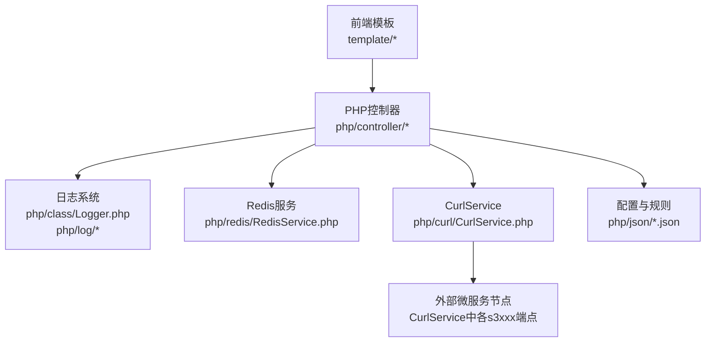
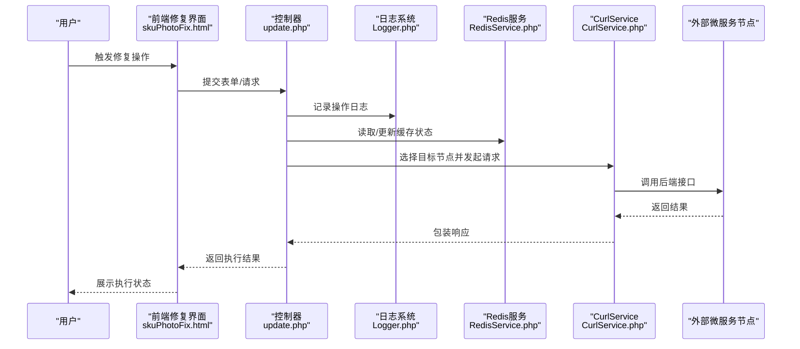
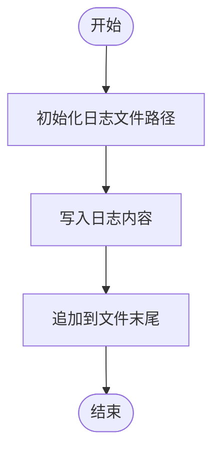
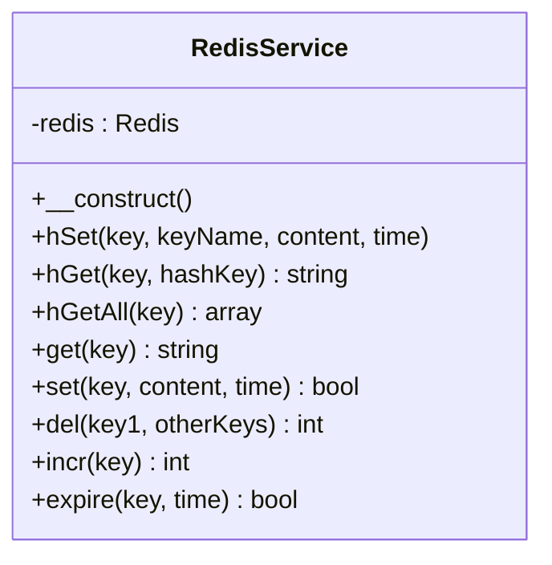
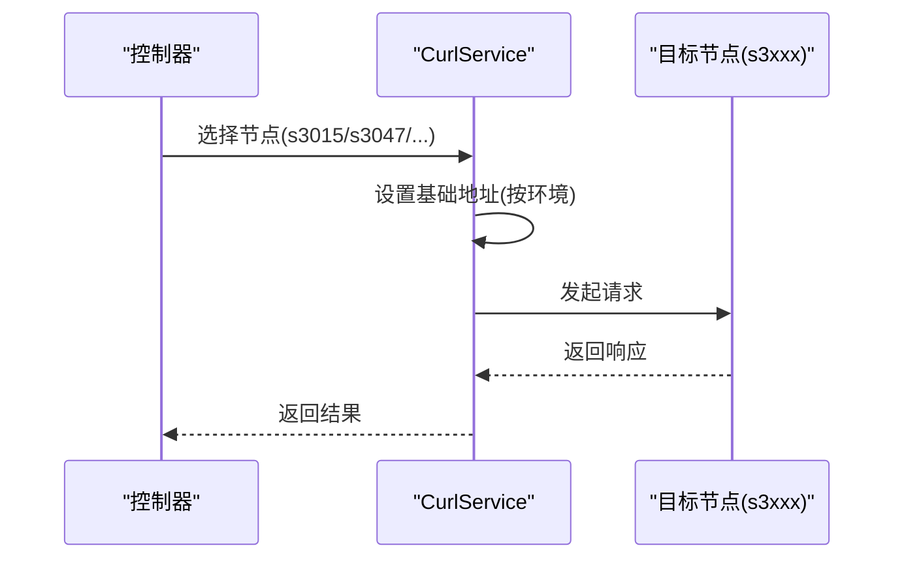
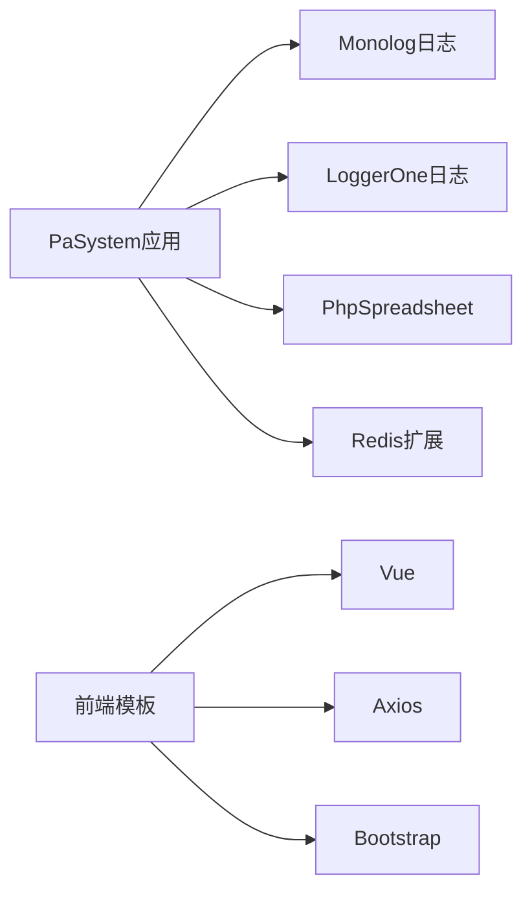
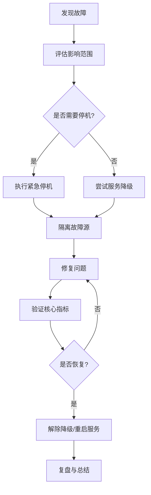

# 紧急情况处理

<cite>
**本文引用的文件**
- [composer.json](file://composer.json)
- [common.php](file://php/common.php)
- [Logger.php](file://php/class/Logger.php)
- [RedisService.php](file://php/redis/RedisService.php)
- [CurlService.php](file://php/curl/CurlService.php)
- [config.json](file://php/json/config.json)
- [dev_bak.js](file://php/json/dev_bak.js)
- [update.php](file://php/controller/update.php)
- [skuPhotoFix.html](file://template/fix/skuPhotoFix.html)
- [home.html](file://template/home.html)
- [package-lock.json](file://template/package-lock.json)
</cite>

## 目录
1. [简介](#简介)
2. [项目结构](#项目结构)
3. [核心组件](#核心组件)
4. [架构总览](#架构总览)
5. [详细组件分析](#详细组件分析)
6. [依赖关系分析](#依赖关系分析)
7. [性能考量](#性能考量)
8. [故障排查指南](#故障排查指南)
9. [结论](#结论)
10. [附录](#附录)

## 简介
本指南面向PaSystem在发生系统故障、数据异常、安全事件或平台级中断时的应急响应与恢复工作，覆盖服务降级、数据回滚、系统恢复、紧急停机与重启、备份与恢复策略、灾难恢复与业务连续性保障、紧急联系与升级流程、安全事件处置与漏洞修复、监控告警响应与自动化恢复建议等内容。文档以仓库现有实现为依据，结合可操作的流程与图示，帮助非技术读者也能快速理解并执行关键步骤。

## 项目结构
PaSystem由前端模板、PHP后端控制器与服务、日志与缓存、以及外部组件对接构成。关键应急相关能力分布如下：
- 日志与监控：统一日志类与多类日志文件，便于故障定位与审计
- 缓存与会话：基于Redis的服务封装，支持键值与哈希读写、过期控制
- 外部服务对接：通过CurlService集中管理多个后端微服务节点的访问
- 配置与规则：JSON配置文件承载广告投放与匹配规则等关键策略
- 前端修复工具：提供SKU图片修复等在线修复界面，便于快速处置业务异常

图表来源
- [home.html](file://template/home.html#L1-L39)
- [update.php](file://php/controller/update.php#L500-L508)
- [Logger.php](file://php/class/Logger.php#L14-L55)
- [RedisService.php](file://php/redis/RedisService.php#L7-L77)
- [CurlService.php](file://php/curl/CurlService.php#L145-L638)
- [config.json](file://php/json/config.json#L1-L316)

章节来源
- [composer.json](file://composer.json#L1-L11)
- [common.php](file://php/common.php#L1-L9)
- [Logger.php](file://php/class/Logger.php#L14-L55)
- [RedisService.php](file://php/redis/RedisService.php#L7-L77)
- [CurlService.php](file://php/curl/CurlService.php#L145-L638)
- [config.json](file://php/json/config.json#L1-L316)
- [dev_bak.js](file://php/json/dev_bak.js#L1-L40)
- [update.php](file://php/controller/update.php#L500-L508)
- [skuPhotoFix.html](file://template/fix/skuPhotoFix.html#L305-L341)
- [home.html](file://template/home.html#L1-L39)
- [package-lock.json](file://template/package-lock.json#L2675-L2710)

## 核心组件
- 日志系统：提供基础文件日志写入能力，便于在紧急情况下快速定位问题
- Redis服务：提供键值与哈希读写、过期控制等常用操作，支撑缓存与会话
- CurlService：集中管理多后端节点的访问，便于在节点故障时进行切换与降级
- 配置与规则：JSON配置文件承载关键业务规则，便于在紧急时进行快速调整
- 前端修复工具：提供在线修复界面，便于快速处置业务异常

章节来源
- [Logger.php](file://php/class/Logger.php#L14-L55)
- [RedisService.php](file://php/redis/RedisService.php#L7-L77)
- [CurlService.php](file://php/curl/CurlService.php#L145-L638)
- [config.json](file://php/json/config.json#L1-L316)
- [skuPhotoFix.html](file://template/fix/skuPhotoFix.html#L305-L341)

## 架构总览
下图展示了紧急响应中的关键交互：前端触发修复请求，控制器接收并调用日志、Redis与CurlService，最终对外部微服务发起请求；同时日志与Redis用于记录与缓存关键状态。

图表来源
- [skuPhotoFix.html](file://template/fix/skuPhotoFix.html#L305-L341)
- [update.php](file://php/controller/update.php#L500-L508)
- [Logger.php](file://php/class/Logger.php#L22-L25)
- [RedisService.php](file://php/redis/RedisService.php#L29-L46)
- [CurlService.php](file://php/curl/CurlService.php#L145-L200)

## 详细组件分析

### 日志系统（MyLogger）
- 功能要点
  - 默认按日期生成日志文件，便于按天归档与检索
  - 支持基础文本追加写入与错误日志输出
  - 提供多种日志写入方式，便于在不同场景下启用
- 应急用途
  - 故障定位：通过日志文件快速定位异常时间点与调用链
  - 审计追踪：记录关键操作与变更，便于事后复盘
- 使用建议
  - 在紧急操作前后均写入明确的开始/结束标记
  - 对高风险操作增加独立日志文件，避免被覆盖

图表来源
- [Logger.php](file://php/class/Logger.php#L17-L25)

章节来源
- [Logger.php](file://php/class/Logger.php#L14-L55)

### Redis服务（RedisService）
- 功能要点
  - 连接本地Redis，支持哈希与字符串读写
  - 提供过期控制与键删除，便于缓存清理与状态管理
- 应急用途
  - 服务降级：在上游节点不可用时，通过Redis存储降级开关与临时状态
  - 快速回滚：利用Redis快速清空或更新缓存，降低影响范围
- 使用建议
  - 为关键状态设置合理过期时间，避免长期占用
  - 对敏感键采用命名规范，便于识别与清理

图表来源
- [RedisService.php](file://php/redis/RedisService.php#L7-L77)

章节来源
- [RedisService.php](file://php/redis/RedisService.php#L7-L77)

### CurlService（外部服务对接）
- 功能要点
  - 统一管理多个后端节点（如s3015、s3047、s3044等），支持按环境切换
  - 提供便捷的方法链设置目标节点与基础地址
- 应急用途
  - 服务降级：在节点故障时快速切换至备用节点或降级接口
  - 快速恢复：通过节点切换与重试策略恢复服务可用性
- 使用建议
  - 在紧急预案中预置备用节点列表
  - 对关键请求增加超时与重试参数

图表来源
- [CurlService.php](file://php/curl/CurlService.php#L145-L200)
- [CurlService.php](file://php/curl/CurlService.php#L605-L638)

章节来源
- [CurlService.php](file://php/curl/CurlService.php#L145-L638)

### 配置与规则（config.json）
- 功能要点
  - 承载广告投放渠道、匹配模型与竞价策略等关键规则
  - 可用于在紧急时快速调整策略参数，降低业务损失
- 应急用途
  - 快速降级：临时关闭或调整高风险策略
  - 回滚策略：在变更后出现异常时，快速恢复到上一版本配置
- 使用建议
  - 对配置文件进行版本化管理与审批流程
  - 在变更前备份当前配置

章节来源
- [config.json](file://php/json/config.json#L1-L316)

### 前端修复工具（skuPhotoFix.html）
- 功能要点
  - 提供在线修复界面，支持提交请求并展示执行结果
  - 与后端控制器配合，实现快速处置业务异常
- 应急用途
  - 快速止损：在业务异常时，通过前端工具快速执行修复脚本
  - 降低影响：减少人工介入与跨系统协作成本
- 使用建议
  - 对修复操作增加二次确认与权限校验
  - 将修复过程记录到日志，便于审计

章节来源
- [skuPhotoFix.html](file://template/fix/skuPhotoFix.html#L305-L341)

## 依赖关系分析
- 外部依赖
  - 日志：引入Monolog与LoggerOne，便于扩展更丰富的日志能力
  - 电子表格：引入PhpSpreadsheet，支持数据导入导出
  - Redis：通过扩展提供高性能缓存能力
- 前端依赖
  - Vue与Axios用于构建交互式修复界面
  - Bootstrap与字体图标提升用户体验

图表来源
- [composer.json](file://composer.json#L2-L9)
- [package-lock.json](file://template/package-lock.json#L2675-L2710)

章节来源
- [composer.json](file://composer.json#L1-L11)
- [package-lock.json](file://template/package-lock.json#L2675-L2710)

## 性能考量
- 日志写入
  - 建议在紧急高并发场景下，优先使用异步写入或批量写入，避免阻塞主流程
- Redis操作
  - 对热点键设置合理过期时间，避免内存膨胀
  - 使用管道或批处理减少网络往返
- CurlService
  - 对关键请求设置超时与重试，避免长时间阻塞
  - 在节点故障时快速切换至备用节点

## 故障排查指南

### 通用应急流程
- 现场评估
  - 判断故障范围与影响面，确定是否需要紧急停机
  - 启动应急小组，明确职责分工
- 服务降级
  - 通过Redis设置降级开关，屏蔽高风险功能
  - 切换CurlService至备用节点，确保核心链路可用
- 数据回滚
  - 基于日志定位异常时间点，回溯关键操作
  - 对受影响的数据进行回滚或补偿
- 系统恢复
  - 修复问题后，逐步解除降级开关
  - 验证核心指标（响应时间、错误率、吞吐量）恢复正常
- 紧急停机与重启
  - 停机：停止新请求进入，等待正在处理的任务完成后关闭
  - 重启：先启动依赖组件（Redis、数据库），再启动应用服务

### 备份与恢复策略
- 数据备份
  - Redis：定期导出RDB快照，保留最近N次备份
  - 日志：按天归档，保留至少7天，重要事件保留更久
- 配置备份
  - 配置文件版本化管理，变更前自动备份
- 日志备份
  - 建立日志归档目录，按日期分桶存放
- 恢复步骤
  - Redis：从最近一次有效备份恢复，核对键空间一致性
  - 日志：按日期恢复到指定时间点，交叉验证关键事件
  - 配置：回滚到上一版本，验证策略生效

### 灾难恢复与业务连续性
- 灾备节点
  - 准备备用节点，与主节点保持同步
- 业务连续性
  - 通过降级开关与备用节点，确保核心业务可用
- 人员与沟通
  - 明确紧急联系人与升级路径，建立24小时值班机制

### 安全事件应急与漏洞修复
- 应急处置
  - 立即隔离受影响的系统或模块
  - 通过日志定位攻击入口与影响范围
  - 修复漏洞并重新部署
- 漏洞修复流程
  - 评估风险等级，制定修复计划
  - 在测试环境验证修复方案
  - 分批次灰度发布，观察指标变化

### 监控告警与自动化恢复
- 告警响应
  - 建立分级告警机制，明确响应时限
  - 自动化脚本在阈值触发时执行降级或切换
- 自动化恢复
  - 通过CurlService与Redis实现节点切换与状态恢复
  - 对关键任务增加健康检查与自动重启

章节来源
- [Logger.php](file://php/class/Logger.php#L22-L25)
- [RedisService.php](file://php/redis/RedisService.php#L29-L46)
- [CurlService.php](file://php/curl/CurlService.php#L605-L638)
- [config.json](file://php/json/config.json#L1-L316)

## 结论
本指南基于PaSystem现有实现，提供了从日志、缓存、外部服务对接到前端修复工具的应急响应路径。建议在实际运行中进一步完善自动化脚本、灾备演练与人员培训，确保在真实紧急情况下能够快速、稳定地恢复业务。

## 附录

### 紧急联系与升级流程
- 一线支持：负责初步诊断与紧急处置
- 二线专家：负责复杂问题分析与修复
- 三线架构师：负责系统级优化与灾备策略
- 升级路径：从一线到三线逐级升级，确保问题在最短时间内得到解决

### 常用操作参考
- 日志查看：定位异常时间点与调用栈
- Redis状态：检查降级开关与缓存命中率
- CurlService节点：切换备用节点，验证可用性
- 配置回滚：恢复上一版本配置，验证策略生效