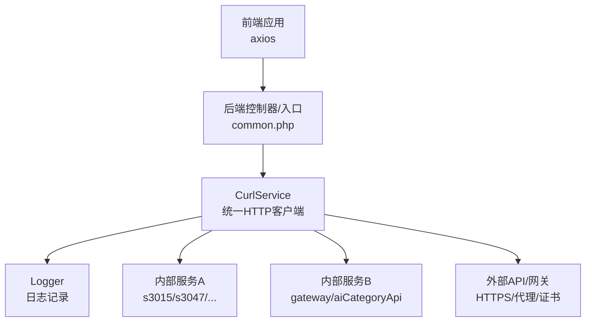
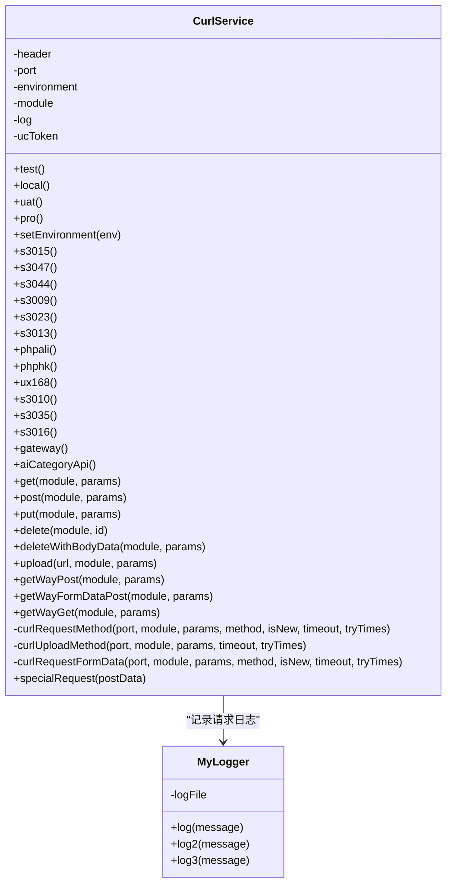
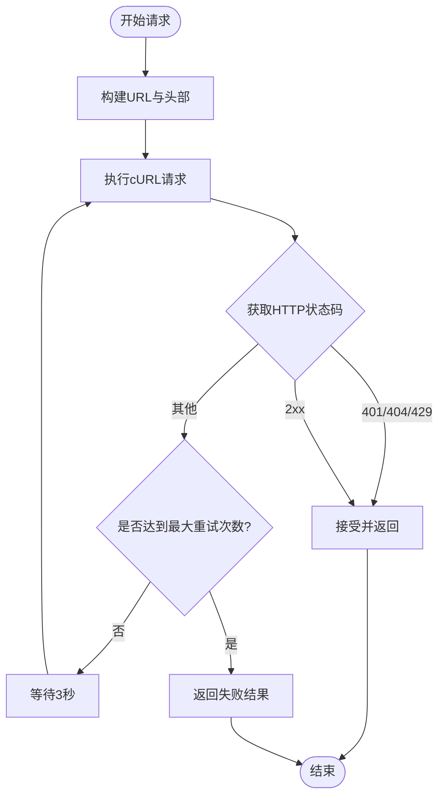
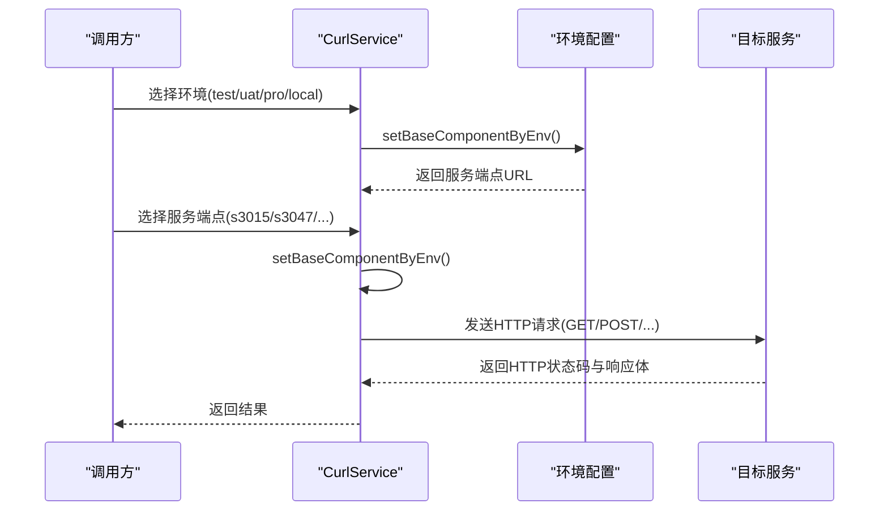
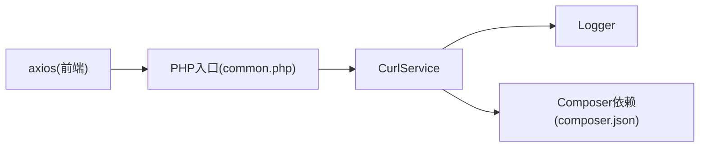

# 网络连接问题

<cite>
**本文档引用的文件**
- [CurlService.php](file://php/curl/CurlService.php)
- [Logger.php](file://php/class/Logger.php)
- [common.php](file://php/common.php)
- [composer.json](file://composer.json)
- [request_20260227.log](file://php/log/curl/request_20260227.log)
- [dev_bak.js](file://php/json/dev_bak.js)
</cite>

## 目录
1. [简介](#简介)
2. [项目结构](#项目结构)
3. [核心组件](#核心组件)
4. [架构总览](#架构总览)
5. [详细组件分析](#详细组件分析)
6. [依赖关系分析](#依赖关系分析)
7. [性能考虑](#性能考虑)
8. [故障排查指南](#故障排查指南)
9. [结论](#结论)
10. [附录](#附录)

## 简介
本指南聚焦于该代码库中的网络连接问题排查，围绕 HTTP 请求失败、API 调用超时、网络连接中断等常见问题，结合 CurlService 的实现细节，提供可操作的诊断步骤、错误处理机制与重试策略配置说明，并覆盖不同环境下的网络配置差异、代理与 SSL 证书验证、DNS 解析问题、网络延迟监控与连接池管理最佳实践，以及防火墙与安全策略对系统访问的影响分析。

## 项目结构
与网络连接相关的核心代码集中在 PHP 层的 CurlService 与日志系统中，前端通过 axios 发起请求，后端通过 CurlService 统一访问内部微服务与外部网关。关键文件包括：
- CurlService：封装 cURL 请求、环境切换、头部设置、超时与重试、SSL 配置、日志记录
- Logger：统一日志输出，便于定位网络问题
- common.php：跨域与基础响应头设置
- composer.json：依赖管理，包含日志与工具库
- 日志文件：curl 请求日志，记录请求 URL、参数与响应状态
- dev_bak.js：前端开发期的 API 地址与密钥配置示例

图表来源
- [CurlService.php](file://php/curl/CurlService.php#L1-L996)
- [Logger.php](file://php/class/Logger.php#L1-L55)
- [common.php](file://php/common.php#L1-L9)

章节来源
- [CurlService.php](file://php/curl/CurlService.php#L1-L996)
- [Logger.php](file://php/class/Logger.php#L1-L55)
- [common.php](file://php/common.php#L1-L9)

## 核心组件
- CurlService：提供多模块、多环境的 HTTP 客户端能力，支持 GET/POST/PUT/DELETE/UPLOAD 等方法，内置超时控制与有限次重试，支持 form-data 上传与特殊请求场景。
- Logger：统一记录请求日志，便于问题追踪与性能分析。
- common.php：设置跨域与通用响应头，确保前后端交互顺畅。
- composer.json：声明日志与工具库依赖，支撑日志与第三方工具集成。
- 日志文件：curl 请求日志，记录请求 URL、参数与响应状态码，辅助定位网络问题。

章节来源
- [CurlService.php](file://php/curl/CurlService.php#L294-L987)
- [Logger.php](file://php/class/Logger.php#L14-L55)
- [common.php](file://php/common.php#L1-L9)
- [composer.json](file://composer.json#L1-L11)

## 架构总览
CurlService 作为统一的 HTTP 客户端，负责：
- 环境切换：local/test/uat/pro 四种环境，分别映射到不同的主机与端口
- 模块路由：通过 s3015/s3047/s3044/s3009/s3023/s3013/phpali/phphk/ux168/s3010/s3035/s3016/gateway/aiCategoryApi 等标识访问对应服务
- 请求构建：设置默认头部、User-Agent、Referer、SSL 验证开关、超时时间、重试次数
- 结果解析：提取 HTTP 状态码、响应头与 JSON Body，并进行基本校验

图表来源
- [CurlService.php](file://php/curl/CurlService.php#L4-L987)
- [Logger.php](file://php/class/Logger.php#L14-L55)

章节来源
- [CurlService.php](file://php/curl/CurlService.php#L4-L987)
- [Logger.php](file://php/class/Logger.php#L14-L55)

## 详细组件分析

### CurlService 错误处理与重试策略
- 超时与重试
  - 支持在请求方法中传入 timeout 与 tryTimes 参数，默认超时 30 秒，重试次数 1 次
  - 在循环中捕获异常并在每次失败前等待 3 秒，最多重试 tryTimes 次
- HTTP 状态码校验
  - 允许 401/404/429 特殊状态码，其余 2xx 之外的状态码视为失败并触发重试
- SSL 验证
  - 默认关闭 SSL 证书验证（CURLOPT_SSL_VERIFYPEER 与 CURLOPT_SSL_VERIFYHOST 设为 false），便于开发与测试，生产环境建议开启
- 代理与头部
  - 提供代理设置注释位点，便于按需启用
  - 统一设置 Content-Type、User-Agent、Referer 等头部，保证服务端识别与兼容性

图表来源
- [CurlService.php](file://php/curl/CurlService.php#L664-L740)
- [CurlService.php](file://php/curl/CurlService.php#L751-L809)
- [CurlService.php](file://php/curl/CurlService.php#L824-L927)

章节来源
- [CurlService.php](file://php/curl/CurlService.php#L664-L740)
- [CurlService.php](file://php/curl/CurlService.php#L751-L809)
- [CurlService.php](file://php/curl/CurlService.php#L824-L927)

### 环境与服务端点配置
- 环境切换
  - test：SIT 测试环境，映射到内网测试主机
  - uat：UAT 环境，映射到 UAT 主机
  - pro：生产环境，映射到生产域名
  - local：本地开发环境，映射到本机 IP 与端口
- 服务端点
  - s3015/s3047/s3044/s3009/s3023/s3013/phpali/phphk/ux168/s3010/s3035/s3016/gateway/aiCategoryApi
  - 每个端点在不同环境下对应不同的主机与协议（http/https）

图表来源
- [CurlService.php](file://php/curl/CurlService.php#L441-L651)

章节来源
- [CurlService.php](file://php/curl/CurlService.php#L441-L651)

### 代理服务器配置
- 代码中提供代理设置的注释位点，可在需要时启用
- 建议在企业网络环境中，优先通过系统代理或网络出口代理统一配置，减少在代码中硬编码代理参数

章节来源
- [CurlService.php](file://php/curl/CurlService.php#L691-L694)
- [CurlService.php](file://php/curl/CurlService.php#L775-L778)

### SSL 证书验证
- 当前实现默认关闭 SSL 验证（开发友好），生产环境务必开启
- 如需强制验证，应将 CURLOPT_SSL_VERIFYPEER 与 CURLOPT_SSL_VERIFYHOST 设为 true，并正确配置 CA 证书链

章节来源
- [CurlService.php](file://php/curl/CurlService.php#L683-L684)
- [CurlService.php](file://php/curl/CurlService.php#L767-L768)
- [CurlService.php](file://php/curl/CurlService.php#L863-L864)
- [CurlService.php](file://php/curl/CurlService.php#L966)

### DNS 解析问题
- 建议在服务端检查 /etc/resolv.conf 与 hosts 文件，确保域名可解析
- 对于生产环境，建议使用稳定的 DNS 服务与健康检查，避免因 DNS 波动导致请求失败

[本节为通用指导，无需特定文件引用]

### 网络延迟监控与连接池管理
- 建议在 CurlService 中增加请求耗时统计（如使用 microtime 差值），并记录到日志
- 对高频调用的服务，建议引入连接复用与连接池（例如在 cURL 中复用句柄），减少握手开销
- 对于上传类请求，建议分块传输与断点续传，降低单次超时风险

[本节为通用指导，无需特定文件引用]

### 防火墙与安全策略
- 防火墙规则需放行目标服务端口（如 3015/3047/8000/9021 等）
- 安全组与 WAF 策略需允许来自业务主机的访问，避免被拦截
- 对于跨域访问，确保后端已正确设置 Access-Control-Allow-* 头部

章节来源
- [common.php](file://php/common.php#L3-L8)

## 依赖关系分析
- CurlService 依赖 Logger 进行日志记录
- Composer 声明了日志与工具库依赖，便于扩展日志能力
- 前端 axios 通过后端入口与 CurlService 交互

图表来源
- [common.php](file://php/common.php#L1-L9)
- [CurlService.php](file://php/curl/CurlService.php#L28-L38)
- [Logger.php](file://php/class/Logger.php#L14-L55)
- [composer.json](file://composer.json#L1-L11)

章节来源
- [common.php](file://php/common.php#L1-L9)
- [CurlService.php](file://php/curl/CurlService.php#L28-L38)
- [Logger.php](file://php/class/Logger.php#L14-L55)
- [composer.json](file://composer.json#L1-L11)

## 性能考虑
- 超时与重试：根据服务端响应特性调整 timeout 与 tryTimes，避免过短导致频繁重试，过长导致资源占用
- SSL 验证：生产环境开启证书验证，减少中间人攻击风险
- 头部优化：保持必要的头部（如 Content-Type、User-Agent、Referer），避免冗余头部影响性能
- 日志级别：在高并发场景下降低日志频率或采用异步日志，避免 I/O 成为瓶颈

[本节为通用指导，无需特定文件引用]

## 故障排查指南

### 1) HTTP 请求失败
- 现象：返回非 2xx 且不在允许列表（401/404/429）内的状态码
- 排查步骤：
  - 查看 curl 请求日志，确认 URL 与参数是否正确
  - 检查服务端点是否可达（ping/域名解析）
  - 确认环境配置是否正确（local/test/uat/pro）
  - 检查 SSL 验证设置（生产环境建议开启）
- 参考日志
  - [request_20260227.log](file://php/log/curl/request_20260227.log#L1-L12)

章节来源
- [CurlService.php](file://php/curl/CurlService.php#L725-L729)
- [CurlService.php](file://php/curl/CurlService.php#L794-L796)
- [CurlService.php](file://php/curl/CurlService.php#L904-L906)
- [request_20260227.log](file://php/log/curl/request_20260227.log#L1-L12)

### 2) API 调用超时
- 现象：请求超过设定超时时间未返回
- 排查步骤：
  - 增大 timeout 参数（谨慎评估业务容忍度）
  - 检查服务端负载与响应时间
  - 分析网络路径（DNS、路由、防火墙）
- 参考实现
  - [CurlService.php](file://php/curl/CurlService.php#L686)
  - [CurlService.php](file://php/curl/CurlService.php#L770)
  - [CurlService.php](file://php/curl/CurlService.php#L866)

章节来源
- [CurlService.php](file://php/curl/CurlService.php#L686)
- [CurlService.php](file://php/curl/CurlService.php#L770)
- [CurlService.php](file://php/curl/CurlService.php#L866)

### 3) 网络连接中断
- 现象：cURL 报错或连接被拒绝
- 排查步骤：
  - 检查目标端口是否开放（3015/3047/8000/9021 等）
  - 确认防火墙与安全组策略
  - 验证 DNS 解析与主机名可用性
- 参考实现
  - [CurlService.php](file://php/curl/CurlService.php#L461-L505)
  - [CurlService.php](file://php/curl/CurlService.php#L559-L599)
  - [CurlService.php](file://php/curl/CurlService.php#L605-L651)

章节来源
- [CurlService.php](file://php/curl/CurlService.php#L461-L505)
- [CurlService.php](file://php/curl/CurlService.php#L559-L599)
- [CurlService.php](file://php/curl/CurlService.php#L605-L651)

### 4) 代理服务器配置问题
- 现象：请求被代理拦截或无法到达目标
- 排查步骤：
  - 检查代理设置注释位点，按需启用
  - 确认代理认证与白名单策略
- 参考实现
  - [CurlService.php](file://php/curl/CurlService.php#L691-L694)
  - [CurlService.php](file://php/curl/CurlService.php#L775-L778)

章节来源
- [CurlService.php](file://php/curl/CurlService.php#L691-L694)
- [CurlService.php](file://php/curl/CurlService.php#L775-L778)

### 5) SSL 证书验证失败
- 现象：HTTPS 请求报证书错误
- 排查步骤：
  - 生产环境开启证书验证（CURLOPT_SSL_VERIFYPEER/CURLOPT_SSL_VERIFYHOST）
  - 检查 CA 证书链与主机名匹配
- 参考实现
  - [CurlService.php](file://php/curl/CurlService.php#L683-L684)
  - [CurlService.php](file://php/curl/CurlService.php#L767-L768)
  - [CurlService.php](file://php/curl/CurlService.php#L863-L864)
  - [CurlService.php](file://php/curl/CurlService.php#L966)

章节来源
- [CurlService.php](file://php/curl/CurlService.php#L683-L684)
- [CurlService.php](file://php/curl/CurlService.php#L767-L768)
- [CurlService.php](file://php/curl/CurlService.php#L863-L864)
- [CurlService.php](file://php/curl/CurlService.php#L966)

### 6) DNS 解析问题
- 现象：域名无法解析或解析到错误 IP
- 排查步骤：
  - 检查 /etc/resolv.conf 与 hosts
  - 使用 nslookup/dig 验证解析结果
- 参考实现
  - [CurlService.php](file://php/curl/CurlService.php#L511-L553)
  - [CurlService.php](file://php/curl/CurlService.php#L559-L599)
  - [CurlService.php](file://php/curl/CurlService.php#L605-L651)

章节来源
- [CurlService.php](file://php/curl/CurlService.php#L511-L553)
- [CurlService.php](file://php/curl/CurlService.php#L559-L599)
- [CurlService.php](file://php/curl/CurlService.php#L605-L651)

### 7) 网络延迟监控与连接池管理
- 建议：
  - 在 CurlService 中增加耗时统计与日志
  - 对高频服务引入连接复用与池化
  - 上传类请求采用分块与断点续传
- 参考实现
  - [CurlService.php](file://php/curl/CurlService.php#L714-L716)
  - [CurlService.php](file://php/curl/CurlService.php#L888-L890)

章节来源
- [CurlService.php](file://php/curl/CurlService.php#L714-L716)
- [CurlService.php](file://php/curl/CurlService.php#L888-L890)

### 8) 防火墙与安全策略
- 现象：请求被拦截或返回 403/401
- 排查步骤：
  - 检查目标端口放行策略
  - 确认 WAF 与安全组规则
  - 核对 Access-Control-Allow-* 头部
- 参考实现
  - [common.php](file://php/common.php#L3-L8)

章节来源
- [common.php](file://php/common.php#L3-L8)

## 结论
通过对 CurlService 的错误处理与重试策略、环境与服务端点配置、代理与 SSL 验证、DNS 解析与网络延迟监控等方面的系统梳理，可以有效定位与解决网络连接问题。建议在生产环境开启 SSL 验证、合理设置超时与重试、完善日志与监控，并配合防火墙与安全策略的规范配置，确保系统稳定运行。

## 附录

### A. CurlService 方法与参数速览
- get/post/put/delete/deleteWithBodyData/upload/getWayPost/getWayFormDataPost/getWayGet
- curlRequestMethod/curlUploadMethod/curlRequestFormData
- 参数：port/module/params/method/timeout/tryTimes

章节来源
- [CurlService.php](file://php/curl/CurlService.php#L294-L433)
- [CurlService.php](file://php/curl/CurlService.php#L664-L927)

### B. 环境与端点映射参考
- local/test/uat/pro 四种环境下的主机与端口映射
- s3015/s3047/s3044/s3009/s3023/s3013/phpali/phphk/ux168/s3010/s3035/s3016/gateway/aiCategoryApi

章节来源
- [CurlService.php](file://php/curl/CurlService.php#L461-L651)

### C. 前端开发期 API 配置参考
- dev_bak.js 中的 API 地址与密钥示例，便于对比与核对

章节来源
- [dev_bak.js](file://php/json/dev_bak.js#L23-L40)