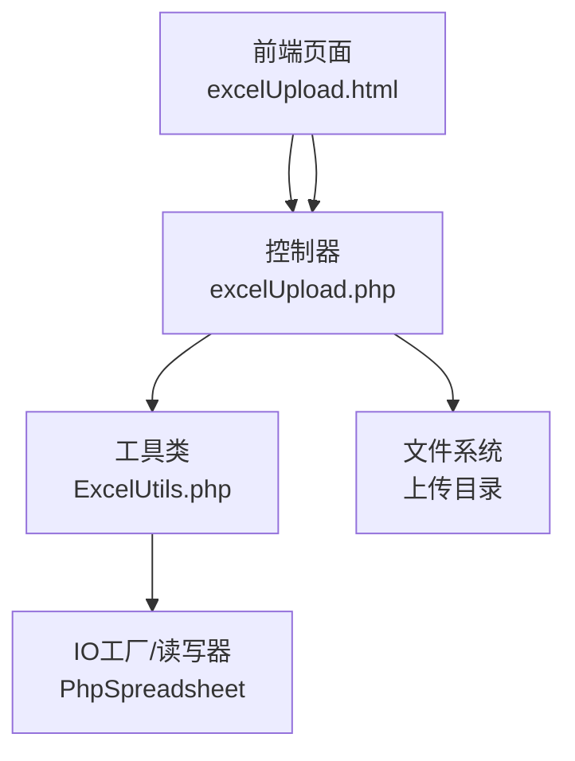
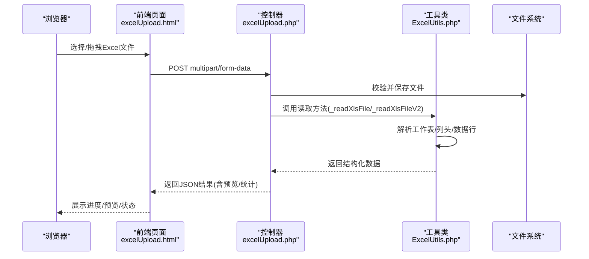
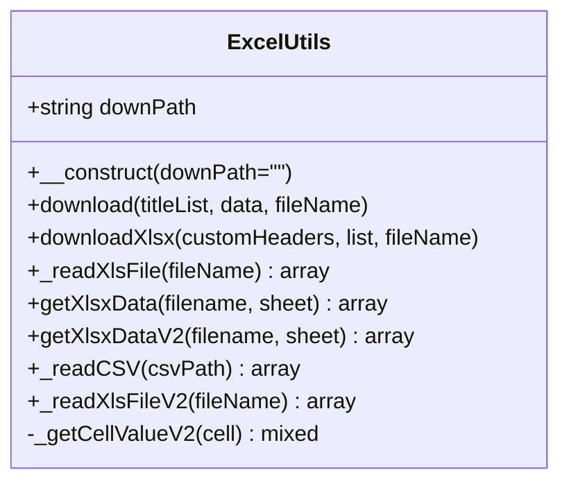
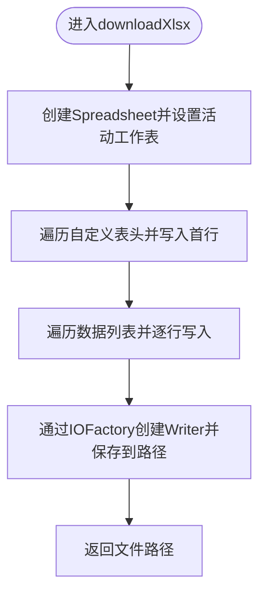
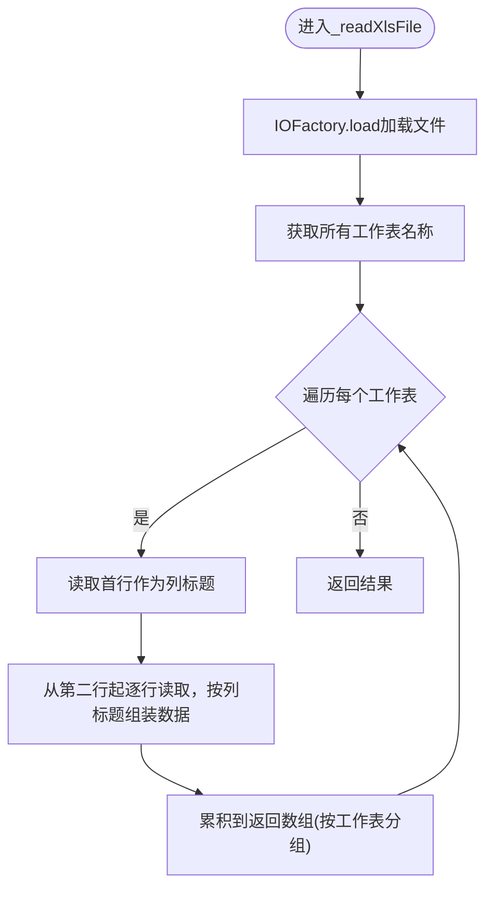
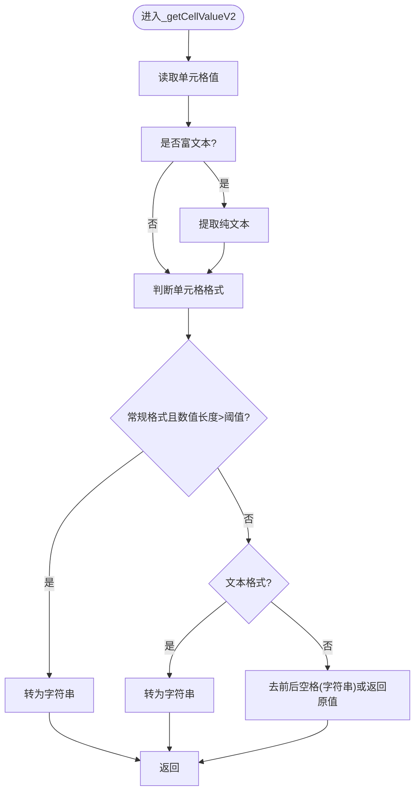

# Excel文件处理

<cite>
**本文引用的文件**
- [ExcelUtils.php](file://php/utils/ExcelUtils.php)
- [excelUpload.php](file://php/controller/excelUpload.php)
- [excelUpload.html](file://template/excelUpload.html)
- [upload.php](file://php/controller/upload.php)
- [skuImportSync.php](file://php/controller/skuImportSync.php)
</cite>

## 更新摘要
**变更内容**
- 更新了ExcelUtils类的导出路径配置，从相对路径改为项目根目录结构
- 新增了导出路径配置的详细说明和最佳实践
- 补充了路径配置变更对系统架构的影响分析

## 目录
1. [简介](#简介)
2. [项目结构](#项目结构)
3. [核心组件](#核心组件)
4. [架构总览](#架构总览)
5. [详细组件分析](#详细组件分析)
6. [依赖关系分析](#依赖关系分析)
7. [性能考虑](#性能考虑)
8. [故障排查指南](#故障排查指南)
9. [结论](#结论)
10. [附录](#附录)

## 简介
本文件面向PaSystem的Excel文件处理能力，围绕ExcelUtils工具类展开，系统性阐述其对xlsx/xls格式的支持、CSV读取、多工作表读取、数据导入导出机制（download与downloadXlsx）、长数字处理策略（避免科学计数法导致的数据丢失）、单元格值获取与格式处理逻辑，并提供Excel模板使用指南、最佳实践、错误处理机制与性能优化建议。同时通过流程图与序列图直观展示关键调用链路与数据流。

**更新** 本次更新重点关注ExcelUtils类的导出路径配置优化，从相对路径配置升级为项目根目录结构，提升了系统的可维护性和部署灵活性。

## 项目结构
与Excel处理相关的关键模块分布如下：
- 工具层：php/utils/ExcelUtils.php 提供统一的Excel/CSV读写与单元格值处理能力
- 控制器层：php/controller/excelUpload.php 负责文件上传校验、读取与返回前端所需数据
- 前端页面：template/excelUpload.html 提供拖拽/多文件上传、进度反馈、数据预览
- 其他控制器：php/controller/upload.php、php/controller/skuImportSync.php 展示了ExcelUtils在不同业务场景下的使用方式

**图表来源**
- [excelUpload.php](file://php/controller/excelUpload.php#L1-L372)
- [ExcelUtils.php](file://php/utils/ExcelUtils.php#L1-L398)
- [excelUpload.html](file://template/excelUpload.html#L1-L472)

**章节来源**
- [ExcelUtils.php](file://php/utils/ExcelUtils.php#L1-L398)
- [excelUpload.php](file://php/controller/excelUpload.php#L1-L372)
- [excelUpload.html](file://template/excelUpload.html#L1-L472)

## 核心组件
- ExcelUtils：封装Excel/CSV读写、单元格值处理、长数字保护、多工作表读取等
- excelUpload控制器：负责文件上传校验、移动文件、调用ExcelUtils读取数据、返回前端所需结构
- 前端excelUpload.html：提供拖拽上传、多文件选择、进度条、数据预览与交互

**更新** 导出路径配置已从相对路径优化为项目根目录结构，提升了路径解析的准确性和系统稳定性。

**章节来源**
- [ExcelUtils.php](file://php/utils/ExcelUtils.php#L20-L398)
- [excelUpload.php](file://php/controller/excelUpload.php#L11-L328)
- [excelUpload.html](file://template/excelUpload.html#L112-L472)

## 架构总览
下图展示了从前端上传到后端读取、解析并返回数据的整体流程：

**图表来源**
- [excelUpload.html](file://template/excelUpload.html#L342-L397)
- [excelUpload.php](file://php/controller/excelUpload.php#L35-L95)
- [ExcelUtils.php](file://php/utils/ExcelUtils.php#L147-L181)

## 详细组件分析

### ExcelUtils工具类
ExcelUtils基于PhpSpreadsheet实现，具备以下能力：
- 下载导出
  - download：以xls格式写入，适合兼容旧版Excel；写入标题行与数据行，保存至本地路径
  - downloadXlsx：以xlsx格式写入，支持自定义表头与数据列表，返回保存路径
- Excel读取
  - _readXlsFile：读取xlsx/xls，支持多工作表；逐列读取表头，逐行读取数据，返回按工作表分组的二维数组
  - getXlsxData/getXlsxDataV2：便捷方法，按指定工作表或返回全部工作表数据
  - _readXlsFileV2：增强版读取，使用_getCellValueV2统一处理富文本、长数字与格式
- CSV读取
  - _readCSV：读取CSV，设置输入编码与分隔符；对长数字列进行强制文本处理，避免科学计数法丢失
- 路径配置
  - __construct：构造函数中使用__DIR__和../../../export/构建项目根目录结构的导出路径

**更新** 导出路径配置已从相对路径优化为项目根目录结构，使用__DIR__常量确保路径解析的准确性。

**图表来源**
- [ExcelUtils.php](file://php/utils/ExcelUtils.php#L20-L398)

**章节来源**
- [ExcelUtils.php](file://php/utils/ExcelUtils.php#L24-L28)
- [ExcelUtils.php](file://php/utils/ExcelUtils.php#L46-L138)
- [ExcelUtils.php](file://php/utils/ExcelUtils.php#L147-L181)
- [ExcelUtils.php](file://php/utils/ExcelUtils.php#L190-L208)
- [ExcelUtils.php](file://php/utils/ExcelUtils.php#L246-L311)
- [ExcelUtils.php](file://php/utils/ExcelUtils.php#L315-L359)
- [ExcelUtils.php](file://php/utils/ExcelUtils.php#L366-L394)

### 数据导入导出机制
- download方法
  - 功能：将标题与数据写入xls文件，保存到本地路径
  - 流程要点：移除默认Sheet、创建新Sheet、写入表头与数据行、保存文件
- downloadXlsx方法
  - 功能：将标题与数据写入xlsx文件，返回保存路径
  - 流程要点：创建Spreadsheet、设置活动工作表、写入表头与数据、通过IOFactory创建Writer并保存
  - **更新** 路径配置使用项目根目录结构，确保导出文件的准确位置

**图表来源**
- [ExcelUtils.php](file://php/utils/ExcelUtils.php#L98-L138)

**章节来源**
- [ExcelUtils.php](file://php/utils/ExcelUtils.php#L46-L86)
- [ExcelUtils.php](file://php/utils/ExcelUtils.php#L98-L138)

### 多工作表读取与CSV处理
- 多工作表读取
  - _readXlsFile：获取所有工作表名称，逐表读取最高行/列，第一行作为列标题，后续行作为数据行，返回按工作表分组的数组
  - getXlsxData/getXlsxDataV2：若仅一个工作表则返回该工作表数据，否则返回全部工作表数据
- CSV处理
  - _readCSV：设置输入编码与分隔符，读取所有行；对指定列（如D/E列）强制文本格式，对长数字统一转为字符串，避免科学计数法丢失

**图表来源**
- [ExcelUtils.php](file://php/utils/ExcelUtils.php#L147-L181)

**章节来源**
- [ExcelUtils.php](file://php/utils/ExcelUtils.php#L147-L181)
- [ExcelUtils.php](file://php/utils/ExcelUtils.php#L190-L208)
- [ExcelUtils.php](file://php/utils/ExcelUtils.php#L246-L311)

### 单元格值获取与格式处理
- _getCellValueV2：统一处理富文本（提取纯文本）、常规/文本格式下的数值转字符串、去除前后空格
- 长数字保护：当单元格格式为常规且数值长度超过阈值，或显式文本格式时，强制以字符串形式保留原始值

**图表来源**
- [ExcelUtils.php](file://php/utils/ExcelUtils.php#L366-L394)

**章节来源**
- [ExcelUtils.php](file://php/utils/ExcelUtils.php#L366-L394)

### 错误处理机制
- 控制器层
  - excelUpload.php：对上传错误码映射、文件大小与扩展名校验、读取异常捕获、返回统一JSON结构
  - upload.php：多文件循环处理，逐个文件返回结果
  - skuImportSync.php：保存失败时记录详细原因（目录不可写、临时文件无效等），并清理临时文件
- 工具类层
  - _readCSV：异常捕获并输出错误信息
  - _readXlsFile/_readXlsFileV2：通过PhpSpreadsheet加载与读取，异常向上抛出由调用方处理

**章节来源**
- [excelUpload.php](file://php/controller/excelUpload.php#L102-L140)
- [excelUpload.php](file://php/controller/excelUpload.php#L148-L238)
- [upload.php](file://php/controller/upload.php#L39-L87)
- [skuImportSync.php](file://php/controller/skuImportSync.php#L192-L266)
- [ExcelUtils.php](file://php/utils/ExcelUtils.php#L308-L311)

### 性能优化建议
- 内存管理
  - 使用PhpSpreadsheet自带的内存管理，避免手动设置缓存；对于超大文件可结合分页读取策略（如逐行读取）
- I/O与并发
  - 控制器层限制单次上传大小，避免内存峰值过高；批量上传时串行或受控并发，避免磁盘争用
- 写入策略
  - downloadXlsx优先使用xlsx格式，提升兼容性与性能；download用于兼容旧版环境
- 长数字处理
  - 在读取阶段即进行字符串化，减少后续数据处理成本
- **更新** 路径配置优化
  - 使用项目根目录结构的导出路径，避免相对路径解析错误
  - 确保导出目录具有适当的写入权限

**章节来源**
- [ExcelUtils.php](file://php/utils/ExcelUtils.php#L150-L153)
- [excelUpload.php](file://php/controller/excelUpload.php#L19-L21)

### 实际使用场景与示例路径
- 前端上传与预览
  - 前端页面：template/excelUpload.html
  - 控制器：php/controller/excelUpload.php
  - 示例调用：前端通过axios提交multipart/form-data，控制器接收文件并调用ExcelUtils读取
- 数据导出
  - 使用ExcelUtils::downloadXlsx生成xlsx文件，返回保存路径
  - **更新** 导出路径使用项目根目录结构，确保文件保存到正确的export目录
- SKU导入同步
  - 控制器php/controller/skuImportSync.php展示如何保存文件、调用ExcelUtils读取并提取SKU列表

**章节来源**
- [excelUpload.html](file://template/excelUpload.html#L342-L397)
- [excelUpload.php](file://php/controller/excelUpload.php#L35-L95)
- [ExcelUtils.php](file://php/utils/ExcelUtils.php#L98-L138)
- [skuImportSync.php](file://php/controller/skuImportSync.php#L212-L235)

## 依赖关系分析
- 组件耦合
  - 控制器依赖ExcelUtils；ExcelUtils依赖PhpSpreadsheet库
- 外部依赖
  - PhpSpreadsheet：读写xlsx/xls/csv，坐标转换、样式与格式处理
- 潜在风险
  - 多工作表读取时内存占用随工作表数量与数据规模增长；需配合分页/流式读取策略
- **更新** 路径配置影响
  - 项目根目录结构确保导出路径的一致性
  - 避免因相对路径解析导致的文件保存位置错误

**图表来源**
- [excelUpload.php](file://php/controller/excelUpload.php#L1-L27)
- [ExcelUtils.php](file://php/utils/ExcelUtils.php#L1-L14)
- [excelUpload.html](file://template/excelUpload.html#L1-L472)

**章节来源**
- [excelUpload.php](file://php/controller/excelUpload.php#L1-L27)
- [ExcelUtils.php](file://php/utils/ExcelUtils.php#L1-L14)

## 性能考虑
- 读取策略
  - 对于超大文件，建议采用逐行读取或分块读取，降低内存峰值
- 写入策略
  - 优先使用xlsx格式；仅在需要兼容旧版时使用xls
- 编码与分隔符
  - CSV读取时明确输入编码与分隔符，避免二次转换带来的性能损耗
- 长数字处理
  - 在读取阶段统一字符串化，减少后续类型转换成本
- **更新** 路径配置优化
  - 项目根目录结构的路径解析更加高效和准确
  - 减少路径解析错误导致的性能损失

## 故障排查指南
- 上传失败
  - 检查上传错误码映射与消息提示；确认文件大小与扩展名限制
- 读取为空
  - 确认工作表是否存在数据；检查表头行与数据行偏移是否正确
- 长数字丢失
  - 确认CSV读取时对长数字列进行了强制文本处理；或在Excel中将相应列为文本格式
- 权限问题
  - 确认上传目录可写；保存失败时记录详细原因
- **更新** 导出路径问题
  - 检查导出目录是否存在且具有写入权限
  - 确认项目根目录结构正确，避免相对路径解析错误
  - 验证__DIR__常量解析的路径是否符合预期

**章节来源**
- [excelUpload.php](file://php/controller/excelUpload.php#L102-L140)
- [excelUpload.php](file://php/controller/excelUpload.php#L148-L238)
- [ExcelUtils.php](file://php/utils/ExcelUtils.php#L246-L311)
- [skuImportSync.php](file://php/controller/skuImportSync.php#L192-L209)

## 结论
ExcelUtils提供了稳定、可扩展的Excel/CSV处理能力，覆盖多工作表读取、长数字保护与格式处理等关键需求。结合控制器层的文件校验与前端页面的交互体验，形成完整的上传、解析与预览闭环。

**更新** 最新的路径配置优化进一步提升了系统的可靠性和可维护性，项目根目录结构的导出路径配置确保了文件保存位置的准确性。建议在生产环境中配合分页读取、权限校验与日志监控，持续优化性能与稳定性。

## 附录

### Excel文件模板使用指南与最佳实践
- 模板准备
  - 表头建议使用第一行，确保与业务字段一致
  - 对长数字列（如订单号、SKU等）在Excel中设置为"文本"格式，或在读取时强制文本处理
- 读取最佳实践
  - 多工作表场景：先获取工作表名称列表，再按需读取目标工作表
  - 大文件：采用分页/流式读取，避免一次性加载
- 导出最佳实践
  - 优先使用xlsx格式；如需兼容旧版系统再回退xls
  - 导出前统一数据类型，避免格式混乱
  - **更新** 确保导出目录具有适当的写入权限
  - 验证项目根目录结构，确保导出路径配置正确

### API与方法参考
- 导出
  - download(titleList, data, fileName)：xls导出
  - downloadXlsx(customHeaders, list, fileName)：xlsx导出，返回文件路径
- 读取
  - _readXlsFile(fileName)：多工作表读取
  - getXlsxData(filename, sheet) / getXlsxDataV2(filename, sheet)：便捷读取
  - _readCSV(csvPath)：CSV读取，强制文本处理长数字
  - _getCellValueV2(cell)：统一单元格值处理
- **更新** 路径配置
  - __construct(downPath="")：构造函数，使用项目根目录结构配置导出路径

**章节来源**
- [ExcelUtils.php](file://php/utils/ExcelUtils.php#L24-L28)
- [ExcelUtils.php](file://php/utils/ExcelUtils.php#L46-L138)
- [ExcelUtils.php](file://php/utils/ExcelUtils.php#L147-L181)
- [ExcelUtils.php](file://php/utils/ExcelUtils.php#L190-L208)
- [ExcelUtils.php](file://php/utils/ExcelUtils.php#L246-L311)
- [ExcelUtils.php](file://php/utils/ExcelUtils.php#L366-L394)