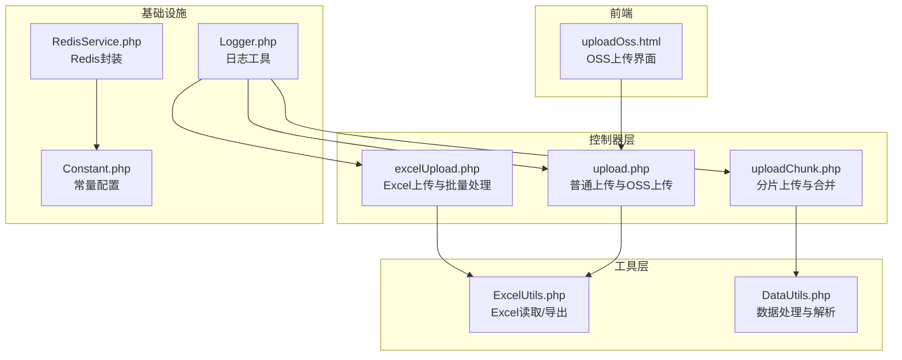
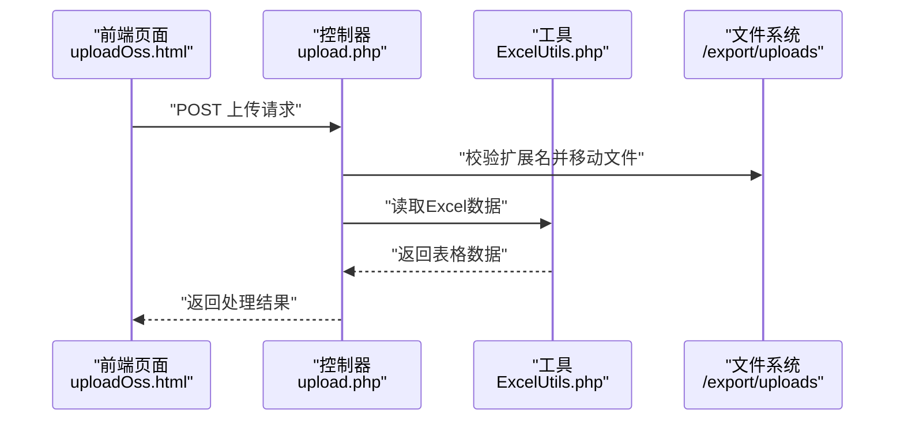
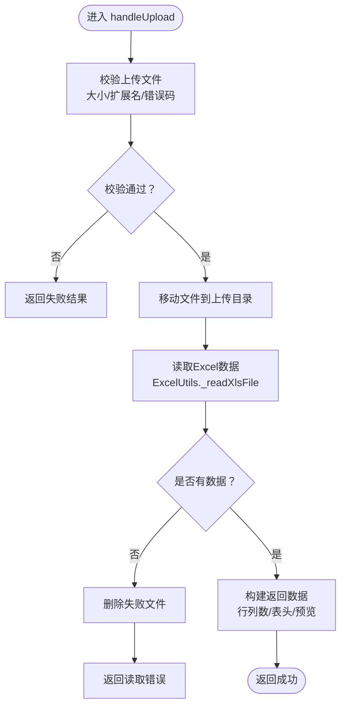
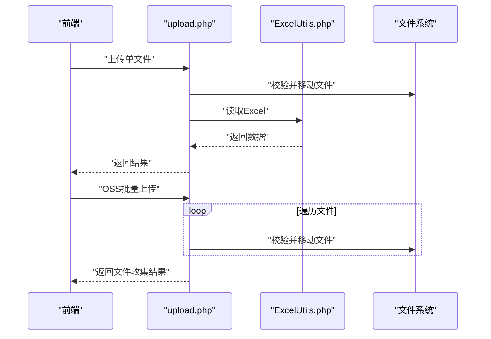
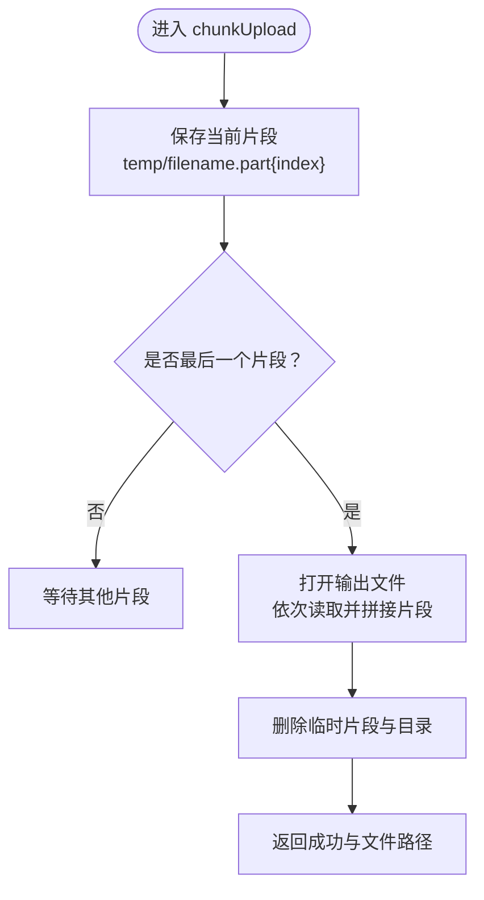
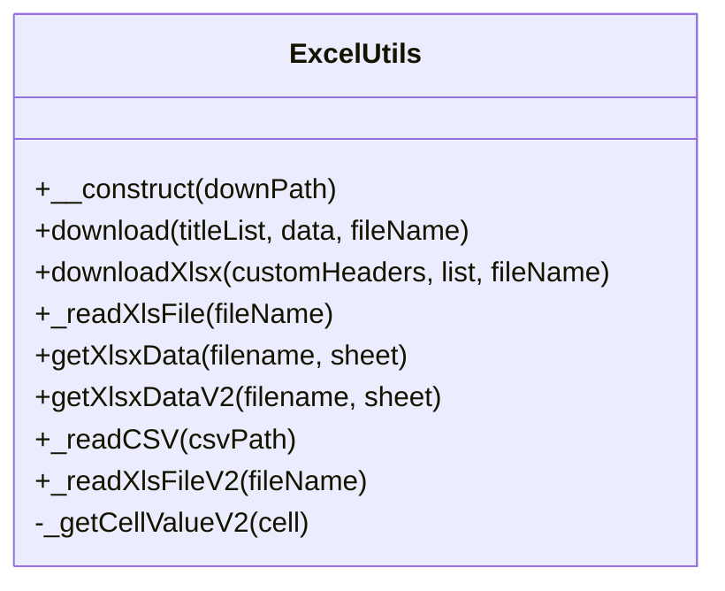
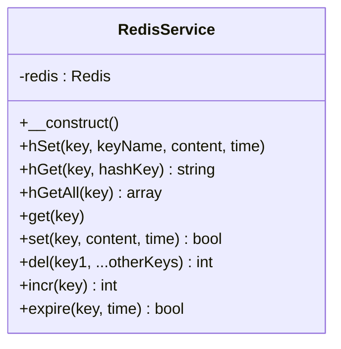
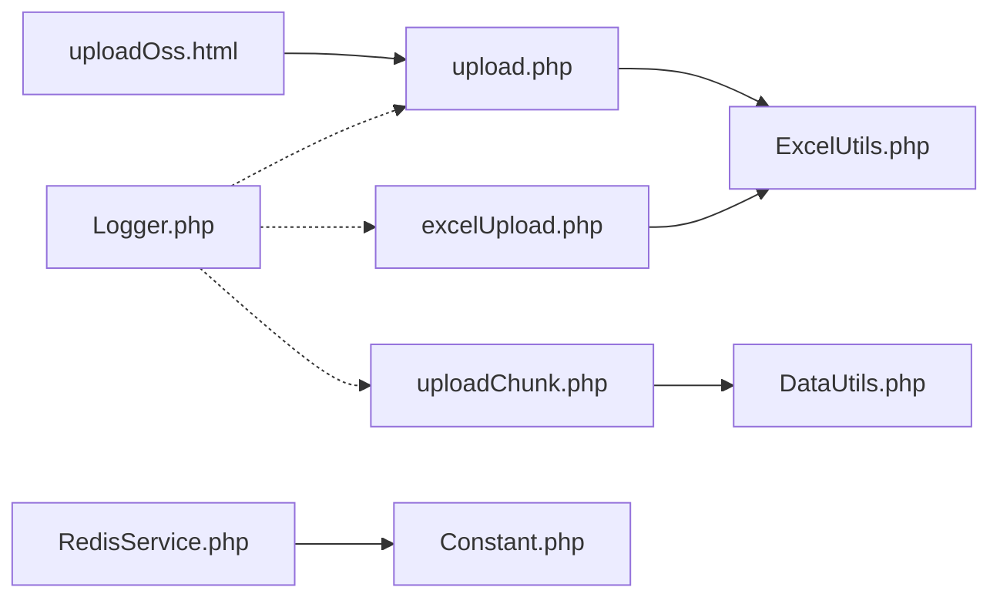

# 批量数据处理

<cite>
**本文引用的文件**
- [excelUpload.php](file://php/controller/excelUpload.php)
- [upload.php](file://php/controller/upload.php)
- [uploadChunk.php](file://php/controller/uploadChunk.php)
- [ExcelUtils.php](file://php/utils/ExcelUtils.php)
- [RedisService.php](file://php/redis/RedisService.php)
- [Constant.php](file://php/constant/Constant.php)
- [Logger.php](file://php/class/Logger.php)
- [DataUtils.php](file://php/utils/DataUtils.php)
- [uploadOss.html](file://template/fix/uploadOss.html)
</cite>

## 目录
1. [简介](#简介)
2. [项目结构](#项目结构)
3. [核心组件](#核心组件)
4. [架构总览](#架构总览)
5. [详细组件分析](#详细组件分析)
6. [依赖关系分析](#依赖关系分析)
7. [性能考虑](#性能考虑)
8. [故障排查指南](#故障排查指南)
9. [结论](#结论)
10. [附录](#附录)

## 简介
本文件面向PaSystem的批量数据处理系统，围绕以下目标展开：任务队列管理、并发控制、资源调度、Shell脚本系统（自动化批处理、定时任务、错误处理）、文件上传与处理机制（大文件分片上传、进度跟踪、断点续传）、批量处理性能优化与资源限制、监控与日志记录、典型场景与最佳实践、故障恢复与数据回滚策略。文档基于仓库现有代码进行分析与总结，并提供可视化图示帮助理解。

## 项目结构
PaSystem的批量处理相关能力主要分布在如下模块：
- 控制器层：负责HTTP请求接入与批量流程编排（excelUpload.php、upload.php、uploadChunk.php）
- 工具层：文件读写与解析（ExcelUtils.php）、通用数据处理（DataUtils.php）
- 缓存与配置：Redis服务封装（RedisService.php）、常量配置（Constant.php）
- 日志：基础日志工具（Logger.php）
- 前端模板：OSS上传页面（uploadOss.html）

图表来源
- [excelUpload.php](file://php/controller/excelUpload.php#L1-L372)
- [upload.php](file://php/controller/upload.php#L1-L138)
- [uploadChunk.php](file://php/controller/uploadChunk.php#L1-L86)
- [ExcelUtils.php](file://php/utils/ExcelUtils.php#L1-L398)
- [DataUtils.php](file://php/utils/DataUtils.php#L1-L802)
- [RedisService.php](file://php/redis/RedisService.php#L1-L77)
- [Constant.php](file://php/constant/Constant.php#L1-L26)
- [Logger.php](file://php/class/Logger.php#L1-L55)
- [uploadOss.html](file://template/fix/uploadOss.html#L255-L326)

章节来源
- [excelUpload.php](file://php/controller/excelUpload.php#L1-L372)
- [upload.php](file://php/controller/upload.php#L1-L138)
- [uploadChunk.php](file://php/controller/uploadChunk.php#L1-L86)
- [ExcelUtils.php](file://php/utils/ExcelUtils.php#L1-L398)
- [DataUtils.php](file://php/utils/DataUtils.php#L1-L802)
- [RedisService.php](file://php/redis/RedisService.php#L1-L77)
- [Constant.php](file://php/constant/Constant.php#L1-L26)
- [Logger.php](file://php/class/Logger.php#L1-L55)
- [uploadOss.html](file://template/fix/uploadOss.html#L255-L326)

## 核心组件
- Excel上传与批量处理控制器：支持单文件/多文件上传、Excel读取、预览、统计、错误处理与汇总结果输出。
- 普通上传与OSS上传控制器：支持单文件上传、批量文件收集、扩展名校验、移动至目标目录。
- 分片上传控制器：支持多片段上传、临时目录管理、片段合并、最终文件生成。
- Excel工具：基于PhpSpreadsheet读取Excel/CVS，处理长数字、富文本、列标题映射等。
- Redis服务：提供哈希、字符串、自增、过期等常用操作，便于任务状态与元数据存储。
- 日志工具：统一日志落盘与错误输出，便于批量处理过程追踪。
- 数据工具：提供数组处理、去重、字段提取、参数解析等通用能力。

章节来源
- [excelUpload.php](file://php/controller/excelUpload.php#L11-L328)
- [upload.php](file://php/controller/upload.php#L4-L124)
- [uploadChunk.php](file://php/controller/uploadChunk.php#L4-L80)
- [ExcelUtils.php](file://php/utils/ExcelUtils.php#L20-L398)
- [RedisService.php](file://php/redis/RedisService.php#L7-L77)
- [Logger.php](file://php/class/Logger.php#L14-L54)
- [DataUtils.php](file://php/utils/DataUtils.php#L7-L802)

## 架构总览
批量处理系统采用“控制器-工具-基础设施”的分层设计：
- 控制器负责请求接入与流程编排，调用工具层完成具体任务。
- 工具层提供文件读写、数据处理等能力，降低控制器复杂度。
- 基础设施层提供Redis与常量配置，支撑状态管理与运行参数。
- 前端模板通过HTTP接口与控制器交互，驱动批量上传与处理。

图表来源
- [upload.php](file://php/controller/upload.php#L15-L60)
- [ExcelUtils.php](file://php/utils/ExcelUtils.php#L147-L181)
- [uploadOss.html](file://template/fix/uploadOss.html#L255-L326)

## 详细组件分析

### Excel上传与批量处理控制器
职责与特性：
- 单文件/多文件上传：验证文件大小与扩展名，生成唯一文件名，移动至上传目录。
- Excel读取：使用ExcelUtils读取首个工作表，提取表头与数据行，支持预览行数配置。
- 批量处理：循环处理每个文件，汇总成功/失败数量与结果。
- 错误处理：捕获异常并返回统一结构，必要时清理上传失败文件。

图表来源
- [excelUpload.php](file://php/controller/excelUpload.php#L35-L95)
- [excelUpload.php](file://php/controller/excelUpload.php#L102-L140)
- [excelUpload.php](file://php/controller/excelUpload.php#L148-L238)
- [ExcelUtils.php](file://php/utils/ExcelUtils.php#L147-L181)

章节来源
- [excelUpload.php](file://php/controller/excelUpload.php#L11-L328)

### 普通上传与OSS上传控制器
职责与特性：
- 单文件上传：校验错误码与扩展名，生成唯一文件名，移动至目标目录，读取Excel数据返回。
- OSS批量上传：遍历多文件，逐个校验与移动，收集结果列表，支持后续业务处理。

图表来源
- [upload.php](file://php/controller/upload.php#L15-L60)
- [upload.php](file://php/controller/upload.php#L63-L121)
- [ExcelUtils.php](file://php/utils/ExcelUtils.php#L147-L181)

章节来源
- [upload.php](file://php/controller/upload.php#L4-L124)

### 分片上传控制器
职责与特性：
- 分片接收：根据filename、chunkIndex、totalChunks保存当前片段至临时目录。
- 片段合并：当最后一个片段到达时，按顺序拼接所有片段，生成最终文件并清理临时目录。
- 结果返回：返回最终文件路径与收集信息。

图表来源
- [uploadChunk.php](file://php/controller/uploadChunk.php#L15-L78)

章节来源
- [uploadChunk.php](file://php/controller/uploadChunk.php#L4-L80)

### Excel工具（ExcelUtils）
职责与特性：
- 读取Excel：支持xlsx/xls，遍历所有工作表，按行/列读取，生成关联数组。
- 读取CSV：设置编码与分隔符，处理长数字与文本列格式。
- 单元格值处理：针对长数字与富文本进行格式化，避免科学计数法丢失精度。
- 导出：提供xlsx导出能力，便于批量处理结果下载。

图表来源
- [ExcelUtils.php](file://php/utils/ExcelUtils.php#L20-L398)

章节来源
- [ExcelUtils.php](file://php/utils/ExcelUtils.php#L147-L398)

### Redis服务（RedisService）
职责与特性：
- 提供hSet/hGet/hGetAll/get/set/del/incr/expire等常用操作。
- 与常量配置结合，用于任务状态、元数据、缓存等场景。

图表来源
- [RedisService.php](file://php/redis/RedisService.php#L7-L77)
- [Constant.php](file://php/constant/Constant.php#L4-L6)

章节来源
- [RedisService.php](file://php/redis/RedisService.php#L1-L77)
- [Constant.php](file://php/constant/Constant.php#L1-L26)

### 日志工具（Logger）
职责与特性：
- 统一日志文件命名（按日期），支持写入与错误输出，便于批量处理过程追踪。

章节来源
- [Logger.php](file://php/class/Logger.php#L14-L54)

### 数据工具（DataUtils）
职责与特性：
- 提供数组处理、去重、字段提取、参数解析等通用能力，支撑批量处理数据清洗与转换。

章节来源
- [DataUtils.php](file://php/utils/DataUtils.php#L1-L802)

## 依赖关系分析
- 控制器依赖工具层：excelUpload.php与upload.php均依赖ExcelUtils进行文件读取。
- 控制器依赖基础设施：RedisService与Constant用于状态与配置管理。
- 前端模板依赖控制器：uploadOss.html通过POST请求驱动upload.php执行批量上传与处理。

图表来源
- [excelUpload.php](file://php/controller/excelUpload.php#L1-L10)
- [upload.php](file://php/controller/upload.php#L1-L5)
- [uploadChunk.php](file://php/controller/uploadChunk.php#L1-L2)
- [ExcelUtils.php](file://php/utils/ExcelUtils.php#L1-L15)
- [DataUtils.php](file://php/utils/DataUtils.php#L1-L7)
- [RedisService.php](file://php/redis/RedisService.php#L1-L2)
- [Constant.php](file://php/constant/Constant.php#L1-L6)
- [Logger.php](file://php/class/Logger.php#L1-L8)
- [uploadOss.html](file://template/fix/uploadOss.html#L255-L326)

章节来源
- [excelUpload.php](file://php/controller/excelUpload.php#L1-L10)
- [upload.php](file://php/controller/upload.php#L1-L5)
- [uploadChunk.php](file://php/controller/uploadChunk.php#L1-L2)
- [ExcelUtils.php](file://php/utils/ExcelUtils.php#L1-L15)
- [DataUtils.php](file://php/utils/DataUtils.php#L1-L7)
- [RedisService.php](file://php/redis/RedisService.php#L1-L2)
- [Constant.php](file://php/constant/Constant.php#L1-L6)
- [Logger.php](file://php/class/Logger.php#L1-L8)
- [uploadOss.html](file://template/fix/uploadOss.html#L255-L326)

## 性能考虑
- Excel读取优化
  - 使用PhpSpreadsheet按需读取，避免一次性加载整表导致内存峰值过高。
  - 对长数字列采用文本格式读取，防止科学计数法丢失精度。
- 批量处理策略
  - 多文件上传时建议分批处理，控制单次处理的文件数量，避免阻塞。
  - 对大文件优先采用分片上传，减少单次传输失败风险。
- 缓存与状态
  - 使用Redis缓存任务元数据与中间状态，降低重复计算与IO压力。
- I/O与磁盘
  - 上传目录与临时目录分离，及时清理临时文件，避免磁盘空间占用。
- 并发与资源限制
  - 控制同时处理的文件数量，结合Redis自增实现简单令牌桶限流。
  - 对外部接口调用增加超时与重试策略，避免长时间阻塞。

## 故障排查指南
- 上传失败
  - 检查上传错误码与扩展名校验，确认文件大小未超过限制。
  - 查看日志文件定位具体异常位置。
- Excel读取异常
  - 确认Excel文件格式与编码，检查表头与数据行是否为空。
  - 对长数字列进行文本格式处理后再读取。
- 分片上传未合并
  - 确认所有片段均已上传，检查临时目录权限与磁盘空间。
  - 核对filename、chunkIndex、totalChunks参数一致性。
- Redis相关
  - 检查连接参数与认证信息，确认键空间与过期策略配置正确。
- 日志记录
  - 日志文件按日期命名，定位批量处理关键节点与异常堆栈。

章节来源
- [excelUpload.php](file://php/controller/excelUpload.php#L102-L140)
- [ExcelUtils.php](file://php/utils/ExcelUtils.php#L246-L311)
- [uploadChunk.php](file://php/controller/uploadChunk.php#L15-L78)
- [RedisService.php](file://php/redis/RedisService.php#L15-L19)
- [Logger.php](file://php/class/Logger.php#L17-L25)

## 结论
PaSystem的批量数据处理系统以控制器-工具-基础设施三层架构为基础，实现了Excel上传、分片上传、数据读取与导出、Redis状态管理与日志记录等能力。通过合理的文件处理流程与工具封装，能够支撑中小规模的批量任务。建议在生产环境中进一步完善任务队列、并发控制、资源限制与监控告警体系，以提升稳定性与可观测性。

## 附录

### 实际批量处理场景与最佳实践
- 场景一：大批量Excel导入
  - 建议：前端分批选择文件，后端分批处理，每批控制在合理数量以内；开启预览功能核对表头与数据。
  - 参考路径：[excelUpload.php](file://php/controller/excelUpload.php#L246-L289)
- 场景二：OSS批量文件导入
  - 建议：前端逐个文件提交，后端批量收集并移动至目标目录；完成后统一触发处理流程。
  - 参考路径：[upload.php](file://php/controller/upload.php#L63-L121)，[uploadOss.html](file://template/fix/uploadOss.html#L255-L326)
- 场景三：大文件断点续传
  - 建议：前端按固定大小切片，后端按序拼接；失败时仅重传缺失片段；使用Redis记录已上传片段。
  - 参考路径：[uploadChunk.php](file://php/controller/uploadChunk.php#L15-L78)

### 故障恢复与数据回滚策略
- 回滚思路
  - 对于导入成功的数据，建立“备份批次号/时间戳”标识，失败时依据标识回滚。
  - 对于文件层面，保留原始上传文件副本，便于重新导入。
- 断点续传
  - 使用Redis记录已上传片段索引，失败后仅重传缺失片段。
- 事务与幂等
  - 对关键写入操作采用幂等键，避免重复处理造成数据重复。